# ESP32-S3-WROOM-1
ESP32-S3-WROOM-1U

技术规格书

2.4 GHz Wi-Fi (802.11 b/g/n) + Bluetooth® 5 (LE) 模组
内置 ESP32-S3 系列芯片，Xtensa® 双核 32 位 LX7 处理器
Flash 最大可选 16 MB，PSRAM 最大可选 16 MB
最多 36 个 GPIO，丰富的外设
板载 PCB 天线或外部天线连接器

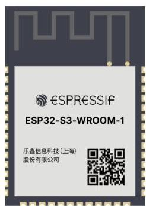
ESP32-S3-WROOM-1

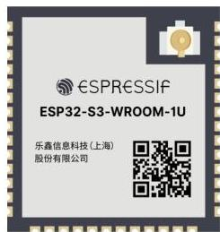
ESP32-S3-WROOM-1U

版本 1.3
乐鑫信息科技
版权 © 2023

# 1 模组概述

## 说明：

点击链接或扫描二维码确保您使用的是最新版本的文档：

https://www.espressif.com/documentation/esp32-s3-wroom-1_wroom-1u_datasheet_cn.pdf

## 1.1 特性

### CPU 和片上存储器

- 内置 ESP32-S3 系列芯片，Xtensa® 双核 32 位 LX7 微处理器 (支持单精度浮点运算单元)，支持高达 240 MHz 的时钟频率
- 384 KB ROM
- 512 KB SRAM
- 16 KB RTC SRAM
- 最大 16 MB PSRAM

### Wi-Fi

- 802.11 b/g/n
- 802.11n 模式下数据速率高达 150 Mbps
- 帧聚合 (TX/RX A-MPDU, TX/RX A-MSDU)
- 0.4 μs 保护间隔
- 工作信道中心频率范围：2412 ~ 2484 MHz

### 蓝牙

- 低功耗蓝牙 (Bluetooth LE): Bluetooth 5, Bluetooth mesh
- 速率支持 125 Kbps、500 Kbps、1 Mbps、2 Mbps
- 广播扩展 (Advertising Extensions)
- 多广播 (Multiple Advertisement Sets)
- 信道选择 (Channel Selection Algorithm #2)
- Wi-Fi 与蓝牙共存，共用同一个天线

### 外设

- GPIO、SPI、LCD、Camera 接口、UART、I2C、I2S、红外遥控、脉冲计数器、LED PWM、全速 USB 2.0 OTG、USB Serial/JTAG 控制器、MCPWM、

SDIO 主机接口、GDMA、TWAI® 控制器 (兼容 ISO 11898-1)、ADC、触摸传感器、温度传感器、定时器和看门狗

## 说明：

* 有关模组外设的详细信息，请参考 《ESP32-S3 系列芯片技术规格书》。

## 模组集成元件

- 40 MHz 集成晶振
- 最大 16 MB Quad SPI flash

## 天线选型

- 板载 PCB 天线 (ESP32-S3-WROOM-1)
- 通过连接器连接外部天线 (ESP32-S3-WROOM-1U)

## 工作条件

- 工作电压/供电电压：3.0 ~ 3.6 V
- 工作环境温度：
- 65 °C 版模组：-40 ~ 65 °C
- 85 °C 版模组：-40 ~ 85 °C
- 105 °C 版模组：-40 ~ 105 °C

## 认证

- RF 认证：见证书
- 环保认证：RoHS/REACH

## 测试

- HTOL/HTSL/uHAST/TCT/ESD

# 1.2 描述

ESP32-S3-WROOM-1 和 ESP32-S3-WROOM-1U 是两款通用型 Wi-Fi + 低功耗蓝牙 MCU 模组，搭载 ESP32-S3 系列芯片。除具有丰富的外设接口外，模组还拥有强大的神经网络运算能力和信号处理能力，适用于 AloT 领域的多种应用场景，例如唤醒词检测和语音命令识别、人脸检测和识别、智能家居、智能家电、智能控制面板、智能扬声器等。

ESP32-S3-WROOM-1 采用 PCB 板载天线，ESP32-S3-WROOM-1U 采用连接器连接外部天线。两款模组均有多种型号可供选择，具体见表 1 和 2。其中，ESP32-S3-WROOM-1-H4 和 ESP32-S3-WROOM-1U-H4 的工作环境温度为 -40 ~ 105 °C，内置 ESP32-S3R8 和 ESP32-S3R16V 的模组工作环境温度为 -40 ~ 65 °C，其他型号的工作环境温度均为 -40 ~ 85 °C。请注意，针对 R8 和 R16V 系列模组 (内置 Octal SPI PSRAM)，若开启 PSRAM ECC 功能，模组最大环境温度可以提高到 85 °C，但是 PSRAM 的可用容量将减少 1/16。

表 1: ESP32-S3-WROOM-1 系列型号对比¹

|  订购代码² | Flash³,⁴ | PSRAM⁵ | 环境温度⁶ (°C) | 模组尺寸⁷ (mm)  |
| --- | --- | --- | --- | --- |
|  ESP32-S3-WROOM-1-N4 | 4 MB (Quad SPI) | - | -40 ~ 85 | 18.0 × 25.5 × 3.1  |
|  ESP32-S3-WROOM-1-N8 | 8 MB (Quad SPI) | - | -40 ~ 85  |   |
|  ESP32-S3-WROOM-1-N16 | 16 MB (Quad SPI) | - | -40 ~ 85  |   |
|  ESP32-S3-WROOM-1-H4 | 4 MB (Quad SPI) | - | -40 ~ 105  |   |
|  ESP32-S3-WROOM-1-N4R2 | 4 MB (Quad SPI) | 2 MB (Quad SPI) | -40 ~ 85  |   |
|  ESP32-S3-WROOM-1-N8R2 | 8 MB (Quad SPI) | 2 MB (Quad SPI) | -40 ~ 85  |   |
|  ESP32-S3-WROOM-1-N16R2 | 16 MB (Quad SPI) | 2 MB (Quad SPI) | -40 ~ 85  |   |
|  ESP32-S3-WROOM-1-N4R8 | 4 MB (Quad SPI) | 8 MB (Octal SPI) | -40 ~ 65  |   |
|  ESP32-S3-WROOM-1-N8R8 | 8 MB (Quad SPI) | 8 MB (Octal SPI) | -40 ~ 65  |   |
|  ESP32-S3-WROOM-1-N16R8 | 16 MB (Quad SPI) | 8 MB (Octal SPI) | -40 ~ 65  |   |
|  ESP32-S3-WROOM-1-N16R16V⁶ | 16 MB (Quad SPI) | 16 MB (Octal SPI) | -40 ~ 65  |   |

¹ 本表格中的注释内容与表 2 一致。

表 2: ESP32-S3-WROOM-1U 系列型号对比

|  订购代码² | Flash³,⁴ | PSRAM⁵ | 环境温度⁶ (°C) | 模组尺寸⁷ (mm)  |
| --- | --- | --- | --- | --- |
|  ESP32-S3-WROOM-1U-N4 | 4 MB (Quad SPI) | - | -40 ~ 85 | 18.0 × 19.2 × 3.2  |
|  ESP32-S3-WROOM-1U-N8 | 8 MB (Quad SPI) | - | -40 ~ 85  |   |
|  ESP32-S3-WROOM-1U-N16 | 16 MB (Quad SPI) | - | -40 ~ 85  |   |
|  ESP32-S3-WROOM-1U-H4 | 4 MB (Quad SPI) | - | -40 ~ 105  |   |
|  ESP32-S3-WROOM-1U-N4R2 | 4 MB (Quad SPI) | 2 MB (Quad SPI) | -40 ~ 85  |   |
|  ESP32-S3-WROOM-1U-N8R2 | 8 MB (Quad SPI) | 2 MB (Quad SPI) | -40 ~ 85  |   |
|  ESP32-S3-WROOM-1U-N16R2 | 16 MB (Quad SPI) | 2 MB (Quad SPI) | -40 ~ 85  |   |
|  ESP32-S3-WROOM-1U-N4R8 | 4 MB (Quad SPI) | 8 MB (Octal SPI) | -40 ~ 65  |   |
|  ESP32-S3-WROOM-1U-N8R8 | 8 MB (Quad SPI) | 8 MB (Octal SPI) | -40 ~ 65  |   |
|  ESP32-S3-WROOM-1U-N16R8 | 16 MB (Quad SPI) | 8 MB (Octal SPI) | -40 ~ 65  |   |
|  ESP32-S3-WROOM-1U-N16R16V⁶ | 16 MB (Quad SPI) | 16 MB (Octal SPI) | -40 ~ 65  |   |

2 如需定制 ESP32-S3-WROOM-1-H4、ESP32-S3-WROOM-1U-H4 或 ESP32-S3-WROOM-1U-N16R16V 模组，请联系我们。
3 默认情况下，模组 SPI flash 支持的最大时钟频率为 80 MHz，且不支持自动暂停功能。如需使用 120 MHz 的 flash 时钟频率或需要 flash 自动暂停功能，请联系我们。
4 Flash 支持：
- 至少 10 万次编程/擦除周期
- 至少 20 年数据保留时间
5 该模组使用封装在芯片中的 PSRAM。
6 环境温度指乐鑫模组外部的推荐环境温度。
7 更多关于模组尺寸的信息，请参考章节 7.1 模组尺寸。
8 注意，仅 ESP32-S3-WROOM-1-N16R16V 和 ESP32-S3-WROOM-1U-N16R16V 的 VDD_SPI 电压为 1.8 V。

两款模组采用的是 ESP32-S3 系列 *芯片。ESP32-S3 系列芯片搭载 Xtensa® 32 位 LX7 双核处理器（支持单精度浮点运算单元），工作频率高达 240 MHz。CPU 电源可被关闭，利用低功耗协处理器监测外设的状态变化或某些模拟量是否超出阈值。

ESP32-S3 集成了丰富的外设，包括模组接口：SPI、LCD、Camera 接口、UART、I2C、I2S、红外遥控、脉冲计数器、LED PWM、USB Serial/JTAG 控制器、MCPWM、SDIO host、GDMA、TWAI® 控制器（兼容 ISO 11898-1）、ADC、触摸传感器、温度传感器、定时器和看门狗，和多达 45 个 GPIO。此外，ESP32-S3 还有一个全速 USB 2.0 On-The-Go (OTG) 接口用于 USB 通信。

说明：
* 关于 ESP32-S3 的更多信息请参考《ESP32-S3 系列芯片技术规格书》。

# 1.3 应用

- 通用低功耗 IoT 传感器集线器
- 通用低功耗 IoT 数据记录器
- 摄像头视频流传输
- OTT 电视盒/机顶盒设备
- USB 设备
- 语音识别
- 图像识别
- Mesh 网络
- 家庭自动化

- 智慧楼宇
- 工业自动化
- 智慧农业
- 音频设备
- 健康/医疗/看护
- Wi-Fi 玩具
- 可穿戴电子产品
- 零售 &amp; 餐饮

# 目录

## 1 模组概述
1.1 特性 2
1.2 描述 3
1.3 应用 4

## 2 功能框图
3 管脚定义
3.1 管脚布局 10
3.2 管脚定义 10
3.3 Strapping 管脚 13
3.3.1 芯片启动模式控制 14
3.3.2 VDD_SPI 电压控制 14
3.3.3 ROM 日志打印控制 15
3.3.4 JTAG 信号源控制 15

## 4 电气特性
4.1 绝对最大额定值 16
4.2 建议工作条件 16
4.3 直流电气特性 (3.3 V, 25 °C) 16
4.4 功耗特性
4.4.1 Active 模式下的 RF 功耗 17
4.4.2 其他功耗模式下的功耗 17
4.5 Wi-Fi 射频
4.5.1 Wi-Fi 射频标准 19
4.5.2 Wi-Fi 射频发射器 (TX) 规格 19
4.5.3 Wi-Fi 射频接收器 (RX) 规格 20
4.6 低功耗蓝牙射频
4.6.1 低功耗蓝牙射频发射器 (TX) 规格 21
4.6.2 低功耗蓝牙射频接收器 (RX) 规格 23

## 5 模组原理图
26

## 6 外围设计原理图
28

## 7 模组尺寸和 PCB 封装图形
7.1 模组尺寸 29
7.2 推荐 PCB 封装图 30
7.3 外部天线连接器尺寸 32

## 8 产品处理
8.1 存储条件 33
8.2 静电放电 (ESD) 33

8.3 炉温曲线 33
8.3.1 回流焊温度曲线 33
8.4 超声波振动 34

9 相关文档和资源 35

修订历史 36

# 表格

1 ESP32-S3-WROOM-1 系列型号对比 3
2 ESP32-S3-WROOM-1U 系列型号对比 3
3 管脚定义 11
4 Strapping 管脚默认配置 13
5 Strapping 管脚的时序参数说明 13
6 芯片启动模式控制 14
7 VDD_SPI 电压控制 15
8 JTAG 信号源控制 15
9 绝对最大额定值 16
10 建议工作条件 16
11 直流电气特性 (3.3 V, 25 °C) 16
12 射频功耗 17
13 Modem-sleep 模式下的功耗 18
14 低功耗模式下的功耗 18
15 Wi-Fi 射频标准 19
16 频谱模板和 EVM 符合 802.11 标准时的发射功率 19
17 发射 EVM 测试 19
18 接收灵敏度 20
19 最大接收电平 21
20 接收邻道抑制 21
21 低功耗蓝牙频率 21
22 发射器特性 - 低功耗蓝牙 1 Mbps 21
23 发射器特性 - 低功耗蓝牙 2 Mbps 22
24 发射器特性 - 低功耗蓝牙 125 Kbps 22
25 发射器特性 - 低功耗蓝牙 500 Kbps 23
26 接收器特性 - 低功耗蓝牙 1 Mbps 23
27 接收器特性 - 低功耗蓝牙 2 Mbps 24
28 接收器特性 - 低功耗蓝牙 125 Kbps 24
29 接收器特性 - 低功耗蓝牙 500 Kbps 25

# 插图

1 ESP32-S3-WROOM-1 功能框图 9
2 ESP32-S3-WROOM-1U 功能框图 9
3 管脚布局（顶视图） 10
4 Strapping 管脚的时序参数图 14
5 ESP32-S3-WROOM-1 原理图 26
6 ESP32-S3-WROOM-1U 原理图 27
7 外围设计原理图 28
8 ESP32-S3-WROOM-1 模组尺寸 29
9 ESP32-S3-WROOM-1U 模组尺寸 29
10 ESP32-S3-WROOM-1 推荐 PCB 封装图 30
11 ESP32-S3-WROOM-1U 推荐 PCB 封装图 31
12 外部天线连接器尺寸图 32
13 回流焊温度曲线 33

# 2 功能框图

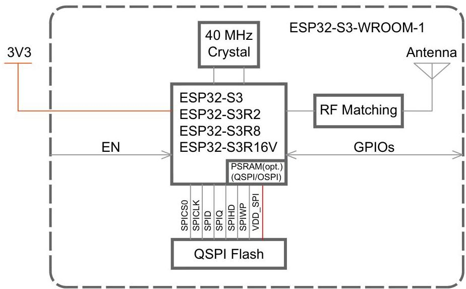
图1: ESP32-S3-WROOM-1 功能框图

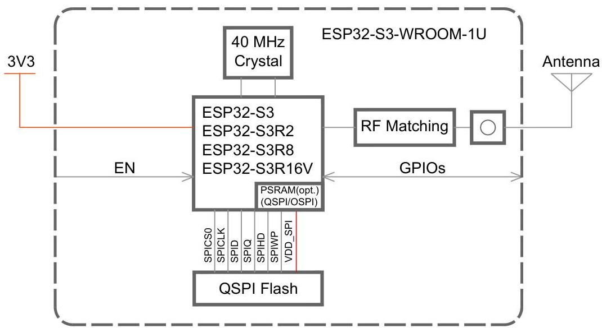
图2: ESP32-S3-WROOM-1U 功能框图

# 3 管脚定义

## 3.1 管脚布局

管脚布局图显示了模组上管脚的大致位置。按比例绘制的实际布局请参考图 7.1 模组尺寸。

注意，ESP32-S3-WROOM-1U 的管脚布局与 ESP32-S3-WROOM-1 相同，但没有禁止布线区 (Keepout Zone)。

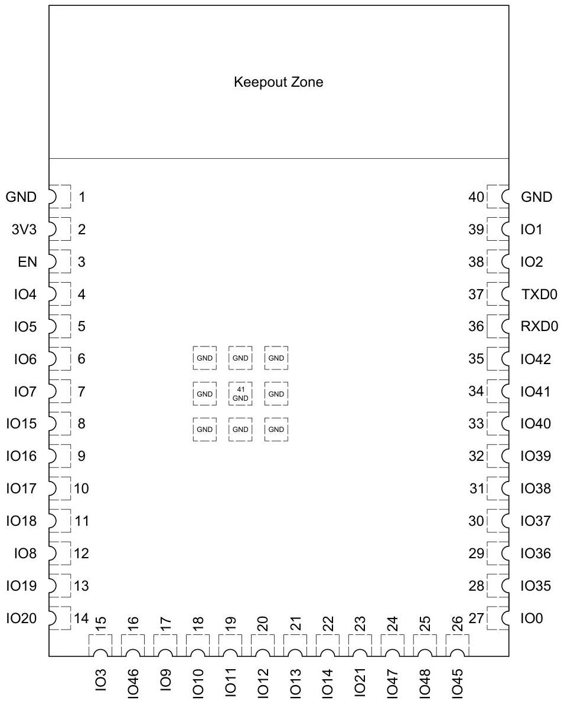
图 3: 管脚布局（顶视图）

## 3.2 管脚定义

模组共有 41 个管脚，具体描述参见表 3 管脚定义。

管脚名称释义、管脚功能释义、以及外设管脚分配请参考 《ESP32-S3 系列芯片技术规格书》。

表 3: 管脚定义

|  名称 | 序号 | 类型^{a} | 功能  |
| --- | --- | --- | --- |
|  GND | 1 | P | 接地  |
|  3V3 | 2 | P | 供电  |
|  EN | 3 | I | 高电平: 芯片使能;
低电平: 芯片关闭;
注意不能让 EN 管脚浮空。  |
|  IO4 | 4 | I/O/T | RTC_GPIO4, GPIO4, TOUCH4, ADC1_CH3  |
|  IO5 | 5 | I/O/T | RTC_GPIO5, GPIO5, TOUCH5, ADC1_CH4  |
|  IO6 | 6 | I/O/T | RTC_GPIO6, GPIO6, TOUCH6, ADC1_CH5  |
|  IO7 | 7 | I/O/T | RTC_GPIO7, GPIO7, TOUCH7, ADC1_CH6  |
|  IO15 | 8 | I/O/T | RTC_GPIO15, GPIO15, U0RTS, ADC2_CH4, XTAL_32K_P  |
|  IO16 | 9 | I/O/T | RTC_GPIO16, GPIO16, U0CTS, ADC2_CH5, XTAL_32K_N  |
|  IO17 | 10 | I/O/T | RTC_GPIO17, GPIO17, U1TXD, ADC2_CH6  |
|  IO18 | 11 | I/O/T | RTC_GPIO18, GPIO18, U1RXD, ADC2_CH7, CLK_OUT3  |
|  IO8 | 12 | I/O/T | RTC_GPIO8, GPIO8, TOUCH8, ADC1_CH7, SUBSPICS1  |
|  IO19 | 13 | I/O/T | RTC_GPIO19, GPIO19, U1RTS, ADC2_CH8, CLK_OUT2, USB_D-  |
|  IO20 | 14 | I/O/T | RTC_GPIO20, GPIO20, U1CTS, ADC2_CH9, CLK_OUT1, USB_D+  |
|  IO3 | 15 | I/O/T | RTC_GPIO3, GPIO3, TOUCH3, ADC1_CH2  |
|  IO46 | 16 | I/O/T | GPIO46  |
|  IO9 | 17 | I/O/T | RTC_GPIO9, GPIO9, TOUCH9, ADC1_CH8, FSPIHD, SUBSPIHD  |
|  IO10 | 18 | I/O/T | RTC_GPIO10, GPIO10, TOUCH10, ADC1_CH9, FSPICS0, FSPIIO4, SUBSPICS0  |
|  IO11 | 19 | I/O/T | RTC_GPIO11, GPIO11, TOUCH11, ADC2_CH0, FSPID, FSPIIO5, SUBSPID  |
|  IO12 | 20 | I/O/T | RTC_GPIO12, GPIO12, TOUCH12, ADC2_CH1, FSPICLK, FSPIIO6, SUBSPICLK  |
|  IO13 | 21 | I/O/T | RTC_GPIO13, GPIO13, TOUCH13, ADC2_CH2, FSPIQ, FSPIIO7, SUBSPIQ  |
|  IO14 | 22 | I/O/T | RTC_GPIO14, GPIO14, TOUCH14, ADC2_CH3, FSPIWP, FSPIDQS, SUBSPIWP  |
|  IO21 | 23 | I/O/T | RTC_GPIO21, GPIO21  |
|  IO47^{c} | 24 | I/O/T | SPICLK_P_DIFF, GPIO47, SUBSPICLK_P_DIFF  |
|  IO48^{c} | 25 | I/O/T | SPICLK_N_DIFF, GPIO48, SUBSPICLK_N_DIFF  |
|  IO45 | 26 | I/O/T | GPIO45  |
|  IO0 | 27 | I/O/T | RTC_GPIO0, GPIO0  |
|  IO35^{b} | 28 | I/O/T | SPIIO6, GPIO35, FSPID, SUBSPID  |
|  IO36^{b} | 29 | I/O/T | SPIIO7, GPIO36, FSPIILK, SUBSPICLK  |
|  IO37^{b} | 30 | I/O/T | SPIDQS, GPIO37, FSPIQ, SUBSPIQ  |
|  IO38 | 31 | I/O/T | GPIO38, FSPIWP, SUBSPIWP  |
|  IO39 | 32 | I/O/T | MTCK, GPIO39, CLK_OUT3, SUBSPICS1  |
|  IO40 | 33 | I/O/T | MTDO, GPIO40, CLK_OUT2  |
|  IO41 | 34 | I/O/T | MTDI, GPIO41, CLK_OUT1  |

表 3 - 接上页

|  名称 | 序号 | 类型 a | 功能  |
| --- | --- | --- | --- |
|  IO42 | 35 | I/O/T | MTMS, GPIO42  |
|  RXD0 | 36 | I/O/T | U0RXD, GPIO44, CLK_OUT2  |
|  TXD0 | 37 | I/O/T | U0TXD, GPIO43, CLK_OUT1  |
|  IO2 | 38 | I/O/T | RTC_GPIO2, GPIO2, TOUCH2, ADC1_CH1  |
|  IO1 | 39 | I/O/T | RTC_GPIO1, GPIO1, TOUCH1, ADC1_CH0  |
|  GND | 40 | P | 接地  |
|  EPAD | 41 | P | 接地  |

a P：电源；I：输入；O：输出；T：可设置为高阻。加粗字体为管脚的默认功能。管脚 28～30 的默认功能由 eFuse 位决定。
b 在集成 Octal SPI PSRAM (即内置芯片为 ESP32-S3R8 或 ESP32-S3R16V) 的模组中，管脚 IO35、IO36、IO37 已连接至模组内部集成的 Octal SPI PSRAM，不可用于其他功能。
c 在内置芯片为 ESP32-S3R16V 的模组中，由于 ESP32-S3R16V 芯片的 VDD_SPI 电压已设置为 1.8 V，所以，不同于其他 GPIO，VDD_SPI 电源域中的 GPIO47 和 GPIO48 工作电压也为 1.8 V。

## 3.3 Strapping 管脚

说明：

以下内容摘自《ESP32-S3系列芯片技术规格书》&gt;章节 Strapping 管脚。芯片的 Strapping 管脚与模组管脚的对应关系，可参考章节 5 模组原理图。

模组每次上电或复位时，都需要一些初始配置参数，如加载模组的启动模式、flash 存储器的电压等。这些参数通过 strapping 管脚控制。复位放开后，strapping 管脚和普通 IO 管脚功能相同。

模组复位时，strapping 管脚在复位时控制以下参数：

- 芯片启动模式 - GPIO0 和 GPIO46
- VDD_SPI 电压 - GPIO45
- ROM 代码日志打印 - GPIO46
- JTAG 信号源 - GPIO3

GPIO0、GPIO45 和 GPIO46 在芯片复位时连接芯片内部的弱上拉/下拉电阻。如果 strapping 管脚没有外部连接或者连接的外部线路处于高阻抗状态，这些电阻将决定 strapping 管脚的默认值。

表 4: Strapping 管脚默认配置

|  Strapping 管脚 | 默认配置 | 值  |
| --- | --- | --- |
|  GPIO0 | 上拉 | 1  |
|  GPIO3 | 浮空 | -  |
|  GPIO45 | 下拉 | 0  |
|  GPIO46 | 下拉 | 0  |

要改变 strapping 管脚的值，可以连接外部下拉/上拉电阻。如果 ESP32-S3 用作主机 MCU 的从设备，strapping 管脚的电平也可通过主机 MCU 控制。

所有 strapping 管脚都有锁存器。系统复位时，锁存器采样并存储相应 strapping 管脚的值，一直保持到芯片掉电或关闭。锁存器的状态无法用其他方式更改。因此，strapping 管脚的值在芯片工作时一直可读取，并可在芯片复位后作为普通 IO 管脚使用。

Strapping 管脚的时序参数包括建立时间和保持时间。更多信息，详见表 5 和图 4。

表 5: Strapping 管脚的时序参数说明

|  参数 | 说明 | 最小值 (ms)  |
| --- | --- | --- |
|  t_{SU} | 建立时间，即拉高 CHIP_PU 激活芯片前，电源轨达到稳定所需的时间 | 0  |
|  t_{H} | 保持时间，即 CHIP_PU 已拉高、strapping 管脚变为普通 IO 管脚开始工作前，可读取 strapping 管脚值的时间 | 3  |

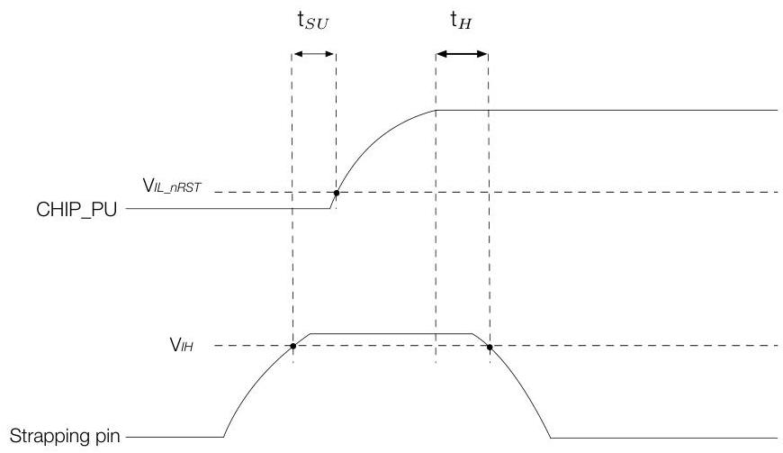
图4: Strapping管脚的时序参数图

## 3.3.1 芯片启动模式控制

复位释放后，GPIO0 和 GPIO46 共同决定启动模式。详见表6芯片启动模式控制。

表 6: 芯片启动模式控制

|  启动模式 | GPIO0 | GPIO46  |
| --- | --- | --- |
|  默认配值 | 1 (上拉) | 0 (下拉)  |
|  SPI Boot（默认） | 1 | 任意值  |
|  Joint Download Boot¹ | 0 | 0  |

¹ Joint Download Boot 模式下支持以下下载方式：
- USB Download Boot:
- USB-Serial-JTAG Download Boot
- USB-OTG Download Boot
- UART Download Boot

在 SPI Boot 模式下，ROM 引导加载程序通过从 SPI flash 中读取程序来启动系统。

在 Joint Download Boot 模式下，用户可通过 USB 或 UART0 接口将二进制文件下载至 flash，或将二进制文件下载至 SRAM 并运行 SRAM 中的程序。

除了 SPI Boot 和 Joint Download Boot 模式，ESP32-S3 还支持 SPI Download Boot 模式，详见《ESP32-S3 技术参考手册》&gt;章节芯片 Boot 控制。

## 3.3.2 VDD_SPI 电压控制

电压有两种控制方式，具体取决于 EFUSE_VDD_SPI_FORCE 的值。

表 7: VDD_SPI 电压控制

|  EFUSE_VDD_SPI_FORCE | GPIO45 | eFuse^{1} | 电压 | VDD_SPI 电源^{2}  |
| --- | --- | --- | --- | --- |
|  0 | 0 | 忽略 | 3.3 V | VDD3P3_RTC 通过 R_{SPI} 供电  |
|   |  1 |   | 1.8 V | Flash 稳压器  |
|  1 | 忽略 | 0 | 1.8 V | Flash 稳压器  |
|   |   |  1 | 3.3 V | VDD3P3_RTC 通过 R_{SPI} 供电  |

1 eFuse: EFUSE_VDD_SPI_TIEH
2 请参考 《ESP32-S3 系列芯片技术规格书》&gt;章节 电源管理

## 3.3.3 ROM 日志打印控制

系统启动过程中，ROM 代码日志可打印至：

- （默认）UART 和 USB 串口/JTAG 控制器。
- USB 串口/JTAG 控制器。
- UART。

通过配置寄存器和 eFuse 可分别关闭 UART 和 USB 串口/JTAG 控制器的 ROM 代码日志打印功能。详细信息请参考 《ESP32-S3 技术参考手册》&gt;章节 芯片 Boot 控制。

## 3.3.4 JTAG 信号源控制

在系统启动早期阶段，GPIO3 可用于控制 JTAG 信号源。该管脚没有内部上下拉电阻，strapping 的值必须由不处于高阻抗状态的外部电路控制。

如表 8 所示，GPIO3 与 EFUSE_DIS_PAD_JTAG、EFUSE_DIS_USB_JTAG 和 EFUSE_STRAP_JTAG_SEL 共同控制 JTAG 信号源。

表 8: JTAG 信号源控制

|  eFuse 1^{a} | eFuse 2^{b} | eFuse 3^{c} | GPIO3 | JTAG 信号源  |
| --- | --- | --- | --- | --- |
|  0 | 0 | 0 | 忽略 | USB 串口/JTAG 控制器  |
|   |   |  1 | 0 | JTAG 管脚 MTDI、MTCK、MTMS 和 MTDO  |
|   |   |   |  1 | USB 串口/JTAG 控制器  |
|  0 | 1 | 忽略 | 忽略 | JTAG 管脚 MTDI、MTCK、MTMS 和 MTDO  |
|  1 | 0 | 忽略 | 忽略 | USB 串口/JTAG 控制器  |
|  1 | 1 | 忽略 | 忽略 | JTAG 关闭  |

a eFuse 1: EFUSE_DIS_PAD_JTAG
b eFuse 2: EFUSE_DIS_USB_JTAG
c eFuse 3: EFUSE_STRAP_JTAG_SEL

# 4 电气特性

## 4.1 绝对最大额定值

超出表 9 绝对最大额定值 可能导致器件永久性损坏。这只是强调的额定值，不涉及器件在这些或其它条件下超出表 10 建议工作条件 技术规格指标的功能性操作。长时间暴露在绝对最大额定条件下可能会影响模组的可靠性。

表 9: 绝对最大额定值

|  符号 | 参数 | 最小值 | 最大值 | 单位  |
| --- | --- | --- | --- | --- |
|  VDD33 | 电源管脚电压 | -0.3 | 3.6 | V  |
|  T_{STORE} | 存储温度 | -40 | 105 | °C  |

## 4.2 建议工作条件

表 10: 建议工作条件

|  符号 | 参数 |   | 最小值 | 典型值 | 最大值 | 单位  |
| --- | --- | --- | --- | --- | --- | --- |
|  VDD33 | 电源管脚电压 |   | 3.0 | 3.3 | 3.6 | V  |
|  I_{VDD} | 外部电源的供电电流 |   | 0.5 | — | — | A  |
|  T_{A} | 环境温度 | 65 °C 版 | -40 | — | 65 | °C  |
|   |   |  85 °C 版 |   |   | 85  |   |
|   |   |  105 °C 版 |   |   | 105  |   |

## 4.3 直流电气特性 (3.3 V, 25 °C)

表 11: 直流电气特性 (3.3 V, 25 °C)

|  符号 | 参数 | 最小值 | 典型值 | 最大值 | 单位  |
| --- | --- | --- | --- | --- | --- |
|  C_{IN} | 管脚电容 | — | 2 | — | pF  |
|  V_{IH} | 高电平输入电压 | 0.75 × VDD^{1} | — | VDD^{1}+ 0.3 | V  |
|  V_{IL} | 低电平输入电压 | -0.3 | — | 0.25 × VDD^{1} | V  |
|  I_{IH} | 高电平输入电流 | — | — | 50 | nA  |
|  I_{IL} | 低电平输入电流 | — | — | 50 | nA  |
|  V_{OH}^{2} | 高电平输出电压 | 0.8 × VDD^{1} | — | — | V  |
|  V_{OL}^{2} | 低电平输出电压 | — | — | 0.1 × VDD^{1} | V  |
|  I_{OH} | 高电平拉电流 (VDD^{1}= 3.3 V, V_{OH} >= 2.64 V, PAD_DRIVER = 3) | — | 40 | — | mA  |
|  I_{OL} | 低电平灌电流 (VDD^{1}= 3.3 V, V_{OL} = 0.495 V, PAD_DRIVER = 3) | — | 28 | — | mA  |
|  R_{PU} | 内部弱上拉电阻 | — | 45 | — | kΩ  |
|  R_{PD} | 内部弱下拉电阻 | — | 45 | — | kΩ  |
|  V_{IH_nRST} | 芯片复位释放电压 (EN 管脚应满足电压范围) | 0.75 × VDD^{1} | — | VDD^{1}+ 0.3 | V  |

表 11 - 接上页

|  符号 | 参数 | 最小值 | 典型值 | 最大值 | 单位  |
| --- | --- | --- | --- | --- | --- |
|  V_{IL_nRST} | 芯片复位电压（EN管脚应满足电压范围） | -0.3 | — | 0.25 × VDD^{1} | V  |

1 VDD 是 I/O 的供电电源。
2 $V_{OH}$ 和 $V_{OL}$ 为负载是高阻条件下的测量值。

## 4.4 功耗特性

### 4.4.1 Active 模式下的 RF 功耗

因使用了先进的电源管理技术，模组可以在不同的功耗模式之间切换。关于不同功耗模式的描述，详见《ESP32-S3 系列芯片技术规格书》的低功耗管理章节。

表 12: 射频功耗

|  工作模式 | 描述 |   | 峰值 (mA)  |
| --- | --- | --- | --- |
|  Active（射频工作） | TX | 802.11b, 1 Mbps, @20.5 dBm | 355  |
|   |   |  802.11g, 54 Mbps, @18 dBm | 297  |
|   |   |  802.11n, HT20, MCS7, @17.5 dBm | 286  |
|   |   |  802.11n, HT40, MCS7, @17 dBm | 285  |
|   |  RX | 802.11b/g/n, HT20 | 95  |
|   |   |  802.11n, HT40 | 97  |

1 以上功耗数据是基于 3.3 V 电源、25 °C 环境温度，在 RF 接口处完成的测试结果。所有发射数据均基于 100% 的占空比测得。
2 测量 RX 功耗数据时，外设处于关闭状态，CPU 处于空闲状态。

说明：
以下内容摘自《ESP32-S3 系列芯片技术规格书》的其他功耗模式下的功耗章节。

### 4.4.2 其他功耗模式下的功耗

请注意，若模组内置芯片封装内有 PSRAM，功耗数据可能略高于下表数据。

表 13: Modem-sleep 模式下的功耗

|  工作模式 | 频率 (MHz) | 说明 | 典型值¹ (mA) | 典型值² (mA)  |
| --- | --- | --- | --- | --- |
|  Modem-sleep³ | 40 | WAITI（双核均空闲） | 13.2 | 18.8  |
|   |   |  单核执行 32 位数据访问指令，另一个核空闲 | 16.2 | 21.8  |
|   |   |  双核执行 32 位数据访问指令 | 18.7 | 24.4  |
|   |   |  单核执行 128 位数据访问指令，另一个核空闲 | 19.9 | 25.4  |
|   |   |  双核执行 128 位数据访问指令 | 23.0 | 28.8  |
|   |  80 | WAITI | 22.0 | 36.1  |
|   |   |  单核执行 32 位数据访问指令，另一个核空闲 | 28.4 | 42.6  |
|   |   |  双核执行 32 位数据访问指令 | 33.1 | 47.3  |
|   |   |  单核执行 128 位数据访问指令，另一个核空闲 | 35.1 | 49.6  |
|   |   |  双核执行 128 位数据访问指令 | 41.8 | 56.3  |
|   |  160 | WAITI | 27.6 | 42.3  |
|   |   |  单核执行 32 位数据访问指令，另一个核空闲 | 39.9 | 54.6  |
|   |   |  双核执行 32 位数据访问指令 | 49.6 | 64.1  |
|   |   |  单核执行 128 位数据访问指令，另一个核空闲 | 54.4 | 69.2  |
|   |   |  双核执行 128 位数据访问指令 | 66.7 | 81.1  |
|   |  240 | WAITI | 32.9 | 47.6  |
|   |   |  单核执行 32 位数据访问指令，另一个核空闲 | 51.2 | 65.9  |
|   |   |  双核执行 32 位数据访问指令 | 66.2 | 81.3  |
|   |   |  单核执行 128 位数据访问指令，另一个核空闲 | 72.4 | 87.9  |
|   |   |  双核执行 128 位数据访问指令 | 91.7 | 107.9  |

¹ 所有外设时钟关闭时的典型值。
² 所有外设时钟打开时的典型值。实际情况下，外设在不同工作状态下电流会有所差异。
³ Modem-sleep 模式下，Wi-Fi 设有时钟门控。该模式下，访问 flash 时功耗会增加。若 flash 速率为 80 Mbit/s，SPI 双线模式下 flash 的功耗为 10 mA。

表 14: 低功耗模式下的功耗

|  工作模式 | 说明 | 典型值 (μA)  |
| --- | --- | --- |
|  Light-sleep¹ | VDD_SPI 和 Wi-Fi 掉电，所有 GPIO 设置为高阻状态 | 240  |
|  Deep-sleep | RTC 存储器和 RTC 外设上电 | 8  |
|   |  RTC 存储器上电，RTC 外设掉电 | 7  |
|  关闭 | CHIP_PU 管脚拉低，芯片关闭 | 1  |

¹ Light-sleep 模式下，SPI 相关管脚上拉。封装内有 PSRAM 的芯片请在典型值的基础上添加相应的 PSRAM 功耗：8 MB Octal PSRAM (3.3 V) 为 140 μA；8 MB Octal PSRAM (1.8 V) 为 200 μA；2 MB Quad PSRAM 为 40 μA。

## 4.5 Wi-Fi 射频

### 4.5.1 Wi-Fi 射频标准

表 15: Wi-Fi 射频标准

|  名称 |   | 描述  |
| --- | --- | --- |
|  工作信道中心频率范围^{1} |   | 2412 ~ 2484 MHz  |
|  Wi-Fi 协议 |   | IEEE 802.11b/g/n  |
|  数据速率 | 20 MHz | 11b: 1, 2, 5.5, 11 Mbps
11g: 6, 9, 12, 18, 24, 36, 48, 54 Mbps
11n: MCS0-7, 72.2 Mbps (Max)  |
|   |  40 MHz | 11n: MCS0-7, 150 Mbps (Max)  |
|  天线类型 |   | PCB 天线，外部天线连接器^{2}  |

1 工作信道中心频率范围应符合国家或地区的规范标准。软件可以配置工作信道中心频率范围
2 用外部天线连接器的模组输出阻抗为 50，不使用外部天线连接器的模组可无需关注输出阻抗。

### 4.5.2 Wi-Fi 射频发射器 (TX) 规格

根据产品或认证的要求，您可以配置发射器目标功率。默认功率详见表 16 频谱模板和 EVM 符合 802.11 标准时的发射功率。

表 16: 频谱模板和 EVM 符合 802.11 标准时的发射功率

|  速率 | 最小值 (dBm) | 典型值 (dBm) | 最大值 (dBm)  |
| --- | --- | --- | --- |
|  802.11b, 1 Mbps | — | 20.5 | —  |
|  802.11b, 11 Mbps | — | 20.5 | —  |
|  802.11g, 6 Mbps | — | 20.0 | —  |
|  802.11g, 54 Mbps | — | 18.0 | —  |
|  802.11n, HT20, MCS 0 | — | 19.0 | —  |
|  802.11n, HT20, MCS 7 | — | 17.5 | —  |
|  802.11n, HT40, MCS 0 | — | 18.5 | —  |
|  802.11n, HT40, MCS 7 | — | 17.0 | —  |

表 17: 发射 EVM 测试

|  速率 | 最小值 (dB) | 典型值 (dB) | 标准限值 (dB)  |
| --- | --- | --- | --- |
|  802.11b, 1 Mbps, @20.5 dBm | — | -24.5 | -10  |
|  802.11b, 11 Mbps, @20.5 dBm | — | -24.5 | -10  |
|  802.11g, 6 Mbps, @20 dBm | — | -23.0 | -5  |
|  802.11g, 54 Mbps, @18 dBm | — | -29.5 | -25  |
|  802.11n, HT20, MCS 0, @19 dBm | — | -24.0 | -5  |
|  802.11n, HT20, MCS 7, @17.5 dBm | — | -30.5 | -27  |
|  802.11n, HT40, MCS 0, @18.5 dBm | — | -25.0 | -5  |

见下页

表 17 - 接上页

|  速率 | 最小值 (dB) | 典型值 (dB) | 标准限值 (dB)  |
| --- | --- | --- | --- |
|  802.11n, HT40, MCS 7, @17 dBm | — | -30.0 | -27  |

## 4.5.3 Wi-Fi 射频接收器 (RX) 规格

表 18: 接收灵敏度

|  速率 | 最小值 (dBm) | 典型值 (dBm) | 最大值 (dBm)  |
| --- | --- | --- | --- |
|  802.11b, 1 Mbps | — | -98.2 | —  |
|  802.11b, 2 Mbps | — | -95.6 | —  |
|  802.11b, 5.5 Mbps | — | -92.8 | —  |
|  802.11b, 11 Mbps | — | -88.5 | —  |
|  802.11g, 6 Mbps | — | -93.0 | —  |
|  802.11g, 9 Mbps | — | -92.0 | —  |
|  802.11g, 12 Mbps | — | -90.8 | —  |
|  802.11g, 18 Mbps | — | -88.5 | —  |
|  802.11g, 24 Mbps | — | -85.5 | —  |
|  802.11g, 36 Mbps | — | -82.2 | —  |
|  802.11g, 48 Mbps | — | -78.0 | —  |
|  802.11g, 54 Mbps | — | -76.2 | —  |
|  802.11n, HT20, MCS 0 | — | -93.0 | —  |
|  802.11n, HT20, MCS 1 | — | -90.6 | —  |
|  802.11n, HT20, MCS 2 | — | -88.4 | —  |
|  802.11n, HT20, MCS 3 | — | -84.8 | —  |
|  802.11n, HT20, MCS 4 | — | -81.6 | —  |
|  802.11n, HT20, MCS 5 | — | -77.4 | —  |
|  802.11n, HT20, MCS 6 | — | -75.6 | —  |
|  802.11n, HT20, MCS 7 | — | -74.2 | —  |
|  802.11n, HT40, MCS 0 | — | -90.0 | —  |
|  802.11n, HT40, MCS 1 | — | -87.5 | —  |
|  802.11n, HT40, MCS 2 | — | -85.0 | —  |
|  802.11n, HT40, MCS 3 | — | -82.0 | —  |
|  802.11n, HT40, MCS 4 | — | -78.5 | —  |
|  802.11n, HT40, MCS 5 | — | -74.4 | —  |
|  802.11n, HT40, MCS 6 | — | -72.5 | —  |
|  802.11n, HT40, MCS 7 | — | -71.2 | —  |

表 19: 最大接收电平

|  速率 | 最小值 (dBm) | 典型值 (dBm) | 最大值 (dBm)  |
| --- | --- | --- | --- |
|  802.11b, 1 Mbps | — | 5 | —  |
|  802.11b, 11 Mbps | — | 5 | —  |
|  802.11g, 6 Mbps | — | 5 | —  |
|  802.11g, 54 Mbps | — | 0 | —  |
|  802.11n, HT20, MCS 0 | — | 5 | —  |
|  802.11n, HT20, MCS 7 | — | 0 | —  |
|  802.11n, HT40, MCS 0 | — | 5 | —  |
|  802.11n, HT40, MCS 7 | — | 0 | —  |

表 20: 接收邻道抑制

|  速率 | 最小值 (dB) | 典型值 (dB) | 最大值 (dB)  |
| --- | --- | --- | --- |
|  802.11b, 1 Mbps | — | 35 | —  |
|  802.11b, 11 Mbps | — | 35 | —  |
|  802.11g, 6 Mbps | — | 31 | —  |
|  802.11g, 54 Mbps | — | 14 | —  |
|  802.11n, HT20, MCS 0 | — | 31 | —  |
|  802.11n, HT20, MCS 7 | — | 13 | —  |
|  802.11n, HT40, MCS 0 | — | 19 | —  |
|  802.11n, HT40, MCS 7 | — | 8 | —  |

## 4.6 低功耗蓝牙射频

表 21: 低功耗蓝牙频率

|  参数 | 最小值 (MHz) | 典型值 (MHz) | 最大值 (MHz)  |
| --- | --- | --- | --- |
|  工作信道中心频率 | 2402 | — | 2480  |

## 4.6.1 低功耗蓝牙射频发射器 (TX) 规格

表 22: 发射器特性 - 低功耗蓝牙 1 Mbps

|  参数 | 描述 | 最小值 | 典型值 | 最大值 | 单位  |
| --- | --- | --- | --- | --- | --- |
|  射频发射功率 | 射频功率控制范围 | -24.00 | 0 | 20.00 | dBm  |
|   |  增益控制步长 | — | 3.00 | — | dB  |
|  载波频率偏移和漂移 | |f_{n}|_{n=0,1,2,...}, 最大值 | — | 2.50 | — | kHz  |
|   |  |f_{0 - f_{n}}| 最大值 | — | 2.00 | — | kHz  |
|   |  |f_{n - f_{n-5}}| 最大值 | — | 1.40 | — | kHz  |

见下页

表 22 - 接上页

|  参数 | 描述 | 最小值 | 典型值 | 最大值 | 单位  |
| --- | --- | --- | --- | --- | --- |
|   | |f₁ - f₀| | — | 1.00 | — | kHz  |
|  调制特性 | Δ f₁_avg | — | 249.00 | — | kHz  |
|   |  Δ f₂_max 最小值
(至少 99.9% 的 Δ f₂_max) | — | 198.00 | — | kHz  |
|   |  Δ f₂_avg/Δ f₁_avg | — | 0.86 | — | —  |
|  带内杂散发射 | ±2 MHz 偏移 | — | -37.00 | — | dBm  |
|   |  ±3 MHz 偏移 | — | -42.00 | — | dBm  |
|   |  > ±3 MHz 偏移 | — | -44.00 | — | dBm  |

表 23: 发射器特性 - 低功耗蓝牙 2 Mbps

|  参数 | 描述 | 最小值 | 典型值 | 最大值 | 单位  |
| --- | --- | --- | --- | --- | --- |
|  射频发射功率 | 射频功率控制范围 | -24.00 | 0 | 20.00 | dBm  |
|   |  增益控制步长 | — | 3.00 | — | dB  |
|  载波频率偏移和漂移 | |fₙ|_{n=0,1,2,..k} 最大值 | — | 2.50 | — | kHz  |
|   |  |f₀ - fₙ| 最大值 | — | 2.00 | — | kHz  |
|   |  |fₙ - fₙ-5| 最大值 | — | 1.40 | — | kHz  |
|   |  |f₁ - f₀ | — | 1.00 | — | kHz  |
|  调制特性 | Δ f₁_avg | — | 499.00 | — | kHz  |
|   |  Δ f₂_max 最小值
(至少 99.9% 的 Δ f₂_max) | — | 416.00 | — | kHz  |
|   |  Δ f₂_avg/Δ f₁_avg | — | 0.89 | — | —  |
|  带内杂散发射 | ±4 MHz 偏移 | — | -42.00 | — | dBm  |
|   |  ±5 MHz 偏移 | — | -44.00 | — | dBm  |
|   |  > ±5 MHz 偏移 | — | -47.00 | — | dBm  |

表 24: 发射器特性 - 低功耗蓝牙 125 Kbps

|  参数 | 描述 | 最小值 | 典型值 | 最大值 | 单位  |
| --- | --- | --- | --- | --- | --- |
|  射频发射功率 | 射频功率控制范围 | -24.00 | 0 | 20.00 | dBm  |
|   |  增益控制步长 | — | 3.00 | — | dB  |
|  载波频率偏移和漂移 | |fₙ|_{n=0,1,2,..k} 最大值 | — | 0.80 | — | kHz  |
|   |  |f₀ - fₙ| 最大值 | — | 1.00 | — | kHz  |
|   |  |fₙ - fₙ-3 | — | 0.30 | — | kHz  |
|   |  |f₀ - f₃ | — | 1.00 | — | kHz  |
|  调制特性 | Δ f₁_avg | — | 248.00 | — | kHz  |
|   |  Δ f₁_max 最小值
(至少 99.9% 的 Δ f₁_max) | — | 222.00 | — | kHz  |
|  带内杂散发射 | ±2 MHz 偏移 | — | -37.00 | — | dBm  |
|   |  ±3 MHz 偏移 | — | -42.00 | — | dBm  |
|   |  > ±3 MHz 偏移 | — | -44.00 | — | dBm  |

表 25: 发射器特性 - 低功耗蓝牙 500 Kbps

|  参数 | 描述 | 最小值 | 典型值 | 最大值 | 单位  |
| --- | --- | --- | --- | --- | --- |
|  射频发射功率 | 射频功率控制范围 | -24.00 | 0 | 20.00 | dBm  |
|   |  增益控制步长 | — | 3.00 | — | dB  |
|  载波频率偏移和漂移 | |f_{n}|_{n=0,1,2,...k} 最大值 | — | 0.80 | — | kHz  |
|   |  |f_{0 - f_{n}}| 最大值 | — | 1.00 | — | kHz  |
|   |  |f_{n - f_{n-3}} | — | 0.85 | — | kHz  |
|   |  |f_{0 - f_{3}} | — | 0.34 | — | kHz  |
|  调制特性 | Δf_{2avg} | — | 213.00 | — | kHz  |
|   |  Δf_{2max} 最小值
(至少 99.9% 的 Δf_{2max}) | — | 196.00 | — | kHz  |
|  带内杂散发射 | ±2 MHz 偏移 | — | -37.00 | — | dBm  |
|   |  ±3 MHz 偏移 | — | -42.00 | — | dBm  |
|   |  > ±3 MHz 偏移 | — | -44.00 | — | dBm  |

## 4.6.2 低功耗蓝牙射频接收器 (RX) 规格

表 26: 接收器特性 - 低功耗蓝牙 1 Mbps

|  参数 | 描述 | 最小值 | 典型值 | 最大值 | 单位  |
| --- | --- | --- | --- | --- | --- |
|  灵敏度 @30.8% PER | — | — | -96.5 | — | dBm  |
|  最大接收信号 @30.8% PER | — | — | 8 | — | dBm  |
|  共信道抑制比 C/I | F = F0 MHz | — | 8 | — | dB  |
|  邻道选择性抑制比 C/I | F = F0 + 1 MHz | — | 4 | — | dB  |
|   |  F = F0 - 1 MHz | — | 4 | — | dB  |
|   |  F = F0 + 2 MHz | — | -23 | — | dB  |
|   |  F = F0 - 2 MHz | — | -23 | — | dB  |
|   |  F = F0 + 3 MHz | — | -34 | — | dB  |
|   |  F = F0 - 3 MHz | — | -34 | — | dB  |
|   |  F > F0 + 3 MHz | — | -36 | — | dB  |
|   |  F > F0 - 3 MHz | — | -37 | — | dB  |
|  镜像频率 | — | — | -36 | — | dB  |
|  邻道镜像频率干扰 | F = F_{image} + 1 MHz | — | -39 | — | dB  |
|   |  F = F_{image} - 1 MHz | — | -34 | — | dB  |
|  带外阻塞 | 30 MHz ~ 2000 MHz | — | -12 | — | dBm  |
|   |  2003 MHz ~ 2399 MHz | — | -18 | — | dBm  |
|   |  2484 MHz ~ 2997 MHz | — | -16 | — | dBm  |
|   |  3000 MHz ~ 12.75 GHz | — | -10 | — | dBm  |
|  互调 | — | — | -29 | — | dBm  |

表 27: 接收器特性 - 低功耗蓝牙 2 Mbps

|  参数 | 描述 | 最小值 | 典型值 | 最大值 | 单位  |
| --- | --- | --- | --- | --- | --- |
|  灵敏度 @30.8% PER | — | — | -92 | — | dBm  |
|  最大接收信号 @30.8% PER | — | — | 3 | — | dBm  |
|  共信道干扰 C/I | F = F0 MHz | — | 8 | — | dB  |
|  邻道选择性抑制比 C/I | F = F0 + 2 MHz | — | 4 | — | dB  |
|   |  F = F0 - 2 MHz | — | 4 | — | dB  |
|   |  F = F0 + 4 MHz | — | -27 | — | dB  |
|   |  F = F0 - 4 MHz | — | -27 | — | dB  |
|   |  F = F0 + 6 MHz | — | -38 | — | dB  |
|   |  F = F0 - 6 MHz | — | -38 | — | dB  |
|   |  F > F0 + 6 MHz | — | -41 | — | dB  |
|   |  F > F0 - 6 MHz | — | -41 | — | dB  |
|  镜像频率 | — | — | -27 | — | dB  |
|  邻道镜像频率干扰 | F = F_{image} + 2 MHz | — | -38 | — | dB  |
|   |  F = F_{image} - 2 MHz | — | 4 | — | dB  |
|  带外阻塞 | 30 MHz ~ 2000 MHz | — | -15 | — | dBm  |
|   |  2003 MHz ~ 2399 MHz | — | -21 | — | dBm  |
|   |  2484 MHz ~ 2997 MHz | — | -21 | — | dBm  |
|   |  3000 MHz ~ 12.75 GHz | — | -9 | — | dBm  |
|  互调 | — | — | -29 | — | dBm  |

表 28: 接收器特性 - 低功耗蓝牙 125 Kbps

|  参数 | 描述 | 最小值 | 典型值 | 最大值 | 单位  |
| --- | --- | --- | --- | --- | --- |
|  灵敏度 @30.8% PER | — | — | -103.5 | — | dBm  |
|  最大接收信号 @30.8% PER | — | — | 8 | — | dBm  |
|  共信道抑制比 C/I | F = F0 MHz | — | 4 | — | dB  |
|  邻道选择性抑制比 C/I | F = F0 + 1 MHz | — | 1 | — | dB  |
|   |  F = F0 - 1 MHz | — | 2 | — | dB  |
|   |  F = F0 + 2 MHz | — | -26 | — | dB  |
|   |  F = F0 - 2 MHz | — | -26 | — | dB  |
|   |  F = F0 + 3 MHz | — | -36 | — | dB  |
|   |  F = F0 - 3 MHz | — | -39 | — | dB  |
|   |  F > F0 + 3 MHz | — | -42 | — | dB  |
|   |  F > F0 - 3 MHz | — | -43 | — | dB  |
|  镜像频率 | — | — | -42 | — | dB  |
|  邻道镜像频率干扰 | F = F_{image} + 1 MHz | — | -43 | — | dB  |
|   |  F = F_{image} - 1 MHz | — | -36 | — | dB  |

表 29: 接收器特性 - 低功耗蓝牙 500 Kbps

|  参数 | 描述 | 最小值 | 典型值 | 最大值 | 单位  |
| --- | --- | --- | --- | --- | --- |
|  灵敏度 @30.8% PER | — | — | -100 | — | dBm  |
|  最大接收信号 @30.8% PER | — | — | 8 | — | dBm  |
|  共信道抑制比 C/I | F = F0 MHz | — | 4 | — | dB  |
|  邻道选择性抑制比 C/I | F = F0 + 1 MHz | — | 1 | — | dB  |
|   |  F = F0 - 1 MHz | — | 0 | — | dB  |
|   |  F = F0 + 2 MHz | — | -24 | — | dB  |
|   |  F = F0 - 2 MHz | — | -24 | — | dB  |
|   |  F = F0 + 3 MHz | — | -37 | — | dB  |
|   |  F = F0 - 3 MHz | — | -39 | — | dB  |
|   |  F > F0 + 3 MHz | — | -38 | — | dB  |
|   |  F > F0 - 3 MHz | — | -42 | — | dB  |
|  镜像频率 | — | — | -38 | — | dB  |
|  邻道镜像频率干扰 | F = F_{image} + 1 MHz | — | -42 | — | dB  |
|   |  F = F_{image} - 1 MHz | — | -37 | — | dB  |

# 5 模组原理图

模组内部元件的电路图。

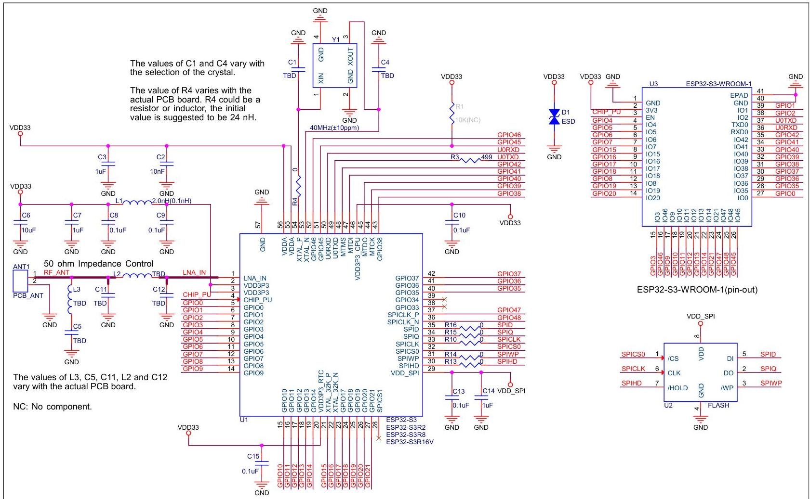

图 5: ESP32-S3-WROOM-1 原理图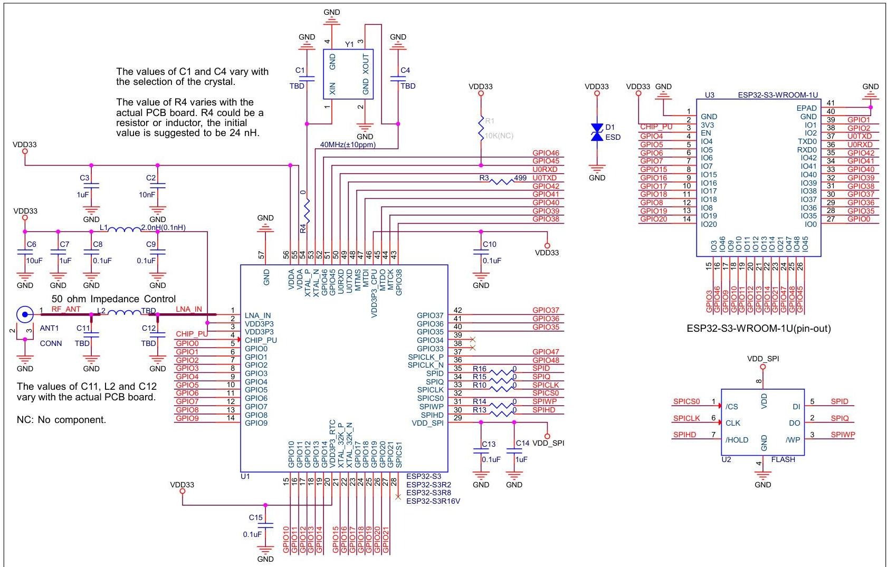

图 6: ESP32-S3-WROOM-1U 原理图

在内置 PSRAM 的模组中，芯片已通过 eFuse 设置将 VDD_SPI 电压固定为 $3.3\mathrm{V}$ 或 $1.8\mathrm{V}$，因此这些模组的 VDD_SPI 电压不受 GPIO45 电平影响；但在使用其他模组时，请确保模组上电时外部电路不会将 GPIO45 拉高。# 6 外围设计原理图

模组与外围器件（如电源、天线、复位按钮、JTAG接口、UART接口等）连接的应用电路图。

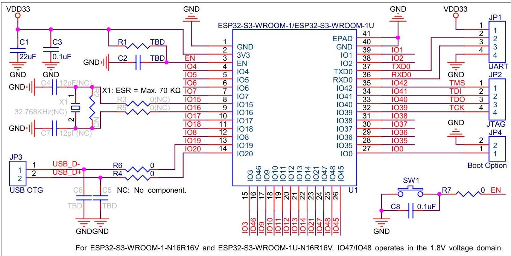

图 7: 外围设计原理图

- EPAD 可以不焊接到底板，但是焊接到底板的 GND 可以获得更好的散热特性。如果您想将 EPAD 焊接到底板，请确保使用适量焊膏，避免过量焊膏造成模组与底板距离过大，影响管脚与底板之间的贴合。
- 为确保 ESP32-S3 芯片上电时的供电正常，EN 管脚处需要增加 RC 延迟电路。RC 通常建议为 $R = 10\,\mathrm{k}\Omega$，$C = 1\,\mu\mathrm{F}$，但具体数值仍需根据模组电源的上电时序和芯片的上电复位时序进行调整。ESP32-S3 芯片的上电复位时序图可参考《ESP32-S3 系列芯片技术规格书》&gt;章节 电源。

# 7 模组尺寸和 PCB 封装图形

## 7.1 模组尺寸

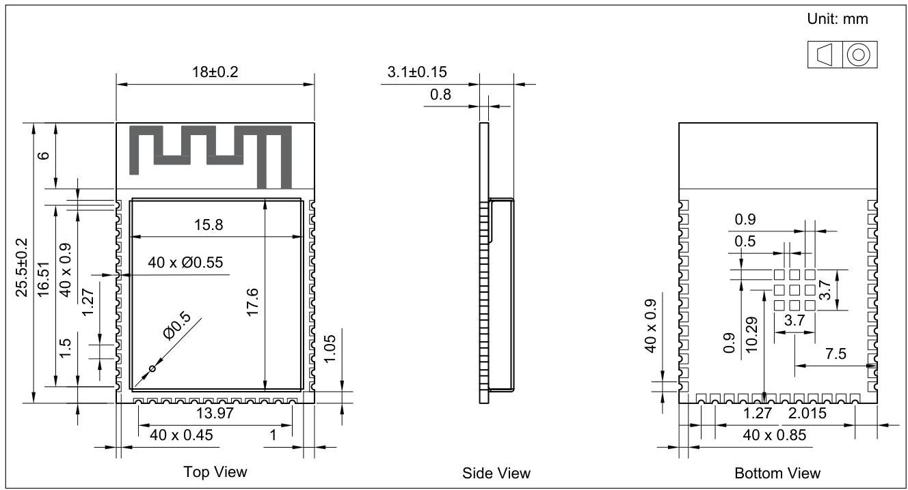
图 8: ESP32-S3-WROOM-1 模组尺寸

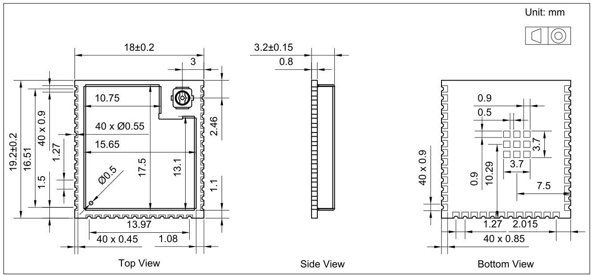
图 9: ESP32-S3-WROOM-1U 模组尺寸

说明：
有关卷带、载盘和产品标签的信息，请参阅《乐鑫模组包装信息》。

## 7.2 推荐 PCB 封装图

本章节提供以下资源供您参考：

- 推荐 PCB 封装图，标有 PCB 设计所需的全部尺寸。详见图 10 ESP32-S3-WROOM-1 推荐 PCB 封装图 和图 11 ESP32-S3-WROOM-1U 推荐 PCB 封装图。
- 推荐 PCB 封装图的源文件，用于测量图 10 和 11 中未标注的尺寸。您可用 Autodesk Viewer 查看 ESP32-S3-WROOM-1 和 ESP32-S3-WROOM-1U 的封装图源文件。
- ESP32-S3-WROOM-1 的 3D 模型。请确保下载的 3D 模型为 STEP 格式（注意，部分浏览器可能会加 txt 后缀）。

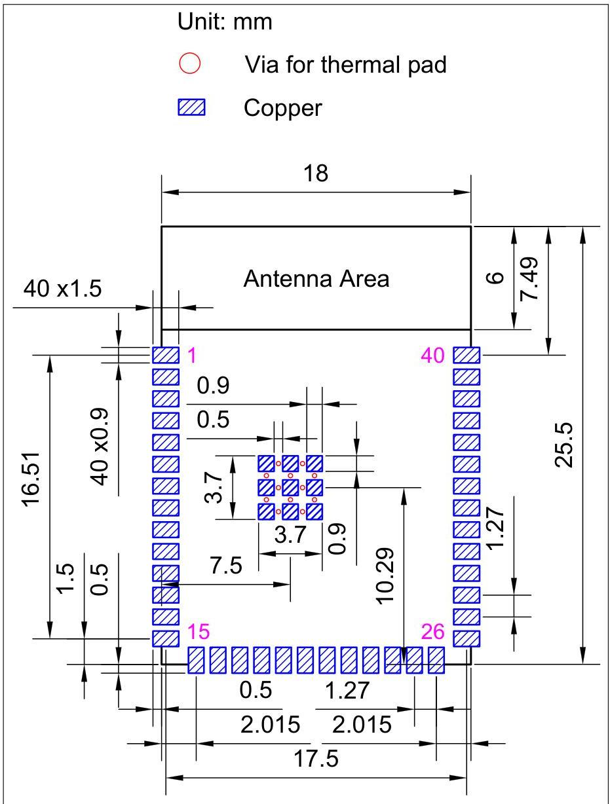
图 10: ESP32-S3-WROOM-1 推荐 PCB 封装图

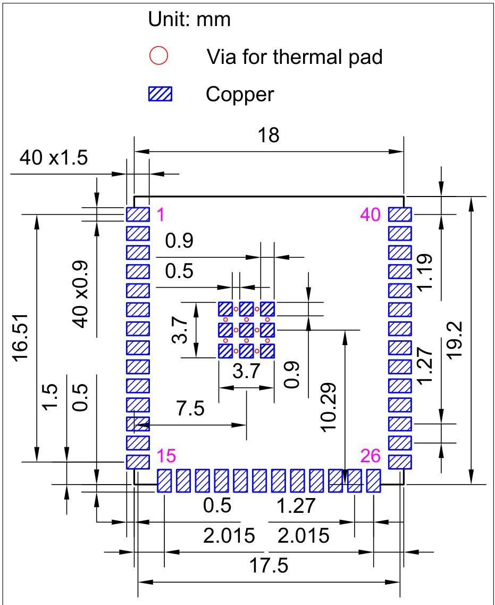

图 11: ESP32-S3-WROOM-1U 推荐 PCB 封装图

# 7.3 外部天线连接器尺寸

ESP32-S3-WROOM-1U 采用图 12 外部天线连接器尺寸图 所示的第一代外部天线连接器，该连接器兼容：

- 广濑 (Hirose) 的 U.FL 系列连接器
- I-PEX 的 MHF I 连接器
- 安费诺 (Amphenol) 的 AMC 连接器

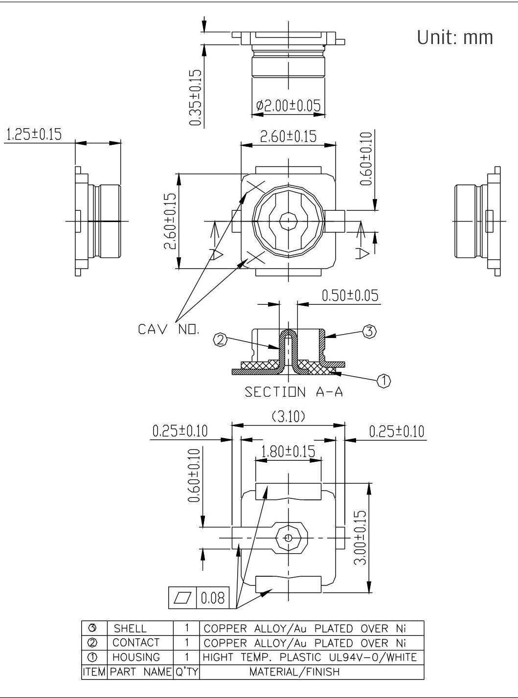
图 12: 外部天线连接器尺寸图

|  S | SHELL | 1 | COPPER ALLOY/Au PLATED OVER Ni  |
| --- | --- | --- | --- |
|  ② | CONTACT | 1 | COPPER ALLOY/Au PLATED OVER Ni  |
|  ① | HOUSING | 1 | HIGHT TEMP. PLASTIC UL94V-0/WHITE  |
|  ITEM | PART NAME | Q'TY | MATERIAL/FINISH  |

# 8 产品处理

## 8.1 存储条件

密封在防潮袋 (MBB) 中的产品应储存在 $&lt; 40^{\circ} \mathrm{C} / 90\% \mathrm{RH}$ 的非冷凝大气环境中。

模组的潮湿敏感度等级 MSL 为 3 级。

真空袋拆封后，在 $25 \pm 5^{\circ} \mathrm{C}$、$60\% \mathrm{RH}$ 下，必须在 168 小时内使用完毕，否则就需要烘烤后才能二次上线。

## 8.2 静电放电 (ESD)

- 人体放电模式 (HBM): ±2000 V
- 充电器件模式 (CDM): ±500 V

## 8.3 炉温曲线

### 8.3.1 回流焊温度曲线

建议模组只过一次回流焊。

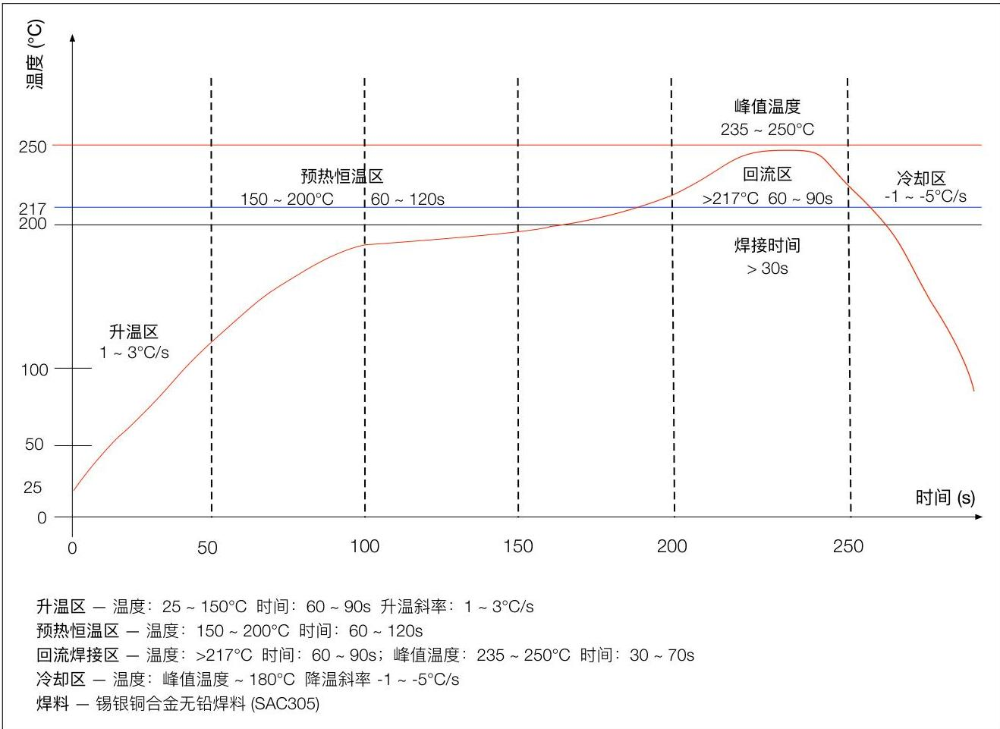

图 13: 回流焊温度曲线

## 8.4 超声波振动

请避免将乐鑫模组暴露于超声波焊接机或超声波清洗机等超声波设备的振动中。超声波设备的振动可能与模组内部的晶振产生共振，导致晶振故障甚至失灵，进而致使模组无法工作或性能退化。

# 9 相关文档和资源

## 相关文档

- 《ESP32-S3 技术规格书》 – 提供 ESP32-S3 芯片的硬件技术规格。
- 《ESP32-S3 技术参考手册》 – 提供 ESP32-S3 芯片的存储器和外设的详细使用说明。
- 《ESP32-S3 硬件设计指南》 – 提供基于 ESP32-S3 芯片的产品设计规范。
- 《ESP32-S3 系列芯片勘误表》 – 描述 ESP32-S3 系列芯片的已知错误。
- 证书
https://espressif.com/zh-hans/support/documents/certificates
- ESP32-S3 产品/工艺变更通知 (PCN)
https://espressif.com/zh-hans/support/documents/pcns?keys=ESP32-S3
- ESP32-S3 公告 – 提供有关安全、bug、兼容性、器件可靠性的信息
https://espressif.com/zh-hans/support/documents/advisories?keys=ESP32-S3
- 文档更新和订阅通知
https://espressif.com/zh-hans/support/download/documents

## 开发者社区

- 《ESP32-S3 ESP-IDF 编程指南》 – ESP-IDF 开发框架的文档中心。
- ESP-IDF 及 GitHub 上的其它开发框架
https://github.com/espressif
- ESP32 论坛 – 工程师对工程师 (E2E) 的社区，您可以在这里提出问题、解决问题、分享知识、探索观点。
https://esp32.com/
- The ESP Journal – 分享乐鑫工程师的最佳实践、技术文章和工作随笔。
https://blog.espressif.com/
- SDK 和演示、App、工具、AT 等下载资源
https://espressif.com/zh-hans/support/download/sdks-demos

## 产品

- ESP32-S3 系列芯片 – ESP32-S3 全系列芯片。
https://espressif.com/zh-hans/products/socs?id=ESP32-S3
- ESP32-S3 系列模组 – ESP32-S3 全系列模组。
https://espressif.com/zh-hans/products/modules?id=ESP32-S3
- ESP32-S3 系列开发板 – ESP32-S3 全系列开发板。
https://espressif.com/zh-hans/products/devkits?id=ESP32-S3
- ESP Product Selector（乐鑫产品选型工具） – 通过筛选性能参数、进行产品对比快速定位您所需要的产品。
https://products.espressif.com/#/product-selector?language=zh

## 联系我们

- 商务问题、技术支持、电路原理图 &amp; PCB 设计审阅、购买样品（线上商店）、成为供应商、意见与建议
https://espressif.com/zh-hans/contact-us/sales-questions

# 修订历史

|  日期 | 版本 | 发布说明  |
| --- | --- | --- |
|  2023-11-24 | v1.3 | • 新增模组型号 ESP32-S3-WROOM-1-N16R16V 和 ESP32-S3-WROOM-1U-N16R16V 并更新相关信息
• 更新表 2 ESP32-S3-WROOM-1U 系列型号对比 中的表注
• 更新章节 3.3.1 芯片启动模式控制
• 更新章节 5 模组原理图 中的模组原理图
• 更新章节 7.1 模组尺寸 中的模组尺寸图
• 其他微小改动  |
|  2023-03-07 | v1.2 | • 更新章节 3.3 Strapping 营脚
• 更新章节 4.4 功耗特性
• 更新章节 4.6.1 低功耗蓝牙射频发射器 (TX) 规格 中射频发射功率的最小值
• 更新章节 6 外因设计原理图 中的描述
• 在章节 7.2 推荐 PCB 封装图 中增加描述
• 更新章节 9 相关文档和资源
• 其他微小改动  |
|  2022-07-22 | v1.1 | • 更新表 1 和 2
• 其他微小改动  |
|  2022-04-21 | v1.0 | • 更新低功耗蓝牙射频数据
• 更新表 14 内的功耗数据
• 添加认证和测试信息
• 更新章节 3.3  |
|  2021-10-29 | v0.6 | 全面更新，针对芯片版本 revision 1  |
|  2021-07-19 | v0.5.1 | 预发布，针对芯片版本 revision 0  |

# 免责声明和版权公告

本文档中的信息，包括供参考的URL地址，如有变更，恕不另行通知。

本文档可能引用了第三方的信息，所有引用的信息均为“按现状”提供，乐鑫不对信息的准确性、真实性做任何保证。

乐鑫不对本文档的内容做任何保证，包括内容的适销性、是否适用于特定用途，也不提供任何其他乐鑫提案、规格书或样品在他处提到的任何保证。

乐鑫不对本文档是否侵犯第三方权利做任何保证，也不对使用本文档内信息导致的任何侵犯知识产权的行为负责。本文档在此未以禁止反言或其他方式授予任何知识产权许可，不管是明示许可还是暗示许可。

Wi-Fi 联盟成员标志归 Wi-Fi 联盟所有。蓝牙标志是 Bluetooth SIG 的注册商标。

文档中提到的所有商标名称、商标和注册商标均属其各自所有者的财产，特此声明。

版权归 © 2023 乐鑫信息科技（上海）股份有限公司。保留所有权利。