# Low Power Stereo Audio CODEC With Headphone Amplifier

## GENERAL DESCRIPTION

ES8388 is a high performance, low power and low cost audio CODEC. It consists of 2-ch ADC, 2-ch DAC, microphone amplifier, headphone amplifier, digital sound effects, and analog mixing and gain functions.

The device uses advanced multi-bit delta-sigma modulation technique to convert data between digital and analog. The multi-bit delta-sigma modulators make the device with low sensitivity to clock jitter and low out of band noise.

## FEATURES

### ADC

- 24-bit, 8 kHz to 96 kHz sampling frequency
- 95 dB dynamic range, 95 dB signal to noise ratio, -85 dB THD+N
- Stereo or mono microphone interface with microphone amplifier
- Auto level control and noise gate
- 2-to-1 analog input selection
- Various analog input mixing and gains

### DAC

- 24-bit, 8 kHz to 96 kHz sampling frequency
- 96 dB dynamic range, 96 dB signal to noise ratio, -83 dB THD+N
- 40 mW headphone amplifier, pop noise free
- Headphone capless mode
- Stereo enhancement
- Bass and Treble
- Various analog output mixing and gains

### Low Power

- 1.8V to 3.3V operation
- 7 mW playback; 16 mW playback and record

### System

- I²C or SPI uC interface
- 256Fs, 384Fs, USB 12 MHz or 24 MHz
- Master or slave serial port
- I²S, Left Justified, DSP/PCM Mode

## APPLICATIONS

- MID
- MP3, MP4, PMP
- Wireless audio
- Digital camera, camcorder
- GPS
- Bluetooth
- Portable audio devices

## ORDERING INFORMATION

ES8388 -40°C ~ +85°C

QFN-28

1 BLOCK DIAGRAM...4
2 28-PIN QFN AND PIN DESCRIPTIONS...5
3 TYPICAL APPLICATION CIRCUIT...7
4 CLOCK MODES AND SAMPLING FREQUENCIES...7
5 MICRO-CONTROLLER CONFIGURATION INTERFACE...9
5.1 SPI...9
5.2 2-wire...10
6 CONFIGURATION REGISTER DEFINITION...11
6.1 Chip Control and Power Management...13
6.1.1 Register 0 – Chip Control 1, Default 0000 0110...13
6.1.2 Register 1 – Chip Control 2, Default 0101 1100...13
6.1.3 Register 2 – Chip Power Management, Default 1100 0011...14
6.1.4 Register 3 – ADC Power Management, Default 1111 1100...14
6.1.5 Register 4 – DAC Power Management, Default 1100 0000...15
6.1.6 Register 5 – Chip Low Power 1, Default 0000 0000...15
6.1.7 Register 6 – Chip Low Power 2, Default 0000 0000...15
6.1.8 Register 7 – Analog Voltage Management, Default 0111 1100...15
6.1.9 Register 8 – Master Mode Control, Default 1000 0000...16
6.2 ADC Control...16
6.2.1 Register 9 – ADC Control 1, Default 0000 0000...16
6.2.2 Register 10 – ADC Control 2, Default 0000 0000...17
6.2.3 Register 11 – ADC Control 3, Default 0000 0010...17
6.2.4 Register 12 – ADC Control 4, Default 0000 0000...18
6.2.5 Register 13 – ADC Control 5, Default 0000 0110...18
6.2.6 Register 14 – ADC Control 6, Default 0011 0000...19
6.2.7 Register 15 – ADC Control 7, Default 0010 0000...19
6.2.8 Register 16 – ADC Control 8, Default 1100 0000...19
6.2.9 Register 17 – ADC Control 9, Default 1100 0000...20
6.2.10 Register 18 – ADC Control 10, Default 0011 1000...20
6.2.11 Register 19 – ADC Control 11, Default 1011 0000...20
6.2.12 Register 20 – ADC Control 12, Default 0011 0010...21
6.2.13 Register 21 – ADC Control 13, Default 0000 0110...22
6.2.14 Register 22 – ADC Control 14, Default 0000 0000...22
6.3 DAC Control...22
6.3.1 Register 23 – DAC Control 1, Default 0000 0000...22
6.3.2 Register 24 – DAC Control 2, Default 0000 0110...23
6.3.3 Register 25 – DAC Control 3, Default 0010 0010...23
6.3.4 Register 26 – DAC Control 4, Default 1100 0000...24
6.3.5 Register 27 – DAC Control 5, Default 1100 0000...24
6.3.6 Register 28 – DAC Control 6, Default 0000 1000...24
6.3.7 Register 29 – DAC Control 7, Default 0000 0000...24
6.3.8 Register 30 – DAC Control 8, Default 0001 1111...25
6.3.9 Register 31 – DAC Control 9, Default 1111 0111...25

6.3.10 Register 32 – DAC Control 10, Default 1111 1101...25
6.3.11 Register 33 – DAC Control 11, Default 1111 1111...25
6.3.12 Register 34 – DAC Control 12, Default 0001 1111...25
6.3.13 Register 35 – DAC Control 13, Default 1111 0111...25
6.3.14 Register 36 – DAC Control 14, Default 1111 1101...25
6.3.15 Register 37 – DAC Control 15, Default 1111 1111...26
6.3.16 Register 38 – DAC Control 16, Default 0000 0000...26
6.3.17 Register 39 – DAC Control 17, Default 0011 1000...26
6.3.18 Register 40 – DAC Control 18, Default 0010 1000...26
6.3.19 Register 41 – DAC Control 19, Default 0010 1000...26
6.3.20 Register 42 – DAC Control 20, Default 0011 1000...26
6.3.21 Register 43 – DAC Control 21, Default 0000 0000...27
6.3.22 Register 44 – DAC Control 22, Default 0000 0000...27
6.3.23 Register 45 – DAC Control 23, Default 0000 0000...27
6.3.24 Register 46 – DAC Control 24, Default 0000 0000...27
6.3.25 Register 47 – DAC Control 25, Default 0000 0000...28
6.3.26 Register 48 – DAC Control 26, Default 0000 0000...28
6.3.27 Register 49 – DAC Control 27, Default 0000 0000...28
6.3.28 Register 50 – DAC Control 28, Default 0000 0000...29
6.3.29 Register 51 – DAC Control 29, Default 1010 1010...29
6.3.30 Register 52 – DAC Control 30, Default 1010 1010...29

7 Digital Audio Interface...29
8 ELECTRICAL CHARACTERISTICS...30
8.1 Absolute Maximum Ratings...30
8.2 Recommended Operating Conditions...31
8.3 ADC Analog and Filter Characteristics and Specifications...31
8.4 DAC Analog and Filter Characteristics and Specifications...31
8.5 Power Consumption Characteristics...32
8.6 Serial Audio Port Switching Specifications...32
8.7 Serial Control Port Switching Specifications...34

9 PACKAGE INFORMATION...35
10 CORPOARATION INFORMATION...36

# 1 BLOCK DIAGRAM

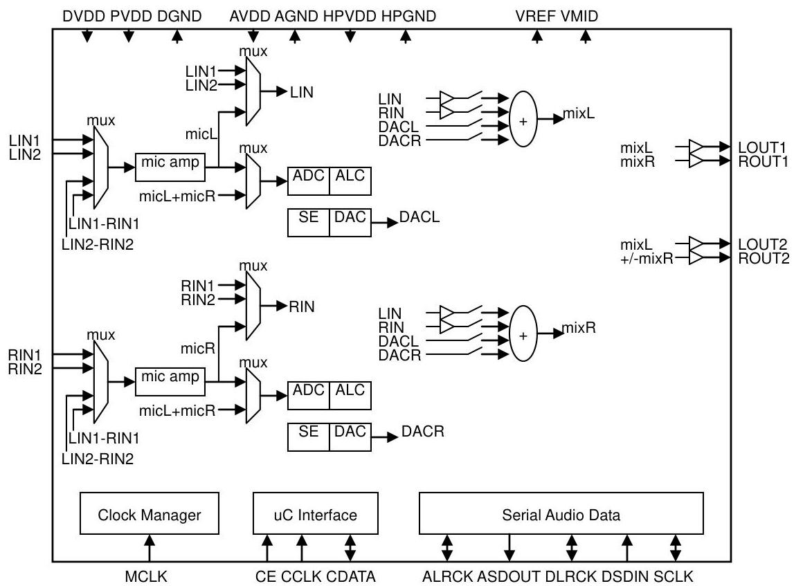

# 2 28-PIN QFN AND PIN DESCRIPTIONS

|   | QCLK | CDATA | CE | NC | LIN1 | RIN1 | LIN2  |
| --- | --- | --- | --- | --- | --- | --- | --- |
|  MCLK | 1 |  |  |  |  | 21 | RIN2  |
|  DVDD | 2 |  |  |  |  | 20 | VMID  |
|  PVDD | 3 |  |  |  |  | 19 | DACVREF  |
|  DGND | 4 |  |  |  |  | 18 | AGND  |
|  SCLK | 5 |  |  |  |  | 17 | AVDD  |
|  DSDIN | 6 |  |  |  |  | 16 | HPVDD  |
|  LRCK | 7 |  |  |  |  | 15 | LOUT2  |
|   | 8 | 9 | 10 | 11 | 12 | 13 |   |
|   | ASDOUT | NC | VREF | 1 | 1 | 1 |   |
|   |  |  | ROUT1 | 1 | 1 | 1 |   |
|   |  |  | LOUT1 | 1 | 1 | 1 |   |
|   |  |  | HPGND | 1 | 1 | 1 |   |
|   |  |  | ROUT2 | 1 | 1 | 1 |   |

ES8388 is pin and size compatible to WM8988.

|  PIN | NAME | I/O | DESCRIPTION  |
| --- | --- | --- | --- |
|  1 | MCLK | I | Master clock  |
|  2 | DVDD | Supply | Digital core supply  |
|  3 | PVDD | Supply | Digital IO supply  |
|  4 | DGND | Supply | Digital ground (return path for both DVDD and PVDD)  |
|  5 | SCLK | I/O | Audio data bit clock  |
|  6 | DSDIN | I | DAC audio data  |
|  7 | LRCK | I/O | Audio data left and right clock  |
|  8 | ASDOUT | O | ADC audio data  |
|  9 | NC |  | No connect  |
|  10 | VREF | O | Decoupling capacitor  |
|  11 | ROUT1 | O | Right output 1 (line or speaker/headphone)  |
|  12 | LOUT1 | O | Left output 1 (line or speaker/headphone)  |
|  13 | HPGND | Supply | Ground for analog output drivers (LOUT1/2, ROUT1/2)  |
|  14 | ROUT2 | O | Right output 2 (line or speaker/headphone)  |
|  15 | LOUT2 | O | Left output 2 (line or speaker/headphone)  |
|  16 | HPVDD | Supply | Supply for analog output drivers (LOUT1/2, ROUT1/2)  |
|  17 | AVDD | Supply | Analog supply  |
|  18 | AGND | Supply | Analog ground  |
|  19 | ADCVREF | O | Decoupling capacitor  |
|  20 | VMID | O | Decoupling capacitor  |
|  21 | RIN2 | AI | Right channel input 2  |
|  22 | LIN2 | I | Left channel input 2  |
|  23 | RIN1 | I | Right channel input 1  |
|  24 | LIN1 | I | Left channel input 1  |
|  25 | NC |  | No connect  |
|  26 | CE | I | Control select or device address selection  |
|  27 | CDATA | I/O | Control data input or output  |
|  28 | CCLK | I | Control clock input  |

# 3 TYPICAL APPLICATION CIRCUIT

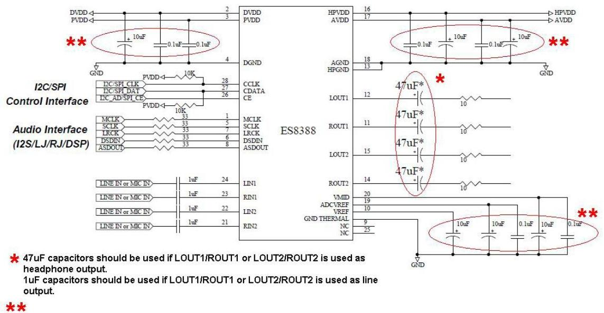

★ 4TuF capacitors should be used if LOUT1/ROUT1 or LOUT2/ROUT2 is used as headphone output.
1uF capacitors should be used if LOUT1/ROUT1 or LOUT2/ROUT2 is used as line output.

For best performance, the decoupling and filter capacitors should be located as close to the device package as possible.

# 4 CLOCK MODES AND SAMPLING FREQUENCIES

According to the input serial audio data sampling frequency, the device can work in two speed modes: single speed or double speed. The ranges of the sampling frequency in these two modes are listed in Table 1. The device can work either in master clock mode or slave clock mode.

In slave mode, LRCK and SCLK are supplied externally. LRCK and SCLK must be synchronously derived from the system clock with specific rates. The device can auto detect MCLK/LRCK ratio according to Table 1. The device only supports the MCLK/LRCK ratios listed in Table 1. The LRCK/SCLK ratio is normally 64.

Table 1 Slave Mode Sampling Frequencies and MCLK/LRCK Ratio

|  Speed Mode | Sampling Frequency | MCLK/LRCK Ratio  |
| --- | --- | --- |
|  Single Speed | 8kHz – 50kHz | 256, 384, 512, 768, 1024  |
|  Double Speed | 50kHz – 100kHz | 128, 192, 256, 384, 512  |

In master mode, LRCK and SCLK are derived internally from MCLK. The available MCLK/LRCK ratios and SCLK/LRCK ratios are listed in Table 2.

Table 2 Master Mode Sampling Frequencies and MCLK/LRCK Ratio

|  MCLK
CLKDIV2=0 | MCLK
CLKDIV2=1 | ADC Sample Rate
(ALRCK) | ADCFsRatio
[4:0] | DAC Sample Rate
(DLRCK) | DACFsRatio
[4:0] | SCLK
Ratio  |
| --- | --- | --- | --- | --- | --- | --- |
|  Normal Mode  |   |   |   |   |   |   |
|  12.288 MHz | 24.576MHz | 8 kHz (MCLK/1536) | 01010 | 8 kHz (MCLK/1536) | 01010 | MCLK/6  |
|   |   |  8 kHz (MCLK/1536) | 01010 | 48 kHz (MCLK/256) | 00010 | MCLK/4  |
|   |   |  12 kHz (MCLK/1024) | 00111 | 12 kHz (MCLK/1024) | 00111 | MCLK/4  |
|   |   |  16 kHz (MCLK/768) | 00110 | 16 kHz (MCLK/768) | 00110 | MCLK/6  |
|   |   |  24 kHz (MCLK/512) | 00100 | 24 kHz (MCLK/512) | 00100 | MCLK/4  |
|   |   |  32 kHz (MCLK/384) | 00011 | 32 kHz (MCLK/384) | 00011 | MCLK/6  |
|   |   |  48 kHz (MCLK/256) | 00010 | 8 kHz (MCLK/1536) | 01010 | MCLK/4  |
|   |   |  48 kHz (MCLK/256) | 00010 | 48 kHz (MCLK/256) | 00010 | MCLK/4  |
|   |   |  96 kHz (MCLK/128) | 00000 | 96 kHz (MCLK/128) | 00000 | MCLK/2  |
|  11.2896 MHz | 22.5792MHz | 8.0182 kHz (MCLK/1408) | 01001 | 8.0182 kHz (MCLK/1408) | 01001 | MCLK/4  |
|   |   |  8.0182 kHz (MCLK/1408) | 01001 | 44.1 kHz (MCLK/256) | 00010 | MCLK/4  |
|   |   |  11.025 kHz (MCLK/1024) | 00111 | 11.025 kHz (MCLK/1024) | 00111 | MCLK/4  |
|   |   |  22.05 kHz (MCLK/512) | 00100 | 22.05 kHz (MCLK/512) | 00100 | MCLK/4  |
|   |   |  44.1 kHz (MCLK/256) | 00010 | 8.0182 kHz (MCLK/1408) | 01001 | MCLK/4  |
|   |   |  44.1 kHz (MCLK/256) | 00010 | 44.1 kHz (MCLK/256) | 00010 | MCLK/4  |
|   |   |  88.2 kHz (MCLK/128) | 00000 | 88.2 kHz (MCLK/128) | 00000 | MCLK/2  |
|  18.432 MHz | 36.864MHz | 8 kHz (MCLK/2304) | 01100 | 8 kHz (MCLK/2304) | 01100 | MCLK/6  |
|   |   |  8 kHz (MCLK/2304) | 01100 | 48 kHz (MCLK/384) | 00011 | MCLK/6  |
|   |   |  12 kHz (MCLK/1536) | 01010 | 12 kHz (MCLK/1536) | 01010 | MCLK/6  |
|   |   |  16 kHz (MCLK/1152) | 01000 | 16 kHz (MCLK/1152) | 01000 | MCLK/6  |
|   |   |  24 kHz (MCLK/768) | 00110 | 24 kHz (MCLK/768) | 00110 | MCLK/6  |
|   |   |  32 kHz (MCLK/576) | 00101 | 32 kHz (MCLK/576) | 00101 | MCLK/6  |
|   |   |  48 kHz (MCLK/384) | 00011 | 8 kHz (MCLK/2304) | 01100 | MCLK/6  |
|   |   |  48 kHz (MCLK/384) | 00011 | 48 kHz (MCLK/384) | 00011 | MCLK/6  |
|   |   |  96 kHz (MCLK/192) | 00001 | 96 kHz (MCLK/192) | 00001 | MCLK/3  |
|  16.9344 MHz | 33.8688MHz | 8.0182 kHz (MCLK/2112) | 01011 | 8.0182 kHz (MCLK/2112) | 01011 | MCLK/6  |
|   |   |  8.0182 kHz (MCLK/2112) | 01011 | 44.1 kHz (MCLK/384) | 00011 | MCLK/6  |
|   |   |  11.025 kHz (MCLK/1536) | 01010 | 11.025 kHz (MCLK/1536) | 01010 | MCLK/6  |
|   |   |  22.05 kHz (MCLK/768) | 00110 | 22.05 kHz (MCLK/768) | 00110 | MCLK/6  |
|   |   |  44.1 kHz (MCLK/384) | 00011 | 8.0182 kHz (MCLK/2112) | 01011 | MCLK/6  |
|   |   |  44.1 kHz (MCLK/384) | 00011 | 44.1 kHz (MCLK/384) | 00011 | MCLK/6  |
|   |   |  88.2 kHz (MCLK/192) | 00001 | 88.2 kHz (MCLK/192) | 00001 | MCLK/3  |
|  USB Mode  |   |   |   |   |   |   |
|  12 MHz | 24MHz | 8 kHz (MCLK/1500) | 11011 | 8 kHz (MCLK/1500) | 11011 | MCLK  |
|   |   |  8 kHz (MCLK/1500) | 11011 | 48 kHz (MCLK/250) | 10010 | MCLK  |
|   |   |  8.0214 kHz (MCLK/1496) | 11010 | 8.0214 kHz (MCLK/1496) | 11010 | MCLK  |
|   |   |  8.0214 kHz (MCLK/1496) | 11010 | 44.118 kHz (MCLK/272) | 10011 | MCLK  |

|   | 11.0259 kHz
(MCLK/1088) | 11001 | 11.0259 kHz
(MCLK/1088) | 11001 | MCLK  |
| --- | --- | --- | --- | --- | --- |
|   |  12 kHz (MCLK/1000) | 11000 | 12 kHz (MCLK/1000) | 11000 | MCLK  |
|   |  16 kHz (MCLK/750) | 10111 | 16 kHz (MCLK/750) | 10111 | MCLK  |
|   |  22.0588 kHz (MCLK/544) | 10110 | 22.0588 kHz (MCLK/544) | 10110 | MCLK  |
|   |  24 kHz (MCLK/500) | 10101 | 24 kHz (MCLK/500) | 10101 | MCLK  |
|   |  32 kHz (MCLK/375) | 10100* | 32 kHz (MCLK/375) | 10100* | MCLK  |
|   |  44.118 kHz (MCLK/272) | 10011 | 8.0214 kHz (MCLK/1496) | 11010 | MCLK  |
|   |  44.118 kHz (MCLK/272) | 10011 | 44.118 kHz (MCLK/272) | 10011 | MCLK  |
|   |  48 kHz (MCLK/250) | 10010 | 8 kHz (MCLK/1500) | 11011 | MCLK  |
|   |  48 kHz (MCLK/250) | 10010 | 48 kHz (MCLK/250) | 10010 | MCLK  |
|   |  88.235 kHz (MCLK/136) | 10001 | 88.235 kHz (MCLK/136) | 10001 | MCLK  |
|   |  96 kHz (MCLK/125) | 10000 | 96 kHz (MCLK/125) | 10000 | MCLK  |

# 5 MICRO-CONTROLLER CONFIGURATION INTERFACE

The device supports standard SPI and 2-wire micro-controller configuration interface. External micro-controller can completely configure the device through writing to internal configuration registers. Please see section 8 for the details of configuration register definition.

The identical device pins are used to configure either SPI or 2-wire interface. In SPI mode, pin CE, CCLK and CDATA function as SPI_CSn, SPI_CLK and SPI_DIN. In 2-wire mode, pin CE, CCLK and CDATA function as AD0, SCL and SDA. To select SPI mode, apply high to low transition signal to CE pin. Otherwise the device will operate in 2-wire interface mode.

## 5.1 SPI

ES8388 has a SPI (Serial Peripheral Interface) compliant synchronous serial slave controller inside the chip. It provides the ability to allow the external master SPI controller to access the internal registers, and thus control the operations of chip.

All lines on the SPI bus are unidirectional: The SPI_CLK is generated by the master controller and is primarily used to synchronize data transfer, the SPI_DIN line carries data from the master to the slave; SPI_CSn is generated by the master to select ES8388.

The timing diagram of this interface is given in Figure 1. The high to low transition at SPI_CSn pin indicates the SPI interface selected. Each write procedure contains 3 words, i.e. Chip Address plus R/W bit, internal register address and internal register data. Every word length is fixed at 8 bits. The input SPI_DIN data are sampled at the rising edge of SPI_CLK clock. The

MSB bit in each word is transferred firstly. The transfer rate can be up to 10M bps.

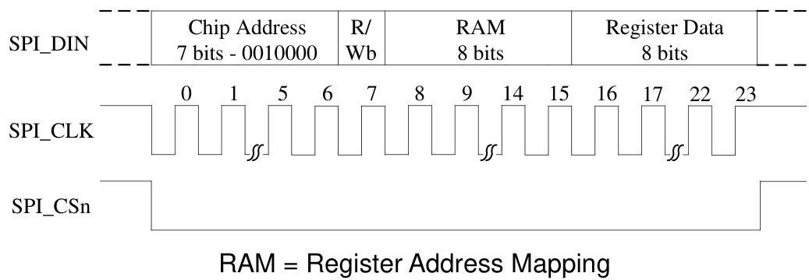
Figure 1 SPI Configuration Interface Timing Diagram

## 5.2 2-wire

The device supports standard 2-wire micro-controller configuration interface. External micro-controller can completely configure the device through writing to internal configuration registers.

2-wire interface is a bi-directional serial bus that uses a serial data line (SDA) and a serial clock line (SCL) for data transfer. The timing diagram for data transfer of this interface is given in Figure 2a and Figure 2b. Data are transmitted synchronously to SCL clock on the SDA line on a byte-by-byte basis. Each bit in a byte is sampled during SCL high with MSB bit being transmitted firstly. Each transferred byte is followed by an acknowledge bit from receiver to pull the SDA low. The transfer rate of this interface can be up to 400 kbps.

A master controller initiates the transmission by sending a "start" signal, which is defined as a high-to-low transition at SDA while SCL is high. The first byte transferred is the slave address. It is a seven-bit chip address followed by a RW bit. The chip address must be 001000x, where x equals AD0. The RW bit indicates the slave data transfer direction. Once an acknowledge bit is received, the data transfer starts to proceed on a byte-by-byte basis in the direction specified by the RW bit. The master can terminate the communication by generating a "stop" signal, which is defined as a low-to-high transition at SDA while SCL is high.

In 2-wire interface mode, the registers can be written and read. The formats of "write" and "read" instructions are shown in Table 1 and Table 2. Please note that, to read data from a register, you must set R/W bit to 0 to access the register address and then set R/W to 1 to read data from the register.

Table 3 Write Data to Register in 2-wire Interface Mode

|   | Chip Address |   | R/W |  | Register Address |  | Data to be written |  |   |
| --- | --- | --- | --- | --- | --- | --- | --- | --- | --- |
|  start | 001000 | AD0 | 0 | ACK | RAM | ACK | DATA | ACK | Stop  |

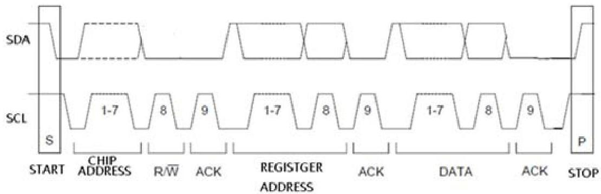
Figure 2a 2-wire Write Timing

Table 4 Read Data from Register in 2-wire Interface Mode

|   | Chip Address |   | R/W |  | Register Address |  |   |
| --- | --- | --- | --- | --- | --- | --- | --- |
|  Start | 001000 | AD0 | 0 | ACK | RAM | ACK |   |
|   | Chip Address |   | R/W |  | Data to be read |  |   |
|  Start | 001000 | AD0 | 1 | ACK | Data | NACK | Stop  |

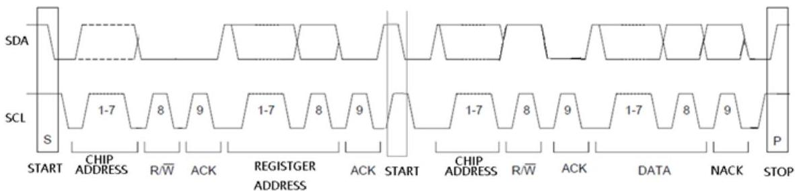
Figure 2b 2-wire Read Timing

# 6 CONFIGURATION REGISTER DEFINITION

SPI and 2-wire configuration interface share the same registers because there is only one interface active at any time. There are total of 53 user programmable 8-bit registers in this device. These registers control the operations of ADC and DAC. External master controller can access these registers by using the slave address specified in RAM (Register Address Map) register as shown in the Table 5.

Table 5 Bit Content of Register Address Map

|   | B7 | B6 | B5 | B4 | B3 | B2 | B1 | B0  |
| --- | --- | --- | --- | --- | --- | --- | --- | --- |
|  Reg. 00 | SCPReset | LRCM | DACMCLK | SameFs | SeqEn | EnRef | VMIDSEL  |   |
|  Reg. 01 |  |  | LPVcmMod | LPVrefBuf | PdnAna | PdnIbiasgen | VrefrLo | PdnVrefbuf  |

|  Reg. 02 | adc_DigPDN | dac_DigPDN | adc_stm_rst | dac_stm_rst | ADCDLL_PDN | DACDLL_PDN | adcVref_PDN | dacVref_PDN  |
| --- | --- | --- | --- | --- | --- | --- | --- | --- |
|  Reg. 03 | PdnAINL | PdnAINR | PdnADCL | PdnADCR | PdnMICB | PdnADCBiasgen | flashLP | int1LP  |
|  Reg. 04 | PdnDACL | PdnDACR | LOUT1 | ROUT1 | LOUT2 | ROUT2 |  |   |
|  Reg. 05 | LPDACL | LPDACR | LPLOUT1 |  | LPLOUT2 |  |  |   |
|  Reg. 06 | LPPGA | LPLMIX |  |  |  |  | LPADCvrp | LPDACvrp  |
|  Reg. 07 |  | VSEL  |   |   |   |   |   |   |
|  Reg. 08 | MSC | MCLKDIV2 | BCLK_INV | BCLKDIV  |   |   |   |   |
|  Reg. 09 | MicAmpL |   |   |   | MicAmpR  |   |   |   |
|  Reg. 10 | LINSEL |   | RINSEL |   | DSSEL | DSR |  |   |
|  Reg. 11 | DS |  |  | MONOMIX |   | TRI |   |   |
|  Reg. 12 | DATSEL |   | ADCLRP | ADCWL |   |   | ADCFORMAT  |   |
|  Reg. 13 |  |  | ADCFsMode | ADCFsRatio  |   |   |   |   |
|  Reg. 14 | ADC_invL | ADC_invR | ADC_HPF_L | ADC_HPF_R |  |  |  |   |
|  Reg. 15 | ADCRampRate | ADCSoftRamp |  | ADCLER | ADCMute |  |  |   |
|  Reg. 16 | LADCVOL  |   |   |   |   |   |   |   |
|  Reg. 17 | RADCVOL  |   |   |   |   |   |   |   |
|  Reg. 18 | ALCSEL |   | MAXGAIN |   |   | MINGAIN  |   |   |
|  Reg. 19 | ALCLVL |   |   |   | ALCHLD  |   |   |   |
|  Reg. 20 | ALCDCY |   |   |   | ALCATK  |   |   |   |
|  Reg. 21 | ALCMODE | ALCZC | TIME_OUT | WIN_SIZE  |   |   |   |   |
|  Reg. 22 | NGTH |   |   |   |   | NGG |   | NGAT  |
|  Reg. 23 | DACLRSWAP | DACLRP | DACWL |   |   | DACFORMAT |   |   |
|  Reg. 24 |  |  | DACFsMode | DACFsRatio  |   |   |   |   |
|  Reg. 25 | DACRampRate |   | DACSoftRamp |  | DACLeR | DACMute |  |   |
|  Reg. 26 | DACVolumeL (LDACVOL)  |   |   |   |   |   |   |   |
|  Reg. 27 | DACVolumeR (RDACVOL)  |   |   |   |   |   |   |   |
|  Reg. 28 | DeemphasisMode |   | DAC_invL | DAC_invR | ClickFree |  |  |   |
|  Reg. 29 | ZeroL | ZeroR | Mono | SE |   |   | Vpp_scale  |   |
|  Reg. 30 |  |  | Shelving_a[29:24]  |   |   |   |   |   |
|  Reg. 31 | Shelving_a[23:16]  |   |   |   |   |   |   |   |
|  Reg. 32 | Shelving_a[15:8]  |   |   |   |   |   |   |   |
|  Reg. 33 | Shelving_a[7:0]  |   |   |   |   |   |   |   |
|  Reg. 34 |  |  | Shelving_b[29:24]  |   |   |   |   |   |
|  Reg. 35 | Shelving_b[23:16]  |   |   |   |   |   |   |   |
|  Reg. 36 | Shelving_b[15:8]  |   |   |   |   |   |   |   |
|  Reg. 37 | Shelving_b[7:0]  |   |   |   |   |   |   |   |
|  Reg. 38 |  |   | LMIXSEL |   |   | RMIXSEL  |   |   |
|  Reg. 39 | LD2LO | LI2LO | LI2LOVOL |   |   |  |  |   |
|  Reg. 40 |  |  |  |   |   |  |  |   |
|  Reg. 41 |  |  |  |   |   |  |  |   |
|  Reg. 42 | RD2RO | RI2RO | RI2ROVOL |   |   |  |  |   |

|  Reg. 43 | slrck | Lrck_sel | offset_dis, | mclk_dis | Adc_dll_pwd | Dac_dll_pwd |  |   |
| --- | --- | --- | --- | --- | --- | --- | --- | --- |
|  Reg. 44 | offset  |   |   |   |   |   |   |   |
|  Reg. 45 |  |  |   | VROI |  |  |  |   |
|  Reg. 46 |  | LOUT1VOL  |   |   |   |   |   |   |
|  Reg. 47 |  | ROUT1VOL  |   |   |   |   |   |   |
|  Reg. 48 |  | LOUT2VOL  |   |   |   |   |   |   |
|  Reg. 49 |  | ROUT2VOL  |   |   |   |   |   |   |
|  Reg. 50 |  |   |   |   |   |   |   |   |
|  Reg. 51 | hpLout1_ref1 | hpLout1_ref2 |  |  |  |  |  |   |
|  Reg. 52 | spkLout2_ref1 | spkLout2_ref2 |  |  | mixer_ref1 | mixer_ref2 | MREF1 | MREF2  |

# 6.1 Chip Control and Power Management

## 6.1.1 Register 0 – Chip Control 1, Default 0000 0110

|  Bit Name | Bit | Description  |
| --- | --- | --- |
|  SCPReset | 7 | 0 – normal (default)
1 – reset control port register to default  |
|  LRCM | 6 | 0 – ALRCK disabled when both ADC disabled; DLRCK disabled when both DAC disabled (default)
1 – ALRCK and DLRCK disabled when all ADC and DAC disabled  |
|  DACMCLK | 5 | 0 – when SameFs=1, ADCMCLK is the chip master clock source (default)
1 – when SameFs=1, DACMCLK is the chip master clock source  |
|  SameFs | 4 | 0 – ADC Fs differs from DAC Fs (default)
1 – ADC Fs is the same as DAC Fs  |
|  SeqEn | 3 | 0 – internal power up/down sequence disable (default)
1 – internal power up/down sequence enable  |
|  EnRef | 2 | 0 – disable reference
1 – enable reference (default)  |
|  VMIDSEL | 1:0 | 00 – Vmid disabled
01 – 50 kΩ divider enabled
10 – 500 kΩ divider enabled (default)
11 – 5 kΩ divider enabled  |

## 6.1.2 Register 1 – Chip Control 2, Default 0101 1100

|  Bit Name | Bit | Description  |
| --- | --- | --- |
|  LPVcmMod | 5 | 0 – normal (default)
1 – low power  |
|  LPVrefBuf | 4 | 0 – normal
1 – low power (default)  |
|  PdnAna | 3 | 0 – normal
1 – entire analog power down (default)  |
|  PdnIbiasgen | 2 | 0 – normal  |

|   |  | 1 – ibiasgen power down (default)  |
| --- | --- | --- |
|  VrefLo | 1 | 0 – normal (default)
1 – low power  |
|  PdnVrefbuf | 0 | 0 – normal (default)
1 – power down  |

## 6.1.3 Register 2 – Chip Power Management, Default 1100 0011

|  Bit Name | Bit | Description  |
| --- | --- | --- |
|  adc_DigPDN | 7 | 0 – normal
1 – resets ADC DEM, filter and serial data port (default)  |
|  dac_DigPDN | 6 | 0 – normal
1 – resets DAC DSM, DEM, filter and serial data port (default)  |
|  adc_stm_rst | 5 | 0 – normal (default)
1 – reset ADC state machine to power down state  |
|  dac_stm_rst | 4 | 0 – normal (default)
1 – reset DAC state machine to power down state  |
|  ADCDLL_PDN | 3 | 0 – normal (default)
1 – ADC_DLL power down, stop ADC clock  |
|  DACDLL_PDN | 2 | 0 – normal (default)
1 – DAC DLL power down, stop DAC clock  |
|  adcVref_PDN | 1 | 0 – ADC analog reference power up
1 – ADC analog reference power down (default)  |
|  dacVref_PDN | 0 | 0 – DAC analog reference power up
1 – DAC analog reference power down (default)  |

## 6.1.4 Register 3 – ADC Power Management, Default 1111 1100

|  Bit Name | Bit | Description  |
| --- | --- | --- |
|  PdnAINL | 7 | 0 – normal
1 – left analog input power down (default)  |
|  PdnAINR | 6 | 0 – normal
1 – right analog input power down (default)  |
|  PdnADCL | 5 | 0 – left ADC power up
1 – left ADC power down (default)  |
|  PdnADCR | 4 | 0 – right ADC power up
1 – right ADC power down (default)  |
|  PdnMICB | 3 | 0 – microphone bias power on
1 – microphone bias power down (high impedance output, default)  |
|  PdnADCBiasgen | 2 | 0 – normal
1 – power down (default)  |
|  flashLP | 1 | 0 – normal (default)
1 – flash ADC low power  |
|  int1LP | 0 | 0 – normal (default)
1 – int1 low power  |

6.1.5 Register 4 – DAC Power Management, Default 1100 0000

|  Bit Name | Bit | Description  |
| --- | --- | --- |
|  PdnDACL | 7 | 0 – left DAC power up
1 – left DAC power down (default)  |
|  PdnDACR | 6 | 0 – right DAC power up
1 – right DAC power down (default)  |
|  LOUT1 | 5 | 0 – LOUT1 disabled (default)
1 – LOUT1 enabled  |
|  ROUT1 | 4 | 0 – ROUT1 disabled (default)
1 – ROUT1 enabled  |
|  LOUT2 | 3 | 0 – LOUT2 disabled (default)
1 – LOUT2 enabled  |
|  ROUT2 | 2 | 0 – ROUT2 disabled (default)
1 – ROUT2 enabled  |

6.1.6 Register 5 – Chip Low Power 1, Default 0000 0000

|  Bit Name | Bit | Description  |
| --- | --- | --- |
|  LPDACL | 7 | 0 – normal (default)
1 – low power  |
|  LPDACR | 6 | 0 – normal (default)
1 – low power  |
|  LPLOUT1 | 5 | 0 – normal (default)
1 – low power  |
|  LPLOUT2 | 3 | 0 – normal (default)
1 – low power  |

6.1.7 Register 6 – Chip Low Power 2, Default 0000 0000

|  Bit Name | Bit | Description  |
| --- | --- | --- |
|  LPPGA | 7 | 0 – normal (default)
1 – low power  |
|  LPLMIX | 6 | 0 – normal (default)
1 – low power  |
|  LPADCvrp | 1 | 0 – normal (default)
1 – low power  |
|  LPDACvrp | 0 | 0 – normal (default)
1 – low power  |

6.1.8 Register 7 – Analog Voltage Management, Default 0111 1100

|  Bit Name | Bit | Description  |
| --- | --- | --- |
|  VSEL | 6:0 | 1111100 – normal (default)  |

6.1.9 Register 8 – Master Mode Control, Default 1000 0000

|  Bit Name | Bit | Description  |
| --- | --- | --- |
|  MSC | 7 | 0 – slave serial port mode
1 – master serial port mode (default)  |
|  MCLKDIV2 | 6 | 0 – MCLK not divide (default)
1 – MCLK divide by 2  |
|  BCLK_INV | 5 | 0 – normal (default)
1 – BCLK inverted  |
|  BCLKDIV | 4:0 | 00000 – master mode BCLK generated automatically based on the clock table (default)
00001 – MCLK/1
00010 – MCLK/2
00011 – MCLK/3
00100 – MCLK/4
00101 – MCLK/6
00110 – MCLK/8
00111 – MCLK/9
01000 – MCLK/11
01001 – MCLK/12
01010 – MCLK/16
01011 – MCLK/18
01100 – MCLK/22
01101 – MCLK/24
01110 – MCLK/33
01111 – MCLK/36
10000 – MCLK/44
10001 – MCLK/48
10010 – MCLK/66
10011 – MCLK/72
10100 – MCLK/5
10101 – MCLK/10
10110 – MCLK/15
10111 – MCLK/17
11000 – MCLK/20
11001 – MCLK/25
11010 – MCLK/30
11011 – MCLK/32
11100 – MCLK/34
Others – MCLK/4  |

## 6.2 ADC Control

### 6.2.1 Register 9 – ADC Control 1, Default 0000 0000

|  Bit Name | Bit | Description  |
| --- | --- | --- |

|  MicAmpL | 7:4 | Left channel PGA gain
0000 – 0 dB (default)
0001 – +3 dB
0010 – +6 dB
0011 – +9 dB
0100 – +12 dB
0101 – +15 dB
0110 – +18 dB
0111 – +21 dB
1000 – +24 dB  |
| --- | --- | --- |
|  MicAmpR | 3:0 | Right channel PGA gain
0000 – 0dB (default)
0001 – +3 dB
0010 – +6 dB
0011 – +9 dB
0100 – +12 dB
0101 – +15 dB
0110 – +18 dB
0111 – +21 dB
1000 – +24 dB  |

6.2.2 Register 10 – ADC Control 2, Default 0000 0000

|  Bit Name | Bit | Description  |
| --- | --- | --- |
|  LINSEL | 7:6 | Left channel input select
00 – LINPUT1 (default)
01 – LINPUT2
10 – reserved
11 – L-R differential (either LINPUT1-RINPUT1 or LINPUT2-RINPUT2, selected by DS)  |
|  RINSEL | 5:4 | Right channel input select
00 – RINPUT1 (default)
01 – RINPUT2
10 – reserved
11 – L-R differential (either LINPUT1-RINPUT1 or LINPUT2-RINPUT2, selected by DS)  |
|  DSSEL | 3 | 0 – use one DS Reg11[7] (default)
1 – DSL=Reg11[7], DSR=Reg10[2]  |
|  DSR | 2 | Differential input select
0 – LINPUT1-RINPUT1 (default)
1 – LINPUT2-RINPUT2  |

6.2.3 Register 11 – ADC Control 3, Default 0000 0010

|  Bit Name | Bit | Description  |
| --- | --- | --- |
|  DS | 7 | Differential input select
0 – LINPUT1-RINPUT1 (default)  |

|   |  | 1 – LINPUT2-RINPUT2  |
| --- | --- | --- |
|  MONOMIX | 4:3 | 00 – stereo (default)
01 – analog mono mix to left ADC
10 – analog mono mix to right ADC
11 – reserved  |
|  TRI | 2 | 0 – ASDOUT is ADC normal output (default)
1 – ASDOUT tri-stated, ALRCK, DLRCK and SCLK are inputs  |

6.2.4 Register 12 – ADC Control 4, Default 0000 0000

|  Bit Name | Bit | Description  |
| --- | --- | --- |
|  DATSEL | 7:6 | 00 – left data = left ADC, right data = right ADC
01 – left data = left ADC, right data = left ADC
10 – left data = right ADC, right data = right ADC
11 – left data = right ADC, right data = left ADC  |
|  ADCLRP | 5 | I2S, left justified or right justified mode:
0 – left and right normal polarity
1 – left and right inverted polarity
DSP/PCM mode:
0 – MSB is available on 2nd BCLK rising edge after ALRCK rising edge
1 – MSB is available on 1st BCLK rising edge after ALRCK rising edge  |
|  ADCWL | 4:2 | 000 – 24-bit serial audio data word length
001 – 20-bit serial audio data word length
010 – 18-bit serial audio data word length
011 – 16-bit serial audio data word length
100 – 32-bit serial audio data word length  |
|  ADCFORMAT | 1:0 | 00 – I2S serial audio data format
01 – left justify serial audio data format
10 – right justify serial audio data format
11 – DSP/PCM mode serial audio data format  |

6.2.5 Register 13 – ADC Control 5, Default 0000 0110

|  Bit Name | Bit | Description  |
| --- | --- | --- |
|  ADCFsMode | 5 | 0 – single speed mode (default)
1 – double speed mode  |
|  ADCFsRatio | 4:0 | Master mode ADC MCLK to sampling frequency ratio  |

|  00000 – 128 | 10000 – 125  |
| --- | --- |
|  00001 – 192 | 10001 – 136  |
|  00010 – 256 | 10010 – 250  |
|  00011 – 384 | 10011 – 272  |
|  00100 – 512 | 10100 – 375  |
|  00101 – 576 | 10101 – 500  |
|  00110 – 768 (default) | 10110 – 544  |
|  00111 – 1024 | 10111 – 750  |
|  01000 – 1152 | 11000 – 1000  |
|  01001 – 1408 | 11001 – 1088  |
|  01010 – 1536 | 11010 – 1496  |
|  01011 – 2112 | 11011 – 1500  |
|  01100 – 2304 |   |
|  Other – reserved |   |

6.2.6 Register 14 – ADC Control 6, Default 0011 0000

|  Bit Name | Bit | Description  |
| --- | --- | --- |
|  ADC_invL | 7 | 0 – normal (default)
1 – left channel polarity inverted  |
|  ADC_invR | 6 | 0 – normal (default)
1 – right channel polarity inverted  |
|  ADC_HPF_L | 5 | 0 – disable ADC left channel high pass filter
1 – enable ADC left channel high pass filter (default)  |
|  ADC_HPF_R | 4 | 0 – disable ADC right channel high pass filter
1 – enable ADC right channel high pass filter (default)  |

6.2.7 Register 15 – ADC Control 7, Default 0010 0000

|  Bit Name | Bit | Description  |
| --- | --- | --- |
|  ADCRampRate | 7:6 | 00 – 0.5 dB per 4 LRCK digital volume control ramp rate (default)
01 – 0.5 dB per 8 LRCK digital volume control ramp rate
10 – 0.5 dB per 16 LRCK digital volume control ramp rate
11 – 0.5 dB per 32 LRCK digital volume control ramp rate  |
|  ADCSoftRamp | 5 | 0 – disabled digital volume control soft ramp
1 – enabled digital volume control soft ramp (default)  |
|  ADCLER | 3 | 0 – normal (default)
1 – both channel gain control is set by ADC left gain control register  |
|  ADCMute | 2 | 0 – normal (default)
1 – mute ADC digital output  |

6.2.8 Register 16 – ADC Control 8, Default 1100 0000

|  Bit Name | Bit | Description  |
| --- | --- | --- |
|  LADCVOL | 7:0 | Digital volume control attenuates the signal in 0.5 dB incremental from 0 to –96 dB.
00000000 – 0 dB  |

00000001 – -0.5 dB
00000010 – -1 dB
...
11000000 – -96 dB (default)

## 6.2.9 Register 17 – ADC Control 9, Default 1100 0000

|  Bit Name | Bit | Description  |
| --- | --- | --- |
|  RADCVOL | 7:0 | Digital volume control attenuates the signal in 0.5 dB incremental from 0 to –96 dB.
00000000 – 0 dB
00000001 – -0.5 dB
00000010 – -1 dB
...
11000000 – -96 dB (default)  |

## 6.2.10 Register 18 – ADC Control 10, Default 0011 1000

|  Bit Name | Bit | Description  |
| --- | --- | --- |
|  ALCSEL | 7:6 | 00 – ALC off
01 – ALC right channel only
10 – ALC left channel only
11 – ALC stereo  |
|  MAXGAIN | 5:3 | Set maximum gain of PGA
000 – -6.5 dB
001 – -0.5 dB
010 – 5.5 dB
011 – 11.5 dB
100 – 17.5 dB
101 – 23.5 dB
110 – 29.5 dB
111 – 35.5 dB  |
|  MINGAIN | 2:0 | Set minimum gain of PGA
000 – -12 dB
001 – -6 dB
010 – 0 dB
011 – +6 dB
100 – +12 dB
101 – +18 dB
110 – +24 dB
111 – +30 dB  |

## 6.2.11 Register 19 – ADC Control 11, Default 1011 0000

|  Bit Name | Bit | Description  |
| --- | --- | --- |
|  ALCLVL | 7:4 | ALC target
0000 – -16.5 dB  |

|   |  | 0001 – -15 dB
0010 – -13.5 dB
...
0111 – -6 dB
1000 – -4.5 dB
1001 – -3 dB
1010-1111 – -1.5 dB  |
| --- | --- | --- |
|  ALCHLD | 3:0 | ALC hold time before gain is increased
0000 – 0ms
0001 – 2.67ms
0010 – 5.33ms
... (time doubles with every step)
1001 – 0.68s
1010 or higher – 1.36s  |

6.2.12 Register 20 – ADC Control 12, Default 0011 0010

|  Bit Name | Bit | Description  |
| --- | --- | --- |
|  ALCDCY | 7:4 | ALC decay (gain ramp up) time, ALC mode/limiter mode:
0000 – 410 us/90.8 us
0001 – 820 us/182us
0010 – 1.64 ms/363us
... (time doubles with every step)
1001 – 210 ms/46.5 ms
1010 or higher – 420 ms/93 ms  |
|  ALCATK | 3:0 | ALC attack (gain ramp down) time, ALC mode/limiter mode:
0000 – 104 us/22.7 us
0001 – 208 us/45.4 us
0010 – 416 us/90.8 us
... (time doubles with very step)
1001 – 53.2 ms/11.6 ms
1010 or higher – 106 ms/23.2 ms  |

6.2.13 Register 21 – ADC Control 13, Default 0000 0110

|  Bit Name | Bit | Description  |
| --- | --- | --- |
|  ALCMODE | 7 | Determines the ALC mode of operation:
0 – ALC mode (Normal Operation)
1 – Limiter mode.  |
|  ALCZC | 6 | ALC uses zero cross detection circuit.
0 – disable (recommended)
1 – enable  |
|  TIME_OUT | 5 | Zero Cross time out
0 – disable (default)
1 – enable  |
|  WIN_SIZE | 4:0 | Windows size for peak detector, set the window size to N*16 samples
00110 – 96 samples (default)
00111 – 102 samples
...
11111 – 496 samples  |

6.2.14 Register 22 – ADC Control 14, Default 0000 0000

|  Bit Name | Bit | Description  |
| --- | --- | --- |
|  NGTH | 7:3 | Noise gate threshold
00000 – -76.5 dBFS
00001 – -75 dBFS
...
11110 – -31.5 dBFS
11111 – -30 dBFS  |
|  NGG | 2:1 | Noise gate type
x0 – PGA gain held constant
01 – mute ADC output
11 – reserved  |
|  NGAT | 0 | Noise gate function enable
0 – disable
1 – enable  |

## 6.3 DAC Control

6.3.1 Register 23 – DAC Control 1, Default 0000 0000

|  Bit Name | Bit | Description  |
| --- | --- | --- |
|  DACLRSWAP | 7 | 0 – normal
1 – left and right channel data swap  |
|  DACLRP | 6 | I2S, left justified or right justified mode:
0 – left and right normal polarity
1 – left and right inverted polarity  |

|   |  | DSP/PCM mode:
0 – MSB is available on 2nd BCLK rising edge after ALRCK rising edge
1 – MSB is available on 1st BCLK rising edge after ALRCK rising edge
LRCK Polarity  |
| --- | --- | --- |
|  DACWL | 5:3 | 000 – 24-bit serial audio data word length
001 – 20-bit serial audio data word length
010 – 18-bit serial audio data word length
011 – 16-bit serial audio data word length
100 – 32-bit serial audio data word length  |
|  DACFORMAT | 2:1 | 00 – I2S serial audio data format
01 – left justify serial audio data format
10 – right justify serial audio data format
11 – DSP/PCM mode serial audio data format  |

## 6.3.2 Register 24 – DAC Control 2, Default 0000 0110

|  Bit Name | Bit | Description  |
| --- | --- | --- |
|  DACFsMode | 5 | 0 – single speed mode (default)
1 – double speed mode  |
|  DACFsRatio | 4:0 | Master mode DAC MCLK to sampling frequency ratio
00000 — 128;
10000 — 125;
00001 — 192;
10001 — 136;
00010 — 256;
10010 — 250;
00011 — 384;
10011 — 272;
00100 — 512;
10100 — 375;
00101 — 576;
10101 — 500;
00110 — 768; (default)
10110 — 544;
00111 — 1024;
10111 — 750;
01000 — 1152;
11000 — 1000;
01001 — 1408;
11001 — 1088;
01010 — 1536;
11010 — 1496;
01011 — 2112;
11011 — 1500;
01100 — 2304;
Other — Reserved.  |

## 6.3.3 Register 25 – DAC Control 3, Default 0010 0010

|  Bit Name | Bit | Description  |
| --- | --- | --- |
|  DACRampRate | 7:6 | 00 – 0.5 dB per 4 LRCK digital volume control ramp rate (default)
01 – 0.5 dB per 32 LRCK digital volume control ramp rate
10 – 0.5 dB per 64 LRCK digital volume control ramp rate
11 – 0.5 dB per 128 LRCK digital volume control ramp rate  |
|  DACSoftRamp | 5 | 0 – disabled digital volume control soft ramp
1 – enabled digital volume control soft ramp (default)  |
|  DACLeR | 3 | 0 – normal (default)
1 – both channel gain control is set by DAC left gain control register  |

DACMute
2
0 – normal (default)
1 – mute analog outputs for both channels

6.3.4 Register 26 – DAC Control 4, Default 1100 0000

|  Bit Name | Bit | Description  |
| --- | --- | --- |
|  LDACVOL | 7:0 | Digital volume control attenuates the signal in 0.5 dB incremental from 0 to –96 dB.
00000000 – 0 dB
00000001 – -0.5 dB
00000010 – -1 dB
...
11000000 – -96 dB (default)  |

6.3.5 Register 27 – DAC Control 5, Default 1100 0000

|  Bit Name | Bit | Description  |
| --- | --- | --- |
|  RDACVOL | 7:0 | Digital volume control attenuates the signal in 0.5 dB incremental from 0 to –96 dB.
00000000 – 0 dB
00000001 – -0.5 dB
00000010 – -1 dB
...
11000000 – -96 dB (default)  |

6.3.6 Register 28 – DAC Control 6, Default 0000 1000

|  Bit Name | Bit | Description  |
| --- | --- | --- |
|  DeemphasisMode (DEEMP) | 7:6 | 00 – de-emphasis frequency disabled (default)
01 – 32 KHz de-emphasis frequency in single speed mode
10 – 44.1 KHz de-emphasis frequency in single speed mode
11 – 48 KHz de-emphasis frequency in single speed mode  |
|  DAC_invL | 5 | 0 – normal DAC left channel analog output no phase inversion (default)
1 – normal DAC left channel analog output 180 degree phase inversion  |
|  DAC_invR | 4 | 0 – normal DAC right channel analog output no phase inversion (default)
1 – normal DAC right analog output 180 degree phase inversion  |
|  ClickFree | 3 | 0 – disable digital click free power up and down
1 – enable digital click free power up and down (default)  |

6.3.7 Register 29 – DAC Control 7, Default 0000 0000

|  Bit Name | Bit | Description  |
| --- | --- | --- |
|  ZeroL | 7 | 0 – normal (default)
1 – set Left Channel DAC output all zero  |
|  ZeroR | 6 | 0 – normal (default)
1 – set Right Channel DAC output all zero  |
|  Mono | 5 | 0 – stereo (default)
1– mono (L+R)/2 into DACL and DACR  |
|  SE | 4:2 | SE strength  |

Revision 5.0
24
July 2018
Latest datasheet: www.everest-semi.com or info@everest-semi.com|   |  | 000 – 0 (default)
...
111 – 7  |
| --- | --- | --- |
|  Vpp_scale | 1:0 | 00 – Vpp set at 3.5V (0.7 modulation index) (default)
01 – Vpp set at 4.0V
10 – Vpp set at 3.0V
11 – Vpp set at 2.5V  |

6.3.8 Register 30 – DAC Control 8, Default 0001 1111

|  Bit Name | Bit | Description  |
| --- | --- | --- |
|  Shelving_a[29:24] | 5:0 | 30-bit a coefficient for shelving filter
Default value is {5'h0f, 5'h1f, 5'h0f, 5'h1f, 5'h0f, 5'h1f}  |

6.3.9 Register 31 – DAC Control 9, Default 1111 0111

|  Bit Name | Bit | Description  |
| --- | --- | --- |
|  Shelving_a[23:16] | 7:0 | 30-bit a coefficient for shelving filter
Default value is {5'h0f, 5'h1f, 5'h0f, 5'h1f, 5'h0f, 5'h1f}  |

6.3.10 Register 32 – DAC Control 10, Default 1111 1101

|  Bit Name | Bit | Description  |
| --- | --- | --- |
|  Shelving_a[15:8] | 7:0 | 30-bit a coefficient for shelving filter
Default value is {5'h0f, 5'h1f, 5'h0f, 5'h1f, 5'h0f, 5'h1f}  |

6.3.11 Register 33 – DAC Control 11, Default 1111 1111

|  Bit Name | Bit | Description  |
| --- | --- | --- |
|  Shelving_a[7:0] | 7:0 | 30-bit a coefficient for shelving filter
Default value is {5'h0f, 5'h1f, 5'h0f, 5'h1f, 5'h0f, 5'h1f}  |

6.3.12 Register 34 – DAC Control 12, Default 0001 1111

|  Bit Name | Bit | Description  |
| --- | --- | --- |
|  Shelving_b[29:24] | 5:0 | 30-bit a coefficient for shelving filter
Default value is {5'h0f, 5'h1f, 5'h0f, 5'h1f, 5'h0f, 5'h1f}  |

6.3.13 Register 35 – DAC Control 13, Default 1111 0111

|  Bit Name | Bit | Description  |
| --- | --- | --- |
|  Shelving_b[23:16] | 7:0 | 30-bit a coefficient for shelving filter
Default value is {5'h0f, 5'h1f, 5'h0f, 5'h1f, 5'h0f, 5'h1f}  |

6.3.14 Register 36 – DAC Control 14, Default 1111 1101

|  Bit Name | Bit | Description  |
| --- | --- | --- |
|  Shelving_b[15:8] | 7:0 | 30-bit a coefficient for shelving filter
Default value is {5'h0f, 5'h1f, 5'h0f, 5'h1f, 5'h0f, 5'h1f}  |

6.3.15 Register 37 – DAC Control 15, Default 1111 1111

|  Bit Name | Bit | Description  |
| --- | --- | --- |
|  Shelving_b[7:0] | 7:0 | 30-bit a coefficient for shelving filter
Default value is {5'h0f, 5'h1f, 5'h0f, 5'h1f, 5'h0f, 5'h1f}  |

6.3.16 Register 38 – DAC Control 16, Default 0000 0000

|  Bit Name | Bit | Description  |
| --- | --- | --- |
|  LMIXSEL | 5:3 | Left input select for output mix
000 – LIN1 (default)
001 – LIN2
010 – reserved
011 – left ADC input (after mic amplifier)  |
|  RMIXSEL | 2:0 | Right input select for output mix
000 – RIN1 (default)
001 – RIN2
010 – reserved
011 – right ADC input (after mic amplifier)  |

6.3.17 Register 39 – DAC Control 17, Default 0011 1000

|  Bit Name | Bit | Description  |
| --- | --- | --- |
|  LD2LO | 7 | 0 – left DAC to left mixer disable (default)
1 – left DAC to left mixer enable  |
|  LI2LO | 6 | 0 – LIN signal to left mixer disable (default)
1 – LIN signal to left mixer enable  |
|  LI2LOVOL | 5:3 | LIN signal to left mixer gain
000 – 6 dB
001 – 3 dB
010 – 0 dB
011 – -3 dB
100 – -6 dB
101 – -9 dB
110 – -12 dB
111 – -15 dB (default)  |

6.3.18 Register 40 – DAC Control 18, Default 0010 1000

|  Bit Name | Bit | Description  |
| --- | --- | --- |

6.3.19 Register 41 – DAC Control 19, Default 0010 1000

|  Bit Name | Bit | Description  |
| --- | --- | --- |

6.3.20 Register 42 – DAC Control 20, Default 0011 1000

|  Bit Name | Bit | Description  |
| --- | --- | --- |
|  RD2RO | 7 | 0 – right DAC to right mixer disable (default)  |

|   |  | 1 – right DAC to right mixer enable  |
| --- | --- | --- |
|  RI2RO | 6 | 0 – RIN signal to right mixer disable (default)
1 – RIN signal to right mixer enable  |
|  RI2ROVOL | 5:3 | RIN signal to right mixer gain
000 – 6 dB
001 – 3 dB
010 – 0 dB
011 – -3 dB
100 – -6 dB
101 – -9 dB
110 – -12 dB
111 – -15 dB (default)  |

## 6.3.21 Register 43 – DAC Control 21, Default 0000 0000

|  Bit Name | Bit | Description  |
| --- | --- | --- |
|  slrck | 7 | 0 – DACLRC and ADCLRC separate (default)
1 – DACLRC and ADCLRC same  |
|  lrck_sel | 6 | Master mode, if slrck = 1 then
0 – use DAC LRCK (default)
1 – use ADC LRCK  |
|  offset_dis | 5 | 0 – disable offset (default)
1 – enable offset  |
|  mclk_dis | 4 | 0 – normal (default)
1 – disable MCLK input from PAD  |
|  adc_dll_pwd | 3 | 0 – normal (default)
1 – ADC DLL power down  |
|  dac_dll_pwd | 2 | 0 – normal (default)
1 – DAC DLL power down  |

## 6.3.22 Register 44 – DAC Control 22, Default 0000 0000

|  Bit Name | Bit | Description  |
| --- | --- | --- |
|  offset | 7:0 | DC offset  |

## 6.3.23 Register 45 – DAC Control 23, Default 0000 0000

|  Bit Name | Bit | Description  |
| --- | --- | --- |
|  VROI | 4 | 0 – 1.5k VREF to analog output resistance (default)
1 – 40k VREF to analog output resistance  |

## 6.3.24 Register 46 – DAC Control 24, Default 0000 0000

|  Bit Name | Bit | Description  |
| --- | --- | --- |
|  LOUT1VOL | 5:0 | LOUT1 volume
000000 – -45dB (default)
000001 – -43.5dB  |

|   | 000010 – -42dB
...
011110 – 0dB
011111 – 1.5dB
...
100001 – 4.5dB  |
| --- | --- |

6.3.25 Register 47 – DAC Control 25, Default 0000 0000

|  Bit Name | Bit | Description  |
| --- | --- | --- |
|  ROUT1VOL | 5:0 | ROUT1 volume
000000 – -45dB (default)
000001 – -43.5dB
000010 – -42dB
...
011110 – 0dB
011111 – 1.5dB
...
100001 – 4.5dB  |

6.3.26 Register 48 – DAC Control 26, Default 0000 0000

|  Bit Name | Bit | Description  |
| --- | --- | --- |
|  LOUT2VOL | 5:0 | LOUT2 volume
000000 – -45dB (default)
000001 – -43.5dB
000010 – -42dB
...
011110 – 0dB
011111 – 1.5dB
...
100001 – 4.5dB  |

6.3.27 Register 49 – DAC Control 27, Default 0000 0000

|  Bit Name | Bit | Description  |
| --- | --- | --- |
|  ROUT2VOL | 5:0 | ROUT2 volume
000000 – -45dB (default)
000001 – -43.5dB
000010 – -42dB
...
011110 – 0dB
011111 – 1.5dB
...
100001 – 4.5dB  |

6.3.28 Register 50 – DAC Control 28, Default 0000 0000

|  Bit Name | Bit | Description  |
| --- | --- | --- |

6.3.29 Register 51 – DAC Control 29, Default 1010 1010

|  Bit Name | Bit | Description  |
| --- | --- | --- |
|  hpLout1_ref1 | 7 | Reserved  |
|  hpLout1_ref2 | 6 | Reserved  |

6.3.30 Register 52 – DAC Control 30, Default 1010 1010

|  Bit Name | Bit | Description  |
| --- | --- | --- |
|  spkLout2_ref1 | 7 | Reserved  |
|  spkLout2_ref2 | 6 | Reserved  |
|  mixer_ref1 | 3 | Reserved  |
|  mixer_ref2 | 2 | Reserved  |
|  MREF1 | 1 | Reserved  |
|  MREF2 | 0 | Reserved  |

# 7 Digital Audio Interface

The device provides four formats of serial audio data interface to the input of the DAC or output from the ADC through LRCK, SCLK and SDIN/SDOUT pins. The four formats are I²S, left justified, right justified and DSP/PCM mode. DAC input DSDIN is sampled by ES8388 on the rising edge of DSCLK. ADC data is out on ASDOUT and changes on the falling edge of ASCLK. The relationship of SDATA (SDIN/SDOUT), SCLK and LRCK with the three formats is shown through Figure 3 to Figure 7.

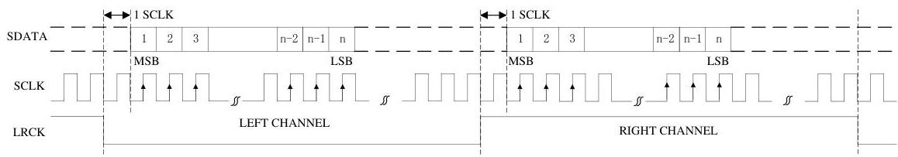
Figure 3 I²S Serial Audio Data Format Up To 24-bit

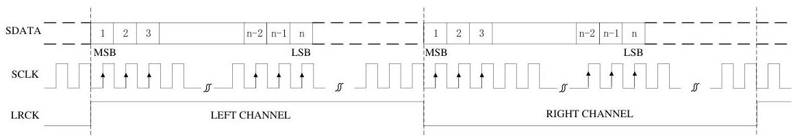
Figure 4 Left Justified Serial Audio Data Format Up To 24-bit

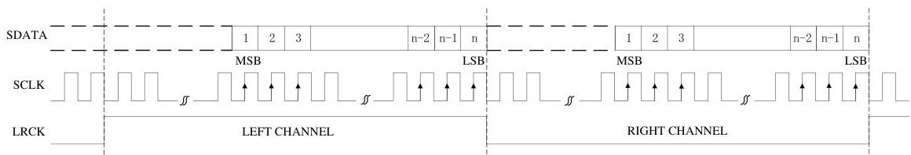
Figure 5 Right Justified Serial Audio Data Format Up To 24-bit

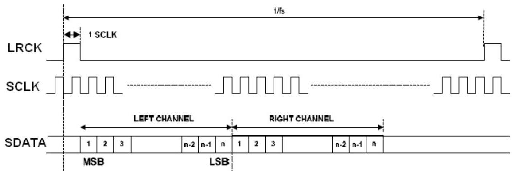
Figure 6 DSP/PCM Mode A

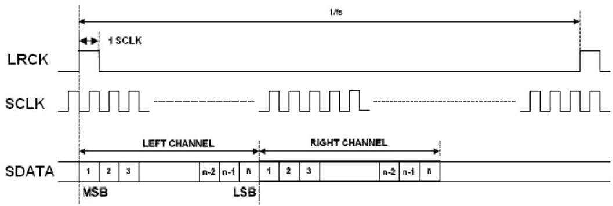
Figure 7 DSP/PCM Mode B

# 8 ELECTRICAL CHARACTERISTICS

## 8.1 Absolute Maximum Ratings

Continuous operation at or beyond these conditions may permanently damage the device.

|  PARAMETER | MIN | MAX  |
| --- | --- | --- |
|  Analog Supply Voltage Level | -0.3V | +5.0V  |
|  Digital Supply Voltage Level | -0.3V | +5.0V  |
|  Input Voltage range | DGND-0.3V | DVDD+0.3V  |
|  Operating Temperature Range | -40°C | +85°C  |
|  Storage Temperature | -65°C | +150°C  |

## 8.2 Recommended Operating Conditions

|  PARAMETER | MIN | TYP | MAX | UNIT  |
| --- | --- | --- | --- | --- |
|  Analog Supply Voltage Level | 1.7 | 3.3 | 3.6 | V  |
|  Digital Supply Voltage Level | 1.5 | 1.8 | 3.6 | V  |

## 8.3 ADC Analog and Filter Characteristics and Specifications

Test conditions are as the following unless otherwise specify:
AVDD=+3.3V, DVDD=+1.8V, AGND=0V, DGND=0V, Ambient
temperature=+25°C, Fs=48 KHz, 96 KHz or 192 KHz, MCLK/LRCK=256.

|  PARAMETER | MIN | TYP | MAX | UNIT  |
| --- | --- | --- | --- | --- |
|  ADC Performance  |   |   |   |   |
|  Dynamic Range (Note 1) | 85 | 95 | 98 | dB  |
|  THD+N | -88 | -85 | -75 | dB  |
|  Channel Separation (1KHz) | 80 | 85 | 90 | dB  |
|  Signal to Noise ratio | 85 | 95 | 98 | dB  |
|  Interchannel Gain Mismatch |  | 0.1 |  | dB  |
|  Gain Error |  |  | ±5 | %  |
|  Filter Frequency Response – Single Speed  |   |   |   |   |
|  Passband | 0 |  | 0.4535 | Fs  |
|  Stopband | 0.5465 |  |  | Fs  |
|  Passband Ripple |  |  | ±0.05 | dB  |
|  Stopband Attenuation | 50 |  |  | dB  |
|  Filter Frequency Response – Double Speed  |   |   |   |   |
|  Passband | 0 |  | 0.4167 | Fs  |
|  Stopband | 0.5833 |  |  | Fs  |
|  Passband Ripple |  |  | ±0.005 | dB  |
|  Stopband Attenuation | 50 |  |  | dB  |
|  Analog Input  |   |   |   |   |
|  Full Scale Input Level |  | AVDD/3.3 |  | Vrms  |
|  Input Impedance |  | 20 |  | KΩ  |

Note
1. The value is measured used A-weighted filter.

## 8.4 DAC Analog and Filter Characteristics and Specifications

Test conditions are as the following unless otherwise specify:
AVDD=+3.3V, DVDD=+1.8V, AGND=0V, DGND=0V, Ambient
temperature=+25°C, Fs=48 KHz, 96 KHz or 192 KHz, MCLK/LRCK=256.

|  PARAMETER | MIN | TYP | MAX | UNIT  |
| --- | --- | --- | --- | --- |
|  DAC Performance  |   |   |   |   |
|  Dynamic Range (Note 1) | 83 | 96 | 98 | dB  |
|  THD+N | -85 | -83 | -75 | dB  |
|  Channel Separation (1KHz) | 80 | 85 | 90 | dB  |

|  Signal to Noise ratio | 83 | 96 | 98 | dB  |
| --- | --- | --- | --- | --- |
|  Interchannel Gain Mismatch |  | 0.05 |  | dB  |
|  Filter Frequency Response – Single Speed  |   |   |   |   |
|  Passband | 0 |  | 0.4535 | Fs  |
|  Stopband | 0.5465 |  |  | Fs  |
|  Passband Ripple |  |  | ±0.05 | dB  |
|  Stopband Attenuation | 40 |  |  | dB  |
|  Filter Frequency Response – Double Speed  |   |   |   |   |
|  Passband | 0 |  | 0.4167 | Fs  |
|  Stopband | 0.5833 |  |  | Fs  |
|  Passband Ripple |  |  | ±0.005 | dB  |
|  Stopband Attenuation | 40 |  |  | dB  |
|  De-emphasis Error at 1 KHz (Single Speed Mode Only)  |   |   |   |   |
|  Fs = 32KHz |  |  | 0.002 | dB  |
|  Fs = 44.1KHz |  |  | 0.013 |   |
|  Fs = 48KHz |  |  | 0.0009 |   |
|  Analog Output  |   |   |   |   |
|  Full Scale Output Level |  | AVDD/3.3 |  | Vrms  |

Note
1. The value is measured used A-weighted filter.

# 8.5 Power Consumption Characteristics

|  PARAMETER | MIN | TYP | MAX | UNIT  |
| --- | --- | --- | --- | --- |
|  Normal Operation Mode  |   |   |   |   |
|  DVDD=1.8V, PVDD=1.8V, AVDD=1.8V: |  |  |  | mW  |
|  Play back |  | 7 |  |   |
|  Play back and record |  | 16 |  |   |
|  DVDD=3.3V, PVDD=3.3V, AVDD=3.3V: |  |  |  |   |
|  Play back |  | 31 |  |   |
|  Play back and record |  | 59 |  |   |
|  Power Down Mode  |   |   |   |   |
|  DVDD=1.8V, PVDD=1.8V, AVDD=1.8V |  | 0.3 |  | mW  |
|  DVDD=3.3V, PVDD=3.3V, AVDD=3.3V |  | 1.9 |  |   |

# 8.6 Serial Audio Port Switching Specifications

|  PARAMETER | Symbol | MIN | MAX | UNIT  |
| --- | --- | --- | --- | --- |
|  MCLK frequency |  |  | 51.2 | MHz  |
|  MCLK duty cycle |  | 40 | 60 | %  |
|  LRCK frequency |  |  | 200 | KHz  |
|  LRCK duty cycle |  | 40 | 60 | %  |
|  SCLK frequency |  |  | 26 | MHz  |
|  SCLK pulse width low | TSCLKL | 15 |  | ns  |
|  SCLK Pulse width high | TSCLKH | 15 |  | ns  |

|  SCLK falling to LRCK edge | T_{SLR} | - 10 | 10 | ns  |
| --- | --- | --- | --- | --- |
|  SCLK falling to SDOUT valid | T_{SDO} | 0 |  | ns  |
|  SDIN valid to SCLK rising setup time | T_{SDIS} | 10 |  | ns  |
|  SCLK rising to SDIN hold time | T_{SDIH} | 10 |  | ns  |

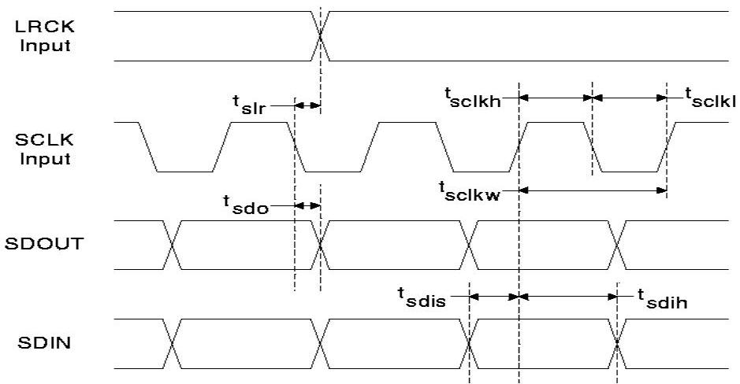
Figure 8 Serial Audio Port Timing

# 8.7 Serial Control Port Switching Specifications

|  PARAMETER | Symbol | MIN | MAX | UNIT  |
| --- | --- | --- | --- | --- |
|  SPI Mode  |   |   |   |   |
|  SPI_CLK clock frequency |  |  | 10 | MHz  |
|  SPI_CLK edge to SPI_CSn falling | T_{SPICS} | 5 |  | ns  |
|  SPI_CSn High Time Between transmissions | T_{SPISH} | 500 |  | ns  |
|  SPI_CSn falling to SPI_CLK edge | T_{SPISC} | 10 |  | ns  |
|  SPI_CLK low time | T_{SPICL} | 45 |  | ns  |
|  SPI_CLK high time | T_{SPICH} | 45 |  | ns  |
|  SPI_DIN to SPI_CLK rising setup time | T_{SPIDS} | 10 |  | ns  |
|  SPI_CLK rising to DATA hold time | T_{SPIDH} | 15 |  | ns  |
|  2-wire Mode  |   |   |   |   |
|  SCL Clock Frequency | F_{SCL} |  | 400 | KHz  |
|  Bus Free Time Between Transmissions | T_{TWID} | 1.3 |  | us  |
|  Start Condition Hold Time | T_{TWSTH} | 0.6 |  | us  |
|  Clock Low time | T_{TWCL} | 1.3 |  | us  |
|  Clock High Time | T_{TWCH} | 0.4 |  | us  |
|  Setup Time for Repeated Start Condition | T_{TWSTS} | 0.6 |  | us  |
|  SDA Hold Time from SCL Falling | T_{TWDH} |  | 900 | ns  |
|  SDA Setup time to SCL Rising | T_{TWDS} | 100 |  | ns  |
|  Rise Time of SCL | T_{TWR} |  | 300 | ns  |
|  Fall Time SCL | T_{TWF} |  | 300 | ns  |

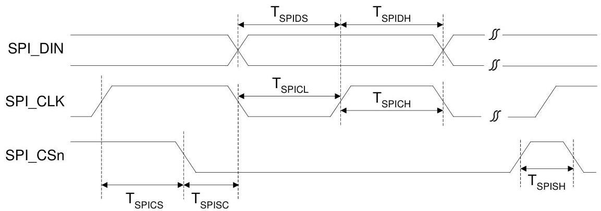
Figure 9 Serial Control Port SPI Timing

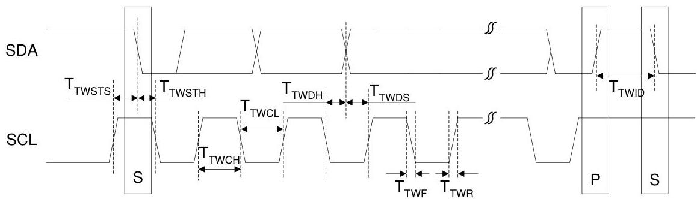

# 9 PACKAGE INFORMATION

QFNWB4×4-28L-A (P0.45T0.75/0.85) PACKAGE OUTLINE DIMENSIONS

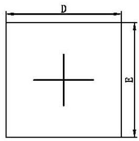
TOP VIEW

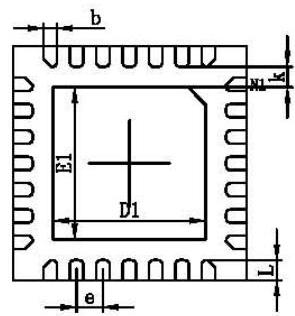
BOTTOM VIEW

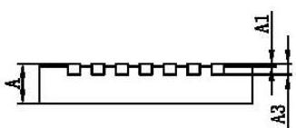
SIDE VIEW

|  Symbol | Dimensions In Millimeters |   | Dimensions In Inches  |   |
| --- | --- | --- | --- | --- |
|   |  Min. | Max. | Min. | Max.  |
|  A | 0.700/0.800 | 0.800/0.900 | 0.028/0.031 | 0.031/0.035  |
|  A1 | 0.000 | 0.050 | 0.000 | 0.002  |
|  A3 | 0.203REF. |   | 0.008REF.  |   |
|  D | 3.924 | 4.076 | 0.154 | 0.160  |
|  E | 3.924 | 4.076 | 0.154 | 0.160  |
|  E1 | 2.500 | 2.700 | 0.098 | 0.106  |
|  D1 | 2.500 | 2.700 | 0.098 | 0.106  |
|  k | 0.200MIN |   | 0.008MIN  |   |
|  b | 0.180 | 0.280 | 0.007 | 0.011  |
|  e | 0.450TYP. |   | 0.018TYP.  |   |
|  L | 0.274 | 0.426 | 0.011 | 0.017  |

# 10 CORPOARATION INFORMATION

Everest Semiconductor Co., Ltd.
苏州工业园区机场路 328 号，国际科技园区科技广场 6A，邮编 215028
Email: info@everest-semi.com

