# Product Summary

|  V_{(BR)}DSS | R_{DS(on)}MAX | I_{D}  |
| --- | --- | --- |
|  20V | 25mΩ@4.5V | 6A  |
|   |  32mΩ@2.5V  |   |

# Feature

- Advanced trench process technology
- High density cell design for ultra low on-resistance

# Application

- Battery protection
- Switching application

# Package

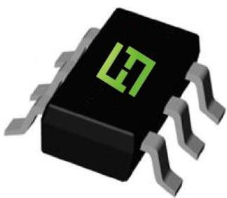
SOT-23-6L

# Circuit diagram

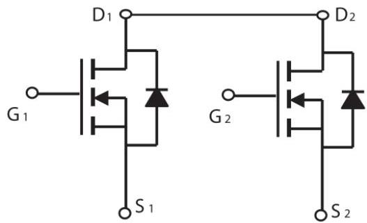

# Marking

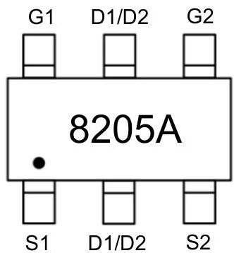

Absolute maximum ratings (Ta=25°C unless otherwise noted)

|  Parameter | Symbol | Value | Unit  |
| --- | --- | --- | --- |
|  Drain-Source Voltage | V_{DS} | 20 | V  |
|  Gate-Source Voltage | V_{GS} | ±12 | V  |
|  Continuous Drain Current | I_{D} | 6 | A  |
|  Pulsed Drain Current | I_{DM} | 25 | A  |
|  Power Dissipation | P_{D} | 1.5 | W  |
|  Junction Temperature | T_{J} | -55 ~ +150 | °C  |
|  Storage Temperature | T_{STG} | -55 ~ +150 | °C  |

Electrical characteristics (TA=25 °C, unless otherwise noted)

|  Parameter | Symbol | Test Condition | Min. | Typ. | Max. | Unit  |
| --- | --- | --- | --- | --- | --- | --- |
|  Static Characteristics  |   |   |   |   |   |   |
|  Drain-source breakdown voltage | V_{(BR)DSS} | V_{GS} = 0V, I_{D} =250μA | 20 |  |  | V  |
|  Zero gate voltage drain current | I_{DSS} | V_{DS} =20V, V_{GS} = 0V |  |  | 1 | μA  |
|  Gate-body leakage current | I_{GSS} | V_{GS} =±12V, V_{DS} = 0V |  |  | ±100 | nA  |
|  Gate threshold voltage | V_{GS(th)} | V_{DS} =V_{GS}, I_{D} =250μA | 0.5 |  | 1.2 | V  |
|  Drain-source on-resistance^{1)} | R_{DS(on)} | V_{GS} =4.5V, I_{D} =6.0A |  | 18 | 25 | mΩ  |
|   |   |  V_{GS} =2.5V, I_{D} =5.0A |  | 23 | 32  |   |
|  Forward transconductance^{1)} | g_{FS} | V_{DS} =5V, I_{D} =7A | 9 |  |  | S  |
|  Dynamic characteristics^{2)}  |   |   |   |   |   |   |
|  Input Capacitance | C_{iss} | V_{DS} =8V, V_{GS} =0V, f =1MHz |  | 800 |  | pF  |
|  Output Capacitance | C_{oss} |   |  | 155 |   |   |
|  Reverse Transfer Capacitance | C_{rss} |   |  | 125 |   |   |
|  Total Gate Charge | Q_{g} | V_{DS} =10V, V_{GS} =4.5V, I_{D} =4A |  | 11 |  | nC  |
|  Gate-Source Charge | Q_{gs} |   |  | 2.3 |   |   |
|  Gate-Drain Charge | Q_{gd} |   |  | 2.5 |   |   |
|  Turn-on delay time | t_{d(on)} | V_{DD}=10V, V_{GS}=4V, I_{D} =1A, R_{GEN}=10Ω |  | 13 |  | nS  |
|  Turn-on rise time | t_{r} |   |  | 54 |   |   |
|  Turn-off delay time | t_{d(off)} |   |  | 18 |   |   |
|  Turn-off fall time | t_{f} |   |  | 11 |   |   |
|  Source-Drain Diode characteristics  |   |   |   |   |   |   |
|  Diode Forward voltage | V_{DS} | V_{GS} =0V, I_{S}=4.0A |  |  | 1.2 | V  |

Notes:
1) Pulse Test: Pulse Width &lt; 300μs, Duty Cycle ≤2%.
2) Guaranteed by design, not subject to production testing.

# Typical Characteristics

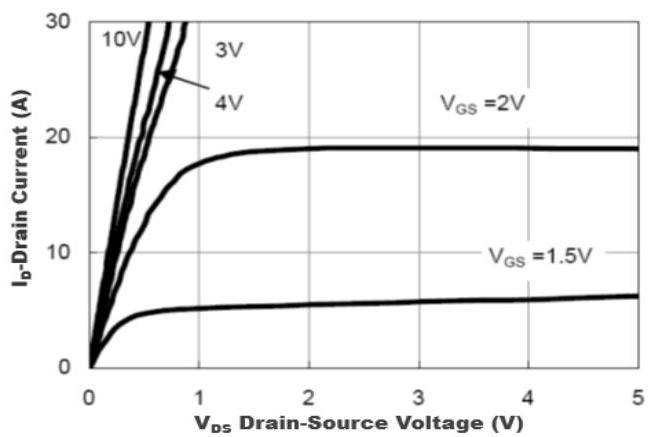
Figure1. Output Characteristics

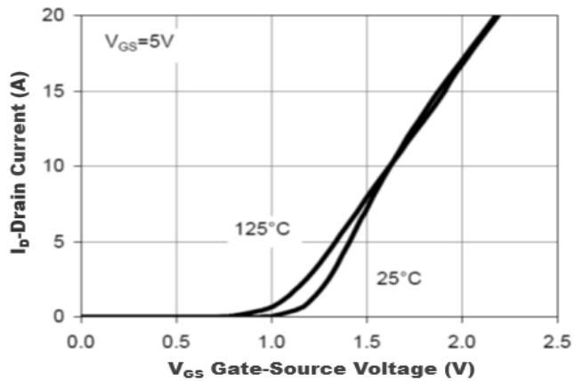
Figure2. Transfer Characteristics

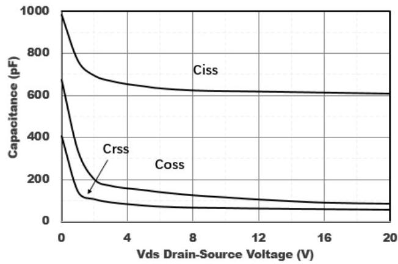
Figure3. Capacitance Characteristics

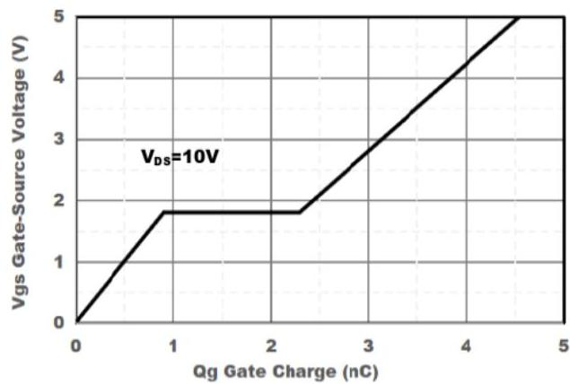
Figure4. Gate Charge

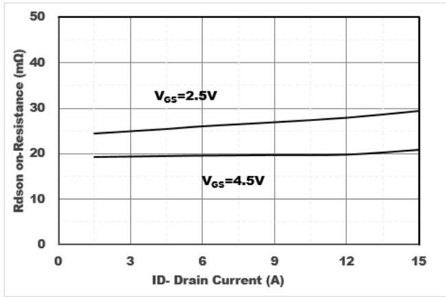
Figure5. Drain-Source on Resistance

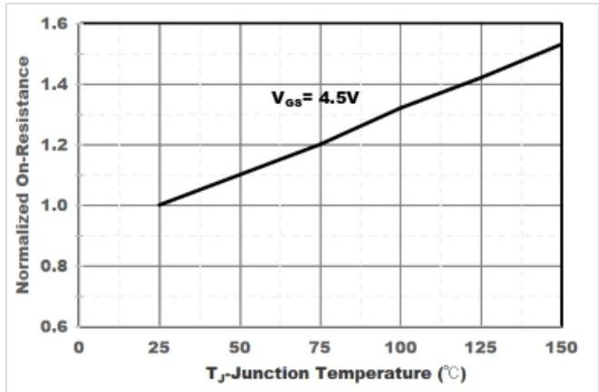
Figure6. Drain-Source on Resistance

# SOT-23-6L Package Information

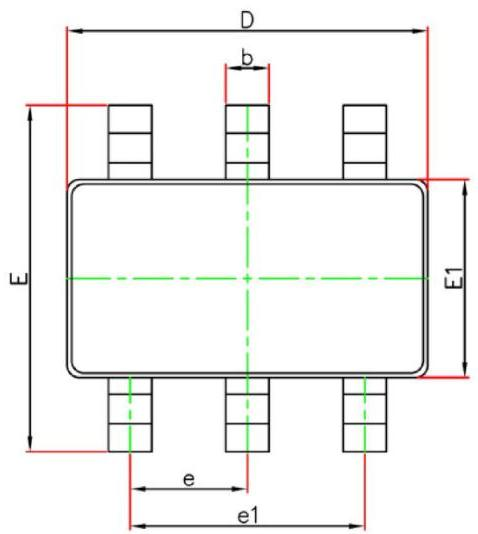
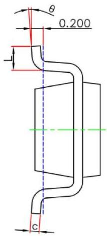
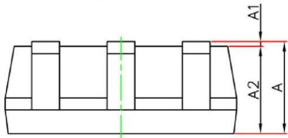

|  Symbol | Dimensions In Millimeters |   | Dimensions In Inches  |   |
| --- | --- | --- | --- | --- |
|   |  Min. | Max. | Min. | Max.  |
|  A | 1.050 | 1.250 | 0.041 | 0.049  |
|  A1 | 0.000 | 0.100 | 0.000 | 0.004  |
|  A2 | 1.050 | 1.150 | 0.041 | 0.045  |
|  b | 0.300 | 0.500 | 0.012 | 0.020  |
|  c | 0.100 | 0.200 | 0.004 | 0.008  |
|  D | 2.820 | 3.020 | 0.111 | 0.119  |
|  E | 2.650 | 2.950 | 0.104 | 0.116  |
|  E1 | 1.500 | 1.700 | 0.059 | 0.067  |
|  e | 0.950 (BSC) |   | 0.037 (BSC)  |   |
|  e1 | 1.800 | 2.000 | 0.071 | 0.079  |
|  L | 0.300 | 0.600 | 0.012 | 0.024  |
|  θ | 0° | 8° | 0° | 8°  |

