# HY2120

# Data Sheet

2-Cell Lithium-ion/Lithium Polymer
Battery Packs Protection ICs

# Table of Contents

1. GENERAL DESCRIPTION ... 4
2. FEATURES ... 4
3. APPLICATIONS ... 4
4. BLOCK DIAGRAM ... 5
5. ORDERING INFORMATION ... 6
6. MODEL LIST ... 6
7. PIN CONFIGURATION AND PACKAGE MARKING INFORMATION ... 7
8. ABSOLUTE MAXIMUM RATINGS ... 8
9. ELECTRICAL CHARACTERISTICS ... 9
10. BATTERY PROTECTION IC CONNECTION EXAMPLE ... 10
11. DESCRIPTION OF OPERATION ... 12
11.1. Normal Status ... 12
11.2. Overcharge Status ... 12
11.3. Overdischarge Status ... 13
11.4. Discharge Overcurrent Status (Discharge Overcurrent &amp; Short Circuit) ... 14
11.5. Charge Overcurrent Status ... 15
12. CHARACTERISTICS (TYPICAL DATA) ... 16
13. PACKAGE INFORMATION ... 19
13.1. SOT-23-6 ... 19
14. TAPE &amp; REEL INFORMATION ... 20
14.1. Tape &amp; Reel Information---SOT-23-6 (Type 1) ... 20
14.2. Tape &amp; Reel Information---SOT-23-6 (Type 2) ... 21
15. REVISION RECORD ... 22

# Attention :

1. HYCON Technology Corp. reserves the right to change the content of this datasheet without further notice. For most up-to-date information, please constantly visit our website: http://www.hycontek.com.
2. HYCON Technology Corp. is not responsible for problems caused by figures or application circuits narrated herein whose related industrial properties belong to third parties.
3. Specifications of any HYCON Technology Corp. products detailed or contained herein stipulate the performance, characteristics, and functions of the specified products in the independent state. We does not guarantee of the performance, characteristics, and functions of the specified products as placed in the customer's products or equipment. Constant and sufficient verification and evaluation is highly advised.
4. Please note the operating conditions of input voltage, output voltage and load current and ensure the IC internal power consumption does not exceed that of package tolerance. HYCON Technology Corp. assumes no responsibility for equipment failures that resulted from using products at values that exceed, even momentarily, rated values listed in products specifications of HYCON products specified herein.
5. Notwithstanding this product has built-in ESD protection circuit, please do not exert excessive static electricity to protection circuit.
6. Products specified or contained herein cannot be employed in applications which require extremely high levels of reliability, such as device or equipment affecting the human body, health/medical equipments, security systems, or any apparatus installed in aircrafts and other vehicles.
7. Despite the fact that HYCON Technology Corp. endeavors to enhance product quality as well as reliability in every possible way, failure or malfunction of semiconductor products may happen. Hence, users are strongly recommended to comply with safety design including redundancy and fire-precaution equipments to prevent any accidents and fires that may follow.
8. Use of the information described herein for other purposes and/or reproduction or copying without the permission of HYCON Technology Corp. is strictly prohibited.

# 1. General Description

The series of HY2120 ICs is best created for 2-cell lithium-ion/lithium polymer rechargeable battery protection and it also comprises high-accuracy voltage detectors and delay circuits.

These ICs are suitable for protecting 2-cell rechargeable lithium-ion/lithium polymer battery packs against the problems of overcharge, overdischarge and overcurrent.

# 2. Features

The features that whole series of HY2120 comprised are as follows:

(1) High-accuracy voltage detection circuit

- Overcharge detection voltage $V_{\mathrm{CUn}}$ (n=1, 2) 4.10 to 4.50V Accuracy ±25mV
- Overcharge release voltage $V_{\mathrm{CRn}}$ (n=1, 2) 3.90 to 4.30V Accuracy ±50mV
- Overdischarge detection voltage $V_{\mathrm{DLn}}$ (n=1, 2) 2.00 to 3.20V Accuracy ±80mV
- Overdischarge release voltage $V_{\mathrm{DRn}}$ (n=1, 2) 2.30 to 3.40V Accuracy ±100mV
- Discharge overcurrent detection voltage (by option)
- Charge overcurrent detection voltage (by option) Accuracy ±30mV
- Short-circuiting detection voltage 1.0V(fixed) Accuracy ±0.4V

(2) Delay times are generated by an internal circuit (external capacitors are unnecessary).

- Overcharge delay time 1000ms typ.
- Overdischarge delay time 110ms typ.
- Discharge overcurrent delay time 10ms typ.
- Charge overcurrent detection voltage 7ms typ.
- Short circuit delay time 250μs typ.

(3) Low current consumption (Products with Power-down Function)

- Operation mode 5.0μA typ., 9.0μA max. (VDD=7.8V)
- Ultra low power-down current at 0.1μA max. (VDD=4.0V)

(4) High-withstanding-voltage device is used for charger connection pins (CS pin and OC pin : Absolute maximum rating = 33 V)

(5) 0 V battery charge function "available" / "unavailable" are selectable

(6) Wide operating temperature range -40°C to +85 °C

(7) Small package SOT-23-6

(8) The HY2120 series are Halogen-free, green package

# 3. Applications

- 2-cell lithium-ion rechargeable battery packs
- 2-cell lithium polymer rechargeable battery packs

# 4. Block Diagram

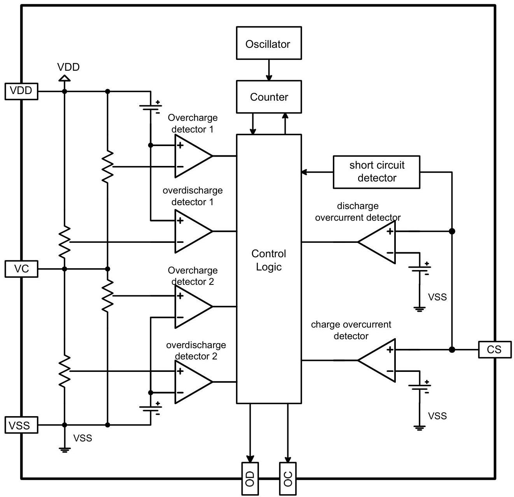

# 5. Ordering Information

■ Product name define

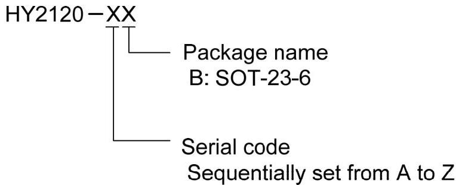

# 6. Model List

|  Model | Overcharge detection voltage | Overcharge release voltage | Overdis-charge detection voltage | Overdis-Charge release voltage | Discharge overcurrent detection voltage | Charge overcurrent detection voltage | 0V battery charge function | Chara-cteristic Code  |
| --- | --- | --- | --- | --- | --- | --- | --- | --- |
|   |  VCUn | VCRn | VDLn | VDRn | VDIP | VCIP | V8CH | —  |
|  HY2120-AB | 4.35±0.025V | 4.15±0.05V | 2.30±0.08V | 3.00±0.1V | 300±30mV | -210±30mV | available | A  |
|  HY2120-BB | 4.35±0.025V | 4.15±0.05V | 2.30±0.08V | 3.00±0.1V | 200±30mV | -210±30mV | available | A  |
|  HY2120-CB | 4.28±0.025V | 4.08±0.05V | 2.90±0.08V | 3.00±0.1V | 200±30mV | -210±30mV | available | A  |
|  HY2120-DB | 4.28±0.025V | 4.08±0.05V | 2.25±0.08V | 2.95±0.1V | 200±30mV | -210±30mV | available | A  |
|  HY2120-EB | 4.28±0.025V | 4.08±0.05V | 2.25±0.08V | 2.95±0.1V | 150±30mV | -210±30mV | available | A  |
|  HY2120-FB | 4.30±0.025V | 4.10±0.05V | 2.90±0.08V | 3.00±0.1V | 200±30mV | -210±30mV | available | A  |
|  HY2120-GB | 4.28±0.025V | 4.08±0.05V | 3.10±0.08V | 3.20±0.1V | 200±30mV | -210±30mV | available | A  |
|  HY2120-HB | 4.38±0.025V | 4.18±0.05V | 2.40±0.08V | 2.60±0.1V | 200±30mV | -210±30mV | available | C  |
|  HY2120-LB | 4.25±0.025V | 4.05±0.05V | 2.80±0.08V | 3.00±0.1V | 200±30mV | -210±30mV | available | E  |
|  HY2120-MB | 4.45±0.025V | 4.25±0.05V | 2.25±0.08V | 2.95±0.1V | 200±30mV | -210±30mV | available | A  |
|  HY2120-NB | 4.28±0.025V | 4.08±0.05V | 2.80±0.08V | 3.00±0.1V | 200±30mV | -210±30mV | available | B  |
|  HY2120-OB | 4.25±0.025V | 4.05±0.05V | 2.80±0.08V | 3.00±0.1V | 100±15mV | -100±15mV | available | B  |

Remark: Please contact our sales office for the products with detection voltage value other than those specified above.

Characteristic Code Option

|  Characteristic Code | Overcharge release Function | Power-down Function/Auto Overdischarge Recovery Function  |
| --- | --- | --- |
|  A | Overcharge release code 1: for details, see the 11.2.1 specification | With power-down Function  |
|  B | Overcharge release code 2: for details, see the 11.2.2 specification | With auto overdischarge recovery function  |
|  C | Overcharge release code 1: for details, see the 11.2.1 specification | With auto overdischarge recovery function  |
|  E | Overcharge release code 2: for details, see the 11.2.2 specification | With power-down Function  |

# 7. Pin Configuration and Package Marking Information

|  Pin No. | Symbol | Description  |
| --- | --- | --- |
|  1 | OD | MOSFET gate connection pin for discharge control  |
|  2 | OC | MOSFET gate connection pin for charge control  |
|  3 | CS | Input pin for current sense, charger detect pin  |
|  4 | VC | Input pin of the center voltage between two-cell  |
|  5 | VDD | Power supply pin  |
|  6 | VSS | Ground pin  |

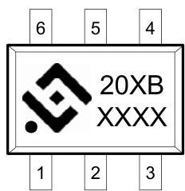

20 : Product Name

XB : Serial code &amp; Package name

XXXX : Date code

# 8. Absolute Maximum Ratings

(VSS=0V, Ta=25°C unless otherwise specified)

|  Item | Symbol | Rating | Unit  |
| --- | --- | --- | --- |
|  Input voltage between VDD and VSS pin | V_{DD} | VSS-0.3 to VSS+10 | V  |
|  OC output pin voltage | V_{OC} | VDD-33 to VDD+0.3 | V  |
|  OD output pin voltage | V_{OD} | VSS-0.3 to VDD+0.3 | V  |
|  CS input pin voltage | V_{CS} | VDD-33 to VDD+0.3 | V  |
|  Operating Temperature Range | T_{OP} | -40 to +85 | °C  |
|  Storage Temperature Range | T_{ST} | -40 to +125 | °C  |
|  Power dissipation | P_{D} | 250 | mW  |

# 9. Electrical Characteristics

(VSS=0V, Ta=25°C unless otherwise specified)

|  Item | Symbol | Condition | Min. | Typ. | Max. | Unit  |
| --- | --- | --- | --- | --- | --- | --- |
|  SUPPLY POWER RANGE  |   |   |   |   |   |   |
|  Operating voltage between VDD pin and VSS pin | VDSOP1 | - | 1.5 | - | 10 | V  |
|  Operating voltage between VDD pin and CS pin | VDSOP2 | - | 1.5 | - | 33 | V  |
|  INPUT CURRENT(with Power-down Function)  |   |   |   |   |   |   |
|  Supply Current | IDD | VDD=7.8V |  | 5.0 | 9.0 | μA  |
|  Power-Down Current | IDD | VDD=4.0V |  |  | 0.1 | μA  |
|  INPUT CURRENT(with Auto Overdischarge Recovery Function)  |   |   |   |   |   |   |
|  Supply Current | IDD | VDD=7.8V |  | 5.0 | 9.0 | μA  |
|  Overdischarge Current Consumption | IDD | VDD=4.0V |  | 5.0 | 9.0 | μA  |
|  DETECTION VOLTAGE  |   |   |   |   |   |   |
|  Overcharge Detection Voltage cell n (*1) | VCUn | 4.1V to 4.5V adjustable | VCUn-0.025 | VCUn | VCUn+0.025 | V  |
|  Overcharge Release Voltage cell n (*1) | VCRn | 3.9V to 4.3V adjustable | VCRn -0.05 | VCRn | VCRn +0.05 | V  |
|  Overdischarge Detection Voltage cell n (*1) | VDLn | 2.0V to 3.2V adjustable | VDLn -0.08 | VDLn | VDLn +0.08 | V  |
|  Overdischarge Release Voltage cell n (*1) | VDRn | 2.3V to 3.4V adjustable | VDRn -0.10 | VDRn | VDRn +0.10 | V  |
|  Discharge Overcurrent Detection Voltage | VDIP | VDIP<150mV | VDIP -15 | VDIP | VDIP +15 | mV  |
|   |   |  VDIP≥150mV | VDIP -30 | VDIP | VDIP +30 | mV  |
|  Short Circuit Detection Voltage | VSIP | VDD-VSS=7.0V | 0.6 | 1.0 | 1.4 | V  |
|  Charge Overcurrent Detection Voltage | VCIP | VCIP>-150mV | VCIP -15 | VCIP | VCIP +15 | mV  |
|   |   |  VCIP≤-150mV | VCIP -30 | VCIP | VCIP +30 | mV  |
|  DELAY TIME  |   |   |   |   |   |   |
|  Overcharge Delay Time | TOC |  | 700 | 1000 | 1300 | ms  |
|  Overdischarge Delay Time | TOD |  | 70 | 110 | 150 | ms  |
|  Discharge Overcurrent Delay Time | TDIP |  | 6 | 10 | 14 | ms  |
|  Charge Overcurrent detection Voltage | TCIP |  | 4 | 7 | 10 | ms  |
|  Short Circuit Delay Time | TSIP |  | 150 | 250 | 400 | μs  |
|  CONTROL OUTPUT VOLTAGE(OD&OC)  |   |   |   |   |   |   |
|  OD Pin Output "H" Voltage | VDH |  | VDD-0.1 | VDD-0.02 |  | V  |
|  OD Pin Output "L" Voltage | VDL |  |  | 0.2 | 0.5 | V  |
|  OC Pin Output "H" Voltage | VCH |  | VDD-0.1 | VDD-0.02 |  | V  |
|  OC Pin Output "L" Voltage | VCL |  |  | 0.2 | 0.5 | V  |
|  0V BATTERY CHARGE FUNCTION  |   |   |   |   |   |   |
|  Charger start voltage(available 0V battery charge function) | V0CH | Available 0V battery charge function | 1.2 | - | - | V  |
|  Battery voltage(unavailable 0V battery charge function) | V0IN | Unavailable 0V battery charge function | - | - | 0.5 | V  |

NOTE: *1. n=1, 2.

# 10. Battery Protection IC Connection Example

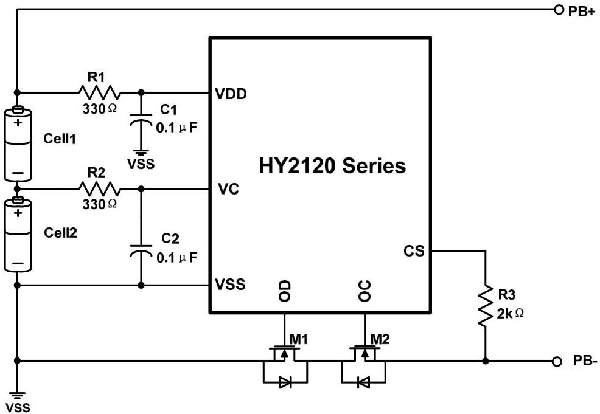

|  Symbol | Device Name | Purpose | Min. | Typ. | Max. | Remark  |
| --- | --- | --- | --- | --- | --- | --- |
|  R1 | Resistor | limit current, stabilize VDD and strengthen ESD protection | 100Ω | 330Ω | 470Ω | *1  |
|  R2 | Resistor | limit current, stabilize VC and strengthen ESD protection | 100Ω | 330Ω | 470Ω | *1  |
|  R3 | Resistor | limit current | 1 kΩ | 2kΩ | 4kΩ | *2  |
|  C1 | Capacitor | Filter, stabilize VDD | 0.01μF | 0.1μF | 1.0μF | *3  |
|  C2 | Capacitor | Filter, stabilize VDD | 0.01μF | 0.1μF | 1.0μF | *3  |
|  M1 | N-MOSFET | Discharge control | - | - | - | *4  |
|  M2 | N-MOSFET | Charge control | - | - | - | *5  |

*1. If R1 or R2 connects with an over-spec resistor, battery accuracy may be influenced due to R1 or R2 voltage drop that caused by current consumption. When a charger is connected in reversed, the current flows from the charger to the IC. At this time, if R1 or R2 is too high, the voltage between VDD pin and VSS pin may exceed the absolute maximum rating.
*2. If R3 connects with an over-spec resistor, the charging current may not be cut off when a high-voltage charger is connected. Please select as large a resistor as possible to control current when a charger is connected in reversed.
*3. C1 &amp; C2 can stabilize the supply voltage of VDD, the value of C1 &amp; C2 should be equal to or more than 0.01μF.
*4. If a MOSFET with a threshold voltage that is the same or more than overdischarge detection voltage is applied, discharging may be stopped before overdischarge is detected.
*5. If the withstanding voltage between the gate and source is lower than the charger voltage, the FET may be destroyed.

# Caution:

1. The above constants may be changed without notice, please download the most up-to-date datasheet on our website. http://www.hycontek.com
2. It is advised to perform thorough evaluation and test if peripheral devices need to be amended.

# 11. Description of Operation

## 11.1. Normal Status

This IC monitors the voltage of the battery connected between the VDD pin and VSS pin and the voltage difference between the CS pin and VSS pin to control charging and discharging.

When the cell1 and cell2 voltage is in the range from overdischarge detection voltage (VDLn) to overcharge detection voltage (VCUn), and the CS pin voltage is in the range from the charge overcurrent detection voltage (VCIP) to discharge overcurrent detection voltage (VDIP), the IC turns both the charging and discharging control MOSFET on. This condition is called the normal status. Under this condition, charging and discharging can both be carried out freely.

**Notice:** Discharging may not be enacted when the battery is first time connected. To regain normal status, CS and VSS PIN must be shorted or the charger must be connected.

## 11.2. Overcharge Status

### 11.2.1 Overcharge release code 1 model

The normal state of the battery voltage between VDD pin and VC pin (the voltage of Cell 1) and the voltage between VC pin and VSS pin (the voltage of Cell2), if either voltage becomes equal or more than the overcharge detector voltage (VCUn), and continued exceed overcharge delay time (TOC) an external charge control Nch MOSFET turns off with OC pin being at "L" level.

To reset the overcharge and make the OC pin level to "H" again after detecting overcharge, in such conditions that a time when the both Cell1 and Cell2 are down to a level lower than overcharge voltage, by connecting a kind of load to VDD after disconnecting a charger from the battery pack. Then, the output voltage of OC pin becomes "H", and it makes an external Nch MOSFET turn on, and charge cycle is available. In other words, once overcharge is detected, even if the supply voltage becomes low enough, if a charger is continuously connected to the battery pack, recharge is not possible.

### 11.2.2 Overcharge release code 2 model

The normal state of the battery voltage between VDD pin and VC pin (the voltage of Cell 1) and the voltage between VC pin and VSS pin (the voltage of Cell2), if either voltage becomes equal or more than the overcharge detector voltage (VCUn), and continued exceed overcharge delay time (TOC) an external charge control Nch MOSFET turns off with OC pin being at "L" level.

The overcharge status can be released by the following two cases:

(1) The voltage of the battery cell1 and the voltage of the battery cell2 are equal to or lowers than the overcharge release voltage (VCRn) due to self-discharge.

(2) When load is connected and the battery voltage falls below the overcharge protection voltage (VCUn).

**Notice:**

Further, either or both voltage of Cell1 and Cell2 is higher than the overcharge detector threshold, if

a charger is removed and some load is connected, OC outputs "L", however, load current can flow through the parasitic diode of the external charge control Nch MOSFET. After that, when the VDD pin voltage becomes lower than the overcharge detector threshold, OC becomes "H".

Internal fixed output delay times for overcharge detection. If either or both of the voltage of Cell1 or Cell2 keeps its level more than the overcharge detector threshold, and output delay time passes, overcharge voltage is detected. Even when the voltage of Cell1 or Cell2 level becomes equal or higher level than overcharge detection voltage ( $V_{\text{CUn}}$ ) if these voltages would be back to a level lower than the overcharge detector threshold within a time period of the output delay time, the overcharge is not detected.

# 11.3. Overdischarge Status

## 11.3.1. Products with Power-down Function

Batteries under normal operation mode, voltage of cell 1 that connected to VDD and VC pin or voltage of cell 2 that connected to VC and VSS pin drops lower than overdischarge detection voltage ( $V_{\text{DLn}}$ ) and the mode continues longer than overdischarge detection delay time ( $T_{\text{OD}}$ ) during discharging, HY2120 series will turn the OD pin output voltage from high level to low level and turn the discharging control MOSFET off (OD pin) so as to stop discharging. This condition is called the "Overdischarge Status".

When MOSFET is off, CS pin voltage is pulled up by IC internal resistor to VDD, reducing IC power consumption value to that of in the sleep mode (&lt;0.1uA). This condition is called the "Sleep Mode".

The overdischarge status will be leased by two following cases. OD pin output voltage turns from low level to high level, conducting discharge control MOSFET.

(1) If CS pin voltage lowers than charge overcurrent detection voltage ( $V_{\text{CIP}}$ ) when charger is connected, voltage of cell 1 and cell 2 goes higher than overdischarge detection voltage ( $V_{\text{DLn}}$ ), the overdischarge status is released and back to normal operation mode.

(2) If CS pin voltage is higher than charge overcurrent detection voltage ( $V_{\text{CIP}}$ ) when charger is connected, voltage of cell 1 and cell 2 goes higher than overdischarge release voltage ( $V_{\text{DRn}}$ ), the overdischarge status is released and back to normal operation mode.

## 11.3.2. Products with Auto Overdischarge Recovery Function

Batteries under normal operation mode, voltage of cell 1 that connected to VDD and VC pin or voltage of cell 2 that connected to VC and VSS pin drops lower than overdischarge detection voltage ( $V_{\text{DLn}}$ ) and the mode continues longer than overdischarge detection delay time ( $T_{\text{OD}}$ ) during discharging, HY2120 series will turn the OD pin output voltage from high level to low level and turn the discharging control MOSFET off (OD pin) so as to stop discharging. This condition is called the "Overdischarge Status".

The overdischarge status will be released by three cases:

(1) When CS pin voltage is equal to or lower than the charge overcurrent detection voltage ( $V_{\text{CIP}}$ ) by

charging and voltage of cell 1 and cell 2 goes higher than the overdischarge detection voltage $(V_{DLn})$.

(2) When CS pin voltage is equal to or higher than the charge overcurrent detection voltage $(V_{CIP})$ by charging and and voltage of cell 1 and cell 2 goes higher than the overdischarge release voltage $(V_{DRn})$.

(3) Without connecting a charger, if the voltage of cell 1 and cell 2 goes higher than overdischarge release voltage $(V_{DRn})$, the overdischarge status will be released, namely Auto Overdischarge Recovery Function.

# Notice :

① When voltage of cell 1 and cell 2 lowers than overdischarge detection voltage $(V_{DLn})$ and stayed within overdischarge detection delay time $(T_{OD})$, the voltage of cell 1 and cell 2 increases higher than overdischarge detection voltage $(V_{DLn})$, it will not enter into overdischarge protection mode.

② The output type of OD pin is having "H" level of VDD and "L" level of VSS.

# 11.4. Discharge Overcurrent Status (Discharge Overcurrent &amp; Short Circuit)

The IC continuously monitor discharge current by examining CS pin voltage when batteries under normal operation. Once the voltage of CS pin exceeds that of discharge overcurrent detection voltage $(V_{DIP})$ and this status lasts longer than discharge overcurrent delay time $(T_{DIP})$, and voltage output of OD pin changes from high potential to low potential, the MOSFET (OD pin) is disabled and discharge stopped. This status is called "Discharge Over-current Status".

When CS pin voltage excels short circuit detection voltage $(V_{SIP})$ and this status lasts longer than short circuit delay time $(T_{SIP})$, voltage output of OD pin changes from high potential to low potential. At this time, the MOSFET (OD pin) is disabled and discharge stopped. This status is called "Short Circuit Status".

Discharge over-current status and short current status is released while the connected impedance between $\mathrm{PB+}$ and PB- is larger than $450\mathrm{k}\Omega$ (typ.).

Additionally, when charger is connected, even the impedance between $\mathrm{PB+}$ and PB- lowers than $450\mathrm{k}\Omega$ (typ.) and CS pin voltage lowers than discharge overcurrent detection voltage $(V_{DIP})$, the discharge over-current status or short circuit status will still be released and back to normal operation mode.

## 11.5. Charge Overcurrent Status

When CS pin voltage lowers than charge overcurrent detection voltage ($V_{CIP}$) and this status lasts longer than charge overcurrent delay time ($T_{CIP}$) during charge process of batteries under normal operation, OC pin voltage output will change from high potential to low potential. At this time, MOSFET (OC pin) is disabled and charge stopped. This status is called "Charge Overcurrent Status".

If CS pin voltage increases higher than charge overcurrent detection voltage ($V_{CIP}$) by disconnecting charger after enter charge overcurrent status, the charge overcurrent status will be released and restore to normal operation mode.

# 12. Characteristics (Typical Data)

## 12.1. Overcharge Detection / Release Voltage, Overdischarge Detection / Release Voltage, Overcurrent Detection Voltage, and Delay Time

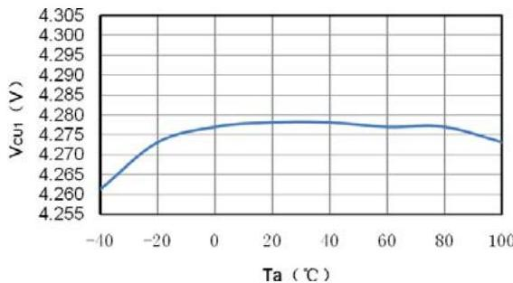
(1) $V_{\mathrm{CU1}}$ vs. Ta

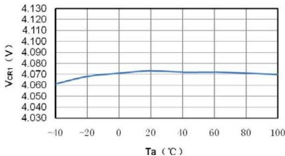
(2) $V_{\mathrm{CR1}}$ vs. Ta

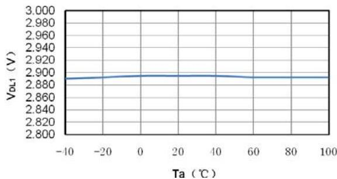
(3) $V_{\mathrm{DL1}}$ vs. Ta

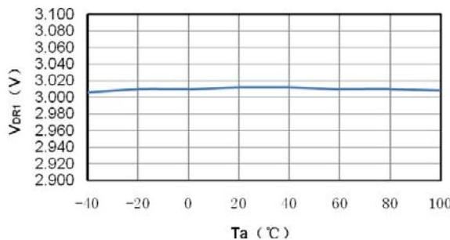
(4) $V_{\mathrm{DR1}}$ vs. Ta

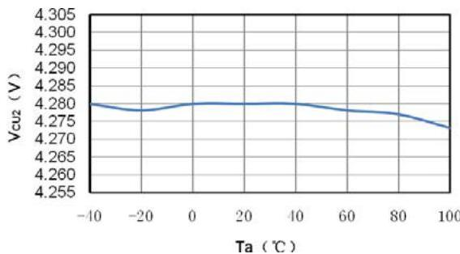
(5) $V_{\mathrm{CU2}}$ vs. Ta

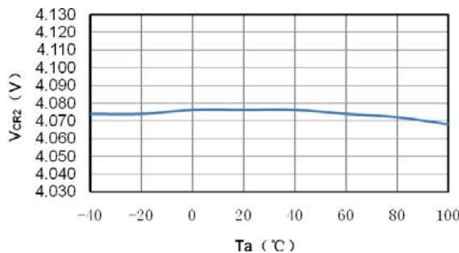
(6) $V_{\mathrm{CR2}}$ vs. Ta

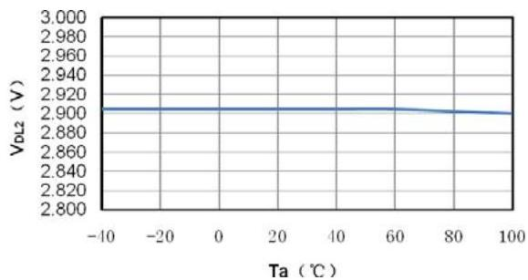
(7)  $V_{\mathrm{DL2}}$  vs. Ta

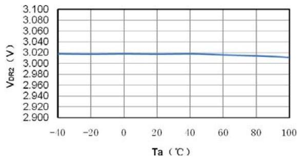
(8)  $V_{\mathrm{DR2}}$  vs. Ta

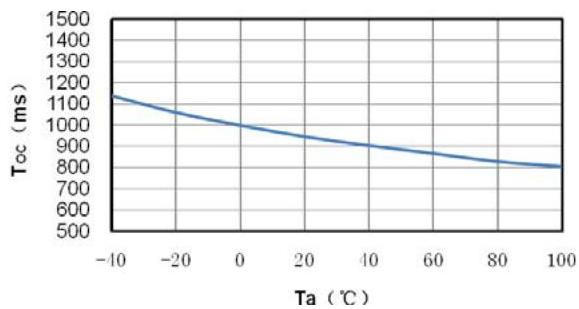
(9)  $T_{\mathrm{OC}}$  vs. Ta

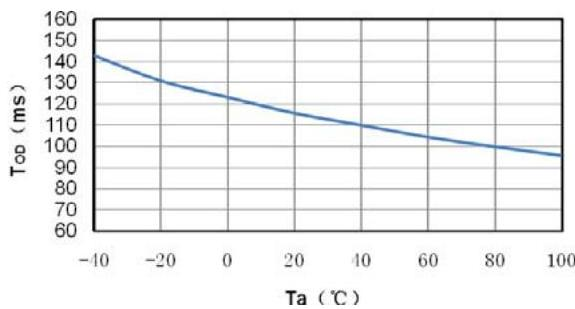
(10)  $T_{\mathrm{OD}}$  vs. Ta

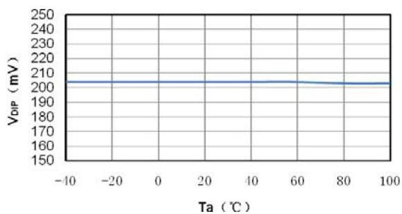
(11)  $V_{\mathrm{DIP}}$  vs. Ta

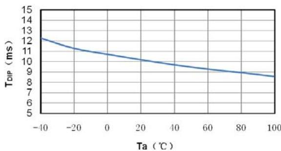
(12)  $T_{\mathrm{DIP}}$  vs. Ta

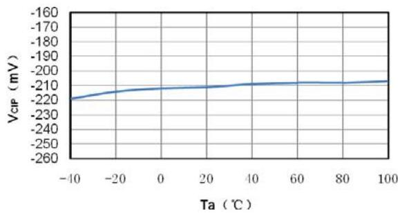
(13)  $V_{\mathrm{CIP}}$  vs. Ta

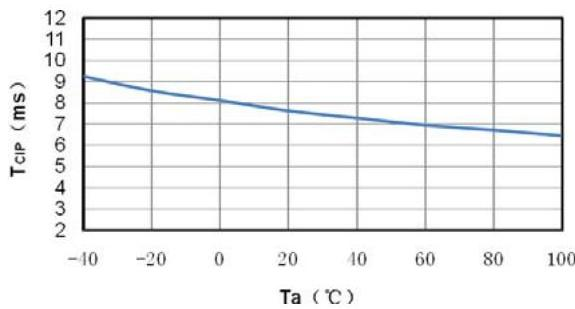
(14)  $T_{\mathrm{CIP}}$  vs. Ta

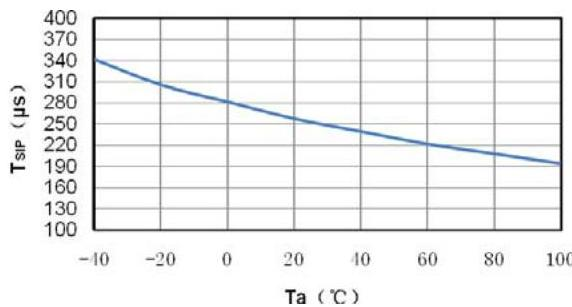
(15) $T_{\text{SIP}}$ vs. Ta

# 12.2. Current Consumption

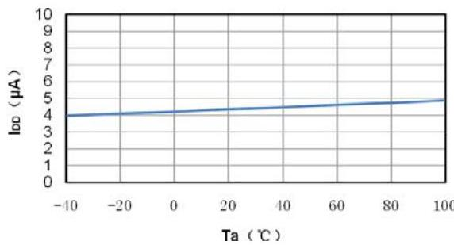
(16) $I_{\text{DO}}$ vs. Ta

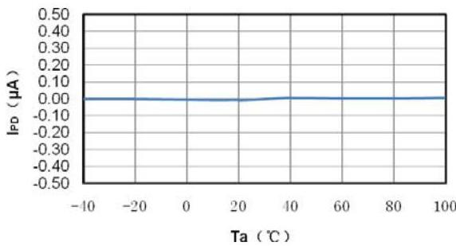
(17) $I_{\text{PD}}$ vs. Ta

# 13. Package information

SOT-23-6 specifications.

# 13.1. SOT-23-6

NOTE: All dimensions are in millimeters.

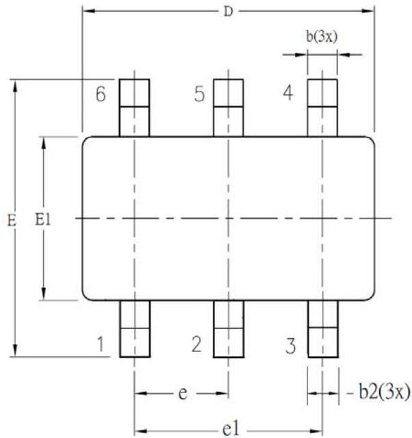

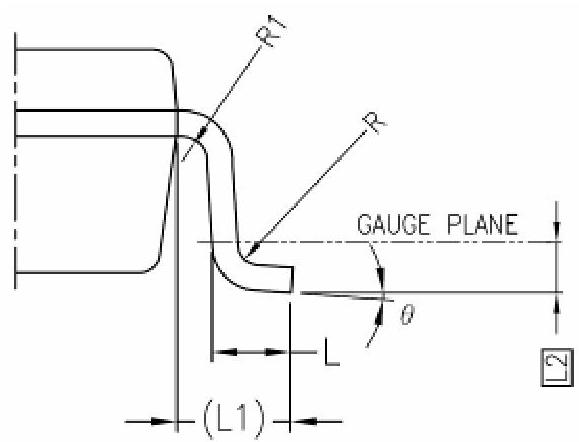

|  SYMBOL | ALL DIMENSIONS IN MILLIMETERS  |   |   |
| --- | --- | --- | --- |
|   |  MINIMUM | NOMINAL | MAXIMUM  |
|  A | - | 1.30 | 1.40  |
|  A1 | 0 | - | 0.15  |
|  A2 | 0.90 | 1.20 | 1.30  |
|  b | 0.30 | - | 0.50  |
|  b1 | 0.30 | 0.40 | 0.45  |
|  b2 | 0.30 | 0.40 | 0.50  |
|  c | 0.08 | - | 0.22  |
|  c1 | 0.08 | 0.13 | 0.20  |
|  D | 2.90 BSC  |   |   |
|  E | 2.80 BSC  |   |   |
|  E1 | 1.60 BSC  |   |   |
|  e | 0.95 BSC  |   |   |
|  e1 | 1.90 BSC  |   |   |
|  L | 0.30 | 0.45 | 0.60  |
|  L1 | 0.60 REF  |   |   |
|  L2 | 0.25 BSC  |   |   |
|  R | 0.10 | - | -  |
|  R1 | 0.10 | - | 0.25  |
|  θ | 0° | 4° | 8°  |
|  θ1 | 5° | - | 15°  |
|  θ2 | 5° | - | 15°  |

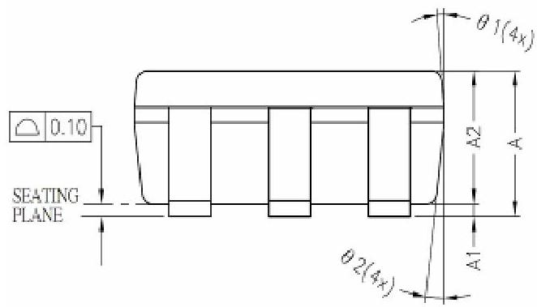

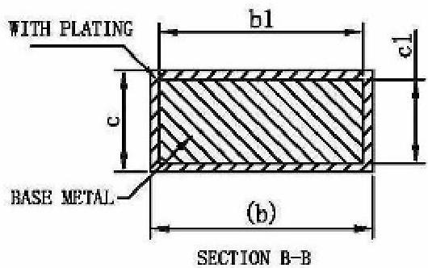

# 14. Tape &amp; Reel Information

## 14.1. Tape &amp; Reel Information---SOT-23-6 (Type 1)

Unit : mm.

### 14.1.1. Reel Dimensions

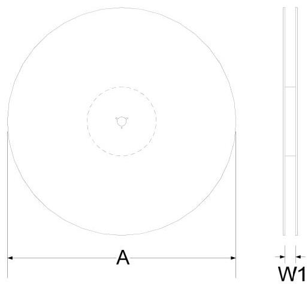

### 14.1.2. Carrier Tape Dimensions

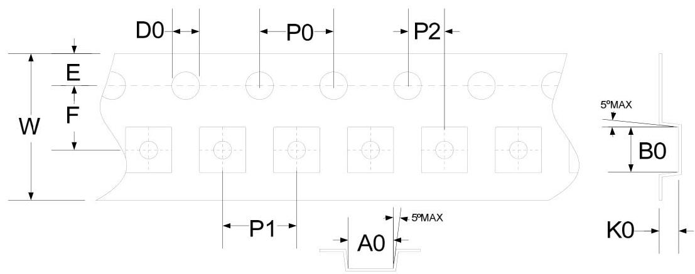

|  SYMBOLS | Reel Dimensions |   | Carrier Tape Dimensions  |   |   |   |   |   |   |   |   |   |
| --- | --- | --- | --- | --- | --- | --- | --- | --- | --- | --- | --- | --- |
|   |  A | W1 | A0 | B0 | K0 | P0 | P1 | P2 | E | F | D0 | W  |
|  Spec. | 178 | 9.0 | 3.30 | 3.20 | 1.50 | 4.00 | 4.00 | 2.00 | 1.75 | 3.50 | 1.50 | 8.00  |
|  Tolerance | ±0.50 | +1.50/-0 | ±0.10 | ±0.10 | ±0.10 | ±0.10 | ±0.10 | ±0.05 | ±0.10 | ±0.05 | +0.1/-0 | ±0.20  |

Note: 10 Sprocket hole pitch cumulative tolerance is ±0.20mm.

### 14.1.3. Pin1 direction

# 14.2. Tape &amp; Reel Information---SOT-23-6 (Type 2)

Unit : mm.

# 14.2.1. Reel Dimensions

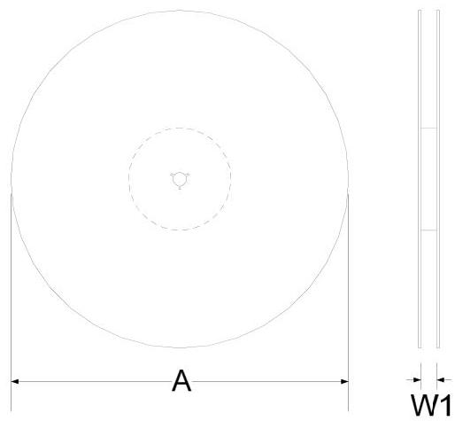

# 14.2.2. Carrier Tape Dimensions

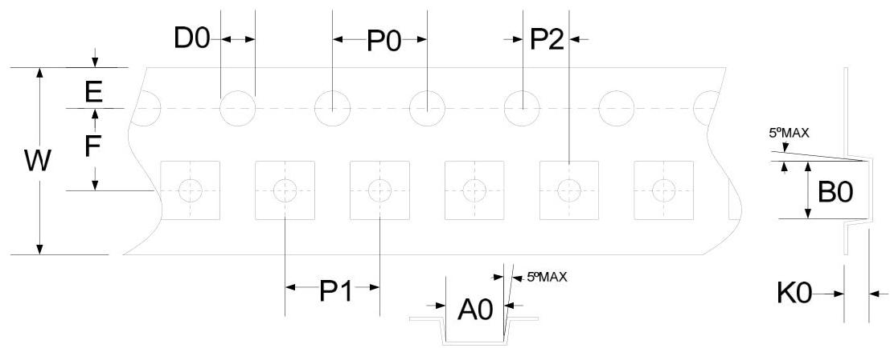

|  SYMBOLS | Reel Dimensions |   | Carrier Tape Dimensions  |   |   |   |   |   |   |   |   |   |
| --- | --- | --- | --- | --- | --- | --- | --- | --- | --- | --- | --- | --- |
|   |  A | W1 | A0 | B0 | K0 | P0 | P1 | P2 | E | F | D0 | W  |
|  Spec. | 178 | 9.4 | 3.17 | 3.23 | 1.37 | 4.00 | 4.00 | 2.00 | 1.75 | 3.50 | 1.55 | 8.00  |
|  Tolerance | ±2.00 | ±1.50 | ±0.10 | ±0.10 | ±0.10 | ±0.10 | ±0.10 | ±0.05 | ±0.10 | ±0.05 | ±0.05 | +0.30/-0.10  |

Note: 10 Sprocket hole pitch cumulative tolerance is  $\pm 0.20\mathrm{mm}$

# 14.2.3. Pin1 direction

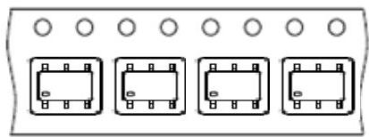

# 15. Revision record

Major differences are stated hereinafter:

|  Version | Page | Revision Summary  |
| --- | --- | --- |
|  V04 | - | First Edition  |
|  V05 | All | Add in new model no.:HY2120-CB  |
|   | 17 | Revise package size  |
|  V06 | All | Add in new model no.:HY2120-DB  |
|  V07 | All | Add in new model no.:HY2120-EB  |
|  V08 | 7 | Revise SOT-23-6 package marking rule.  |
|   | 14 | Update “Characteristics (Typical Data)”  |
|  V09 | All | Add in new model no.:HY2120-FB  |
|  V10 | All | Add in new model no.:HY2120-GB  |
|  V11 | All | Add in new model no.:HY2120-LB  |
|  V12 | All | Add in new model no.:HY2120-HB  |
|  V13 | All | Add in new model no.:HY2120-MB and HY2120-NB  |
|  V14 | All | Add in new model no.:HY2120-OB  |
|  V15 | All | Revise HY2120-HB VDR, Revise HY2120 characteristic code.  |
|   | 20-21 | Add in Tape and Reel information.  |

