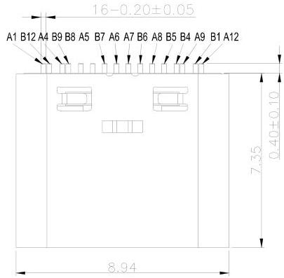
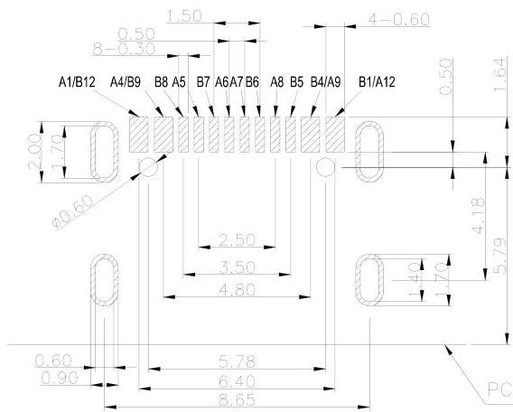
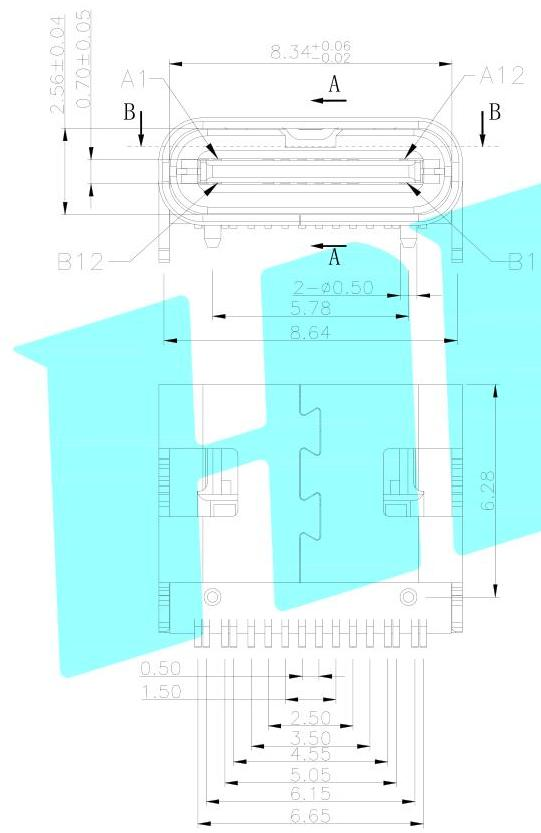
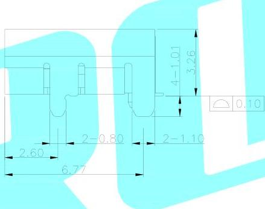
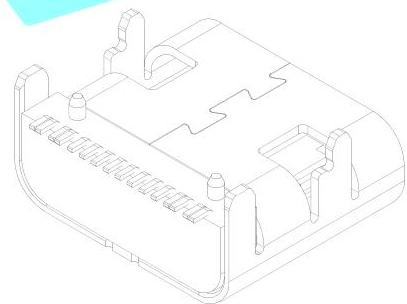

PCB EDGE

NOTE:

1. MATERIAL SPECIFICATION:
1. HOUSING: HIGH TEMPERATURE RESISTANT PLASTIC, UL94 V-D.
2. CONTACTS: COPPER ALLOY
3. MID PLATE: STAINLESS STEEL
2. PLATING SPECIFICATION:
2-1. CONTACTS:
NI 50µ" MIN. UNDER PLATED OVER ALL.
Au PLATED ON THE FUNCTIONAL AREA OF CONTACT.
(GOLD PLATING THICKNESS FOLLOW THE PLATE)
GOLD FLASH PLATING ON SOLDER AREA
2-2. FRONT SHELL:
NI 30µ" MIN. UNDER PLATED OVER ALL.
3. MECHANICAL PERFORMANCE:
1. CONSECTION THREE: 0.5-1.0 V
2. 2. REMOVAL 2.5000" TAN 1.5000V
3-3. DURABILITY: 10000 COLLES
4. ELECTRICAL PERFORMANCE:
1. 1. CURRENT PLATING: 4V
2. 2. INSULATION: RECATANCED 100000000V
3-3. DETECTRIC: STRUTTING RELATED TO 100V FOR 1 MINUTE.
5. ENVIRONMENTAL PERFORMANCE:
OPERATING TEMPERATURE: 30°C - 40°C
6. IR REFLUX:
THE LEAK TEMPERATURE ON THE BOARD SHALL BE MAINTAINED FOR 10 SECONDS AT 260°C.

|  A1 | OND | B12 | OND  |
| --- | --- | --- | --- |
|  A4 | VBUS | B9 | VBUS  |
|  A5 | CC1 | B8 | SBU2  |
|  A6 | DP1 | B7 | DN2  |
|  A7 | DN1 | B6 | DP2  |
|  A8 | SBU1 | B5 | CC2  |
|  A9 | VBUS | B4 | VBUS  |
|  A12 | OND | B1 | OND  |
|  PIN | SIGNAL NAME | PIN | SIGNAL NAME  |
| APPROVALS | DATE | ELECTRONICS CO.,LTD |
| --- | --- | --- |
| DRAWN | LUCAN | 2020.12.08 |
| CHECKED |  |  | TITLE: | DETECTOR SWITCHS |
| APPROVALS |  |  | PART NO. | TYPE-C-31-M-12 |
| TOLERANCES ARE | 30-40K | 40.30 | ANGLE | UNIT: mm | SCALE: 1:1 | PROJ: ☐ ☑ |
| 10-30 | 20.20 |
| 30-10 | 30.10 | ±2° | DRAWING NO. | —— | SHEET 1 OF 1 |
| ECN NO. | REV. | DATE. | DESCRIPTION. | CHANGE. | CHECK. | APPRO. |