# LM13700 Dual Operational Transconductance Amplifiers With Linearizing Diodes and Buffers

## 1 Features
- $g_m$ Adjustable Over 6 Decades
- Excellent $g_m$ Linearity
- Excellent Matching Between Amplifiers
- Linearizing Diodes for reduced output distortion
- High Impedance Buffers
- High Output Signal-to-Noise Ratio

## 2 Applications
- Current-Controlled Amplifiers
- Stereo Audio Amplifiers
- Current-Controlled Impedances
- Current-Controlled Filters
- Current-Controlled Oscillators
- Multiplexers
- Timers
- Sample-and-Hold Circuits

## 3 Description
The LM13700 series consists of two current-controlled transconductance amplifiers, each with differential inputs and a push-pull output. The two amplifiers share common supplies but otherwise operate independently. Linearizing diodes are provided at the inputs to reduce distortion and allow higher input levels. The result is a 10-dB signal-to-noise improvement referenced to 0.5 percent THD. High impedance buffers are provided which are especially designed to complement the dynamic range of the amplifiers. The output buffers of the LM13700 differ from those of the LM13600 in that their input bias currents (and thus their output DC levels) are independent of $I_{ABC}$. This may result in performance superior to that of the LM13600 in audio applications.

Device Information(1)

|  PART NUMBER | PACKAGE | BODY SIZE (NOM)  |
| --- | --- | --- |
|  LM13700 | SOIC (16) | 3.91 mm × 9.90 mm  |
|   |  PDIP (16) | 6.35 mm × 19.304 mm  |

(1) For all available packages, see the orderable addendum at the end of the data sheet.

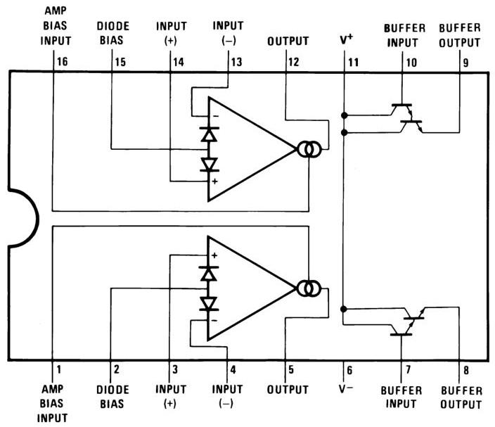
Connection Diagram

# Table of Contents

1 Features 1
2 Applications 1
3 Description 1
4 Revision History 2
5 Pin Configuration and Functions 3
6 Specifications 4
6.1 Absolute Maximum Ratings 4
6.2 Recommended Operating Conditions 4
6.3 Thermal Information 4
6.4 Electrical Characteristics 5
6.5 Typical Characteristics 6
7 Detailed Description 9
7.1 Overview 9
7.2 Functional Block Diagram 9
7.3 Feature Description 9
7.4 Device Functional Modes 10
8 Application and Implementation 11
8.1 Application Information 11
8.2 Typical Application 11
8.3 System Examples 12
9 Power Supply Recommendations 29
10 Layout 29
10.1 Layout Guidelines 29
10.2 Layout Example 29
11 Device and Documentation Support 30
11.1 Community Resources 30
11.2 Trademarks 30
11.3 Electrostatic Discharge Caution 30
11.4 Glossary 30
12 Mechanical, Packaging, and Orderable Information 30

# 4 Revision History

NOTE: Page numbers for previous revisions may differ from page numbers in the current version.

## Changes from Revision E (March 2013) to Revision F

Page

- Added ESD Ratings table, Feature Description section, Device Functional Modes, Application and Implementation section, Power Supply Recommendations section, Layout section, Device and Documentation Support section, and Mechanical, Packaging, and Orderable Information section. 1
- Removed soldering information in Absolute Maximum Ratings table 4

## Changes from Revision D (March 2013) to Revision E

Page

- Changed layout of National Data Sheet to TI format 27

# 5 Pin Configuration and Functions

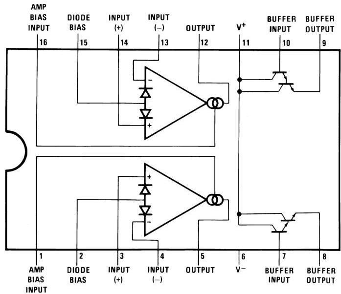
D or NFG Package
16-Pin SOIC or PDIP
Top View

Pin Functions

|  PIN |   | I/O | DESCRIPTION  |
| --- | --- | --- | --- |
|  NAME | NO.  |   |   |
|  Amp bias input | 1, 16 | A | Current bias input  |
|  Buffer input | 7, 10 | A | Buffer amplifier input  |
|  Buffer output | 8, 9 | A | Buffer amplifier output  |
|  Diode bias | 2, 15 | A | Linearizing diode bias input  |
|  Input+ | 3, 14 | A | Positive input  |
|  Input– | 4, 13 | A | Negative input  |
|  Output | 5, 12 | A | Unbuffered output  |
|  V+ | 11 | P | Positive power supply  |
|  V– | 6 | P | Negative power supply  |

# 6 Specifications

## 6.1 Absolute Maximum Ratings

over operating free-air temperature range (unless otherwise noted)(1)

|   | MIN | MAX | UNIT  |
| --- | --- | --- | --- |
|  Supply voltage | 36 VDC or ±18 |   | V  |
|  DC input voltage | +VS | -VS | V  |
|  Differential input voltage | ±5 |   | V  |
|  Diode bias current (ID) | 2 |   | mA  |
|  Amplifier bias current (FABC) | 2 |   | mA  |
|  Buffer output current(2) | 20 |   | mA  |
|  Power dissipation(3) TA = 25°C – LM13700N | 570 |   | mW  |
|  Output short circuit duration | Continuous |   |   |
|  Storage temperature, Tstg | -65 | 150 | °C  |

(1) Stresses beyond those listed under Absolute Maximum Ratings may cause permanent damage to the device. These are stress ratings only, which do not imply functional operation of the device at these or any other conditions beyond those indicated under Recommended Operating Conditions. Exposure to absolute-maximum-rated conditions for extended periods may affect device reliability.
(2) Buffer output current should be limited so as to not exceed package dissipation.
(3) For operation at ambient temperatures above 25°C, the device must be derated based on a 150°C maximum junction temperature and a thermal resistance, junction to ambient, as follows: LM13700N, 90°C/W; LM13700M, 110°C/W.

## 6.2 Recommended Operating Conditions

over operating free-air temperature range (unless otherwise noted)

|   |   | MIN | MAX | UNIT  |
| --- | --- | --- | --- | --- |
|  V+ (single-supply configuration) |   | 9.5 | 32 | V  |
|  V+ (dual-supply configuration) |   | 4.75 | 16 | V  |
|  V– (dual-supply configuration) |   | -16 | -4.75 | V  |
|  Operating temperature, TA | LM13700N | 0 | 70 | °C  |

## 6.3 Thermal Information

|  THERMAL METRIC(1) | LM13700 |   | UNIT  |   |
| --- | --- | --- | --- | --- |
|   |   |  D (SOIC) |   | NFG (PDIP)  |
|   |   |  16 PINS |   | 16 PINS  |
|  R_{BJA} | Junction-to-ambient thermal resistance | 83.0 | 43.8 | °C/W  |
|  R_{BJC(top)} | Junction-to-case (top) thermal resistance | 44.0 | 34.9 | °C/W  |
|  R_{BJB} | Junction-to-board thermal resistance | 40.5 | 28.3 | °C/W  |
|  ψ_{JT} | Junction-to-top characterization parameter | 11.5 | 19.1 | °C/W  |
|  ψ_{JB} | Junction-to-board characterization parameter | 40.2 | 28.2 | °C/W  |

(1) For more information about traditional and new thermal metrics, see the Semiconductor and IC Package Thermal Metrics application report, SPRA953.

# 6.4 Electrical Characteristics

These specifications apply for $V_{S} = \pm 15 \, \text{V}$, $T_{A} = 25^{\circ}\text{C}$, amplifier bias current $(I_{ABC}) = 500 \, \mu\text{A}$, pins 2 and 15 open unless otherwise specified. The inputs to the buffers are grounded and outputs are open.

|  PARAMETER | TEST CONDITIONS | MIN | TYP | MAX | UNIT  |
| --- | --- | --- | --- | --- | --- |
|  Input offset voltage (V_{OS}) | Over specified temperature range |  | 0.4 | 4 | mV  |
|   |  I_{ABC} = 5 μA |  | 0.3 | 4  |   |
|  V_{OS} including diodes | Diode bias current (I_{D}) = 500 μA |  | 0.5 | 5 | mV  |
|  Input offset change | 5 μA ≤ I_{ABC} ≤ 500 μA |  | 0.1 | 3 | mV  |
|  Input offset current |  |  | 0.1 | 0.6 | μA  |
|  Input bias current |  |  | 0.4 | 5 | μA  |
|   |  Over specified temperature range |  | 1 | 8  |   |
|  Forward transconductance (g_{m}) |  | 6700 | 9600 | 13000 | μS  |
|   |  Over specified temperature range | 5400 |  |   |   |
|  g_{m} tracking |  |  | 0.3 |  | dB  |
|  Peak output current | R_{L} = 0, I_{ABC} = 5 μA |  | 5 |  | μA  |
|   |  R_{L} = 0, I_{ABC} = 500 μA | 350 | 500 | 650  |   |
|   |  R_{L} = 0, Over Specified Temp Range | 300 |  |   |   |
|  Supply current | I_{ABC} = 500 μA, both channels |  | 2.6 |  | mA  |
|  CMRR |  | 80 | 110 |  | dB  |
|  Common-mode range |  | ±12 | ±13.5 |  | V  |
|  Crosstalk | Referred to input^{(1)}
20 Hz < f < 20 kHz |  | 100 |  | dB  |
|  Differential input current | I_{ABC} = 0, input = ±4 V |  | 0.02 | 100 | nA  |
|  Leakage current | I_{ABC} = 0 (refer to test circuit) |  | 0.2 | 100 | nA  |
|  Input resistance |  | 10 | 26 |  | kΩ  |
|  Open-loop bandwidth |  |  | 2 |  | MHz  |
|  Slew rate | Unity gain compensated |  | 50 |  | V/μs  |
|  Buffer input current | See ^{(1)} |  | 0.5 | 2 | μA  |
|  Peak buffer output voltage | See ^{(1)} | 10 |  |  | V  |
|  PEAK OUTPUT VOLTAGE |  |  |  |  |   |
|  Positive | R_{L} = ∞, 5 μA ≤ I_{ABC} ≤ 500 μA | 12 | 14.2 |  | V  |
|  Negative | R_{L} = ∞, 5 μA ≤ I_{ABC} ≤ 500 μA | -12 | -14.4 |  | V  |
|  V_{OS} SENSITIVITY |  |  |  |  |   |
|  Positive | ΔV_{OS}/ΔV* |  | 20 | 150 | μV/V  |
|  Negative | ΔV_{OS}/ΔV- |  | 20 | 150 | μV/V  |

(1) These specifications apply for $V_{S} = \pm 15 \, \text{V}$, $I_{ABC} = 500 \, \mu\text{A}$, $R_{OUT} = 5 - k\Omega$ connected from the buffer output to $-V_{S}$ and the input of the buffer is connected to the transconductance amplifier output.

# 6.5 Typical Characteristics

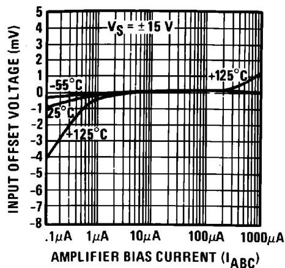
Figure 1. Input Offset Voltage

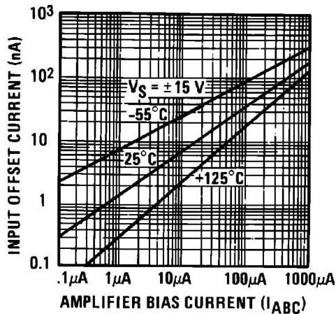
Figure 2. Input Offset Current

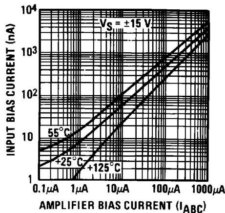
Figure 3. Input Bias Current

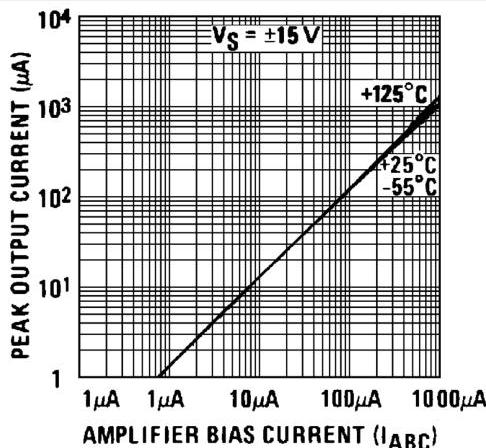
Figure 4. Peak Output Current

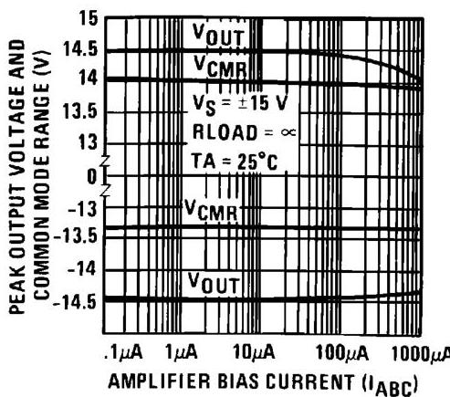
Figure 5. Peak Output Voltage and Common Mode Range

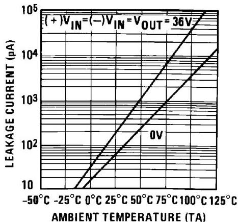
Figure 6. Leakage Current

# Typical Characteristics (continued)

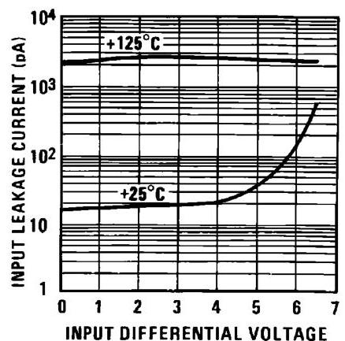
Figure 7. Input Leakage

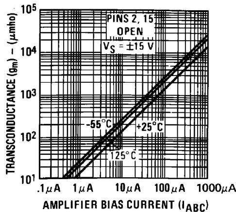
Figure 8. Transconductance

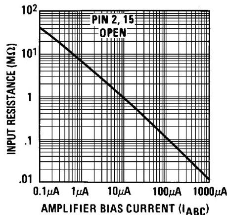
Figure 9. Input Resistance

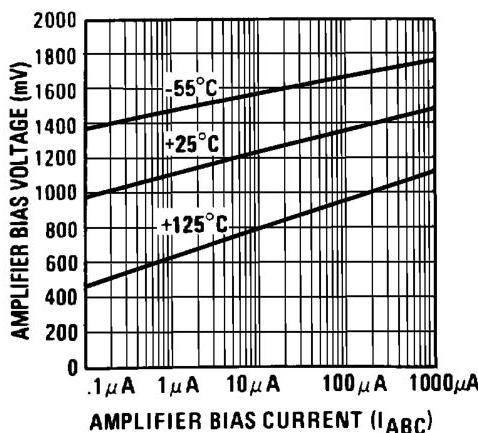
Figure 10. Amplifier Bias Voltage vs. Amplifier Bias Current

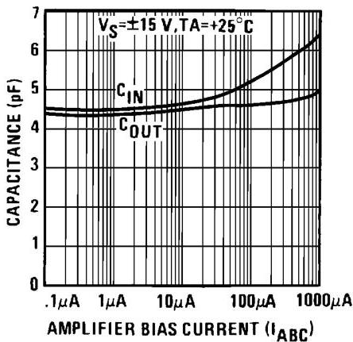
Figure 11. Input and Output Capacitance

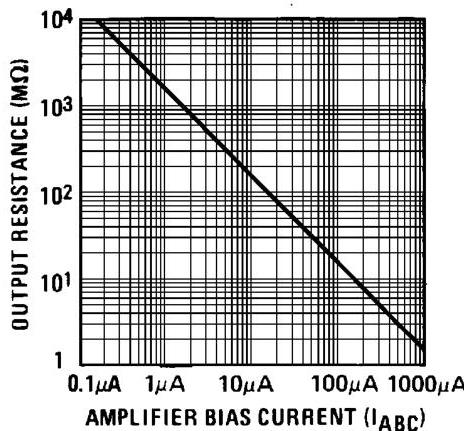
Figure 12. Output Resistance

# Typical Characteristics (continued)

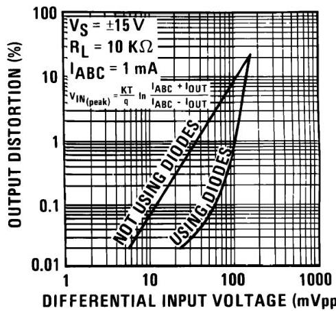
Figure 13. Distortion vs. Differential Input Voltage

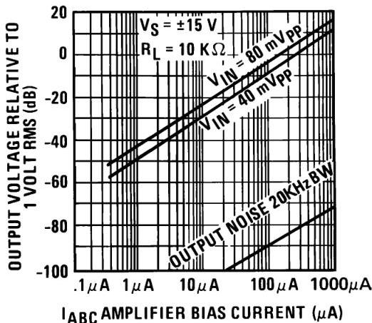
Figure 14. Voltage vs. Amplifier Bias Current

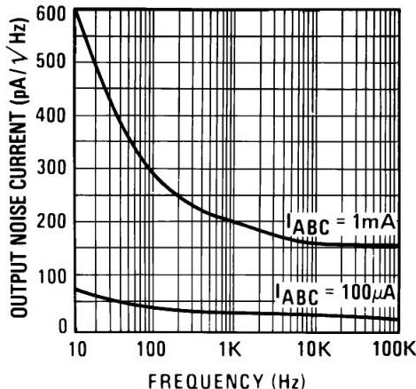
Figure 15. Output Noise vs Frequency

# 7 Detailed Description

## 7.1 Overview

The LM13700 is a two channel current controlled differential input transconductance amplifier with additional output buffers. The inputs include linearizing diodes to reduce distortion, and the output current is controlled by a dedicated pin. The outputs can sustain a continuous short to ground.

## 7.2 Functional Block Diagram

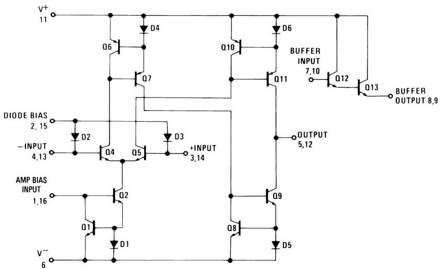
Figure 16. One Operational Transconductance Amplifier

## 7.3 Feature Description

### 7.3.1 Circuit Description

The differential transistor pair $Q_4$ and $Q_5$ form a transconductance stage in that the ratio of their collector currents is defined by the differential input voltage according to the transfer function:

$$
V_{IN} = \frac{kT}{q} \ln \frac{I_5}{I_4} \tag{1}
$$

where $V_{IN}$ is the differential input voltage, $kT/q$ is approximately 26 mV at $25^{\circ}C$ and $I_5$ and $I_4$ are the collector currents of transistors $Q_5$ and $Q_4$ respectively. With the exception of $Q_{12}$ and $Q_{13}$, all transistors and diodes are identical in size. Transistors $Q_1$ and $Q_2$ with Diode $D_1$ form a current mirror which forces the sum of currents $I_4$ and $I_5$ to equal $I_{ABC}$:

$$
I_4 + I_5 = I_{ABC} \tag{2}
$$

where $I_{ABC}$ is the amplifier bias current applied to the gain pin.

For small differential input voltages the ratio of $I_4$ and $I_5$ approaches unity and the Taylor series of the In function is approximated as:

$$
\frac{kT}{q} \ln \frac{I_5}{I_4} = \frac{kT}{q} \frac{I_5 - I_4}{I_4}
$$

$$
I_4 = I_5 = \frac{I_{ABC}}{2} \tag{3}
$$

$$
V_{IN} \left[ \frac{I_{ABC} q}{2kT} \right] = I_5 - I_4 \tag{4}
$$

# Feature Description (continued)

Collector currents $I_4$ and $I_5$ are not very useful by themselves and it is necessary to subtract one current from the other. The remaining transistors and diodes form three current mirrors that produce an output current equal to $I_5$ minus $I_4$ thus:

$$
V_{IN} \left[ \frac{I_{ABC} q}{2 k T} \right] = I_{OUT} \tag{5}
$$

The term in brackets is then the transconductance of the amplifier and is proportional to $I_{ABC}$.

## 7.3.2 Linearizing Diodes

For differential voltages greater than a few millivolts, Equation 3 becomes less valid and the transconductance becomes increasingly nonlinear. Figure 19 demonstrates how the internal diodes can linearize the transfer function of the amplifier. For convenience assume the diodes are biased with current sources and the input signal is in the form of current $I_S$. Since the sum of $I_4$ and $I_5$ is $I_{ABC}$ and the difference is $I_{OUT}$, currents $I_4$ and $I_5$ is written as follows:

$$
I_4 = \frac{I_{ABC}}{2} - \frac{I_{OUT}}{2}, \quad I_S = \frac{I_{ABC}}{2} + \frac{I_{OUT}}{2} \tag{6}
$$

Since the diodes and the input transistors have identical geometries and are subject to similar voltages and temperatures, the following is true:

$$
\frac{kT}{q} \ln \frac{\frac{I_D}{2} + I_S}{\frac{I_D}{2} - I_S} = \frac{kT}{q} \ln \frac{\frac{I_{ABC}}{2} + \frac{I_{OUT}}{2}}{\frac{I_{ABC}}{2} - \frac{I_{OUT}}{2}} \quad \therefore I_{OUT} = I_S \left(\frac{2 I_{ABC}}{I_D}\right) \text{ for } |I_S| &lt; \frac{I_D}{2} \tag{7}
$$

Notice that in deriving Equation 7 no approximations have been made and there are no temperature-dependent terms. The limitations are that the signal current not exceed $I_D / 2$ and that the diodes be biased with currents. In practice, replacing the current sources with resistors will generate insignificant errors.

## 7.4 Device Functional Modes

Use in single ended or dual supply systems requires minimal changes. The outputs can support a sustained short to ground. Note that use of the LM13700 in $\pm 5\,\mathrm{V}$ supply systems requires will reduce signal dynamic range; this is due to the PNP transistors having a higher $V_{BE}$ than the NPN transistors.

## 7.4.1 Output Buffers

Each channel includes a separate output buffer which consists of a Darlington pair transistor that can drive up to $20\,\mathrm{mA}$.

# 8 Application and Implementation

NOTE

Information in the following applications sections is not part of the TI component specification, and TI does not warrant its accuracy or completeness. TI's customers are responsible for determining suitability of components for their purposes. Customers should validate and test their design implementation to confirm system functionality.

# 8.1 Application Information

An OTA is a versatile building block analog component that can be considered an ideal transistor. The LM13700 can be used in a wide variety of applications, from voltage-controlled amplifiers and filters to VCOs. The 2 well-matched, independent channels make the LDC13700 well suited for stereo audio applications.

# 8.2 Typical Application

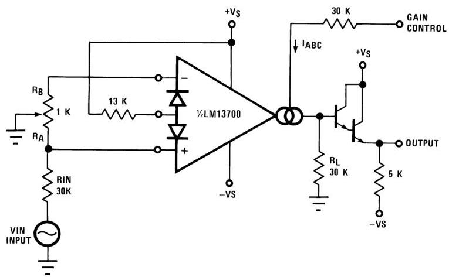
Figure 17. Voltage Controlled Amplifier

# 8.2.1 Design Requirements

For this example application, the system requirements provide a volume control for a  $1\mathrm{V}_{\mathrm{P}}$  input signal with a  $\mathrm{THD} &lt; 0.1\%$  using  $\pm 15\mathrm{V}$  supplies. The volume control varies between -13 V and 15 V and needs to provide an adjustable gain range of  $&gt;30\mathrm{dB}$ .

# 8.2.2 Detailed Design Procedure

Using the linearizing diodes is recommended for most applications, as they greatly reduce the output distortion. It is required that the diode bias current,  $I_{\mathrm{D}}$  be greater than twice the input current,  $I_{\mathrm{S}}$ . As the input voltage has a DC level of 0 V, the Diode Bias input pins are 1 diode drop above 0 V, which is +0.7 V. Tying the bias to the clean V+ supply, results in a voltage drop of 14.3 V across  $R_{\mathrm{D}}$ . Using the recommended 1mA for  $I_{\mathrm{D}}$  is appropriate here, and with VS=+15 V, the voltage drop is 14.3 V, and so using the standard value of 13-kΩ is acceptable and will provide the desired gain control.

To obtain the  $&lt; 0.1\%$  THD requirement, the differential input voltage must be  $&lt; 60\mathrm{mVpp}$  when the linearizing diodes are used. The input divider on the input will reduce the  $1\mathrm{V}_{\mathrm{P}}$  input to  $33\mathrm{mV}_{\mathrm{PP}}$ , which is within the desired spec.

Next, set  $I_{\text{BIAS}}$ . The Bias Input pins (pins 1 or 16), are 2 diode drops above the negative supply, and therefore  $V_{\text{BIAS}} = 2(V_{\text{BE}}) + V-$ , which for this application is -13.6 V. To set  $I_{\text{BIAS}}$  to 1ma when  $V_{\text{C}} = 15 \text{ V}$  requires a 28.6-kΩ; 30-kΩ is a standard value and is used for this application. The gain will be linear with the applied voltage.

# Typical Application (continued)

## 8.2.3 Application Curve

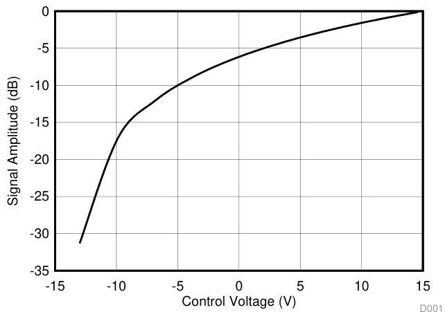
Figure 18. Signal Amplitude vs Control Voltage

## 8.3 System Examples

### 8.3.1 Voltage-Controlled Amplifiers

Figure 20 shows how the linearizing diodes is used in a voltage-controlled amplifier. To understand the input biasing, it is best to consider the 13-kΩ resistor as a current source and use a Thevenin equivalent circuit as shown in Figure 21. This circuit is similar to Figure 19 and operates the same. The potentiometer in Figure 20 is adjusted to minimize the effects of the control signal at the output.

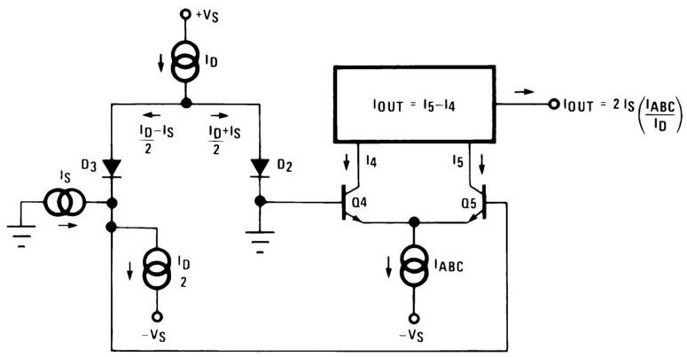
Figure 19. Linearizing Diodes

For optimum signal-to-noise performance, $I_{\mathrm{ABC}}$ should be as large as possible as shown by the Output Voltage vs Amplifier Bias Current graph. Larger amplitudes of input signal also improve the S/N ratio. The linearizing diodes help here by allowing larger input signals for the same output distortion as shown by the Distortion vs. Differential Input Voltage graph. S/N may be optimized by adjusting the magnitude of the input signal via $R_{\mathrm{IN}}$ (Figure 20) until the output distortion is below the desired level. The output voltage swing can then be set at any level by selecting $R_{\mathrm{L}}$.

Although the noise contribution of the linearizing diodes is negligible relative to the contribution of the amplifier's internal transistors, $I_{\mathrm{D}}$ should be as large as possible. This minimizes the dynamic junction resistance of the diodes $(r_{\mathrm{e}})$ and maximizes their linearizing action when balanced against $R_{\mathrm{IN}}$. A value of 1 mA is recommended for $I_{\mathrm{D}}$ unless the specific application demands otherwise.

# System Examples (continued)

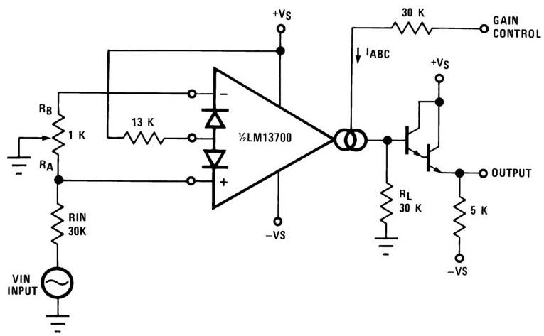
Figure 20. Voltage-Controlled Amplifier

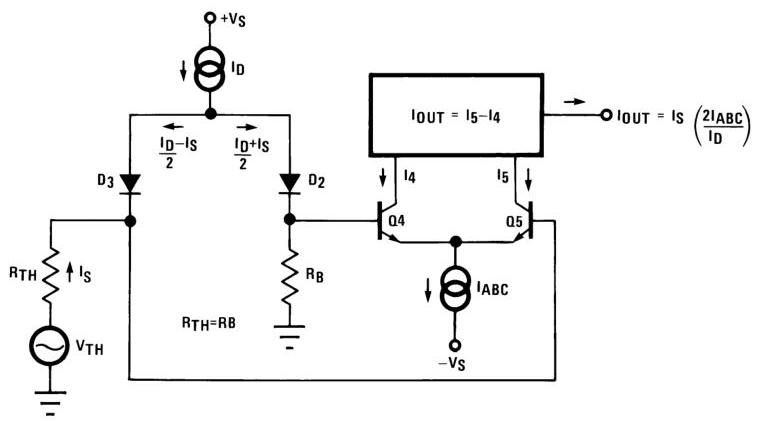
Figure 21. Equivalent VCA Input Circuit

# 8.3.2 Stereo Volume Control

The circuit of Figure 22 uses the excellent matching of the two LM13700 amplifiers to provide a Stereo Volume Control with a typical channel-to-channel gain tracking of  $0.3\mathrm{dB}$ .  $R_{P}$  is provided to minimize the output offset voltage and may be replaced with two  $510\Omega$  resistors in AC-coupled applications. For the component values given, amplifier gain is derived for Figure 20 as being:

$$
\frac {V _ {O}}{V _ {I N}} = 9 4 0 \times I _ {A B C} \tag {8}
$$

If  $V_{C}$  is derived from a second signal source then the circuit becomes an amplitude modulator or two-quadrant multiplier as shown in Figure 23, where:

$$
I _ {O} = \frac {- 2 I _ {S}}{I _ {D}} \left(I _ {A B C}\right) = \frac {- 2 I _ {S}}{I _ {D}} \frac {V _ {I N 2}}{R _ {C}} - \frac {2 I _ {S}}{I _ {D}} \frac {\left(V ^ {-} + 1 . 4 V\right)}{R _ {C}} \tag {9}
$$

The constant term in the above equation may be cancelled by feeding  $I_{S} \times I_{D} R_{C} / 2 (V^{-} + 1.4 V)$  into  $I_{O}$ . The circuit of Figure 24 adds  $R_{M}$  to provide this current, resulting in a four-quadrant multiplier where  $R_{C}$  is trimmed such that  $V_{O} = 0 V$  for  $V_{IN2} = 0 V$ .  $R_{M}$  also serves as the load resistor for  $I_{O}$ .

# System Examples (continued)

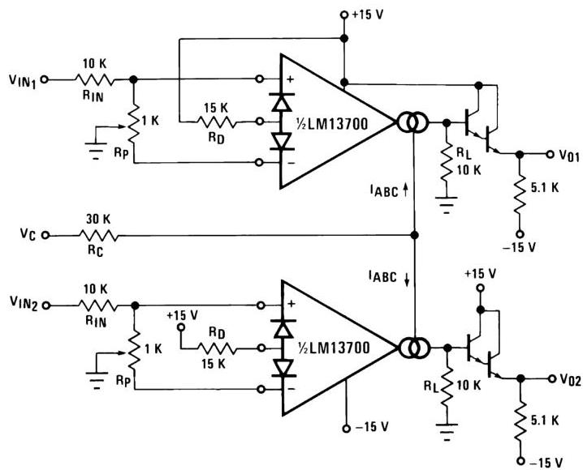
Figure 22. Stereo Volume Control

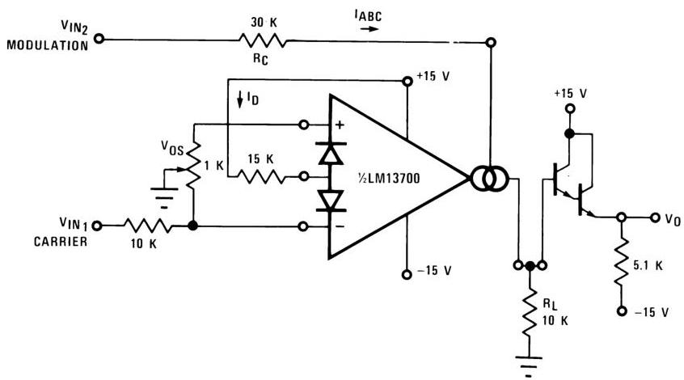
Figure 23. Amplitude Modulator

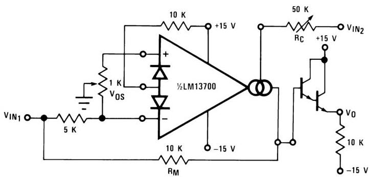
Figure 24. Four-Quadrant Multiplier

# System Examples (continued)

Noting that the gain of the LM13700 amplifier of Figure 21 may be controlled by varying the linearizing diode current $I_{D}$ as well as by varying $I_{ABC}$. Figure 25 shows an AGC Amplifier using this approach. As $V_{O}$ reaches a high enough amplitude (3 $V_{BE}$) to turn on the Darlington transistors and the linearizing diodes, the increase in $I_{D}$ reduces the amplifier gain so as to hold $V_{O}$ at that level.

## 8.3.3 Voltage-Controlled Resistors

An Operational Transconductance Amplifier (OTA) may be used to implement a Voltage Controlled Resistor as shown in Figure 26. A signal voltage applied at $R_{X}$ generates a $V_{IN}$ to the LM13700 which is then multiplied by the $g_{m}$ of the amplifier to produce an output current, thus:

$$
R_{X} = \frac{R + R_{A}}{g_{m} R_{A}} \tag{10}
$$

where $g_{m} \approx 19.2 I_{ABC}$ at $25^{\circ}C$. Note that the attenuation of $V_{O}$ by R and $R_{A}$ is necessary to maintain $V_{IN}$ within the linear range of the LM13700 input.

Figure 27 shows a similar VCR where the linearizing diodes are added, essentially improving the noise performance of the resistor. A floating VCR is shown in Figure 28, where each "end" of the "resistor" may be at any voltage within the output voltage range of the LM13700.

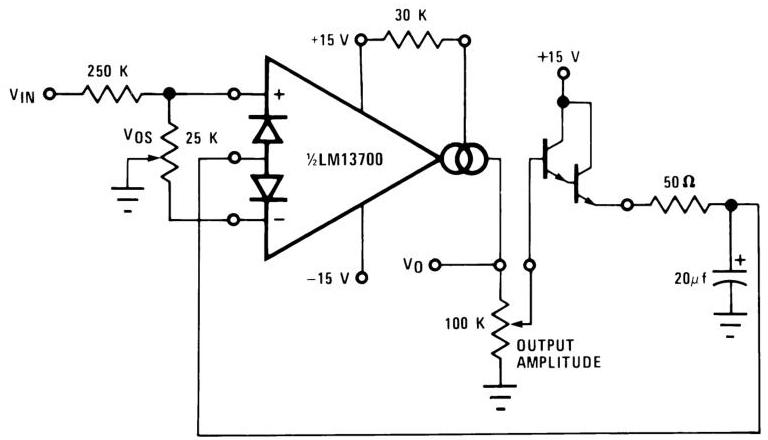
Figure 25. AGC Amplifier

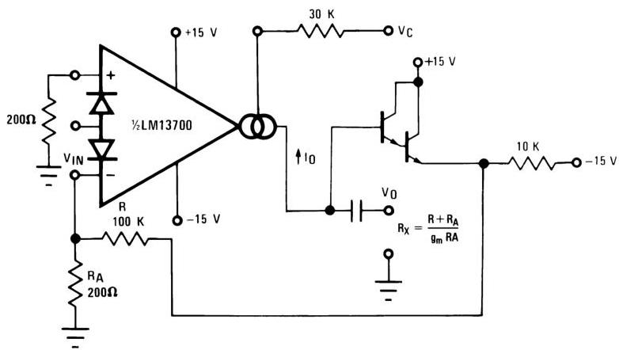
Figure 26. Voltage-Controlled Resistor, Single-Ended

# System Examples (continued)

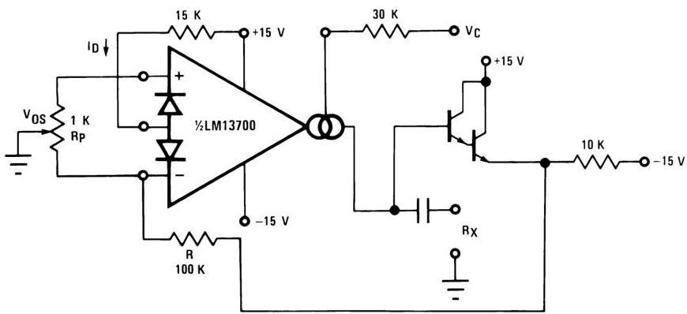
Figure 27. Voltage-Controlled Resistor with Linearizing Diodes

## 8.3.4 Voltage-Controlled Filters

OTA's are extremely useful for implementing voltage controlled filters, with the LM13700 having the advantage that the required buffers are included on the I.C. The VC Lo-Pass Filter of Figure 29 performs as a unity-gain buffer amplifier at frequencies below cut-off, with the cut-off frequency being the point at which $X_{\mathrm{C}} / g_{\mathrm{m}}$ equals the closed-loop gain of $(R / R_{\mathrm{A}})$. At frequencies above cut-off the circuit provides a single RC roll-off (6 dB per octave) of the input signal amplitude with a -3 dB point defined by the given equation, where $g_{\mathrm{m}}$ is again $19.2 \times I_{\mathrm{ABC}}$ at room temperature. Figure 30 shows a VC High-Pass Filter which operates in much the same manner, providing a single RC roll-off below the defined cut-off frequency.

Additional amplifiers may be used to implement higher order filters as demonstrated by the two-pole Butterworth Lo-Pass Filter of Figure 31 and the state variable filter of Figure 32. Due to the excellent $g_{\mathrm{m}}$ tracking of the two amplifiers, these filters perform well over several decades of frequency.

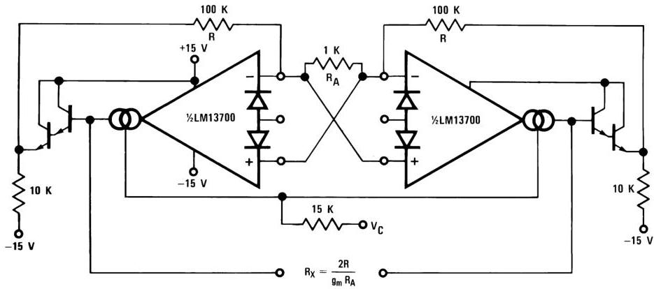
Figure 28. Floating Voltage-Controlled Resistor

# System Examples (continued)

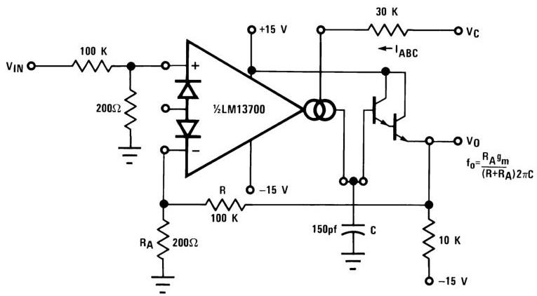
Figure 29. Voltage-Controlled Low-Pass Filter

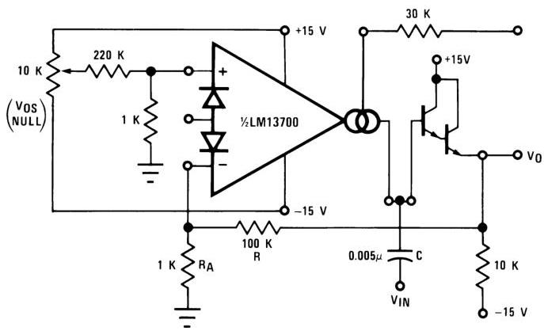
Figure 30. Voltage-Controlled Hi-Pass Filter

$$
f _ {c} = \frac {R _ {A} g _ {n}}{(R + R _ {A}) 2 \pi C}
$$

# System Examples (continued)

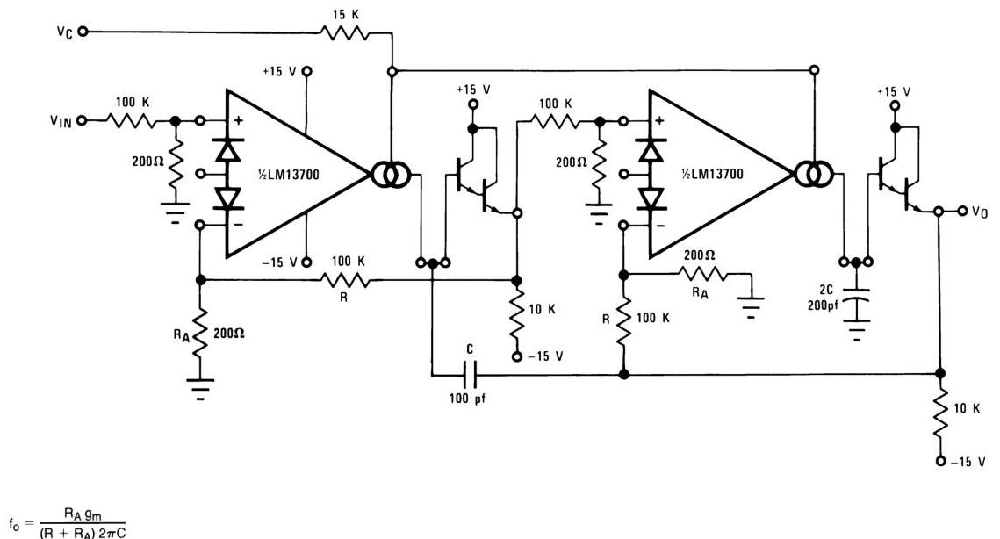
Figure 31. Voltage-Controlled 2-Pole Butterworth Lo-Pass Filter

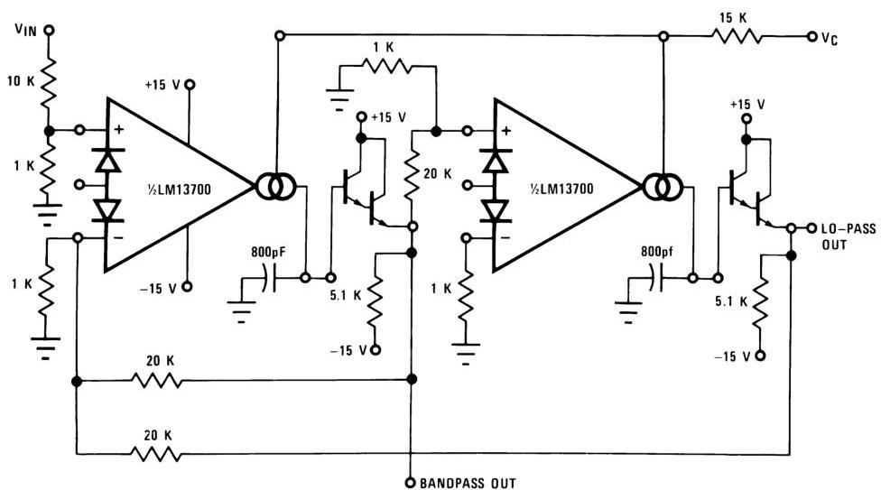
Figure 32. Voltage-Controlled State Variable Filter

## 8.3.5 Voltage-Controlled Oscillators

The classic Triangular/Square Wave VCO of Figure 33 is one of a variety of Voltage Controlled Oscillators which may be built utilizing the LM13700. With the component values shown, this oscillator provides signals from 200 kHz to below 2 Hz as $I_C$ is varied from 1 mA to 10 nA. The output amplitudes are set by $I_A \times R_A$. Note that the peak differential input voltage must be less than 5 V to prevent zenering the inputs.

A few modifications to this circuit produce the ramp/pulse VCO of Figure 34. When $V_{O2}$ is high, $I_F$ is added to $I_C$ to increase amplifier A1's bias current and thus to increase the charging rate of capacitor C. When $V_{O2}$ is low, $I_F$ goes to zero and the capacitor discharge current is set by $I_C$.

# System Examples (continued)

The VC Lo-Pass Filter of Figure 29 may be used to produce a high-quality sinusoidal VCO. The circuit of Figure 34 employs two LM13700 packages, with three of the amplifiers configured as lo-pass filters and the fourth as a limiter/inverter. The circuit oscillates at the frequency at which the loop phase-shift is  $360^{\circ}$  or  $180^{\circ}$  for the inverter and  $60^{\circ}$  per filter stage. This VCO operates from  $5\mathrm{Hz}$  to  $50\mathrm{kHz}$  with less than  $1\%$  THD.

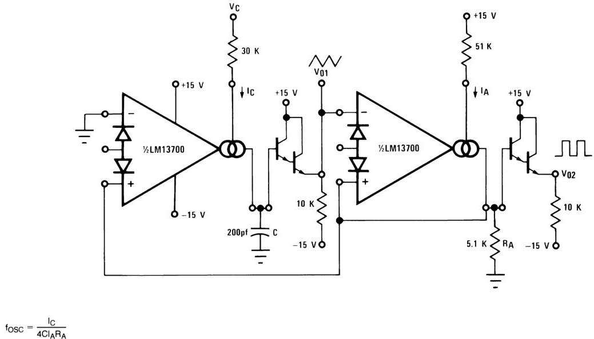
Figure 33. Triangular/Square-Wave VCO

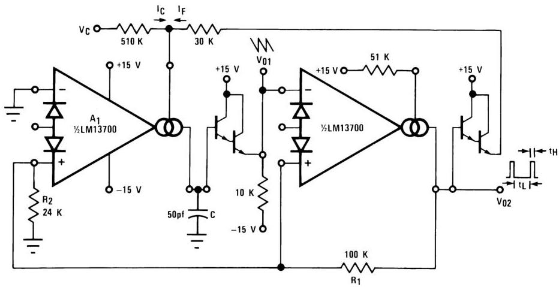
Figure 34. Ramp/Pulse VCO

$$
V _ {P K} = \frac {\left(V ^ {+} \pm 0. 8 V\right) R _ {2}}{R _ {1} + R _ {2}}
$$

$$
t _ {H} = \frac {2 V _ {P K} C}{I _ {F}}
$$

$$
t _ {L} = \frac {2 V _ {P K} C}{I _ {C}}
$$

$$
t _ {S} = \frac {I _ {C}}{2 V _ {P K} C} \text { for } I _ {C} &lt;   &lt;   I _ {F}
$$

# System Examples (continued)

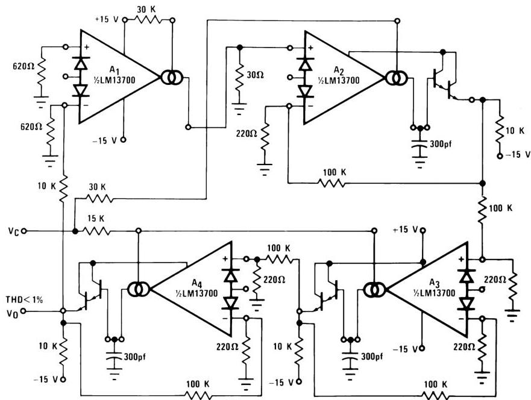
Figure 35. Sinusoidal VCO

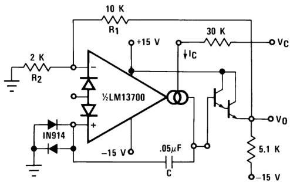
Figure 36 shows how to build a VCO using one amplifier when the other amplifier is needed for another function.
Figure 36. Single Amplifier VCO

# 8.3.6 Additional Applications

Figure 37 presents an interesting one-shot which draws no power supply current until it is triggered. A positive-going trigger pulse of at least  $2\mathrm{V}$  amplitude turns on the amplifier through  $\mathsf{R}_{\mathsf{B}}$  and pulls the non-inverting input high. The amplifier regenerates and latches its output high until capacitor C charges to the voltage level on the non-inverting input. The output then switches low, turning off the amplifier and discharging the capacitor. The capacitor discharge rate is speeded up by shorting the diode bias pin to the inverting input so that an additional discharge current flows through  $\mathsf{D}_{\mathsf{I}}$  when the amplifier output switches low. A special feature of this timer is that the other amplifier, when biased from  $\mathsf{V}_{\mathsf{O}}$ , can perform another function and draw zero stand-by power as well.

# System Examples (continued)

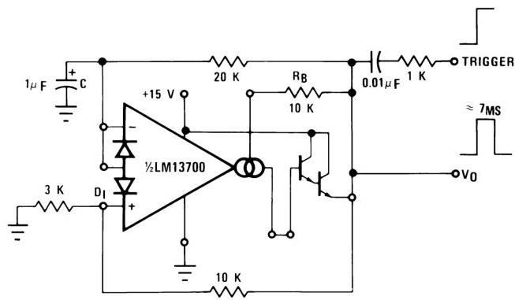
Figure 37. Zero Stand-By Power Timer

The operation of the multiplexer of Figure 38 is very straightforward. When A1 is turned on it holds $V_O$ equal to $V_{IN1}$ and when A2 is supplied with bias current then it controls $V_O$. $C_C$ and $R_C$ serve to stabilize the unity-gain configuration of amplifiers A1 and A2. The maximum clock rate is limited to about $200\mathrm{kHz}$ by the LM13700 slew rate into $150\mathrm{pF}$ when the $(V_{IN1} - V_{IN2})$ differential is at its maximum allowable value of $5\mathrm{V}$.

The Phase-Locked Loop of Figure 39 uses the four-quadrant multiplier of Figure 24 and the VCO of Figure 36 to produce a PLL with a $\pm 5\%$ hold-in range and an input sensitivity of about $300\mathrm{mV}$.

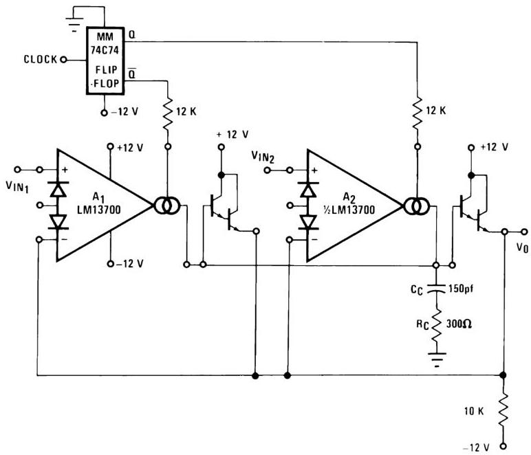
Figure 38. Multiplexer

# System Examples (continued)

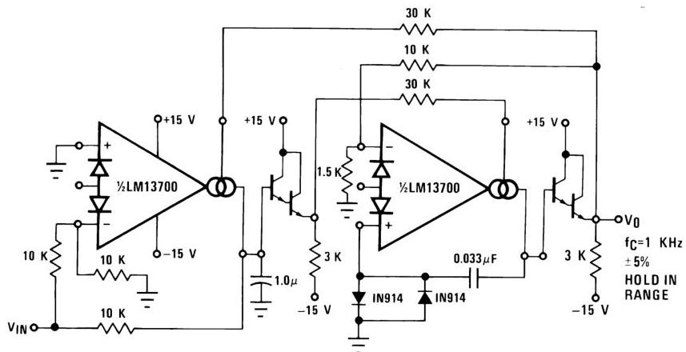
Figure 39. Phase Lock Loop

The Schmitt Trigger of Figure 40 uses the amplifier output current into R to set the hysteresis of the comparator; thus $V_{H} = 2 \times R \times I_{B}$. Varying $I_{B}$ will produce a Schmitt Trigger with variable hysteresis.

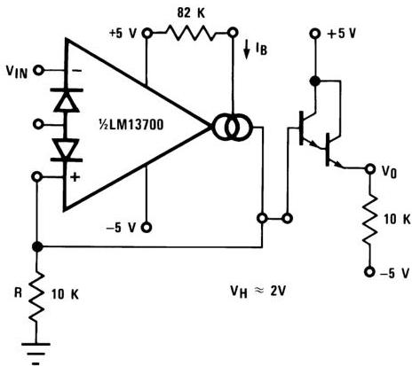
Figure 40. Schmitt Trigger

Figure 41 shows a Tachometer or Frequency-to-Voltage converter. Whenever A1 is toggled by a positive-going input, an amount of charge equal to $(V_{H} - V_{L}) C_{t}$ is sourced into $C_t$ and $R_{t}$. This once per cycle charge is then balanced by the current of $V_O / R_t$. The maximum $F_{IN}$ is limited by the amount of time required to charge $C_t$ from $V_L$ to $V_H$ with a current of $I_B$, where $V_L$ and $V_H$ represent the maximum low and maximum high output voltage swing of the LM13700. D1 is added to provide a discharge path for $C_t$ when A1 switches low.

The Peak Detector of Figure 42 uses A2 to turn on A1 whenever $V_{IN}$ becomes more positive than $V_O$. A1 then charges storage capacitor C to hold $V_O$ equal to $V_{IN}$ PK. Pulling the output of A2 low through D1 serves to turn off A1 so that $V_O$ remains constant.

# System Examples (continued)

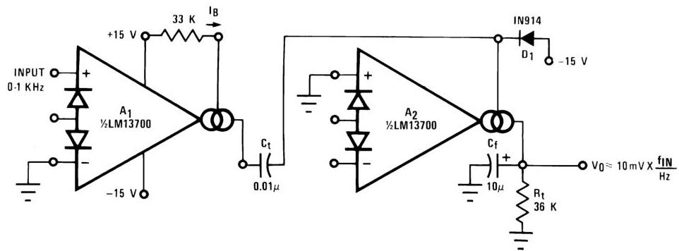
Figure 41. Tachometer

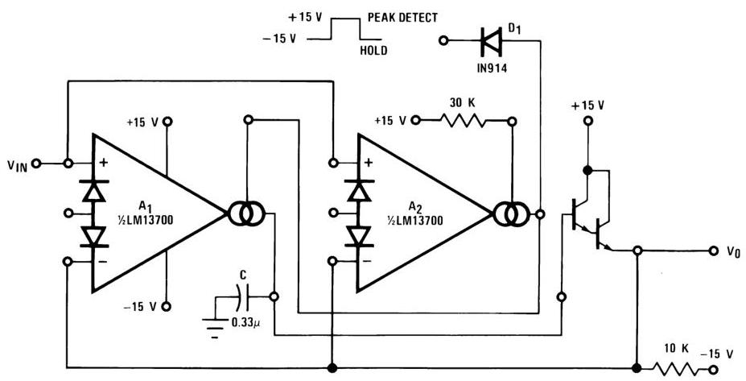
Figure 42. Peak Detector and Hold Circuit

The Ramp-and-Hold of Figure 44 sources $I_B$ into capacitor C whenever the input to A1 is brought high, giving a ramp-rate of about 1 V/ms for the component values shown.

The true-RMS converter of Figure 45 is essentially an automatic gain control amplifier which adjusts its gain such that the AC power at the output of amplifier A1 is constant. The output power of amplifier A1 is monitored by squaring amplifier A2 and the average compared to a reference voltage with amplifier A3. The output of A3 provides bias current to the diodes of A1 to attenuate the input signal. Because the output power of A1 is held constant, the RMS value is constant and the attenuation is directly proportional to the RMS value of the input voltage. The attenuation is also proportional to the diode bias current. Amplifier A4 adjusts the ratio of currents through the diodes to be equal and therefore the voltage at the output of A4 is proportional to the RMS value of the input voltage. The calibration potentiometer is set such that $V_O$ reads directly in RMS volts.

# System Examples (continued)

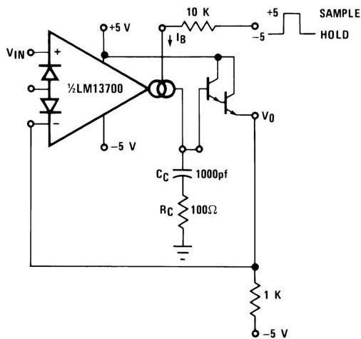
Figure 43. Sample-Hold Circuit

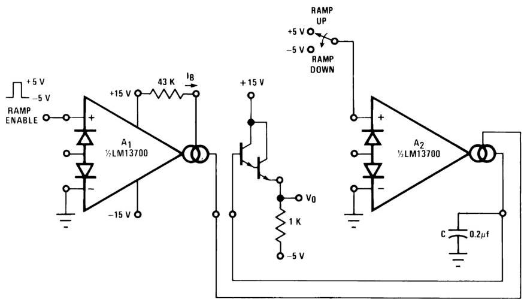
Figure 44. Ramp and Hold

# System Examples (continued)

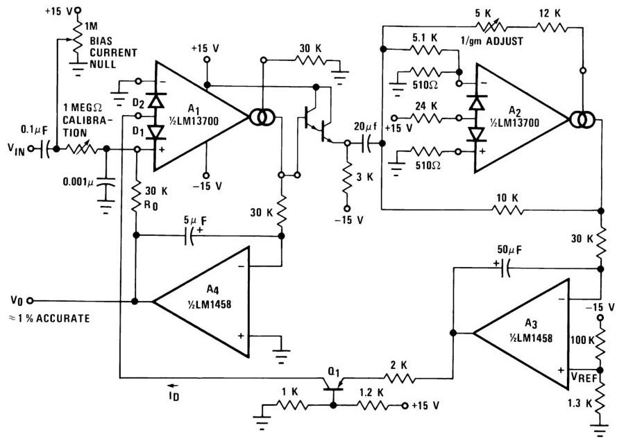
Figure 45. True RMS Converter

The circuit of Figure 46 is a voltage reference of variable Temperature Coefficient. The 100-kΩ potentiometer adjusts the output voltage which has a positive TC above 1.2 V, zero TC at about 1.2 V, and negative TC below 1.2 V. This is accomplished by balancing the TC of the A2 transfer function against the complementary TC of D1.

The wide dynamic range of the LM13700 allows easy control of the output pulse width in the Pulse Width Modulator of Figure 47.

For generating $I_{\mathrm{ABC}}$ over a range of 4 to 6 decades of current, the system of Figure 48 provides a logarithmic current out for a linear voltage in.

Since the closed-loop configuration ensures that the input to A2 is held equal to 0 V, the output current of A1 is equal to $I_{3} = -V_{C} / R_{C}$.

The differential voltage between Q1 and Q2 is attenuated by the R1,R2 network so that A1 may be assumed to be operating within its linear range. From Equation 5, the input voltage to A1 is:

$$
V_{IN1} = \frac{-2kT I_3}{q I_2} = \frac{-2kTV_C}{q I_2 R_C} \tag{11}
$$

The voltage on the base of Q1 is then

$$
V_{B1} = \frac{(R_1 + R_2) V_{IN1}}{R_1} \tag{12}
$$

The ratio of the Q1 and Q2 collector currents is defined by:

$$
V_{B1} = \frac{kT}{q} \ln \frac{I_{C2}}{I_{C1}} = \frac{kT}{q} \ln \frac{I_{ABC}}{I_1} \tag{13}
$$

Combining and solving for $I_{\mathrm{ABC}}$ yields:

$$
I_{\mathrm{ABC}} = I_1 \exp \left( \frac{2 (R_1 + R_2) V_C}{R_1 I_2 R_C} \right) \tag{14}
$$

This logarithmic current is used to bias the circuit of Figure 22 to provide temperature independent stereo attenuation characteristic.

# System Examples (continued)

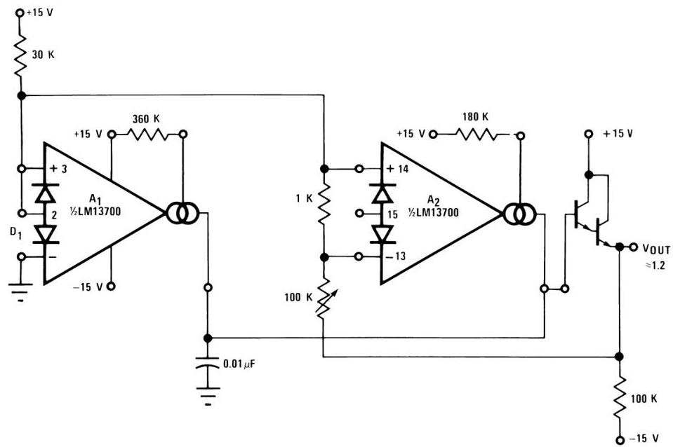
Figure 46. Delta VBE Reference

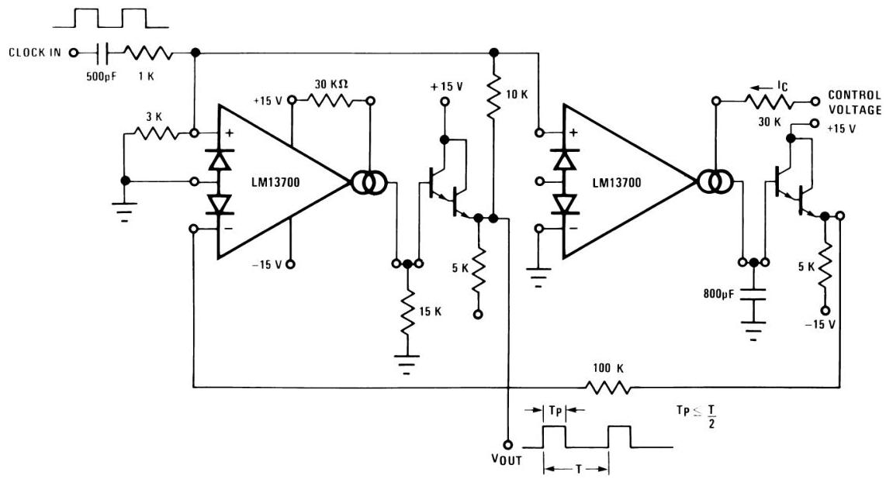
Figure 47. Pulse Width Modulator

# System Examples (continued)

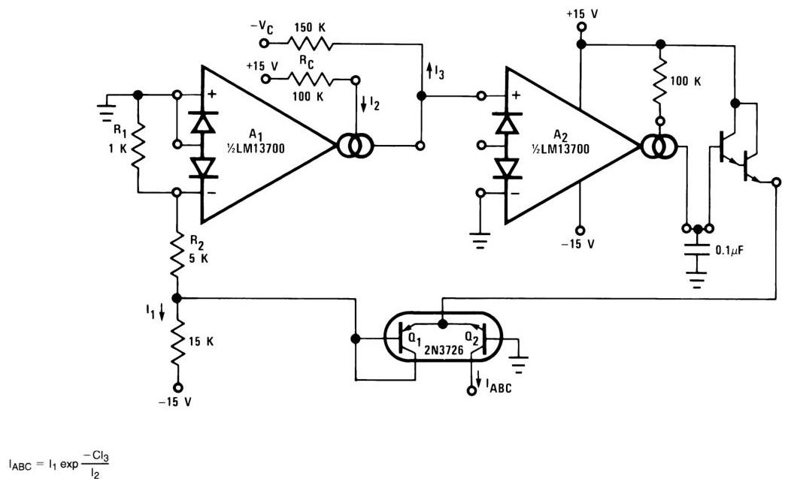
Figure 48. Logarithmic Current Source

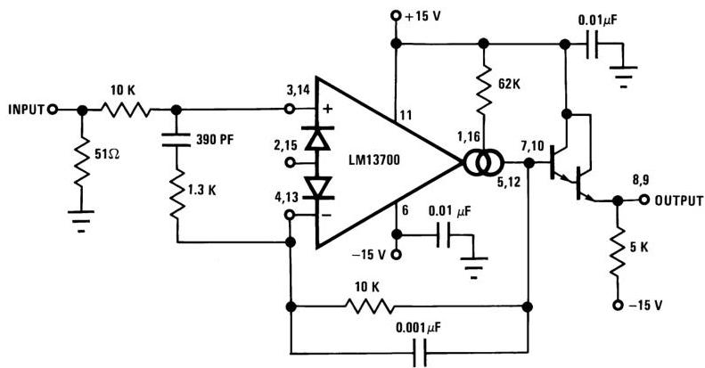
Figure 49. Unity Gain Follower

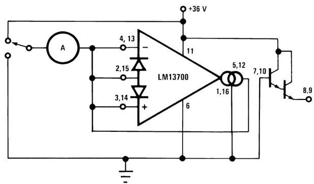
Figure 50. Leakage Current Test Circuit

# System Examples (continued)

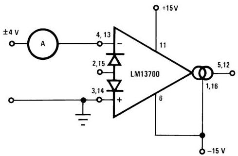
Figure 51. Differential Input Current Test Circuit

# 9 Power Supply Recommendations

The LM13700 can operate with either a single-ended supply or a dual supplies. The supplies should be low impedance sources with sufficient bypassing. Use of low-ESR sufficiently rated voltage ceramic capacitors is recommended. When bypassing dual supply configurations, the supply bypass capacitors should couple to ground.

# 10 Layout

## 10.1 Layout Guidelines

Place supply bypass capacitors as close to the appropriate supply pins as possible. When multiple bypass capacitors are used, the smallest value capacitor should be closest to the supply pin.

Use of a ground plane to minimize ground impedance and provide constant signal impedance is recommended. Avoid routing signal traces over any gaps in the ground plane.

Feedback components and passives should be placed close to the device pins to minimize parasitic impedances. When using capacitors to limit bandwidth, the capacitor should be closer to the device pin than any ballasting or gain resistors.

## 10.2 Layout Example

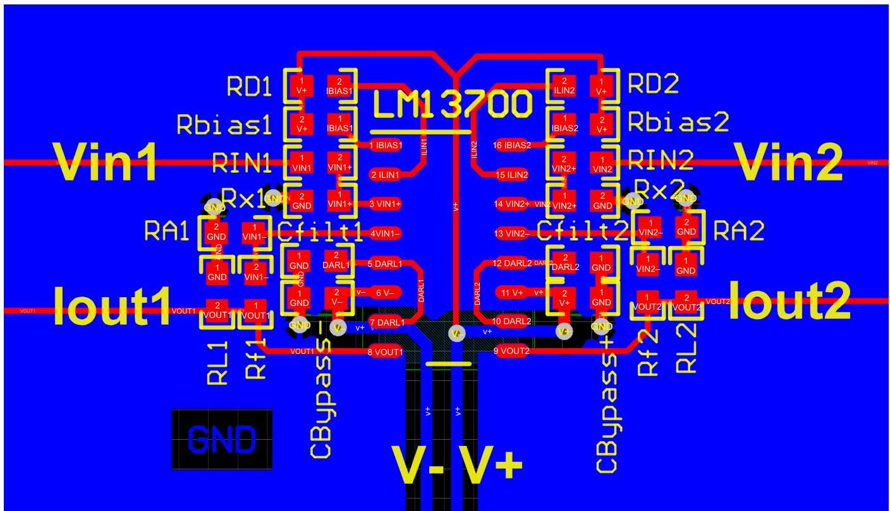
Figure 52. Layout Recommendation

# 11 Device and Documentation Support

## 11.1 Community Resources

The following links connect to TI community resources. Linked contents are provided "AS IS" by the respective contributors. They do not constitute TI specifications and do not necessarily reflect TI's views; see TI's Terms of Use.

**TI E2E™ Online Community** *TI's Engineer-to-Engineer (E2E) Community*. Created to foster collaboration among engineers. At e2e.ti.com, you can ask questions, share knowledge, explore ideas and help solve problems with fellow engineers.

**Design Support** *TI's Design Support* Quickly find helpful E2E forums along with design support tools and contact information for technical support.

## 11.2 Trademarks

E2E is a trademark of Texas Instruments.

All other trademarks are the property of their respective owners.

## 11.3 Electrostatic Discharge Caution

⚠️ These devices have limited built-in ESD protection. The leads should be shorted together or the device placed in conductive foam during storage or handling to prevent electrostatic damage to the MOS gates.

## 11.4 Glossary

**SLYZ022 — TI Glossary.**

This glossary lists and explains terms, acronyms, and definitions.

# 12 Mechanical, Packaging, and Orderable Information

The following pages include mechanical, packaging, and orderable information. This information is the most current data available for the designated devices. This data is subject to change without notice and revision of this document. For browser-based versions of this data sheet, refer to the left-hand navigation.

PACKAGING INFORMATION

| Orderable part number | Status (1) | Material type (2) | Package | Pins | Package qty | Carrier | RoHS (3) | Lead finish/ Ball material (4) | MSL rating/ Peak reflow (5) | Op temp (°C) | Part marking (6) |
| --- | --- | --- | --- | --- | --- | --- | --- | --- | --- | --- | --- |
| LM13700M/NOPB | Active | Production | SOIC (D) | 16 | 48 | TUBE | Yes | SN | Level-1-260C-UNLIM | 0 to 70 | LM13700M |
| LM13700M/NOPB.B | Active | Production | SOIC (D) | 16 | 48 | TUBE | Yes | SN | Level-1-260C-UNLIM | 0 to 70 | LM13700M |
| LM13700MX/NOPB | Active | Production | SOIC (D) | 16 | 2500 | LARGE T&R | Yes | SN | Level-1-260C-UNLIM | 0 to 70 | LM13700M |
| LM13700MX/NOPB.B | Active | Production | SOIC (D) | 16 | 2500 | LARGE T&R | Yes | SN | Level-1-260C-UNLIM | 0 to 70 | LM13700M |

(1) Status: For more details on status, see our product life cycle.

(2) Material type: When designated, preproduction parts are prototypes/experimental devices, and are not yet approved or released for full production. Testing and final process, including without limitation quality assurance, reliability performance testing, and/or process qualification, may not yet be complete, and this item is subject to further changes or possible discontinuation. If available for ordering, purchases will be subject to an additional waiver at checkout, and are intended for early internal evaluation purposes only. These items are sold without warranties of any kind.

(3) RoHS values: Yes, No, RoHS Exempt. See the TI RoHS Statement for additional information and value definition.

(4) Lead finish/Ball material: Parts may have multiple material finish options. Finish options are separated by a vertical ruled line. Lead finish/Ball material values may wrap to two lines if the finish value exceeds the maximum column width.

(5) MSL rating/Peak reflow: The moisture sensitivity level ratings and peak solder (reflow) temperatures. In the event that a part has multiple moisture sensitivity ratings, only the lowest level per JEDEC standards is shown. Refer to the shipping label for the actual reflow temperature that will be used to mount the part to the printed circuit board.

(6) Part marking: There may be an additional marking, which relates to the logo, the lot trace code information, or the environmental category of the part.

Multiple part markings will be inside parentheses. Only one part marking contained in parentheses and separated by a “~” will appear on a part. If a line is indented then it is a continuation of the previous line and the two combined represent the entire part marking for that device.

Important Information and Disclaimer: The information provided on this page represents TI's knowledge and belief as of the date that it is provided. TI bases its knowledge and belief on information provided by third parties, and makes no representation or warranty as to the accuracy of such information. Efforts are underway to better integrate information from third parties. TI has taken and continues to take reasonable steps to provide representative and accurate information but may not have conducted destructive testing or chemical analysis on incoming materials and chemicals. TI and TI suppliers consider certain information to be proprietary, and thus CAS numbers and other limited information may not be available for release.

In no event shall TI's liability arising out of such information exceed the total purchase price of the TI part(s) at issue in this document sold by TI to Customer on an annual basis.

# TAPE AND REEL INFORMATION

REEL DIMENSIONS

TAPE DIMENSIONS

|  A0 | Dimension designed to accommodate the component width  |
| --- | --- |
|  B0 | Dimension designed to accommodate the component length  |
|  K0 | Dimension designed to accommodate the component thickness  |
|  W | Overall width of the carrier tape  |
|  P1 | Pitch between successive cavity centers  |

QUADRANT ASSIGNMENTS FOR PIN 1 ORIENTATION IN TAPE

*All dimensions are nominal

|  Device | Package Type | Package Drawing | Pins | SPQ | Reel Diameter (mm) | Reel Width W1 (mm) | A0 (mm) | B0 (mm) | K0 (mm) | P1 (mm) | W (mm) | Pin1 Quadrant  |
| --- | --- | --- | --- | --- | --- | --- | --- | --- | --- | --- | --- | --- |
|  LM13700MX/NOPB | SOIC | D | 16 | 2500 | 330.0 | 16.4 | 6.5 | 10.3 | 2.3 | 8.0 | 16.0 | Q1  |

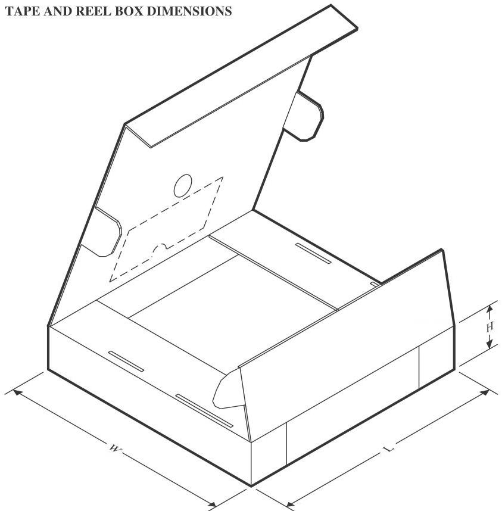
TAPE AND REEL BOX DIMENSIONS

*All dimensions are nominal

|  Device | Package Type | Package Drawing | Pins | SPQ | Length (mm) | Width (mm) | Height (mm)  |
| --- | --- | --- | --- | --- | --- | --- | --- |
|  LM13700MX/NOPB | SOIC | D | 16 | 2500 | 356.0 | 356.0 | 35.0  |

# TUBE

*All dimensions are nominal

|  Device | Package Name | Package Type | Pins | SPQ | L (mm) | W (mm) | T (μm) | B (mm)  |
| --- | --- | --- | --- | --- | --- | --- | --- | --- |
|  LM13700M/NOPB | D | SOIC | 16 | 48 | 495 | 8 | 4064 | 3.05  |
|  LM13700M/NOPB.B | D | SOIC | 16 | 48 | 495 | 8 | 4064 | 3.05  |

D (R-PDSO-G16)

PLASTIC SMALL OUTLINE

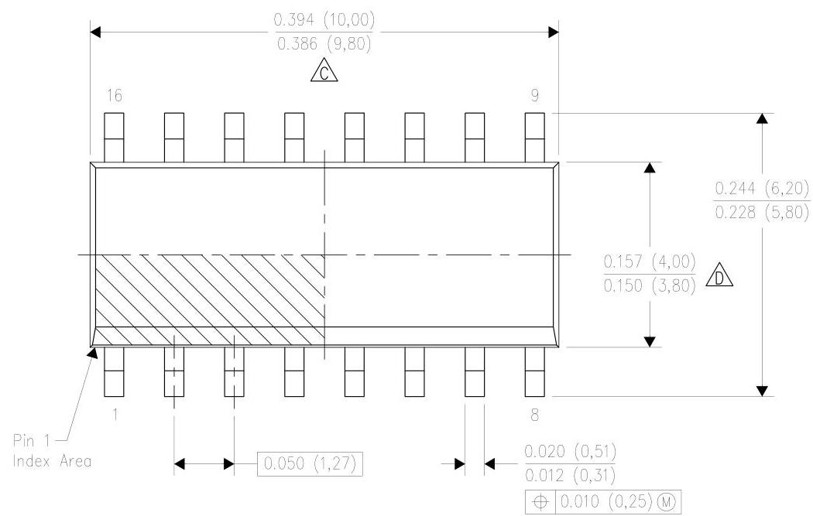

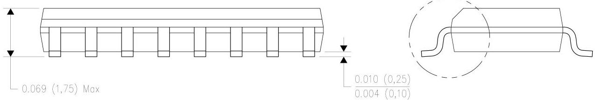

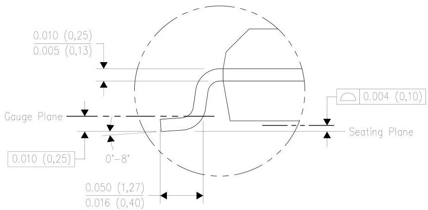

4040047-6/M 06/11

NOTES:
A. All linear dimensions are in inches (millimeters).
B. This drawing is subject to change without notice.
A. Body length does not include mold flash, protrusions, or gate burrs. Mold flash, protrusions, or gate burrs shall not exceed 0.006 (0,15) each side.
A. Body width does not include interlead flash. Interlead flash shall not exceed 0.017 (0,43) each side.
E. Reference JEDEC MS-012 variation AC.

# IMPORTANT NOTICE AND DISCLAIMER

TI PROVIDES TECHNICAL AND RELIABILITY DATA (INCLUDING DATASHEETS), DESIGN RESOURCES (INCLUDING REFERENCE DESIGNS), APPLICATION OR OTHER DESIGN ADVICE, WEB TOOLS, SAFETY INFORMATION, AND OTHER RESOURCES "AS IS" AND WITH ALL FAULTS, AND DISCLAIMS ALL WARRANTIES, EXPRESS AND IMPLIED, INCLUDING WITHOUT LIMITATION ANY IMPLIED WARRANTIES OF MERCHANTABILITY, FITNESS FOR A PARTICULAR PURPOSE OR NON-INFRINGEMENT OF THIRD PARTY INTELLECTUAL PROPERTY RIGHTS.

These resources are intended for skilled developers designing with TI products. You are solely responsible for (1) selecting the appropriate TI products for your application, (2) designing, validating and testing your application, and (3) ensuring your application meets applicable standards, and any other safety, security, regulatory or other requirements.

These resources are subject to change without notice. TI grants you permission to use these resources only for development of an application that uses the TI products described in the resource. Other reproduction and display of these resources is prohibited. No license is granted to any other TI intellectual property right or to any third party intellectual property right. TI disclaims responsibility for, and you fully indemnify TI and its representatives against any claims, damages, costs, losses, and liabilities arising out of your use of these resources.

TI's products are provided subject to TI's Terms of Sale, TI's General Quality Guidelines, or other applicable terms available either on ti.com or provided in conjunction with such TI products. TI's provision of these resources does not expand or otherwise alter TI's applicable warranties or warranty disclaimers for TI products. Unless TI explicitly designates a product as custom or customer-specified, TI products are standard, catalog, general purpose devices.

TI objects to and rejects any additional or different terms you may propose.

Copyright © 2025, Texas Instruments Incorporated
Last updated 10/2025