# LM2776 Switched Capacitor Inverter

## 1 Features
- Input Voltage: 2.7 V to 5.5 V
- 200-mA Output Current
- Inverts Input Supply Voltage
- Low-Current PFM Mode Operation
- 2-MHz Switching Frequency
- Greater than 90% Efficiency
- Current Limit and Thermal Protection
- No Inductors

## 2 Applications
- Operational Amplifier Power Supplies
- Interface Power Supplies
- Data Converter Supplies
- Audio Amplifier Power Supplies
- Portable Electronic Devices

## 3 Description
The LM2776 CMOS charge-pump voltage converter inverts a positive voltage in the range from 2.7 V to 5.5 V to the corresponding negative voltage. The LM2776 uses three low-cost capacitors to provide 200 mA of output current without the cost, size, and electromagnetic interference (EMI) related to inductor-based converters.

With an operating current of only 100 µA and operating efficiency greater than 90% at most loads, the LM2776 provides ideal performance for battery-powered systems requiring a high power negative power supply.

The LM2776 has been placed in TI's 6-pin SOT-23 to maintain a small form factor.

### Device Information(1)
|  PART NUMBER | PACKAGE | BODY SIZE (NOM)  |
| --- | --- | --- |
|  LM2776 | SOT-23 (6) | 2.90 mm × 1.60 mm  |

(1) For all available packages, see the orderable addendum at the end of the data sheet.

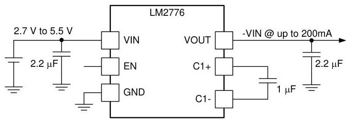
Typical Application

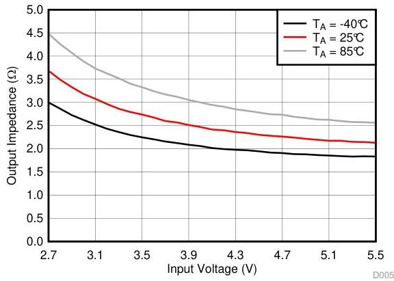
Output Impedance vs Input Voltage $I_{OUT} = 100 \, \text{mA}$

# Table of Contents

1 Features 1
2 Applications 1
3 Description 1
4 Revision History 2
5 Pin Configuration and Functions 3
6 Specifications 4
6.1 Absolute Maximum Ratings 4
6.2 ESD Ratings 4
6.3 Recommended Operating Conditions 4
6.4 Thermal Information 4
6.5 Electrical Characteristics 5
6.6 Switching Characteristics 5
6.7 Typical Characteristics 5
7 Detailed Description 9
7.1 Overview 9
7.2 Functional Block Diagram 9
7.3 Feature Description 9
7.4 Device Functional Modes 10
8 Application and Implementation 11
8.1 Application Information 11
8.2 Typical Application - Voltage Inverter 11
9 Power Supply Recommendations 15
10 Layout 15
10.1 Layout Guidelines 15
10.2 Layout Example 15
11 Device and Documentation Support 16
11.1 Device Support 16
11.2 Receiving Notification of Documentation Updates 16
11.3 Community Resources 16
11.4 Trademarks 16
11.5 Electrostatic Discharge Caution 16
11.6 Glossary 16
12 Mechanical, Packaging, and Orderable Information 16

# 4 Revision History

NOTE: Page numbers for previous revisions may differ from page numbers in the current version.

Changes from Revision A (February 2016) to Revision B

Page

- Added link for TIDA-01063 reference design 1

Changes from Original (May 2015) to Revision A

Page

- Changed Equation 1 from "R OUT = R SW..." to "R OUT = (2 × R SW)..." 12

# 5 Pin Configuration and Functions

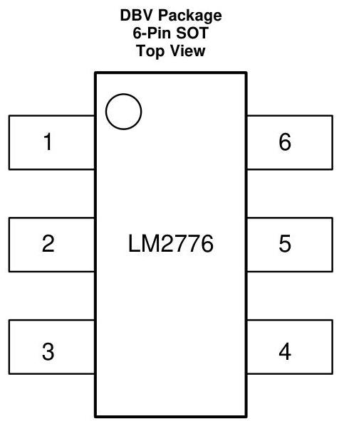

Pin Functions

|  PIN |   | TYPE | DESCRIPTION  |
| --- | --- | --- | --- |
|  NUMBER | NAME  |   |   |
|  1 | VOUT | Output/Power | Negative voltage output.  |
|  2 | GND | Ground | Power supply ground input.  |
|  3 | VIN | Input/Power | Power supply positive voltage input.  |
|  4 | EN | Input | Enable control pin, tie this pin high (EN = 1) for normal operation, and to GND (EN = 0) for shutdown.  |
|  5 | C1+ | Power | Connect this pin to the positive terminal of the charge-pump capacitor.  |
|  6 | C1- | Power | Connect this pin to the negative terminal of the charge-pump capacitor.  |

# 6 Specifications

## 6.1 Absolute Maximum Ratings

over operating free-air temperature range (unless otherwise noted) $^{(1)(2)}$

|   | MIN | MAX | UNIT  |
| --- | --- | --- | --- |
|  Supply voltage (VIN to GND, or GND to VOUT) | 6 |   | V  |
|  EN | (GND - 0.3) | (V_{IN} + 0.3) | V  |
|  VOUT continuous output current | 250 |   | mA  |
|  Operating junction temperature, T_{JMax} (3) | 125 |   | °C  |
|  Storage temperature, T_{stg} | -65 | 150 | °C  |

(1) Stresses beyond those listed under Absolute Maximum Ratings may cause permanent damage to the device. These are stress ratings only, which do not imply functional operation of the device at these or any other conditions beyond those indicated under Recommended Operating Conditions. Exposure to absolute-maximum-rated conditions for extended periods may affect device reliability.
(2) If Military/Aerospace specified devices are required, contact the Texas Instruments Sales Office/Distributors for availability and specifications.
(3) The maximum allowable power dissipation is calculated by using $P_{\text{DMax}} = (T_{\text{JMax}} - T_{\text{A}}) / R_{\text{IIJA}}$, where $T_{\text{JMax}}$ is the maximum junction temperature, $T_{\text{A}}$ is the ambient temperature, and $R_{\text{IIJA}}$ is the junction-to-ambient thermal resistance of the specified package.

## 6.2 ESD Ratings

|   |   | VALUE | UNIT  |
| --- | --- | --- | --- |
|  V_{(ESD)} Electrostatic discharge | Human-body model (HBM), per ANSI/ESDA/JEDEC JS-001 (1) | ±1000 | V  |
|   |  Charged-device model (CDM), per JEDEC specification JESD22-C101 (2) | ±250 | V  |

(1) JEDEC document JEP155 states that 500-V HBM allows safe manufacturing with a standard ESD control process.
(2) JEDEC document JEP157 states that 250-V CDM allows safe manufacturing with a standard ESD control process.

## 6.3 Recommended Operating Conditions

over operating free-air temperature range (unless otherwise noted)

|   | MIN | NOM | MAX | UNIT  |
| --- | --- | --- | --- | --- |
|  Junction temperature | -40 |  | 125 | °C  |
|  Ambient temperature | -40 |  | 85 | °C  |
|  Input voltage | 2.7 |  | 5.5 | V  |
|  Output current | 0 |  | 200 | mA  |

## 6.4 Thermal Information

|  THERMAL METRIC (1) | LM2776 | UNIT  |   |
| --- | --- | --- | --- |
|   |   |   |  DBV (SOT)  |
|   |   |   |  6 PINS  |
|  R_{IIJA} | Junction-to-ambient thermal resistance | 187 | °C/W  |
|  R_{IIJC(top)} | Junction-to-case (top) thermal resistance | 158.2 | °C/W  |
|  R_{IIJB} | Junction-to-board thermal resistance | 33.3 | °C/W  |
|  v_{JT} | Junction-to-top characterization parameter | 37.8 | °C/W  |
|  v_{JB} | Junction-to-board characterization parameter | 32.8 | °C/W  |

(1) For more information about traditional and new thermal metrics, see the Semiconductor and IC Package Thermal Metrics application report, SPRA953.

# 6.5 Electrical Characteristics

Typical limits tested at $T_{\mathrm{A}} = 25^{\circ}\mathrm{C}$. Minimum and maximum limits apply over the full operating ambient temperature range $(-40^{\circ}\mathrm{C} \leq T_{\mathrm{A}} \leq +85^{\circ}\mathrm{C})$. $V_{\mathrm{IN}} = 3.6\mathrm{~V}$, $C_{\mathrm{IN}} = C_{\mathrm{OUT}} = 2.2\mu \mathrm{F}$, $C_1 = 1\mu \mathrm{F}$

|  PARAMETER |   | TEST CONDITIONS | MIN | TYP | MAX | UNIT  |
| --- | --- | --- | --- | --- | --- | --- |
|  IQ | Supply current | EN = 1. No load |  | 100 | 200 | μA  |
|  ISD | Shutdown supply current | EN = 0 |  | 0.1 | 1 | μA  |
|  VEN | Enable pin input threshold voltage | Normal operation | 1.2 |  |  | V  |
|   |   |  Shutdown mode |  |  | 0.4  |   |
|  ROUT | Output resistance |  |  | 2.5 |  | Ω  |
|  ICL | Output current limit |  |  | 400 |  | mA  |
|  UVLO | Undervoltage lockout | VIN Falling |  | 2.4 |  | V  |
|   |   |  VIN Rising |  | 2.6 |   |   |

# 6.6 Switching Characteristics

over operating free-air temperature range (unless otherwise noted)

|  PARAMETER |   | TEST CONDITIONS | MIN | TYP | MAX | UNIT  |
| --- | --- | --- | --- | --- | --- | --- |
|  fSW | Switching frequency |  | 1.7 | 2 | 2.3 | MHz  |

# 6.7 Typical Characteristics

(Typical Application circuit, $V_{\mathrm{IN}} = 3.6$ V unless otherwise specified.)

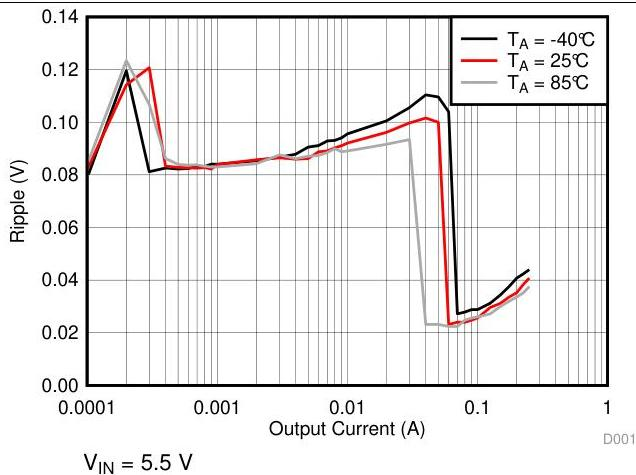
Figure 1. Output Ripple vs Output Current

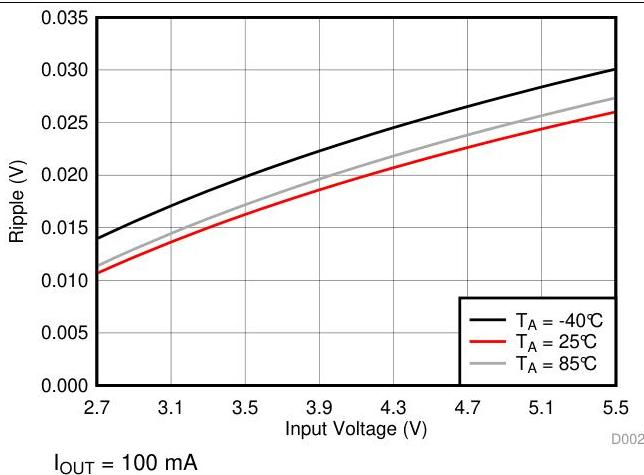
Figure 2. Output Ripple vs Input Voltage

# Typical Characteristics (continued)

(Typical Application circuit, $V_{\mathrm{IN}} = 3.6$ V unless otherwise specified.)

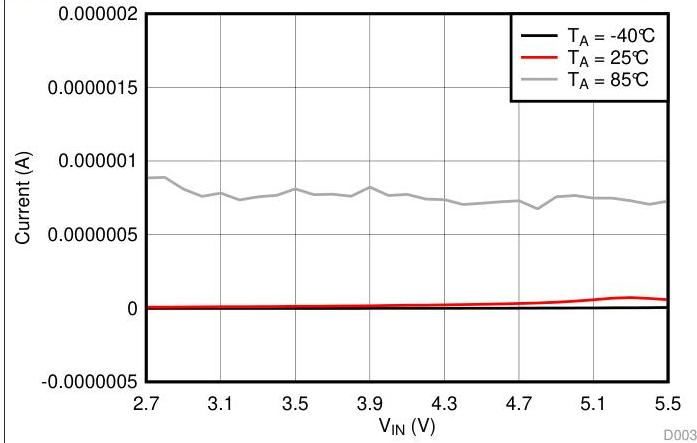
Figure 3. Shutdown Current vs Input Voltage

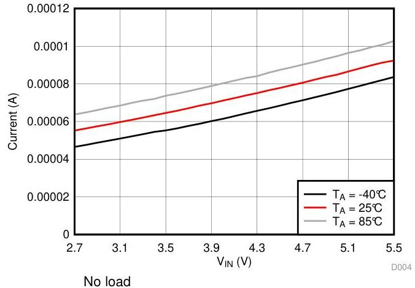
Figure 4. Quiescent Current vs Input Voltage

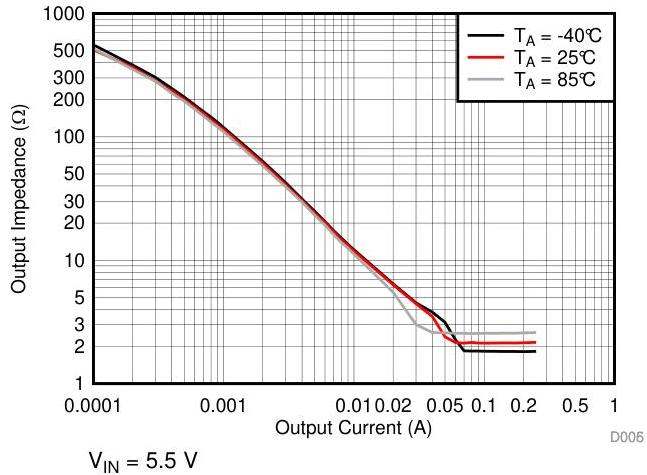
Figure 5. Output Impedance vs Output Current

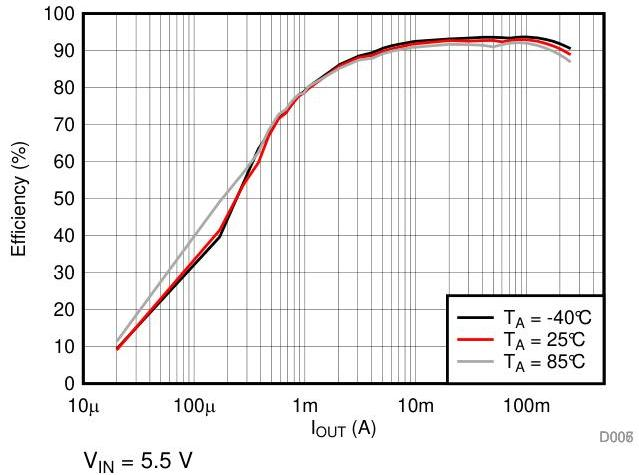
Figure 6. Efficiency vs Output Current

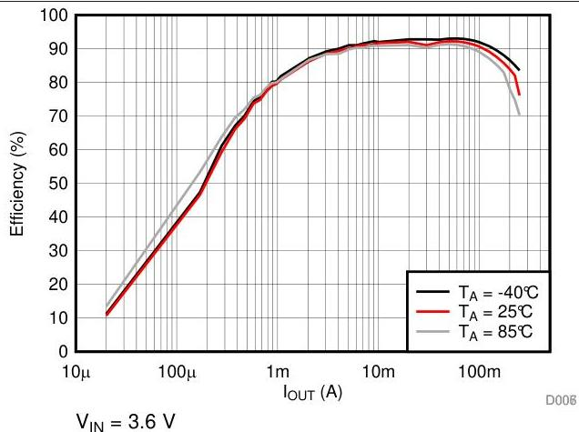
Figure 7. Efficiency vs Output Current

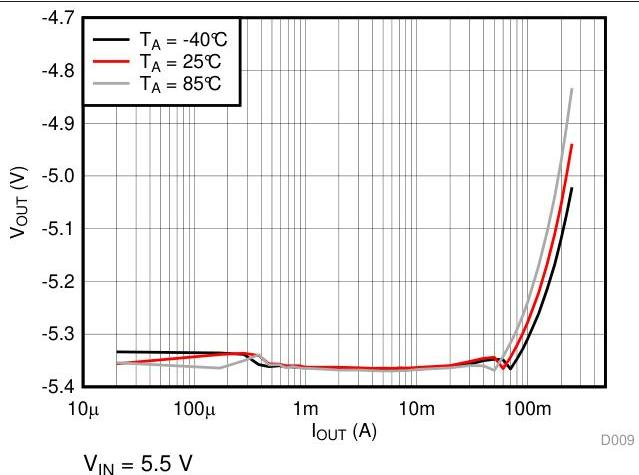
Figure 8. Output Voltage vs Output Current

# Typical Characteristics (continued)

(Typical Application circuit, $V_{\mathrm{IN}} = 3.6$ V unless otherwise specified.)

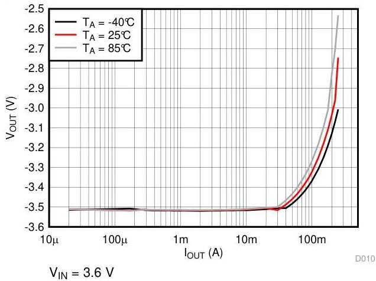
Figure 9. Output Voltage vs Output Current

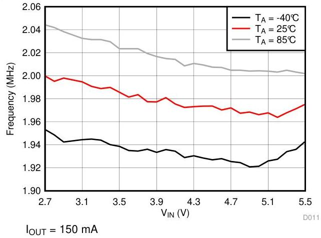
Figure 10. Frequency vs Input Voltage

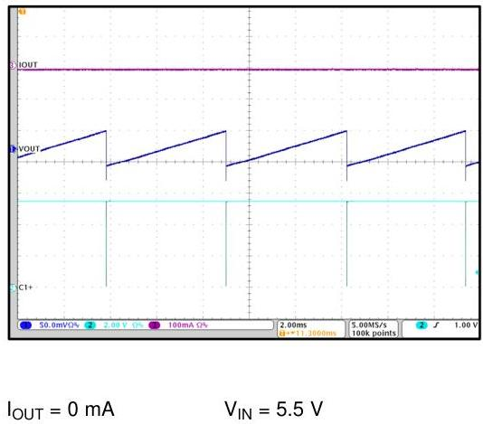

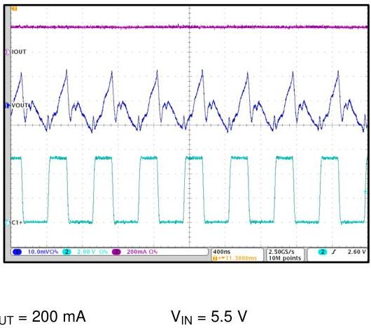

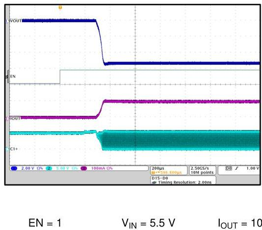
Figure 11. Unloaded Output Voltage Ripple

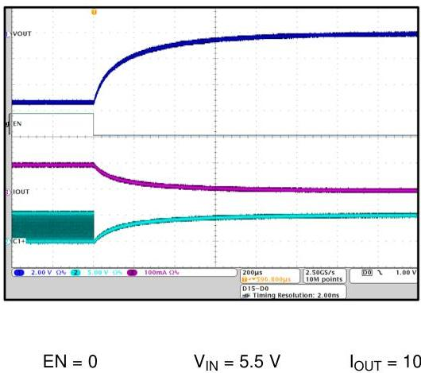
Figure 12. Loaded Output Voltage Ripple

# Typical Characteristics (continued)

(Typical Application circuit, $V_{\mathrm{IN}} = 3.6$ V unless otherwise specified.)

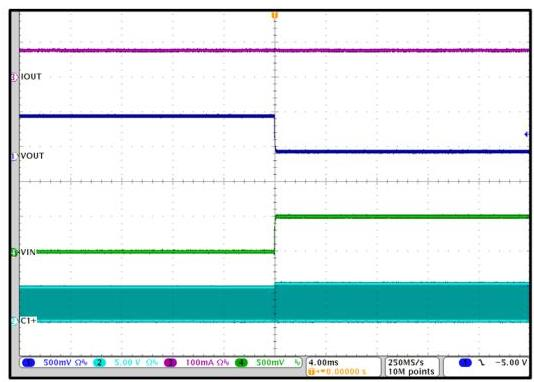
Figure 15. Line Step 5.5 V to 5 V

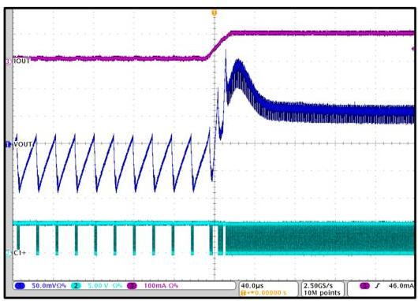
Figure 16. Load Step 10 mA to 100 mA

$$
V_{\mathrm{IN}} = 5.5\ \mathrm{V}
$$

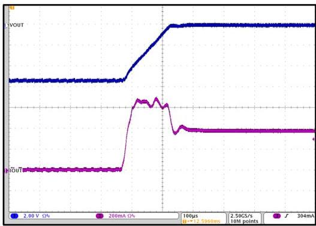
Figure 17. Output Short

$$
V_{\mathrm{IN}} = 5.5\ \mathrm{V}
$$

# 7 Detailed Description

## 7.1 Overview

The LM2776 CMOS charge-pump voltage converter inverts a positive voltage in the range of 2.7 V to 5.5 V to the corresponding negative voltage of -2.7 V to -5.5 V. The LM2776 uses three low-cost capacitors to provide up to 200 mA of output current.

## 7.2 Functional Block Diagram

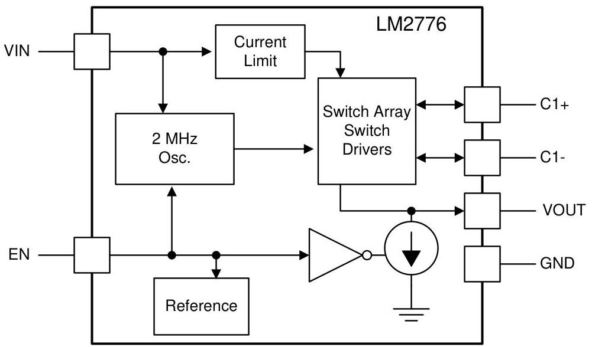

## 7.3 Feature Description

### 7.3.1 Input Current Limit

The LM2776 contains current limit circuitry that protects the device in the event of excessive input current and/or output shorts to ground. The input current is limited to 400 mA (typical at $V_{\mathrm{IN}} = 5.5 \, \mathrm{V}$) when the output is shorted directly to ground. When the LM2776 is current limiting, power dissipation in the device is likely to be quite high. In this event, thermal cycling is expected.

### 7.3.2 PFM Operation

To minimize quiescent current during light load operation, the LM2776 allows PFM or pulse-skipping operation. By allowing the charge pump to switch less when the output current is less than 40 mA, the quiescent current drawn from the power source is minimized. The frequency of pulsed operation is not limited and can drop into the sub-1-kHz range when unloaded. As the load increases, the frequency of pulsing increases until it transitions to constant frequency. The fundamental switching frequency of the LM2776 is 2 MHz.

### 7.3.3 Output Discharge

In shutdown, the LM2776 actively pulls down on the output of the device until the output voltage reaches GND. In this mode, the current drawn from the output is approximately 1.85 mA.

### 7.3.4 Thermal Shutdown

The LM2776 implements a thermal shutdown mechanism to protect the device from damage due to overheating. When the junction temperature rises to $150^{\circ}\mathrm{C}$ (typical), the part switches into shutdown mode. The LM2776 releases thermal shutdown when the junction temperature of the part is reduced to $130^{\circ}\mathrm{C}$ (typical).

# Feature Description (continued)

Thermal shutdown is most often triggered by self-heating, which occurs when there is excessive power dissipation in the device and/or insufficient thermal dissipation. LM2776 power dissipation increases with increased output current and input voltage. When self-heating brings on thermal shutdown, thermal cycling is the typical result. Thermal cycling is the repeating process where the part self-heats, enters thermal shutdown (where internal power dissipation is practically zero), cools, turns on, and then heats up again to the thermal shutdown threshold. Thermal cycling is recognized by a pulsing output voltage and can be stopped by reducing the internal power dissipation (reduce input voltage and/or output current) or the ambient temperature. If thermal cycling occurs under desired operating conditions, thermal dissipation performance must be improved to accommodate the power dissipation of the LM2776.

## 7.3.5 Undervoltage Lockout

The LM2776 has an internal comparator that monitors the voltage at $V_{\mathrm{IN}}$ and forces the device into shutdown if the input voltage drops to 2.4 V. If the input voltage rises above 2.6 V, the LM2776 resumes normal operation.

## 7.4 Device Functional Modes

### 7.4.1 Shutdown Mode

An enable pin (EN) pin is available to disable the device and place the LM2776 into shutdown mode reducing the quiescent current to $1\ \mu\mathrm{A}$. In shutdown, the output of the LM2776 is pulled to ground by an internal pullup current source (approx 1.85 mA).

### 7.4.2 Enable Mode

Applying a voltage greater than $1.2\ \mathrm{V}$ to the EN pin places the device into enable mode. When unloaded, the input current during operation is $120\ \mu\mathrm{A}$. As the load current increases, so does the quiescent current. When enabled, the output voltage is equal to the inverse of the input voltage minus the voltage drop across the charge pump.

# 8 Application and Implementation

NOTE

Information in the following applications sections is not part of the TI component specification, and TI does not warrant its accuracy or completeness. TI's customers are responsible for determining suitability of components for their purposes. Customers should validate and test their design implementation to confirm system functionality.

# 8.1 Application Information

The LM2776 CMOS charge-pump voltage converter inverts a positive voltage in the range of 2.7 V to 5.5 V to the corresponding negative voltage of -2.7 V to -5.5 V. The device uses three low-cost capacitors to provide up to 200 mA of output current. The LM2776 operates at 2-MHz oscillator frequency to reduce output resistance and voltage ripple under heavy loads. With an operating current of only 100 µA (operating efficiency greater than 91% with most loads) and 1-µA typical shutdown current, the LM2776 provides ideal performance for battery-powered systems.

# 8.2 Typical Application - Voltage Inverter

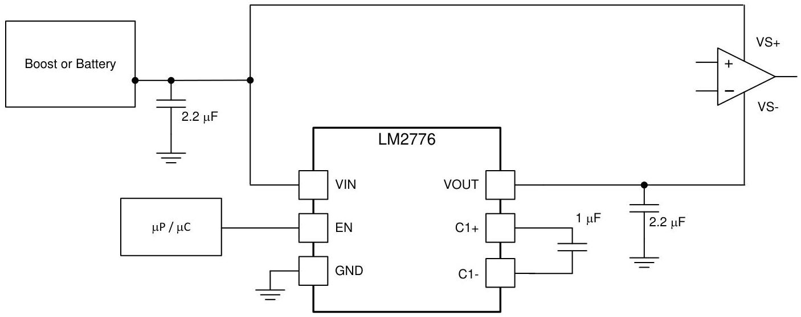
Figure 18. Voltage Inverter

# 8.2.1 Design Requirements

Example requirements for typical voltage inverter applications:

|  DESIGN PARAMETER | EXAMPLE VALUE  |
| --- | --- |
|  Input voltage range | 2.7 V to 5.5 V  |
|  Output current | 0 mA to 200 mA  |
|  Boost switching frequency | 2 MHz  |

## 8.2.2 Detailed Design Requirements

The main application of LM2776 is to generate a negative supply voltage. The voltage inverter circuit uses only three external capacitors with an range of the input supply voltage from 2.7 V to 5.5 V.

The LM2776 contains four large CMOS switches which are switched in a sequence to invert the input supply voltage. Energy transfer and storage are provided by external capacitors. Figure 19 shows the voltage conversion scheme. When $S_{1}$ and $S_{3}$ are closed, $C_{1}$ charges to the supply voltage $V_{\mathrm{IN}}$. During this time interval, switches $S_{2}$ and $S_{4}$ are open. In the second time interval, $S_{1}$ and $S_{3}$ are open; at the same time, $S_{2}$ and $S_{4}$ are closed, $C_{1}$ is charging $C_{2}$. After a number of cycles, the voltage across $C_{2}$ is pumped to VIN. Because the anode of $C_{2}$ is connected to ground, the output at the cathode of $C_{2}$ equals -(VIN) when there is no load current. The output voltage drop when a load is added is determined by the parasitic resistance ($R_{\mathrm{ds(on)}}$) of the MOSFET switches and the equivalent series resistance (ESR) of the capacitors) and the charge transfer loss between capacitors.

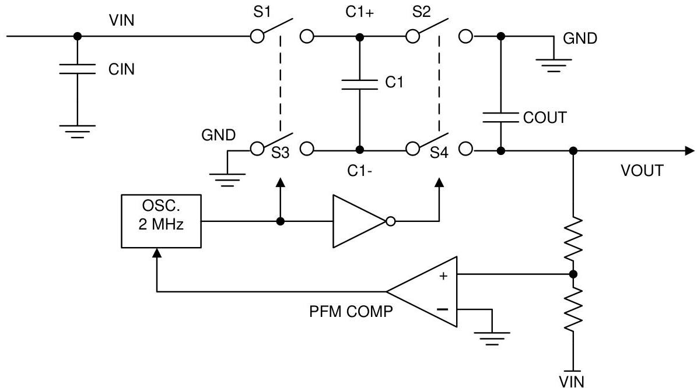
Figure 19. Voltage Inverting Principle

The output characteristics of this circuit can be approximated by an ideal voltage source in series with a resistance. The voltage source equals $-(V_{\mathrm{IN}})$. The output resistance $R_{\mathrm{OUT}}$ is a function of the ON resistance of the internal MOSFET switches, the oscillator frequency, the capacitance and ESR of $C_1$ and $C_2$. Because the switching current charging and discharging $C_1$ is approximately twice as the output current, the effect of the ESR of the pumping capacitor $C_1$ is multiplied by four in the output resistance. The output capacitor $C_2$ is charging and discharging at a current approximately equal to the output current, therefore, its ESR only counts once in the output resistance. A good approximation of $R_{\mathrm{OUT}}$ is:

$$
R_{\mathrm{OUT}} = (2 \times R_{\mathrm{SW}}) + \left[ 1 / (f_{\mathrm{SW}} \times C) \right] + (4 \times \mathrm{ESR}_{\mathrm{C1}}) + \mathrm{ESR}_{\mathrm{COUT}}
$$

where

- $R_{\mathrm{SW}}$ is the sum of the ON resistance of the internal MOSFET switches shown in Figure 19. (1)

High-capacitance, low-ESR ceramic capacitors reduce the output resistance.

## 8.2.2.1 Efficiency

Charge-pump efficiency is defined as

$$
\text{Efficiency} = \left[ \left(V_{\mathrm{OUT}} \times I_{\mathrm{OUT}}\right) / \left\{V_{\mathrm{IN}} \times \left(I_{\mathrm{IN}} + I_{\mathrm{Q}}\right) \right\} \right]
$$

where

- $I_{\mathrm{Q}}(V_{\mathrm{IN}})$ is the quiescent power loss of the device. (2)

## 8.2.2.2 Power Dissipation

LM2776 power dissipation ($P_D$) is calculated simply by subtracting output power from input power:

$$
P_D = P_{IN} - P_{OUT} = \left[ V_{IN} \times \left(-I_{OUT} + I_G\right) \right] - \left[ V_{OUT} \times I_{OUT} \right] \tag{3}
$$

Power dissipation increases with increased input voltage and output current. Internal power dissipation self-heats the device. Dissipating this amount power/heat so the LM2776 does not overheat is a demanding thermal requirement for a small surface-mount package. When soldered to a PCB with layout conducive to power dissipation, the thermal properties of the SOT package enable this power to be dissipated from the LM2776 with little or no derating, even when the circuit is placed in elevated ambient temperatures when the output current is 200 mA or less.

## 8.2.2.3 Capacitor Selection

The LM2776 requires 3 external capacitors for proper operation. TI recommends surface-mount multi-layer ceramic capacitors. These capacitors are small, inexpensive, and have very low ESR (≤ 15 mΩ typical). Tantalum capacitors, OS-CON capacitors, and aluminum electrolytic capacitors generally are not recommended for use with the LM2776 due to their high ESR, as compared to ceramic capacitors.

For most applications, ceramic capacitors with an X7R or X5R temperature characteristic are preferred for use with the LM2776. These capacitors have tight capacitance tolerance (as good as ±10%) and hold their value over temperature (X7R: ±15% over –55°C to 125°C; X5R: ±15% over –55°C to 85°C).

Capacitors with a Y5V or Z5U temperature characteristic are generally not recommended for use with the LM2776. These types of capacitors typically have wide capacitance tolerance (80%, ...20%) and vary significantly over temperature (Y5V: 22%, –82% over –30°C to 85°C range; Z5U: 22%, –56% over 10°C to 85°C range). Under some conditions, a 1-μF-rated Y5V or Z5U capacitor could have a capacitance as low as 0.1 μF. Such detrimental deviation is likely to cause Y5V and Z5U capacitors to fail to meet the minimum capacitance requirements of the LM2776.

Net capacitance of a ceramic capacitor decreases with increased DC bias. This degradation can result in lower capacitance than expected on the input and/or output, resulting in higher ripple voltages and currents. Using capacitors at DC bias voltages significantly below the capacitor voltage rating usually minimizes DC bias effects. Consult capacitor manufacturers for information on capacitor DC bias characteristics.

Capacitance characteristics can vary quite dramatically with different application conditions, capacitor types, and capacitor manufacturers. It is strongly recommended that the LM2776 circuit be thoroughly evaluated early in the design-in process with the mass-production capacitors of choice. This helps ensure that any such variability in capacitance does not negatively impact circuit performance.

The voltage rating of the output capacitor must be 10 V or more. For example, a 10-V 0603 1-μF is acceptable for use with the LM2776, as long as the capacitance does not fall below a minimum of 0.5 μF in the intended application. All other capacitors must have a voltage rating at or above the maximum input voltage of the application. Select the capacitors such that the capacitance on the input does not fall below 0.7 μF, and the capacitance of the flying capacitor does not fall below 0.2 μF.

## 8.2.2.4 Output Capacitor and Output Voltage Ripple

The peak-to-peak output voltage ripple is determined by the oscillator frequency, the capacitance and ESR of the output capacitor $C_{OUT}$:

$$
V_{RIPPLE} = \left[ \left(2 \times I_{LOAD}\right) / \left(f_{SW} \times C_{OUT}\right) \right] + \left(2 \times I_{LOAD} \times ESR_{COUT}\right) \tag{4}
$$

In typical applications, a 1-μF low-ESR ceramic output capacitor is recommended. Different output capacitance values can be used to reduce ripple shrink the solution size, and/or cut the cost of the solution. But changing the output capacitor may also require changing the flying capacitor and/or input capacitor to maintain good overall circuit performance.

# NOTE

In high-current applications, TI recommends a 10-µF, 10-V low-ESR ceramic output capacitor. If a small output capacitor is used, the output ripple can become large during the transition between PFM mode and constant switching. To prevent toggling, a 2-µF capacitance is recommended. For example, a 10- µF, 10-V output capacitor in a 0402 case size typically only has 2-µF capacitance when biased to 5 V.

High ESR in the output capacitor increases output voltage ripple. If a ceramic capacitor is used at the output, this is usually not a concern because the ESR of a ceramic capacitor is typically very low and has only a minimal impact on ripple magnitudes. If a different capacitor type with higher ESR is used (tantalum, for example), the ESR could result in high ripple. To eliminate this effect, the net output ESR can be significantly reduced by placing a low-ESR ceramic capacitor in parallel with the primary output capacitor. The low ESR of the ceramic capacitor is in parallel with the higher ESR, resulting in a low net ESR based on the principles of parallel resistance reduction.

## 8.2.2.5 Input Capacitor

The input capacitor (C_in) is a reservoir of charge that aids a quick transfer of charge from the supply to the flying capacitors during the charge phase of operation. The input capacitor helps to keep the input voltage from drooping at the start of the charge phase when the flying capacitors are connected to the input. It also filters noise on the input pin, keeping this noise out of sensitive internal analog circuitry that is biased off the input line.

Much like the relationship between the output capacitance and output voltage ripple, input capacitance has a dominant and first-order effect on input ripple magnitude. Increasing (decreasing) the input capacitance results in a proportional decrease (increase) in input voltage ripple. Input voltage, output current, and flying capacitance also affects input ripple levels to some degree.

In typical applications, a 1-µF low-ESR ceramic capacitor is recommended on the input. When operating near the maximum load of 200 mA, a minimum recommended input capacitance after taking into the DC-bias derating is 2 µF or larger. Different input capacitance values can be used to reduce ripple, shrink the solution size, and/or cut the cost of the solution.

## 8.2.2.6 Flying Capacitor

The flying capacitor (C1) transfers charge from the input to the output. Flying capacitance can impact both output current capability and ripple magnitudes. If flying capacitance is too small, the LM2776 may not be able to regulate the output voltage when load currents are high. On the other hand, if the flying capacitance is too large, the flying capacitor might overwhelm the input and output capacitors, resulting in increased input and output ripple.

In typical high-current applications, TI recommends 0.47-µF or 1-µF 10 V low-ESR ceramic capacitors for the flying capacitors. Polarized capacitors (tantalum, aluminum electrolytic, etc.) must not be used for the flying capacitor, as they could become reverse-biased during LM2776 operation.

## 8.2.3 Application Curve

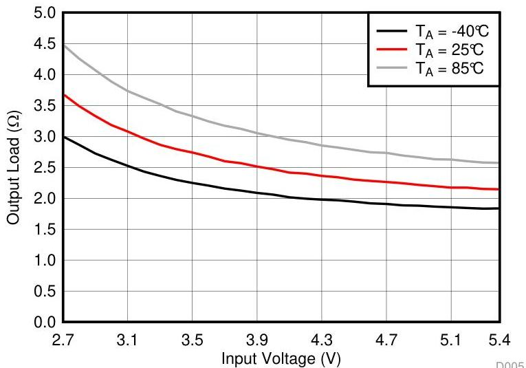
Figure 20. Output Impedance vs Input Voltage

## 9 Power Supply Recommendations

The LM2776 is designed to operate from an input voltage supply range from 2.7 V to 5.5 V. This input supply must be well regulated and capable to supply the required input current. If the input supply is located far from the LM2776 additional bulk capacitance may be required in addition to the ceramic bypass capacitors.

## 10 Layout

### 10.1 Layout Guidelines

The high switching frequency and large switching currents of the LM2776 make the choice of layout important. Use the following steps as a reference to ensure the device is stable and maintains proper LED current regulation across its intended operating voltage and current range:

- Place $C_{\text{IN}}$ on the top layer (same layer as the LM2776) and as close to the device as possible. Connecting the input capacitor through short, wide traces to both the VIN and GND pins reduces the inductive voltage spikes that occur during switching which can corrupt the VIN line.
- Place $C_{\text{OUT}}$ on the top layer (same layer as the LM2776) and as close to the VOUT and GND pins as possible. The returns for both $C_{\text{IN}}$ and $C_{\text{OUT}}$ must come together at one point, as close to the GND pin as possible. Connecting $C_{\text{OUT}}$ through short, wide traces reduce the series inductance on the VOUT and GND pins that can corrupt the $V_{\text{OUT}}$ and GND lines and cause excessive noise in the device and surrounding circuitry.
- Place C1 on the top layer (same layer as the LM2776) and as close to the device as possible. Connect the flying capacitor through short, wide traces to both the C1+ and C1- pins.

### 10.2 Layout Example

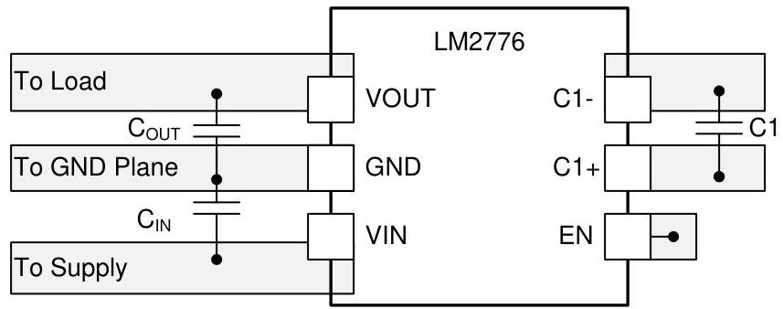
Figure 21. LM2776 Layout Example

# 11 Device and Documentation Support

## 11.1 Device Support

### 11.1.1 Third-Party Products Disclaimer

TI'S PUBLICATION OF INFORMATION REGARDING THIRD-PARTY PRODUCTS OR SERVICES DOES NOT CONSTITUTE AN ENDORSEMENT REGARDING THE SUITABILITY OF SUCH PRODUCTS OR SERVICES OR A WARRANTY, REPRESENTATION OR ENDORSEMENT OF SUCH PRODUCTS OR SERVICES, EITHER ALONE OR IN COMBINATION WITH ANY TI PRODUCT OR SERVICE.

## 11.2 Receiving Notification of Documentation Updates

To receive notification of documentation updates, navigate to the device product folder on ti.com. In the upper right corner, click on Alert me to register and receive a weekly digest of any product information that has changed. For change details, review the revision history included in any revised document.

## 11.3 Community Resources

The following links connect to TI community resources. Linked contents are provided "AS IS" by the respective contributors. They do not constitute TI specifications and do not necessarily reflect TI's views; see TI's Terms of Use.

**TI E2E™ Online Community** TI's Engineer-to-Engineer (E2E) Community. Created to foster collaboration among engineers. At e2e.ti.com, you can ask questions, share knowledge, explore ideas and help solve problems with fellow engineers.

**Design Support** TI's Design Support Quickly find helpful E2E forums along with design support tools and contact information for technical support.

## 11.4 Trademarks

E2E is a trademark of Texas Instruments.

All other trademarks are the property of their respective owners.

## 11.5 Electrostatic Discharge Caution

These devices have limited built-in ESD protection. The leads should be shorted together or the device placed in conductive foam during storage or handling to prevent electrostatic damage to the MOS gates.

## 11.6 Glossary

**SLYZ022 — TI Glossary.**

This glossary lists and explains terms, acronyms, and definitions.

# 12 Mechanical, Packaging, and Orderable Information

The following pages include mechanical, packaging, and orderable information. This information is the most current data available for the designated devices. This data is subject to change without notice and revision of this document. For browser-based versions of this data sheet, refer to the left-hand navigation.

PACKAGING INFORMATION

| Orderable part number | Status (1) | Material type (2) | Package | Pins | Package qty | Carrier | RoHS (3) | Lead finish/ Ball material (4) | MSL rating/ Peak reflow (5) | Op temp (°C) | Part marking (6) |
| --- | --- | --- | --- | --- | --- | --- | --- | --- | --- | --- | --- |
| LM2776DBVR | Active | Production | SOT-23 (DBV) | 6 | 3000 | LARGE T&R | Yes | SN | Level-1-260C-UNLIM | -40 to 85 | 2776 |
| LM2776DBVR.A | Active | Production | SOT-23 (DBV) | 6 | 3000 | LARGE T&R | Yes | SN | Level-1-260C-UNLIM | -40 to 125 | 2776 |
| LM2776DBVT | Active | Production | SOT-23 (DBV) | 6 | 250 | SMALL T&R | Yes | NIPDAU | SN | Level-1-260C-UNLIM | -40 to 85 | 2776 |
| LM2776DBVT.A | Active | Production | SOT-23 (DBV) | 6 | 250 | SMALL T&R | Yes | NIPDAU | Level-1-260C-UNLIM | -40 to 125 | 2776 |

(1) Status: For more details on status, see our product life cycle.

(2) Material type: When designated, preproduction parts are prototypes/experimental devices, and are not yet approved or released for full production. Testing and final process, including without limitation quality assurance, reliability performance testing, and/or process qualification, may not yet be complete, and this item is subject to further changes or possible discontinuation. If available for ordering, purchases will be subject to an additional waiver at checkout, and are intended for early internal evaluation purposes only. These items are sold without warranties of any kind.

(3) RoHS values: Yes, No, RoHS Exempt. See the TI RoHS Statement for additional information and value definition.

(4) Lead finish/Ball material: Parts may have multiple material finish options. Finish options are separated by a vertical ruled line. Lead finish/Ball material values may wrap to two lines if the finish value exceeds the maximum column width.

(5) MSL rating/Peak reflow: The moisture sensitivity level ratings and peak solder (reflow) temperatures. In the event that a part has multiple moisture sensitivity ratings, only the lowest level per JEDEC standards is shown. Refer to the shipping label for the actual reflow temperature that will be used to mount the part to the printed circuit board.

(6) Part marking: There may be an additional marking, which relates to the logo, the lot trace code information, or the environmental category of the part.

Multiple part markings will be inside parentheses. Only one part marking contained in parentheses and separated by a “~” will appear on a part. If a line is indented then it is a continuation of the previous line and the two combined represent the entire part marking for that device.

Important Information and Disclaimer: The information provided on this page represents TI's knowledge and belief as of the date that it is provided. TI bases its knowledge and belief on information provided by third parties, and makes no representation or warranty as to the accuracy of such information. Efforts are underway to better integrate information from third parties. TI has taken and continues to take reasonable steps to provide representative and accurate information but may not have conducted destructive testing or chemical analysis on incoming materials and chemicals. TI and TI suppliers consider certain information to be proprietary, and thus CAS numbers and other limited information may not be available for release.

In no event shall TI's liability arising out of such information exceed the total purchase price of the TI part(s) at issue in this document sold by TI to Customer on an annual basis.

# TAPE AND REEL INFORMATION

REEL DIMENSIONS

TAPE DIMENSIONS

|  A0 | Dimension designed to accommodate the component width  |
| --- | --- |
|  B0 | Dimension designed to accommodate the component length  |
|  K0 | Dimension designed to accommodate the component thickness  |
|  W | Overall width of the carrier tape  |
|  P1 | Pitch between successive cavity centers  |

QUADRANT ASSIGNMENTS FOR PIN 1 ORIENTATION IN TAPE

*All dimensions are nominal

|  Device | Package Type | Package Drawing | Pins | SPQ | Reel Diameter (mm) | Reel Width W1 (mm) | A0 (mm) | B0 (mm) | K0 (mm) | P1 (mm) | W (mm) | Pin1 Quadrant  |
| --- | --- | --- | --- | --- | --- | --- | --- | --- | --- | --- | --- | --- |
|  LM2776DBVR | SOT-23 | DBV | 6 | 3000 | 180.0 | 8.4 | 3.2 | 3.2 | 1.4 | 4.0 | 8.0 | Q3  |
|  LM2776DBVT | SOT-23 | DBV | 6 | 250 | 180.0 | 8.4 | 3.2 | 3.2 | 1.4 | 4.0 | 8.0 | Q3  |
|  LM2776DBVT | SOT-23 | DBV | 6 | 250 | 180.0 | 8.4 | 3.2 | 3.2 | 1.4 | 4.0 | 8.0 | Q3  |

TAPE AND REEL BOX DIMENSIONS

*All dimensions are nominal

|  Device | Package Type | Package Drawing | Pins | SPQ | Length (mm) | Width (mm) | Height (mm)  |
| --- | --- | --- | --- | --- | --- | --- | --- |
|  LM2776DBVR | SOT-23 | DBV | 6 | 3000 | 210.0 | 185.0 | 35.0  |
|  LM2776DBVT | SOT-23 | DBV | 6 | 250 | 210.0 | 185.0 | 35.0  |
|  LM2776DBVT | SOT-23 | DBV | 6 | 250 | 210.0 | 185.0 | 35.0  |

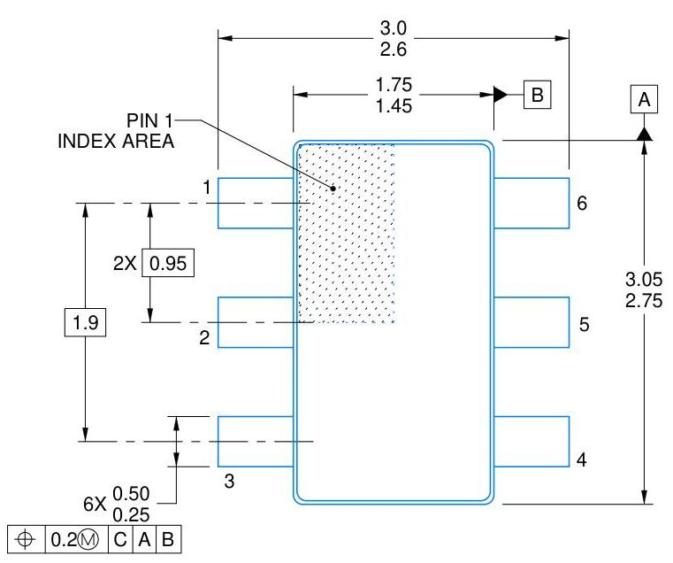

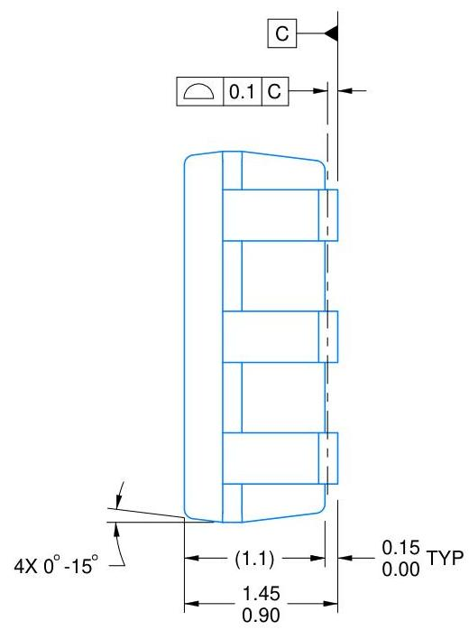

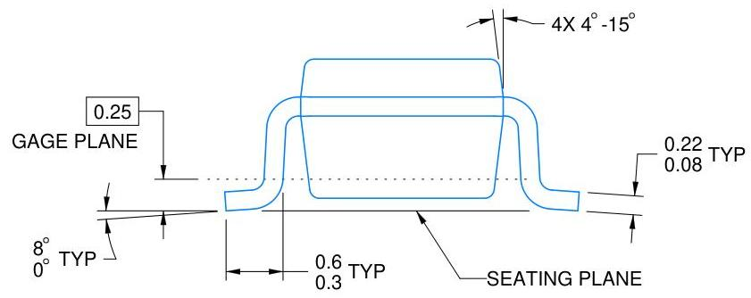

4214840/G 08/2024

# NOTES:

1. All linear dimensions are in millimeters. Any dimensions in parenthesis are for reference only. Dimensioning and tolerancing per ASME Y14.5M.
2. This drawing is subject to change without notice.
3. Body dimensions do not include mold flash or protrusion. Mold flash and protrusion shall not exceed 0.25 per side.
4. Leads 1,2,3 may be wider than leads 4,5,6 for package orientation.
5. Reference JEDEC MO-178.

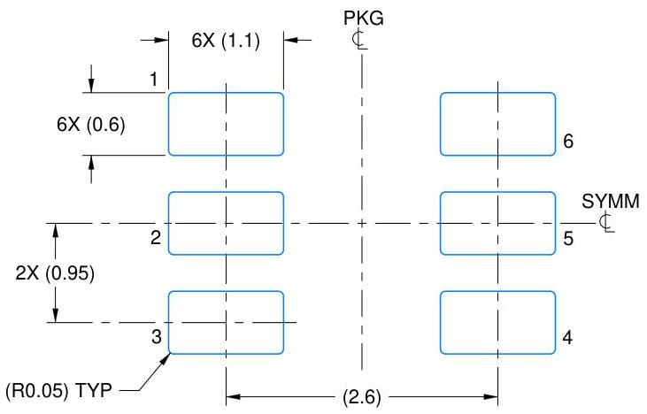
LAND PATTERN EXAMPLE
EXPOSED METAL SHOWN
SCALE:15X

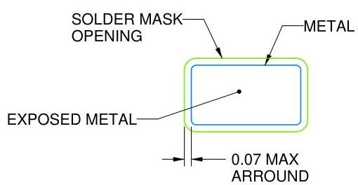
NON SOLDER MASK
DEFINED
(PREFERRED)

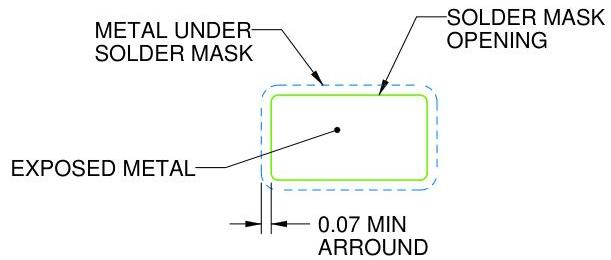
SOLDER MASK
DEFINED
SOLDER MASK DETAILS

4214840/G 08/2024

NOTES: (continued)

6. Publication IPC-7351 may have alternate designs.
7. Solder mask tolerances between and around signal pads can vary based on board fabrication site.

SMALL OUTLINE TRANSISTOR

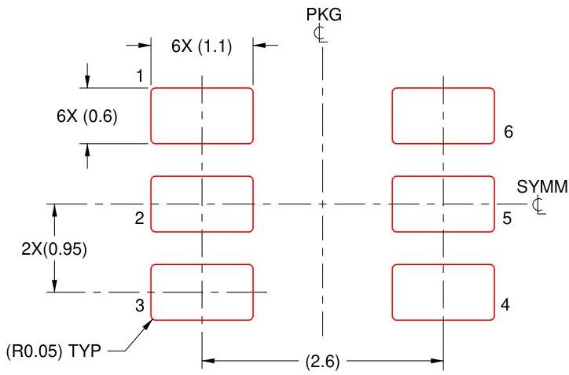
SOLDER PASTE EXAMPLE
BASED ON 0.125 mm THICK STENCIL
SCALE:15X

4214840/G 08/2024

NOTES: (continued)

8. Laser cutting apertures with trapezoidal walls and rounded corners may offer better paste release. IPC-7525 may have alternate design recommendations.
9. Board assembly site may have different recommendations for stencil design.

# IMPORTANT NOTICE AND DISCLAIMER

TI PROVIDES TECHNICAL AND RELIABILITY DATA (INCLUDING DATASHEETS), DESIGN RESOURCES (INCLUDING REFERENCE DESIGNS), APPLICATION OR OTHER DESIGN ADVICE, WEB TOOLS, SAFETY INFORMATION, AND OTHER RESOURCES "AS IS" AND WITH ALL FAULTS, AND DISCLAIMS ALL WARRANTIES, EXPRESS AND IMPLIED, INCLUDING WITHOUT LIMITATION ANY IMPLIED WARRANTIES OF MERCHANTABILITY, FITNESS FOR A PARTICULAR PURPOSE OR NON-INFRINGEMENT OF THIRD PARTY INTELLECTUAL PROPERTY RIGHTS.

These resources are intended for skilled developers designing with TI products. You are solely responsible for (1) selecting the appropriate TI products for your application, (2) designing, validating and testing your application, and (3) ensuring your application meets applicable standards, and any other safety, security, regulatory or other requirements.

These resources are subject to change without notice. TI grants you permission to use these resources only for development of an application that uses the TI products described in the resource. Other reproduction and display of these resources is prohibited. No license is granted to any other TI intellectual property right or to any third party intellectual property right. TI disclaims responsibility for, and you fully indemnify TI and its representatives against any claims, damages, costs, losses, and liabilities arising out of your use of these resources.

TI's products are provided subject to TI's Terms of Sale, TI's General Quality Guidelines, or other applicable terms available either on ti.com or provided in conjunction with such TI products. TI's provision of these resources does not expand or otherwise alter TI's applicable warranties or warranty disclaimers for TI products. Unless TI explicitly designates a product as custom or customer-specified, TI products are standard, catalog, general purpose devices.

TI objects to and rejects any additional or different terms you may propose.

Copyright © 2025, Texas Instruments Incorporated
Last updated 10/2025