# LP5907 250mA 低噪声、低 IQ LDO

## 1 特性

- 有关更新的器件产品组合，请参阅 TPS7A20
- 输入电压范围：2.2V 至 5.5V
- 输出电压范围：1.2V 至 4.5V
- 与 1μF 陶瓷输入和输出电容搭配使用，性能稳定
- 无需噪声旁路电容
- 支持远距离安置输出电容
- 具备热过载和短路保护功能
- 工作结温：-40°C 至 125°C
- 低输出电压噪声：&lt; 6.5μV RMS
- PSRR：1kHz 时为 82dB
- 输出电压容差：±2%
- 极低 IQ（使能时）：12 μA
- 低压降：120mV（典型值）
- 使用 LP5907 并借助 WEBENCH® Power Designer 创建定制设计方案

## 2 应用

- 智能手机
- 平板电脑
- 通信设备
- 数码相机
- 工厂自动化

## 3 说明

LP5907 是一款能提供高达 250mA 输出电流的低噪声 LDO。LP5907 符合射频和模拟电路要求，可提供低噪声、高 PSRR、低静态电流以及低线路或负载瞬态响应系数。LP5907 采用创新的设计技术，无需噪声旁路电容便可提供出色的噪声性能，并且支持远距离安置输出电容。

此器件可与 1μF 输入和 1μF 输出陶瓷电容搭配使用（无需独立的噪声旁路电容）。

其固定输出电压介于 1.2V 和 4.5V 之间（阶跃为 25mV）。如需特定的电压选项，请联系德州仪器 (TI) 销售代表。

### 封装信息

|  器件型号 | 封装(1) | 封装尺寸(2)  |
| --- | --- | --- |
|  LP5907 | YKE、YKG、YKM、YCR (DSBGA、4) | 0.685mm × 0.685mm  |
|   |  DBV (SOT-23、5) | 2.9mm × 2.8mm  |
|   |  DQN (X2SON、4) | 1mm × 1mm  |

(1) 如需更多信息，请参阅机械、封装和可订购信息。
(2) 封装尺寸（长 × 宽）为标称值，并包括引脚（如适用）。

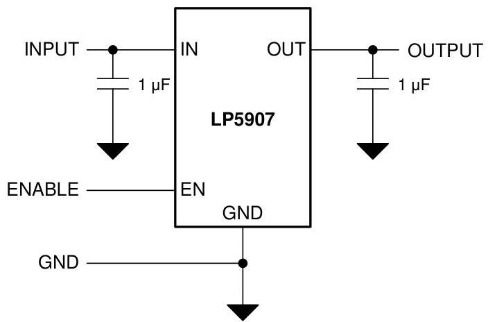
简化版原理图

# 内容

1 特性...1
2 应用...1
3 说明...1
4 引脚配置和功能...3
5 规格...4
5.1 绝对最大额定值...4
5.2 ESD 等级...4
5.3 建议运行条件...4
5.4 热性能信息...5
5.5 电气特性...5
5.6 输出和输入电容器...6
5.7 典型特性...7
6 详细说明...11
6.1 概述...11
6.2 功能方框图...11
6.3 特性说明...11
6.4 器件功能模式...12
7 应用和实施...13
7.1 应用信息...13
7.2 典型应用...13
7.3 电源相关建议...16
7.4 布局...17
8 器件和文档支持...19
8.1 文档支持...19
8.2 接收文档更新通知...19
8.3 支持资源...19
8.4 商标...19
8.5 静电放电警告...19
8.6 术语表...19
9 修订历史记录...20
10 机械、封装和可订购信息...20

# 4 引脚配置和功能

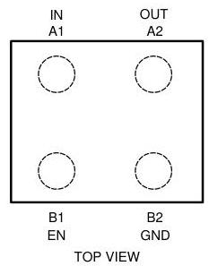
图4-1. YKE、YKG、YKM和YCR封装，4引脚DSBGA

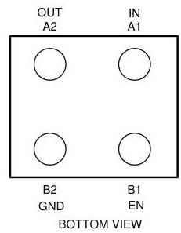

表 4-1. 引脚功能：DSBGA

|  引脚 |   | 类型 | 说明  |
| --- | --- | --- | --- |
|  DSBGA | 名称  |   |   |
|  A1 | IN | I | 输入电压电源。在该输入连接1μF电容器。  |
|  A2 | OUT | O | 经稳压调节的输出电压。将最低为1μF的低ESR电容器连接到该引脚。将该输出连接到负载电路。当稳压器处于关断模式(VEN low)时，内部230Ω（典型值）下拉电阻可防止VOUT上残留电荷。  |
|  B1 | EN | I | 使能输入。该引脚上的低电压(<VIL)将关闭稳压器，并通过内部230Ω下拉电阻将输出引脚放电至GND。该引脚上的高电压(>VIH)会启用稳压器输出。默认情况下，该引脚有一个内部1MΩ下拉电阻来使稳压器保持关闭状态。  |
|  B2 | GND | — | 公共接地  |

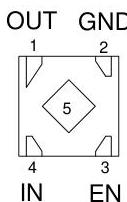
图4-2.DQN封装、4引脚X2SON（底视图）

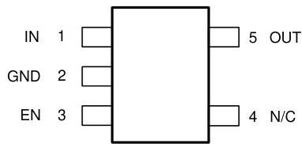
图4-3.DBV封装、5引脚SOT-23（顶视图）

表 4-2. 引脚功能：X2SON、SOT-23

|  引脚 |   |   | 类型 | 说明  |
| --- | --- | --- | --- | --- |
|  名称 | X2SON | SOT-23  |   |   |
|  EN | 3 | 3 | I | 使能输入。该引脚上的低电压(<VIL)将关闭稳压器，并通过内部230Ω下拉电阻将输出引脚放电至GND。该引脚上的高电压(>VIH)会启用稳压器输出。默认情况下，该引脚有一个内部1MΩ下拉电阻来使稳压器保持关闭状态。  |
|  GND | 2 | 2 | — | 共地。  |
|  IN | 4 | 1 | I | 输入电压电源。在该输入连接1μF电容器。  |
|  N/C | — | 4 | — | 无内部电气连接。  |
|  OUT | 1 | 5 | O | 经稳压调节的输出电压。将最低为1μF的低ESR电容器连接到该引脚。将该输出连接到负载电路。当稳压器处于关断模式(VEN low)时，内部230Ω（典型值）下拉电阻可防止VOUT上残留电荷。  |
|  散热焊盘 | 5 | — | — | X2SON封装的散热焊盘需连接至GND或保持悬空。请勿连接到GND以外的任何电位。  |

LP5907

ZHCSD40Q - APRIL 2012 - REVISED JULY 2025

TEXAS
INSTRUMENTS
www.ti.com.cn

# 5 规格

## 5.1 绝对最大额定值

在自然通风条件下的工作温度范围内测得（除非另有说明）(1) (3)

|   |   | 最小值 | 最大值 | 单位  |
| --- | --- | --- | --- | --- |
|  VIN | 输入电压 | -0.3 | 6 | V  |
|  VOUT | 输出电压 | -0.3 | 请参阅(2) | V  |
|  VEN | 使能输入电压 | -0.3 | 6 | V  |
|   | 连续功耗(4) | 受内部限制 |   | W  |
|  TJMAX | 结温 | 150 |   | °C  |
|  Tstg | 贮存温度 | -65 | 150 | °C  |

(1) 应力超出绝对最大额定值下面列出的值时可能会对器件造成永久损坏。这些列出的值仅仅是应力额定值，这并不表示器件在这些条件下以及在建议工作条件以外的任何其他条件下能够正常运行。长时间处于绝对最大额定条件下可能会影响器件的可靠性。
(2) $V_{\text{OUT}}$ 绝对最大值为 $V_{\text{IN}} + 0.3V$ 或 $6V$ 中的较小值。
(3) 所有电压均以 GND 引脚为基准。
(4) 内部热关断电路保护器件不受永久损坏。

## 5.2 ESD 等级

|   |   |   | 值 | 单位  |
| --- | --- | --- | --- | --- |
|  V(ESD) | 静电放电 | 人体放电模型 (HBM)，符合 ANSI/ESDA/JEDEC JS-001 标准(1) | ±2000 | V  |
|   |   |  充电器件模型 (CDM)，符合 JEDEC 规范 JESD22-C101(2) | ±1000  |   |

(1) JEDEC 文档 JEP155 指出：500V HBM 时能够在标准 ESD 控制流程下安全生产。
(2) JEDEC 文档 JEP157 指出：250V CDM 时能够在标准 ESD 控制流程下安全生产。

## 5.3 建议运行条件

在自然通风条件下的工作温度范围内测得（除非另有说明）(1) (2)

|   |   | 最小值 | 最大值 | 单位  |
| --- | --- | --- | --- | --- |
|  VIN | 输入电源电压 | 2.2 | 5.5 | V  |
|  VEN | 使能输入电压 | 0 | 5.5 | V  |
|  IOUT | 输出电流 | 0 | 250 | mA  |
|  TJ | 结温 | -40 | 125 | °C  |
|  TA | 环境温度(3) | -40 | 85 | °C  |

(1) 应力超出绝对最大额定值下面列出的值时可能会对器件造成永久损坏。这些列出的值仅仅是应力额定值，并不表示器件在这些条件下以及在建议运行条件以外的任何其他条件下能够正常运行。长时间处于绝对最大额定条件下可能会影响器件的可靠性。
(2) 所有电压均以 GND 引脚为基准。
(3) 在功率耗散较高和封装热阻较差的应用中，可能需要降低最高额定环境温度。如下列公式所示，最高环境温度 $(T_{\mathrm{A - MAX}})$ 取决于应用中的最高工作结温 $(T_{\mathrm{J - MAX - OP}} = 125^{\circ}\mathrm{C})$。器件封装中允许的最大功率耗散 $(P_{\mathrm{D - MAX}})$，以及器件或封装的结至环境热阻 $(R_{\text{+JA}}): T_{\mathrm{A - MAX}} = T_{\mathrm{J - MAX - OP}} - (R_{\text{+JA}} \times P_{\mathrm{D - MAX}})$。请参阅应用和实施部分。

4  提交文档反馈

Copyright © 2025 Texas Instruments Incorporated

Product Folder Links: LP5907

English Data Sheet: SNVS798# 5.4 热性能信息

|  热指标(1) | LP5907 |   |   |   |   |   | 单位  |   |
| --- | --- | --- | --- | --- | --- | --- | --- | --- |
|   |   |  DBV (SOT-23) | DQN (X2SON) | YCR (DSBGA) | YKE (DSBGA) | YKG (DSBGA) |   | YKM (DSBGA)  |
|   |   |  5 引脚 | 4 引脚 | 4 引脚 | 4 引脚 | 4 引脚 |   | 4 引脚  |
|  R_{μJA} | 结至环境热阻 | 193.4 | 216.1 | 189.4 | 206.1 | 191.6 | 194.1 | °C/W  |
|  R_{μJC(top)} | 结至外壳 (顶部) 热阻 | 102.1 | 161.7 | 2.4 | 1.5 | 2.4 | 3.0 | °C/W  |
|  R_{μJB} | 结至电路板热阻 | 45.8 | 162.1 | 56.6 | 37.0 | 58.9 | 62.7 | °C/W  |
|  Φ_{JT} | 结至顶部特征参数 | 8.4 | 5.1 | 1.1 | 15.0 | 1.1 | 1.1 | °C/W  |
|  Φ_{JB} | 结至电路板特征参数 | 45.3 | 161.7 | 56.5 | 36.8 | 58.9 | 62.7 | °C/W  |
|  R_{μJC(bot)} | 结至外壳 (底部) 热阻 | 不适用 | 123.0 | 不适用 | 不适用 | 不适用 | 不适用 | °C/W  |

(1) 有关新旧热指标的更多信息，请参阅半导体和IC封装热指标应用手册。

# 5.5 电气特性

$$V_{\mathrm{IN}} = V_{\mathrm{OUT(NOM)}} + 1\mathrm{V}, V_{\mathrm{EN}} = 1.2\mathrm{V}, I_{\mathrm{OUT}} = 1\mathrm{mA}, C_{\mathrm{IN}} = 1\mu \mathrm{F}$$ 和 $C_{\mathrm{OUT}} = 1\mu \mathrm{F}$ (除非另有说明) (1) (2) (3)

|  参数 |   | 测试条件 |   | 最小值 | 典型值 | 最大值 | 单位  |
| --- | --- | --- | --- | --- | --- | --- | --- |
|  V_{IN} | 输入电压 | T_{A} = 25°C |   | 2.2 |   | 5.5 | V  |
|  ΔV_{OUT} | 输出电压容差 | V_{IN} = (V_{OUT(NOM)} + 1V) 至 5.5V, I_{OUT} = 1mA 至 250mA |   | -2 |   | 2 | %V_{OUT}  |
|   |   |  V_{IN} = (V_{OUT(NOM)} + 1V) 至 5.5V, I_{OUT} = 1mA 至 250mA (V_{OUT} < 1.8V, SOT-23、X2SON 封装) |   | -3 |   | 3  |   |
|   |  线路调整 | V_{IN} = (V_{OUT(NOM)} + 1V) 至 5.5V, I_{OUT} = 1mA |   | 0.02 |   |   | %/V  |
|   |  负载调整率 | I_{OUT} = 1mA 至 250mA |   | 0.001 |   |   | %/mA  |
|  I_{LOAD} | 负载电流 | 请参阅(4) |   | 0 |   | 250 | mA  |
|   |  最大输出电流 |  |   | 250 |   |   | mA  |
|  I_{Q} | 静态电流(5) | V_{EN} = 1.2V, I_{OUT} = 0mA |   | 12 |   | 25 | μA  |
|   |   |  V_{EN} = 1.2V, I_{OUT} = 250mA |   | 250 |   | 425  |   |
|   |   |  V_{EN} = 0.3V (禁用) |   | 0.2 |   | 1  |   |
|  I_{G} | 接地电流(6) | V_{EN} = 1.2V, I_{OUT} = 0mA |   | 14 |   |   | μA  |
|  V_{DO} | 压降电压(7) | I_{OUT} = 100mA |   | 50 |   |   | mV  |
|   |   |  I_{OUT} = 250mA (DSBGA 封装) |   | 120 |   | 200  |   |
|   |   |  I_{OUT} = 250mA (SOT-23、X2SON 封装) |   | 250  |   |   |   |
|  I_{SC} | 短路电流限制 | T_{A} = 25°C(8) |   | 250 | 500 |   | mA  |
|  PSRR | 电源抑制比(9) | f = 100Hz, I_{OUT} = 20mA |   | 90 |   |   | dB  |
|   |   |  f = 1kHz, I_{OUT} = 20mA |   | 82  |   |   |   |
|   |   |  f = 10kHz, I_{OUT} = 20mA |   | 65  |   |   |   |
|   |   |  f = 100kHz, I_{OUT} = 20mA |   | 60  |   |   |   |
|  e_{N} | 输出噪声电压(9) | BW = 10Hz 至 100kHz | I_{OUT} = 1mA | 10 |   |   | μV_{RMS}  |
|   |   |   |  I_{OUT} = 250mA | 6.5  |   |   |   |
|  R_{AD} | 输出自动放电下拉电阻 | V_{EN} < V_{IL} (禁用输出) |   | 230 |   |   | Ω  |
|  T_{SD} | 热关断 | T_{J} 上升 |   | 160 |   |   | °C  |
|   |  热迟滞 | T_{J} 从关断状态下降 |   | 15  |   |   |   |
|  逻辑输入阈值  |   |   |   |   |   |   |   |

LP5907

ZHCSD40Q - APRIL 2012 - REVISED JULY 2025

TEXAS
INSTRUMENTS
www.ti.com.cn

# 5.5 电气特性（续）

$\mathrm{V_{IN} = V_{OUT(NOM)} + 1V}$ 、 $\mathrm{V_{EN} = 1.2V}$ 、 $\mathrm{I_{OUT} = 1mA}$ 、 $\mathrm{C_{IN} = 1\mu F}$ 和 $\mathrm{C_{OUT} = 1\mu F}$ （除非另有说明）(1) (2) (3)

|  参数 |   | 测试条件 | 最小值 | 典型值 | 最大值 | 单位  |
| --- | --- | --- | --- | --- | --- | --- |
|  V_{IL} | 低电平输入阈值 | V_{IN} = 2.2V 至 5.5V，
V_{EN} 下降，直到输出禁用 | 0.4 |   |   | V  |
|  V_{IH} | 高电平输入阈值 | V_{IN} = 2.2V 至 5.5V，
V_{EN} 上升，直到输出启用 | 1.2 |   |   | V  |
|  I_{EN} | EN 引脚上的输入电流(10) | V_{EN} = 5.5V 和 V_{IN} = 5.5V | 5.5 |   |   | μA  |
|   |   |  V_{EN} = 0V 和 V_{IN} = 5.5V | 0.001  |   |   |   |
|  瞬态特性  |   |   |   |   |   |   |
|  ΔV_{OUT} | 线路瞬态(9) | 30μs 内的 V_{IN} = (V_{OUT(NOM)} + 1V) 至 (V_{OUT(NOM)} + 1.6V) | -1 |   |   | mV  |
|   |   |  30μs 内的 V_{IN} = (V_{OUT(NOM)} + 1.6V) 至 (V_{OUT(NOM)} + 1.6V) | 1  |   |   |   |
|   |  负载瞬态(9) | 10μs 内的 I_{OUT} = 1mA 至 250mA | -40  |   |   |   |
|   |   |  10μs 内的 I_{OUT} = 250mA 至 1mA | 40  |   |   |   |
|   |  启动时的过冲(9) | 以 V_{OUT(NOM)} 的百分比表示 | 5% |   |   |   |
|   |  EN 启动时的过冲(9) | 以 V_{OUT(NOM)} 的百分比表示，V_{IN} = V_{OUT} + 1V 至 5.5V、0.7μF < C_{OUT} < 10μF、0mA < I_{OUT} < 250mA、EN 上升直到输出启动 | 1%  |   |   |   |
|  t_{ON} | 导通时间 | 从 V_{EN} > V_{IH} 至 V_{OUT} = 95% V_{OUT(NOM)}，
T_{A} = 25°C | 80 | 150 |   | μs  |

(1) 除非另有说明，否则所有电压均以器件 GND 端子为基准。
(2) 除非另有说明，否则最小值和最大限值是在 $-40^{\circ}\mathrm{C}$ 至 $125^{\circ}\mathrm{C}$ 的结温 $(\mathrm{T_J})$ 范围内经过测试、设计或统计相关性而确定。典型值表示 $\mathrm{T_A} = 25^{\circ}\mathrm{C}$ 条件下最有可能达到的参数标准，仅供参考。
(3) 在功率耗散较大或封装热阻较差的应用中，可能必须降低最高额定环境温度。如下列公式所示，最高环境温度 $(\mathrm{T_{A - MAX}})$ 取决于应用中的最高工作结温 $(\mathrm{T_{J - MAX - OP}} = 125^{\circ}\mathrm{C})$。器件允许的最大功率耗散 $(\mathrm{P_{D - MAX}})$，以及器件或封装的结至环境热阻 $(\mathrm{R_{0JA}}): \mathrm{T_{A - MAX}} = \mathrm{T_{J - MAX - OP}} - (\mathrm{R_{0JA}} \times \mathrm{P_{D - MAX}})$。请参阅应用和实施综分。
(4) 在没有负载电流的情况下，该器件可保持稳定、经稳压调节的输出电压。
(5) 静态电流在此定义为输入电压源与 $V_{\text{OUT}}$ 负载之间的电流差。
(6) 接地电流在此定义为因施加到器件的所有输入电压而流向接地的总电流。
(7) 压降电压是指当输出电压降至标称值以下 $100\mathrm{mV}$ 时输入和输出之间的电压差。
(8) LP5907 的短路电流 $(\mathrm{I_{SC}})$ 相当于电流限制。为较大限度地减少测试过程中的热效应，$\mathrm{I_{SC}}$ 可在 $\mathrm{V_{OUT}}$ 拉低至标称值以下 $100\mathrm{mV}$ 时测量。
(9) 此规格已通过设计验证。
(10) 器件在 EN 和接地之间有 $1\mathrm{M}\Omega$ 电阻。

# 5.6 输出和输入电容器

在自然通风条件下的工作温度范围内测得（除非另有说明）

|  参数 |   | 测试条件 | 最小值(1) | 典型值 | 最大值 | 单位  |
| --- | --- | --- | --- | --- | --- | --- |
|  C_{IN} | 输入电容(2) | 稳定电容 | 0.7 | 1 |  | μF  |
|  C_{OUT} | 输出电容(2) |   | 0.7 | 1 | 10 | μF  |
|  ESR | 输出/输入电容(2) |  | 5 | 500 |  | mΩ  |

(1) 在整个工作条件范围内，最小电容必须大于 $0.7\mu \mathrm{F}$。在整个温度范围内，电容器的容差必须为 $30\%$ 或更大。选择器件时必须考虑应用中电容器的整个工作条件范围，以确保满足该最小电容规格。建议使用 X7R 电容器，但在考虑应用和条件的情况下可使用 X5R、Y5V 和 Z5U 等电容器类型。
(2) 此规格已通过设计验证。

6

提交文档反馈

Copyright © 2025 Texas Instruments Incorporated

Product Folder Links: LP5907

English Data Sheet: SNVS798# 5.7 典型特性

$V_{\mathrm{IN}} = 3.7 \mathrm{~V}$ 、 $V_{\mathrm{OUT}} = 2.8 \mathrm{~V}$ 、 $I_{\mathrm{OUT}} = 1 \mathrm{~mA}$ 、 $C_{\mathrm{IN}} = 1 \mu \mathrm{F}$ 、 $C_{\mathrm{OUT}} = 1 \mu \mathrm{F}$ 且 $T_{\mathrm{A}} = 25^{\circ} \mathrm{C}$ （除非另有说明）

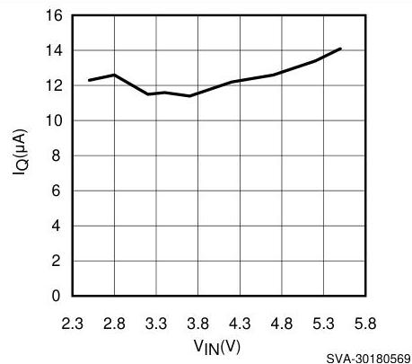
图5-1.静态电流与输入电压间的关系

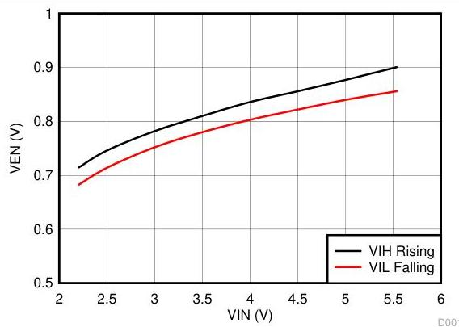
图5-2.  $V_{\text{EN}}$  阈值与  $V_{\text{IN}}$  间的关系

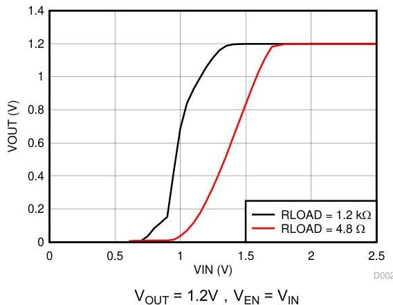
图5-3.  $V_{\text{OUT}}$  与  $V_{\text{IN}}$  间的关系

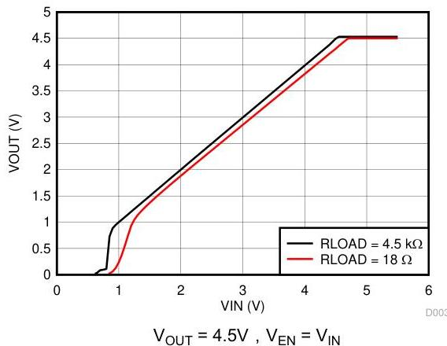
图5-4.  $V_{\text{OUT}}$  与  $V_{\text{IN}}$  间的关系

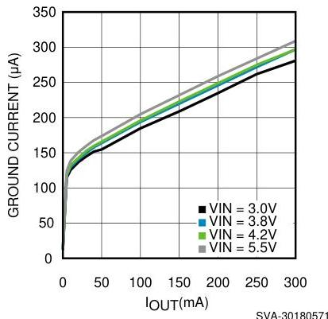
图5-5.接地电流与输出电流间的关系

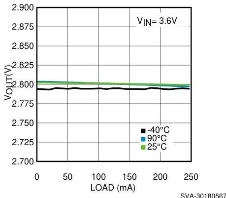
图5-6.负载调整率

# 5.7 典型特性（续）

$V_{\mathrm{IN}} = 3.7 \mathrm{~V}$ 、 $V_{\mathrm{OUT}} = 2.8 \mathrm{~V}$ 、 $I_{\mathrm{OUT}} = 1 \mathrm{~mA}$ 、 $C_{\mathrm{IN}} = 1 \mu \mathrm{F}$ 、 $C_{\mathrm{OUT}} = 1 \mu \mathrm{F}$ 且 $T_{\mathrm{A}} = 25^{\circ} \mathrm{C}$ （除非另有说明）

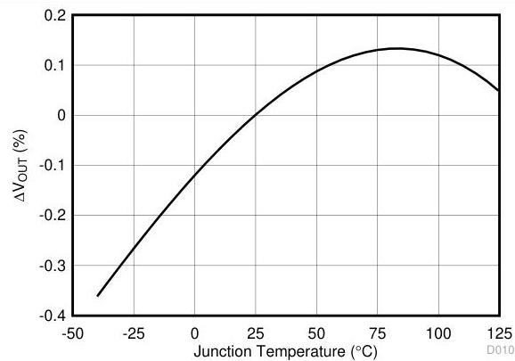
图5-7. $\Delta V_{\mathrm{OUT}}$ 与温度间的关系

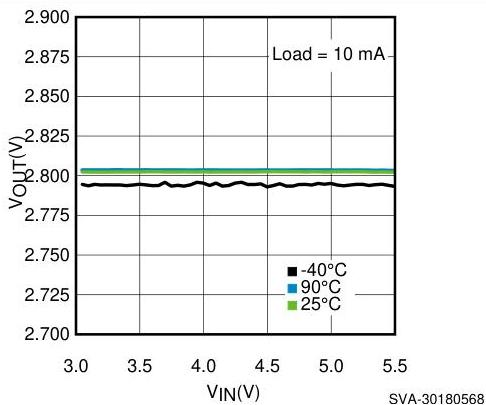
图5-8. 线路调整

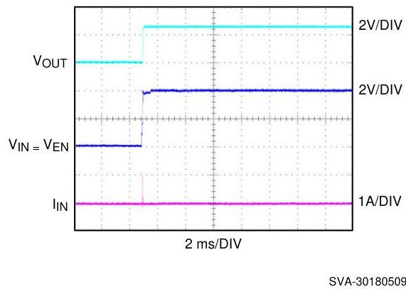
图5-9. 浪涌电流

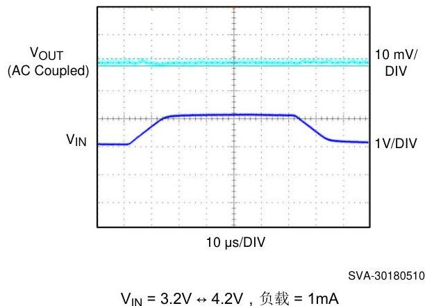
图5-10. 线路瞬态

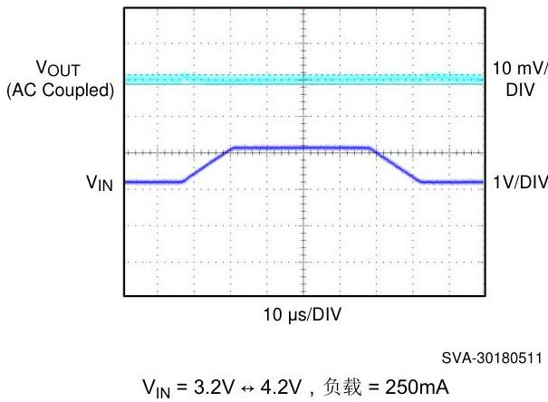
图5-11. 线路瞬态

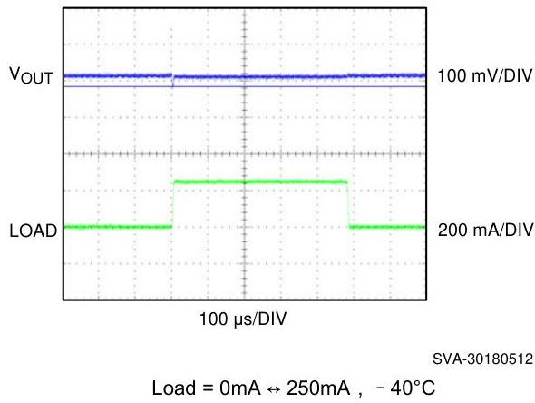
图5-12. 负载瞬态

# 5.7 典型特性（续）

$V_{\mathrm{IN}} = 3.7\mathrm{V}$ 、 $V_{\mathrm{OUT}} = 2.8\mathrm{V}$ 、 $I_{\mathrm{OUT}} = 1\mathrm{mA}$ 、 $C_{\mathrm{IN}} = 1\mu \mathrm{F}$ 、 $C_{\mathrm{OUT}} = 1\mu \mathrm{F}$ 且  $\mathsf{T}_{\mathsf{A}} = 25^{\circ}\mathsf{C}$ （除非另有说明）

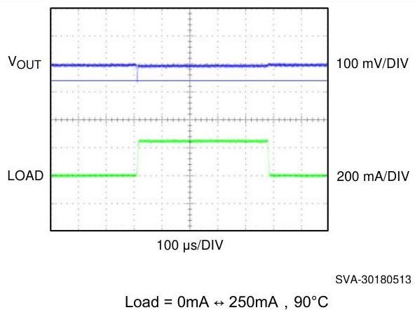
图5-13. 负载瞬态

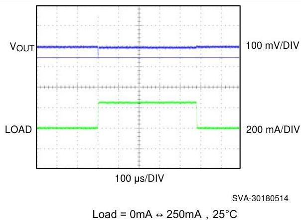
图5-14. 负载瞬态

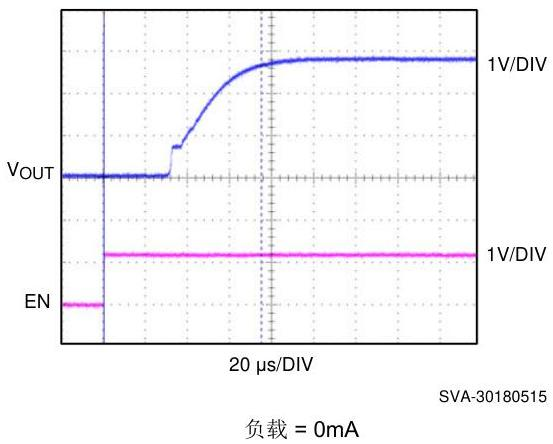
图5-15. 启动

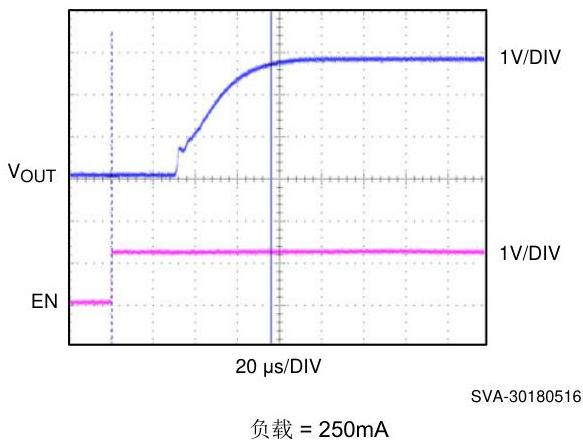
图5-16. 启动

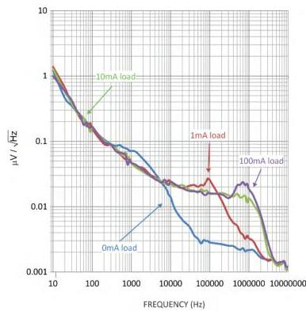
图5-17. 噪声密度测试

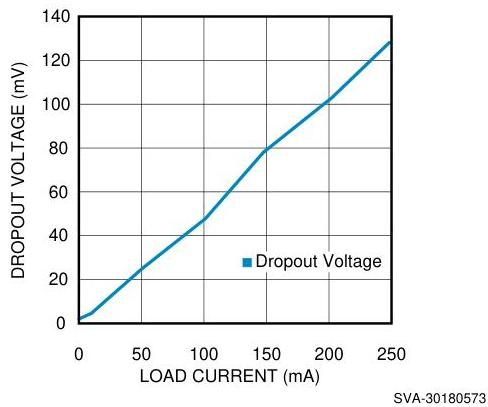
图5-18. 压降电压与负载电流间的关系

# 5.7 典型特性（续）

$V_{\mathrm{IN}} = 3.7 \mathrm{~V}$、$V_{\mathrm{OUT}} = 2.8 \mathrm{~V}$、$I_{\mathrm{OUT}} = 1 \mathrm{~mA}$、$C_{\mathrm{IN}} = 1 \mu \mathrm{F}$、$C_{\mathrm{OUT}} = 1 \mu \mathrm{F}$ 且 $T_{\mathrm{A}} = 25^{\circ} \mathrm{C}$（除非另有说明）

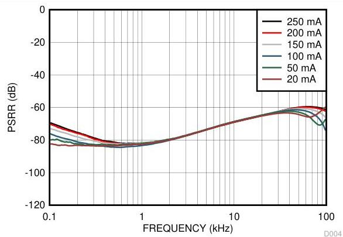
图 5-19. PSRR 负载平均值为 $100 \mathrm{~Hz}$ 至 $100 \mathrm{kHz}$

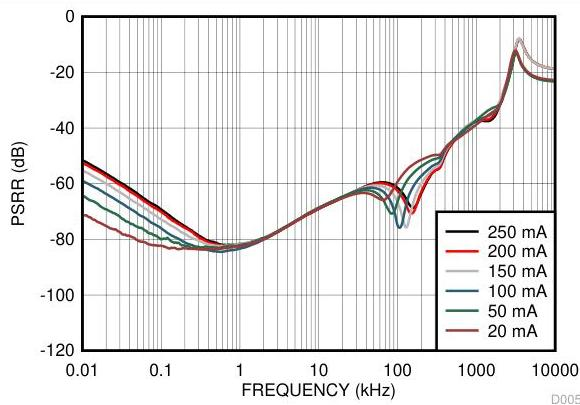
图 5-20. PSRR 负载平均值为 $10 \mathrm{~Hz}$ 至 $10 \mathrm{MHz}$

# 6 详细说明

## 6.1 概述

LP5907 符合敏感射频和模拟电路要求，可提供低噪声、高 PSRR、低静态电流以及低线路和负载瞬态响应系数。LP5907 采用创新的设计技术，无需单独的噪声滤波电容器便可提供业界领先的噪声性能。

LP5907 设计为使用单个 1μF 输入电容器和单个 1μF 陶瓷输出电容器正常运行。在合理的 PCB 布局下，可将单个 1μF 陶瓷输出电容器布置在距离 LP5907 器件最远 10cm 的位置。

## 6.2 功能方框图

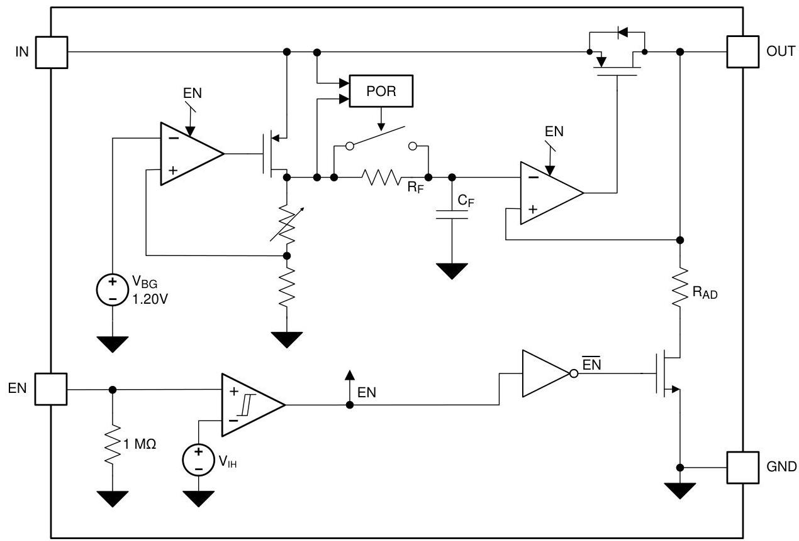

## 6.3 特性说明

### 6.3.1 使能 (EN)

LP5907 EN 引脚通过连接至 GND 的 1MΩ 电阻在内部保持低电平状态。EN 引脚电压必须高于 $V_{\mathrm{IH}}$ 阈值，以确保器件在所有工作条件下完全启用。EN 引脚电压必须低于 $V_{\mathrm{IL}}$ 阈值，以确保器件完全禁用并自动输出放电激活。

### 6.3.2 低输出噪声

LP5907 基准电压的内部噪声在传递到输出缓冲级之前由一阶低通 RC 滤波器降低。低通 RC 滤波器的 -3dB 截止频率约为 0.1Hz。

### 6.3.3 输出自动放电

当 EN 引脚为低电平且器件被禁用时，LP5907 输出采用内部 230Ω（典型值）下拉电阻来使输出放电。

### 6.3.4 远程输出电容器布置

LP5907 在 OUT 引脚上需要至少一个 1μF 电容器，但对该电容器相对于 OUT 引脚的位置没有严格要求。在实际设计中，可以将输出电容器布置在距离 LDO 最远 10cm 的位置。

## 6.3.5 热过载保护 (TSD)

当结温上升至大约 160°C 时，热关断会禁用输出以使器件冷却。当结温被冷却至大约 145°C 时，输出电路又会被启用。根据功率耗散、热阻和环境温度的变化，过热保护电路可能会循环开启和关断。这一热循环操作会限制稳压器的功耗，且防止稳压器因过热而损坏。

LP5907 的热关断电路经过设计，可防止出现短暂热过载情况。该 TSD 电路并不是用于取代适当的散热装置。LP5907 持续不断地运行至热关断状态会降低器件的可靠性。

## 6.4 器件功能模式

### 6.4.1 使能 (EN)

LP5907 使能 (EN) 引脚通过连接至 GND 的 1MΩ 电阻在内部保持低电平状态。EN 引脚电压必须高于 $V_{\mathrm{IH}}$ 阈值，以确保器件在所有工作条件下完全启用。

当 EN 引脚被拉至低电平且输出被禁用时，输出自动放电电路将被激活。OUT 引脚上的任何电荷都会通过内部 230Ω（典型值）下拉电阻放电至 GND。

### 6.4.2 最低工作输入电压 (VIN)

LP5907 不包含任何专用的 UVLO 电路。在 $V_{\mathrm{IN}}$ 至少达到 2.2V 之前，LP5907 内部电路无法完全正常工作。在 $V_{\mathrm{IN}}$ 至少达到 2.2V 或 $(V_{\mathrm{OUT}} + V_{\mathrm{DO}})$ 中的较大值之前，输出电压无法得到调节。

# 7 应用和实施

## 备注

以下应用部分中的信息不属于 TI 器件规格的范围，TI 不担保其准确性和完整性。TI 的客户应负责确定器件是否适用于其应用。客户应验证并测试其设计，以确保系统功能。

## 7.1 应用信息

LP5907 专为符合射频和模拟电路要求而设计，可提供低噪声、高 PSRR、低静态电流以及低线路和负载瞬态响应。该器件无需噪声旁路电容器便可提供出色的噪声性能，并且与值为 $1\mu \mathrm{F}$ 的输入和输出电容器一起工作时可保持稳定。LP5907 采用 DSBGA、X2SON 和 SOT-23 等业界标准封装提供此性能，该器件的额定工作结温 $(T_{\mathrm{J}})$ 为 $-40^{\circ}\mathrm{C}$ 至 $125^{\circ}\mathrm{C}$。

## 7.2 典型应用

图 7-1 展示了 LP5907 的典型应用电路。对于某些应用，可根据需要将输入和输出电容增加到高于 $1\mu \mathrm{F}$ 的最小值。

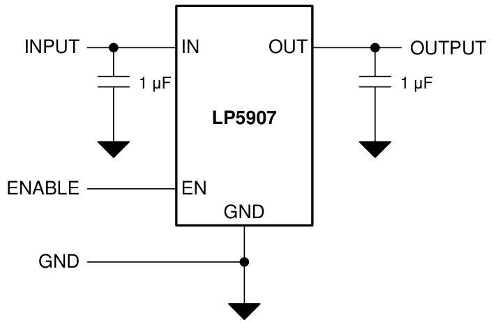
图 7-1. LP5907 典型应用

### 7.2.1 设计要求

表 7-1 总结了图 7-1 的设计要求。

表 7-1. 设计参数

|  设计参数 | 示例值  |
| --- | --- |
|  输入电压范围 | 2.2V 至 5.5V  |
|  输出电压 | 1.8V  |
|  输出电流 | 200mA  |
|  输出电容器范围 | 0.7μF 至 10μF  |
|  输入/输出电容器 ESR 范围 | 5mΩ 至 500mΩ  |

## 7.2.2 详细设计过程

### 7.2.2.1 使用 WEBENCH® 工具创建定制设计方案

点击此处，使用 LP5907 器件并借助 WEBENCH® Power Designer 创建定制设计方案。

1. 首先键入输入电压 (V_IN)、输出电压 (V_OUT) 和输出电流 (I_OUT) 要求。
2. 使用优化器表盘，优化该设计的关键参数，如效率、占用空间和成本。
3. 将生成的设计与德州仪器 (TI) 其他可行的解决方案进行比较。

WEBENCH Power Designer 提供了定制原理图，并罗列了实时价格和元件供货情况的物料清单。

在多数情况下，可执行以下操作：

- 运行电气仿真，观察重要波形以及电路性能
- 运行热性能仿真，了解电路板热性能
- 将定制原理图和布局方案以常用 CAD 格式导出
- 打印 PDF 格式的设计报告并与同事共享

有关 WEBENCH 工具的更多信息，请访问 www.ti.com/WEBENCH。

### 7.2.2.2 功率损耗和器件运行

任何封装的允许功率耗散可衡量器件将热量从电源（器件的接合点）传递到周围环境的最终散热器的能力。因此，功率耗散取决于环境温度以及芯片结与环境空气之间各种接口上的热阻。

给定封装内器件的最大允许功率耗散可使用方程式 1 计算：

$$
P_{D-MAX} = \left( \frac{T_{J-MAX} - T_A}{R_{\text{日} JA} } \right) \tag{1}
$$

器件中耗散的实际功率可通过方程式 2 表示：

$$
P_D = \left( V_{IN} - V_{OUT} \right) \times I_{OUT} \tag{2}
$$

这两个公式建立了与散热考虑有关的最大功率耗散、器件上的压降和器件的持续电流能力之间的关系。使用这两个公式确定器件在应用中的理想工作条件。

在功率耗散 (P_D) 较小或封装热阻 (R_日 JA) 较好的应用中，可提高最高额定环境温度 (T_A-MAX)。

在功率耗散较大或封装热阻较差的应用中，可降低最高额定环境温度 (T_A-MAX)。如方程式 3 所示，T_A-MAX 取决于应用中的最高工作结温 (T_J-MAX-OP = 125°C)、器件封装中允许的最大功率耗散 (P_D-MAX) 以及器件或封装的结至环境热阻 (R_日 JA)：

$$
T_{A-MAX} = \left( T_{J-MAX-OP} - \left( R_{\text{日} JA} \times P_{D-MAX} \right) \right) \tag{3}
$$

或者，如果 T_A-MAX 无法降低，则必须减小 P_D 值。这种降低可通过以下方式来实现：降低 V_IN - V_OUT 项中的 V_IN（只要满足最小 V_IN 条件）、减小 I_OUT 项，或通过这两者的某种组合来实现。

### 7.2.2.3 外部电容器

与大多数低压降稳压器一样，LP5907 需要外部电容器来实现稳压器的稳定性。该器件专为需要超小布板空间和超小元件的便携式应用而设计。必须正确选择这些电容器才能获得良好性能。

### 7.2.2.4 输入电容器

需要输入电容器以实现稳定性。输入电容器必须至少等于或大于输出电容器，以确保良好的负载瞬态性能。在 LP5907 输入引脚和接地之间至少连接一个 1μF 电容器，以确保在整个负载电流范围内稳定运行。基本上，只要输入电容器至少为 1μF，可以接受输出电容比输入电容更大。

输入电容器必须布置在距离输入引脚不超过 1cm 的位置，并接回至纯净模拟接地。可在输入端使用任何优质的陶瓷、钽或薄膜电容器。

# 备注

为确保稳定运行，必须使用良好的PCB实践来尽可能减小接地阻抗，并保持较低的输入电感。如果无法满足这些条件，或使用较长引线将电池或其他电源连接到LP5907，则需将输入电容器至少增大至 $10\mu \mathrm{F}$ 。此外，当连接到低阻抗电源（例如电池或非常大的电容器）时，钽电容器可能会因浪涌电流而遭受灾难性故障。如果在输入端使用钽电容器，需由制造商验证该电容器的浪涌电流额定值是否足以满足应用需求。在选择输入电容器时须全面考虑初始容差、施加的电压降额及温度系数，以确保在整个工作范围内的实际电容始终不会小于 $0.7\mu \mathrm{F}$ 。

# 7.2.2.5 输出电容器

LP5907 专为与一个非常小的陶瓷输出电容器（典型值为 $1\mu \mathrm{F}$ ）配合使用而设计。在 LP5907 应用电路中，适合选用范围为 $1\mu \mathrm{F}$ 至 $10\mu \mathrm{F}$ 、ESR 介于 $5\mathrm{m}\Omega$ 至 $500\mathrm{m}\Omega$ 之间的陶瓷电容器（介质类型为 X5R 或 X7R）。该器件在 OUT 引脚之间通过良好的连接将输出电容器布置回 GND 引脚。

钽电容器或薄膜电容器也可用于器件输出 $V_{\text{OUT}}$ ，但出于尺寸和成本等原因，这些电容器并不值得考虑（请参阅电容器特性部分）。

输出电容器必须满足最小电容值的要求，且 ESR 值在 $5\mathrm{m}\Omega$ 至 $500\mathrm{m}\Omega$ 的范围内，以实现稳定性。与输入电容器一样，在选择输入电容器时须全面考虑初始容差、施加的电压降额及温度系数，以确保在整个工作范围内的实际电容始终不会小于 $0.7\mu \mathrm{F}$ 。

# 7.2.2.6 电容器特性

LP5907 专为与输入和输出的陶瓷电容器配合使用而设计，以利用这些元件提供的优势。对于 $1\mu \mathrm{F}$ 至 $10\mu \mathrm{F}$ 范围内的电容值，陶瓷电容器尺寸较小、成本较低且具有较低的 ESR 值，因此非常适合消除高频噪声。典型 $1\mu \mathrm{F}$ 陶瓷电容器的 ESR 的范围为 $20\mathrm{m}\Omega$ 至 $40\mathrm{m}\Omega$ ，这很容易满足 LP5907 的 ESR 稳定性要求。

陶瓷电容器中温度系数的更好选择是X7R。此类电容器较为稳定，可在整个温度范围内将电容保持在 $\pm 15\%$ 以内。钽电容器不如陶瓷电容器适合用作输出电容器，因为在比较 $1\mu \mathrm{F}$ 至 $10\mu \mathrm{F}$ 范围内的相同电容和电压额定值时，钽电容器的成本更高。

另一个重要的考虑因素是，与相同尺寸的陶瓷电容器相比，钽电容器具有更高的ESR值。这意味着，尽管可能会找到ESR值位于稳定范围内的钽电容器，但该电容器必须大于具有相同ESR值的陶瓷电容器（这意味着尺寸更大且成本更高）。当温度从 $25^{\circ}\mathrm{C}$ 降至 $-40^{\circ}\mathrm{C}$ 时，典型钽电容器的ESR值会增加至约原来的2倍，因此必须预留一些防护带。

## 7.2.2.7 远程电容器运行

LP5907 在 OUT 引脚上至少需要一个 1μF 电容器，但对该电容器相对于引脚的位置没有严格要求。在实际设计中，可将输出电容器布置在距离 LDO 最远 10cm 的位置。这意味着，如果系统中已存在相应的电容器（例如所提供器件输入端的电容器），则无需在输出引脚附近布置特殊电容器。远程电容器特性有助于更大限度地减少系统中的电容器数量。

一般而言，应尽量减少接线寄生电感，这意味着从 LDO 输出到电容器应使用尽可能宽的布线，从而使 LDO 输出布线层尽可能靠近接地层，并避免在路径上使用过孔。如果必须使用过孔，则需在连接层之间使用尽可能多的过孔。将寄生接线电感保持在 35nH 以下。对于具有快速负载瞬态的应用，需使用等于或大于输出节点处电容之和的输入电容器，以获得出色的负载瞬态性能。

## 7.2.2.8 空载稳定性

LP5907 在没有外部负载的情况下可保持稳定，并维持稳压状态。

## 7.2.2.9 使能控制

LP5907 可通过 EN 引脚上的逻辑输入进行开关。该引脚上的电压大于 $V_{\mathrm{IH}}$ 时会启动器件，而电压低于 $V_{\mathrm{IL}}$ 时会关闭器件。

当 EN 引脚为低电平时，稳压器输出关闭，且器件的耗电流通常低于 1μA。此外，输出下拉电路会被激活，确保 $C_{\text{OUT}}$ 上存储的任何电荷放电至接地。

如果应用不需要关断功能，可将 EN 引脚直接连接至 IN 引脚，使稳压器输出保持永久开启状态。

内部 1MΩ 下拉电阻器将 EN 输入接地，确保在 EN 引脚保持开路时，器件保持关闭状态。为确保正常工作，用于驱动 EN 引脚的信号源必须能够摆动至高于和低于电气特性中 $V_{\mathrm{IL}}$ 和 $V_{\mathrm{IH}}$ 下列出的指定导通或关断电压阈值。

## 7.2.3 应用曲线

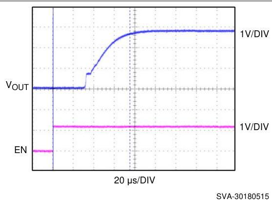
图 7-2. 启动

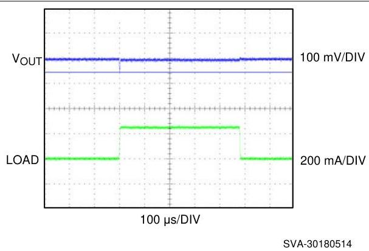
图 7-3. 负载瞬态响应

## 7.3 电源相关建议

该器件设计为可在 2.2V 至 5.5V 的输入电源电压范围内运行。输入电源必须经过良好调节且没有寄生噪声。为确保 LP5907 输出电压得到良好调节且动态性能处于理想状态，输入电源必须至少为 $V_{\text{OUT}} + 1V$。最低电容值 1μF 必须在 IN 引脚的 1cm 范围内。

## 7.4 布局

### 7.4.1 布局指南

LP5907 的动态性能取决于 PCB 的布局。满足典型 LDO 需求的 PCB 布局实践会降低 LP5907 的 PSRR、噪声或瞬态性能。

通过将 $\mathrm{C_{IN}}$ 和 $\mathrm{C_{OUT}}$ 放置在与 LP5907 PCB 的同一侧并尽可能靠近封装，可实现出色性能。必须使用宽而短的覆铜布线将 $\mathrm{C_{IN}}$ 和 $\mathrm{C_{OUT}}$ 的接地连接布置回 LP5907 接地引脚。

必须避免使用较长的布线长度、较窄的布线宽度以及通过过孔进行连接。这些连接会增加寄生电感和电阻，导致性能下降，尤其是在瞬态条件下。

### 7.4.1.1 X2SON 封装

X2SON 封装的散热焊盘必须焊接在印刷电路板上，才能实现适当的散热和机械性能。如需更多信息，请参阅 QFN/SON PCB 连接应用手册。

### 7.4.1.2 DSBGA 贴装

DSBGA 封装需要特定的安装技术，详见 AN-1112 DSBGA 晶圆级芯片级封装 应用手册。为了在封装期间实现良好效果，可在 PC 板上使用对齐顺序来方便布置 DSBGA 器件。

### 7.4.1.3 DSBGA 光灵敏度

将 DSBGA 器件暴露在直射光照下可能会导致该器件运行异常。如果卤素灯等光源靠近器件，则这些光源会影响电气性能。光谱中红色及红外波段的光线对性能的不利影响较大；因此，建筑物内使用的大多数荧光灯对器件性能的影响甚微。

### 7.4.2 布局示例

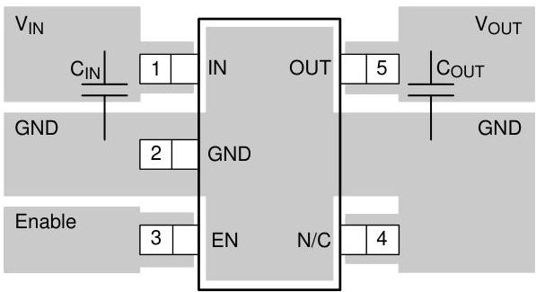
图 7-4. SOT-23 典型布局

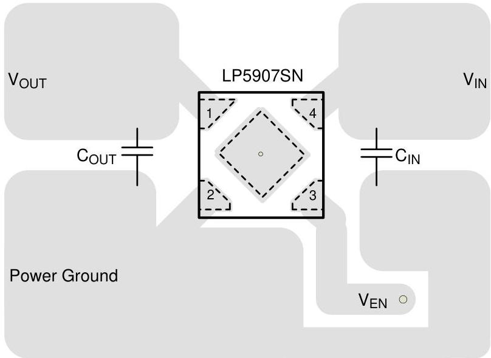
图 7-5. X2SON 典型布局

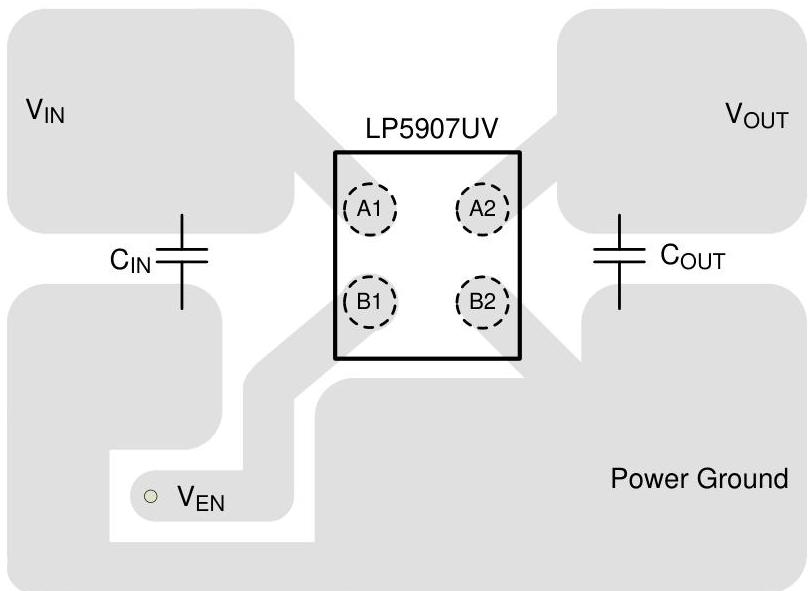
图 7-6. DSBGA 典型布局

# 8 器件和文档支持

## 8.1 文档支持

### 8.1.1 使用 WEBENCH® 工具创建定制设计方案

点击此处，使用 LP5907 器件并借助 WEBENCH® Power Designer 创建定制设计方案。

1. 首先键入输入电压 (VIN)、输出电压 (VOUT) 和输出电流 (IOUT) 要求。
2. 使用优化器表盘，优化该设计的关键参数，如效率、占用空间和成本。
3. 将生成的设计与德州仪器 (TI) 其他可行的解决方案进行比较。

WEBENCH Power Designer 提供了定制原理图，并罗列了实时价格和元件供货情况的物料清单。

在多数情况下，可执行以下操作：

- 运行电气仿真，观察重要波形以及电路性能
- 运行热性能仿真，了解电路板热性能
- 将定制原理图和布局方案以常用 CAD 格式导出
- 打印 PDF 格式的设计报告并与同事共享

有关 WEBENCH 工具的更多信息，请访问 www.ti.com/WEBENCH。

### 8.1.2 相关文档

请参阅以下相关文档：

- 德州仪器 (TI), AN-1112 DSBGA 晶圆级芯片级封装 应用手册
- 德州仪器 (TI), QFN/SON PCB 连接 应用手册

## 8.2 接收文档更新通知

要接收文档更新通知，请导航至 ti.com 上的器件产品文件夹。点击通知 进行注册，即可每周接收产品信息更改摘要。有关更改的详细信息，请查看任何已修订文档中包含的修订历史记录。

## 8.3 支持资源

TI E2E™ 中文支持论坛是工程师的重要参考资料，可直接从专家处获得快速、经过验证的解答和设计帮助。搜索现有解答或提出自己的问题，获得所需的快速设计帮助。

链接的内容由各个贡献者“按原样”提供。这些内容并不构成 TI 技术规范，并且不一定反映 TI 的观点；请参阅 TI 的使用条款。

## 8.4 商标

TI E2E™ is a trademark of Texas Instruments.

WEBENCH® is a registered trademark of Texas Instruments.

所有商标均为其各自所有者的财产。

## 8.5 静电放电警告

静电放电 (ESD) 会损坏这个集成电路。德州仪器 (TI) 建议通过适当的预防措施处理所有集成电路。如果不遵守正确的处理和安装程序，可能会损坏集成电路。

ESD 的损坏小至导致微小的性能降级，大至整个器件故障。精密的集成电路可能更容易受到损坏，这是因为非常细微的参数更改都可能会导致器件与其发布的规格不相符。

## 8.6 术语表

TI 术语表 本术语表列出并解释了术语、首字母缩略词和定义。

# 9 修订历史记录

注：以前版本的页码可能与当前版本的页码不同

## Changes from Revision P (January 2024) to Revision Q (July 2025)

Page

- 将输出和输入电容器表脚注 1 中的 $0.5\mu F$ 更改为 $0.7\mu F$ 6

## Changes from Revision O (June 2020) to Revision P (January 2024)

Page

- 更新了整个文档中的表格、图和交叉参考的编号格式 1
- 向引脚配置和功能部分添加了 YCR 引脚排列说明 3
- 向悬性能信息表中添加了 YCR 列 5

# 10 机械、封装和可订购信息

以下页面包含机械、封装和可订购信息。这些信息是指定器件可用的最新数据。数据如有变更，恕不另行通知，且不会对此文档进行修订。有关此数据表的浏览器版本，请查阅左侧的导航栏。

PACKAGING INFORMATION

| Orderable part number | Status (1) | Material type (2) | Package | Pins | Package qty | Carrier | RoHS (3) | Lead finish/ Ball material (4) | MSL rating/ Peak reflow (5) | Op temp (°C) | Part marking (6) |
| --- | --- | --- | --- | --- | --- | --- | --- | --- | --- | --- | --- |
| LP5907A28YKMR | Active | Production | DSBGA (YKM) | 4 | 3000 | LARGE T&R | Yes | SNAGCU | Level-1-260C-UNLIM | -40 to 125 | Q |
| LP5907A28YKMR.B | Active | Production | DSBGA (YKM) | 4 | 3000 | LARGE T&R | Yes | SNAGCU | Level-1-260C-UNLIM | -40 to 125 | Q |
| LP5907A33YKMR | Active | Production | DSBGA (YKM) | 4 | 3000 | LARGE T&R | Yes | SNAGCU | Level-1-260C-UNLIM | -40 to 125 | N |
| LP5907A33YKMR.B | Active | Production | DSBGA (YKM) | 4 | 3000 | LARGE T&R | Yes | SNAGCU | Level-1-260C-UNLIM | -40 to 125 | N |
| LP5907MFX-1.2/NOPB | Active | Production | SOT-23 (DBV) | 5 | 3000 | LARGE T&R | Yes | NIPDAU | SN | Level-1-260C-UNLIM | -40 to 125 | LLTB |
| LP5907MFX-1.2/NOPB.A | Active | Production | SOT-23 (DBV) | 5 | 3000 | LARGE T&R | Yes | NIPDAU | Level-1-260C-UNLIM | -40 to 125 | LLTB |
| LP5907MFX-1.2/NOPB.B | Active | Production | SOT-23 (DBV) | 5 | 3000 | LARGE T&R | Yes | NIPDAU | Level-1-260C-UNLIM | -40 to 125 | LLTB |
| LP5907MFX-1.5/NOPB | Active | Production | SOT-23 (DBV) | 5 | 3000 | LARGE T&R | Yes | NIPDAU | SN | Level-1-260C-UNLIM | -40 to 125 | LN8B |
| LP5907MFX-1.5/NOPB.A | Active | Production | SOT-23 (DBV) | 5 | 3000 | LARGE T&R | Yes | NIPDAU | Level-1-260C-UNLIM | -40 to 125 | LN8B |
| LP5907MFX-1.5/NOPB.B | Active | Production | SOT-23 (DBV) | 5 | 3000 | LARGE T&R | Yes | NIPDAU | Level-1-260C-UNLIM | -40 to 125 | LN8B |
| LP5907MFX-1.8/NOPB | Active | Production | SOT-23 (DBV) | 5 | 3000 | LARGE T&R | Yes | NIPDAU | SN | Level-1-260C-UNLIM | -40 to 125 | LLUB |
| LP5907MFX-1.8/NOPB.A | Active | Production | SOT-23 (DBV) | 5 | 3000 | LARGE T&R | Yes | NIPDAU | Level-1-260C-UNLIM | -40 to 125 | LLUB |
| LP5907MFX-1.8/NOPB.B | Active | Production | SOT-23 (DBV) | 5 | 3000 | LARGE T&R | Yes | NIPDAU | Level-1-260C-UNLIM | -40 to 125 | LLUB |
| LP5907MFX-2.5/NOPB | Active | Production | SOT-23 (DBV) | 5 | 3000 | LARGE T&R | Yes | NIPDAU | SN | Level-1-260C-UNLIM | -40 to 125 | LN7B |
| LP5907MFX-2.5/NOPB.A | Active | Production | SOT-23 (DBV) | 5 | 3000 | LARGE T&R | Yes | NIPDAU | Level-1-260C-UNLIM | -40 to 125 | LN7B |
| LP5907MFX-2.5/NOPB.B | Active | Production | SOT-23 (DBV) | 5 | 3000 | LARGE T&R | Yes | NIPDAU | Level-1-260C-UNLIM | -40 to 125 | LN7B |
| LP5907MFX-2.8/NOPB | Active | Production | SOT-23 (DBV) | 5 | 3000 | LARGE T&R | Yes | NIPDAU | SN | Level-1-260C-UNLIM | -40 to 125 | LLYB |
| LP5907MFX-2.8/NOPB.A | Active | Production | SOT-23 (DBV) | 5 | 3000 | LARGE T&R | Yes | NIPDAU | Level-1-260C-UNLIM | -40 to 125 | LLYB |
| LP5907MFX-2.8/NOPB.B | Active | Production | SOT-23 (DBV) | 5 | 3000 | LARGE T&R | Yes | NIPDAU | Level-1-260C-UNLIM | -40 to 125 | LN4B |
| LP5907MFX-2.85/NOA | Active | Production | SOT-23 (DBV) | 5 | 3000 | LARGE T&R | Yes | NIPDAU | SN | Level-1-260C-UNLIM | -40 to 125 | LN4B |
| LP5907MFX-2.85/NOPB | Active | Production | SOT-23 (DBV) | 5 | 3000 | LARGE T&R | Yes | NIPDAU | SN | Level-1-260C-UNLIM | -40 to 125 | LN4B |
| LP5907MFX-2.9/NOPB | Active | Production | SOT-23 (DBV) | 5 | 3000 | LARGE T&R | Yes | NIPDAU | SN | Level-1-260C-UNLIM | -40 to 125 | 1E5X |
| LP5907MFX-2.9/NOPB.B | Active | Production | SOT-23 (DBV) | 5 | 3000 | LARGE T&R | Yes | NIPDAU | Level-1-260C-UNLIM | -40 to 125 | 1E5X |
| LP5907MFX-3.0/NOPB | Active | Production | SOT-23 (DBV) | 5 | 3000 | LARGE T&R | Yes | NIPDAU | SN | Level-1-260C-UNLIM | -40 to 125 | LLZB |
| LP5907MFX-3.0/NOPB.A | Active | Production | SOT-23 (DBV) | 5 | 3000 | LARGE T&R | Yes | NIPDAU | Level-1-260C-UNLIM | -40 to 125 | LLZB |
| LP5907MFX-3.0/NOPB.B | Active | Production | SOT-23 (DBV) | 5 | 3000 | LARGE T&R | Yes | NIPDAU | Level-1-260C-UNLIM | -40 to 125 | LZB |

| Orderable part number | Status (1) | Material type (2) | Package | Pins | Package qty | Carrier | RoHS (3) | Lead finish/ Ball material (4) | MSL rating/ Peak reflow (5) | Op temp (°C) | Part marking (6) |
| --- | --- | --- | --- | --- | --- | --- | --- | --- | --- | --- | --- |
| LP5907MFX-3.1/NOPB.B | Active | Production | SOT-23 (DBV) | 5 | 3000 | LARGE T&R | Yes | NIPDAU | Level-1-260C-UNLIM | -40 to 125 | LN5B |
| LP5907MFX-3.2/NOPB | Active | Production | SOT-23 (DBV) | 5 | 3000 | LARGE T&R | Yes | NIPDAU | SN | Level-1-260C-UNLIM | -40 to 125 | LN6B |
| LP5907MFX-3.2/NOPB.A | Active | Production | SOT-23 (DBV) | 5 | 3000 | LARGE T&R | Yes | NIPDAU | Level-1-260C-UNLIM | -40 to 125 | LN6B |
| LP5907MFX-3.2/NOPB.B | Active | Production | SOT-23 (DBV) | 5 | 3000 | LARGE T&R | Yes | NIPDAU | Level-1-260C-UNLIM | -40 to 125 | LN6B |
| LP5907MFX-3.3/NOPB | Active | Production | SOT-23 (DBV) | 5 | 3000 | LARGE T&R | Yes | NIPDAU | SN | Level-1-260C-UNLIM | -40 to 125 | LLVB |
| LP5907MFX-3.3/NOPB.A | Active | Production | SOT-23 (DBV) | 5 | 3000 | LARGE T&R | Yes | NIPDAU | Level-1-260C-UNLIM | -40 to 125 | LLVB |
| LP5907MFX-3.3/NOPB.B | Active | Production | SOT-23 (DBV) | 5 | 3000 | LARGE T&R | Yes | NIPDAU | Level-1-260C-UNLIM | -40 to 125 | LLVB |
| LP5907MFX-4.5/NOPB | Active | Production | SOT-23 (DBV) | 5 | 3000 | LARGE T&R | Yes | NIPDAU | SN | Level-1-260C-UNLIM | -40 to 125 | LLXB |
| LP5907MFX-4.5/NOPB.A | Active | Production | SOT-23 (DBV) | 5 | 3000 | LARGE T&R | Yes | NIPDAU | Level-1-260C-UNLIM | -40 to 125 | LLXB |
| LP5907MFX-4.5/NOPB.B | Active | Production | SOT-23 (DBV) | 5 | 3000 | LARGE T&R | Yes | NIPDAU | Level-1-260C-UNLIM | -40 to 125 | LLXB |
| LP5907MFX1.2NOPBG4.A | Active | Production | SOT-23 (DBV) | 5 | 3000 | LARGE T&R | - | Call TI | Call TI | -40 to 125 |  |
| LP5907MFX1.2NOPBG4.B | Active | Production | SOT-23 (DBV) | 5 | 3000 | LARGE T&R | - | Call TI | Call TI | -40 to 125 |  |
| LP5907MFX1.8NOPBG4.A | Active | Production | SOT-23 (DBV) | 5 | 3000 | LARGE T&R | - | Call TI | Call TI | -40 to 125 |  |
| LP5907MFX1.8NOPBG4.B | Active | Production | SOT-23 (DBV) | 5 | 3000 | LARGE T&R | - | Call TI | Call TI | -40 to 125 |  |
| LP5907MFX2.5NOPBG4.A | Active | Production | SOT-23 (DBV) | 5 | 3000 | LARGE T&R | - | Call TI | Call TI | -40 to 125 |  |
| LP5907MFX2.5NOPBG4.B | Active | Production | SOT-23 (DBV) | 5 | 3000 | LARGE T&R | - | Call TI | Call TI | -40 to 125 |  |
| LP5907MFX2.8NOPBG4.A | Active | Production | SOT-23 (DBV) | 5 | 3000 | LARGE T&R | - | Call TI | Call TI | -40 to 125 |  |
| LP5907MFX2.8NOPBG4.B | Active | Production | SOT-23 (DBV) | 5 | 3000 | LARGE T&R | - | Call TI | Call TI | -40 to 125 |  |
| LP5907MFX3.0NOPBG4.A | Active | Production | SOT-23 (DBV) | 5 | 3000 | LARGE T&R | - | Call TI | Call TI | -40 to 125 |  |
| LP5907MFX3.0NOPBG4.B | Active | Production | SOT-23 (DBV) | 5 | 3000 | LARGE T&R | - | Call TI | Call TI | -40 to 125 |  |
| LP5907MFX3.1NOPBG4.A | Active | Production | SOT-23 (DBV) | 5 | 3000 | LARGE T&R | - | Call TI | Call TI | -40 to 125 |  |
| LP5907MFX3.1NOPBG4.B | Active | Production | SOT-23 (DBV) | 5 | 3000 | LARGE T&R | - | Call TI | Call TI | -40 to 125 |  |
| LP5907MFX3.2NOPBG4.A | Active | Production | SOT-23 (DBV) | 5 | 3000 | LARGE T&R | - | Call TI | Call TI | -40 to 125 |  |
| LP5907MFX3.2NOPBG4.B | Active | Production | SOT-23 (DBV) | 5 | 3000 | LARGE T&R | - | Call TI | Call TI | -40 to 125 |  |
| LP5907MFX3.3NOPBG4.A | Active | Production | SOT-23 (DBV) | 5 | 3000 | LARGE T&R | - | Call TI | Call TI | -40 to 125 |  |
| LP5907MFX3.3NOPBG4.B | Active | Production | SOT-23 (DBV) | 5 | 3000 | LARGE T&R | - | Call TI | Call TI | -40 to 125 |  |
| LP5907MFX4.5NOPBG4.A | Active | Production | SOT-23 (DBV) | 5 | 3000 | LARGE T&R | - | Call TI | Call TI | -40 to 125 |  |
| LP5907MFX4.5NOPBG4.B | Active | Production | SOT-23 (DBV) | 5 | 3000 | LARGE T&R | - | Call TI | Call TI | -40 to 125 |  |
| LP5907SNX-1.2/NOPB | Active | Production | X2SON (DQN) | 4 | 3000 | LARGE T&R | Yes | NIPDAU | Level-1-260C-UNLIM | -40 to 125 | CF |
| LP5907SNX-1.2/NOPB.A | Active | Production | X2SON (DQN) | 4 | 3000 | LARGE T&R | Yes | NIPDAU | Level-1-260C-UNLIM | -40 to 125 | CF |
| LP5907SNX-1.2/NOPB.B | Active | Production | X2SON (DQN) | 4 | 3000 | LARGE T&R | Yes | NIPDAU | Level-1-260C-UNLIM | -40 to 125 | CF |

| Orderable part number | Status (1) | Material type (2) | Package | Pins | Package qty | Carrier | RoHS (3) | Lead finish/ Ball material (4) | MSL rating/ Peak reflow (5) | Op temp (°C) | Part marking (6) |
| --- | --- | --- | --- | --- | --- | --- | --- | --- | --- | --- | --- |
| LP5907SNX-1.8/NOPB | Active | Production | X2SON (DQN) | 4 | 3000 | LARGE T&R | Yes | NIPDAU | Level-1-260C-UNLIM | -40 to 125 | CG |
| LP5907SNX-1.8/NOPB.A | Active | Production | X2SON (DQN) | 4 | 3000 | LARGE T&R | Yes | NIPDAU | Level-1-260C-UNLIM | -40 to 125 | CG |
| LP5907SNX-1.8/NOPB.B | Active | Production | X2SON (DQN) | 4 | 3000 | LARGE T&R | Yes | NIPDAU | Level-1-260C-UNLIM | -40 to 125 | CG |
| LP5907SNX-1.9 | Active | Production | X2SON (DQN) | 4 | 3000 | LARGE T&R | Yes | NIPDAU | Level-1-260C-UNLIM | -40 to 125 | 3Z |
| LP5907SNX-1.9.A | Active | Production | X2SON (DQN) | 4 | 3000 | LARGE T&R | Yes | NIPDAU | Level-1-260C-UNLIM | -40 to 125 | 3Z |
| LP5907SNX-1.9.B | Active | Production | X2SON (DQN) | 4 | 3000 | LARGE T&R | Yes | NIPDAU | Level-1-260C-UNLIM | -40 to 125 | 3Z |
| LP5907SNX-2.2/NOPB | Active | Production | X2SON (DQN) | 4 | 3000 | LARGE T&R | Yes | NIPDAU | Level-1-260C-UNLIM | -40 to 125 | EP |
| LP5907SNX-2.2/NOPB.A | Active | Production | X2SON (DQN) | 4 | 3000 | LARGE T&R | Yes | NIPDAU | Level-1-260C-UNLIM | -40 to 125 | EP |
| LP5907SNX-2.2/NOPB.B | Active | Production | X2SON (DQN) | 4 | 3000 | LARGE T&R | Yes | NIPDAU | Level-1-260C-UNLIM | -40 to 125 | EP |
| LP5907SNX-2.5/NOPB | Active | Production | X2SON (DQN) | 4 | 3000 | LARGE T&R | Yes | NIPDAU | Level-1-260C-UNLIM | -40 to 125 | F9 |
| LP5907SNX-2.5/NOPB.A | Active | Production | X2SON (DQN) | 4 | 3000 | LARGE T&R | Yes | NIPDAU | Level-1-260C-UNLIM | -40 to 125 | F9 |
| LP5907SNX-2.5/NOPB.B | Active | Production | X2SON (DQN) | 4 | 3000 | LARGE T&R | Yes | NIPDAU | Level-1-260C-UNLIM | -40 to 125 | F9 |
| LP5907SNX-2.7/NOPB | Active | Production | X2SON (DQN) | 4 | 3000 | LARGE T&R | Yes | NIPDAU | Level-1-260C-UNLIM | -40 to 125 | CH |
| LP5907SNX-2.7/NOPB.A | Active | Production | X2SON (DQN) | 4 | 3000 | LARGE T&R | Yes | NIPDAU | Level-1-260C-UNLIM | -40 to 125 | CH |
| LP5907SNX-2.7/NOPB.B | Active | Production | X2SON (DQN) | 4 | 3000 | LARGE T&R | Yes | NIPDAU | Level-1-260C-UNLIM | -40 to 125 | CH |
| LP5907SNX-2.75 | Active | Production | X2SON (DQN) | 4 | 3000 | LARGE T&R | Yes | NIPDAU | Level-1-260C-UNLIM | -40 to 125 | HI |
| LP5907SNX-2.75.A | Active | Production | X2SON (DQN) | 4 | 3000 | LARGE T&R | Yes | NIPDAU | Level-1-260C-UNLIM | -40 to 125 | HI |
| LP5907SNX-2.75.B | Active | Production | X2SON (DQN) | 4 | 3000 | LARGE T&R | Yes | NIPDAU | Level-1-260C-UNLIM | -40 to 125 | HI |
| LP5907SNX-2.8/NOPB | Active | Production | X2SON (DQN) | 4 | 3000 | LARGE T&R | Yes | NIPDAU | Level-1-260C-UNLIM | -40 to 125 | CI |
| LP5907SNX-2.8/NOPB.A | Active | Production | X2SON (DQN) | 4 | 3000 | LARGE T&R | Yes | NIPDAU | Level-1-260C-UNLIM | -40 to 125 | CI |
| LP5907SNX-2.8/NOPB.B | Active | Production | X2SON (DQN) | 4 | 3000 | LARGE T&R | Yes | NIPDAU | Level-1-260C-UNLIM | -40 to 125 | CI |
| LP5907SNX-2.85/G4 | Active | Production | X2SON (DQN) | 4 | 3000 | LARGE T&R | Yes | NIPDAU | Level-1-260C-UNLIM | -40 to 125 | CJ |
| LP5907SNX-2.85/G4.A | Active | Production | X2SON (DQN) | 4 | 3000 | LARGE T&R | Yes | NIPDAU | Level-1-260C-UNLIM | -40 to 125 | CJ |
| LP5907SNX-2.85/G4.B | Active | Production | X2SON (DQN) | 4 | 3000 | LARGE T&R | Yes | NIPDAU | Level-1-260C-UNLIM | -40 to 125 | CJ |
| LP5907SNX-2.85/NO.A | Active | Production | X2SON (DQN) | 4 | 3000 | LARGE T&R | Yes | NIPDAU | Level-1-260C-UNLIM | -40 to 125 | CJ |
| LP5907SNX-2.85/NOPB | Active | Production | X2SON (DQN) | 4 | 3000 | LARGE T&R | Yes | NIPDAU | Level-1-260C-UNLIM | -40 to 125 | CJ |
| LP5907SNX-2.9/NOPB | Active | Production | X2SON (DQN) | 4 | 3000 | LARGE T&R | Yes | NIPDAU | Level-1-260C-UNLIM | -40 to 125 | GV |
| LP5907SNX-2.9/NOPB.A | Active | Production | X2SON (DQN) | 4 | 3000 | LARGE T&R | Yes | NIPDAU | Level-1-260C-UNLIM | -40 to 125 | GV |
| LP5907SNX-2.9/NOPB.B | Active | Production | X2SON (DQN) | 4 | 3000 | LARGE T&R | Yes | NIPDAU | Level-1-260C-UNLIM | -40 to 125 | GV |
| LP5907SNX-3.0/NOPB | Active | Production | X2SON (DQN) | 4 | 3000 | LARGE T&R | Yes | NIPDAU | Level-1-260C-UNLIM | -40 to 125 | CK |
| LP5907SNX-3.0/NOPB.A | Active | Production | X2SON (DQN) | 4 | 3000 | LARGE T&R | Yes | NIPDAU | Level-1-260C-UNLIM | -40 to 125 | CK |

| Orderable part number | Status (1) | Material type (2) | Package | Pins | Package qty | Carrier | RoHS (3) | Lead finish/ Ball material (4) | MSL rating/ Peak reflow (5) | Op temp (°C) | Part marking (6) |
| --- | --- | --- | --- | --- | --- | --- | --- | --- | --- | --- | --- |
| LP5907SNX-3.0/NOPB.B | Active | Production | X2SON (DQN) | 4 | 3000 | LARGE T&R | Yes | NIPDAU | Level-1-260C-UNLIM | -40 to 125 | CK |
| LP5907SNX-3.1/NOPB | Active | Production | X2SON (DQN) | 4 | 3000 | LARGE T&R | Yes | NIPDAU | Level-1-260C-UNLIM | -40 to 125 | CL |
| LP5907SNX-3.1/NOPB.A | Active | Production | X2SON (DQN) | 4 | 3000 | LARGE T&R | Yes | NIPDAU | Level-1-260C-UNLIM | -40 to 125 | CL |
| LP5907SNX-3.1/NOPB.B | Active | Production | X2SON (DQN) | 4 | 3000 | LARGE T&R | Yes | NIPDAU | Level-1-260C-UNLIM | -40 to 125 | CL |
| LP5907SNX-3.2/NOPB | Active | Production | X2SON (DQN) | 4 | 3000 | LARGE T&R | Yes | NIPDAU | Level-1-260C-UNLIM | -40 to 125 | CM |
| LP5907SNX-3.2/NOPB.A | Active | Production | X2SON (DQN) | 4 | 3000 | LARGE T&R | Yes | NIPDAU | Level-1-260C-UNLIM | -40 to 125 | CM |
| LP5907SNX-3.2/NOPB.B | Active | Production | X2SON (DQN) | 4 | 3000 | LARGE T&R | Yes | NIPDAU | Level-1-260C-UNLIM | -40 to 125 | CM |
| LP5907SNX-3.3/NOPB | Active | Production | X2SON (DQN) | 4 | 3000 | LARGE T&R | Yes | NIPDAU | Level-1-260C-UNLIM | -40 to 125 | CN |
| LP5907SNX-3.3/NOPB.A | Active | Production | X2SON (DQN) | 4 | 3000 | LARGE T&R | Yes | NIPDAU | Level-1-260C-UNLIM | -40 to 125 | CN |
| LP5907SNX-3.3/NOPB.B | Active | Production | X2SON (DQN) | 4 | 3000 | LARGE T&R | Yes | NIPDAU | Level-1-260C-UNLIM | -40 to 125 | CN |
| LP5907SNX-4.0/NOPB | Active | Production | X2SON (DQN) | 4 | 3000 | LARGE T&R | Yes | NIPDAU | Level-1-260C-UNLIM | -40 to 125 | GU |
| LP5907SNX-4.0/NOPB.A | Active | Production | X2SON (DQN) | 4 | 3000 | LARGE T&R | Yes | NIPDAU | Level-1-260C-UNLIM | -40 to 125 | GU |
| LP5907SNX-4.0/NOPB.B | Active | Production | X2SON (DQN) | 4 | 3000 | LARGE T&R | Yes | NIPDAU | Level-1-260C-UNLIM | -40 to 125 | GO |
| LP5907SNX-4.5/NOPB | Active | Production | X2SON (DQN) | 4 | 3000 | LARGE T&R | Yes | NIPDAU | Level-1-260C-UNLIM | -40 to 125 | CO |
| LP5907SNX-4.5/NOPB.A | Active | Production | X2SON (DQN) | 4 | 3000 | LARGE T&R | Yes | NIPDAU | Level-1-260C-UNLIM | -40 to 125 | CO |
| LP5907SNX-4.5/NOPB.B | Active | Production | X2SON (DQN) | 4 | 3000 | LARGE T&R | Yes | NIPDAU | Level-1-260C-UNLIM | -40 to 125 | CO |
| LP5907SNX1.2NOPBG4 | Active | Production | X2SON (DQN) | 4 | 3000 | LARGE T&R | Yes | NIPDAU | Level-1-260C-UNLIM | -40 to 125 | CF |
| LP5907SNX1.2NOPBG4.A | Active | Production | X2SON (DQN) | 4 | 3000 | LARGE T&R | Yes | NIPDAU | Level-1-260C-UNLIM | -40 to 125 | CF |
| LP5907SNX1.2NOPBG4.B | Active | Production | X2SON (DQN) | 4 | 3000 | LARGE T&R | Yes | NIPDAU | Level-1-260C-UNLIM | -40 to 125 | CF |
| LP5907SNX1.8NOPBG4 | Active | Production | X2SON (DQN) | 4 | 3000 | LARGE T&R | Yes | NIPDAU | Level-1-260C-UNLIM | -40 to 125 | CG |
| LP5907SNX1.8NOPBG4.A | Active | Production | X2SON (DQN) | 4 | 3000 | LARGE T&R | Yes | NIPDAU | Level-1-260C-UNLIM | -40 to 125 | CG |
| LP5907SNX1.8NOPBG4.B | Active | Production | X2SON (DQN) | 4 | 3000 | LARGE T&R | Yes | NIPDAU | Level-1-260C-UNLIM | -40 to 125 | CG |
| LP5907SNX2.2NOPBG4 | Active | Production | X2SON (DQN) | 4 | 3000 | LARGE T&R | Yes | NIPDAU | Level-1-260C-UNLIM | -40 to 125 | EP |
| LP5907SNX2.2NOPBG4.A | Active | Production | X2SON (DQN) | 4 | 3000 | LARGE T&R | Yes | NIPDAU | Level-1-260C-UNLIM | -40 to 125 | EP |
| LP5907SNX2.2NOPBG4.B | Active | Production | X2SON (DQN) | 4 | 3000 | LARGE T&R | Yes | NIPDAU | Level-1-260C-UNLIM | -40 to 125 | EP |
| LP5907SNX2.5NOPBG4 | Active | Production | X2SON (DQN) | 4 | 3000 | LARGE T&R | Yes | NIPDAU | Level-1-260C-UNLIM | -40 to 125 | F9 |
| LP5907SNX2.5NOPBG4.A | Active | Production | X2SON (DQN) | 4 | 3000 | LARGE T&R | Yes | NIPDAU | Level-1-260C-UNLIM | -40 to 125 | F9 |
| LP5907SNX2.5NOPBG4.B | Active | Production | X2SON (DQN) | 4 | 3000 | LARGE T&R | Yes | NIPDAU | Level-1-260C-UNLIM | -40 to 125 | F9 |

| Orderable part number | Status (1) | Material type (2) | Package | Pins | Package qty | Carrier | RoHS (3) | Lead finish/ Ball material (4) | MSL rating/ Peak reflow (5) | Op temp (°C) | Part marking (6) |
| --- | --- | --- | --- | --- | --- | --- | --- | --- | --- | --- | --- |
| LP5907SNX2.8NOPBG4 | Active | Production | X2SON (DQN) | 4 | 3000 | LARGE T&R | Yes | NIPDAU | Level-1-260C-UNLIM | -40 to 125 | CI |
| LP5907SNX2.8NOPBG4.A | Active | Production | X2SON (DQN) | 4 | 3000 | LARGE T&R | Yes | NIPDAU | Level-1-260C-UNLIM | -40 to 125 | CI |
| LP5907SNX2.8NOPBG4.B | Active | Production | X2SON (DQN) | 4 | 3000 | LARGE T&R | Yes | NIPDAU | Level-1-260C-UNLIM | -40 to 125 | CI |
| LP5907SNX2.9NOPBG4 | Active | Production | X2SON (DQN) | 4 | 3000 | LARGE T&R | Yes | NIPDAU | Level-1-260C-UNLIM | -40 to 125 | GV |
| LP5907SNX2.9NOPBG4.A | Active | Production | X2SON (DQN) | 4 | 3000 | LARGE T&R | Yes | NIPDAU | Level-1-260C-UNLIM | -40 to 125 | GV |
| LP5907SNX2.9NOPBG4.B | Active | Production | X2SON (DQN) | 4 | 3000 | LARGE T&R | Yes | NIPDAU | Level-1-260C-UNLIM | -40 to 125 | CK |
| LP5907SNX3.0NOPBG4 | Active | Production | X2SON (DQN) | 4 | 3000 | LARGE T&R | Yes | NIPDAU | Level-1-260C-UNLIM | -40 to 125 | CK |
| LP5907SNX3.0NOPBG4.A | Active | Production | X2SON (DQN) | 4 | 3000 | LARGE T&R | Yes | NIPDAU | Level-1-260C-UNLIM | -40 to 125 | CK |
| LP5907SNX3.1NOPBG4 | Active | Production | X2SON (DQN) | 4 | 3000 | LARGE T&R | Yes | NIPDAU | Level-1-260C-UNLIM | -40 to 125 | CL |
| LP5907SNX3.1NOPBG4.A | Active | Production | X2SON (DQN) | 4 | 3000 | LARGE T&R | Yes | NIPDAU | Level-1-260C-UNLIM | -40 to 125 | CL |
| LP5907SNX3.1NOPBG4.B | Active | Production | X2SON (DQN) | 4 | 3000 | LARGE T&R | Yes | NIPDAU | Level-1-260C-UNLIM | -40 to 125 | CL |
| LP5907SNX3.2NOPBG4 | Active | Production | X2SON (DQN) | 4 | 3000 | LARGE T&R | Yes | NIPDAU | Level-1-260C-UNLIM | -40 to 125 | CM |
| LP5907SNX3.2NOPBG4.A | Active | Production | X2SON (DQN) | 4 | 3000 | LARGE T&R | Yes | NIPDAU | Level-1-260C-UNLIM | -40 to 125 | CM |
| LP5907SNX3.3NOPBG4 | Active | Production | X2SON (DQN) | 4 | 3000 | LARGE T&R | Yes | NIPDAU | Level-1-260C-UNLIM | -40 to 125 | CN |
| LP5907SNX3.3NOPBG4.A | Active | Production | X2SON (DQN) | 4 | 3000 | LARGE T&R | Yes | NIPDAU | Level-1-260C-UNLIM | -40 to 125 | CN |
| LP5907SNX3.3NOPBG4.B | Active | Production | X2SON (DQN) | 4 | 3000 | LARGE T&R | Yes | NIPDAU | Level-1-260C-UNLIM | -40 to 125 | CN |
| LP5907SNX4.0NOPBG4 | Active | Production | X2SON (DQN) | 4 | 3000 | LARGE T&R | Yes | NIPDAU | Level-1-260C-UNLIM | -40 to 125 | GU |
| LP5907SNX4.0NOPBG4.A | Active | Production | X2SON (DQN) | 4 | 3000 | LARGE T&R | Yes | NIPDAU | Level-1-260C-UNLIM | -40 to 125 | GU |
| LP5907SNX4.5NOPBG4 | Active | Production | X2SON (DQN) | 4 | 3000 | LARGE T&R | Yes | NIPDAU | Level-1-260C-UNLIM | -40 to 125 | CO |
| LP5907SNX4.5NOPBG4.A | Active | Production | X2SON (DQN) | 4 | 3000 | LARGE T&R | Yes | NIPDAU | Level-1-260C-UNLIM | -40 to 125 | CO |
| LP5907SNX4.5NOPBG4.B | Active | Production | X2SON (DQN) | 4 | 3000 | LARGE T&R | Yes | NIPDAU | Level-1-260C-UNLIM | -40 to 125 | CO |
| LP5907UVE-1.2/NOPB | Active | Production | DSBGA (YKE) | 4 | 250 | SMALL T&R | Yes | SNAGCU | Level-1-260C-UNLIM | -40 to 125 | R |
| LP5907UVE-1.2/NOPB.A | Active | Production | DSBGA (YKE) | 4 | 250 | SMALL T&R | Yes | SNAGCU | Level-1-260C-UNLIM | -40 to 125 | R |
| LP5907UVE-1.2/NOPB.B | Active | Production | DSBGA (YKE) | 4 | 250 | SMALL T&R | Yes | SNAGCU | Level-1-260C-UNLIM | -40 to 125 | R |
| LP5907UVE-1.8/NOPB | Active | Production | DSBGA (YKE) | 4 | 250 | SMALL T&R | Yes | SNAGCU | Level-1-260C-UNLIM | -40 to 125 | S |
| LP5907UVE-1.8/NOPB.A | Active | Production | DSBGA (YKE) | 4 | 250 | SMALL T&R | Yes | SNAGCU | Level-1-260C-UNLIM | -40 to 125 | S |
| LP5907UVE-1.8/NOPB.B | Active | Production | DSBGA (YKE) | 4 | 250 | SMALL T&R | Yes | SNAGCU | Level-1-260C-UNLIM | -40 to 125 | S |
| LP5907UVE-2.8/NOPB | Active | Production | DSBGA (YKE) | 4 | 250 | SMALL T&R | Yes | SNAGCU | Level-1-260C-UNLIM | -40 to 125 | U |

| Orderable part number | Status (1) | Material type (2) | Package | Pins | Package qty | Carrier | RoHS (3) | Lead finish/ Ball material (4) | MSL rating/ Peak reflow (5) | Op temp (°C) | Part marking (6) |
| --- | --- | --- | --- | --- | --- | --- | --- | --- | --- | --- | --- |
| LP5907UVE-2.8/NOPB.A | Active | Production | DSBGA (YKE) | 4 | 250 | SMALL T&R | Yes | SNAGCU | Level-1-260C-UNLIM | -40 to 125 | U |
| LP5907UVE-2.8/NOPB.B | Active | Production | DSBGA (YKE) | 4 | 250 | SMALL T&R | Yes | SNAGCU | Level-1-260C-UNLIM | -40 to 125 | U |
| LP5907UVE-2.85/NO.A | Active | Production | DSBGA (YKE) | 4 | 250 | SMALL T&R | Yes | SNAGCU | Level-1-260C-UNLIM | -40 to 125 | V |
| LP5907UVE-2.85/NOPB | Active | Production | DSBGA (YKE) | 4 | 250 | SMALL T&R | Yes | SNAGCU | Level-1-260C-UNLIM | -40 to 125 | V |
| LP5907UVE-3.0/NOPB | Active | Production | DSBGA (YKE) | 4 | 250 | SMALL T&R | Yes | SNAGCU | Level-1-260C-UNLIM | -40 to 125 | B |
| LP5907UVE-3.0/NOPB.A | Active | Production | DSBGA (YKE) | 4 | 250 | SMALL T&R | Yes | SNAGCU | Level-1-260C-UNLIM | -40 to 125 | B |
| LP5907UVE-3.0/NOPB.B | Active | Production | DSBGA (YKE) | 4 | 250 | SMALL T&R | Yes | SNAGCU | Level-1-260C-UNLIM | -40 to 125 | X |
| LP5907UVE-3.1/NOPB | Active | Production | DSBGA (YKE) | 4 | 250 | SMALL T&R | Yes | SNAGCU | Level-1-260C-UNLIM | -40 to 125 | X |
| LP5907UVE-3.1/NOPB.A | Active | Production | DSBGA (YKE) | 4 | 250 | SMALL T&R | Yes | SNAGCU | Level-1-260C-UNLIM | -40 to 125 | C |
| LP5907UVE-3.2/NOPB | Active | Production | DSBGA (YKE) | 4 | 250 | SMALL T&R | Yes | SNAGCU | Level-1-260C-UNLIM | -40 to 125 | C |
| LP5907UVE-3.2/NOPB.A | Active | Production | DSBGA (YKE) | 4 | 250 | SMALL T&R | Yes | SNAGCU | Level-1-260C-UNLIM | -40 to 125 | C |
| LP5907UVE-3.2/NOPB.B | Active | Production | DSBGA (YKE) | 4 | 250 | SMALL T&R | Yes | SNAGCU | Level-1-260C-UNLIM | -40 to 125 | D |
| LP5907UVE-3.3/NOPB | Active | Production | DSBGA (YKE) | 4 | 250 | SMALL T&R | Yes | SNAGCU | Level-1-260C-UNLIM | -40 to 125 | D |
| LP5907UVE-3.3/NOPB.A | Active | Production | DSBGA (YKE) | 4 | 250 | SMALL T&R | Yes | SNAGCU | Level-1-260C-UNLIM | -40 to 125 | D |
| LP5907UVE-3.3/NOPB.B | Active | Production | DSBGA (YKE) | 4 | 250 | SMALL T&R | Yes | SNAGCU | Level-1-260C-UNLIM | -40 to 125 | D |
| LP5907UVE-4.5/NOPB | Active | Production | DSBGA (YKE) | 4 | 250 | SMALL T&R | Yes | SNAGCU | Level-1-260C-UNLIM | -40 to 125 | Z |
| LP5907UVE-4.5/NOPB.A | Active | Production | DSBGA (YKE) | 4 | 250 | SMALL T&R | Yes | SNAGCU | Level-1-260C-UNLIM | -40 to 125 | Z |
| LP5907UVX-1.2/NOPB | Active | Production | DSBGA (YKE) | 4 | 3000 | LARGE T&R | Yes | SNAGCU | Level-1-260C-UNLIM | -40 to 125 | R |
| LP5907UVX-1.2/NOPB.A | Active | Production | DSBGA (YKE) | 4 | 3000 | LARGE T&R | Yes | SNAGCU | Level-1-260C-UNLIM | -40 to 125 | R |
| LP5907UVX-1.2/NOPB.B | Active | Production | DSBGA (YKE) | 4 | 3000 | LARGE T&R | Yes | SNAGCU | Level-1-260C-UNLIM | -40 to 125 | S |
| LP5907UVX-1.8/NOPB | Active | Production | DSBGA (YKE) | 4 | 3000 | LARGE T&R | Yes | SNAGCU | Level-1-260C-UNLIM | -40 to 125 | S |
| LP5907UVX-1.8/NOPB.A | Active | Production | DSBGA (YKE) | 4 | 3000 | LARGE T&R | Yes | SNAGCU | Level-1-260C-UNLIM | -40 to 125 | S |
| LP5907UVX-1.8/NOPB.B | Active | Production | DSBGA (YKE) | 4 | 3000 | LARGE T&R | Yes | SNAGCU | Level-1-260C-UNLIM | -40 to 125 | E |
| LP5907UVX-2.5/NOPB | Active | Production | DSBGA (YKE) | 4 | 3000 | LARGE T&R | Yes | SNAGCU | Level-1-260C-UNLIM | -40 to 125 | E |
| LP5907UVX-2.5/NOPB.A | Active | Production | DSBGA (YKE) | 4 | 3000 | LARGE T&R | Yes | SNAGCU | Level-1-260C-UNLIM | -40 to 125 | E |
| LP5907UVX-2.5/NOPB.B | Active | Production | DSBGA (YKE) | 4 | 3000 | LARGE T&R | Yes | SNAGCU | Level-1-260C-UNLIM | -40 to 125 | E |
| LP5907UVX-2.8/NOPB | Active | Production | DSBGA (YKE) | 4 | 3000 | LARGE T&R | Yes | SNAGCU | Level-1-260C-UNLIM | -40 to 125 | U |
| LP5907UVX-2.8/NOPB.A | Active | Production | DSBGA (YKE) | 4 | 3000 | LARGE T&R | Yes | SNAGCU | Level-1-260C-UNLIM | -40 to 125 | U |
| LP5907UVX-2.8/NOPB.B | Active | Production | DSBGA (YKE) | 4 | 3000 | LARGE T&R | Yes | SNAGCU | Level-1-260C-UNLIM | -40 to 125 | V |
| LP5907UVX-2.85/NO.A | Active | Production | DSBGA (YKE) | 4 | 3000 | LARGE T&R | Yes | SNAGCU | Level-1-260C-UNLIM | -40 to 125 | V |
| LP5907UVX-2.85/NOPB | Active | Production | DSBGA (YKE) | 4 | 3000 | LARGE T&R | Yes | SNAGCU | Level-1-260C-UNLIM | -40 to 125 | V |

| Orderable part number | Status (1) | Material type (2) | Package | Pins | Package qty | Carrier | RoHS (3) | Lead finish/ Ball material (4) | MSL rating/ Peak reflow (5) | Op temp (°C) | Part marking (6) |
| --- | --- | --- | --- | --- | --- | --- | --- | --- | --- | --- | --- |
| LP5907UVX-3.0/NOPB | Active | Production | DSBGA (YKE) | 4 | 3000 | LARGE T&R | Yes | SNAGCU | Level-1-260C-UNLIM | -40 to 125 | B |
| LP5907UVX-3.0/NOPB.A | Active | Production | DSBGA (YKE) | 4 | 3000 | LARGE T&R | Yes | SNAGCU | Level-1-260C-UNLIM | -40 to 125 | B |
| LP5907UVX-3.0/NOPB.B | Active | Production | DSBGA (YKE) | 4 | 3000 | LARGE T&R | Yes | SNAGCU | Level-1-260C-UNLIM | -40 to 125 | B |
| LP5907UVX-3.1/NOPB | Active | Production | DSBGA (YKE) | 4 | 3000 | LARGE T&R | Yes | SNAGCU | Level-1-260C-UNLIM | -40 to 125 | X |
| LP5907UVX-3.1/NOPB.A | Active | Production | DSBGA (YKE) | 4 | 3000 | LARGE T&R | Yes | SNAGCU | Level-1-260C-UNLIM | -40 to 125 | X |
| LP5907UVX-3.2/NOPB | Active | Production | DSBGA (YKE) | 4 | 3000 | LARGE T&R | Yes | SNAGCU | Level-1-260C-UNLIM | -40 to 125 | C |
| LP5907UVX-3.2/NOPB.A | Active | Production | DSBGA (YKE) | 4 | 3000 | LARGE T&R | Yes | SNAGCU | Level-1-260C-UNLIM | -40 to 125 | C |
| LP5907UVX-3.2/NOPB.B | Active | Production | DSBGA (YKE) | 4 | 3000 | LARGE T&R | Yes | SNAGCU | Level-1-260C-UNLIM | -40 to 125 | D |
| LP5907UVX-3.3/NOPB | Active | Production | DSBGA (YKE) | 4 | 3000 | LARGE T&R | Yes | SNAGCU | Level-1-260C-UNLIM | -40 to 125 | D |
| LP5907UVX-3.3/NOPB.A | Active | Production | DSBGA (YKE) | 4 | 3000 | LARGE T&R | Yes | SNAGCU | Level-1-260C-UNLIM | -40 to 125 | D |
| LP5907UVX-3.3/NOPB.B | Active | Production | DSBGA (YKE) | 4 | 3000 | LARGE T&R | Yes | SNAGCU | Level-1-260C-UNLIM | -40 to 125 | D |
| LP5907UVX-4.5/NOPB | Active | Production | DSBGA (YKE) | 4 | 3000 | LARGE T&R | Yes | SNAGCU | Level-1-260C-UNLIM | -40 to 125 | Z |
| LP5907UVX-4.5/NOPB.A | Active | Production | DSBGA (YKE) | 4 | 3000 | LARGE T&R | Yes | SNAGCU | Level-1-260C-UNLIM | -40 to 125 | Z |
| LP5907UVX19/NOPB | Active | Production | DSBGA (YKE) | 4 | 3000 | LARGE T&R | Yes | SNAGCU | Level-1-260C-UNLIM | -40 to 125 | 8 |
| LP5907UVX19/NOPB.A | Active | Production | DSBGA (YKE) | 4 | 3000 | LARGE T&R | Yes | SNAGCU | Level-1-260C-UNLIM | -40 to 125 | 8 |
| LP5907UVX19/NOPB.B | Active | Production | DSBGA (YKE) | 4 | 3000 | LARGE T&R | Yes | SNAGCU | Level-1-260C-UNLIM | -40 to 125 | 9 |
| LP5907UVX37/NOPB | Active | Production | DSBGA (YKE) | 4 | 3000 | LARGE T&R | Yes | SNAGCU | Level-1-260C-UNLIM | -40 to 125 | 9 |
| LP5907UVX37/NOPB.A | Active | Production | DSBGA (YKE) | 4 | 3000 | LARGE T&R | Yes | SNAGCU | Level-1-260C-UNLIM | -40 to 125 | 9 |
| LP5907YKGR-2.8 | Active | Production | DSBGA (YKG) | 4 | 3000 | LARGE T&R | Yes | SNAGCU | Level-1-260C-UNLIM | -40 to 125 | 3 |
| LP5907YKGR-2.8.B | Active | Production | DSBGA (YKG) | 4 | 3000 | LARGE T&R | Yes | SNAGCU | Level-1-260C-UNLIM | -40 to 125 | 3 |
| LP5907YKGR-2.825 | Active | Production | DSBGA (YKG) | 4 | 3000 | LARGE T&R | Yes | SNAGCU | Level-1-260C-UNLIM | -40 to 125 | 5 |
| LP5907YKGR-2.825.B | Active | Production | DSBGA (YKG) | 4 | 3000 | LARGE T&R | Yes | SNAGCU | Level-1-260C-UNLIM | -40 to 125 | 5 |
| LP5907YKGR-2.85 | Active | Production | DSBGA (YKG) | 4 | 3000 | LARGE T&R | Yes | SNAGCU | Level-1-260C-UNLIM | -40 to 125 | P |
| LP5907YKGR-2.85.B | Active | Production | DSBGA (YKG) | 4 | 3000 | LARGE T&R | Yes | SNAGCU | Level-1-260C-UNLIM | -40 to 125 | P |

(1) Status: For more details on status, see our product life cycle.

(2) Material type: When designated, preproduction parts are prototypes/experimental devices, and are not yet approved or released for full production. Testing and final process, including without limitation quality assurance, reliability performance testing, and/or process qualification, may not yet be complete, and this item is subject to further changes or possible discontinuation. If available for ordering, purchases will be subject to an additional waiver at checkout, and are intended for early internal evaluation purposes only. These items are sold without warranties of any kind.

(3) RoHS values: Yes, No, RoHS Exempt. See the TI RoHS Statement for additional information and value definition.

Addendum-Page 7(4) Lead finish/Ball material: Parts may have multiple material finish options. Finish options are separated by a vertical ruled line. Lead finish/Ball material values may wrap to two lines if the finish value exceeds the maximum column width.

(5) MSL rating/Peak reflow: The moisture sensitivity level ratings and peak solder (reflow) temperatures. In the event that a part has multiple moisture sensitivity ratings, only the lowest level per JEDEC standards is shown. Refer to the shipping label for the actual reflow temperature that will be used to mount the part to the printed circuit board.

(6) Part marking: There may be an additional marking, which relates to the logo, the lot trace code information, or the environmental category of the part.

Multiple part markings will be inside parentheses. Only one part marking contained in parentheses and separated by a "~" will appear on a part. If a line is indented then it is a continuation of the previous line and the two combined represent the entire part marking for that device.

Important Information and Disclaimer: The information provided on this page represents TI's knowledge and belief as of the date that it is provided. TI bases its knowledge and belief on information provided by third parties, and makes no representation or warranty as to the accuracy of such information. Efforts are underway to better integrate information from third parties. TI has taken and continues to take reasonable steps to provide representative and accurate information but may not have conducted destructive testing or chemical analysis on incoming materials and chemicals. TI and TI suppliers consider certain information to be proprietary, and thus CAS numbers and other limited information may not be available for release.

In no event shall TI's liability arising out of such information exceed the total purchase price of the TI part(s) at issue in this document sold by TI to Customer on an annual basis.

OTHER QUALIFIED VERSIONS OF LP5907 :

- Automotive : LP5907-Q1

NOTE: Qualified Version Definitions:

- Automotive - Q100 devices qualified for high-reliability automotive applications targeting zero defects

# TAPE AND REEL INFORMATION

REEL DIMENSIONS

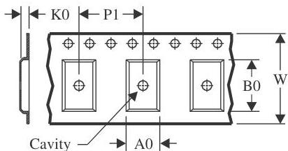
TAPE DIMENSIONS

|  A0 | Dimension designed to accommodate the component width  |
| --- | --- |
|  B0 | Dimension designed to accommodate the component length  |
|  K0 | Dimension designed to accommodate the component thickness  |
|  W | Overall width of the carrier tape  |
|  P1 | Pitch between successive cavity centers  |

QUADRANT ASSIGNMENTS FOR PIN 1 ORIENTATION IN TAPE

*All dimensions are nominal

|  Device | Package Type | Package Drawing | Pins | SPQ | Reel Diameter (mm) | Reel Width W1 (mm) | A0 (mm) | B0 (mm) | K0 (mm) | P1 (mm) | W (mm) | Pin1 Quadrant  |
| --- | --- | --- | --- | --- | --- | --- | --- | --- | --- | --- | --- | --- |
|  LP5907A28YKMR | DSBGA | YKM | 4 | 3000 | 178.0 | 8.4 | 0.74 | 0.74 | 0.54 | 4.0 | 8.0 | Q1  |
|  LP5907A33YKMR | DSBGA | YKM | 4 | 3000 | 178.0 | 8.4 | 0.74 | 0.74 | 0.54 | 4.0 | 8.0 | Q1  |
|  LP5907MFX-1.2/NOPB | SOT-23 | DBV | 5 | 3000 | 180.0 | 8.4 | 3.2 | 3.2 | 1.4 | 4.0 | 8.0 | Q3  |
|  LP5907MFX-1.2/NOPB | SOT-23 | DBV | 5 | 3000 | 180.0 | 8.4 | 3.2 | 3.2 | 1.4 | 4.0 | 8.0 | Q3  |
|  LP5907MFX-1.2/NOPB | SOT-23 | DBV | 5 | 3000 | 178.0 | 8.4 | 3.2 | 3.2 | 1.4 | 4.0 | 8.0 | Q3  |
|  LP5907MFX-1.5/NOPB | SOT-23 | DBV | 5 | 3000 | 178.0 | 8.4 | 3.2 | 3.2 | 1.4 | 4.0 | 8.0 | Q3  |
|  LP5907MFX-1.5/NOPB | SOT-23 | DBV | 5 | 3000 | 180.0 | 8.4 | 3.2 | 3.2 | 1.4 | 4.0 | 8.0 | Q3  |
|  LP5907MFX-1.8/NOPB | SOT-23 | DBV | 5 | 3000 | 180.0 | 8.4 | 3.2 | 3.2 | 1.4 | 4.0 | 8.0 | Q3  |
|  LP5907MFX-1.8/NOPB | SOT-23 | DBV | 5 | 3000 | 178.0 | 8.4 | 3.2 | 3.2 | 1.4 | 4.0 | 8.0 | Q3  |
|  LP5907MFX-2.5/NOPB | SOT-23 | DBV | 5 | 3000 | 178.0 | 8.4 | 3.2 | 3.2 | 1.4 | 4.0 | 8.0 | Q3  |
|  LP5907MFX-2.5/NOPB | SOT-23 | DBV | 5 | 3000 | 180.0 | 8.4 | 3.2 | 3.2 | 1.4 | 4.0 | 8.0 | Q3  |
|  LP5907MFX-2.8/NOPB | SOT-23 | DBV | 5 | 3000 | 180.0 | 8.4 | 3.2 | 3.2 | 1.4 | 4.0 | 8.0 | Q3  |

|  Device | Package Type | Package Drawing | Pins | SPQ | Reel Diameter (mm) | Reel Width W1 (mm) | A0 (mm) | B0 (mm) | K0 (mm) | P1 (mm) | W (mm) | Pin1 Quadrant  |
| --- | --- | --- | --- | --- | --- | --- | --- | --- | --- | --- | --- | --- |
|  LP5907MFX-2.85/NOPB | SOT-23 | DBV | 5 | 3000 | 180.0 | 8.4 | 3.2 | 3.2 | 1.4 | 4.0 | 8.0 | Q3  |
|  LP5907MFX-2.85/NOPB | SOT-23 | DBV | 5 | 3000 | 178.0 | 8.4 | 3.2 | 3.2 | 1.4 | 4.0 | 8.0 | Q3  |
|  LP5907MFX-2.9/NOPB | SOT-23 | DBV | 5 | 3000 | 180.0 | 8.4 | 3.2 | 3.2 | 1.4 | 4.0 | 8.0 | Q3  |
|  LP5907MFX-2.9/NOPB | SOT-23 | DBV | 5 | 3000 | 180.0 | 8.4 | 3.2 | 3.2 | 1.4 | 4.0 | 8.0 | Q3  |
|  LP5907MFX-3.0/NOPB | SOT-23 | DBV | 5 | 3000 | 178.0 | 8.4 | 3.2 | 3.2 | 1.4 | 4.0 | 8.0 | Q3  |
|  LP5907MFX-3.0/NOPB | SOT-23 | DBV | 5 | 3000 | 180.0 | 8.4 | 3.2 | 3.2 | 1.4 | 4.0 | 8.0 | Q3  |
|  LP5907MFX-3.1/NOPB | SOT-23 | DBV | 5 | 3000 | 178.0 | 8.4 | 3.2 | 3.2 | 1.4 | 4.0 | 8.0 | Q3  |
|  LP5907MFX-3.1/NOPB | SOT-23 | DBV | 5 | 3000 | 180.0 | 8.4 | 3.2 | 3.2 | 1.4 | 4.0 | 8.0 | Q3  |
|  LP5907MFX-3.1/NOPB | SOT-23 | DBV | 5 | 3000 | 180.0 | 8.4 | 3.2 | 3.2 | 1.4 | 4.0 | 8.0 | Q3  |
|  LP5907MFX-3.2/NOPB | SOT-23 | DBV | 5 | 3000 | 178.0 | 8.4 | 3.2 | 3.2 | 1.4 | 4.0 | 8.0 | Q3  |
|  LP5907MFX-3.2/NOPB | SOT-23 | DBV | 5 | 3000 | 180.0 | 8.4 | 3.2 | 3.2 | 1.4 | 4.0 | 8.0 | Q3  |
|  LP5907MFX-3.2/NOPB | SOT-23 | DBV | 5 | 3000 | 180.0 | 8.4 | 3.2 | 3.2 | 1.4 | 4.0 | 8.0 | Q3  |
|  LP5907MFX-3.2/NOPB | SOT-23 | DBV | 5 | 3000 | 180.0 | 8.4 | 3.2 | 3.2 | 1.4 | 4.0 | 8.0 | Q3  |

|  Device | Package Type | Package Drawing | Pins | SPQ | Reel Diameter (mm) | Reel Width W1 (mm) | A0 (mm) | B0 (mm) | K0 (mm) | P1 (mm) | W (mm) | Pin1 Quadrant  |
| --- | --- | --- | --- | --- | --- | --- | --- | --- | --- | --- | --- | --- |
|  LP5907SNX2.2NOPBG4 | X2SON | DQN | 4 | 3000 | 180.0 | 8.4 | 1.16 | 1.16 | 0.5 | 4.0 | 8.0 | Q2  |
|  LP5907SNX2.5NOPBG4 | X2SON | DQN | 4 | 3000 | 180.0 | 8.4 | 1.16 | 1.16 | 0.5 | 4.0 | 8.0 | Q2  |
|  LP5907SNX2.7NOPBG4 | X2SON | DQN | 4 | 3000 | 180.0 | 8.4 | 1.16 | 1.16 | 0.5 | 4.0 | 8.0 | Q2  |
|  LP5907SNX2.8NOPBG4 | X2SON | DQN | 4 | 3000 | 180.0 | 8.4 | 1.16 | 1.16 | 0.5 | 4.0 | 8.0 | Q2  |
|  LP5907SNX2.9NOPBG4 | X2SON | DQN | 4 | 3000 | 180.0 | 8.4 | 1.16 | 1.16 | 0.5 | 4.0 | 8.0 | Q2  |
|  LP5907SNX3.0NOPBG4 | X2SON | DQN | 4 | 3000 | 180.0 | 9.5 | 1.16 | 1.16 | 0.63 | 4.0 | 8.0 | Q2  |
|  LP5907SNX3.1NOPBG4 | X2SON | DQN | 4 | 3000 | 180.0 | 8.4 | 1.16 | 1.16 | 0.5 | 4.0 | 8.0 | Q2  |
|  LP5907SNX3.2NOPBG4 | X2SON | DQN | 4 | 3000 | 180.0 | 8.4 | 1.16 | 1.16 | 0.5 | 4.0 | 8.0 | Q2  |
|  LP5907SNX3.3NOPBG4 | X2SON | DQN | 4 | 3000 | 180.0 | 8.4 | 1.16 | 1.16 | 0.5 | 4.0 | 8.0 | Q2  |
|  LP5907SNX4.0NOPBG4 | X2SON | DQN | 4 | 3000 | 180.0 | 8.4 | 1.16 | 1.16 | 0.5 | 4.0 | 8.0 | Q2  |
|  LP5907SNX4.5NOPBG4 | X2SON | DQN | 4 | 3000 | 180.0 | 8.4 | 1.16 | 1.16 | 0.5 | 4.0 | 8.0 | Q2  |
|  LP5907UVE-1.2/NOPB | DSBGA | YKE | 4 | 250 | 178.0 | 8.4 | 0.71 | 0.71 | 0.51 | 2.0 | 8.0 | Q1  |
|  LP5907UVE-1.8/NOPB | DSBGA | YKE | 4 | 250 | 178.0 | 8.4 | 0.71 | 0.71 | 0.51 | 2.0 | 8.0 | Q1  |
|  LP5907UVE-2.8/NOPB | DSBGA | YKE | 4 | 250 | 178.0 | 8.4 | 0.71 | 0.71 | 0.51 | 2.0 | 8.0 | Q1  |
|  LP5907UVE-2.85/NOPB | DSBGA | YKE | 4 | 250 | 178.0 | 8.4 | 0.71 | 0.71 | 0.51 | 2.0 | 8.0 | Q1  |
|  LP5907UVE-3.0/NOPB | DSBGA | YKE | 4 | 250 | 178.0 | 8.4 | 0.71 | 0.71 | 0.51 | 2.0 | 8.0 | Q1  |
|  LP5907UVE-3.1/NOPB | DSBGA | YKE | 4 | 250 | 178.0 | 8.4 | 0.71 | 0.71 | 0.51 | 2.0 | 8.0 | Q1  |
|  LP5907UVE-3.2/NOPB | DSBGA | YKE | 4 | 250 | 178.0 | 8.4 | 0.71 | 0.71 | 0.51 | 2.0 | 8.0 | Q1  |
|  LP5907UVE-3.3/NOPB | DSBGA | YKE | 4 | 250 | 178.0 | 8.4 | 0.71 | 0.71 | 0.51 | 2.0 | 8.0 | Q1  |
|  LP5907UVE-4.5/NOPB | DSBGA | YKE | 4 | 250 | 178.0 | 8.4 | 0.71 | 0.71 | 0.51 | 2.0 | 8.0 | Q1  |
|  LP5907UVX-1.2/NOPB | DSBGA | YKE | 4 | 3000 | 178.0 | 8.4 | 0.71 | 0.71 | 0.51 | 2.0 | 8.0 | Q1  |
|  LP5907UVX-1.8/NOPB | DSBGA | YKE | 4 | 3000 | 178.0 | 8.4 | 0.71 | 0.71 | 0.51 | 2.0 | 8.0 | Q1  |
|  LP5907UVX-2.5/NOPB | DSBGA | YKE | 4 | 3000 | 178.0 | 8.4 | 0.71 | 0.71 | 0.51 | 2.0 | 8.0 | Q1  |
|  LP5907UVX-2.8/NOPB | DSBGA | YKE | 4 | 3000 | 178.0 | 8.4 | 0.71 | 0.71 | 0.51 | 2.0 | 8.0 | Q1  |
|  LP5907UVX-2.85/NOPB | DSBGA | YKE | 4 | 3000 | 178.0 | 8.4 | 0.71 | 0.71 | 0.51 | 2.0 | 8.0 | Q1  |
|  LP5907UVX-3.0/NOPB | DSBGA | YKE | 4 | 3000 | 178.0 | 8.4 | 0.71 | 0.71 | 0.51 | 2.0 | 8.0 | Q1  |
|  LP5907UVX-3.1/NOPB | DSBGA | YKE | 4 | 3000 | 178.0 | 8.4 | 0.71 | 0.71 | 0.51 | 2.0 | 8.0 | Q1  |
|  LP5907UVX-3.2/NOPB | DSBGA | YKE | 4 | 3000 | 178.0 | 8.4 | 0.71 | 0.71 | 0.51 | 2.0 | 8.0 | Q1  |
|  LP5907UVX-3.3/NOPB | DSBGA | YKE | 4 | 3000 | 178.0 | 8.4 | 0.71 | 0.71 | 0.51 | 2.0 | 8.0 | Q1  |
|  LP5907UVX-4.5/NOPB | DSBGA | YKE | 4 | 3000 | 178.0 | 8.4 | 0.71 | 0.71 | 0.51 | 2.0 | 8.0 | Q1  |
|  LP5907UVX19/NOPB | DSBGA | YKE | 4 | 3000 | 178.0 | 8.4 | 0.71 | 0.71 | 0.51 | 2.0 | 8.0 | Q1  |
|  LP5907UVX37/NOPB | DSBGA | YKE | 4 | 3000 | 178.0 | 8.4 | 0.71 | 0.71 | 0.51 | 2.0 | 8.0 | Q1  |
|  LP5907YKGR-2.8 | DSBGA | YKG | 4 | 3000 | 178.0 | 9.2 | 0.72 | 0.72 | 0.39 | 4.0 | 8.0 | Q1  |
|  LP5907YKGR-2.825 | DSBGA | YKG | 4 | 3000 | 178.0 | 9.2 | 0.72 | 0.72 | 0.39 | 4.0 | 8.0 | Q1  |
|  LP5907YKGR-2.85 | DSBGA | YKG | 4 | 3000 | 178.0 | 9.2 | 0.72 | 0.72 | 0.39 | 4.0 | 8.0 | Q1  |

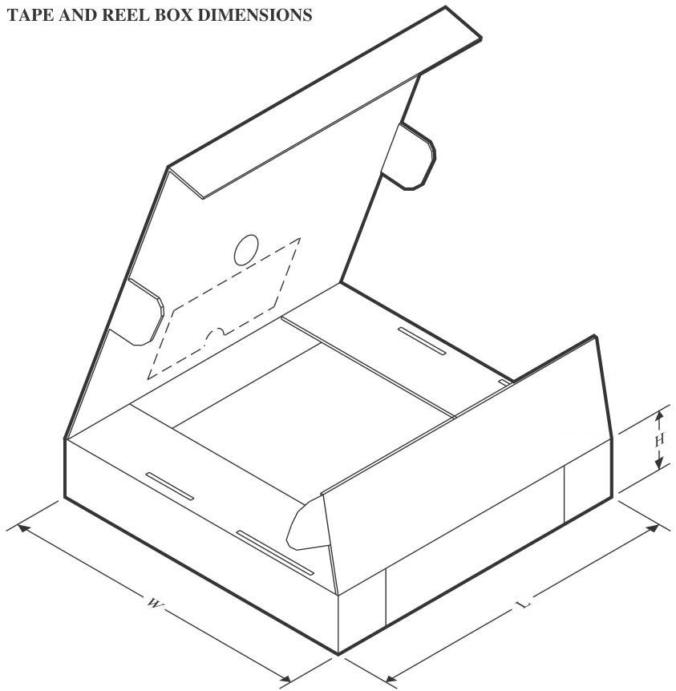
TAPE AND REEL BOX DIMENSIONS

*All dimensions are nominal

|  Device | Package Type | Package Drawing | Pins | SPQ | Length (mm) | Width (mm) | Height (mm)  |
| --- | --- | --- | --- | --- | --- | --- | --- |
|  LP5907A28YKMR | DSBGA | YKM | 4 | 3000 | 220.0 | 220.0 | 35.0  |
|  LP5907A33YKMR | DSBGA | YKM | 4 | 3000 | 220.0 | 220.0 | 35.0  |
|  LP5907MFX-1.2/NOPB | SOT-23 | DBV | 5 | 3000 | 210.0 | 185.0 | 35.0  |
|  LP5907MFX-1.2/NOPB | SOT-23 | DBV | 5 | 3000 | 210.0 | 185.0 | 35.0  |
|  LP5907MFX-1.2/NOPB | SOT-23 | DBV | 5 | 3000 | 208.0 | 191.0 | 35.0  |
|  LP5907MFX-1.5/NOPB | SOT-23 | DBV | 5 | 3000 | 208.0 | 191.0 | 35.0  |
|  LP5907MFX-1.5/NOPB | SOT-23 | DBV | 5 | 3000 | 210.0 | 185.0 | 35.0  |
|  LP5907MFX-1.5/NOPB | SOT-23 | DBV | 5 | 3000 | 210.0 | 185.0 | 35.0  |
|  LP5907MFX-1.8/NOPB | SOT-23 | DBV | 5 | 3000 | 210.0 | 185.0 | 35.0  |
|  LP5907MFX-1.8/NOPB | SOT-23 | DBV | 5 | 3000 | 208.0 | 191.0 | 35.0  |
|  LP5907MFX-1.8/NOPB | SOT-23 | DBV | 5 | 3000 | 210.0 | 185.0 | 35.0  |
|  LP5907MFX-2.5/NOPB | SOT-23 | DBV | 5 | 3000 | 208.0 | 191.0 | 35.0  |
|  LP5907MFX-2.5/NOPB | SOT-23 | DBV | 5 | 3000 | 210.0 | 185.0 | 35.0  |
|  LP5907MFX-2.5/NOPB | SOT-23 | DBV | 5 | 3000 | 210.0 | 185.0 | 35.0  |
|  LP5907MFX-2.8/NOPB | SOT-23 | DBV | 5 | 3000 | 208.0 | 191.0 | 35.0  |
|  LP5907MFX-2.85/NOPB | SOT-23 | DBV | 5 | 3000 | 210.0 | 185.0 | 35.0  |
|  LP5907MFX-2.85/NOPB | SOT-23 | DBV | 5 | 3000 | 210.0 | 185.0 | 35.0  |
|  LP5907MFX-2.85/NOPB | SOT-23 | DBV | 5 | 3000 | 208.0 | 191.0 | 35.0  |

|  Device | Package Type | Package Drawing | Pins | SPQ | Length (mm) | Width (mm) | Height (mm)  |
| --- | --- | --- | --- | --- | --- | --- | --- |
|  LP5907MFX-2.9/NOPB | SOT-23 | DBV | 5 | 3000 | 210.0 | 185.0 | 35.0  |
|  LP5907MFX-2.9/NOPB | SOT-23 | DBV | 5 | 3000 | 210.0 | 185.0 | 35.0  |
|  LP5907MFX-2.9/NOPB | SOT-23 | DBV | 5 | 3000 | 208.0 | 191.0 | 35.0  |
|  LP5907MFX-3.0/NOPB | SOT-23 | DBV | 5 | 3000 | 210.0 | 185.0 | 35.0  |
|  LP5907MFX-3.0/NOPB | SOT-23 | DBV | 5 | 3000 | 208.0 | 191.0 | 35.0  |
|  LP5907MFX-3.0/NOPB | SOT-23 | DBV | 5 | 3000 | 210.0 | 185.0 | 35.0  |
|  LP5907MFX-3.1/NOPB | SOT-23 | DBV | 5 | 3000 | 208.0 | 191.0 | 35.0  |
|  LP5907MFX-3.1/NOPB | SOT-23 | DBV | 5 | 3000 | 210.0 | 185.0 | 35.0  |
|  LP5907MFX-3.1/NOPB | SOT-23 | DBV | 5 | 3000 | 210.0 | 185.0 | 35.0  |
|  LP5907MFX-3.2/NOPB | SOT-23 | DBV | 5 | 3000 | 208.0 | 191.0 | 35.0  |
|  LP5907MFX-3.2/NOPB | SOT-23 | DBV | 5 | 3000 | 210.0 | 185.0 | 35.0  |
|  LP5907MFX-3.2/NOPB | SOT-23 | DBV | 5 | 3000 | 210.0 | 185.0 | 35.0  |
|  LP5907MFX-3.3/NOPB | SOT-23 | DBV | 5 | 3000 | 210.0 | 185.0 | 35.0  |
|  LP5907MFX-3.3/NOPB | SOT-23 | DBV | 5 | 3000 | 210.0 | 185.0 | 35.0  |
|  LP5907MFX-3.3/NOPB | SOT-23 | DBV | 5 | 3000 | 208.0 | 191.0 | 35.0  |
|  LP5907MFX-4.5/NOPB | SOT-23 | DBV | 5 | 3000 | 210.0 | 185.0 | 35.0  |
|  LP5907MFX-4.5/NOPB | SOT-23 | DBV | 5 | 3000 | 208.0 | 191.0 | 35.0  |
|  LP5907SNX-1.2/NOPB | X2SON | DQN | 4 | 3000 | 210.0 | 185.0 | 35.0  |
|  LP5907SNX-1.8/NOPB | X2SON | DQN | 4 | 3000 | 184.0 | 184.0 | 19.0  |
|  LP5907SNX-1.8/NOPB | X2SON | DQN | 4 | 3000 | 210.0 | 185.0 | 35.0  |
|  LP5907SNX-1.9 | X2SON | DQN | 4 | 3000 | 210.0 | 185.0 | 35.0  |
|  LP5907SNX-2.2/NOPB | X2SON | DQN | 4 | 3000 | 210.0 | 185.0 | 35.0  |
|  LP5907SNX-2.5/NOPB | X2SON | DQN | 4 | 3000 | 210.0 | 185.0 | 35.0  |
|  LP5907SNX-2.7/NOPB | X2SON | DQN | 4 | 3000 | 210.0 | 185.0 | 35.0  |
|  LP5907SNX-2.75 | X2SON | DQN | 4 | 3000 | 184.0 | 184.0 | 19.0  |
|  LP5907SNX-2.75 | X2SON | DQN | 4 | 3000 | 210.0 | 185.0 | 35.0  |
|  LP5907SNX-2.8/NOPB | X2SON | DQN | 4 | 3000 | 210.0 | 185.0 | 35.0  |
|  LP5907SNX-2.85/G4 | X2SON | DQN | 4 | 3000 | 210.0 | 185.0 | 35.0  |
|  LP5907SNX-2.85/NOPB | X2SON | DQN | 4 | 3000 | 210.0 | 185.0 | 35.0  |
|  LP5907SNX-2.9/NOPB | X2SON | DQN | 4 | 3000 | 210.0 | 185.0 | 35.0  |
|  LP5907SNX-3.0/NOPB | X2SON | DQN | 4 | 3000 | 184.0 | 184.0 | 19.0  |
|  LP5907SNX-3.1/NOPB | X2SON | DQN | 4 | 3000 | 210.0 | 185.0 | 35.0  |
|  LP5907SNX-3.2/NOPB | X2SON | DQN | 4 | 3000 | 210.0 | 185.0 | 35.0  |
|  LP5907SNX-3.3/NOPB | X2SON | DQN | 4 | 3000 | 184.0 | 184.0 | 19.0  |
|  LP5907SNX-3.3/NOPB | X2SON | DQN | 4 | 3000 | 210.0 | 185.0 | 35.0  |
|  LP5907SNX-4.0/NOPB | X2SON | DQN | 4 | 3000 | 210.0 | 185.0 | 35.0  |
|  LP5907SNX-4.5/NOPB | X2SON | DQN | 4 | 3000 | 210.0 | 185.0 | 35.0  |
|  LP5907SNX-4.5/NOPB | X2SON | DQN | 4 | 3000 | 210.0 | 185.0 | 35.0  |
|  LP5907SNX1.2NOPBG4 | X2SON | DQN | 4 | 3000 | 210.0 | 185.0 | 35.0  |
|  LP5907SNX1.8NOPBG4 | X2SON | DQN | 4 | 3000 | 210.0 | 185.0 | 35.0  |
|  LP5907SNX2.2NOPBG4 | X2SON | DQN | 4 | 3000 | 210.0 | 185.0 | 35.0  |
|  LP5907SNX2.5NOPBG4 | X2SON | DQN | 4 | 3000 | 210.0 | 185.0 | 35.0  |
|  LP5907SNX2.7NOPBG4 | X2SON | DQN | 4 | 3000 | 210.0 | 185.0 | 35.0  |
|  LP5907SNX2.8NOPBG4 | X2SON | DQN | 4 | 3000 | 210.0 | 185.0 | 35.0  |

|  Device | Package Type | Package Drawing | Pins | SPQ | Length (mm) | Width (mm) | Height (mm)  |
| --- | --- | --- | --- | --- | --- | --- | --- |
|  LP5907SNX2.9NOPBG4 | X2SON | DQN | 4 | 3000 | 210.0 | 185.0 | 35.0  |
|  LP5907SNX3.0NOPBG4 | X2SON | DQN | 4 | 3000 | 184.0 | 184.0 | 19.0  |
|  LP5907SNX3.1NOPBG4 | X2SON | DQN | 4 | 3000 | 210.0 | 185.0 | 35.0  |
|  LP5907SNX3.2NOPBG4 | X2SON | DQN | 4 | 3000 | 210.0 | 185.0 | 35.0  |
|  LP5907SNX3.3NOPBG4 | X2SON | DQN | 4 | 3000 | 210.0 | 185.0 | 35.0  |
|  LP5907SNX4.0NOPBG4 | X2SON | DQN | 4 | 3000 | 210.0 | 185.0 | 35.0  |
|  LP5907SNX4.5NOPBG4 | X2SON | DQN | 4 | 3000 | 210.0 | 185.0 | 35.0  |
|  LP5907UVE-1.2/NOPB | DSBGA | YKE | 4 | 250 | 208.0 | 191.0 | 35.0  |
|  LP5907UVE-1.8/NOPB | DSBGA | YKE | 4 | 250 | 208.0 | 191.0 | 35.0  |
|  LP5907UVE-2.8/NOPB | DSBGA | YKE | 4 | 250 | 208.0 | 191.0 | 35.0  |
|  LP5907UVE-2.85/NOPB | DSBGA | YKE | 4 | 250 | 208.0 | 191.0 | 35.0  |
|  LP5907UVE-3.0/NOPB | DSBGA | YKE | 4 | 250 | 208.0 | 191.0 | 35.0  |
|  LP5907UVE-3.1/NOPB | DSBGA | YKE | 4 | 250 | 208.0 | 191.0 | 35.0  |
|  LP5907UVE-3.2/NOPB | DSBGA | YKE | 4 | 250 | 208.0 | 191.0 | 35.0  |
|  LP5907UVE-3.3/NOPB | DSBGA | YKE | 4 | 250 | 208.0 | 191.0 | 35.0  |
|  LP5907UVE-4.5/NOPB | DSBGA | YKE | 4 | 250 | 208.0 | 191.0 | 35.0  |
|  LP5907UVX-1.2/NOPB | DSBGA | YKE | 4 | 3000 | 208.0 | 191.0 | 35.0  |
|  LP5907UVX-1.8/NOPB | DSBGA | YKE | 4 | 3000 | 208.0 | 191.0 | 35.0  |
|  LP5907UVX-2.5/NOPB | DSBGA | YKE | 4 | 3000 | 208.0 | 191.0 | 35.0  |
|  LP5907UVX-2.8/NOPB | DSBGA | YKE | 4 | 3000 | 208.0 | 191.0 | 35.0  |
|  LP5907UVX-2.85/NOPB | DSBGA | YKE | 4 | 3000 | 208.0 | 191.0 | 35.0  |
|  LP5907UVX-3.0/NOPB | DSBGA | YKE | 4 | 3000 | 208.0 | 191.0 | 35.0  |
|  LP5907UVX-3.1/NOPB | DSBGA | YKE | 4 | 3000 | 208.0 | 191.0 | 35.0  |
|  LP5907UVX-3.2/NOPB | DSBGA | YKE | 4 | 3000 | 208.0 | 191.0 | 35.0  |
|  LP5907UVX-3.3/NOPB | DSBGA | YKE | 4 | 3000 | 208.0 | 191.0 | 35.0  |
|  LP5907UVX-4.5/NOPB | DSBGA | YKE | 4 | 3000 | 208.0 | 191.0 | 35.0  |
|  LP5907UVX19/NOPB | DSBGA | YKE | 4 | 3000 | 208.0 | 191.0 | 35.0  |
|  LP5907UVX37/NOPB | DSBGA | YKE | 4 | 3000 | 208.0 | 191.0 | 35.0  |
|  LP5907YKGR-2.8 | DSBGA | YKG | 4 | 3000 | 220.0 | 220.0 | 35.0  |
|  LP5907YKGR-2.825 | DSBGA | YKG | 4 | 3000 | 220.0 | 220.0 | 35.0  |
|  LP5907YKGR-2.85 | DSBGA | YKG | 4 | 3000 | 220.0 | 220.0 | 35.0  |

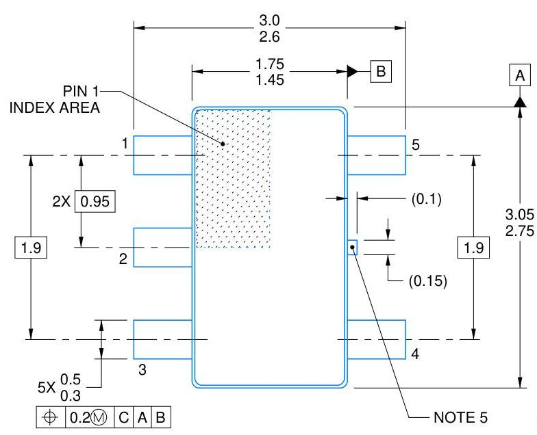

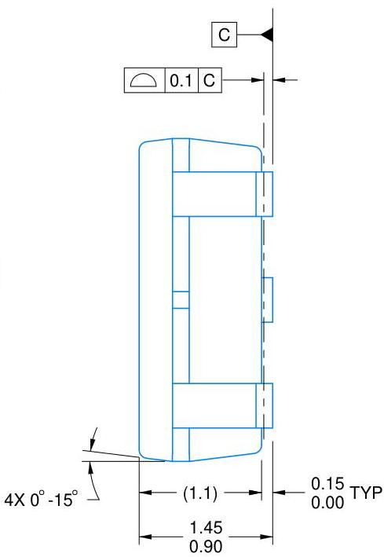

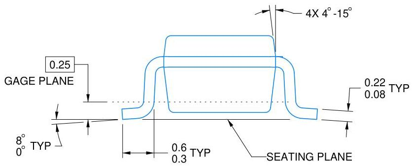

4214839/K 08/2024

# NOTES:

1. All linear dimensions are in millimeters. Any dimensions in parenthesis are for reference only. Dimensioning and tolerancing per ASME Y14.5M.
2. This drawing is subject to change without notice.
3. Reference JEDEC MO-178.
4. Body dimensions do not include mold flash, protrusions, or gate burrs. Mold flash, protrusions, or gate burrs shall not exceed 0.25 mm per side.
5. Support pin may differ or may not be present.

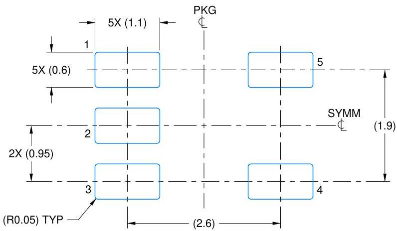
LAND PATTERN EXAMPLE
EXPOSED METAL SHOWN
SCALE:15X

NON SOLDER MASK
DEFINED
(PREFERRED)

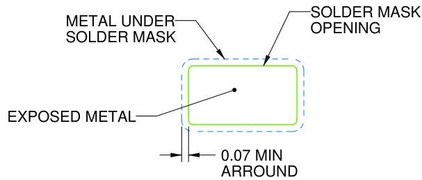
SOLDER MASK
DEFINED
SOLDER MASK DETAILS

4214839/K 08/2024

NOTES: (continued)

6. Publication IPC-7351 may have alternate designs.
7. Solder mask tolerances between and around signal pads can vary based on board fabrication site.

SMALL OUTLINE TRANSISTOR

SOLDER PASTE EXAMPLE
BASED ON 0.125 mm THICK STENCIL
SCALE:15X

4214839/K 08/2024

NOTES: (continued)

8. Laser cutting apertures with trapezoidal walls and rounded corners may offer better paste release. IPC-7525 may have alternate design recommendations.
9. Board assembly site may have different recommendations for stencil design.

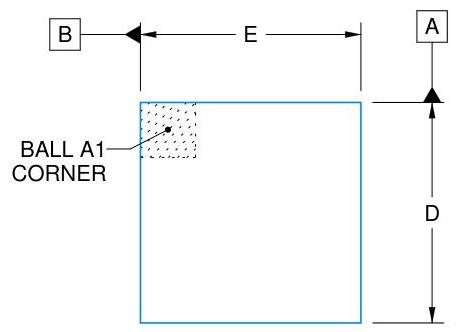

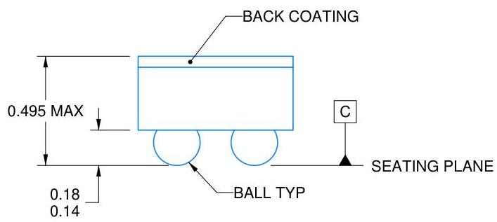

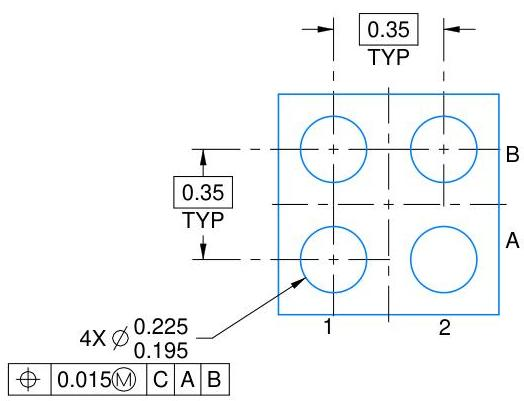

D: Max = 0.675 mm, Min = 0.615 mm
E: Max = 0.675 mm, Min = 0.615 mm

4223494/A 11/2014

# NOTES:

1. All linear dimensions are in millimeters. Any dimensions in parenthesis are for reference only. Dimensioning and tolerancing per ASME Y14.5M.
2. This drawing is subject to change without notice.

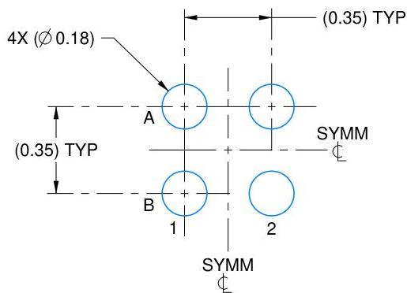
LAND PATTERN EXAMPLE
EXPOSED METAL SHOWN
SCALE:40X

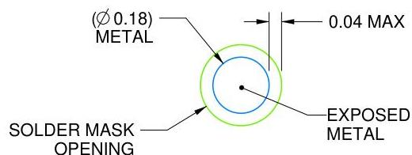
NON-SOLDER MASK DEFINED

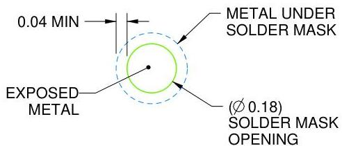
SOLDER MASK DEFINED (PREFERRED)
SOLDER MASK DETAILS
NOT TO SCALE

4223494/A 11/2014

NOTES: (continued)

3. Final dimensions may vary due to manufacturing tolerance considerations and also routing constraints. Refer to Texas Instruments Literature No. SNVA009 (www.ti.com/lit/snva009).

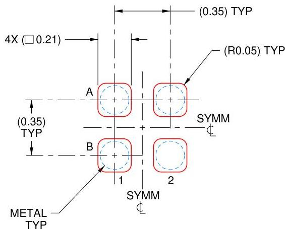
SOLDER PASTE EXAMPLE
BASED ON 0.075 - 0.1mm THICK STENCIL
SCALE:40X

4223494/A 11/2014

NOTES: (continued)

4. Laser cutting apertures with trapezoidal walls and rounded corners may offer better paste release.

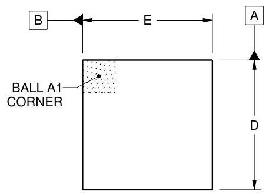

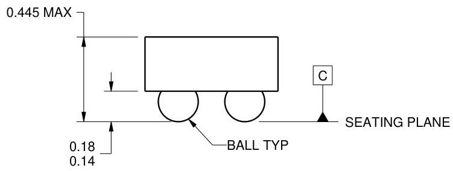

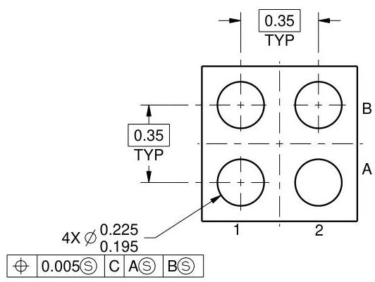

D: Max = 0.675 mm, Min = 0.615 mm
E: Max = 0.675 mm, Min = 0.615 mm

4220102/A 11/2014

# NOTES:

1. All linear dimensions are in millimeters. Any dimensions in parenthesis are for reference only. Dimensioning and tolerancing per ASME Y14.5M.
2. This drawing is subject to change without notice.

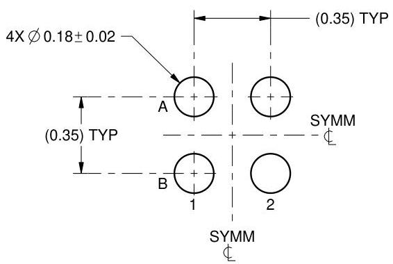
LAND PATTERN EXAMPLE
SCALE:40X

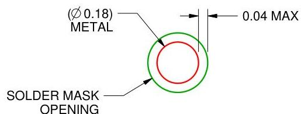
NON-SOLDER MASK DEFINED (PREFERRED)

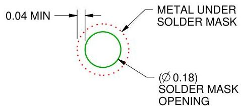
SOLDER MASK DEFINED

SOLDER MASK DETAILS
NOT TO SCALE

4220102/A 11/2014

NOTES: (continued)

3. Final dimensions may vary due to manufacturing tolerance considerations and also routing constraints. Refer to Texas Instruments Literature No. SNVA009 (www.ti.com/lit/snva009).

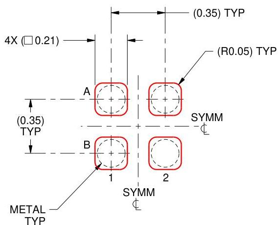

SOLDER PASTE EXAMPLE
BASED ON 0.075 - 0.1mm THICK STENCIL
SCALE:40X

4220102/A 11/2014

NOTES: (continued)

4. Laser cutting apertures with trapezoidal walls and rounded corners may offer better paste release.

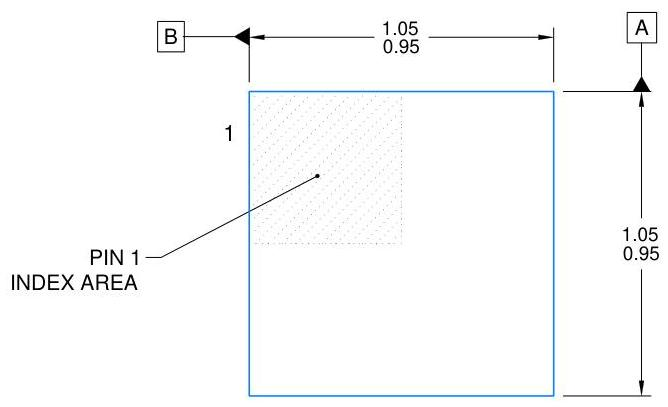

4215302/E 12/2016

# NOTES:

1. All linear dimensions are in millimeters. Any dimensions in parenthesis are for reference only. Dimensioning and tolerancing per ASME Y14.5M.
2. This drawing is subject to change without notice.
3. The package thermal pad must be soldered to the printed circuit board for optimal thermal and mechanical performance.
4. Features may not exist. Recommend use of pin 1 marking on top of package for orientation purposes.
5. Shape of exposed side leads may differ.
6. Number and location of exposed tie bars may vary.

LAND PATTERN EXAMPLE
SCALE: 40X

SOLDER MASK
DEFINED

SOLDER MASK DETAIL

4215302/E 12/2016

NOTES: (continued)

7. This package is designed to be soldered to a thermal pad on the board. For more information, see Texas Instruments literature number SLUA271 (www.ti.com/lit/slua271).
8. If any vias are implemented, it is recommended that vias under paste be filled, plugged or tented.

SOLDER PASTE EXAMPLE
BASED ON 0.075 - 0.1mm THICK STENCIL

EXPOSED PAD
88% PRINTED SOLDER COVERAGE BY AREA
SCALE: 60X

4215302/E 12/2016

NOTES: (continued)

9. Laser cutting apertures with trapezoidal walls and rounded corners may offer better paste release. IPC-7525 may have alternate design recommendations.

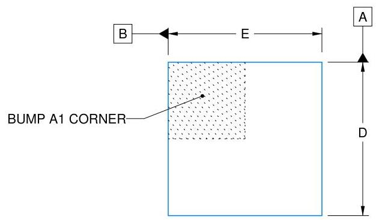

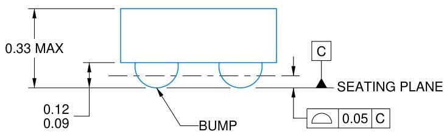

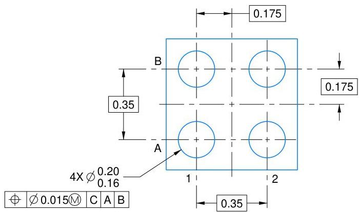

D: Max = 0.675 mm, Min = 0.615 mm
E: Max = 0.675 mm, Min = 0.615 mm

4218366/E 05/2020

# NOTES:

1. All linear dimensions are in millimeters. Dimensions in parenthesis are for reference only. Dimensioning and tolerancing per ASME Y14.5M.
2. This drawing is subject to change without notice.

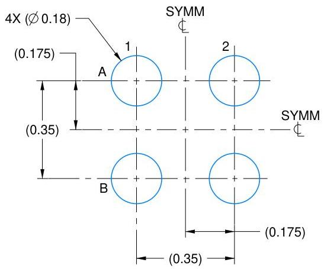
LAND PATTERN EXAMPLE
EXPOSED METAL SHOWN
SCALE:60X

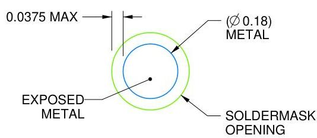
NON SOLDERMASK DEFINED

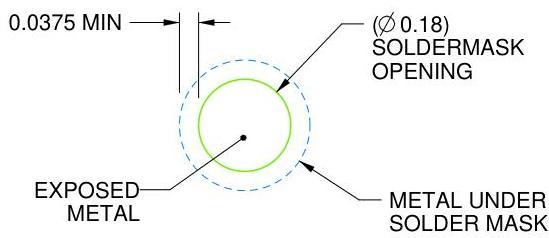
SOLDERMASK DEFINED (PREFERRED)
SOLDERMASK DETAILS
NOT TO SCALE

4218366/E 05/2020

NOTES: (continued)

3. Final dimensions may vary due to manufacturing tolerance considerations and also routing constraints. Refer to Texas Instruments Literature No. SNVA009 (www.ti.com/lit/snva009).

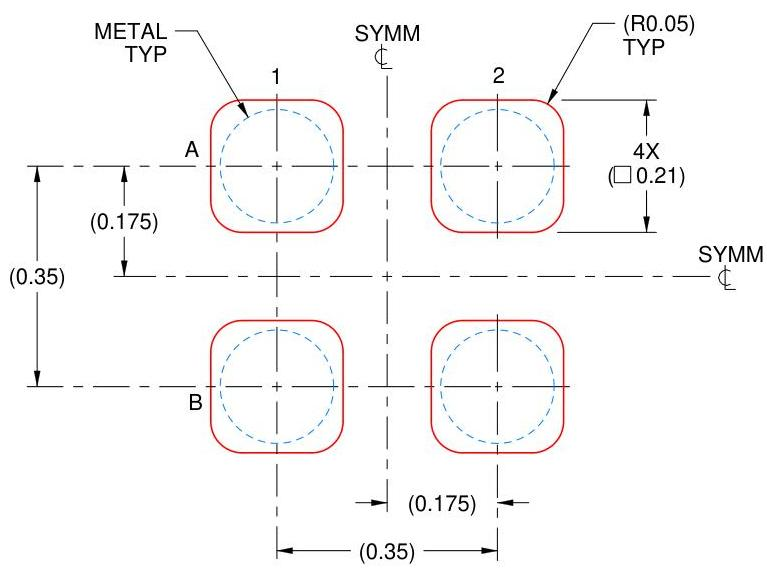
SOLDERPASTE EXAMPLE
BASED ON 0.075 mm THICK STENCIL
SCALE:80X

4218366/E 05/2020

NOTES: (continued)

4. Laser cutting apertures with trapezoidal walls and rounded corners may offer better paste release.

# 重要通知和免责声明

TI“按原样”提供技术和可靠性数据（包括数据表）、设计资源（包括参考设计）、应用或其他设计建议、网络工具、安全信息和其他资源，不保证没有瑕疵且不做出任何明示或暗示的担保，包括但不限于对适销性、与某特定用途的适用性或不侵犯任何第三方知识产权的暗示担保。

这些资源可供使用TI产品进行设计的熟练开发人员使用。您将自行承担以下全部责任：(1) 针对您的应用选择合适的TI产品，(2) 设计、验证并测试您的应用，(3) 确保您的应用满足相应标准以及任何其他安全、安保法规或其他要求。

这些资源如有变更，恕不另行通知。TI授权您仅可将这些资源用于研发本资源所述的TI产品的相关应用。严禁以其他方式对这些资源进行复制或展示。您无权使用任何其他TI知识产权或任何第三方知识产权。对于因您对这些资源的使用而对TI及其代表造成的任何索赔、损害、成本、损失和债务，您将全额赔偿，TI对此概不负责。

TI提供的产品受TI销售条款)、TI通用质量指南或ti.com上其他适用条款或TI产品随附的其他适用条款的约束。TI提供这些资源并不会扩展或以其他方式更改TI针对TI产品发布的适用的担保或担保免责声明。除非德州仪器(TI)明确将某产品指定为定制产品或客户特定产品，否则其产品均为按确定价格收入目录的标准通用器件。

TI反对并拒绝您可能提出的任何其他或不同的条款。

版权所有 © 2026，德州仪器 (TI) 公司

最后更新日期：2025年10月