# General Description

The Devices is a low-dropout (LDO) voltage regulator with enable function that operates from a 1.2V to 5.5V supply. It provides up to 300mA of output current in miniaturized packaging.

The feature of 2μA low quiescent current and 0.5μA shutdown current are ideal for the battery application with long service life. The other features include current limit function, over temperature protection and output discharge function.

# Features

- 2μA Ground Current at no Load
- ±2% Output Accuracy
- 300mA Output Current
- 10nA Disable Current (by option)
- Wide Operating Input Voltage Range: 1.2V to 5.5V
- Dropout Voltage: 0.18V at 300mA (Vₒᵤᵣ = 3.3V)
- Support Fixed Output Voltage 1.2V, 1.5V, 1.6V, 1.8V, 2.5V, 2.8V, 3.0V, 3.3V
- Stable with Ceramic or Tantalum Capacitor
- Current Limit Protection
- Over-Temperature Protection
- SOT23-5 Package

# Applications

- Portable, Battery Powered Equipment
- Low Power Microcontrollers
- Laptop, Palmtops and PDAs
- Wireless Communication Equipment
- Audio/Video Equipment

# Ordering Information

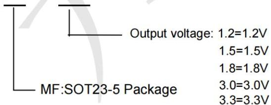
LP5907MFX-3.3

LP5907MFX-3.3 Marking: LLVB
LP5907MFX-1.8 Marking: LLUB

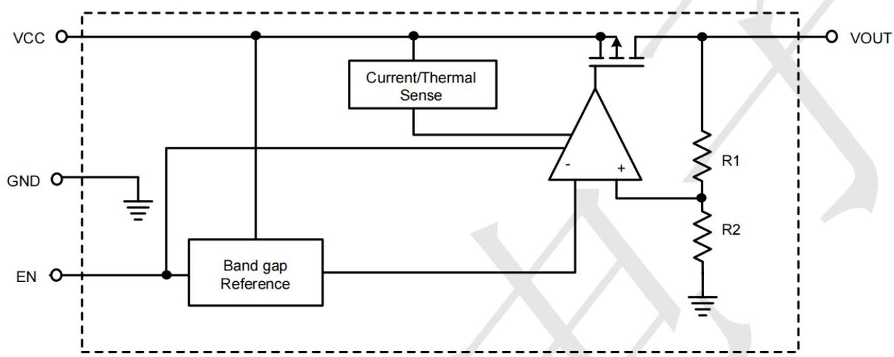
BLOCK DIAGRAM

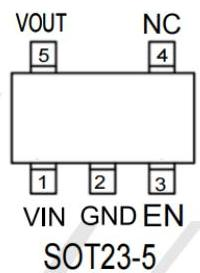
PIN CONFIGURATION

|  Pin No | Pin Name | Pin Function  |
| --- | --- | --- |
|  1 | VIN | Input of Supply Voltage.  |
|  2 | GND | Ground  |
|  3 | EN | Enable Control Input.  |
|  4 | NC | No Internal Connection.  |
|  5 | VOUT | Output of the Regulator  |

# Absolute Maximum Rating (T_A = 25°C unless otherwise noted)

- VIN, VOUT, , EN to GND — 0.3V to 6.5V
- VOUT to VIN — 6.5V to 0.3V
- Power Dissipation, P_D @ T_A = 25°C
SOT-23-5 — 0.43W
- Package Thermal Resistance (Note 2)
SOT-23-5, θ_JA — 230.6°C/W
SOT-23-5, θ_IC — 21.8°C/W
- Lead Temperature (Soldering, 10 sec.) — 260°C
- Junction Temperature — 150°C
- Storage Temperature Range — -65°C to 150°C
- ESD Susceptibility (Note 3)
HBM (Human Body Model) — 2kV

# Electrical Characteristics (T = 25°C unless otherwise noted)

(V_out + 1 &lt; V_in &lt; 5.5V, T_A = 25°C, unless otherwise specified)

|  Parameter | Symbol | Test Conditions | Min | Typ | Max | Unit  |
| --- | --- | --- | --- | --- | --- | --- |
|  Fixed Output Voltage Range | VOUT |  | 0.8 | -- | 3.45 | V  |
|  DC Output Accuracy |  | ILOAD = 1mA | -2 | -- | 2 | %  |
|  Dropout Voltage (ILOAD = 300mA) (Note 5) | VDROP | 0.8V ≤ VOUT < 1.05V | -- | 0.7 | 0.97 | V  |
|   |   |  1.05V ≤ VOUT < 1.2V | -- | 0.5 | 0.92  |   |
|   |   |  1.2V ≤ VOUT < 1.5V | -- | 0.4 | 0.57  |   |
|   |   |  1.5V ≤ VOUT < 1.8V | -- | 0.3 | 0.47  |   |
|   |   |  1.8V ≤ VOUT < 2.1V | -- | 0.24 | 0.33  |   |
|   |   |  2.1V ≤ VOUT < 2.5V | -- | 0.21 | 0.3  |   |
|   |   |  2.5V ≤ VOUT < 2.8V | -- | 0.18 | 0.25  |   |
|   |   |  2.8V ≤ VOUT < 3V | -- | 0.16 | 0.23  |   |
|   |   |  3V ≤ VOUT | -- | 0.15 | 0.2  |   |
|  Dropout Voltage (ILOAD = 200mA) (Note 6) | VDROP | 1.8V ≤ VOUT < 2.1V | -- | 0.16 | 0.2 | V  |
|  VCC Consumption Current | IQ | ILOAD = 0mA, VOUT ≤ 5.5V
VIN ≥ VOUT + VDROP | -- | 2 | 4 | μA  |

|  Parameter |   | Symbol | Test Conditions |   | Min | Typ | Max | Unit  |
| --- | --- | --- | --- | --- | --- | --- | --- | --- |
|  Shutdown GND Current (Note 7) |   |  | VEN = 0V |   | -- | 0.1 | 0.5 | μA  |
|  Shutdown Leakage Current (Note 7) |   |  | VEN = 0V, VOUT = 0V |   | -- | 0.1 | 0.5 | μA  |
|  EN Input Current |   | IEN | VEN = 5.5V |   | -- | -- | 0.1 | μA  |
|  Line Regulation | ΔLINE | ILOAD = 1mA | 1.2V ≤ VIN < 1.5V | -- | 0.3 | 0.6 | %  |   |
|   |   |   |  1.5V ≤ VIN < 1.8V | -- | 0.15 | 0.3  |   |   |
|   |   |   |  1.8V ≤ VIN ≤ 5.5V | -- | 0.13 | 0.35  |   |   |
|  Load Regulation |   | ΔLOAD | 1mA < ILOAD < 300mA |   | -- | 0.5 | 1 | %  |
|  Power Supply Rejection Ratio |   | PSRR | VIN = 3V, ILOAD = 50mA, COUT = 1μF, VOUT = 2.5V, f = 1kHz |   | -- | 75 | -- | dB  |
|  Output Voltage Noise |  | COUT = 1μF, ILOAD = 150mA, BW = 10Hz to 100kHz, VIN = VOUT + 1V | VOUT = 0.8V | -- | 38 | -- | μVRMS  |   |
|   |   |   |  VOUT = 1.2V | -- | 46 | --  |   |   |
|   |   |   |  VOUT = 1.8V | -- | 48 | --  |   |   |
|   |   |   |  VOUT = 3.3V | -- | 51 | --  |   |   |
|  Output Current Limit |   | ILIM | VOUT = 90% of VOUT(NOM) |   | 350 | 600 | -- | mA  |
|  Enable Threshold Voltage | H-Level | VENH | VIN = 5V |   | 0.5 | 0.7 | 0.9 | V  |
|   |  L-Level | VENL | VIN = 5V |   | 0.4 | 0.65 | 0.85  |   |
|  Thermal Shutdown Temperature |   | TSD | ILOAD = 30mA, VIN ≥ 1.5V |   | -- | 150 | -- | °C  |
|  Thermal Shutdown Hysteresis |   | ΔTSD |  |   | -- | 20 | -- | °C  |
|  Discharge Resistance |   |  | EN = 0V, VOUT = 0.1V |   | -- | 80 | -- | Ω  |

# TYPICAL APPLICATION

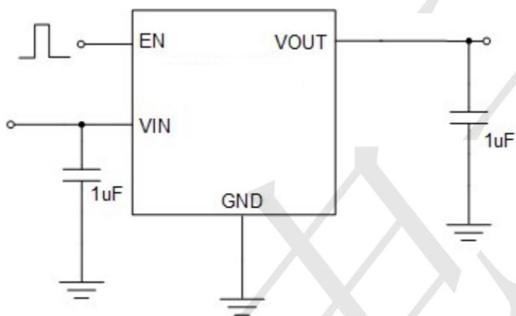
Application circuit of Fixed V OUT LDO with enable function

# Typical Operating Characteristics

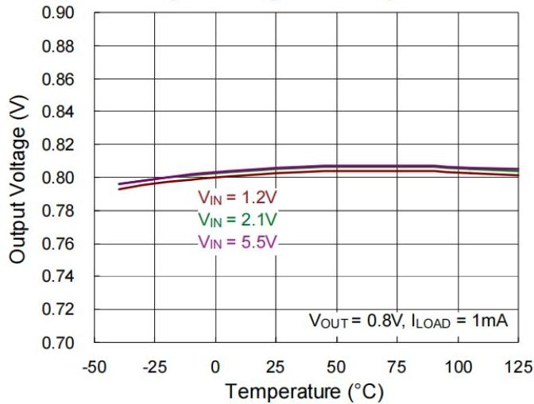
Output Voltage vs. Temperature

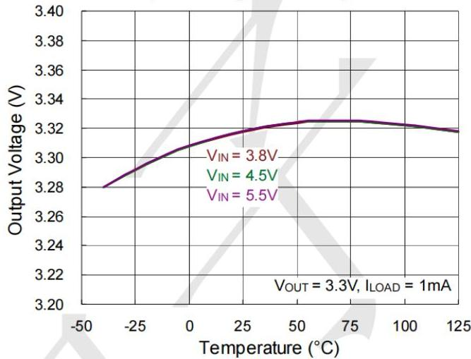
Output Voltage vs. Temperature

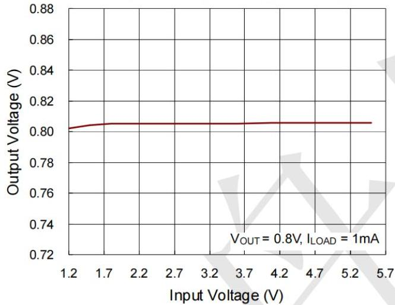
Output Voltage vs. Input Voltage

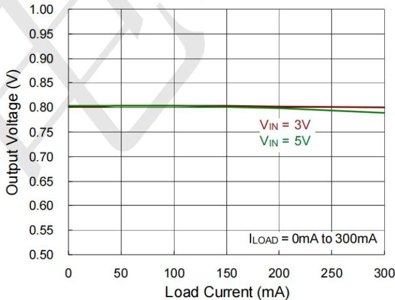
Output Voltage vs. Load Current

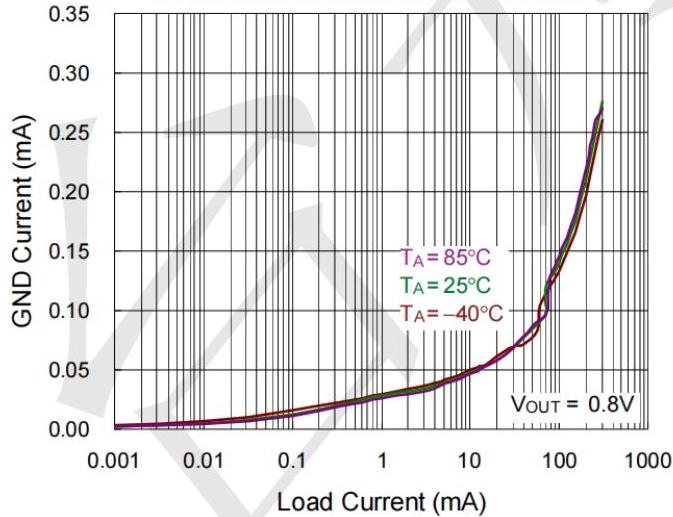
Ground Current vs. Load Current

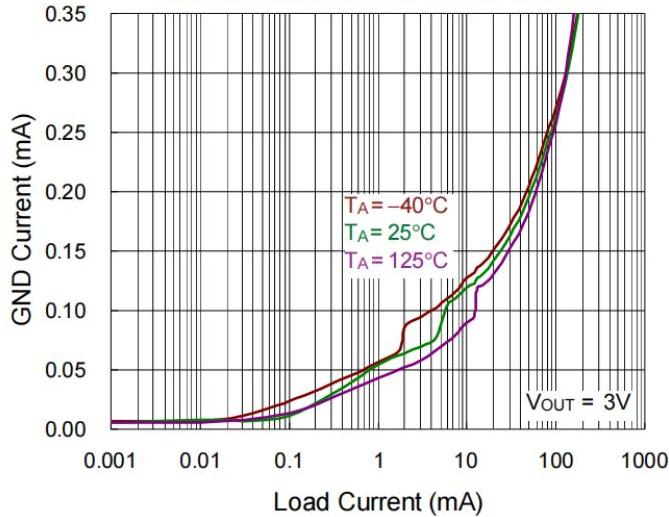
Ground Current vs. Load Current

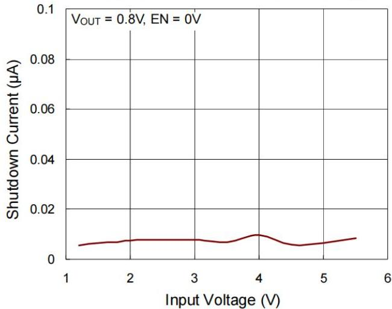
Shutdown Current vs. Input Voltage

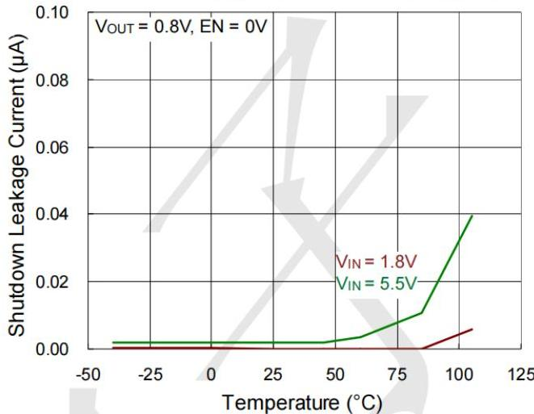
Shutdown Leakage Current vs. Temperature

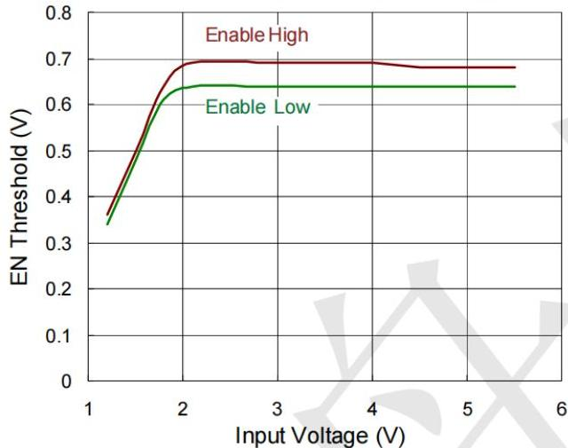
EN Threshold vs. Input Voltage

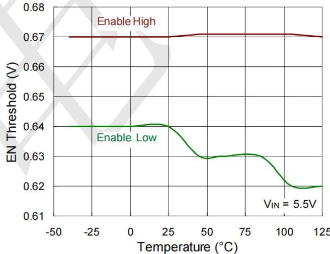
EN Threshold vs. Temperature

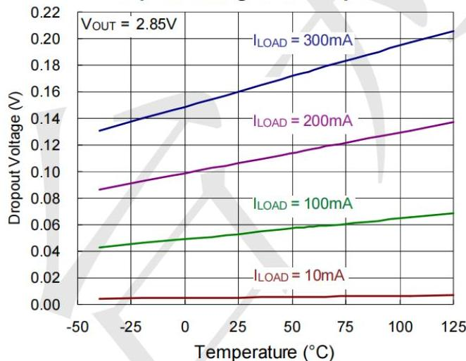
Dropout Voltage vs. Temperature

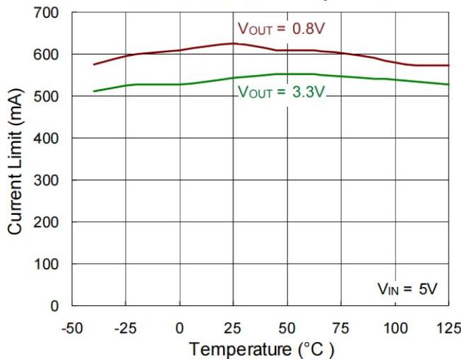
Current Limit vs. Temperature

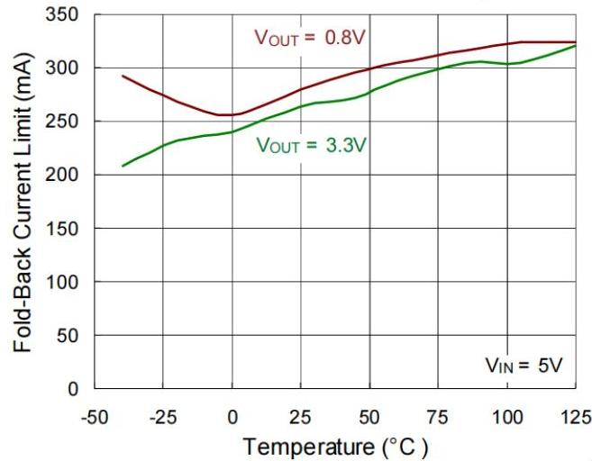
Fold-Back Current Limit vs. Temperature

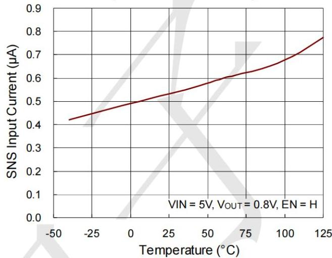
SNS Input Current vs. Temperature

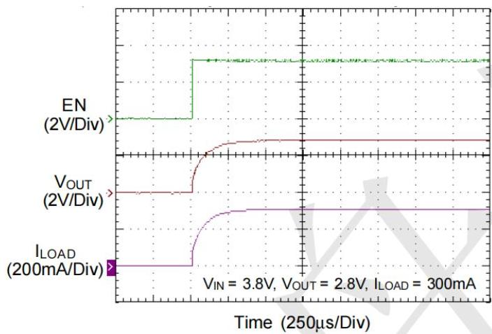
Power On from EN

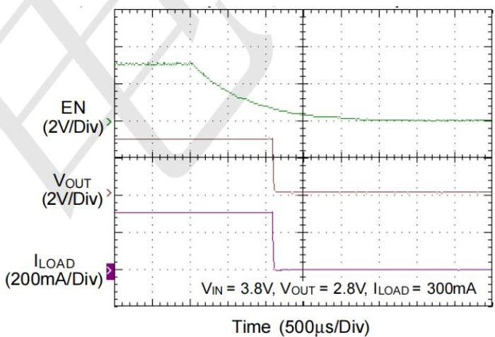
Power Off from EN

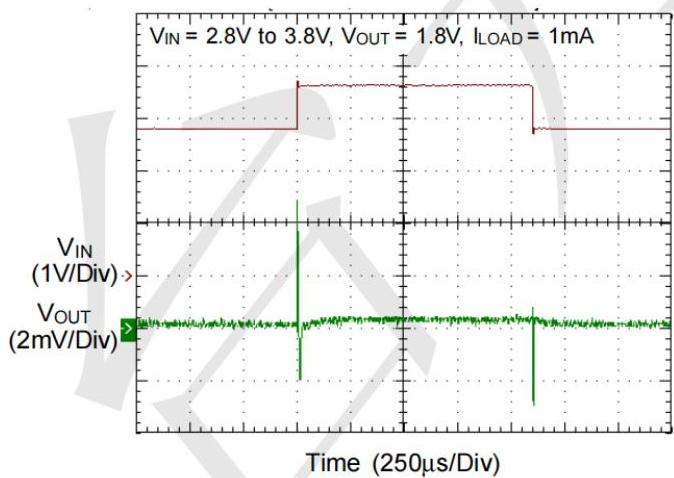
Line Transient

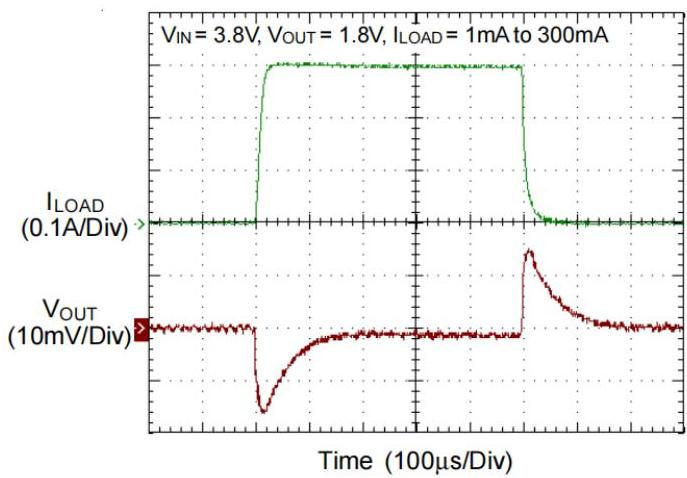
Load Transient

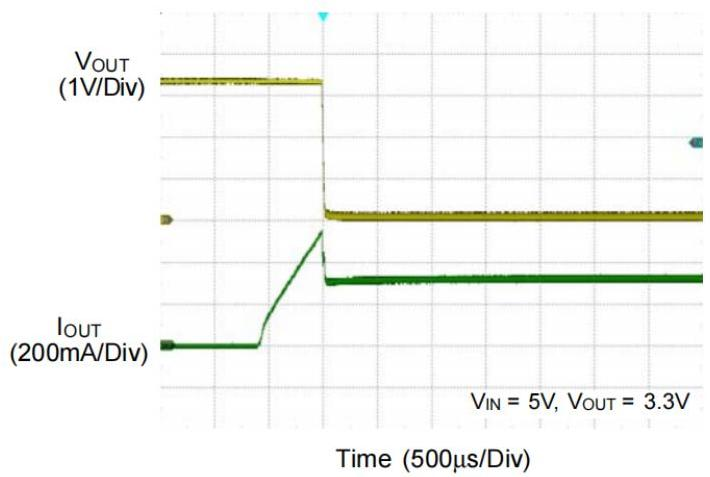
Output Current Limit Protection

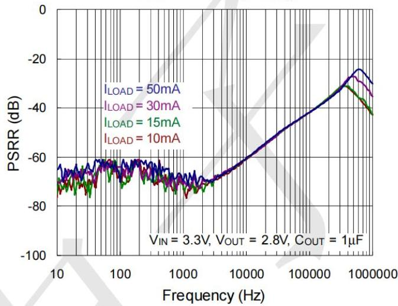
PSRR vs. Frequency

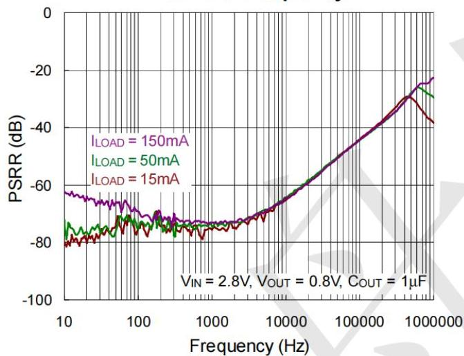
PSRR vs. Frequency

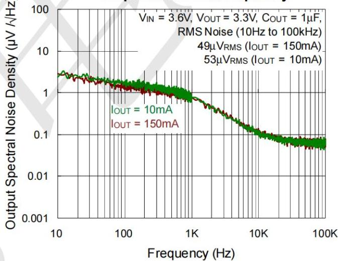
Output Noise vs. Frequency

# Package information

3-pin SOT23-5 Outline Dimensions

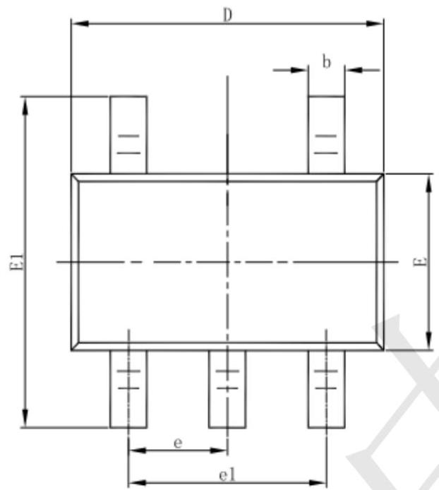
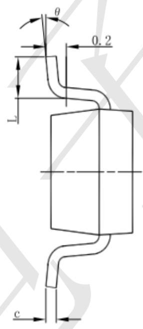
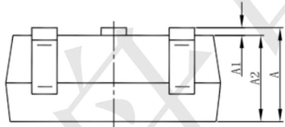

|  Symbol | Dimensions In Millimeters |   | Dimensions In Inches  |   |
| --- | --- | --- | --- | --- |
|   |  Min | Max | Min | Max  |
|  A | 1.050 | 1.250 | 0.041 | 0.049  |
|  A1 | 0.000 | 0.100 | 0.000 | 0.004  |
|  A2 | 1.050 | 1.150 | 0.041 | 0.045  |
|  b | 0.300 | 0.500 | 0.012 | 0.020  |
|  c | 0.100 | 0.200 | 0.004 | 0.008  |
|  D | 2.820 | 3.020 | 0.111 | 0.119  |
|  E | 1.500 | 1.700 | 0.059 | 0.067  |
|  E1 | 2.650 | 2.950 | 0.104 | 0.116  |
|  e | 0.950(BSC) |   | 0.037(BSC)  |   |
|  e1 | 1.800 | 2.000 | 0.071 | 0.079  |
|  L | 0.300 | 0.600 | 0.012 | 0.024  |
|  θ | 0° | 8° | 0° | 8°  |

