# OPAx134 高性能 SoundPlus™ 音频运算放大器

## 1 特性

- 出色的音质
- 超低失真：0.00008%
- 低噪声：8nV/√Hz
- 真 FET 输入：I_B = 5pA
- 高速：
- 压摆率：20V/μs
- 带宽：8MHz
- 高开环增益：120dB (2kΩ)
- 宽电源电压范围：±2.5V 至 ±18V
- 单通道、双通道和四通道版本

## 2 应用

- 专业音频和音乐
- 线路驱动器
- 线路接收器
- 多媒体音频
- 有源滤波器
- 前置放大器
- 积分器
- 交叉网络

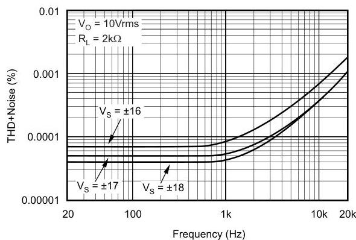
THD + 噪声与频率间的关系

## 3 说明

OPA134、OPA2134 和 OPA4134 (OPAx134) 系列为超低失真、低噪声运算放大器，完全适用于音频应用。包含的真正 FET 输入级提供出色的音质和速度，可实现出色的音频性能。该特性搭配高输出驱动能力和出色的直流性能，使得该系列运算放大器适用于各种严苛的应用。此外，OPAx134 系列器件还具有宽输出摆幅（摆动至电源轨的 1V 范围内），从而可增加余量，是任何音频电路的理想选择。

OPAx134 SoundPlus™ 音频运算放大器易于使用，而且不存在常见 FET 输入运算放大器中经常会出现的相位反转和过载问题。该系列器件可由 ±2.5V 至 ±18V 电源供电。输入共源共栅电路提供出色的共模抑制，并在宽输入电压范围内保持低输入偏置电流，从而尽可能减少失真。OPAx134 系列运算放大器是单位增益稳定型放大器，可在宽负载条件范围（包括高负载电容）内提供出色的动态行为。双通道和四通道版本具有完全独立的电路，即使在过驱或过载时，也可尽可能减少串扰并消除相互干扰。

单通道和双通道版本采用 8 引脚 DIP 和 SO-8 表面贴装封装（标准配置）。四通道版本采用 SO-14 表面贴装封装。所有器件的额定工作温度范围为 -40°C 至 +85°C。SPICE 宏模型可用于设计分析。

器件信息

|  器件型号 | 通道数 | 封装(1)  |
| --- | --- | --- |
|  OPA134 | 单通道 | D (SOIC, 8)  |
|   |   |  P (PDIP, 8)  |
|  OPA2134 | 双通道 | D (SOIC, 8)  |
|   |   |  P (PDIP, 8)  |
|  OPA4134 | 四通道 | D (SOIC, 14)  |

(1) 有关更多信息，请参阅节 10。

# Table of Contents

1 特性...1
2 应用...1
3 说明...1
4 Pin Configuration and Functions...3
5 Specifications...5
5.1 Absolute Maximum Ratings...5
5.2 ESD Ratings...5
5.3 Recommended Operating Conditions...5
5.4 Thermal Information - OPA134...6
5.5 Thermal Information - OPA2134...6
5.6 Thermal Information - OPA4134...6
5.7 Electrical Characteristics...7
5.8 Typical Characteristics...9
6 Detailed Description...13
6.1 Overview...13
6.2 Feature Description...13
6.3 Functional Block Diagram...15
6.4 Device Functional Modes...15
7 Application and Implementation...16
7.1 Application Information...16
7.2 Typical Application...17
7.3 Power Supply Recommendations...18
7.4 Layout...18
8 Device and Documentation Support...20
8.1 Device Support...20
8.2 Documentation Support...20
8.3 接收文档更新通知...20
8.4 支持资源...20
8.5 Trademarks...20
8.6 静电放电警告...21
8.7 术语表...21
9 Revision History...21
10 Mechanical, Packaging, and Orderable Information...22

# 4 Pin Configuration and Functions

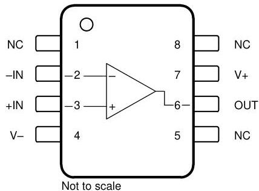
图 4-1. OPA134: D Package, 8-Pin SOIC, and P Package, 8-Pin PDIP (Top View)

Pin Functions: OPA134

|  PIN |   | TYPE | DESCRIPTION  |
| --- | --- | --- | --- |
|  NAME | NO.  |   |   |
|  +IN | 3 | Input | Noninverting input  |
|  - IN | 2 | Input | Inverting input  |
|  NC | 1, 5 | — | Do not connect these pins(1)  |
|  NC | 8 | — | No internal connection. Float this pin.  |
|  Output | 6 | Output | Output  |
|  V+ | 7 | Power | Positive power supply  |
|  V - | 4 | Power | Negative power supply  |

(1) Existing layouts for the OPA134 before revision B of this data sheet do not need to be redesigned.

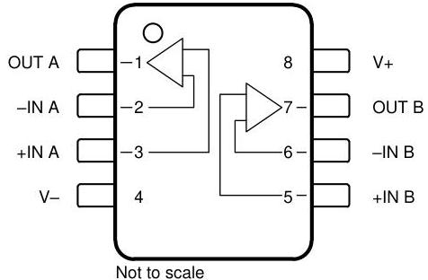
图 4-2. OPA2134: D Package, 8-Pin SOIC, and P Package, 8-Pin PDIP (Top View)

表 4-1. Pin Functions: OPA2134

|  PIN |   | TYPE | DESCRIPTION  |
| --- | --- | --- | --- |
|  NAME | NO.  |   |   |
|  +IN A | 3 | Input | Noninverting input, channel A  |
|  +IN B | 5 | Input | Noninverting input, channel B  |
|  - IN A | 2 | Input | Inverting input, channel A  |
|  - IN B | 6 | Input | Inverting input, channel B  |
|  OUT A | 1 | Output | Output, channel A  |
|  OUT B | 7 | Output | Output, channel B  |
|  V+ | 8 | Power | Positive (highest) power supply  |
|  V - | 4 | Power | Negative (lowest) power supply  |

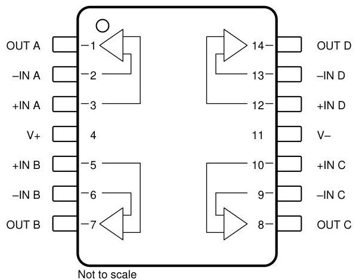
图 4-3. OPA4134: D Package, 14-Pin SOIC (Top View)

表 4-2. Pin Functions: OPA4134

|  PIN |   | TYPE | DESCRIPTION  |
| --- | --- | --- | --- |
|  NAME | NO.  |   |   |
|  +IN A | 3 | Input | Noninverting input, channel A  |
|  +IN B | 5 | Input | Noninverting input, channel B  |
|  +IN C | 10 | Input | Noninverting input, channel C  |
|  +IN D | 12 | Input | Noninverting input, channel D  |
|  - IN A | 2 | Input | Inverting input, channel A  |
|  - IN B | 6 | Input | Inverting input, channel B  |
|  - IN C | 9 | Input | Inverting input, channel C  |
|  - IN D | 13 | Input | Inverting input, channel D  |
|  OUT A | 1 | Output | Output, channel A  |
|  OUT B | 7 | Output | Output, channel B  |
|  OUT C | 8 | Output | Output, channel C  |
|  OUT D | 14 | Output | Output, channel D  |
|  V+ | 4 | Power | Positive (highest) power supply  |
|  V- | 11 | Power | Negative (lowest) power supply  |

# 5 Specifications

## 5.1 Absolute Maximum Ratings

over operating free-air temperature range (unless otherwise noted)(1)

|   |   |   | MIN | MAX | UNIT  |
| --- | --- | --- | --- | --- | --- |
|  VS | Supply voltage, (V+) - (V - ) | Single supply | 36 |   | V  |
|   | Input voltage(2) |   | (V-) - 0.5 | (V+) + 0.5 | V  |
|   | Input current(2) |   | ±10 |   | mA  |
|  ISC | Output short-circuit(3) |   | Continuous |   |   |
|  TA | Operating temperature |   | -40 | 125 | °C  |
|  TJ | Junction temperature |   | 150 |   | °C  |
|  Tstg | Storage temperature |   | -55 | 125 | °C  |

(1) Operation outside the Absolute Maximum Ratings may cause permanent device damage. Absolute Maximum Ratings do not imply functional operation of the device at these or any other conditions beyond those listed under Recommended Operating Conditions. If used outside the Recommended Operating Conditions but within the Absolute Maximum Ratings, the device may not be fully functional, and this may affect device reliability, functionality, performance, and shorten the device lifetime.
(2) Input pins are diode-clamped to the power-supply rails. Input signals that can swing more than 0.5V beyond the supply rails must be current limited to 10mA or less.
(3) Short-circuit to ground, one amplifier per package.

## 5.2 ESD Ratings

|   |   |   | VALUE | UNIT  |
| --- | --- | --- | --- | --- |
|  OPA134 in SOIC and PDIP Packages, and OPA2134 in PDIP Package  |   |   |   |   |
|  V(ESD) | Electrostatic discharge | Human-body model (HBM), per ANSI/ESDA/JEDEC JS-001(1) | ±2000 | V  |
|  OPA2134 in SOIC Package  |   |   |   |   |
|  V(ESD) | Electrostatic discharge | Human-body model (HBM), per ANSI/ESDA/JEDEC JS-001(1) | ±2000 | V  |
|   |   |  Charged-device model (CDM), per JEDEC specification JESD22-C101(2) | ±500  |   |
|  OPA4134 in SOIC Package  |   |   |   |   |
|  V(ESD) | Electrostatic discharge | Human-body model (HBM), per ANSI/ESDA/JEDEC JS-001(1) | ±2000 | V  |
|   |  Electrostatic discharge | Charged-device model (CDM), per JEDEC specification JESD22-C101(2) | ±200  |   |

(1) JEDEC document JEP155 states that 500V HBM allows safe manufacturing with a standard ESD control process.
(2) JEDEC document JEP157 states that 250V CDM allows safe manufacturing with a standard ESD control process.

## 5.3 Recommended Operating Conditions

over operating free-air temperature range (unless otherwise noted)

|   |   |   | MIN | NOM | MAX | UNIT  |
| --- | --- | --- | --- | --- | --- | --- |
|  VS | Supply voltage, (V+) - (V - ) | Dual supply | ±2.5 | ±15 | ±18 | V  |
|   |   |  Single supply | 5 | 30 | 36  |   |
|  TA | Ambient temperature |   | -40 |  | +85 | °C  |

5.4 Thermal Information - OPA134

|  THERMAL METRIC(1) | OPA134 |   | UNIT  |   |
| --- | --- | --- | --- | --- |
|   |   |  D (SOIC) |   | P (PDIP)  |
|   |   |  8 PINS |   | 8 PINS  |
|  R H JA | Junction-to-ambient thermal resistance | 160 | 73 | °C/W  |
|  R H JC(top) | Junction-to-case (top) thermal resistance | 75 | 50 | °C/W  |
|  R H JB | Junction-to-board thermal resistance | 60 | 36 | °C/W  |
|  1/P JT | Junction-to-top characterization parameter | 9 | 17 | °C/W  |
|  1/P JB | Junction-to-board characterization parameter | 50 | 35 | °C/W  |
|  R H JC(bot) | Junction-to-case (bottom) thermal resistance | N/A | N/A | °C/W  |

(1) For more information about traditional and new thermal metrics, see the Semiconductor and IC Package Thermal Metrics application report.

5.5 Thermal Information - OPA2134

|  THERMAL METRIC(1) | OPA2134 |   | UNIT  |   |
| --- | --- | --- | --- | --- |
|   |   |  D (SOIC) |   | P (PDIP)  |
|   |   |  8 PINS |   | 8 PINS  |
|  R H JA | Junction-to-ambient thermal resistance | 160 | 71 | °C/W  |
|  R H JC(top) | Junction-to-case (top) thermal resistance | 75 | 50 | °C/W  |
|  R H JB | Junction-to-board thermal resistance | 60 | 36 | °C/W  |
|  1/P JT | Junction-to-top characterization parameter | 9 | 16 | °C/W  |
|  1/P JB | Junction-to-board characterization parameter | 50 | 35 | °C/W  |
|  R H JC(bot) | Junction-to-case (bottom) thermal resistance | N/A | N/A | °C/W  |

(1) For more information about traditional and new thermal metrics, see the Semiconductor and IC Package Thermal Metrics application report.

5.6 Thermal Information - OPA4134

|  THERMAL METRIC(1) | OPA4132 | UNIT  |   |
| --- | --- | --- | --- |
|   |   |   |  D (SOIC)  |
|   |   |   |  14 PINS  |
|  R H JA | Junction-to-ambient thermal resistance | 97 | °C/W  |
|  R H JC(top) | Junction-to-case (top) thermal resistance | 56 | °C/W  |
|  R H JB | Junction-to-board thermal resistance | 53 | °C/W  |
|  1/P JT | Junction-to-top characterization parameter | 19 | °C/W  |
|  1/P JB | Junction-to-board characterization parameter | 46 | °C/W  |
|  R H JC(bot) | Junction-to-case (bottom) thermal resistance | N/A | °C/W  |

(1) For more information about traditional and new thermal metrics, see the Semiconductor and IC Package Thermal Metrics application report.

# 5.7 Electrical Characteristics

at  $T_{A} = 25^{\circ}C$ ,  $V_{S} = \pm 15V$ ,  $R_{L} = 2k\Omega$  connected to midsupply, and  $V_{CM} = V_{OUT} =$  midsupply (unless otherwise noted)

|  PARAMETER |   | TEST CONDITIONS |   | MIN | TYP | MAX | UNIT  |
| --- | --- | --- | --- | --- | --- | --- | --- |
|  AUDIO PERFORMANCE  |   |   |   |   |   |   |   |
|  THD+N | Total harmonic distortion plus noise | f = 1kHz, G = 1, V0 = 3Vrms | RL = 2kΩ | 0.00008 |   |   | %  |
|   |   |   |  RL = 600Ω | 0.00015  |   |   |   |
|   | Intermodulation distortion | f = 1kHz, G = 1, V0 = 1VPP |   | -98 |   |   | dB  |
|   | Headroom(1) | THD < 0.01%, RL = 2kΩ, VS = 18V |   | 21.3 |   |   | dBu  |
|  FREQUENCY RESPONSE  |   |   |   |   |   |   |   |
|  GBW | Gain bandwidth product |  |   | 8 |   |   | MHz  |
|  SR | Slew rate(2) |  |   | ±20 |   |   | V/μs  |
|   | Settling time | 10V step, G = 1, CL = 100pF | 0.1% | 0.7 |   |   | μs  |
|   |   |   |  0.01% | 1  |   |   |   |
|  FPBW | Full power bandwidth |  |   | 1.3 |   |   | MHz  |
|   | Overload recovery time | VIN × G = VS |   | 0.6 |   |   | μs  |
|  NOISE  |   |   |   |   |   |   |   |
|   | Input voltage noise | f = 20Hz to 20kHz |   | 1.2 |   |   | μVrms  |
|  en | Input voltage noise density | f = 1kHz |   | 8 |   |   | nV/√Hz  |
|  In | Input current noise density | f = 1kHz |   | 3 |   |   | fA/√Hz  |
|  OFFSET VOLTAGE  |   |   |   |   |   |   |   |
|  VOS | Input offset voltage |  |   | ±1 ±3.5 |   |   | mV  |
|   |   |  TA = -40°C to +85°C |   | ±1  |   |   |   |
|  dVOS/dT | Input offset voltage drift | TA = -40°C to +85°C |   | ±2 |   |   | μV/°C  |
|  PSRR | Power-supply rejection ratio | 5V ≤ VS ≤ 36V |   | 90 | 106 |   | dB  |
|   | Channel separation (dual, quad) | DC, RL = 2kΩ |   | 128 |   |   | dB  |
|   |   |  f = 20kHz, RL = 2kΩ |   | 126  |   |   |   |
|  INPUT BIAS CURRENT  |   |   |   |   |   |   |   |
|  IB | Input bias current(3) |  |   | ±5 ±100 |   |   | pA  |
|   |   |  TA = -40°C to +85°C |   | See ¶ 5.8 ±5 |   |   | nA  |
|  IOS | Input offset current(3) |  |   | ±2 ±50 |   |   | pA  |
|  INPUT VOLTAGE  |   |   |   |   |   |   |   |
|  VCM | Common-mode voltage |  |   | (V-) + 2.5 ±13 (V+) - 3.5 |   |   | V  |
|  CMRR | Common-mode rejection ratio | -12.5V ≤ VCM ≤ 11.5V |  | 86 100 |   |   | dB  |
|   |   |   |  TA = -40°C to +85°C | 90  |   |   |   |
|  INPUT IMPEDANCE  |   |   |   |   |   |   |   |
|   | Differential |  |   | 10^13 || 8 |   |   | Ω || pF  |
|   | Common-mode | -12.5V ≤ VCM ≤ 11.5V |   | 10^13 || 6 |   |   | Ω || pF  |
|  OPEN-LOOP GAIN  |   |   |   |   |   |   |   |
|  AOL | Open-loop voltage gain | RL = 10kΩ, -14.5V ≤ V0 ≤ 13.8V |   | 104 | 120 |   | dB  |
|   |   |  RL = 2kΩ, -13.8V ≤ V0 ≤ 13.5V |   | 104 | 120  |   |   |

# 5.7 Electrical Characteristics (续)

at  $T_{A} = 25^{\circ}C$ ,  $V_{S} = \pm 15V$ ,  $R_{L} = 2k\Omega$  connected to midsupply, and  $V_{CM} = V_{OUT} =$  midsupply (unless otherwise noted)

|  PARAMETER |   | TEST CONDITIONS |   | MIN | TYP | MAX | UNIT  |
| --- | --- | --- | --- | --- | --- | --- | --- |
|  OUTPUT  |   |   |   |   |   |   |   |
|  VO | Voltage output | RL=10kΩ | Positive | (V+) - 1.2 |   |   | V  |
|   |   |   |  Negative | (V-) + 0.5  |   |   |   |
|   |   |  RL=2kΩ | Positive | (V+) - 1.5  |   |   |   |
|   |   |   |  Negative | (V-) + 1.2  |   |   |   |
|  ISC | Short-circuit current | Sourcing |   | 36 |   |   | mA  |
|   |   |  Sinking |   | -30  |   |   |   |
|  ZO | Output impedance | f = 10kHz | Closed-loop(4) | 0.01 |   |   | Ω  |
|   |   |   |  Open-loop | 10  |   |   |   |
|   | Capacitive load drive | Stable operation |   | See Typical Characteristics |   |   |   |
|  POWER SUPPLY  |   |   |   |   |   |   |   |
|  IQ | Quiescent current (per amplifier) | IO = 0mA |   | 4 |   |   | mA  |

(1)  $\mathrm{dBu} = 20 \times \log \left( V_{\text{rms}} / 0.7746 \right)$  where  $V_{\text{rms}}$  is the maximum output voltage for which THD+Noise is less than  $0.01\%$ . See Total Harmonic Distortion.
(2) Proposed by design.
(3) High-speed test at  $T_{J} = 25^{\circ}C$ .
(4) See Closed-Loop Output Impedance vs Frequency in Typical Characteristics.

# 5.8 Typical Characteristics

at $T_{A} = 25^{\circ}C$, $V_{S} = \pm 15V$, $R_{L} = 2k\Omega$ connected to midsupply, and $V_{CM} = V_{OUT} =$ midsupply (unless otherwise noted)

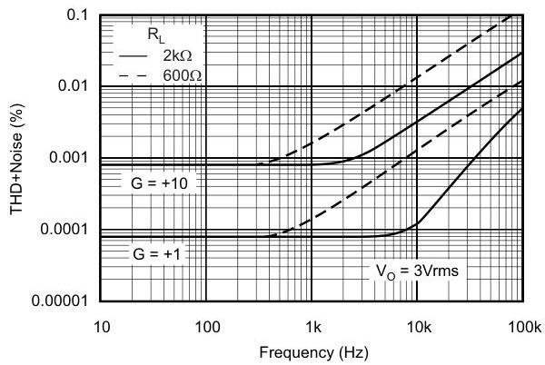
图 5-1. Total Harmonic Distortion + Noise vs Frequency

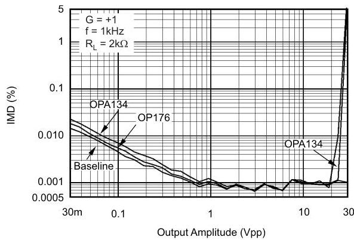
图 5-2. SMPTE Intermodulation Distortion vs Output Amplitude

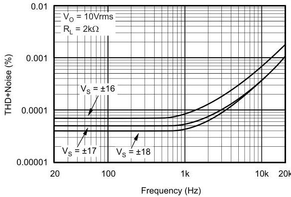
图 5-3. Total Harmonic Distortion + Noise vs Frequency

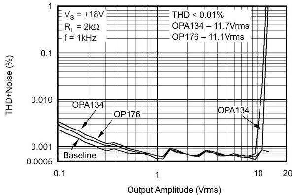
图 5-4. Headroom - Total Harmonic Distortion + Noise vs Output Amplitude

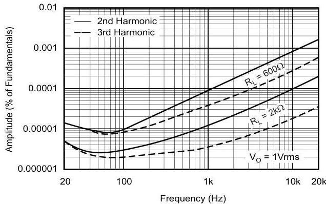
图 5-5. Harmonic Distortion + Noise vs Frequency

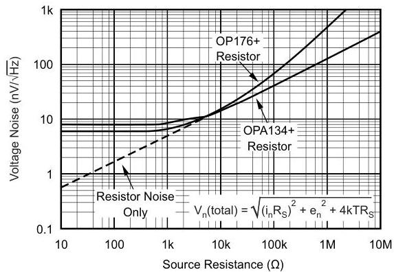
图 5-6. Voltage Noise vs Source Resistance

# 5.8 Typical Characteristics (continued)

at $T_{\mathrm{A}} = 25^{\circ}\mathrm{C}$, $V_{\mathrm{S}} = \pm 15\mathrm{V}$, $R_{\mathrm{L}} = 2\mathrm{k}\Omega$ connected to midsupply, and $V_{\mathrm{CM}} = V_{\mathrm{OUT}} =$ midsupply (unless otherwise noted)

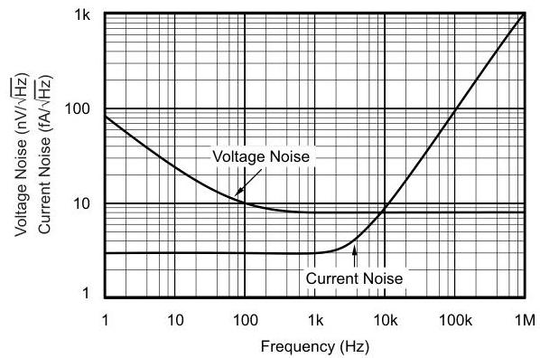
图 5-7. Input Voltage and Current Noise Spectral Density vs Frequency

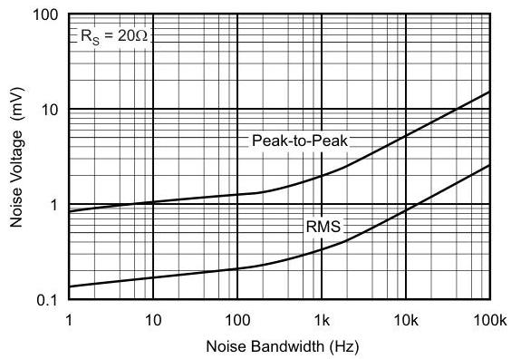
图 5-8. Input-Referred Noise Voltage vs Noise Bandwidth

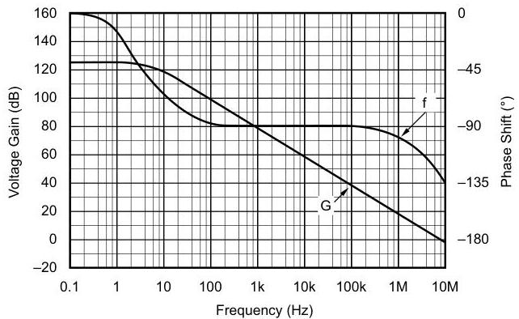
图 5-9. Open-Loop Gain and Phase vs Frequency

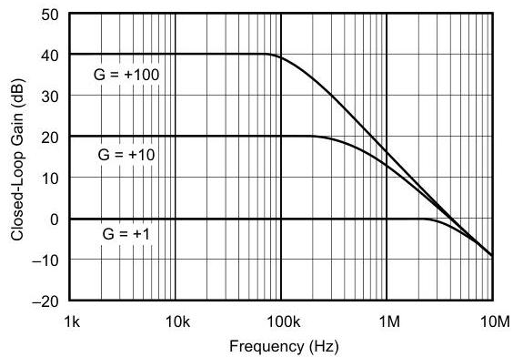
图 5-10. Closed-Loop Gain vs Frequency

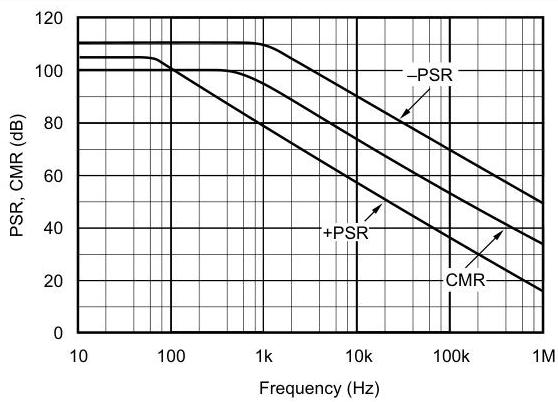
图 5-11. Power Supply and Common-Mode Rejection vs Frequency

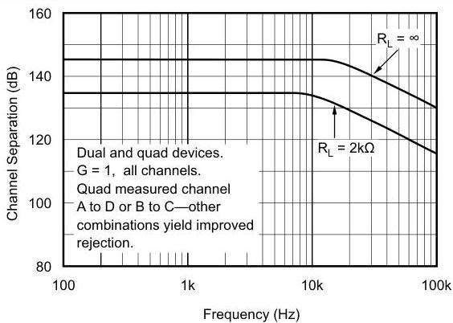
图 5-12. Channel Separation vs Frequency

# 5.8 Typical Characteristics (continued)

at $T_{\mathrm{A}} = 25^{\circ}\mathrm{C}$, $V_{\mathrm{S}} = \pm 15\mathrm{V}$, $R_{\mathrm{L}} = 2\mathrm{k}\Omega$ connected to midsupply, and $V_{\mathrm{CM}} = V_{\mathrm{OUT}} =$ midsupply (unless otherwise noted)

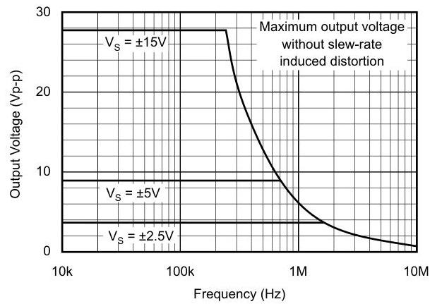
图 5-13. Maximum Output Voltage vs Frequency

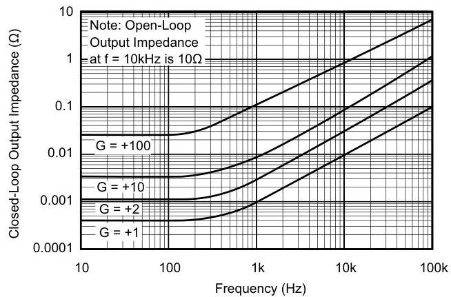
图 5-14. Closed-Loop Output Impedance vs Frequency

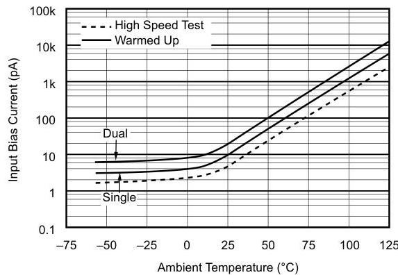
图 5-15. Input Bias Current vs Temperature

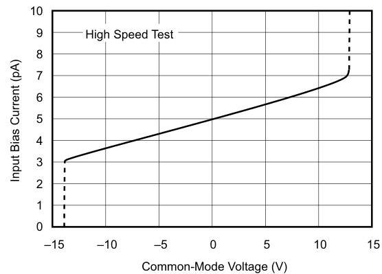
图 5-16. Input Bias Current vs Input Common-Mode Voltage

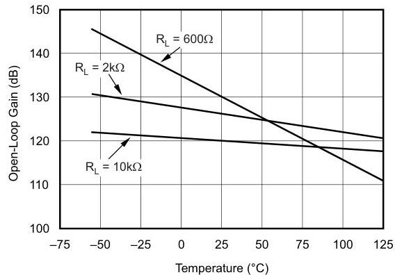
图 5-17. Open-Loop Gain vs Temperature

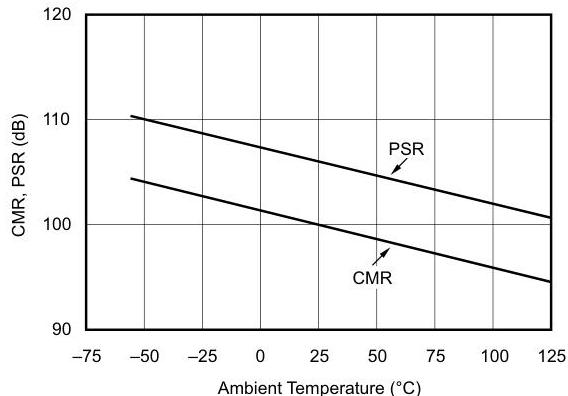
图 5-18. CMR, PSR vs Temperature

# 5.8 Typical Characteristics (continued)

at  $T_{A} = 25^{\circ}C$ ,  $V_{S} = \pm 15V$ ,  $R_{L} = 2k\Omega$  connected to midsupply, and  $V_{CM} = V_{OUT} =$  midsupply (unless otherwise noted)

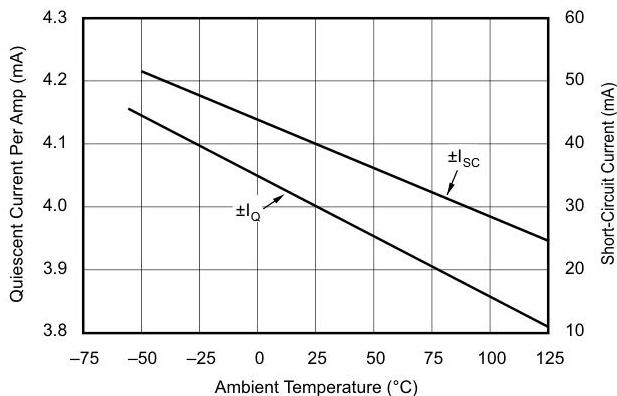
图5-19. Quiescent Current and Short-Circuit Current vs Temperature

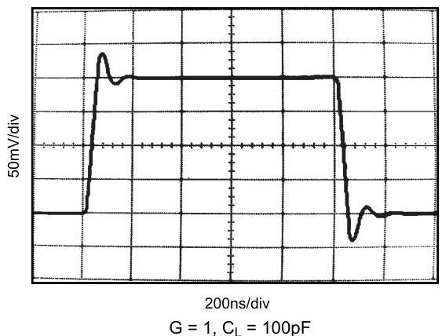
图5-20. Small-Signal Step Response

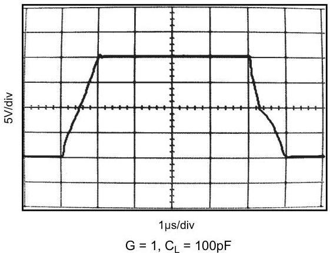
图5-21. Large-Signal Step Response

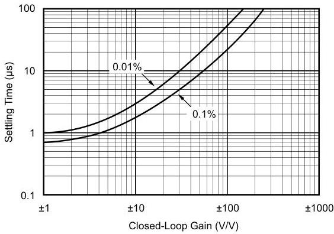
图5-22. Settling Time vs Closed-Loop Gain

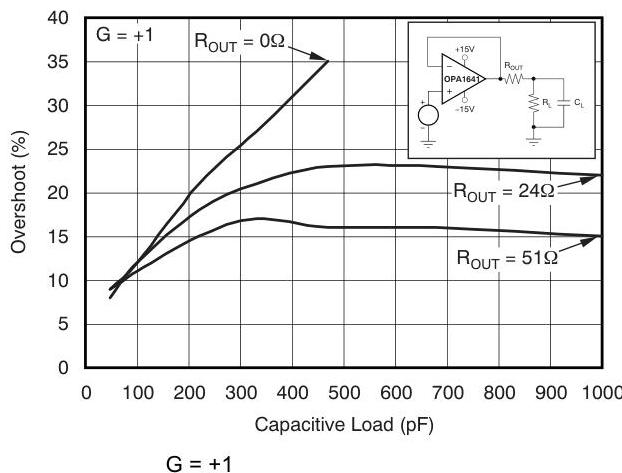
图5-23. Small-Signal Overshoot vs Load Capacitance
图5-24. Small-Signal Overshoot vs Load Capacitance

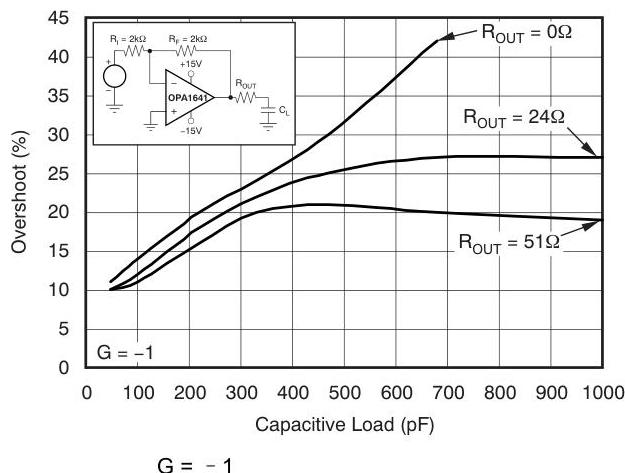

# 6 Detailed Description

## 6.1 Overview

The OPA134 series are ultra-low distortion, low-noise operational amplifiers fully specified for audio applications. A true FET input stage is incorporated to provide unmatched sound quality and speed for exceptional audio performance. This, in combination with high output drive capability and excellent DC performance, allows for use in a wide variety of demanding applications. In addition, the OPA134 has a wide output swing, to within 1V of the rails, allowing increased headroom and making this op amp an excellent choice for any audio circuit.

## 6.2 Feature Description

### 6.2.1 Total Harmonic Distortion

The OPAx134 series of operational amplifiers have excellent distortion characteristics. THD+Noise is below 0.0004% throughout the audio frequency range, 20Hz to 20kHz, with a 2k Ω load. In addition, distortion remains relatively flat through the wide output voltage swing range, providing increased headroom compared to other audio amplifiers, including the OP176/275.

Headroom is a subjective measurement, and can be thought of as the maximum output amplitude allowed while still maintaining a low level of distortion. In an attempt to quantify headroom, TI defines very low distortion as 0.01%. Headroom is expressed as a ratio which compares the maximum allowable output voltage level to a standard output level (1mW into 600 Ω, or 0.7746Vrms). Therefore, OPA134 series of operational amplifiers, which have a maximum allowable output voltage level of 11.7Vrms (THD+Noise &lt; 0.01%), have a headroom specification of 23.6dBu. See 5-4.

## 6.2.2 Distortion Measurements

The distortion produced by OPAx134 series of operational amplifiers is below the measurement limit of all known commercially-available equipment. However, a special test circuit can extend the measurement capabilities.

Operational amplifier distortion can be considered an internal error source which can be referred to the input. 图6-1 shows a circuit which causes the operational amplifier distortion to be 101 times greater than that which the operational amplifier normally produces. The addition of  $\mathsf{R}_3$  to the otherwise standard non-inverting amplifier configuration alters the feedback factor or noise gain of the circuit. The closed-loop gain is unchanged, but the feedback available for error correction is reduced by a factor of 101, thus extending the resolution by 101. The input signal and load applied to the operational amplifier are the same as with conventional feedback without  $\mathsf{R}_3$ . Keep the value of  $\mathsf{R}_3$  small to minimize effect on the distortion measurements.

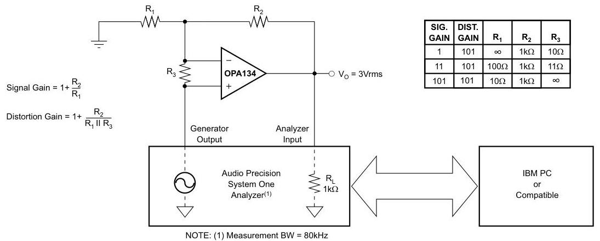
图6-1. Distortion Test Circuit

This technique can be verified by duplicating measurements at high gain or high frequency, where the distortion is within the measurement capability of the test equipment. Measurements for this data sheet were made with an Audio Precision distortion and noise analyzer, which greatly simplifies repetitive measurements. The measurement technique can, however, be performed with manual distortion measurement instruments.

## 6.2.3 Source Impedance and Distortion

For lowest distortion with a source or feedback network with an impedance greater than  $2\mathrm{k}\Omega$ , match the impedance seen by the positive and negative inputs in noninverting applications. The p-channel JFETs in the FET input stage exhibit a varying input capacitance with applied common-mode input voltage. In inverting configurations, the input does not vary with input voltage, because the inverting input is held at virtual ground. However, in noninverting applications the inputs do vary, and the gate-to-source voltage is not constant. The effect is increased distortion due to the varying capacitance for unmatched source impedances greater than  $2\mathrm{k}\Omega$ .

To maintain low distortion, match unbalanced source impedance with the appropriate values in the feedback network as shown in 图6-2. Of course, the unbalanced impedance can be from gain-setting resistors in the feedback path. If the parallel combination of  $\mathsf{R}_1$  and  $\mathsf{R}_2$  is greater than  $2\mathrm{k}\Omega$ , use a matching impedance on the noninverting input. As always, minimize resistor values to reduce the effects of thermal noise.

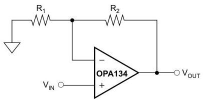
If  $R_{S} &gt; 2k\Omega$  or  $R_{1}\parallel R_{2} &gt; 2k\Omega$ $R_{S} = R_{1}\parallel R_{2}$

# 6.2.4 Phase Reversal Protection

The OPAx134 series of operational amplifiers are free from output phase-reversal problems. Many audio operational amplifiers, such as the OP176, exhibit phase-reversal of the output when the input common-mode voltage range is exceeded. This can occur in voltage-follower circuits, causing serious problems in control loop applications. The OPA134 series operational amplifiers are free from this undesirable behavior even with inputs of 10V beyond the input common-mode range.

# 6.2.5 Output Current Limit

Output current is limited by internal circuitry to approximately sourcing 36mA and sinking - 30mA at  $25^{\circ}\mathrm{C}$ . The limit current decreases with increasing temperature, as shown in 图 5-19.

# 6.3 Functional Block Diagram

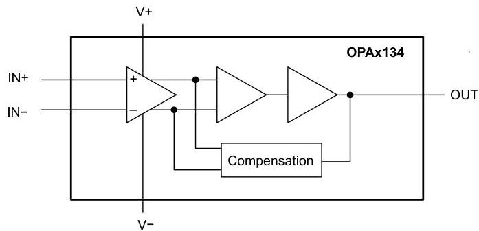
Fig 6-2. Impedance Matching for Maintaining Low Distortion in Noninverting Circuits

# 6.4 Device Functional Modes

# 6.4.1 Noise Performance

Circuit noise is determined by the thermal noise of external resistors and operational amplifier noise. Operational amplifier noise is described by two parameters: noise voltage and noise current. The total noise is quantified by the equation:

$$
V _ {n} (\text {t o t a l}) = \sqrt {e _ {n} ^ {2} + \left(i _ {n} R _ {S}\right) ^ {2} + 4 k T R _ {S}} \tag {1}
$$

With low source impedance, the current noise term is insignificant and voltage noise dominates the noise performance. At high source impedance, the current noise term becomes the dominant contributor.

Low-noise bipolar operational amplifiers such as the OPA27 and OPA37 provide low voltage noise at the expense of a higher current noise. However, OPAx134 series operational amplifiers provide both low voltage noise and low current noise. This provides optimum noise performance over a wide range of sources, including reactive source impedances; refer to 图 5-6. Above  $2\mathrm{k}\Omega$  source resistance, the operational amplifier contributes little additional noise; the voltage and current terms in the total noise equation become insignificant and the source resistance term dominates. Below  $2\mathrm{k}\Omega$ , operational amplifier voltage noise dominates over the resistor noise, but compares favorably with other audio operational amplifiers such as the OP176.

# 7 Application and Implementation

备注

以下应用部分中的信息不属于 TI 器件规格的范围，TI 不担保其准确性和完整性。TI 的客户应负责确定器件是否适用于其应用。客户应验证并测试其设计，以确保系统功能。

# 7.1 Application Information

The OPAx134 series operational amplifiers are unity-gain stable, and an excellent choice for a wide range of audio and general-purpose applications. All circuitry is independent in the dual version, maintaining normal behavior when one amplifier in a package is overdriven or short-circuited. Bypass the power supply pins with 10nF ceramic capacitors or larger to minimize power supply noise.

# 7.1.1 Operating Voltage

The OPAx134 series of operational amplifiers operate with power supplies from ±2.5V to ±18V with excellent performance. Although specifications are production tested with ±15V supplies, most behavior remains unchanged throughout the full operating voltage range. Parameters which vary significantly with operating voltage are shown in 表 5.8.

# 7.1.2 Offset Voltage Trim

Offset voltage of OPAx134 series amplifiers are laser-trimmed, and usually require no user adjustment. The OPAx134 provide less than ±2mV of input offset voltage and a typical input offset voltage drift of 10μV/°C over the operating temperature range.

## 7.2 Typical Application

The OPAx134 family offers outstanding dc precision and AC performance. These devices operate up to 36V supply rails and offer ultra-low distortion and noise, as well as 8MHz bandwidth and high capacitive load drive. These features make the OPAx134 a robust, high-performance operational amplifier for high-voltage professional audio applications.

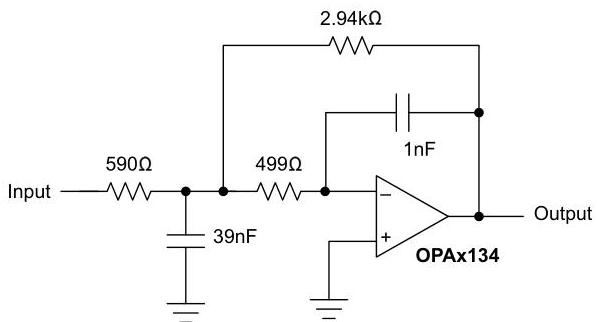
图 7-1. OPA134 2nd-Order, 30kHz, Low-Pass Filter Schematic

## 7.2.1 Design Requirements

- Gain = 5V/V (inverting)
- Low-pass cutoff frequency = 30kHz
- ~40db/dec filter response
- Maintain less than 3dB gain peaking in the gain versus frequency response

## 7.2.2 Detailed Design Procedure

The infinite-gain multiple-feedback circuit for a low-pass network function is shown in 图 7-1. The voltage transfer function is:

$$
\frac {\text {Output}}{\text {Input}} (s) = \frac {\frac {- 1}{R _ {1} R _ {3} C _ {2} C _ {5}}}{s ^ {2} + s \left(\frac {1}{C _ {2}}\right) \left(\frac {1}{R _ {1}} + \frac {1}{R _ {3}} + \frac {1}{R _ {4}}\right) + \left(\frac {1}{R _ {3} R _ {4} C _ {2} C _ {5}}\right)} \tag {2}
$$

This circuit produces a signal inversion. For this circuit, the gain at DC and the low-pass cutoff frequency are calculated using 方程式 3 and 方程式 4.

$$
G a i n = \frac {R _ {4}}{R _ {1}} \tag {3}
$$

$$
f _ {C} = \frac {1}{2 \pi} \sqrt {\frac {1}{R _ {3} R _ {4} C _ {2} C _ {5}}} \tag {4}
$$

WEBENCH® Circuit Designer creates customized power supply and active filter circuits based on your system requirements. The environment gives you end-to-end selection, design, and simulation capabilities that save you time during all phases of the analog design process.

Use our tools to help with your designs:

- Filter design tool
- Powerstage designer
- WEBENCH® Power designer
- PCB thermal calculator

## 7.2.3 Application Curve

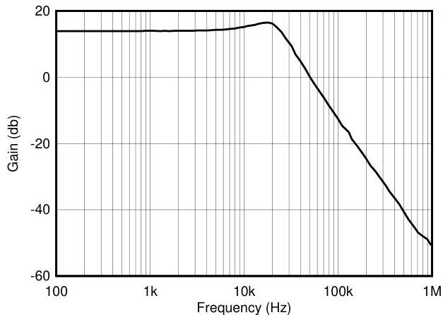
图 7-2. OPA134 2nd-Order, 30kHz, Low-Pass Filter Response

## 7.3 Power Supply Recommendations

The OPAx134 is specified for operation from 5V to 36V (±2.5V to ±18V); many specifications apply from -40°C to +85°C. Parameters that can exhibit significant variance with regard to operating voltage or temperature are presented in 表 5.8.

&gt; 小心
&gt; Supply voltages larger than 36V can permanently damage the device; see 表 5.1.

Place 10nF bypass capacitors close to the power-supply pins to reduce errors coupling in from noisy or high-impedance power supplies. For more detailed information on bypass capacitor placement, see 表 7.4.1.

## 7.4 Layout

### 7.4.1 Layout Guidelines

For best operational performance of the device, use good PCB layout practices, including:

- Noise can propagate into analog circuitry through the operational amplifier and the power pins of the circuit as a whole. Bypass capacitors are used to reduce the coupled noise by providing low-impedance power sources local to the analog circuitry.
- Connect low-ESR, 10nF ceramic bypass capacitors between each supply pin and ground, placed as close as possible to the device. A single bypass capacitor from V+ to ground is applicable for single-supply applications.
- Separate grounding for analog and digital portions of circuitry is one of the simplest and most-effective methods of noise suppression. One or more layers on multilayer PCBs are usually devoted to ground planes. A ground plane helps distribute heat and reduces EMI noise pickup. Make sure to physically separate digital and analog grounds paying attention to the flow of the ground current.
- To reduce parasitic coupling, run the input traces as far away from the supply or output traces as possible. If these traces cannot be kept separate, crossing the sensitive trace perpendicular is much better as opposed to in parallel with the noisy trace.
- Place the external components as close to the device as possible. As shown in 表 7.4.2, keeping RF and RG close to the inverting input minimizes parasitic capacitance.
- Keep the length of input traces as short as possible. Always remember that the input traces are the most sensitive part of the circuit.
- Consider a driven, low-impedance guard ring around the critical traces. A guard ring can significantly reduce leakage currents from nearby traces that are at different potentials.

- Cleaning the PCB following board assembly is recommended for best performance.
- Any precision integrated circuit can experience performance shifts due to moisture ingress into the plastic package. Following any aqueous PCB cleaning process, TI recommends baking the PCB assembly to remove moisture introduced into the device packaging during the cleaning process. A low temperature, post cleaning bake at $85^{\circ}\mathrm{C}$ for 30 minutes is sufficient for most circumstances.

## 7.4.2 Layout Example

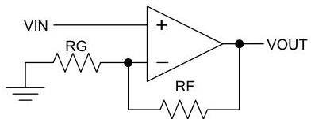
(Schematic Representation)

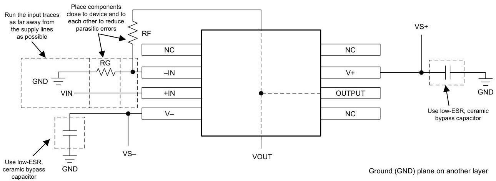
图 7-3. OPA134 Layout Example for the Noninverting Configuration

# 8 Device and Documentation Support

## 8.1 Device Support

### 8.1.1 Development Support

#### 8.1.1.1 模拟滤波器设计器

设计和仿真工具网页以基于网络的工具形式提供模拟滤波器设计器，用户可以利用该设计器在短时间内完成多级有源滤波器解决方案的设计、优化和仿真。

#### 8.1.1.2 TINA-TI™ 仿真软件（免费下载）

TINA-TI™ 仿真软件是一款简单易用、功能强大且基于 SPICE 引擎的电路仿真程序。TINA-TI 仿真软件是 TINA™ 软件的一款免费全功能版本，除了一系列无源和有源模型外，此版本软件还预先载入了一个宏模型库。TINA-TI 仿真软件提供所有传统的 SPICE 直流、瞬态和频域分析，以及其他设计功能。

TINA-TI 仿真软件提供全面的后处理能力，便于用户以多种方式获得结果，用户可从设计和仿真工具网页免费下载。虚拟仪器提供选择输入波形和探测电路节点、电压以及波形的能力，从而构建一个动态的快速启动工具。

## 备注

必须安装 TINA 软件或者 TINA-TI 软件后才能使用这些文件。请从 TINA-TI™ 软件文件夹中下载免费的 TINA-TI 仿真软件。

### 8.1.1.3 TI 参考设计

TI 参考设计是由 TI 的精密模拟应用专家创建的模拟解决方案。TI 参考设计提供了许多实用电路的工作原理、组件选择、仿真、完整印刷电路板 (PCB) 电路原理图和布局布线、物料清单以及性能测量结果。TI 参考设计可在线获取，网址为 https://www.ti.com/reference-designs。

## 8.2 Documentation Support

### 8.2.1 Related Documentation

For related documentation, see the following (available for download from www.ti.com):

- Texas Instruments, EMI Rejection Ratio of Operational Amplifiers
- Texas Instruments, Circuit Board Layout Techniques

## 8.3 接收文档更新通知

要接收文档更新通知，请导航至 ti.com 上的器件产品文件夹。点击通知 进行注册，即可每周接收产品信息更改摘要。有关更改的详细信息，请查看任何已修订文档中包含的修订历史记录。

## 8.4 支持资源

TI E2E™ 中文支持论坛是工程师的重要参考资料，可直接从专家处获得快速、经过验证的解答和设计帮助。搜索现有解答或提出自己的问题，获得所需的快速设计帮助。

链接的内容由各个贡献者“按原样”提供。这些内容并不构成 TI 技术规范，并且不一定反映 TI 的观点；请参阅 TI 的使用条款。

## 8.5 Trademarks

SoundPlus™, TINA-TI™, and TI E2E™ are trademarks of Texas Instruments.

TINA™ is a trademark of DesignSoft, Inc.

所有商标均为其各自所有者的财产。

## 8.6 静电放电警告

静电放电 (ESD) 会损坏这个集成电路。德州仪器 (TI) 建议通过适当的预防措施处理所有集成电路。如果不遵守正确的处理和安装程序，可能会损坏集成电路。

ESD 的损坏小至导致微小的性能降级，大至整个器件故障。精密的集成电路可能更容易受到损坏，这是因为非常细微的参数更改都可能会导致器件与其发布的规格不相符。

## 8.7 术语表

TI 术语表 本术语表列出并解释了术语、首字母缩略词和定义。

## 9 Revision History

注：以前版本的页码可能与当前版本的页码不同

## Changes from Revision A (April 2015) to Revision B (August 2024)

Page

- 更新了整个文档中的表格、图和交叉参考的编号格式. 1
- 更新了特性中的开环增益负载条件. 1
- 删除了四通道版本器件的 PDIP 封装选项. 1
- 更新了器件信息表. 1
- 将首页图片中的 W 更改为 Ω 符号 (拼写错误). 1
- Updated Pin Configuration and Functions format. 3
- Changed OPA134 pin 1 and 8 from "Offset Trim" to "NC". 3
- Changed input voltage from (V-) - 0.7V to (V+) + 0.7V to (V-) - 0.5V to (V+) + 0.5V in Absolute Maximum Ratings. 5
- Added input current and related footnote to Absolute Maximum Ratings. 5
- Added Thermal Information. 6
- Updated format of Electrical Characteristics. 7
- Updated nominal conditions in the header of Electrical Characteristics. 7
- Changed headroom from 23.6dB to 21.3dB. 7
- Deleted slew rate MIN. 7
- Changed overload recovery time from 0.5μs to 0.6μs. 7
- Changed input offset voltage MIN from ±0.5mV to ±1mV and MAX from ±2mV to ±3.5mV. 7
- Deleted input offset voltage over temperature MAX. 7
- Changed channel separation from 135dB to 128dB for dc, and from 130dB to 126dB for f = 20kHz. 7
- Deleted note 3. 7
- Added ± to input bias current TYP. 7
- Changed common-mode voltage MAX value from (V+) - 2.5V to (V+) - 3.5V. 7
- Updated common-mode rejection ratio and common-mode input impedance test conditions. 7
- Changed differential input impedance from 10¹³Ω || 2pF to 10¹³Ω || 8pF. 7
- Changed common-mode input impedance from 10¹³Ω || 5pF to 10¹³Ω || 6pF. 7
- Deleted open-loop voltage gain for RL = 600Ω. 7
- Deleted voltage output for RL = 600Ω. 7
- Moved voltage output negative MIN values to MAX values. 7
- Deleted output current. 7
- Deleted note 1 from Electrical Characteristics. 7
- Changed typos in typical characteristic graphs; corrected ohms symbol (Ω) and radical symbol (√). 9
- Changed test condition for Typical Characteristics from VS = 15V to VS = ±15V (typo). 9
- Changed Figure 26, Small-Signal Overshoot vs Load Capacitance into new Figures 5-23 and 5-24. 9
- Deleted old Figure 20, Output Voltage Swing vs Output Current, Figure 21, Offset Voltage Production Distribution, Figure 22, Offset Voltage Drift Production Distribution. 9

- Updated Functional Block Diagram ... 15
- Updated Offset Voltage Trim ... 16
- Updated OPA134 Layout Example for the Noninverting Configuration ... 19

## Changes from Revision * (September 2000) to Revision A (April 2015)

- 添加了 ESD 等级 表、特性说明部分、器件功能模式、应用和实施部分、电源相关建议部分、布局部分、器件和文档支持部分以及机械、封装和可订购信息部分 ... 1

## 10 Mechanical, Packaging, and Orderable Information

The following pages include mechanical, packaging, and orderable information. This information is the most current data available for the designated devices. This data is subject to change without notice and revision of this document. For browser-based versions of this data sheet, refer to the left-hand navigation.

PACKAGING INFORMATION

| Orderable part number | Status (1) | Material type (2) | Package | Pins | Package qty | Carrier | RoHS (3) | Lead finish/ Ball material (4) | MSL rating/ Peak reflow (5) | Op temp (°C) | Part marking (6) |
| --- | --- | --- | --- | --- | --- | --- | --- | --- | --- | --- | --- |
| OPA134PA | Active | Production | PDIP (P) | 8 | 50 | TUBE | Yes | NIPDAU | N/A for Pkg Type | - | OPA134PA |
| OPA134PA.A | Active | Production | PDIP (P) | 8 | 50 | TUBE | Yes | NIPDAU | N/A for Pkg Type | -40 to 85 | OPA134PA |
| OPA134UA | Active | Production | SOIC (D) | 8 | 75 | TUBE | Yes | NIPDAU | Level-3-260C-168 HR | -40 to 85 | OPA134UA |
| OPA134UA.B | Active | Production | SOIC (D) | 8 | 75 | TUBE | Yes | NIPDAU | Level-3-260C-168 HR | -40 to 85 | OPA134UA |
| OPA134UA/2K5 | Active | Production | SOIC (D) | 8 | 2500 | LARGE T&R | Yes | NIPDAU | Level-3-260C-168 HR | -40 to 85 | OPA134UA |
| OPA134UA/2K5.B | Active | Production | SOIC (D) | 8 | 2500 | LARGE T&R | Yes | NIPDAU | Level-3-260C-168 HR | -40 to 85 | OPA134UA |
| OPA2134PA | Active | Production | PDIP (P) | 8 | 50 | TUBE | Yes | NIPDAU | N/A for Pkg Type | -40 to 85 | OPA2134PA |
| OPA2134PA.A | Active | Production | PDIP (P) | 8 | 50 | TUBE | Yes | NIPDAU | N/A for Pkg Type | -40 to 85 | OPA2134PA |
| OPA2134PAG4 | Active | Production | PDIP (P) | 8 | 50 | TUBE | Yes | NIPDAU | N/A for Pkg Type | -40 to 85 | OPA2134PA |
| OPA2134UA | Active | Production | SOIC (D) | 8 | 75 | TUBE | Yes | NIPDAU | Level-3-260C-168 HR | -40 to 85 | OPA2134UA |
| OPA2134UA.B | Active | Production | SOIC (D) | 8 | 75 | TUBE | Yes | NIPDAU | Level-3-260C-168 HR | -40 to 85 | OPA2134UA |
| OPA2134UA/2K5 | Active | Production | SOIC (D) | 8 | 2500 | LARGE T&R | Yes | NIPDAU | Level-3-260C-168 HR | -40 to 85 | OPA2134UA |
| OPA2134UA/2K5.B | Active | Production | SOIC (D) | 8 | 2500 | LARGE T&R | Yes | NIPDAU | Level-3-260C-168 HR | -40 to 85 | OPA2134UA |
| OPA4134UA | Active | Production | SOIC (D) | 14 | 50 | TUBE | Yes | NIPDAU | Level-3-260C-168 HR | -40 to 85 | OPA4134UA |
| OPA4134UA.B | Active | Production | SOIC (D) | 14 | 50 | TUBE | Yes | NIPDAU | Level-3-260C-168 HR | -40 to 85 | OPA4134UA |
| OPA4134UA/2K5 | Active | Production | SOIC (D) | 14 | 2500 | LARGE T&R | Yes | NIPDAU | Level-3-260C-168 HR | -40 to 85 | OPA4134UA |
| OPA4134UA/2K5.B | Active | Production | SOIC (D) | 14 | 2500 | LARGE T&R | Yes | NIPDAU | Level-3-260C-168 HR | -40 to 85 | OPA4134UA |
| SN412008DRE4 | Active | Production | SOIC (D) | 8 | 2500 | LARGE T&R | Yes | NIPDAU | Level-3-260C-168 HR | -40 to 85 | OPA2134UA |

(1) Status: For more details on status, see our product life cycle.

(2) Material type: When designated, preproduction parts are prototypes/experimental devices, and are not yet approved or released for full production. Testing and final process, including without limitation quality assurance, reliability performance testing, and/or process qualification, may not yet be complete, and this item is subject to further changes or possible discontinuation. If available for ordering, purchases will be subject to an additional waiver at checkout, and are intended for early internal evaluation purposes only. These items are sold without warranties of any kind.

(3) RoHS values: Yes, No, RoHS Exempt. See the TI RoHS Statement for additional information and value definition.

(4) Lead finish/Ball material: Parts may have multiple material finish options. Finish options are separated by a vertical ruled line. Lead finish/Ball material values may wrap to two lines if the finish value exceeds the maximum column width.

(5) MSL rating/Peak reflow: The moisture sensitivity level ratings and peak solder (reflow) temperatures. In the event that a part has multiple moisture sensitivity ratings, only the lowest level per JEDEC standards is shown. Refer to the shipping label for the actual reflow temperature that will be used to mount the part to the printed circuit board.

(6) Part marking: There may be an additional marking, which relates to the logo, the lot trace code information, or the environmental category of the part.

Multiple part markings will be inside parentheses. Only one part marking contained in parentheses and separated by a "~" will appear on a part. If a line is indented then it is a continuation of the previous line and the two combined represent the entire part marking for that device.

Important Information and Disclaimer: The information provided on this page represents TI's knowledge and belief as of the date that it is provided. TI bases its knowledge and belief on information provided by third parties, and makes no representation or warranty as to the accuracy of such information. Efforts are underway to better integrate information from third parties. TI has taken and continues to take reasonable steps to provide representative and accurate information but may not have conducted destructive testing or chemical analysis on incoming materials and chemicals. TI and TI suppliers consider certain information to be proprietary, and thus CAS numbers and other limited information may not be available for release.

In no event shall TI's liability arising out of such information exceed the total purchase price of the TI part(s) at issue in this document sold by TI to Customer on an annual basis.

# TAPE AND REEL INFORMATION

REEL DIMENSIONS

TAPE DIMENSIONS

|  A0 | Dimension designed to accommodate the component width  |
| --- | --- |
|  B0 | Dimension designed to accommodate the component length  |
|  K0 | Dimension designed to accommodate the component thickness  |
|  W | Overall width of the carrier tape  |
|  P1 | Pitch between successive cavity centers  |

QUADRANT ASSIGNMENTS FOR PIN 1 ORIENTATION IN TAPE

*All dimensions are nominal

|  Device | Package Type | Package Drawing | Pins | SPQ | Reel Diameter (mm) | Reel Width W1 (mm) | A0 (mm) | B0 (mm) | K0 (mm) | P1 (mm) | W (mm) | Pin1 Quadrant  |
| --- | --- | --- | --- | --- | --- | --- | --- | --- | --- | --- | --- | --- |
|  OPA134UA/2K5 | SOIC | D | 8 | 2500 | 330.0 | 12.4 | 6.4 | 5.2 | 2.1 | 8.0 | 12.0 | Q1  |
|  OPA2134UA/2K5 | SOIC | D | 8 | 2500 | 330.0 | 12.4 | 6.4 | 5.2 | 2.1 | 8.0 | 12.0 | Q1  |
|  OPA4134UA/2K5 | SOIC | D | 14 | 2500 | 330.0 | 16.4 | 6.5 | 9.0 | 2.1 | 8.0 | 16.0 | Q1  |

TAPE AND REEL BOX DIMENSIONS

*All dimensions are nominal

|  Device | Package Type | Package Drawing | Pins | SPQ | Length (mm) | Width (mm) | Height (mm)  |
| --- | --- | --- | --- | --- | --- | --- | --- |
|  OPA134UA/2K5 | SOIC | D | 8 | 2500 | 353.0 | 353.0 | 32.0  |
|  OPA2134UA/2K5 | SOIC | D | 8 | 2500 | 353.0 | 353.0 | 32.0  |
|  OPA4134UA/2K5 | SOIC | D | 14 | 2500 | 353.0 | 353.0 | 32.0  |

# TUBE

*All dimensions are nominal

|  Device | Package Name | Package Type | Pins | SPQ | L (mm) | W (mm) | T (μm) | B (mm)  |
| --- | --- | --- | --- | --- | --- | --- | --- | --- |
|  OPA134PA | P | PDIP | 8 | 50 | 506 | 13.97 | 11230 | 4.32  |
|  OPA134PA.A | P | PDIP | 8 | 50 | 506 | 13.97 | 11230 | 4.32  |
|  OPA134UA | D | SOIC | 8 | 75 | 506.6 | 8 | 3940 | 4.32  |
|  OPA134UA.B | D | SOIC | 8 | 75 | 506.6 | 8 | 3940 | 4.32  |
|  OPA2134PA | P | PDIP | 8 | 50 | 506 | 13.97 | 11230 | 4.32  |
|  OPA2134PA.A | P | PDIP | 8 | 50 | 506 | 13.97 | 11230 | 4.32  |
|  OPA2134PAG4 | P | PDIP | 8 | 50 | 506 | 13.97 | 11230 | 4.32  |
|  OPA2134UA | D | SOIC | 8 | 75 | 506.6 | 8 | 3940 | 4.32  |
|  OPA2134UA.B | D | SOIC | 8 | 75 | 506.6 | 8 | 3940 | 4.32  |
|  OPA4134UA | D | SOIC | 14 | 50 | 506.6 | 8 | 3940 | 4.32  |
|  OPA4134UA.B | D | SOIC | 14 | 50 | 506.6 | 8 | 3940 | 4.32  |

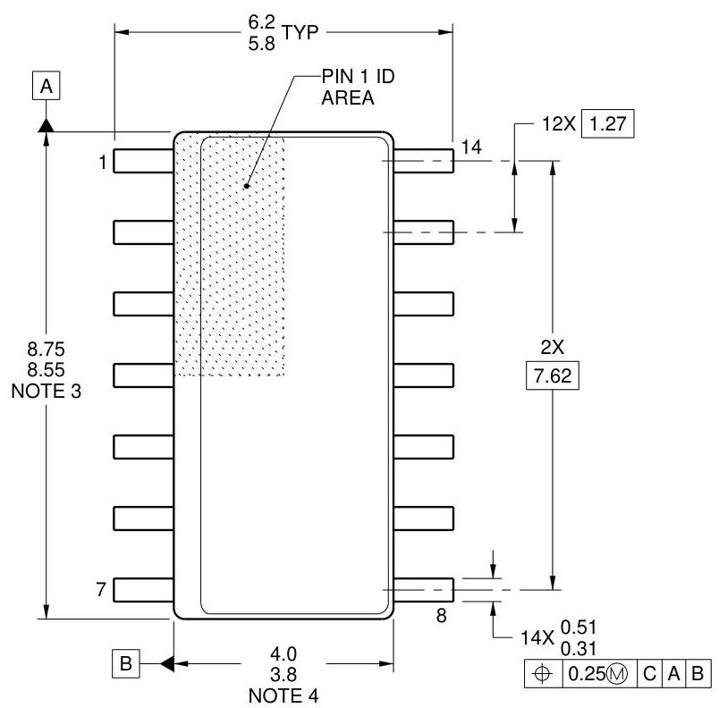

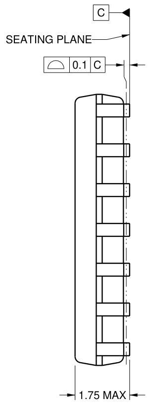

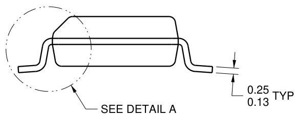

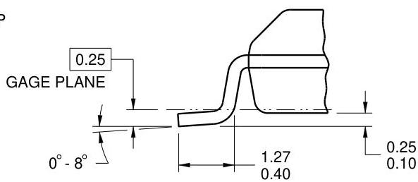
DETAIL A TYPICAL

4220718/A 09/2016

# NOTES:

1. All linear dimensions are in millimeters. Dimensions in parenthesis are for reference only. Dimensioning and tolerancing per ASME Y14.5M.
2. This drawing is subject to change without notice.
3. This dimension does not include mold flash, protrusions, or gate burrs. Mold flash, protrusions, or gate burrs shall not exceed 0.15 mm, per side.
4. This dimension does not include interlead flash. Interlead flash shall not exceed 0.43 mm, per side.
5. Reference JEDEC registration MS-012, variation AB.

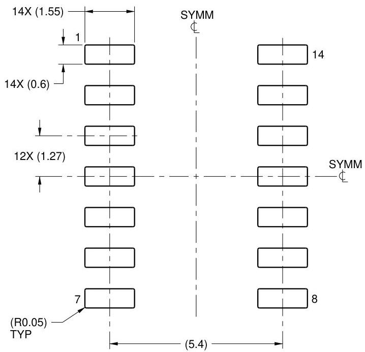
LAND PATTERN EXAMPLE
SCALE:8X

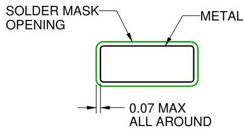
NON SOLDER MASK DEFINED

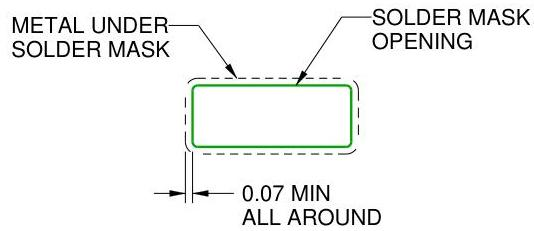
SOLDER MASK DEFINED

SOLDER MASK DETAILS

4220718/A 09/2016

NOTES: (continued)

6. Publication IPC-7351 may have alternate designs.
7. Solder mask tolerances between and around signal pads can vary based on board fabrication site.

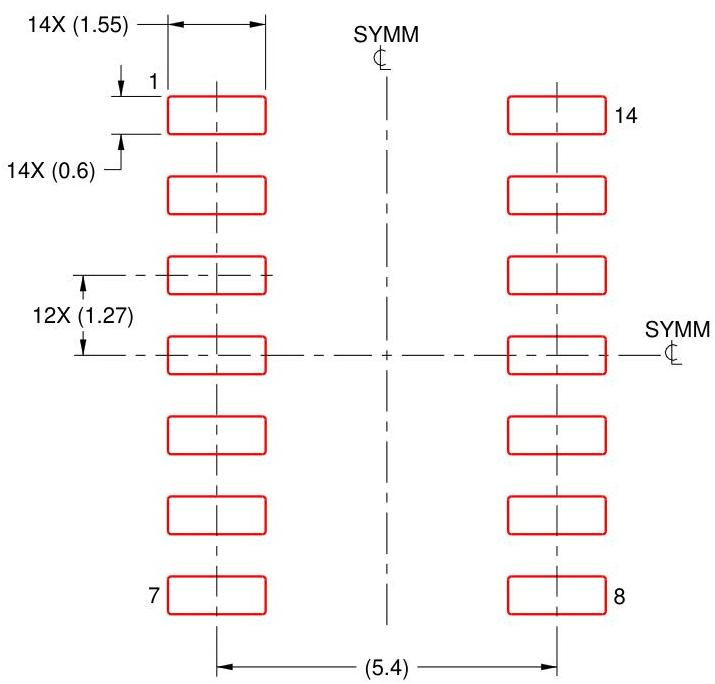
SOLDER PASTE EXAMPLE
BASED ON 0.125 mm THICK STENCIL
SCALE:8X

4220718/A 09/2016

NOTES: (continued)

8. Laser cutting apertures with trapezoidal walls and rounded corners may offer better paste release. IPC-7525 may have alternate design recommendations.
9. Board assembly site may have different recommendations for stencil design.

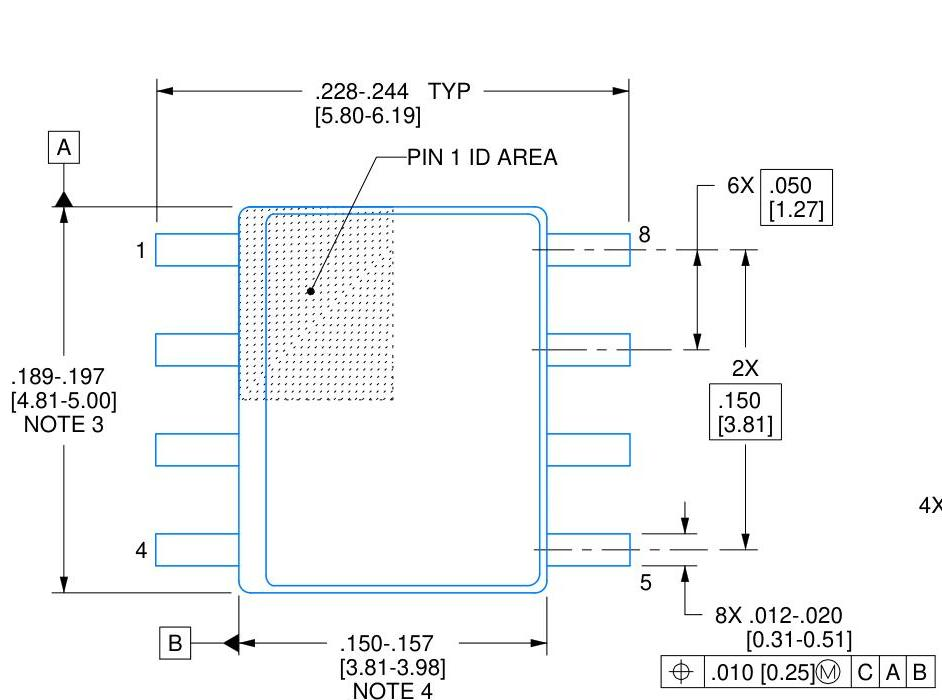

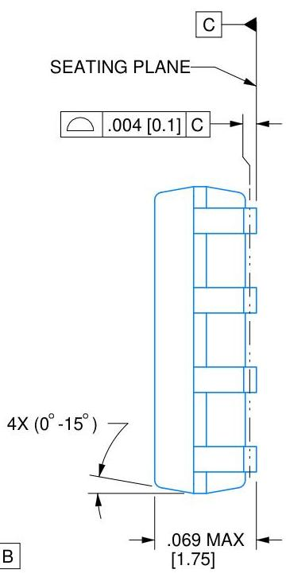

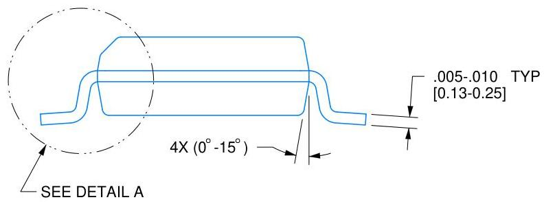

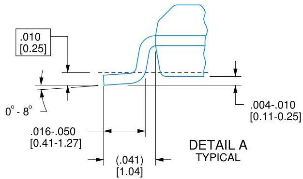

4214825/C 02/2019

# NOTES:

1. Linear dimensions are in inches [millimeters]. Dimensions in parenthesis are for reference only. Controlling dimensions are in inches. Dimensioning and tolerancing per ASME Y14.5M.
2. This drawing is subject to change without notice.
3. This dimension does not include mold flash, protrusions, or gate burrs. Mold flash, protrusions, or gate burrs shall not exceed .006 [0.15] per side.
4. This dimension does not include interlead flash.
5. Reference JEDEC registration MS-012, variation AA.

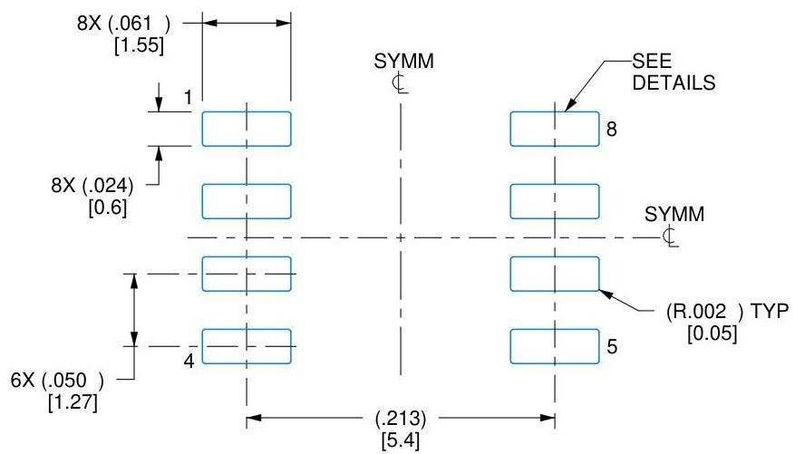
LAND PATTERN EXAMPLE
EXPOSED METAL SHOWN
SCALE:8X

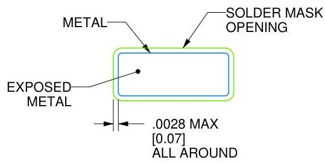
NON SOLDER MASK DEFINED

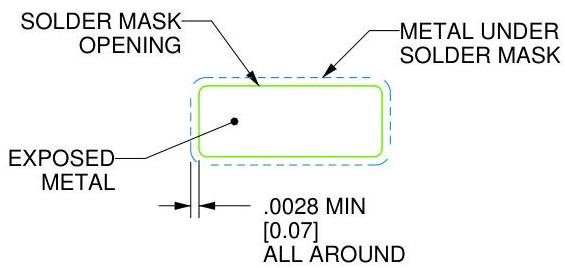
SOLDER MASK DEFINED

SOLDER MASK DETAILS

4214825/C 02/2019

NOTES: (continued)

6. Publication IPC-7351 may have alternate designs.
7. Solder mask tolerances between and around signal pads can vary based on board fabrication site.

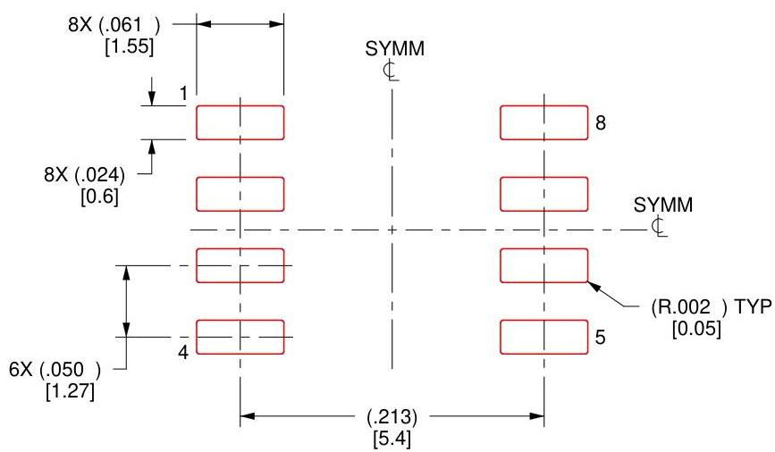
SOLDER PASTE EXAMPLE
BASED ON .005 INCH [0.125 MM] THICK STENCIL
SCALE:8X

4214825/C 02/2019

NOTES: (continued)

8. Laser cutting apertures with trapezoidal walls and rounded corners may offer better paste release. IPC-7525 may have alternate design recommendations.
9. Board assembly site may have different recommendations for stencil design.

P (R-PDIP-T8)

PLASTIC DUAL-IN-LINE PACKAGE

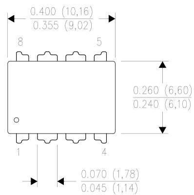

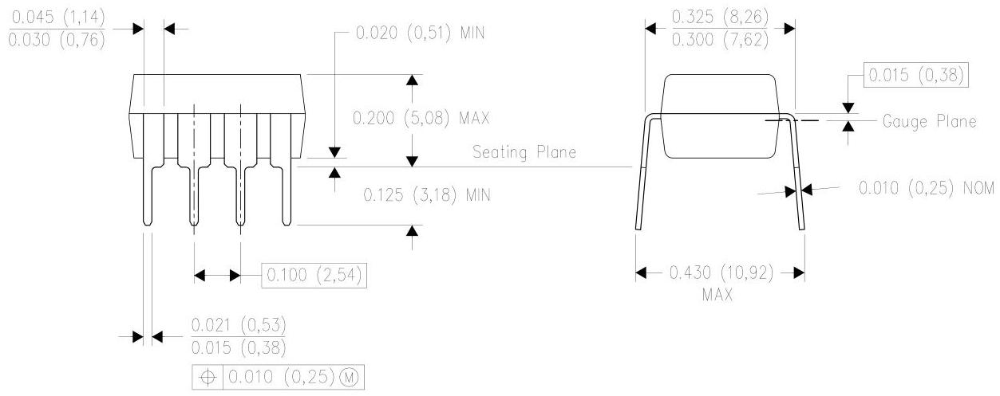

4040082/E 04/2010

NOTES: A. All linear dimensions are in inches (millimeters).
B. This drawing is subject to change without notice.
C. Falls within JEDEC MS-001 variation BA.

# 重要通知和免责声明

TI“按原样”提供技术和可靠性数据（包括数据表）、设计资源（包括参考设计）、应用或其他设计建议、网络工具、安全信息和其他资源，不保证没有瑕疵且不做出任何明示或暗示的担保，包括但不限于对适销性、与某特定用途的适用性或不侵犯任何第三方知识产权的暗示担保。

这些资源可供使用TI产品进行设计的熟练开发人员使用。您将自行承担以下全部责任：(1) 针对您的应用选择合适的TI产品，(2) 设计、验证并测试您的应用，(3) 确保您的应用满足相应标准以及任何其他安全、安保法规或其他要求。

这些资源如有变更，恕不另行通知。TI授权您仅可将这些资源用于研发本资源所述的TI产品的相关应用。严禁以其他方式对这些资源进行复制或展示。您无权使用任何其他TI知识产权或任何第三方知识产权。对于因您对这些资源的使用而对TI及其代表造成的任何索赔、损害、成本、损失和债务，您将全额赔偿，TI对此概不负责。

TI提供的产品受TI销售条款)、TI通用质量指南或ti.com上其他适用条款或TI产品随附的其他适用条款的约束。TI提供这些资源并不会扩展或以其他方式更改TI针对TI产品发布的适用的担保或担保免责声明。除非德州仪器(TI)明确将某产品指定为定制产品或客户特定产品，否则其产品均为按确定价格收入目录的标准通用器件。

TI反对并拒绝您可能提出的任何其他或不同的条款。

版权所有 © 2025，德州仪器(TI)公司

最后更新日期：2025年10月