# TPS6213x 采用 3mm × 3mm QFN 封装的 3V 至 17V、3A 降压转换器

## 1 特性

- DCS-Control™ 拓扑
- 输入电压范围：3 V 至 17 V
- 高达 3A 输出电流
- 可调输出电压范围为 0.9 V 至 6 V
- 引脚可选输出电压（标称值，+5%）
- 可编程软启动和跟踪
- 节能模式无缝转换
- 17μA 静态电流（典型值）
- 可选工作频率
- 电源正常状态输出
- 100% 占空比模式
- 短路保护
- 过热保护
- 与 TPS62140 和 TPS62150 引脚对引脚兼容
- 采用 3mm × 3mm QFN-16 封装
- 使用 TPS82130 可缩短设计时间

## 2 应用

- 标准 12V 电源轨
- 由单节或多节锂离子电池组成的 POL 电源
- 固态硬盘
- 嵌入式系统
- LDO 替代产品
- 移动 PC、平板、调制解调器、摄像头
- 服务器、微型服务器
- 数据终端、销售终端 (ePOS)

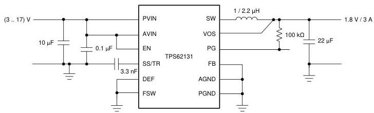
典型应用原理图

## 3 说明

TPS6213x 系列是易于使用的同步降压直流/直流转换器，此转换器针对高功率密度应用进行了优化。典型值为 2.5MHz 的高开关频率支持使用小型电感器，并且通过使用 DCS-Control 拓扑技术提供快速瞬态响应以及高输出电压精度。

此器件具有 3V 至 17V 宽运行输入电压范围，非常适用于由锂离子或其它电池以及 12V 中间电源轨供电的系统。这些器件在 0.9V 至 6V 的输出电压范围内，支持高达 3A 的持续输出电流（使用 100% 占空比模式时）。此输出电压启动斜坡由软启动引脚控制，从而支持作为独立电源运行或采用跟踪配置。通过配置使能引脚和开漏电源正常状态引脚也可以实现电源排序。

在节能模式下，这些器件从 $V_{\mathrm{IN}}$ 中消耗约 17 μA 的静态电流。负载较小时可自动且无缝进入节能模式，同时该模式可保持整个负载范围内的高效率。该器件在关断模式下处于关断状态，期间的流耗低于 2 μA。

此器件分为可调和固定输出电压型号，采用 3mm × 3mm (RGT) 16 引脚超薄四方扁平无引线 (VQFN) 封装。

器件信息

|  器件型号 | 封装(1) | 封装尺寸（标称值）  |
| --- | --- | --- |
|  TPS6213x | VQFN (16) | 3.00mm × 3.00mm  |

(1) 如需了解所有可用封装，请参阅数据表末尾的可订购产品附录。

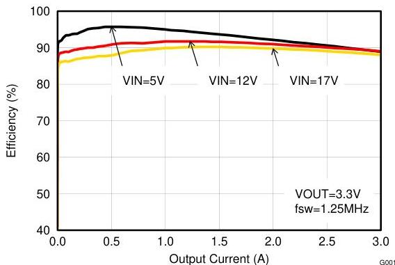
效率与输出电流间的关系

# Table of Contents

1 特性 1
2 应用 1
3 说明 1
4 Revision History 2
5 Device Comparison Table 3
6 Pin Configuration and Functions 3
7 Specifications 4
7.1 Absolute Maximum Ratings(1) 4
7.2 ESD Ratings 4
7.3 Recommended Operating Conditions 4
7.4 Thermal Information 4
7.5 Electrical Characteristics 5
7.6 Typical Characteristics 6
8 Detailed Description 7
8.1 Overview 7
8.2 Functional Block Diagram 8
8.3 Feature Description 9
8.4 Device Functional Modes 11
9 Application and Implementation 13
9.1 Application Information 13
9.2 Typical Application 13
9.3 System Examples 25
10 Power Supply Recommendations 28
11 Layout 28
11.1 Layout Guidelines 28
11.2 Layout Example 29
11.3 Thermal Information 29
12 Device and Documentation Support 30
12.1 Device Support 30
12.2 Documentation Support 30
12.3 接收文档更新通知 30
12.4 支持资源 30
12.5 Trademarks 30
12.6 Electrostatic Discharge Caution 30
12.7 术语表 30
13 Mechanical, Packaging, and Orderable Information 31

# 4 Revision History

注：以前版本的页码可能与当前版本的页码不同

Changes from Revision E (August 2016) to Revision F (November 2021) Page
- 添加了指向 TPS82130 产品页面的链接 1
- 更新了整个文档中的表格、图和交叉参考的编号格式 1
- 编辑了数据表的语法 1

Changes from Revision D (June 2016) to Revision E (August 2016) Page
- Changed the T_J MAX value From: 125°C To: 150°C in the Absolute Maximum Ratings 4
- Changed (T_J = -40°C to 85°C) To: (T_J = -40°C to 125°C) in the 开7.5 conditions 5
- Added a test condition for I_Q at T_A = -40°C to +85°C in the 开7.5 5
- Added 表 8-1 and 表 8-2 10

# 5 Device Comparison Table

|  PART NUMBER | OUTPUT VOLTAGE | POWER GOOD LOGIC LEVEL (EN = LOW)  |
| --- | --- | --- |
|  TPS62130 | adjustable | High Impedance  |
|  TPS62130A | adjustable | Low  |
|  TPS62131 | 1.8 V | High Impedance  |
|  TPS62132 | 3.3 V | High Impedance  |
|  TPS62133 | 5.0 V | High Impedance  |

# 6 Pin Configuration and Functions

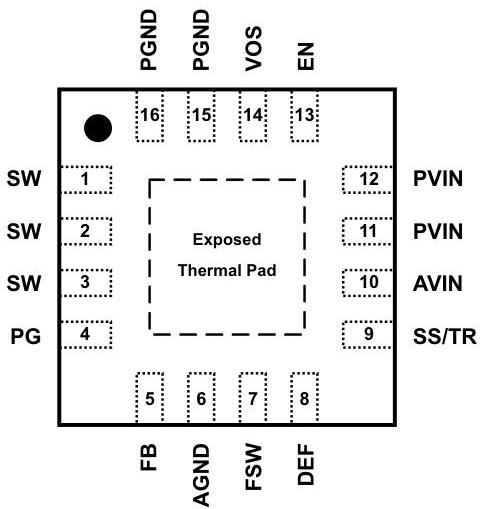
图 6-1. 16-Pin VQFN With Exposed Thermal Pad (RGT) Top View

表 6-1. Pin Functions

|  PIN(1) |   | I/O | DESCRIPTION  |
| --- | --- | --- | --- |
|  NO. | NAME  |   |   |
|  1,2,3 | SW | O | Switch node, which is connected to the internal MOSFET switches. Connect an inductor between SW and the output capacitor.  |
|  4 | PG | O | Output power good (High = V_{OUT} ready, Low = V_{OUT} below nominal regulation); open drain (requires pullup resistor)  |
|  5 | FB | I | Voltage feedback of adjustable version. Connect a resistive voltage divider to this pin. It is recommended to connect FB to AGND on fixed output voltage versions for improved thermal performance.  |
|  6 | AGND |  | Analog Ground. Must be connected directly to the Exposed Thermal Pad and common ground plane.  |
|  7 | FSW | I | Switching Frequency Select (Low ≈ 2.5 MHz, High ≈ 1.25 MHz(2) for typical operation)(3)  |
|  8 | DEF | I | Output voltage scaling (Low = nominal, High = nominal + 5%)(3)  |
|  9 | SS/TR | I | Soft-Start/Tracking Pin. An external capacitor connected to this pin sets the internal voltage reference rise time. It can be used for tracking and sequencing.  |
|  10 | AVIN | I | Supply voltage for control circuitry. Connect to the same source as PVIN.  |
|  11,12 | PVIN | I | Supply voltage for power stage. Connect to the same source as AVIN.  |
|  13 | EN | I | Enable input (High = enabled, Low = disabled)(3)  |
|  14 | VOS | I | Output voltage sense pin and connection for the control loop circuitry  |
|  15,16 | PGND |  | Power Ground. Must be connected directly to the Exposed Thermal Pad and common ground plane.  |
|   | Exposed Thermal Pad |  | Must be connected to AGND (pin 6), PGND (pin 15,16), and common ground plane. See the Layout Example. Must be soldered to achieve appropriate power dissipation and mechanical reliability.  |

(1) For more information about connecting pins, see the Detailed Description and Application and Implementation sections.
(2) Connect FSW to $V_{\mathrm{OUT}}$ or PG in this case.
(3) An internal pulldown resistor keeps logic level low if pin is floating.

# 7 Specifications

## 7.1 Absolute Maximum Ratings(1)

over operating junction temperature range (unless otherwise noted)

|   |  | MIN | MAX | UNIT  |
| --- | --- | --- | --- | --- |
|  Pin voltage range(2) | AVIN, PVIN | - 0.3 | 20 | V  |
|   |  EN, SS/TR | - 0.3 | V_{IN}+0.3  |   |
|   |  SW | - 0.3 | V_{IN}+0.3 | V  |
|   |  DEF, FSW, FB, PG, VOS | - 0.3 | 7 | V  |
|  Power Good sink current | PG |  | 10 | mA  |
|  Operating junction temperature, T_{J} |   | - 40 | 150 | °C  |
|  Storage temperature, T_{stg} |   | - 65 | 150 | °C  |

(1) Stresses beyond those listed under absolute maximum ratings may cause permanent damage to the device. These are stress ratings only, and functional operation of the device at these or any other conditions beyond those indicated under recommended operating conditions is not implied. Exposure to absolute-maximum-rated conditions for extended periods may affect device reliability.
(2) All voltages are with respect to network ground terminal.

## 7.2 ESD Ratings

|   |   | VALUE | UNIT  |
| --- | --- | --- | --- |
|  V_{(ESD)} Electrostatic discharge(1) | Human-body model (HBM), per ANSI/ESDA/JEDEC JS-001(2) | ±2000 | V  |
|   |  Charged-device model (CDM), per JEDEC specification JESD22-C101(3) | ±500  |   |

(1) ESD testing is performed according to the respective JESD22 JEDEC standard.
(2) JEDEC document JEP155 states that 500-V HBM allows safe manufacturing with a standard ESD control process.
(3) JEDEC document JEP157 states that 250-V CDM allows safe manufacturing with a standard ESD control process.

## 7.3 Recommended Operating Conditions

over operating junction temperature range (unless otherwise noted)

|   | MIN | MAX | UNIT  |
| --- | --- | --- | --- |
|  Supply Voltage, V_{IN} (at AVIN and PVIN) | 3 | 17 | V  |
|  Operating junction temperature, T_{J} | -40 | 125 | °C  |

## 7.4 Thermal Information

|  THERMAL METRIC(1) | TPS6213X | UNITS  |   |
| --- | --- | --- | --- |
|   |   |   |  RGT 16 PINS  |
|  R_{||JA} | Junction-to-ambient thermal resistance | 45 | °C/W  |
|  R_{||JCtop} | Junction-to-case(top) thermal resistance | 53.6  |   |
|  R_{||JB} | Junction-to-board thermal resistance | 17.4  |   |
|  ↓_{JT} | Junction-to-top characterization parameter | 1.1  |   |
|  ↓_{JB} | Junction-to-board characterization parameter | 17.4  |   |
|  R_{||JCbot} | Junction-to-case(bottom) thermal resistance | 4.5  |   |

(1) For more information about traditional and new thermal metrics, see the Semiconductor and IC Package Thermal Metrics application report.

# 7.5 Electrical Characteristics

over operating junction temperature  $(\mathrm{T_J} = -40^{\circ}\mathrm{C}$  to  $125^{\circ}\mathrm{C})$  , typical values at  $\mathrm{V_{IN}} = 12\mathrm{V}$  and  $\mathrm{T_A} = 25^{\circ}\mathrm{C}$  (unless otherwise noted)

|  PARAMETER |   | TEST CONDITIONS |   | MIN | TYP | MAX | UNIT  |
| --- | --- | --- | --- | --- | --- | --- | --- |
|  SUPPLY  |   |   |   |   |   |   |   |
|  \(V_{IN}\) | Input voltage range(1) |  |   | 3 |   | 17 | V  |
|  \(I_Q\) | Operating quiescent current | EN=High, \(I_{OUT} = 0\) mA, device not switching |  | 17 |   | 30 | μA  |
|   |   |   |  \(T_A = -40^{\circ}C\) to +85°C | 17 |   | 25  |   |
|  \(I_{SD}\) | Shutdown current(2) | EN=Low |  | 1.5 |   | 25 | μA  |
|   |   |   |  \(T_A = -40^{\circ}C\) to +85°C | 1.5 |   | 4  |   |
|  \(V_{UVLO}\) | Undervoltage lockout threshold | Falling Input Voltage (PWM mode operation) |   | 2.6 | 2.7 | 2.8 | V  |
|   |   |  Hysteresis |   | 200 |   |   | mV  |
|  \(T_{SD}\) | Thermal shutdown temperature |  |   | 160 |   |   | °C  |
|   |  Thermal shutdown hysteresis |  |   | 20  |   |   |   |
|  CONTROL (EN, DEF, FSW, SS/TR, PG)  |   |   |   |   |   |   |   |
|  \(V_H\) | High level input threshold voltage (EN, DEF, FSW) |  |   | 0.9 | 0.65 |   | V  |
|  \(V_L\) | Low level input threshold voltage (EN, DEF, FSW) |  |   | 0.45 |   | 0.3 | V  |
|  \(I_{LKG}\) | Input leakage current (EN, DEF, FSW) | EN=\(V_{IN}\) or GND; DEF, FSW=\(V_{OUT}\) or GND |   | 0.01 |   | 1 | μA  |
|  \(V_{TH\_PG}\) | Power good threshold voltage | Rising (%\(V_{OUT}\)) |   | 92% | 95% | 98% |   |
|   |   |  Falling (%\(V_{OUT}\)) |   | 87% | 90% | 94%  |   |
|  \(V_{OL\_PG}\) | Power good output low | \(I_{PG}=-2mA\) |   | 0.07 |   | 0.3 | V  |
|  \(I_{LKG\_PG}\) | Input leakage current (PG) | \(V_{PG}=1.8V\) |   | 1 |   | 400 | nA  |
|  \(I_{SS/TR}\) | SS/TR pin source current |  |   | 2.3 | 2.5 | 2.7 | μA  |
|  POWER SWITCH  |   |   |   |   |   |   |   |
|  \(R_{DS(ON)}\) | High-side MOSFET ON-resistance | \(V_{IN}\geq 6V\) |   | 90 |   | 170 | mΩ  |
|   |   |  \(V_{IN}=3V\) |   | 120  |   |   |   |
|   |  Low-side MOSFET ON-resistance | \(V_{IN}\geq 6V\) |   | 40 |   | 70 | mΩ  |
|   |   |  \(V_{IN}=3V\) |   | 50  |   |   |   |
|  \(I_{LIMF}\) | High-side MOSFET forward current limit(3) | \(V_{IN}=12V, T_A=25^{\circ}C\) |   | 3.6 | 4.2 | 4.9 | A  |
|  OUTPUT  |   |   |   |   |   |   |   |
|  \(I_{LKG\_FB}\) | Input leakage current (FB) | TPS62130, \(V_{FB}=0.8V\) |   | 1 |   | 100 | nA  |
|  \(V_{OUT}\) | Output voltage range (TPS62130) | \(V_{IN}\geq V_{OUT}\) |   | 0.9 |   | 6.0 | V  |
|   |  DEF (Output voltage programming) | DEF=0 (GND) |   | \(V_{OUT}\) |   |   |   |
|   |   |  DEF=1 (\(V_{OUT}\)) |   | \(V_{OUT}+5\%\)  |   |   |   |
|   |  Initial output voltage accuracy(4) | PWM mode operation, \(V_{IN}\geq V_{OUT}+1V\) |   | 785.6 | 800 | 814.4 | mV  |
|   |   |  PWM mode operation, \(V_{IN}\geq V_{OUT}+1V\), \(T_A=-10^{\circ}C\) to \(85^{\circ}C\) |   | 788.0 | 800 | 812.8  |   |
|   |   |  Power Save Mode operation, \(C_{OUT}=22\mu F\) |   | 781.6 | 800 | 822.4  |   |
|   |  Tracking Feedback Voltage (TPS62130) | \(V_{SS/TR}=350mV\) |   | 212.6 | 225 | 237.4 | mV  |
|   |  Load regulation(5) | \(V_{IN}=12V, V_{OUT}=3.3V\), PWM mode operation |   | 0.05 |   |   | %/A  |
|   |  Line regulation(5) | \(3V\leq V_{IN}\leq 17V, V_{OUT}=3.3V, I_{OUT}=1A\), PWM mode operation |   | 0.02 |   |   | %/V  |

(1) The device is still functional down to Under Voltage Lockout (see parameter  $V_{\mathrm{UVLO}}$ ).
(2) Current into AVIN+PVIN pin.
(3) This is the static current limit. It can be temporarily higher in applications due to internal propagation delay (see § 8.4.4 section).
(4) This is the accuracy provided at the FB pin for the adjustable  $V_{\text{OUT}}$  version (line and load regulation effects are not included). For the fixed output voltage versions the (internal) resistive divider is included.

(5) Line and load regulation depend on external component selection and layout (see 7-16 and 7-17).

# 7.6 Typical Characteristics

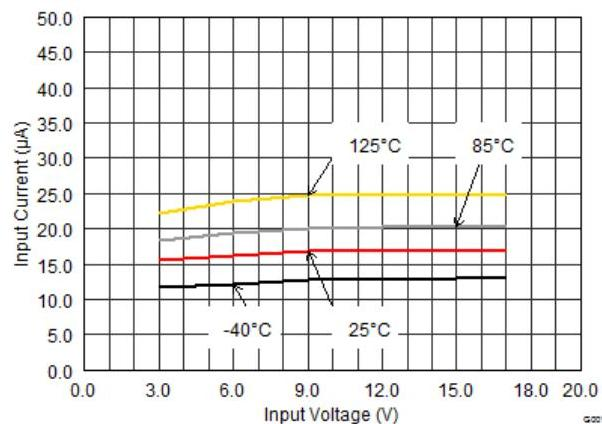
图 7-1. Quiescent Current

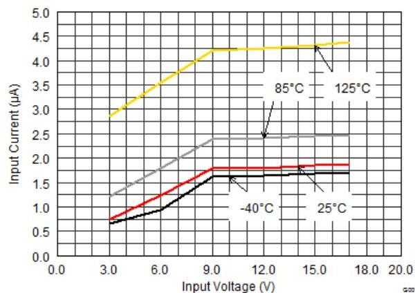
图 7-2. Shutdown Current

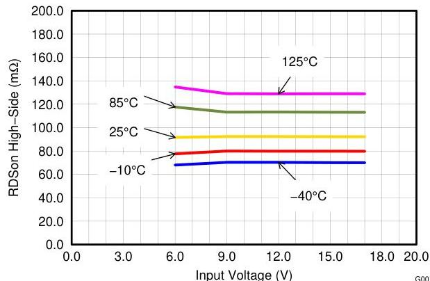
图 7-3. High-Side Switch Resistance

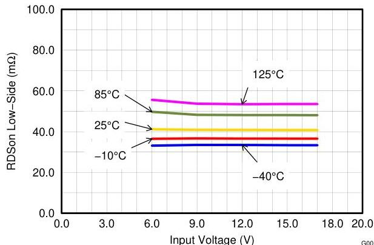
图 7-4. Low-Side Switch Resistance

# 8 Detailed Description

## 8.1 Overview

The TPS6213x synchronous switched mode power converters are based on DCS-Control (Direct Control with Seamless Transition into power save mode), an advanced regulation topology that combines the advantages of hysteretic, voltage mode, and current mode control including an AC loop directly associated to the output voltage. This control loop takes information about output voltage changes and feeds it directly to a fast comparator stage. It sets the switching frequency, which is constant for steady state operating conditions, and provides immediate response to dynamic load changes. To get accurate DC load regulation, a voltage feedback loop is used. The internally compensated regulation network achieves fast and stable operation with small external components and low-ESR capacitors.

The DCS-Control topology supports PWM (Pulse Width Modulation) mode for medium and heavy load conditions and a power save mode at light loads. During PWM, the device operates at its nominal switching frequency in continuous conduction mode. This frequency is typically approximately 2.5 MHz or 1.25 MHz with a controlled frequency variation depending on the input voltage. If the load current decreases, the converter enters power save mode to sustain high efficiency down to very light loads. In power save mode, the switching frequency decreases linearly with the load current. Since DCS-Control supports both operation modes within one single building block, the transition from PWM to power save mode is seamless without effects on the output voltage.

Fixed output voltage versions provide the smallest solution size and lowest current consumption, requiring only four external components. An internal current limit supports nominal output currents of up to 3 A.

The TPS6213x family offers both excellent DC voltage and superior load transient regulation, combined with very low output voltage ripple, minimizing interference with RF circuits.

## 8.2 Functional Block Diagram

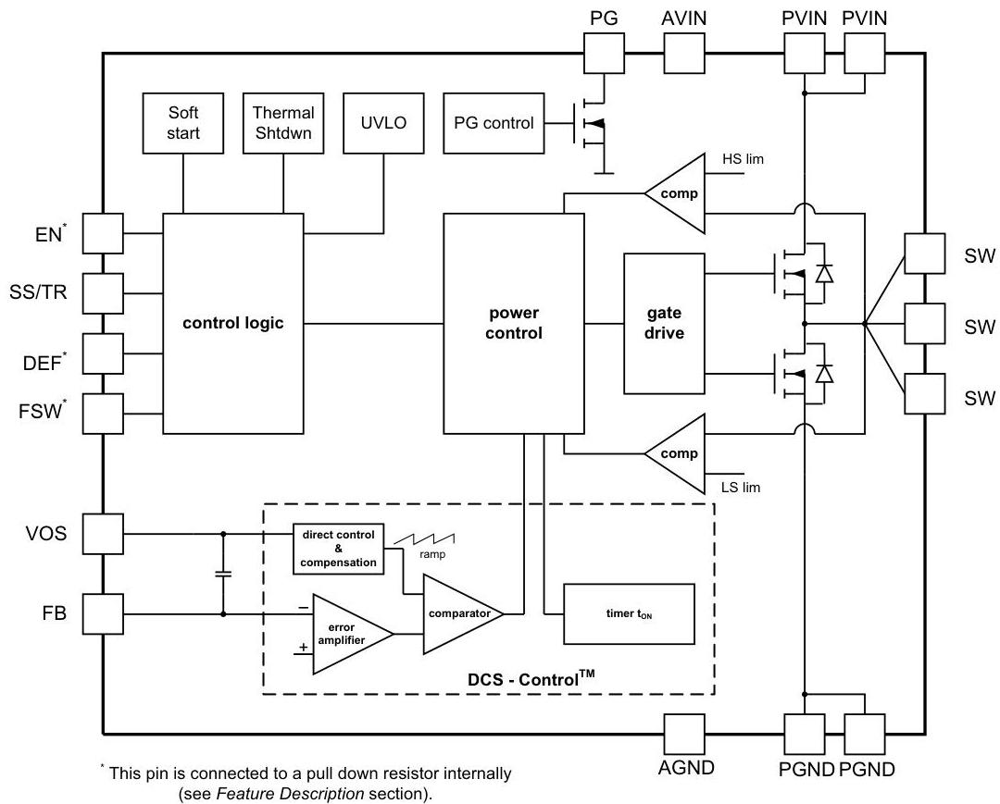

* This pin is connected to a pulldown resistor internally (see 8.3).

Fig 8-1. TPS62130 and TPS62130A (Adjustable Output Voltage)

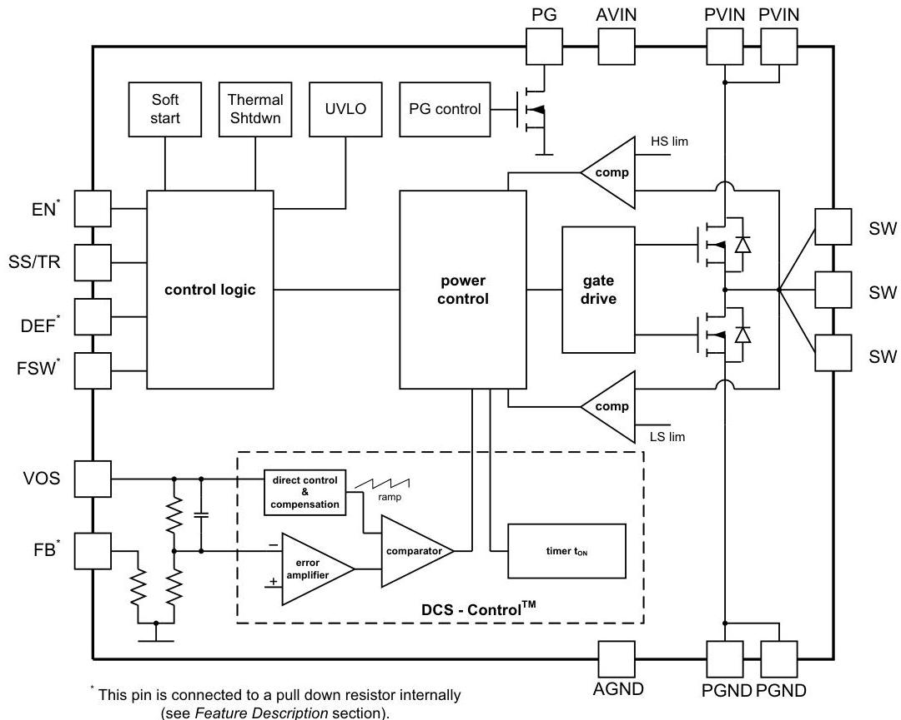
* This pin is connected to a pulldown resistor internally (see § 8.3).
Fig 8-2. TPS62131/2/3 (Fixed Output Voltage)

# 8.3 Feature Description

# 8.3.1 Enable / Shutdown (EN)

When Enable (EN) is set High, the device starts operation. Shutdown is forced if EN is pulled Low with a shutdown current of typically  $1.5\mu \mathrm{A}$ . During shutdown, the internal power MOSFETs as well as the entire control circuitry are turned off. The internal resistive divider pulls down the output voltage smoothly. The EN signal must be set externally to High or Low. An internal pulldown resistor of approximately  $400\mathrm{k}\Omega$  is connected and keeps EN logic low, if Low is set initially and then the pin gets floating. It is disconnected if the pin is set High.

Connecting the EN pin to an appropriate output signal of another power rail provides sequencing of multiple power rails.

# 8.3.2 Soft Start / Tracking (SS/TR)

The internal soft start circuitry controls the output voltage slope during start-up. This avoids excessive inrush current and ensures a controlled output voltage rise time. It also prevents unwanted voltage drops from high-impedance power sources or batteries. When EN is set to start device operation, the device starts switching after a delay of approximately  $50~\mu \mathrm{s}$  and  $\mathrm{V_{OUT}}$  rises with a slope controlled by an external capacitor connected to the SS/TR pin. See 8-34 and 8-35 for typical start-up operation.

Using a very small capacitor (or leaving SS/TR pin un-connected) provides fastest start-up behavior. There is no theoretical limit for the longest start-up time. The TPS6213x can start into a pre-biased output. During monotonic pre-biased start-up, both the power MOSFETs are not allowed to turn on until the internal ramp of the device sets an output voltage above the pre-bias voltage. As long as the output is below approximately  $0.5\mathrm{V}$ , a reduced current limit of typically 1.6 A is set internally. If the device is set to shutdown  $(\mathrm{EN} = \mathrm{GND})$ , undervoltage lockout, or thermal shutdown, an internal resistor pulls the SS/TR pin down to ensure a proper low level. Returning from those states causes a new start-up sequence as set by the SS/TR connection.

A voltage supplied to SS/TR can be used for tracking a primary voltage. The output voltage will follow this voltage in both directions up and down (see § 9).

## 8.3.3 Power Good (PG)

The TPS6213x has a built-in power good (PG) function to indicate whether the output voltage has reached its appropriate level or not. The PG signal can be used for start-up sequencing of multiple rails. The PG pin is an open-drain output that requires a pullup resistor (to any voltage below 7 V). It can sink 2 mA of current and maintain its specified logic low level. With TPS62130, it is high impedance when the device is turned off due to EN, UVLO, or thermal shutdown. The TPS62130A features PG = Low in this case and can be used to actively discharge $V_{\text{OUT}}$ (see § 9-41). $V_{\text{IN}}$ must remain present for the PG pin to stay Low. See the TPS62130A Differences to TPS62130 Application Report for application details. If not used, the PG pin should be connected to GND but may be left floating.

表 8-1. Power Good Pin Logic Table (TPS62130)

|  DEVICE STATE | PG LOGIC STATUS  |   |   |
| --- | --- | --- | --- |
|   |   |  HIGH IMPEDANCE | LOW  |
|  Enable (EN = High) | VFB ≥ VTH_PG | ✓ |   |
|   |  VFB ≤ VTH_PG |  | ✓  |
|  Shutdown (EN = Low) |  | ✓ |   |
|  UVLO | 0.7 V < VIN < VUVLO | ✓ |   |
|  Thermal Shutdown | TJ > TSD | ✓ |   |
|  Power Supply Removal | VIN < 0.7 V | ✓ |   |

表 8-2. Power Good Pin Logic Table (TPS62130A)

|  DEVICE STATE | PG LOGIC STATUS  |   |   |
| --- | --- | --- | --- |
|   |   |  HIGH IMPEDANCE | LOW  |
|  Enable (EN = High) | VFB ≥ VTH_PG | ✓ |   |
|   |  VFB ≤ VTH_PG |  | ✓  |
|  Shutdown (EN = Low) |  |  | ✓  |
|  UVLO | 0.7 V < VIN < VUVLO |  | ✓  |
|  Thermal Shutdown | TJ > TSD |  | ✓  |
|  Power Supply Removal | VIN < 0.7 V | ✓ |   |

## 8.3.4 Pin-Selectable Output Voltage (DEF)

The output voltage of the TPS6213x devices can be increased by 5% above the nominal voltage by setting the DEF pin to High.¹ When DEF is Low, the device regulates to the nominal output voltage. Increasing the nominal voltage allows the user to adapt the power supply voltage to the variations of the application hardware. More detailed information on voltage margining using TPS6213x can be found in Voltage Margining Using the TPS62130 Application Report. A pulldown resistor of approximately 400 kΩ is internally connected to the pin to ensure a proper logic level if the pin is high impedance or floating after initially set to Low. The resistor is disconnected if the pin is set High.

## 8.3.5 Frequency Selection (FSW)

To get high power density with a very small solution size, a high switching frequency allows the use of small external components for the output filter. However, switching losses increase with the switching frequency. If

¹ Maximum allowed voltage is 7 V. Therefore, it is recommended to connect it to $V_{\text{OUT}}$ or PG, not $V_{\text{IN}}$.

efficiency is the key parameter, more than solution size, the switching frequency can be set to half (1.25 MHz typical) by pulling FSW to High. It is mandatory to start with FSW = Low to limit inrush current, which can be done by connecting the pin to $V_{\text{OUT}}$ or PG. Running with lower frequency, a higher efficiency, but also a higher output voltage ripple, is achieved. Pull FSW to Low for high frequency operation (2.5 MHz typical). To get low ripple and full output current at the lower switching frequency, it is recommended to use an inductor of at least $2.2~\mu\mathrm{H}$. The switching frequency can be changed during operation, if needed. A pulldown resistor of about 400 kΩ is internally connected to the pin, acting the same way as at the DEF pin (see above).

## 8.3.6 Undervoltage Lockout (UVLO)

If the input voltage drops, the undervoltage lockout prevents misoperation of the device by switching off both the power FETs. The undervoltage lockout threshold is set typically to $2.7\mathrm{V}$. The device is fully operational for voltages above the UVLO threshold and turns off if the input voltage trips the threshold. The converter starts operation again once the input voltage exceeds the threshold by a hysteresis of typically $200\mathrm{mV}$.

## 8.3.7 Thermal Shutdown

The junction temperature $(T_J)$ of the device is monitored by an internal temperature sensor. If $T_J$ exceeds $160^{\circ}\mathrm{C}$ (typical), the device goes into thermal shutdown. Both the high-side and low-side power FETs are turned off and PG goes high impedance. When $T_J$ decreases below the hysteresis amount, the converter resumes normal operation, beginning with soft start. To avoid unstable conditions, a hysteresis of typically $20^{\circ}\mathrm{C}$ is implemented on the thermal shutdown temperature.

## 8.4 Device Functional Modes

### 8.4.1 Pulse Width Modulation (PWM) Operation

The TPS6213x operates with pulse width modulation in continuous conduction mode (CCM) with a nominal switching frequency of 2.5 MHz or 1.25 MHz, selectable with the FSW pin. The frequency variation in PWM is controlled and depends on $V_{\text{IN}}$, $V_{\text{OUT}}$, and the inductance. The device operates in PWM mode as long the output current is higher than half the ripple current of the inductor. To maintain high efficiency at light loads, the device enters power save mode at the boundary to discontinuous conduction mode (DCM). This happens if the output current becomes smaller than half the ripple current of the inductor.

### 8.4.2 Power Save Mode Operation

The TPS6213x enters its built-in power save mode seamlessly if the load current decreases. This secures a high efficiency in light-load operation. The device remains in power save mode as long as the inductor current is discontinuous.

In power save mode, the switching frequency decreases linearly with the load current maintaining high efficiency. The transition into and out of power save mode happens within the entire regulation scheme and is seamless in both directions.

The TPS6213x includes a fixed on-time circuitry. An estimate for this on time in steady-state operation with FSW = Low is:

$$
t_{ON} = \frac{V_{OUT}}{V_{IN}} \cdot 400ns \tag{1}
$$

For very small output voltages, an absolute minimum on time of approximately 80 ns is kept to limit switching losses. The operating frequency is thereby reduced from its nominal value, which keeps efficiency high. Also, the off time can reach its minimum value at high duty cycles. The output voltage remains regulated in such case. Using $t_{ON}$, the typical peak inductor current in power save mode can be approximated by:

$$
I_{LPSM(\text{peak})} = \frac{(V_{IN} - V_{OUT})}{L} \cdot t_{ON} \tag{2}
$$

When $V_{\text{IN}}$ decreases to typically 15% above $V_{\text{OUT}}$, the TPS6213x does not enter power save mode, regardless of the load current. The device maintains output regulation in PWM mode.

## 8.4.3 100% Duty-Cycle Operation

The duty cycle of the buck converter is given by $D = V_{\text{OUT}} / V_{\text{IN}}$ and increases as the input voltage comes close to the output voltage. In this case, the device starts 100% duty cycle operation turning on the high-side switch 100% of the time. The high-side switch stays turned on as long as the output voltage is below the internal set point. This allows the conversion of small input to output voltage differences (for example, for the longest operation time of battery-powered applications). In 100% duty cycle mode, the low-side FET is switched off.

The minimum input voltage to maintain output voltage regulation, depending on the load current and the output voltage level, can be calculated as:

$$
V_{IN(min)} = V_{OUT(min)} + I_{OUT}\left(R_{DS(on)} + R_{L}\right) \tag{3}
$$

where

- $I_{\text{OUT}}$ is the output current.
- $R_{\text{DS(on)}}$ is the $R_{\text{DS(on)}}$ of the high-side FET.
- $R_L$ is the DC resistance of the inductor used.

## 8.4.4 Current Limit And Short Circuit Protection

The TPS6213x devices have protection against heavy load and short circuit events. If a short circuit is detected ($V_{\text{OUT}}$ drops below 0.5 V), the current limit is reduced to 1.6 A typically. If the output voltage rises above 0.5 V, the device runs in normal operation again. At heavy loads, the current limit determines the maximum output current. If the current limit is reached, the high-side FET is turned off. Avoiding shoot-through current, then the low-side FET switches on to allow the inductor current to decrease. The low-side current limit is typically 3.5 A. The high-side FET turns on again only if the current in the low-side FET has decreased below the low-side current limit threshold.

The output current of the device is limited by the current limit. Due to internal propagation delay, the actual current can exceed the static current limit during that time. The dynamic current limit can be calculated as follows:

$$
I_{peak(typ)} = I_{LIMF} + \frac{V_L}{L} \cdot t_{PD} \tag{4}
$$

where

- $I_{\text{LIMF}}$ is the static current limit, specified in the Electrical Characteristics.
- $L$ is the inductor value.
- $V_L$ is the voltage across the inductor ($V_{\text{IN}} - V_{\text{OUT}}$).
- $t_{PD}$ is the internal propagation delay.

The current limit can exceed static values, especially if the input voltage is high and very small inductances are used. The dynamic high-side switch peak current can be calculated as follows:

$$
I_{peak(typ)} = I_{LIMF} + \frac{\left(V_{IN} - V_{OUT}\right)}{L} \cdot 30ns \tag{5}
$$

# 9 Application and Implementation

## Note

以下应用部分中的信息不属于 TI 器件规格的范围，TI 不担保其准确性和完整性。TI 的客户应负责确定器件是否适用于其应用。客户应验证并测试其设计，以确保系统功能。

## 9.1 Application Information

The TPS6213x is a switched mode step-down converter that is able to convert a 3V- to 17-V input voltage into a 0.9-V to 6-V output voltage, providing up to 3 A. The device needs a minimum amount of external components. Apart from the LC output filter and the input capacitors, only the TPS62130 (TPS62130A) with adjustable output voltage needs an additional resistive divider to set the output voltage level.

## 9.2 Typical Application

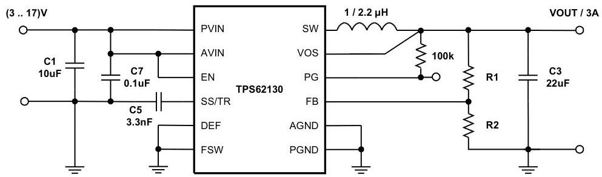
图 9-1. 3-A Step-Down Converter for Point-Of-Load Power Supply Using the TPS62130

### 9.2.1 Design Requirements

The following design guideline provides a component selection to operate the device within the recommended operating conditions. Using the FSW pin, the design can be optimized for highest efficiency or smallest solution size and lowest output voltage ripple. For highest efficiency set FSW = High and the device operates at the lower switching frequency. For the smallest solution size and lowest output voltage ripple, set FSW = Low and the device operates with higher switching frequency. The typical values for all measurements are $V_{\text{IN}} = 12 \, \text{V}$, $V_{\text{OUT}} = 3.3 \, \text{V}$ and $T = 25^{\circ} \text{C}$, using the external components of 表 9-1.

The component selection used for measurements is given as follows:

表 9-1. List Of Components

|  REFERENCE | DESCRIPTION | MANUFACTURER(1)  |
| --- | --- | --- |
|  IC | 17-V, 3-A Step-Down Converter, QFN | TPS62130RGT, Texas Instruments  |
|  L1 | 2.2 μH, 0.165 inch x 0.165 inch | XFL4020-222MEB, Coilcraft  |
|  C1 | 10 μF, 25 V, Ceramic, 1210 | Standard  |
|  C3 | 22 μF, 6.3 V, Ceramic, 0805 | Standard  |
|  C5 | 3300 pF, 25 V, Ceramic, 0603 | Standard  |
|  C7 | 0.1 μF, 25 V, Ceramic, 0603 | Standard  |
|  R1 | depending on V_{OUT} |   |
|  R2 | depending on V_{OUT} |   |
|  R3 | 100 kΩ, Chip, 0603, 1/16W, 1% | Standard  |

(1) See the Third-Party Products Disclaimer.

### 9.2.2 Detailed Design Procedure

#### 9.2.2.1 Programming The Output Voltage

While the output voltage of the TPS62130 (TPS62130A) is adjustable, the TPS62131, TPS62132, and TPS62133 are programmed to fixed output voltages. For fixed output voltage versions, the FB pin is pulled down

internally and can be left floating. It is recommended to connect to AGND to improve thermal resistance. The adjustable version can be programmed for output voltages from 0.9 V to 6 V by using a resistive divider from $V_{\text{OUT}}$ to AGND. The voltage at the FB pin is regulated to 800 mV. The value of the output voltage is set by the selection of the resistive divider from 方程式 6. It is recommended to choose resistor values that allow a current of at least 2 $\mu$A, meaning the value of R2 should not exceed 400 kΩ. Lower resistor values are recommended for the highest accuracy and most robust design. For applications requiring lowest current consumption, the use of fixed output voltage versions is recommended.

$$
R _ {1} = R _ {2} \left(\frac {V _ {\text {O U T}}}{0 . 8 V} - 1\right) \tag {6}
$$

In case the FB pin gets opened, the device clamps the output voltage at the VOS pin internally to approximately 7.4 V.

## 9.2.2.2 External Component Selection

The external components have to fulfill the needs of the application, but also the stability criteria of the devices control loop. The TPS6213x is optimized to work within a range of external components. The inductance of the LC output filter and capacitance have to be considered together, creating a double pole, responsible for the corner frequency of the converter (see § 9.2.2.4). 表 9-2 can be used to simplify the output filter component selection. Checked cells represent combinations that are proven for stability by simulation and lab test. Further combinations should be checked for each individual application. See *Optimizing the TPS62130/40/50/60 Output Filter Application Report* for details.

表 9-2. Recommended LC Output Filter Combinations

|   | 4.7 μF | 10 μF | 22 μF | 47 μF | 100 μF | 200 μF | 400 μF  |
| --- | --- | --- | --- | --- | --- | --- | --- |
|  0.47 μH(1) |  |  |  |  |  |  |   |
|  1 μH(1) |  |  | ✓ | ✓ | ✓ | ✓ |   |
|  2.2 μH(1) |  | ✓ | ✓(2) | ✓ | ✓ | ✓ |   |
|  3.3 μH(1) |  | ✓ | ✓ | ✓ | ✓ |  |   |
|  4.7 μH(1) |  |  |  |  |  |  |   |

(1) The values in the table are nominal values. The effective capacitance was considered to vary by +20% and -50%.
(2) This LC combination is the standard value and recommended for most applications.

The TPS6213x can be run with an inductor as low as 1 μH. FSW should be set Low in this case. However, for applications running with the low frequency setting (FSW = High) or with low input voltages, 2.2 μH is recommended.

## 9.2.2.2.1 Inductor Selection

The inductor selection is affected by several effects like inductor ripple current, output ripple voltage, PWM-to-PSM transition point, and efficiency. In addition, the inductor selected has to be rated for appropriate saturation current and DC resistance (DCR). 方程式 7 and 方程式 8 calculate the maximum inductor current under static load conditions.

$$
I _ {L (\max )} = I _ {O U T (\max )} + \frac {\Delta I _ {L (\max )}}{2} \tag {7}
$$

$$
\Delta I _ {L (\max )} = V _ {O U T} \cdot \left(\frac {1 - \frac {V _ {O U T}}{V _ {D C (\max )}}}{L _ {(\min )} \cdot f _ {S W}}\right) \tag {8}
$$

where

- $I_L(\max)$ is the maximum inductor current.
- $\Delta I_L$ is the peak-to-peak inductor ripple current.
- $L_{(\min)}$ is the minimum effective inductor value.
- $f_{SW}$ is the actual PWM switching frequency.

Calculating the maximum inductor current using the actual operating conditions gives the required minimum saturation current of the inductor. It is recommended to add a margin of approximately $20\%$. A larger inductor value is also useful to get lower ripple current, but increases the transient response time and size as well. The following inductors have been used with the TPS6213x and are recommended for use:

表 9-3. List Of Inductors

|  TYPE | INDUCTANCE [μH] | CURRENT [A] (1) | DIMENSIONS [L × B × H] mm | MANUFACTURER (2)  |
| --- | --- | --- | --- | --- |
|  XFL4020-102ME_ | 1.0 μH, ±20% | 4.7 | 4 × 4 × 2.1 | Coilcraft  |
|  XFL4020-152ME_ | 1.5 μH, ±20% | 4.2 | 4 × 4 × 2.1 | Coilcraft  |
|  XFL4020-222ME_ | 2.2 μH, ±20% | 3.8 | 4 × 4 × 2.1 | Coilcraft  |
|  IHLP1212BZ-11 | 1.0 μH, ±20% | 4.5 | 3 × 3.6 × 2 | Vishay  |
|  IHLP1212BZ-11 | 2.2 μH, ±20% | 3.0 | 3 × 3.6 × 2 | Vishay  |
|  SRP4020-3R3M | 3.3μH, ±20% | 3.3 | 4.8 × 4 × 2 | Bourns  |
|  VLC5045T-3R3N | 3.3μH, ±30% | 4.0 | 5 × 5 × 4.5 | TDK  |

(1) Lower of $I_{RMS}$ at $40^{\circ}C$ rise or $I_{SAT}$ at $30\%$ drop.
(2) See the Third-Party Products Disclaimer.

The inductor value also determines the load current at which power save mode is entered:

$$
I_{load(PSM)} = \frac{1}{2} \Delta I_L \tag{9}
$$

Using 方程式 9, this current level can be adjusted by changing the inductor value.

## 9.2.2.2.2 Capacitor Selection

### 9.2.2.2.2.1 Output Capacitor

The recommended value for the output capacitor is $22\ \mu F$. The architecture of the TPS6213x allows the use of tiny ceramic output capacitors with low-equivalent series resistance (ESR). These capacitors provide low output voltage ripple and are recommended. To keep its low resistance up to high frequencies and to get narrow capacitance variation with temperature, it is recommended to use X7R or X5R dielectric. Using a higher value can have some advantages like smaller voltage ripple and a tighter DC output accuracy in power save mode (see *Optimizing the TPS62130/40/50/60 Output Filter Application Report*).

### Note

In power save mode, the output voltage ripple depends on the output capacitance, its ESR, and the peak inductor current. Using ceramic capacitors provides small ESR and low ripple.

### 9.2.2.2.2.2 Input Capacitor

For most applications, $10\ \mu F$ will be sufficient and is recommended, though a larger value reduces input current ripple further. The input capacitor buffers the input voltage for transient events and also decouples the converter from the supply. A low-ESR multilayer ceramic capacitor is recommended for best filtering and should be placed between PVIN and PGND as close as possible to those pins. Even though AVIN and PVIN must be supplied from the same input source, it is required to place a capacitance of $0.1\ \mu F$ from AVIN to AGND, to avoid potential noise coupling. An RC, low-pass filter from PVIN to AVIN can be used but is not required.

## 9.2.2.2.2.3 Soft-Start Capacitor

A capacitance connected between the SS/TR pin and AGND allows a user-programmable start-up slope of the output voltage. A constant current source supports $2.5\ \mu\mathrm{A}$ to charge the external capacitance. The capacitor required for a given soft-start ramp time for the output voltage is given by:

$$
C_{SS} = t_{SS} \cdot \frac{2.5\ \mu\mathrm{A}}{1.25\ V} \ [F] \tag{10}
$$

where

- $C_{SS}$ is the capacitance (F) required at the SS/TR pin.
- $t_{SS}$ is the desired soft-start ramp time (s).

**Note**

DC Bias effect: High capacitance ceramic capacitors have a DC Bias effect, which will have a strong influence on the final effective capacitance. Therefore the right capacitor value has to be chosen carefully. Package size and voltage rating in combination with dielectric material are responsible for differences between the rated capacitor value and the effective capacitance.

## 9.2.2.3 Tracking Function

If a tracking function is desired, the SS/TR pin can be used for this purpose by connecting it to an external tracking voltage. The output voltage tracks that voltage. If the tracking voltage is between $50\ \mathrm{mV}$ and $1.2\ \mathrm{V}$, the FB pin will track the SS/TR pin voltage as described in 方程式 11 and shown in 图 9-2.

$$
V_{FB} \approx 0.64 \cdot V_{SS/TR} \tag{11}
$$

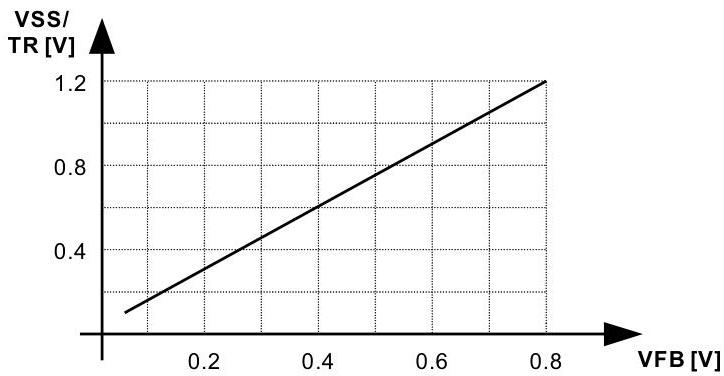
图 9-2. Voltage Tracking Relationship

Once the SS/TR pin voltage reaches approximately $1.2\ \mathrm{V}$, the internal voltage is clamped to the internal feedback voltage and device goes to normal regulation. This works for rising and falling tracking voltages with the same behavior, as long as the input voltage is inside the recommended operating conditions. For decreasing SS/TR pin voltage, the device does not sink current from the output. So, the resulting decrease of the output voltage can be slower than the SS/TR pin voltage if the load is light. When driving the SS/TR pin with an external voltage, do not exceed the voltage rating of the SS/TR pin which is $V_{IN} + 0.3\ \mathrm{V}$.

If the input voltage drops into undervoltage lockout or even down to zero, the output voltage will go to zero, independent of the tracking voltage. 图 9-3 shows how to connect devices to get ratiometric and simultaneous sequencing by using the tracking function.

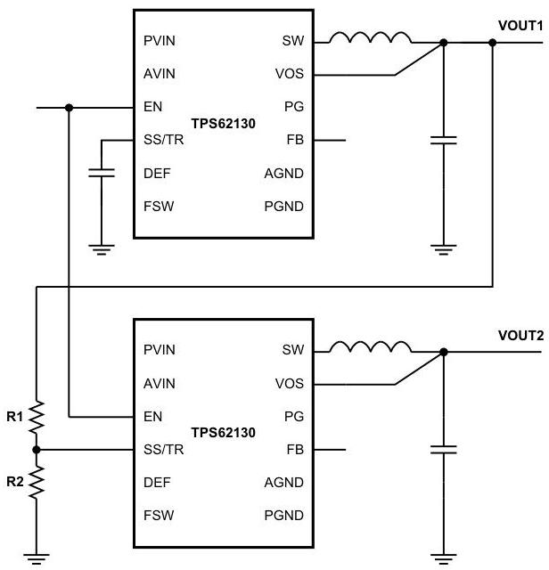
Copyright © 2016, Texas Instruments Incorporated
图 9-3. Sequence For Ratiometric And Simultaneous Start-Up

The resistive divider of R1 and R2 can be used to change the ramp rate of $V_{\text{OUT2}}$ faster, slower, or the same as $V_{\text{OUT1}}$.

A sequential start-up is achieved by connecting the PG pin of $V_{\text{OUT1}}$ to the EN pin of $V_{\text{OUT2}}$. A ratiometric start-up sequence happens if both supplies are sharing the same soft-start capacitor. 方程式 10 calculates the soft-start time, though the SS/TR current has to be doubled. Details about these and other tracking and sequencing circuits are found in *Sequencing and Tracking With the TPS621-Family and TPS821-Family Application Report*.

**Note**

If the voltage at the FB pin is below its typical value of $0.8\mathrm{V}$, the output voltage accuracy may have a wider tolerance than specified.

## 9.2.2.4 Output Filter And Loop Stability

The devices of the TPS6213x family are internally compensated to be stable with L-C filter combinations corresponding to a corner frequency to be calculated with 方程式 12:

$$
f_{LC} = \frac{1}{2\pi\sqrt{L \cdot C}} \tag{12}
$$

Proven nominal values for inductance and ceramic capacitance are given in 表 9-2 and are recommended for use. Different values can work, but care has to be taken on the loop stability which will be affected. More information including a detailed LC stability matrix can be found in *Optimizing the TPS62130/40/50/60 Output Filter Application Report*.

The TPS6213x devices, both fixed and adjustable output voltage versions, include an internal 25-pF feedforward capacitor, connected between the VOS and FB pins. This capacitor impacts the frequency behavior and sets a pole and zero in the control loop with the resistors of the feedback divider, per 方程式 13 and 方程式 14:

$$
f_{zero} = \frac{1}{2\pi \cdot R_1 \cdot 25pF} \tag{13}
$$

$$
f _ {p o l e} = \frac {1}{2 \pi \cdot 2 5 p F} \cdot \left(\frac {1}{R _ {1}} + \frac {1}{R _ {2}}\right) \tag {14}
$$

Though the TPS6213x devices are stable without the pole and zero being in a particular location, adjusting their location to the specific needs of the application can provide better performance in power save mode, improved transient response, or both. An external feedforward capacitor can also be added. A more detailed discussion on the optimization for stability versus transient response can be found in Optimizing Transient Response of Internally Compensated DC-DC Converters Application Report and Feedforward Capacitor to Improve Stability and Bandwidth of TPS621/821-Family Application Report.

# 9.2.3 Application Curves

$\mathrm{V_{IN}} = 12\mathrm{V},\mathrm{V_{OUT}} = 3.3\mathrm{V},\mathrm{T_A} = 25^{\circ}\mathrm{C},$  (unless otherwise noted)

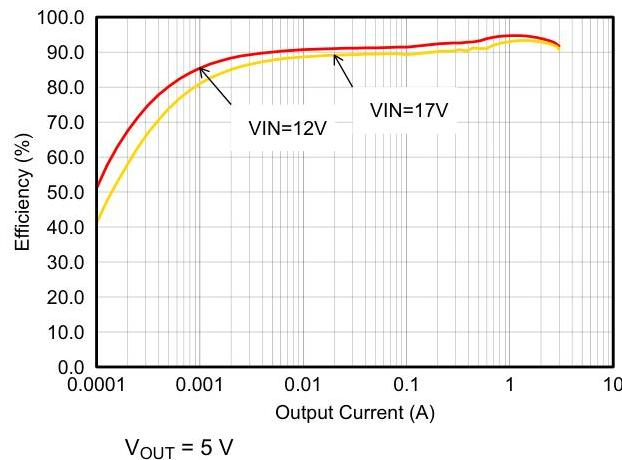
$\mathrm{V_{OUT}} = 5\mathrm{V}$

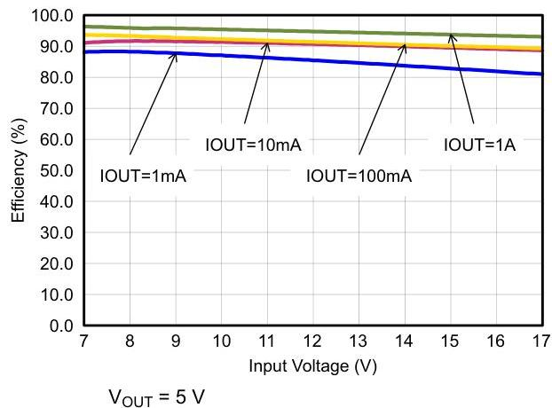
$\mathrm{V_{OUT}} = 5\mathrm{V}$

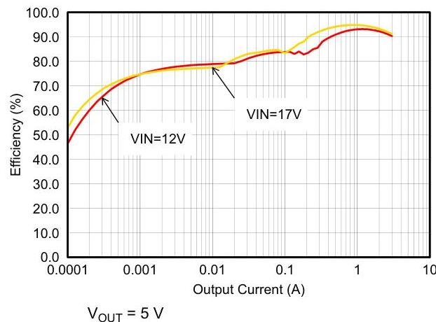
图9-4. Efficiency with 1.25 MHz

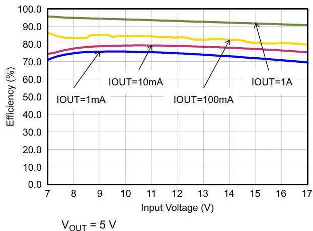
图9-5. Efficiency with 1.25 MHz

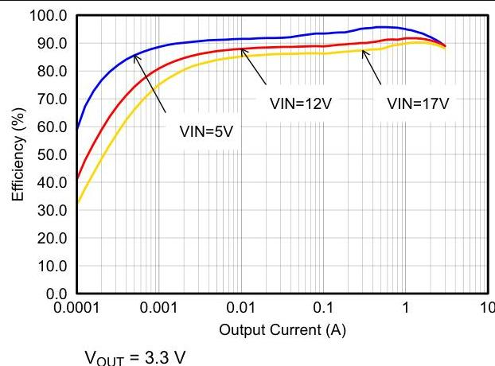
图9-6. Efficiency with 2.5 MHz
$\mathrm{V_{OUT}} = 3.3\mathrm{V}$

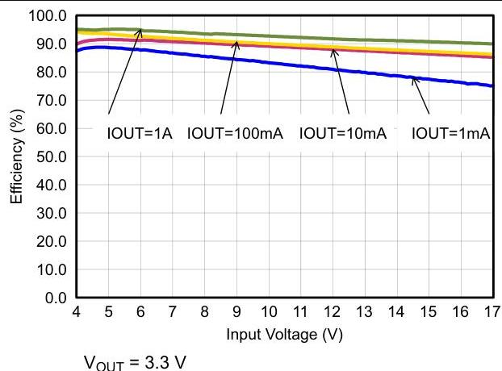
图9-7. Efficiency with 2.5 MHz
$\mathrm{V_{OUT}} = 3.3\mathrm{V}$

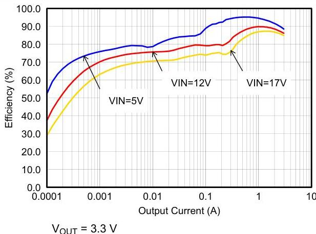
$\mathrm{V}_{\mathrm{OUT}} = 3.3 \mathrm{~V}$

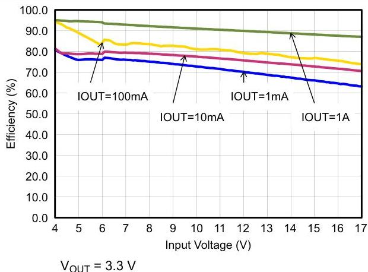
$\mathrm{V}_{\mathrm{OUT}} = 3.3 \mathrm{~V}$

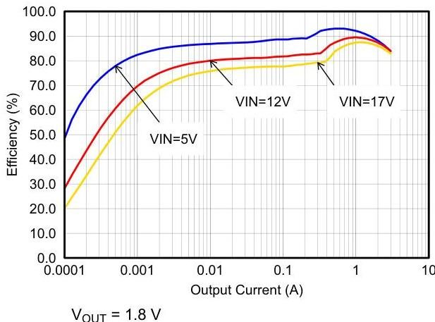
图 9-10. Efficiency with 2.5 MHz

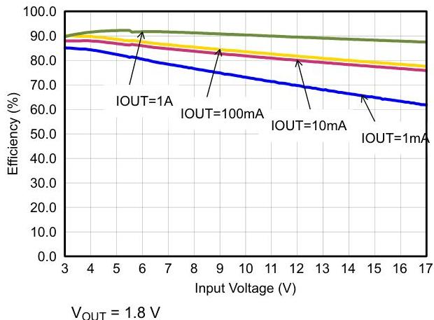
图 9-11. Efficiency with 2.5 MHz

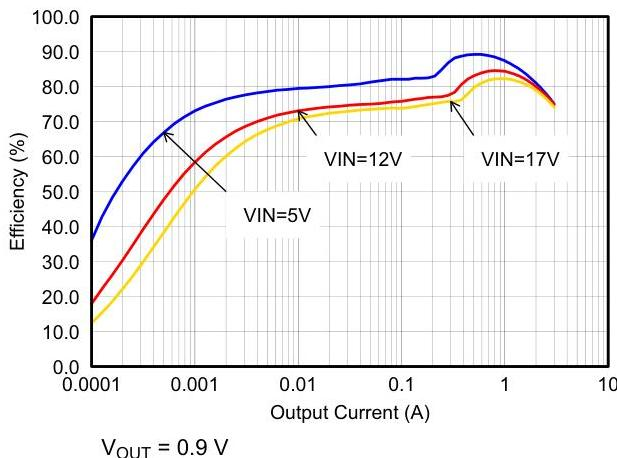
$\mathrm{V}_{\mathrm{OUT}} = 1.8 \mathrm{~V}$
图 9-12. Efficiency with 1.25 MHz
$\mathrm{V}_{\mathrm{OUT}} = 0.9 \mathrm{~V}$

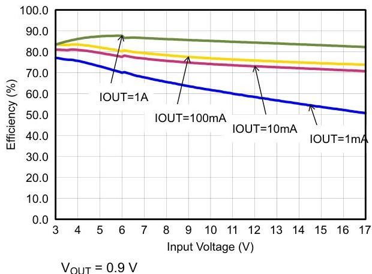
图 9-13. Efficiency with 1.25 MHz
$\mathrm{V}_{\mathrm{OUT}} = 0.9 \mathrm{~V}$
图 9-14. Efficiency with 1.25 MHz

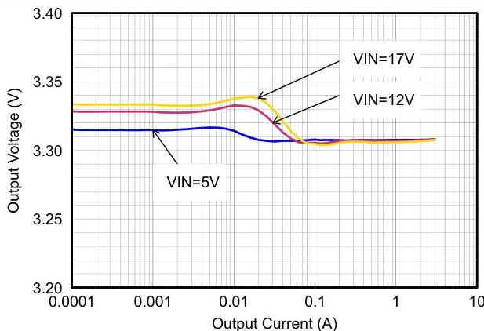
图 9-16. Output Voltage Accuracy (Load Regulation)

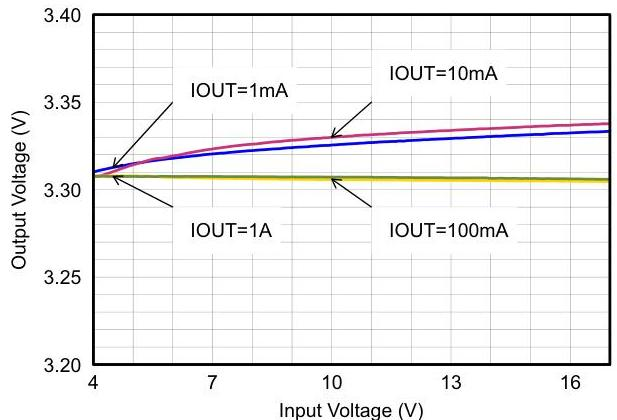
图 9-17. Output Voltage Accuracy (Line Regulation)

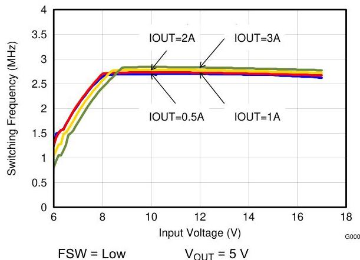
图 9-18. Switching Frequency vs Input Voltage

图 9-19. Switching Frequency vs Output Current

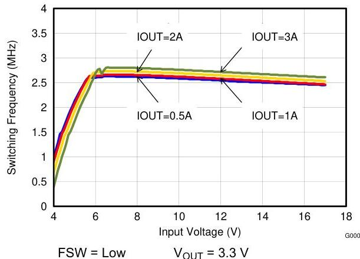
图 9-20. Switching Frequency vs Input Voltage

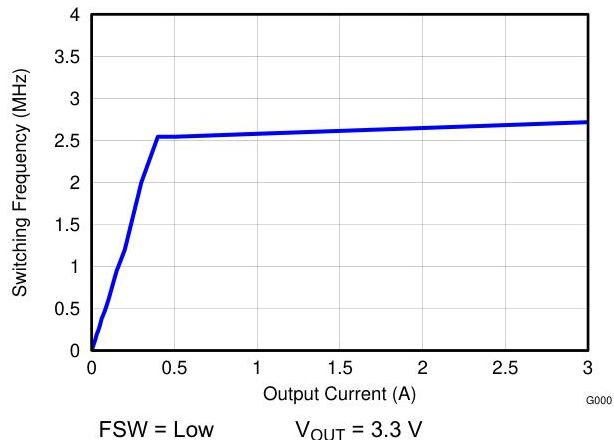
图 9-21. Switching Frequency vs Output Current,

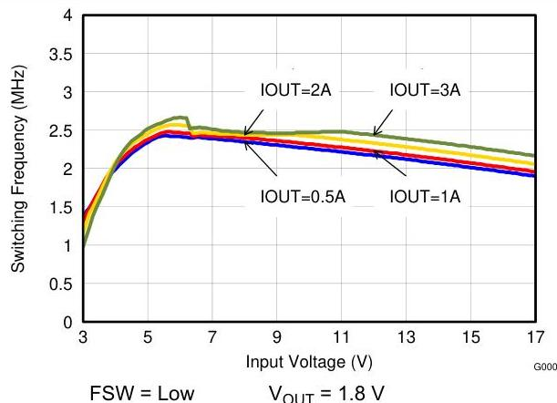
图 9-22. Switching Frequency vs Input Voltage

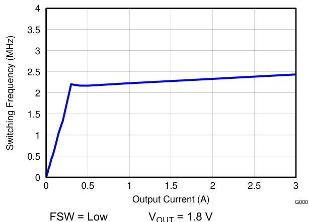
图 9-23. Switching Frequency vs Output Current

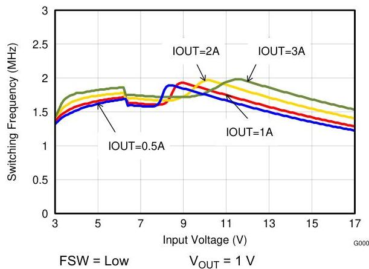
图 9-24. Switching Frequency vs Input Voltage

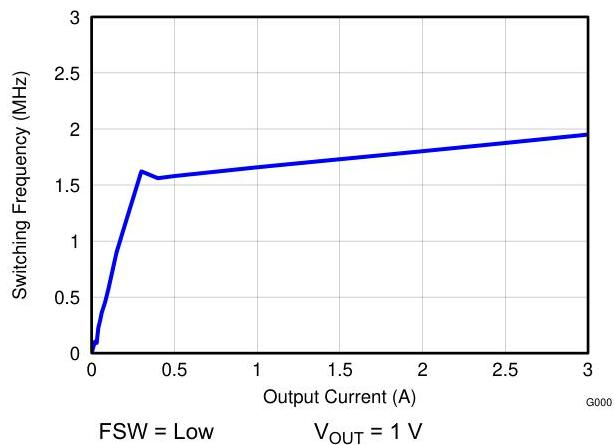
图 9-25. Switching Frequency vs Output Current

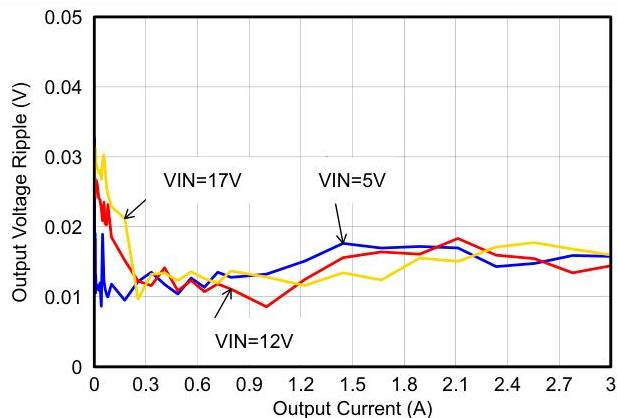
图 9-26. Output Voltage Ripple

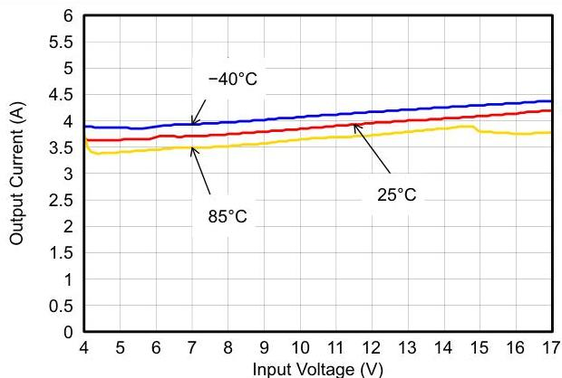
图 9-27. Maximum Output Current

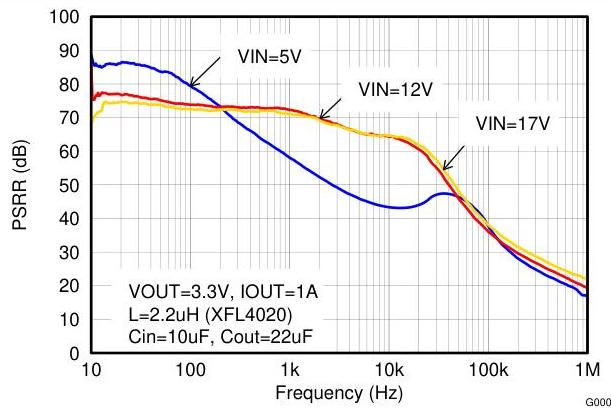
$\mathrm{F_{SW}} = 2.5 \mathrm{Mhz}$

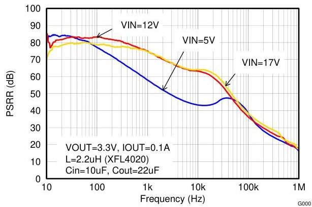
$\mathrm{F_{SW}} = 2.5 \mathrm{MHz}$

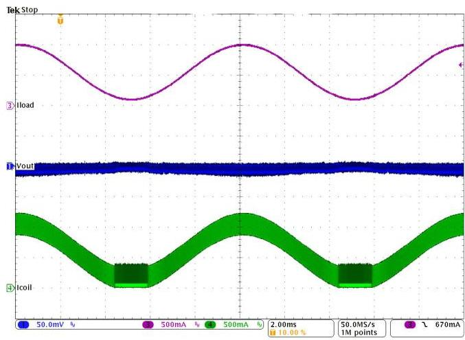
图 9-28. Power Supply Rejection Ratio
$\mathrm{V_{IN}} = 12$ $\mathrm{V_{OUT}} = 3.3 \mathrm{~V}$  with  $50 \mathrm{mV} / \mathrm{Div}$

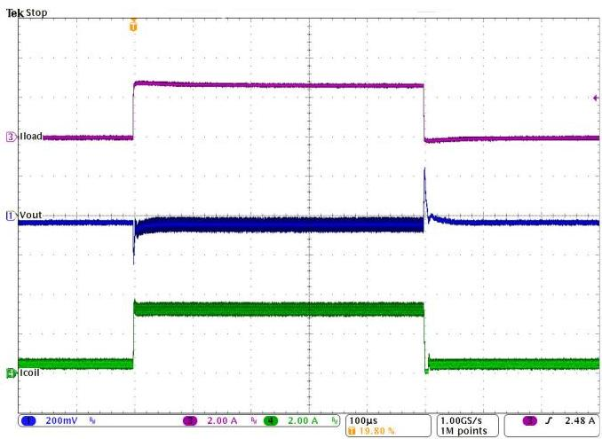
图 9-29. Power Supply Rejection Ratio
$\mathrm{I_{OUT}} = 0.5$  to 3 to  $0.5 \mathrm{~A}$

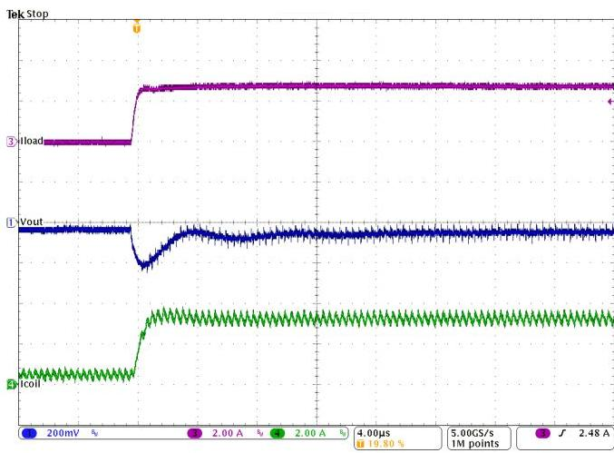
图 9-30. PWM-PSM-Transition
图 9-32. Load Transient Response of 图 9-31, Rising Edge

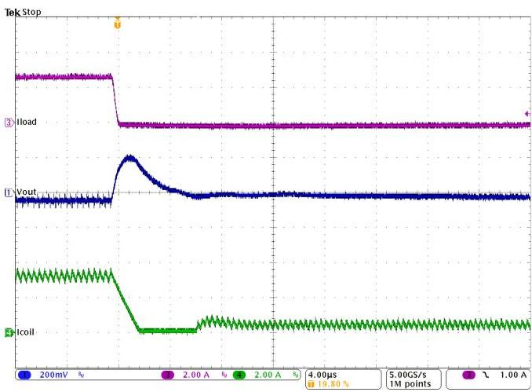
图 9-31. Load Transient Response
图 9-33. Load Transient Response of 图 9-31, Falling Edge

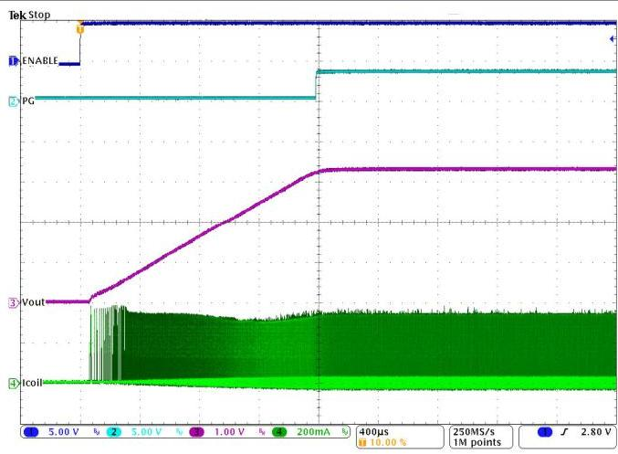
图 9-34. Start-Up Into 100 mA

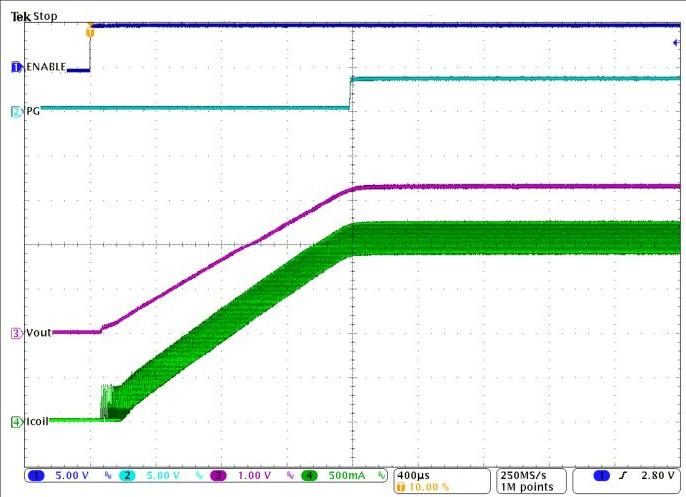
图 9-35. Start-Up Into 3 A

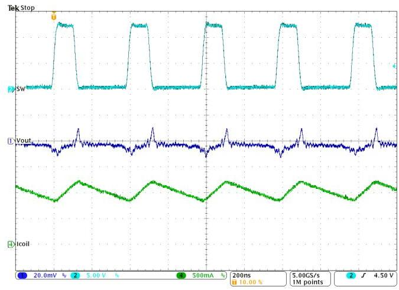
$\mathsf{I}_{\mathsf{OUT}} = 1\mathsf{A}$

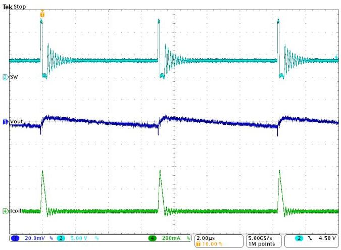
$\mathsf{I}_{\mathsf{OUT}} = 10\mathsf{mA}$

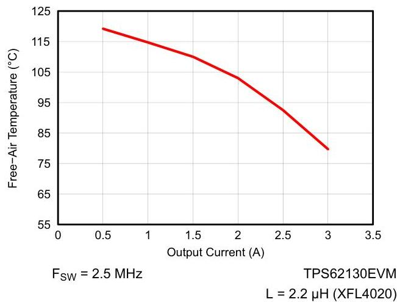
图 9-36. Typical Operation In PWM Mode
$\mathsf{F}_{\mathsf{SW}} = 2.5\mathsf{MHz}$
TPS62130EVM
$\mathsf{L} = 2.2\mu \mathsf{H}$  (XFL4020)
图 9-38. Maximum Ambient Temperature

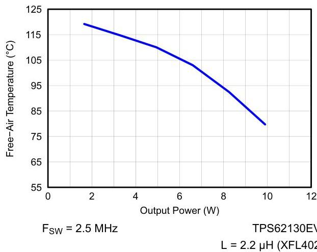
图 9-37. Typical Operation In Power Save Mode
$\mathsf{F}_{\mathsf{SW}} = 2.5\mathsf{MHz}$
TPS62130EVM
$\mathsf{L} = 2.2\mu \mathsf{H}$  (XFL4020)
图 9-39. Maximum Ambient Temperature

## 9.3 System Examples

### 9.3.1 LED Power Supply

The TPS62130 can be used as a power supply for power LEDs. The FB pin can be easily set down to lower values than nominal by using the SS/TR pin. With that, the voltage drop on the sense resistor is low to avoid excessive power loss. Since this pin provides $2.5\ \mu\mathrm{A}$, the feedback pin voltage can be adjusted by an external resistor per 方程式 15. This drop, proportional to the LED current, is used to regulate the output voltage (anode voltage) to a proper level to drive the LED. Both analog and PWM dimming are supported with the TPS62130. 图 9-40 shows an application circuit, tested with analog dimming:

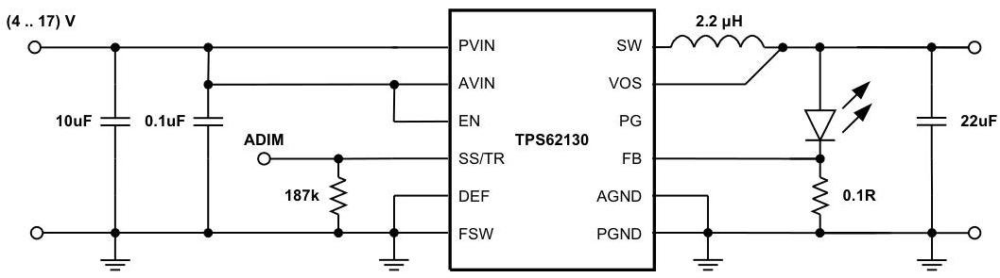
图 9-40. Single Power LED Supply

The resistor at SS/TR sets the FB voltage to a level of approximately $300\ \mathrm{mV}$ and is calculated from 方程式 15.

$$
V_{FB} = 0.64 \cdot 2.5\ \mu\mathrm{A} \cdot R_{SS/TR} \tag{15}
$$

The device now supplies a constant current, set by the resistor at the FB pin, by regulating the output voltage accordingly. The minimum input voltage has to be rated according the forward voltage needed by the LED used. More information is available in the Step-Down LED Driver With Dimming With the TPS621-Family and TPS821-Family Application Report.

### 9.3.2 Active Output Discharge

The TPS62130A pulls the PG pin Low when the device is shut down by EN, UVLO, or thermal shutdown. Connecting PG to $V_{\mathrm{OUT}}$ through a resistor can be used to discharge $V_{\mathrm{OUT}}$ in those cases (see 图 9-41). The discharge rate can be adjusted by R3, which is also used to pull up the PG pin in normal operation. For reliability, keep the maximum current into the PG pin less than $10\ \mathrm{mA}$.

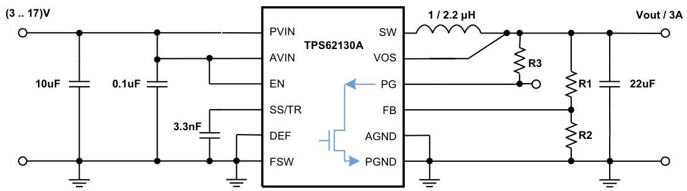
图 9-41. Discharge $V_{\mathrm{OUT}}$ Through PG Pin with TPS62130A

### 9.3.3 - 3.3-V Inverting Power Supply

The TPS62130 can be used as an inverting power supply by rearranging external circuitry as shown in 图 9-42. As the former GND node now represents a voltage level below system ground, the voltage difference between $V_{\mathrm{IN}}$ and $V_{\mathrm{OUT}}$ has to be limited for operation to the maximum supply voltage of $17\ \mathrm{V}$ (see 方程式 16).

$$
V_{IN} + |V_{\mathrm{OUT}}| \leq V_{\mathrm{INmax}} \tag{16}
$$

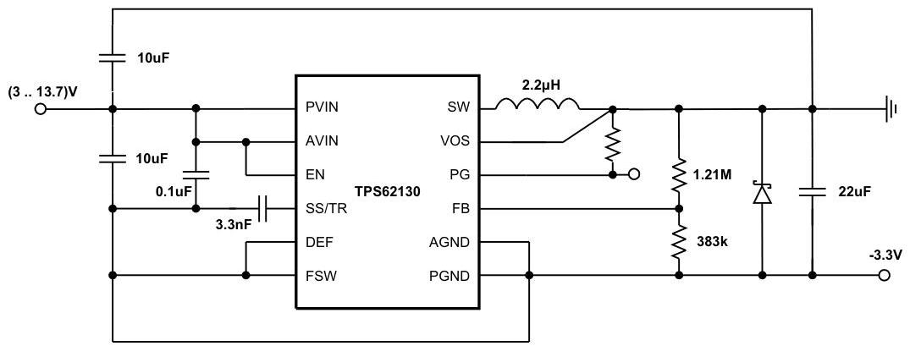
图 9-42. - 3.3-V Inverting Power Supply

The transfer function of the inverting power supply configuration differs from the buck mode transfer function, incorporating a right half plane zero additionally. The loop stability has to be adapted and an output capacitance of at least  $22\mu \mathrm{F}$  is recommended. A detailed design example is given in Using the TPS6215x in an Inverting Buck-Boost Topology Application Report.

# 9.3.4 Various Output Voltages

The following example circuits show how to use the various devices and configure the external circuitry to furnish different output voltages at 3 A.

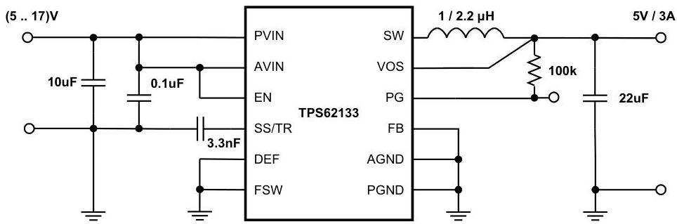
图 9-43. 5-V/3-A Power Supply

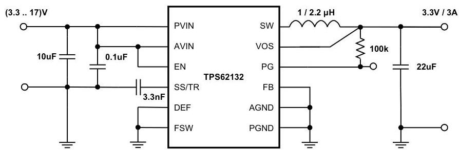
图 9-44. 3.3-V/3-A Power Supply

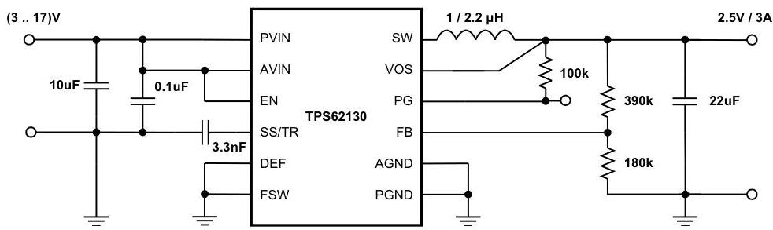
图 9-45. 2.5-V/3-A Power Supply

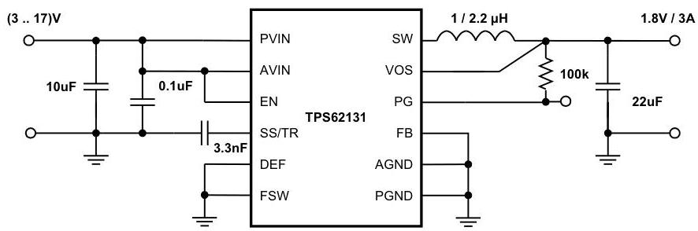
图 9-46. 1.8-V/3-A Power Supply

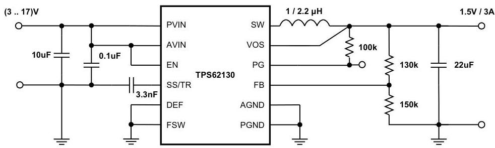
图 9-47. 1.5-V/3-A Power Supply

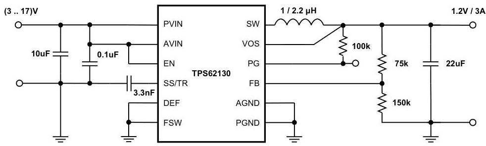
图 9-48. 1.2-V/3-A Power Supply

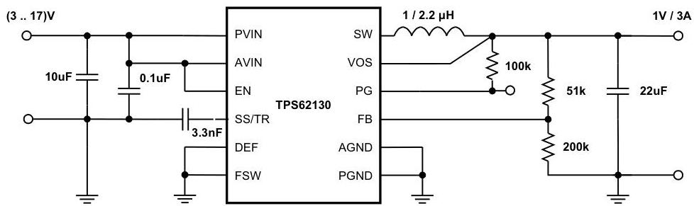
图 9-49. 1-V/3-A Power Supply

# 10 Power Supply Recommendations

The TPS6213x are designed to operate from a 3-V to 17-V input voltage supply. The output current of the input power supply needs to be rated according to the output voltage and the output current of the power rail application.

# 11 Layout

## 11.1 Layout Guidelines

A proper layout is critical for the operation of a switched mode power supply, even more at high switching frequencies. Therefore, the PCB layout of the TPS6213x demands careful attention to ensure operation and to get the performance specified. A poor layout can lead to issues like the following:

- Poor regulation (both line and load)
- Stability and accuracy weaknesses
- Increased EMI radiation
- Noise sensitivity

See 图 11-1 for the recommended layout of the TPS6213x, which is designed for common external ground connections. Therefore, both AGND and PGND pins are directly connected to the exposed thermal pad. On the PCB, the direct common ground connection of AGND and PGND to the exposed thermal pad and the system ground (ground plane) is mandatory. Also connect the VOS pin in the shortest way to $V_{\text{OUT}}$ at the output capacitor. To avoid noise coupling into the VOS line, this connection should be separated from the $V_{\text{OUT}}$ power line/plane as shown in 节 11.2.

Provide low inductive and resistive paths for loops with high di/dt. Therefore, paths conducting the switched load current should be as short and wide as possible. Provide low capacitive paths (with respect to all other nodes) for wires with high dv/dt. Therefore, the input and output capacitance should be placed as close as possible to the IC pins and parallel wiring over long distances as well as narrow traces should be avoided. Loops which conduct an alternating current should outline an area as small as possible, as this area is proportional to the energy radiated.

Sensitive nodes like FB and VOS need to be connected with short wires and not nearby high dv/dt signals (for example, SW). As they carry information about the output voltage, they should be connected as close as possible to the actual output voltage (at the output capacitor). The capacitor on the SS/TR pin and on AVIN as well as the FB resistors, R1 and R2, should be kept close to the IC and connect directly to those pins and the system ground plane.

The exposed thermal pad must be soldered to the circuit board for mechanical reliability and to achieve appropriate power dissipation.

The recommended layout is implemented on the EVM and shown in the TPS6213x Buck Converter Evaluation Module User's Guide. Additionally, the Gebers for HPA505 EVM are available for download.

# 11.2 Layout Example

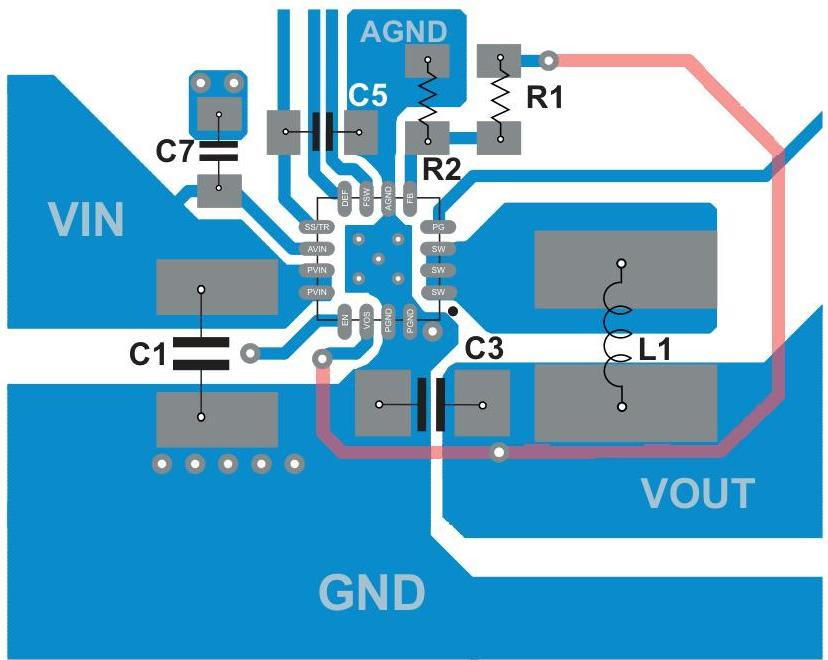
图11-1. Layout Example

# 11.3 Thermal Information

Implementation of integrated circuits in low-profile and fine-pitch surface-mount packages typically requires special attention to power dissipation. Many system-dependent issues such as thermal coupling, airflow, added heat sinks and convection surfaces, and the presence of other heat-generating components affect the power-dissipation limits of a given component.

Three basic approaches for enhancing thermal performance are listed below:

- Improving the power dissipation capability of the PCB design
- Improving the thermal coupling of the component to the PCB by soldering the Exposed Thermal Pad
- Introducing airflow in the system

For more details on how to use the thermal parameters, see the application notes: Thermal Characteristics of Linear and Logic Packages Using JEDEC PCB Designs Application Report and Semiconductor and IC Package Thermal Metrics Application Report.

The TPS6213x is designed for a maximum operating junction temperature  $(T_{\mathrm{J}})$  of  $125^{\circ}\mathrm{C}$ . Therefore, the maximum output power is limited by the power losses that can be dissipated over the actual thermal resistance, given by the package and the surrounding PCB structures. Since the thermal resistance of the package is fixed, increasing the size of the surrounding copper area and improving the thermal connection to the IC can reduce the thermal resistance. To get an improved thermal behavior, it is recommended to use top layer metal to connect the device with wide and thick metal lines. Internal ground layers can connect to vias directly under the IC for improved thermal performance.

If short circuit or overload conditions are present, the device is protected by limiting internal power dissipation. Experimental data, taken from the TPS62130 EVM, shows the maximum ambient temperature (without additional cooling like airflow or heat sink), that can be allowed to limit the junction temperature to at most  $125^{\circ}\mathrm{C}$  (see 9-38).

# 12 Device and Documentation Support

## 12.1 Device Support

### 12.1.1 第三方产品免责声明

TI 发布的与第三方产品或服务有关的信息，不能构成与此类产品或服务或保修的适用性有关的认可，不能构成此类产品或服务单独或与任何 TI 产品或服务一起的表示或认可。

## 12.2 Documentation Support

### 12.2.1 Related Documentation

- Texas Instruments, Voltage Margining Using the TPS62130 Application Report
- Texas Instruments, Using the TPS62150 as Step-Down LED Driver With Dimming Application Report
- Texas Instruments, Using the TPS6215x in an Inverting Buck-Boost Topology Application Report
- Texas Instruments, Optimizing the TPS62130/40/50/60/70 Output Filter Application Report
- Texas Instruments, TPS62130/40/50 Sequencing and Tracking Application Report
- Texas Instruments, Optimizing Transient Response of Internally Compensated dc-dc Converters With Feedforward Capacitor Application Report
- Texas Instruments, Using a Feedforward Capacitor to Improve Stability and Bandwidth of TPS62130/40/50/60/70 Application Report
- Texas Instruments, Thermal Characteristics of Linear and Logic Packages Using JEDEC PCB Designs Application Report
- Texas Instruments, Semiconductor and IC Package Thermal Metrics Application Report
- Texas Instruments, TPS62130EVM-505, TPS62140EVM-505, and TPS62150EVM-505 Evaluation Modules User's Guide
- Texas Instruments, EVM Gerber Data

## 12.3 接收文档更新通知

要接收文档更新通知，请导航至 ti.com 上的器件产品文件夹。点击订阅更新 进行注册，即可每周接收产品信息更改摘要。有关更改的详细信息，请查看任何已修订文档中包含的修订历史记录。

## 12.4 支持资源

TI E2E™ 支持论坛是工程师的重要参考资料，可直接从专家获得快速、经过验证的解答和设计帮助。搜索现有解答或提出自己的问题可获得所需的快速设计帮助。

链接的内容由各个贡献者“按原样”提供。这些内容并不构成 TI 技术规范，并且不一定反映 TI 的观点；请参阅 TI 的《使用条款》。

## 12.5 Trademarks

DCS-Control™ and TI E2E™ are trademarks of Texas Instruments.

所有商标均为其各自所有者的财产。

## 12.6 Electrostatic Discharge Caution

This integrated circuit can be damaged by ESD. Texas Instruments recommends that all integrated circuits be handled with appropriate precautions. Failure to observe proper handling and installation procedures can cause damage.

ESD damage can range from subtle performance degradation to complete device failure. Precision integrated circuits may be more susceptible to damage because very small parametric changes could cause the device not to meet its published specifications.

## 12.7 术语表

TI 术语表 本术语表列出并解释了术语、首字母缩略词和定义。

# 13 Mechanical, Packaging, and Orderable Information

The following pages include mechanical, packaging, and orderable information. This information is the most current data available for the designated devices. This data is subject to change without notice and revision of this document. For browser-based versions of this data sheet, refer to the left-hand navigation.

# 重要声明和免责声明

TI 提供技术和可靠性数据（包括数据表）、设计资源（包括参考设计）、应用或其他设计建议、网络工具、安全信息和其他资源，不保证没有瑕疵且不做出任何明示或暗示的担保，包括但不限于对适销性、某特定用途方面的适用性或不侵犯任何第三方知识产权的暗示担保。

这些资源可供使用 TI 产品进行设计的熟练开发人员使用。您将自行承担以下全部责任：(1) 针对您的应用选择合适的 TI 产品，(2) 设计、验证并测试您的应用，(3) 确保您的应用满足相应标准以及任何其他安全、安保或其他要求。这些资源如有变更，恕不另行通知。TI 授权您仅可将这些资源用于研发本资源所述的 TI 产品的应用。严禁对这些资源进行其他复制或展示。您无权使用任何其他 TI 知识产权或任何第三方知识产权。您应全额赔偿因在这些资源的使用中对 TI 及其代表造成的任何索赔、损害、成本、损失和债务，TI 对此概不负责。

TI 提供的产品受 TI 的销售条款 (https://www.ti.com/legal/termsofsale.html) 或 ti.com 上其他适用条款/TI 产品随附的其他适用条款的约束。TI 提供这些资源并不会扩展或以其他方式更改 TI 针对 TI 产品发布的适用的担保或担保免责声明。

邮寄地址：Texas Instruments, Post Office Box 655303, Dallas, Texas 75265
Copyright © 2021，德州仪器 (TI) 公司PACKAGING INFORMATION

| Orderable part number | Status (1) | Material type (2) | Package | Pins | Package qty | Carrier | RoHS (3) | Lead finish/ Ball material (4) | MSL rating/ Peak reflow (5) | Op temp (°C) | Part marking (6) |
| --- | --- | --- | --- | --- | --- | --- | --- | --- | --- | --- | --- |
| TPS62130ARGTR | Active | Production | VQFN (RGT) | 16 | 3000 | LARGE T&R | Yes | NIPDAU | Level-2-260C-1 YEAR | -40 to 125 | PA6I |
| TPS62130ARGTR.A | Active | Production | VQFN (RGT) | 16 | 3000 | LARGE T&R | Yes | NIPDAU | Level-2-260C-1 YEAR | -40 to 125 | PA6I |
| TPS62130ARGTR.B | Active | Production | VQFN (RGT) | 16 | 3000 | LARGE T&R | Yes | NIPDAU | Level-2-260C-1 YEAR | -40 to 125 | PA6I |
| TPS62130ARGTRG4 | Active | Production | VQFN (RGT) | 16 | 3000 | LARGE T&R | Yes | NIPDAU | Level-2-260C-1 YEAR | -40 to 125 | PA6I |
| TPS62130ARGTRG4.A | Active | Production | VQFN (RGT) | 16 | 3000 | LARGE T&R | Yes | NIPDAU | Level-2-260C-1 YEAR | -40 to 125 | PA6I |
| TPS62130ARGTRG4.B | Active | Production | VQFN (RGT) | 16 | 3000 | LARGE T&R | Yes | NIPDAU | Level-2-260C-1 YEAR | -40 to 125 | PA6I |
| TPS62130ARGTT | Active | Production | VQFN (RGT) | 16 | 250 | SMALL T&R | Yes | NIPDAU | Level-2-260C-1 YEAR | -40 to 125 | PA6I |
| TPS62130ARGTT.A | Active | Production | VQFN (RGT) | 16 | 250 | SMALL T&R | Yes | NIPDAU | Level-2-260C-1 YEAR | -40 to 125 | PA6I |
| TPS62130ARGTT.B | Active | Production | VQFN (RGT) | 16 | 250 | SMALL T&R | Yes | NIPDAU | Level-2-260C-1 YEAR | -40 to 125 | PA6I |
| TPS62130RGTR | Active | Production | VQFN (RGT) | 16 | 3000 | LARGE T&R | Yes | NIPDAU | Level-2-260C-1 YEAR | -40 to 125 | PTSI |
| TPS62130RGTR.A | Active | Production | VQFN (RGT) | 16 | 3000 | LARGE T&R | Yes | NIPDAU | Level-2-260C-1 YEAR | -40 to 125 | PTSI |
| TPS62130RGTR.B | Active | Production | VQFN (RGT) | 16 | 3000 | LARGE T&R | Yes | NIPDAU | Level-2-260C-1 YEAR | -40 to 125 | PTSI |
| TPS62130RGTRG4 | Active | Production | VQFN (RGT) | 16 | 3000 | LARGE T&R | Yes | NIPDAU | Level-2-260C-1 YEAR | -40 to 125 | PTSI |
| TPS62130RGTRG4.A | Active | Production | VQFN (RGT) | 16 | 3000 | LARGE T&R | Yes | NIPDAU | Level-2-260C-1 YEAR | -40 to 125 | PTSI |
| TPS62130RGTRG4.B | Active | Production | VQFN (RGT) | 16 | 3000 | LARGE T&R | Yes | NIPDAU | Level-2-260C-1 YEAR | -40 to 125 | PTSI |
| TPS62130RGTT | Active | Production | VQFN (RGT) | 16 | 250 | SMALL T&R | Yes | NIPDAU | Level-2-260C-1 YEAR | -40 to 125 | PTSI |
| TPS62130RGTT.A | Active | Production | VQFN (RGT) | 16 | 250 | SMALL T&R | Yes | NIPDAU | Level-2-260C-1 YEAR | -40 to 125 | PTSI |
| TPS62130RGTT.B | Active | Production | VQFN (RGT) | 16 | 250 | SMALL T&R | Yes | NIPDAU | Level-2-260C-1 YEAR | -40 to 125 | PTSI |
| TPS62131RGTR | Active | Production | VQFN (RGT) | 16 | 3000 | LARGE T&R | Yes | NIPDAU | Level-1-260C-UNLIM | -40 to 125 | QVX |
| TPS62131RGTR.A | Active | Production | VQFN (RGT) | 16 | 3000 | LARGE T&R | Yes | NIPDAU | Level-1-260C-UNLIM | -40 to 125 | QVX |
| TPS62131RGTR.B | Active | Production | VQFN (RGT) | 16 | 3000 | LARGE T&R | Yes | NIPDAU | Level-1-260C-UNLIM | -40 to 125 | QVX |
| TPS62131RGTT | Active | Production | VQFN (RGT) | 16 | 250 | SMALL T&R | Yes | NIPDAU | Level-1-260C-UNLIM | -40 to 125 | QVX |
| TPS62131RGTT.A | Active | Production | VQFN (RGT) | 16 | 250 | SMALL T&R | Yes | NIPDAU | Level-1-260C-UNLIM | -40 to 125 | QVX |
| TPS62131RGTT.B | Active | Production | VQFN (RGT) | 16 | 250 | SMALL T&R | Yes | NIPDAU | Level-1-260C-UNLIM | -40 to 125 | QVX |

| Orderable part number | Status (1) | Material type (2) | Package | Pins | Package qty | Carrier | RoHS (3) | Lead finish/ Ball material (4) | MSL rating/ Peak reflow (5) | Op temp (°C) | Part marking (6) |
| --- | --- | --- | --- | --- | --- | --- | --- | --- | --- | --- | --- |
| TPS62132RGTRG4.B | Active | Production | VQFN (RGT) | 16 | 3000 | LARGE T&R | Yes | NIPDAU | Level-1-260C-UNLIM | -40 to 125 | QVY |
| TPS62132RGTT | Active | Production | VQFN (RGT) | 16 | 250 | SMALL T&R | Yes | NIPDAU | Level-1-260C-UNLIM | -40 to 125 | QVY |
| TPS62132RGTT.A | Active | Production | VQFN (RGT) | 16 | 250 | SMALL T&R | Yes | NIPDAU | Level-1-260C-UNLIM | -40 to 125 | QVY |
| TPS62132RGTT.B | Active | Production | VQFN (RGT) | 16 | 250 | SMALL T&R | Yes | NIPDAU | Level-1-260C-UNLIM | -40 to 125 | QVY |
| TPS62133RGTR | Active | Production | VQFN (RGT) | 16 | 3000 | LARGE T&R | Yes | NIPDAU | Level-1-260C-UNLIM | -40 to 125 | QVZ |
| TPS62133RGTR.B | Active | Production | VQFN (RGT) | 16 | 3000 | LARGE T&R | Yes | NIPDAU | Level-1-260C-UNLIM | -40 to 125 | QVZ |
| TPS62133RGTT | Active | Production | VQFN (RGT) | 16 | 250 | SMALL T&R | Yes | NIPDAU | Level-1-260C-UNLIM | -40 to 125 | QVZ |
| TPS62133RGTT.B | Active | Production | VQFN (RGT) | 16 | 250 | SMALL T&R | Yes | NIPDAU | Level-1-260C-UNLIM | -40 to 125 | QVZ |
| TPS62133RGTTG4 | Active | Production | VQFN (RGT) | 16 | 250 | SMALL T&R | Yes | NIPDAU | Level-2-260C-1 YEAR | -40 to 125 | QVZ |
| TPS62133RGTTG4.B | Active | Production | VQFN (RGT) | 16 | 250 | SMALL T&R | Yes | NIPDAU | Level-2-260C-1 YEAR | -40 to 125 | QVZ |

(1) Status: For more details on status, see our product life cycle.

(2) Material type: When designated, preproduction parts are prototypes/experimental devices, and are not yet approved or released for full production. Testing and final process, including without limitation quality assurance, reliability performance testing, and/or process qualification, may not yet be complete, and this item is subject to further changes or possible discontinuation. If available for ordering, purchases will be subject to an additional waiver at checkout, and are intended for early internal evaluation purposes only. These items are sold without warranties of any kind.

(3) RoHS values: Yes, No, RoHS Exempt. See the TI RoHS Statement for additional information and value definition.

(4) Lead finish/Ball material: Parts may have multiple material finish options. Finish options are separated by a vertical ruled line. Lead finish/Ball material values may wrap to two lines if the finish value exceeds the maximum column width.

(5) MSL rating/Peak reflow: The moisture sensitivity level ratings and peak solder (reflow) temperatures. In the event that a part has multiple moisture sensitivity ratings, only the lowest level per JEDEC standards is shown. Refer to the shipping label for the actual reflow temperature that will be used to mount the part to the printed circuit board.

(6) Part marking: There may be an additional marking, which relates to the logo, the lot trace code information, or the environmental category of the part.

Multiple part markings will be inside parentheses. Only one part marking contained in parentheses and separated by a "~" will appear on a part. If a line is indented then it is a continuation of the previous line and the two combined represent the entire part marking for that device.

Important Information and Disclaimer: The information provided on this page represents TI's knowledge and belief as of the date that it is provided. TI bases its knowledge and belief on information provided by third parties, and makes no representation or warranty as to the accuracy of such information. Efforts are underway to better integrate information from third parties. TI has taken and continues to take reasonable steps to provide representative and accurate information but may not have conducted destructive testing or chemical analysis on incoming materials and chemicals. TI and TI suppliers consider certain information to be proprietary, and thus CAS numbers and other limited information may not be available for release.

In no event shall TI's liability arising out of such information exceed the total purchase price of the TI part(s) at issue in this document sold by TI to Customer on an annual basis.

OTHER QUALIFIED VERSIONS OF TPS62130A :
- Automotive : TPS62130A-Q1

NOTE: Qualified Version Definitions:
- Automotive - Q100 devices qualified for high-reliability automotive applications targeting zero defects

# TAPE AND REEL INFORMATION

REEL DIMENSIONS

TAPE DIMENSIONS

|  A0 | Dimension designed to accommodate the component width  |
| --- | --- |
|  B0 | Dimension designed to accommodate the component length  |
|  K0 | Dimension designed to accommodate the component thickness  |
|  W | Overall width of the carrier tape  |
|  P1 | Pitch between successive cavity centers  |

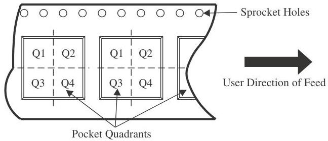
QUADRANT ASSIGNMENTS FOR PIN 1 ORIENTATION IN TAPE

*All dimensions are nominal

|  Device | Package Type | Package Drawing | Pins | SPQ | Reel Diameter (mm) | Reel Width W1 (mm) | A0 (mm) | B0 (mm) | K0 (mm) | P1 (mm) | W (mm) | Pin1 Quadrant  |
| --- | --- | --- | --- | --- | --- | --- | --- | --- | --- | --- | --- | --- |
|  TPS62130ARGTR | VQFN | RGT | 16 | 3000 | 330.0 | 12.4 | 3.3 | 3.3 | 1.1 | 8.0 | 12.0 | Q2  |
|  TPS62130ARGTRG4 | VQFN | RGT | 16 | 3000 | 330.0 | 12.4 | 3.3 | 3.3 | 1.1 | 8.0 | 12.0 | Q2  |
|  TPS62130ARGTT | VQFN | RGT | 16 | 250 | 180.0 | 12.4 | 3.3 | 3.3 | 1.1 | 8.0 | 12.0 | Q2  |
|  TPS62130RGTR | VQFN | RGT | 16 | 3000 | 330.0 | 12.4 | 3.3 | 3.3 | 1.1 | 8.0 | 12.0 | Q2  |
|  TPS62130RGTRG4 | VQFN | RGT | 16 | 3000 | 330.0 | 12.4 | 3.3 | 3.3 | 1.1 | 8.0 | 12.0 | Q2  |
|  TPS62130RGTT | VQFN | RGT | 16 | 250 | 180.0 | 12.4 | 3.3 | 3.3 | 1.1 | 8.0 | 12.0 | Q2  |
|  TPS62131RGTR | VQFN | RGT | 16 | 3000 | 330.0 | 12.4 | 3.3 | 3.3 | 1.1 | 8.0 | 12.0 | Q2  |
|  TPS62131RGTT | VQFN | RGT | 16 | 250 | 180.0 | 12.4 | 3.3 | 3.3 | 1.1 | 8.0 | 12.0 | Q2  |
|  TPS62132RGTR | VQFN | RGT | 16 | 3000 | 330.0 | 12.4 | 3.3 | 3.3 | 1.1 | 8.0 | 12.0 | Q2  |
|  TPS62132RGTR | VQFN | RGT | 16 | 3000 | 330.0 | 12.4 | 3.3 | 3.3 | 1.1 | 8.0 | 12.0 | Q2  |
|  TPS62132RGTRG4 | VQFN | RGT | 16 | 3000 | 330.0 | 12.4 | 3.3 | 3.3 | 1.1 | 8.0 | 12.0 | Q2  |
|  TPS62132RGTT | VQFN | RGT | 16 | 250 | 180.0 | 12.4 | 3.3 | 3.3 | 1.1 | 8.0 | 12.0 | Q2  |
|  TPS62132RGTT | VQFN | RGT | 16 | 250 | 180.0 | 12.4 | 3.3 | 3.3 | 1.1 | 8.0 | 12.0 | Q2  |
|  TPS62133RGTR | VQFN | RGT | 16 | 3000 | 330.0 | 12.4 | 3.3 | 3.3 | 1.1 | 8.0 | 12.0 | Q2  |
|  TPS62133RGTT | VQFN | RGT | 16 | 250 | 180.0 | 12.4 | 3.3 | 3.3 | 1.1 | 8.0 | 12.0 | Q2  |
|  TPS62133RGTTG4 | VQFN | RGT | 16 | 250 | 180.0 | 12.4 | 3.3 | 3.3 | 1.1 | 8.0 | 12.0 | Q2  |

TAPE AND REEL BOX DIMENSIONS

*All dimensions are nominal

|  Device | Package Type | Package Drawing | Pins | SPQ | Length (mm) | Width (mm) | Height (mm)  |
| --- | --- | --- | --- | --- | --- | --- | --- |
|  TPS62130ARGTR | VQFN | RGT | 16 | 3000 | 346.0 | 346.0 | 33.0  |
|  TPS62130ARGTRG4 | VQFN | RGT | 16 | 3000 | 552.0 | 346.0 | 36.0  |
|  TPS62130ARGTT | VQFN | RGT | 16 | 250 | 210.0 | 185.0 | 35.0  |
|  TPS62130RGTR | VQFN | RGT | 16 | 3000 | 552.0 | 346.0 | 36.0  |
|  TPS62130RGTRG4 | VQFN | RGT | 16 | 3000 | 552.0 | 346.0 | 36.0  |
|  TPS62130RGTT | VQFN | RGT | 16 | 250 | 552.0 | 185.0 | 36.0  |
|  TPS62131RGTR | VQFN | RGT | 16 | 3000 | 552.0 | 346.0 | 36.0  |
|  TPS62131RGTT | VQFN | RGT | 16 | 250 | 552.0 | 182.0 | 36.0  |
|  TPS62132RGTR | VQFN | RGT | 16 | 3000 | 346.0 | 346.0 | 33.0  |
|  TPS62132RGTR | VQFN | RGT | 16 | 3000 | 367.0 | 367.0 | 35.0  |
|  TPS62132RGTRG4 | VQFN | RGT | 16 | 3000 | 367.0 | 367.0 | 35.0  |
|  TPS62132RGTT | VQFN | RGT | 16 | 250 | 210.0 | 185.0 | 35.0  |
|  TPS62132RGTT | VQFN | RGT | 16 | 250 | 182.0 | 182.0 | 20.0  |
|  TPS62133RGTR | VQFN | RGT | 16 | 3000 | 552.0 | 346.0 | 36.0  |
|  TPS62133RGTT | VQFN | RGT | 16 | 250 | 552.0 | 182.0 | 36.0  |
|  TPS62133RGTTG4 | VQFN | RGT | 16 | 250 | 552.0 | 185.0 | 36.0  |

# TUBE

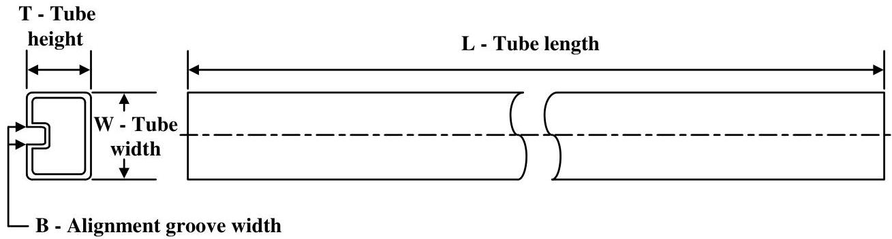

*All dimensions are nominal

|  Device | Package Name | Package Type | Pins | SPQ | L (mm) | W (mm) | T (μm) | B (mm)  |
| --- | --- | --- | --- | --- | --- | --- | --- | --- |
|  TPS62130ARGTRG4 | RGT | VQFN | 16 | 3000 | 381 | 4.83 | 2286 | 0  |
|  TPS62130ARGTRG4.A | RGT | VQFN | 16 | 3000 | 381 | 4.83 | 2286 | 0  |
|  TPS62130ARGTRG4.B | RGT | VQFN | 16 | 3000 | 381 | 4.83 | 2286 | 0  |
|  TPS62130RGTR | RGT | VQFN | 16 | 3000 | 381 | 4.83 | 2286 | 0  |
|  TPS62130RGTR.A | RGT | VQFN | 16 | 3000 | 381 | 4.83 | 2286 | 0  |
|  TPS62130RGTR.B | RGT | VQFN | 16 | 3000 | 381 | 4.83 | 2286 | 0  |
|  TPS62130RGTRG4 | RGT | VQFN | 16 | 3000 | 381 | 4.83 | 2286 | 0  |
|  TPS62130RGTRG4.A | RGT | VQFN | 16 | 3000 | 381 | 4.83 | 2286 | 0  |
|  TPS62130RGTRG4.B | RGT | VQFN | 16 | 3000 | 381 | 4.83 | 2286 | 0  |
|  TPS62130RGTT | RGT | VQFN | 16 | 250 | 381 | 4.83 | 2286 | 0  |
|  TPS62130RGTT.A | RGT | VQFN | 16 | 250 | 381 | 4.83 | 2286 | 0  |
|  TPS62130RGTT.B | RGT | VQFN | 16 | 250 | 381 | 4.83 | 2286 | 0  |
|  TPS62131RGTR | RGT | VQFN | 16 | 3000 | 381 | 4.83 | 2286 | 0  |
|  TPS62131RGTR.A | RGT | VQFN | 16 | 3000 | 381 | 4.83 | 2286 | 0  |
|  TPS62131RGTR.B | RGT | VQFN | 16 | 3000 | 381 | 4.83 | 2286 | 0  |
|  TPS62131RGTT | RGT | VQFN | 16 | 250 | 381 | 4.83 | 2286 | 0  |
|  TPS62131RGTT.A | RGT | VQFN | 16 | 250 | 381 | 4.83 | 2286 | 0  |
|  TPS62131RGTT.B | RGT | VQFN | 16 | 250 | 381 | 4.83 | 2286 | 0  |
|  TPS62133RGTR | RGT | VQFN | 16 | 3000 | 381 | 4.83 | 2286 | 0  |
|  TPS62133RGTR.B | RGT | VQFN | 16 | 3000 | 381 | 4.83 | 2286 | 0  |
|  TPS62133RGTT | RGT | VQFN | 16 | 250 | 381 | 4.83 | 2286 | 0  |
|  TPS62133RGTT.B | RGT | VQFN | 16 | 250 | 381 | 4.83 | 2286 | 0  |
|  TPS62133RGTTG4 | RGT | VQFN | 16 | 250 | 381 | 4.83 | 2286 | 0  |
|  TPS62133RGTTG4.B | RGT | VQFN | 16 | 250 | 381 | 4.83 | 2286 | 0  |

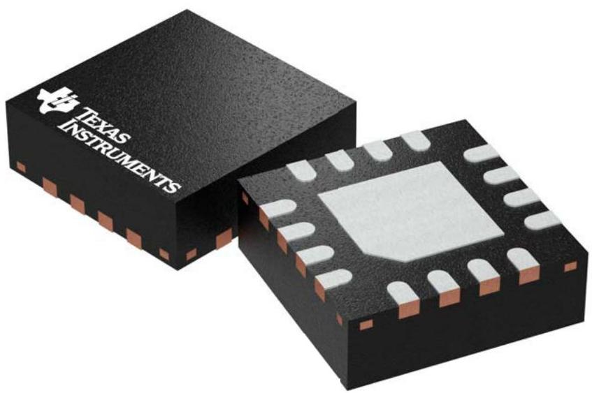

Images above are just a representation of the package family, actual package may vary. Refer to the product data sheet for package details.

4203495/1

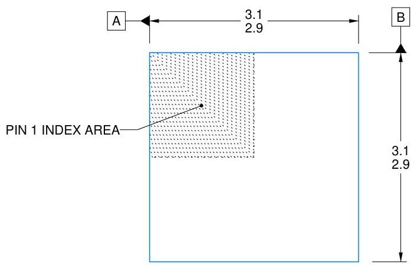

|  SIDE WALL METAL THICKNESS DIM A  |   |
| --- | --- |
|  OPTION 1 | OPTION 2  |
|  0.1 | 0.2  |

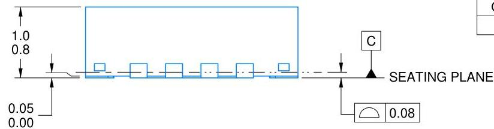

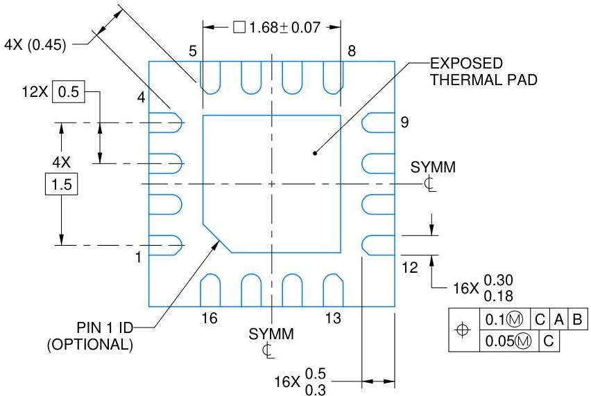

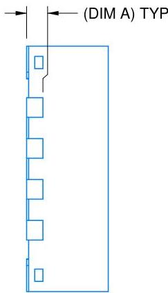

4222419/E 07/2025

# NOTES:

1. All linear dimensions are in millimeters. Any dimensions in parenthesis are for reference only. Dimensioning and tolerancing per ASME Y14.5M.
2. This drawing is subject to change without notice.
3. The package thermal pad must be soldered to the printed circuit board for thermal and mechanical performance.

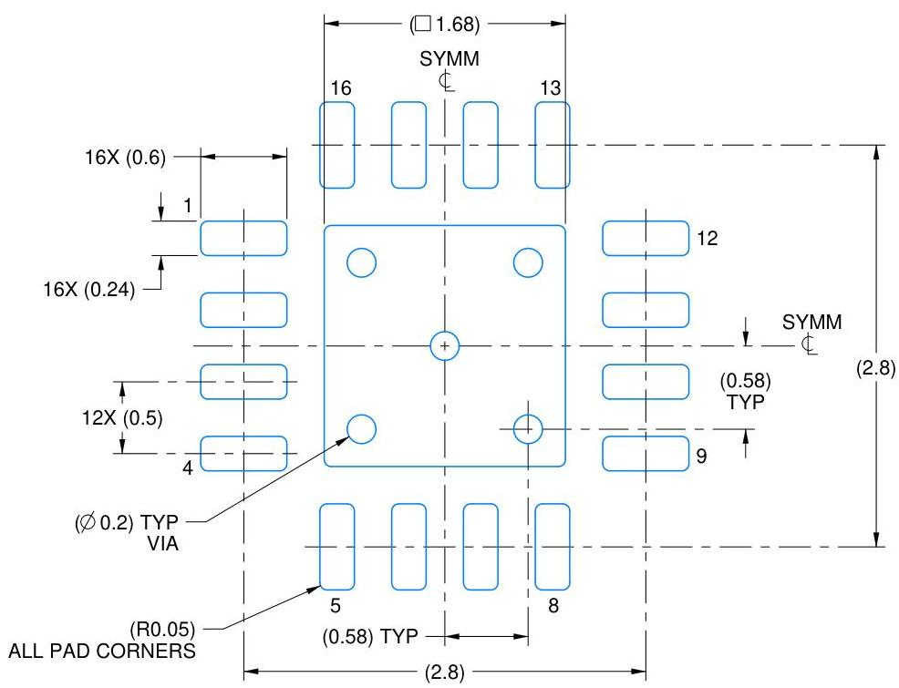
LAND PATTERN EXAMPLE
EXPOSED METAL SHOWN
SCALE:20X

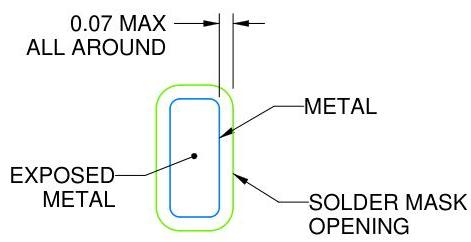
NON SOLDER MASK
DEFINED
(PREFERRED)

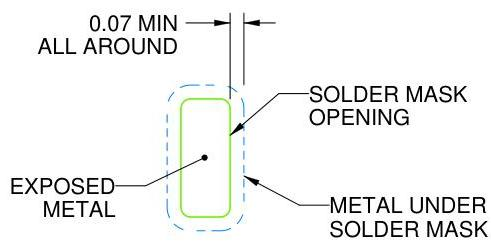
SOLDER MASK
DEFINED

# SOLDER MASK DETAILS

4222419/E 07/2025

NOTES: (continued)

4. This package is designed to be soldered to a thermal pad on the board. For more information, see Texas Instruments literature number SLUA271 (www.ti.com/lit/slua271).
5. Vias are optional depending on application, refer to device data sheet. If any vias are implemented, refer to their locations shown on this view. It is recommended that vias under paste be filled, plugged or tented.

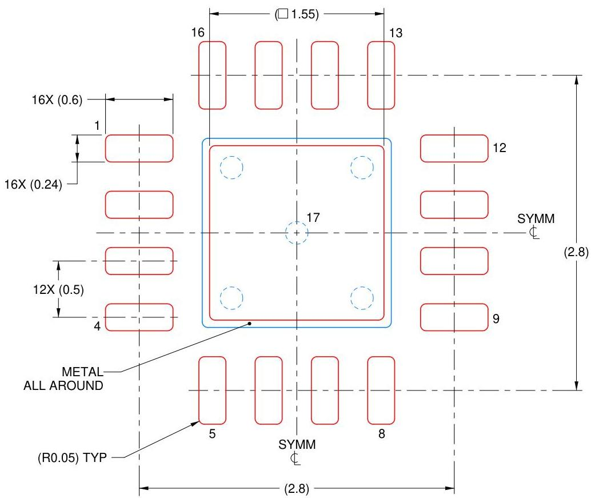

SOLDER PASTE EXAMPLE
BASED ON 0.125 mm THICK STENCIL

EXPOSED PAD 17:
85% PRINTED SOLDER COVERAGE BY AREA UNDER PACKAGE
SCALE:25X

4222419/E 07/2025

NOTES: (continued)

6. Laser cutting apertures with trapezoidal walls and rounded corners may offer better paste release. IPC-7525 may have alternate design recommendations.

# 重要通知和免责声明

TI“按原样”提供技术和可靠性数据（包括数据表）、设计资源（包括参考设计）、应用或其他设计建议、网络工具、安全信息和其他资源，不保证没有瑕疵且不做出任何明示或暗示的担保，包括但不限于对适销性、与某特定用途的适用性或不侵犯任何第三方知识产权的暗示担保。

这些资源可供使用TI产品进行设计的熟练开发人员使用。您将自行承担以下全部责任：(1) 针对您的应用选择合适的TI产品，(2) 设计、验证并测试您的应用，(3) 确保您的应用满足相应标准以及任何其他安全、安保法规或其他要求。

这些资源如有变更，恕不另行通知。TI授权您仅可将这些资源用于研发本资源所述的TI产品的相关应用。严禁以其他方式对这些资源进行复制或展示。您无权使用任何其他TI知识产权或任何第三方知识产权。对于因您对这些资源的使用而对TI及其代表造成的任何索赔、损害、成本、损失和债务，您将全额赔偿，TI对此概不负责。

TI提供的产品受TI销售条款)、TI通用质量指南或ti.com上其他适用条款或TI产品随附的其他适用条款的约束。TI提供这些资源并不会扩展或以其他方式更改TI针对TI产品发布的适用的担保或担保免责声明。除非德州仪器(TI)明确将某产品指定为定制产品或客户特定产品，否则其产品均为按确定价格收入目录的标准通用器件。

TI反对并拒绝您可能提出的任何其他或不同的条款。

版权所有 © 2026，德州仪器 (TI) 公司

最后更新日期：2025年10月