# TPS7A39 双路、150mA、宽 VIN、正负 LDO 电压稳压器

## 1 特性

- 正负 LDO 包含在一个封装中
- 宽输入电压范围：±3.3V 至 ±33V
- 宽输出电压范围：
- 正电压范围：1.2V 至 30V
- 负电压范围：-30V 至 0V
- 输出电流：每通道 150mA
- 单调启动跟踪
- 高电源抑制比 (PSRR)：
- 69dB (120Hz)
- ≥ 50dB (10Hz 至 2MHz)
- 输出电压噪声：21μV RMS (10Hz - 100kHz)
- 1.2V 缓冲参考输出
- 与 10μF 或更大的输出电容器搭配使用时可保持稳定
- 单个正逻辑使能
- 可调软启动浪涌控制
- 3mm × 3mm，10 引脚 WSON 封装
- 低热阻：R₀JA = 44.4°C/W
- 工作温度范围：-40°C 至 +125°C

## 2 应用

- 电动汽车充电基础设施
- 交流充电站
- 工业自动化
- 医疗成像
- 储能系统
- PC 和笔记本电脑

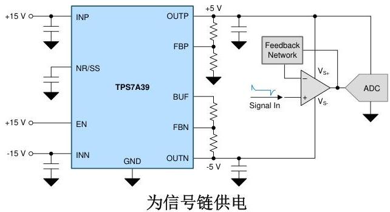

## 3 说明

TPS7A39 是双路、单片、高 PSRR、正负极低压降 (LDO) 稳压器，支持高达 150mA 的拉电流（和灌电流）。此器件的输出可以独立且外部调整为对称或非对称电压，使其成为为信号调节提供双极性电源的明智之选。

TPS7A39 的正负两种输出在启动期间相互进行比例跟踪，从而缓解双轨系统中常见的浮动状况和其他电源时序问题。负输出可调节至高达 0V，从而扩展单电源放大器的共模范围。TPS7A39 还具有高 PSRR，因此消除了可能影响信号完整性的电源噪声，例如开关噪声。

封装信息

|  器件型号 | 封装(1) | 封装尺寸(2)  |
| --- | --- | --- |
|  TPS7A39 | DSC (WSON, 10) | 3mm × 3mm  |

(1) 如需更多信息，请参阅机械、封装和可订购信息。
(2) 封装尺寸（长 × 宽）为标称值，并包括引脚（如适用）。

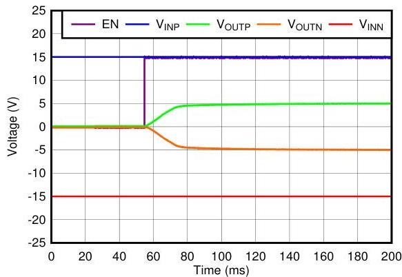
单调启动跟踪

两个稳压器通过与标准数字逻辑对接的单个正逻辑使能引脚进行控制。可通过电容器编程的软启动功能可控制浪涌电流和启动时间。TPS7A39 的内部基准电压可用外部基准电压覆盖，从而实现精密输出，获得输出电压裕量或跟踪其他电源。此外，TPS7A39 具有缓冲基准输出，此输出可用作系统中其他组件的电压基准。

这些特性使得 TPS7A39 成为一种为运算放大器、数模转换器 (DAC) 以及其他精密模拟电路供电的强大而简化的解决方案。

# 内容

1 特性...1
2 应用...1
3 说明...1
4 引脚配置和功能...4
5 规格...5
5.1 绝对最大额定值...5
5.2 ESD 等级...5
5.3 建议运行条件...6
5.4 热性能信息...6
5.5 电气特性...7
5.6 启动特性...9
5.7 时序图...10
5.8 典型特性...11
6 详细说明...22
6.1 概述...22
6.2 功能方框图...22
6.3 特性说明...23
6.4 器件功能模式...27
7 应用和实施...28
7.1 应用信息...28
7.2 典型应用...37
7.3 电源相关建议...42
7.4 布局...42
8 器件和文档支持...44
8.1 器件支持...44
8.2 文档支持...44
8.3 接收文档更新通知...44
8.4 支持资源...44
8.5 商标...44
8.6 静电放电警告...44
8.7 术语表...44
9 修订历史记录...44
10 机械、封装和可订购信息...45

# 4 引脚配置和功能

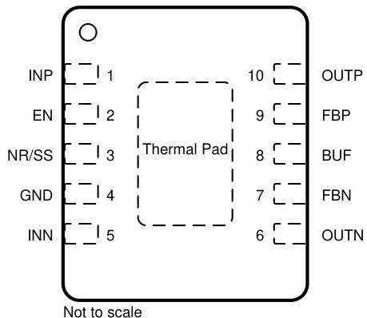
图4-1. DSC封装，10引脚WSON（俯视图）

表 4-1. 引脚功能

|  引脚 |   | I/O | 说明  |
| --- | --- | --- | --- |
|  编号 | 名称  |   |   |
|  1 | INP | I | 正确入。为了提供稳定性，必须在该引脚与接地之间连接一个10μF(1)或更大的电容器。将输入电容器尽可能靠近输入放置；请参阅电容器推荐部分了解更多信息。  |
|  2 | EN | I | 使能引脚。将此引脚拉至逻辑高电平 (VEN≥V_{IH(EN)}) 可启用器件；拉至逻辑低电平 (VEN≤V_{IL(EN)}) 可禁用器件。如果不需要启用功能，此引脚必须连接到INP；有关更多详细信息，请参阅应用和实施部分。使能电压不能超过输入电压 (VEN≤V_{INP})。  |
|  3 | NR/SS | — | 该引脚用于降噪和软启动。在该引脚与接地之间连接一个外部电容器可降低基准电压噪声，并启用软启动及启动跟踪功能。建议在NR/SS与GND之间连接一个10nF或更大的电容器 (C_{NR/SS})，以最大化或优化交流性能并确保启动跟踪。此引脚也可以由外部驱动，以提供更高的输出电压精度并降低噪声；详见用户可设置的缓冲基准部分。  |
|  4 | GND | — | 接地引脚。该引脚必须通过低阻抗连接方式接地，并连接至散热焊盘。  |
|  5 | INN | I | 负输入。为了提供稳定性，必须在该引脚与接地之间连接一个10μF(1)或更大的电容器。将输入电容器尽可能靠近输入放置；请参阅电容器推荐部分了解更多信息。  |
|  6 | OUTN | O | 负输出。为了确保稳定性，必须在该引脚与接地之间连接一个10μF(1)或更大的电容器。将输出电容器尽可能靠近输出放置；请参阅电容器推荐部分了解更多信息。  |
|  7 | FBN | I | 负输出反馈引脚。该引脚用于设置负输出电压。虽然非必需，但建议在FBN到OUTN之间（应尽量靠近器件）连接一个10nF前馈电容器，以最大化提高交流性能。此引脚在额定情况下被稳压至VFBN。切勿将其接地。  |
|  8 | BUF | O | 缓冲参考输出。此引脚通过R_{2}连接到FBN，其节点电压通过负反馈网络进行反向并放大，以实现所需的输出电压。该缓冲基准电压可用于驱动外部电路，最大负载为1mA。  |
|  9 | FBP | I | 正确出反馈引脚。该引脚用于设置正输出电压。虽然非必需，但建议在FBP到OUTP之间（应尽量靠近器件）连接一个10nF前馈电容器，以最大化提高交流性能。此引脚在额定情况下被稳压至VFBP。请勿将该引脚直接接地。  |
|  10 | OUTP | O | 正确出。为了确保稳定性，必须在该引脚与接地之间连接一个10μF(1)或更大的电容器。将输出电容器尽可能靠近输出放置；请参阅电容器推荐部分了解更多信息。  |
|  Pad | 散热焊盘 | — | 将散热焊盘连接到大面积接地平面。散热焊盘内部连接到GND。  |

(1) 额定输入和输出电容必须大于 $2.2\mu \mathrm{F}$；在本文档中，这些电容器的额定降额为 $80\%$。确保引脚上的有效电容大于 $2.2\mu \mathrm{F}$。

# 5 规格

## 5.1 绝对最大额定值

在工作结温范围内测得（除非另有说明）(1) (2)

|   |   | 最小值 | 最大值 | 单位  |
| --- | --- | --- | --- | --- |
|  电压 | INP | -0.3 | 36 | V  |
|   |  INN | -36 | 0.3  |   |
|   |  OUTP | -0.3 | V_{INP} + 0.3^{(5)}  |   |
|   |  OUTN | V_{INN} - 0.3^{(4)} | 0.3  |   |
|   |  FBP | -0.3 | V_{INP} + 0.3^{(7)}  |   |
|   |  BUF | -1 | V_{INP} + 0.3^{(7)}  |   |
|   |  NR/SS | -0.3 | V_{INP} + 0.3^{(8)}  |   |
|   |  FBN | V_{INN} - 0.3^{(3)} | 0.3  |   |
|   |  EN | -0.3 | V_{INP} + 0.3^{(6)}  |   |
|  电流 | 输出电流 | 受内部限制 |   |   |
|   |  缓冲电流 | 2 |   | mA  |
|  温度 | 工作结温，T_{J} | -55 | 150 | °C  |
|   |  贮存温度，T_{stg} | -65 | 150  |   |

(1) 应力超出绝对最大额定值下面列出的值时可能会对器件造成永久损坏。这些列出的值仅仅是应力等级，并不表示器件在这些条件下以及在建议工作条件以外的任何其他条件下能够正常运行。长时间处于绝对最大额定条件下可能会影响器件的可靠性。
(2) 除非另有说明，否则所有电压均以接地引脚为基准。
(3) 绝对最大额定值为 $V_{\text{INN}} - 0.3V$ 或 -3V（以较大者为准）。
(4) 绝对最大额定值为 $V_{\text{INN}} - 0.3V$ 或 -33V（以较大者为准）。
(5) 绝对最大额定值为 $V_{\text{INP}} + 0.3V$ 或 33V（以较小者为准）。
(6) 绝对最大额定值为 $V_{\text{INP}} + 0.3V$ 或 36V（以较小者为准）。
(7) 绝对最大额定值为 $V_{\text{INP}} + 0.3V$ 或 3V（以较小者为准）。
(8) 绝对最大额定值为 $V_{\text{INP}} + 0.3V$ 或 2V（以较小者为准）。

## 5.2 ESD 等级

|   |   |   | 值 | 单位  |
| --- | --- | --- | --- | --- |
|  V_{ESD} | 静电放电 | 人体放电模型 (HBM)，符合 ANSI/ESDA/JEDEC JS-001 标准^{(1)} | ±1000 | V  |
|   |   |  充电器件模型 (CDM)，符合 JEDEC 规范 JESD22-C101^{(2)} | ±500  |   |

(1) JEDEC 文档 JEP155 指出：500V HBM 时能够在标准 ESD 控制流程下安全生产。
(2) JEDEC 文档 JEP157 指出：250V CDM 时能够在标准 ESD 控制流程下安全生产。

# 5.3 建议运行条件

在自然通风条件下的工作温度范围内测得（除非另有说明）

|   |   | 最小值 | 标称值 | 最大值 | 单位  |
| --- | --- | --- | --- | --- | --- |
|  |VINx | 任一稳压器的电源电压幅度 | 3.3 |  | 33 | V  |
|  VEN | 使能电源电压 | 0 |  | VINP | V  |
|  VOUTP | 正稳压输出电压范围 | VFBP |  | 30 | V  |
|  VOUTN | 负稳压输出电压范围 | -30 |  | VFBN | V  |
|  IOUTx | 任一稳压器的输出电流 | 0.005(2) |  | 150 | mA  |
|  IBUF | BUF 引脚的输出电流 | 0 | 120 | 1000 | μA  |
|  CINx | 任一稳压器的输入电容器 | 4.7 | 10(1) |  | μF  |
|  COUTx | 任一稳压器的输出电容器 | 4.7 | 10(1) |  | μF  |
|  CNR/SS | 降噪和软启动电容器 | 0(3) | 10 | 1000 | nF  |
|  CFFP | 正通道前馈电容器；从VOUTP连接至FBP | 0 | 10 | 100 | nF  |
|  CFFN | 负通道前馈电容器；从VOUTN连接到FBN | 0 | 10 | 100 | nF  |
|  R2P | 较低的正反馈电阻器 |  | 10 | 240 | kΩ  |
|  R2N | 较低的负反馈电阻器（从FBN到BUF） |  | 10 | 240 | kΩ  |
|  TJ | 工作结温 | -40 |  | 125 | °C  |

(1)  $10\mu \mathrm{F}$  的标称输入和输出电容值考虑了适用于X5R和X7R陶瓷电容器的降额因素。假设的总降额为  $80\%$  。
(2) 当未使用反馈电阻时，系统需配置最小负载。若使用反馈电阻，只需将  $\mathsf{R}_{2\mathsf{x}}$  设定小于  $240\mathrm{k}\Omega$  即可满足该条件。
(3) 为了使启动跟踪功能正常运作， $\mathsf{C}_{\mathsf{NR} / \mathsf{SS}}$  电容值必须至少为  $4.7\mathrm{nF}$ 。

# 5.4 热性能信息

|  热指标(1) | TPS7A39 | 单位  |
| --- | --- | --- |
|   |  DSC (WSON)  |   |
|   |  10 引脚  |   |
|  R_{0JA} | 结至环境热阻 | 44.4 °C/W  |
|  R_{0JC(top)} | 结至外壳（顶部）热阻 | 33.7 °C/W  |
|  R_{0JB} | 结至电路板热阻 | 19.4 °C/W  |
|  Φ_{JT} | 结至顶部特征参数 | 0.4 °C/W  |
|  Φ_{JB} | 结至电路板特征参数 | 19.5 °C/W  |
|  R_{0JC(bot)} | 结至外壳（底部）热阻 | 2.9 °C/W  |

(1) 有关新旧热指标的更多信息，请参阅半导体和IC封装热指标应用手册。

# 5.5 电气特性

测试条件为： $T_{\mathrm{J}} = -40^{\circ}\mathrm{C}$ 至 $+125^{\circ}\mathrm{C}$ 、 $V_{\mathrm{INP(nom)}} = V_{\mathrm{OUTP(nom)}} + 1\mathrm{V}$ 或 $V_{\mathrm{IN(nom)}} = 3.3\mathrm{V}$ （以较大者为准）、 $V_{\mathrm{INN(nom)}} = V_{\mathrm{OUTN(nom)}} - 1\mathrm{V}$ 或 $V_{\mathrm{INN(nom)}} = -3.3\mathrm{V}$ （以较小者为准）、 $V_{\mathrm{EN}} = V_{\mathrm{INP}}$ 、 $I_{\mathrm{OUT}} = 1\mathrm{mA}$ 、 $C_{\mathrm{INx}} = 2.2\mu \mathrm{F}$ 、 $C_{\mathrm{OUTx}} = 10\mu \mathrm{F}$ 、 $C_{\mathrm{FFx}} = C_{\mathrm{NR/SS}} =$ 开路、 $R_{1\mathrm{N}} = R_{2\mathrm{N}} = 10\mathrm{k}\Omega$ 且FBP连接至OUTP（除非另有说明）；典型值为 $T_{\mathrm{J}} = 25^{\circ}\mathrm{C}$

|  参数 |   | 测试条件 | 最小值 | 典型值 | 最大值 | 单位  |
| --- | --- | --- | --- | --- | --- | --- |
|  VINP | 输入电压范围、正通道 |  | 3.3 |  | 33 | V  |
|  VINN | 输入电压范围、负通道 |  | -33 |  | -3.3 | V  |
|  VUVLOP(hsing) | 欠压锁定阈值、正通道 | VINP上升、VINN = -3.3V | 1.4 |  | 3.1 | V  |
|  VUVLOP(hya) | 欠压锁定阈值、正通道迟滞 | VINP下降、VINN = -3.3V | 120 |  |  | mV  |
|  VUVLON(falling) | 欠压锁定阈值、负通道 | VINN下降、VINP = 3.3V | -3.1 |  | -1.4 | V  |
|  VUVLON(hya) | 欠压锁定阈值、负通道、迟滞 | VINN上升、VINP = 3.3V | 70 |  |  | mV  |
|  VNR/SS | 内部基准电压 |  | 1.172 | 1.19 | 1.208 | V  |
|  VFBP | 正反馈电压 |  | 1.170 | 1.188 | 1.206 | V  |
|  VFBN | 负反馈电压 |  | -10 | 3.7 | 10 | mV  |
|  VOUT | 输出电压范围(2) | 正通道 |  | VFBP | 30 | V  |
|   |   |  负通道 |  | -30 | VFBN(1)  |   |
|   |  VOUTP 精度 |  | VINP(nom) ≤ VINP ≤ 33V、1mA ≤ IOUTP ≤ 150mA、1.2V ≤ VOUTP(nom) ≤ 30V | -1.5 | 1.5 | %VOUT  |
|   |  VOUTN 精度(3) |  | -33V ≤ VINN ≤ VINN(nom)、-150mA ≤ IOUTN ≤ -1mA、-30V ≤ VOUTN(nom) ≤ -1.2V | -3 | 3 | %VOUT  |
|   |  负VOUT通道精度 |  | -33V ≤ VINN ≤ VINN(nom)、-150mA ≤ IOUTN ≤ 1mA、-1.2V < VOUTN(nom) < 0V | -36 | 36 | mV  |
|   |   |   | -33V ≤ VINN ≤ VINN(nom)、-150mA ≤ IOUTN ≤ 1mA、VOUTN(nom) = 0V | -12 | 12  |   |
|  ΔVOUT(ΔVIN)/VOUT(NOM) | 线路调整、正通道 |  | VINP(nom) ≤ VINP ≤ 33V | 0.035 |  | %VOUT  |
|   |  线路调整、负通道 |  | -33V ≤ VINN ≤ VOUT(nom) + 1V | 0.125 |   |   |
|  ΔVOUT(ΔIOUT)/VOUT(NOM) | 负载调整、正通道 |  | 1mA ≤ IOUTP ≤ 150mA | -0.09 |  | %VOUT  |
|   |  负载调整、负通道 |  | -150mA ≤ IOUTN ≤ -1mA | 0.715 |   |   |
|  VDO | 压降电压 | 正通道 | IOUTP = 50mA、3.3V ≤ VINP(nom) ≤ 33.0V、VFBP = 1.070V | 175 | 300 | mV  |
|   |   |  IOUTP = 150mA、3.3V ≤ VINP(nom) ≤ 33.0V、VFBP = 1.070V | 300 | 500 |   |   |
|   |   |  负通道 | IOUTN = -50mA、-3.3V ≤ VINN(nom) ≤ -33.0V、VFBN = 0.0695V | -250 | -145  |   |
|   |   |  IOUTN = -150mA、-3.3V ≤ VINN(nom) ≤ -33.0V、VFBN = 0.0695V | -400 | -275 |   |   |
|  VBUF | 缓冲参考输出电压 |  |  | VNR/SS |  | V  |
|  VBUF/BUF | 缓冲参考负载调整 |  | IBUF = 100μA 至 1mA | 1 |  | mV/mA  |
|  VBUF - VNR/SS | 输出缓冲偏移电压 |  | VNR/SS = 0.25V 至 1.2V | -4 | 3 | mV  |
|  VOUTP - VOUTN | 强制REF 电压下的直流输出电压差 |  | VNR/SS = 0.25V 至 1.2V | -10 | 10 | %VNR/SS  |
|  ILIM | 电流限制 | 正通道 | VOUTP = 90% VOUTP(nom) | 200 | 330 | mA  |
|   |   |  负通道 | VOUTN = 90% VOUTN(nom) | -500 | -300  |   |
|  ISUPPLY | 电源电流 | 正通道 | IOUTP = 0mA、R2N = 开路、VINP = 33V | 75 | 150 | μA  |
|   |   |  IOUTP = 150mA、R2N = 开路、VINP = 33V | 904 |  |   |   |
|   |   |  负通道 | IOUTN = 0mA、VOUTN(nom) = 0V、R2N = 开路、VINN = -33V | -150 | -60  |   |
|   |   |  IOUTN = 150mA、R2N = 开路、VINN = -33V | -1053 |  |   |   |

# 5.5 电气特性（续）

测试条件为：$\mathrm{T_J} = -40^{\circ}\mathrm{C}$ 至 $+125^{\circ}\mathrm{C}$、$\mathrm{V_{INP}(nom)} = \mathrm{V_{OUTP}(nom)} + 1\mathrm{V}$ 或 $\mathrm{V_{IN}(nom)} = 3.3\mathrm{V}$（以较大者为准）、$\mathrm{V_{INN}(nom)} = \mathrm{V_{OUTN}(nom)} - 1\mathrm{V}$ 或 $\mathrm{V_{INN}(nom)} = -3.3\mathrm{V}$（以较小者为准）、$\mathrm{V_{EN}} = \mathrm{V_{INP}}$、$\mathrm{I_{OUT}} = 1\mathrm{mA}$、$\mathrm{C_{INx}} = 2.2\mu \mathrm{F}$、$\mathrm{C_{OUTx}} = 10\mu \mathrm{F}$、$\mathrm{C_{FFx}} = \mathrm{C_{NR/SS}} = \text{开路}$、$\mathrm{R_{1N}} = \mathrm{R_{2N}} = 10\mathrm{k}\Omega$ 且 FBP 连接至 OUTP（除非另有说明）；典型值为 $\mathrm{T_J} = 25^{\circ}\mathrm{C}$

|  参数 |   |   | 测试条件 | 最小值 | 典型值 | 最大值 | 单位  |
| --- | --- | --- | --- | --- | --- | --- | --- |
|  ISHON | 关断电源电流 | 正通道 | VEN = 0.4V、VINP = 33V | 3.75 |   | 6.5 | μA  |
|   |   |  负通道 | VEN = 0.4V、VINN = -33V | -4.5 | -2.25 |   |   |

# 5.5 电气特性（续）

测试条件为：$\mathrm{T_J} = -40^{\circ}\mathrm{C}$ 至 $+125^{\circ}\mathrm{C}$、$\mathrm{V_{INP(nom)}} = \mathrm{V_{OUTP(nom)}} + 1\mathrm{V}$ 或 $\mathrm{V_{IN(nom)}} = 3.3\mathrm{V}$（以较大者为准）、$\mathrm{V_{INN(nom)}} = \mathrm{V_{OUTN(nom)}} - 1\mathrm{V}$ 或 $\mathrm{V_{INN(nom)}} = -3.3\mathrm{V}$（以较小者为准）、$\mathrm{V_{EN}} = \mathrm{V_{INP}}$、$\mathrm{I_{OUT}} = 1\mathrm{mA}$、$\mathrm{C_{INx}} = 2.2\mu \mathrm{F}$、$\mathrm{C_{OUTx}} = 10\mu \mathrm{F}$、$\mathrm{C_{FFx}} = \mathrm{C_{NR/SS}} = \text{开路}$、$\mathrm{R_{1N}} = \mathrm{R_{2N}} = 10\mathrm{k}\Omega$ 且 FBP 连接至 OUTP（除非另有说明）；典型值为 $\mathrm{T_J} = 25^{\circ}\mathrm{C}$

|  参数 |   |   | 测试条件 | 最小值 | 典型值 | 最大值 | 单位  |
| --- | --- | --- | --- | --- | --- | --- | --- |
|  IFBx | 反馈引脚泄漏电流 | 正通道 |  | 5.5 |   | 100 | nA  |
|   |   |  负通道 |   | -100 |   | -9.7  |   |
|  INR/SS | 软启动充电电流 |   | V_{NR/SS} = 0.9V | 3 | 5.1 | 6.7 | μA  |
|  I_{EN} | 使能引脚漏电流 |   | V_{EN} = V_{INP} = 33V | 0.02 |   | 1 | μA  |
|  V_{IN(EN)} | 使能高电平电压 |   |  | 2.2 | V_{INP} |   | V  |
|  V_{IL(EN)} | 使能低电平电压 |   |  | 0 | 0.4 |   | V  |
|  PSRR | 电源抑制比 |   | |V_{IN}| = 6V、|V_{OUT(nom)}| = 5V、C_{OUT} = 10 μF、C_{NR/SS} = C_{FF} = 10nF、f = 120Hz | 69 |   |   | dB  |
|  V_{n} | 输出噪声电压 | 正通道 | V_{INP} = 3.3V、V_{OUTP(nom)} = V_{NR/SS}、C_{OUTP} = 10 μF、C_{NR/SS} = 10nF、BW = 10Hz 至 100kHz | 20.63 |   |   | μV_{RMS}  |
|   |   |   |  V_{INP} = 6V、V_{OUTP(nom)} = 5V、C_{OUTP} = 10 μF、C_{NR/SS} = C_{FF} = 10nF、BW = 10Hz 至 100kHz | 26.86  |   |   |   |
|   |   |  负通道 | V_{INN} = -3V、V_{OUTN(nom)} = -V_{NR/SS}、C_{OUTP} = 10 μF、C_{NR/SS} = 10nF、BW = 10Hz 至 100kHz | 22.13  |   |   |   |
|   |   |   |  V_{INN} = -6V、V_{OUTN(nom)} = -5V、C_{OUTP} = 10 μF、C_{NR/SS} = C_{FF} = 10nF、BW = 10Hz 至 100kHz | 28.68  |   |   |   |
|  R_{NR/SS} | 从带隙到 NR 引脚的滤波电阻器 |   |  | 350 |   |   | kΩ  |
|  T_{sd} | 热关断温度 | 关断，温度升高 | 175 |   |   | °C  |   |
|   |   |   |  复位，温度降低 | 160  |   |   |   |

(1) $\mathrm{V_{OUT(target)}} = 0\mathrm{V}$、$\mathrm{R_{1N}} = 10\mathrm{k}\Omega$、$\mathrm{R_{2N}} = \text{开路}$。
(2) 为了确保该器件处于禁用状态时 $\mathrm{V_{OUT}}$ 不会漂移，需要 $5\mu \mathrm{A}$ 的最小负载电流。
(3) 该器件未在其耗散的功率 $\mathsf{P_D}$ 超过 2W 的条件下进行测试。

# 5.6 启动特性

测试条件为：$\mathrm{T_J} = -40^{\circ}\mathrm{C}$ 至 $+125^{\circ}\mathrm{C}$、$\mathrm{V_{INP(nom)}} = \mathrm{V_{OUTP(nom)}} + 1\mathrm{V}$ 或 $\mathrm{V_{IN(nom)}} = 3.3\mathrm{V}$（以较大者为准）、$\mathrm{V_{INN(nom)}} = \mathrm{V_{OUTN(nom)}} - 1\mathrm{V}$ 或 $\mathrm{V_{INN(nom)}} = -3.3\mathrm{V}$（以较小者为准）、$\mathrm{V_{EN}} = \mathrm{V_{INP}}$、$\mathrm{I_{OUT}} = 1\mathrm{mA}$、$\mathrm{C_{INx}} = 2.2\mu \mathrm{F}$、$\mathrm{C_{OUTx}} = 10\mu \mathrm{F}$、$\mathrm{C_{FFx}} = \mathrm{C_{NR/SS}} = 4.7\mathrm{nF}$、$\mathrm{R_{1N}} = \mathrm{R_{2N}} = 10\mathrm{k}\Omega$ 且 FBP 连接至 OUTP（除非另有说明）；典型值为 $\mathrm{T_J} = 25^{\circ}\mathrm{C}$

|  参数 |   | 测试条件 | 最小值 | 典型值 | 最大值 | 单位  |
| --- | --- | --- | --- | --- | --- | --- |
|  I_{EN(delay)} | 从 EN 低电平到高电平切换到 2.5% V_{OUTP} 的延迟时间 | 从 EN 低电平到高电平切换到 V_{OUTP} = 2.5% × V_{OUTP(nom)} | 300 |   |   | μs  |
|  I_{start-up} | 从 EN 低电平到高电平切换到两个输出达到最终值 95% 的延迟时间 | 从 EN 低电平到高电平切换到 V_{OUTP} = V_{OUTP(nom)} × 95%、V_{OUTN} = V_{OUTN(nom)} × 95% | 1.1 |   |   | ms  |
|  I_{Pstart-Nstart} | 从 V_{OUTP} 退出高阻抗状态到 V_{OUTN} 退出高阻抗状态的延迟时间 | 从 V_{OUTP} = V_{OUTP(nom)} × 2.5% 到 V_{OUTN} = V_{OUTN(nom)} × 2.5% | -40 | -17 | 40 | μs  |
|  Δ|V_{OUTP} - V_{OUTN} | 正输出和负输出之间的电压差 | 在 t_{Pstart-Nstart} 期间 | 75 | 300 |   | mV  |

# 5.7 时序图

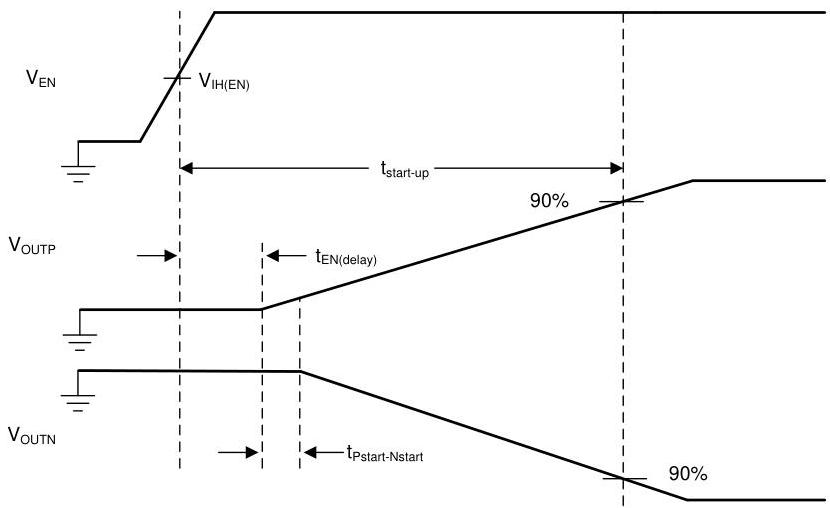
图 5-1. 启动特性

# 备注

当 $V_{\mathrm{INx}}$ 的上升缓慢（$t_{\mathrm{rise(VINx)}}$ 通常大于 10ms）且 EN 直接连接至 $V_{\mathrm{INP}}$ 时，将不符合跟踪规格。此类应用建议改用由 $V_{\mathrm{INP}}$ 到 EN 的电阻分压器。

# 5.8 典型特性

测试条件（除非另有说明）： $\mathrm{T_J} = 25^{\circ}\mathrm{C}$ 、 $\mathrm{V_{INP}} = \mathrm{V_{OUTP}(nom)} + 1.0\mathrm{V}$ 或 $\mathrm{V_{IN}} = 3.3\mathrm{V}$ （以较大者为准）、 $\mathrm{V_{INN}} = \mathrm{V_{OUTN}(nom)} - 1\mathrm{V}$ 或 $-3.3\mathrm{V}$ （以较小者为准）、 $\mathrm{V_{EN}} = \mathrm{V_{IN}}$ 、 $\mathrm{I_{OUT}} = 1\mathrm{mA}$ 、 $\mathrm{C_{IN}} = 10\mu \mathrm{F}$ 陶瓷、 $\mathrm{C_{OUT}} = 10\mu \mathrm{F}$ 陶瓷，并且 $\mathrm{C_{FFP}} = \mathrm{C_{FFN}} = \mathrm{C_{NR/SS}} = 10\mathrm{nF}$

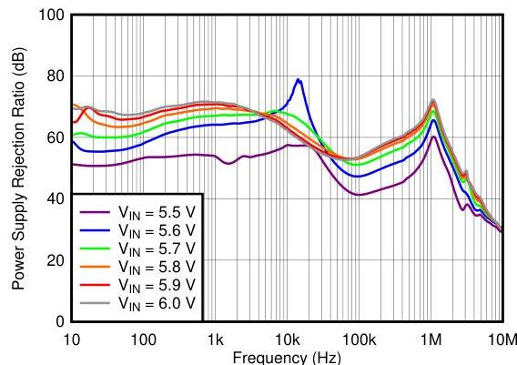
$\mathrm{V_{OUTP}} = 5\mathrm{V}$ 、 $\mathrm{I_{OUTP}} = 150\mathrm{mA}$ 、 $\mathrm{V_{OUTN}} = -5\mathrm{V}$ 、 $\mathrm{I_{OUTN}} = 0\mathrm{mA}$ 、 $\mathrm{C_{NR/SS}} = \mathrm{C_{FFx}} = 10\mathrm{nF}$

图5-2. 正 PSRR 与频率和 $\mathbf{V_{INP}}$ 间的关系
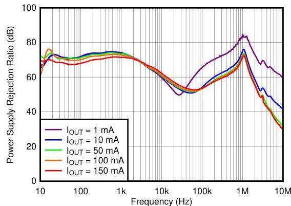
$\mathrm{V_{OUTP}} = 5\mathrm{V}$ 、 $\mathrm{V_{INP}} = \mathrm{V_{EN}} = 6\mathrm{V}$ 、 $\mathrm{V_{OUTN}} = -5\mathrm{V}$ 、 $\mathrm{I_{OUTN}} = 0\mathrm{mA}$ 、 $\mathrm{C_{NR/SS}} = \mathrm{C_{FFx}} = 10\mathrm{nF}$

图5-3. 负 PSRR 与频率和 $\mathbf{V_{INN}}$ 间的关系
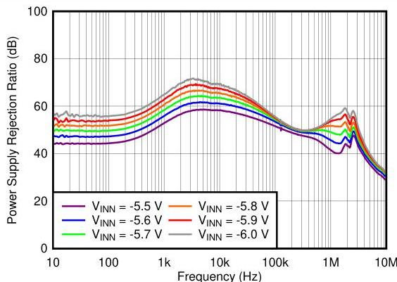
$\mathrm{V_{OUTP}} = 5\mathrm{V}$ 、 $\mathrm{I_{OUTP}} = 0\mathrm{mA}$ 、 $\mathrm{V_{OUTN}} = -5\mathrm{V}$ 、 $\mathrm{I_{OUTN}} = 150\mathrm{mA}$ 、 $\mathrm{C_{NR/SS}} = \mathrm{C_{FFx}} = 10\mathrm{nF}$

图5-4. 正 PSRR 与频率和 $\mathbf{I_{OUTP}}$ 间的关系
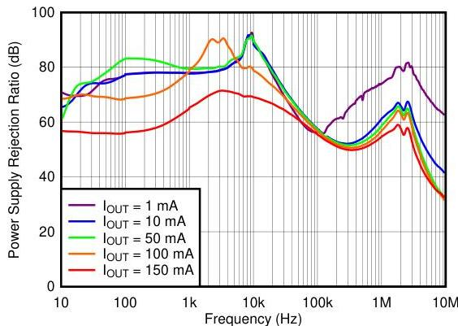
$\mathrm{V_{OUTP}} = 5\mathrm{V}$ 、 $\mathrm{I_{OUTP}} = 0\mathrm{mA}$ 、 $\mathrm{V_{INN}} = -6\mathrm{V}$ 、 $\mathrm{V_{OUTN}} = -5\mathrm{V}$ 、 $\mathrm{C_{NR/SS}} = \mathrm{C_{FFx}} = 10\mathrm{nF}$
图5-5. 负 PSRR 与频率和 $\mathbf{I_{OUTN}}$ 间的关系

# 5.8 典型特性（续）

测试条件（除非另有说明）： $\mathrm{T_J} = 25^{\circ}\mathrm{C}$ 、 $\mathrm{V_{INP}} = \mathrm{V_{OUTP}(nom)} + 1.0\mathrm{V}$ 或 $\mathrm{V_{IN}} = 3.3\mathrm{V}$ （以较大者为准）、 $\mathrm{V_{INN}} = \mathrm{V_{OUTN}(nom)} - 1\mathrm{V}$ 或 $-3.3\mathrm{V}$ （以较小者为准）、 $\mathrm{V_{EN}} = \mathrm{V_{IN}}$ 、 $\mathrm{I_{OUT}} = 1\mathrm{mA}$ 、 $\mathrm{C_{IN}} = 10\mu \mathrm{F}$ 陶瓷、 $\mathrm{C_{OUT}} = 10\mu \mathrm{F}$ 陶瓷，并且 $\mathrm{C_{FFP}} = \mathrm{C_{FFN}} = \mathrm{C_{NR/SS}} = 10\mathrm{nF}$

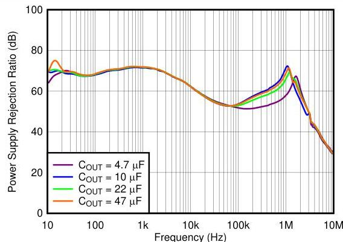
$\mathrm{V_{OUTP}} = 5\mathrm{V}$ 、 $\mathrm{V_{INP}} = \mathrm{V_{EN}} = 6\mathrm{V}$ 、 $\mathrm{V_{OUTN}} = -5\mathrm{V}$ 、 $\mathrm{I_{OUTN}} = 0\mathrm{mA}$ 、 $\mathrm{C_{NR/SS}} = \mathrm{C_{FFx}} = 10\mathrm{nF}$

图5-6. 正PSRR与频率和COUTP间的关系
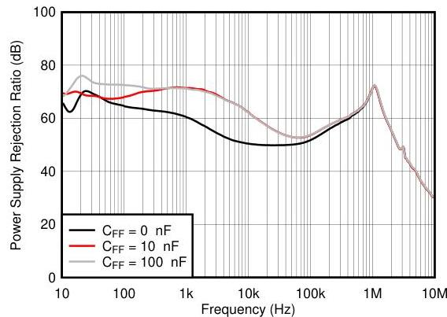
$\mathrm{V_{OUTP}} = 5\mathrm{V}$ 、 $\mathrm{V_{INP}} = \mathrm{V_{EN}} = 6\mathrm{V}$ 、 $\mathrm{V_{OUTN}} = -5\mathrm{V}$ 、 $\mathrm{I_{OUTN}} = 0\mathrm{mA}$ 、 $\mathrm{C_{NR/SS}} = 10\mathrm{nF}$

图5-7. 负PSRR与频率和COUTN间的关系
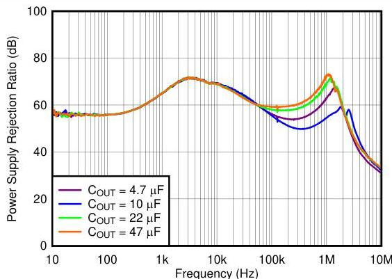
$\mathrm{V_{OUTP}} = 5\mathrm{V}$ 、 $\mathrm{I_{OUTP}} = 0\mathrm{mA}$ 、 $\mathrm{V_{INN}} = -6\mathrm{V}$ 、 $\mathrm{V_{OUTN}} = -5\mathrm{V}$ 、 $\mathrm{C_{NR/SS}} = \mathrm{C_{FFx}} = 10\mathrm{nF}$ 、 $\mathrm{C_{OUTP}} = 10\mu \mathrm{F}$

图5-8. 正PSRR与频率和CFFP间的关系
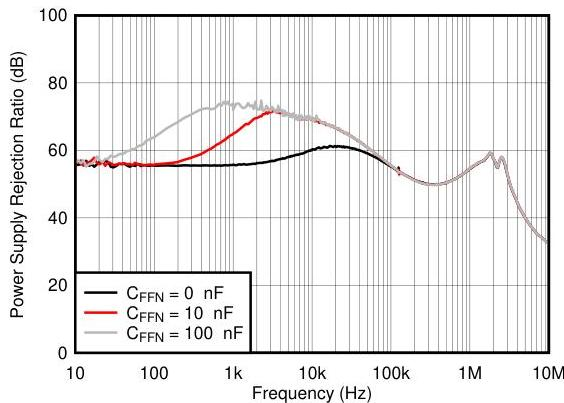
$\mathrm{V_{OUTP}} = 5\mathrm{V}$ 、 $\mathrm{I_{OUTP}} = 0\mathrm{mA}$ 、 $\mathrm{V_{INN}} = -6\mathrm{V}$ 、 $\mathrm{V_{OUTN}} = -5\mathrm{V}$ 、 $\mathrm{C_{NR/SS}} = \mathrm{C_{FFP}} = 10\mathrm{nF}$

图5-9. 负PSRR与频率和CFFN间的关系

# 5.8 典型特性（续）

测试条件（除非另有说明）： $\mathrm{T_J} = 25^{\circ}\mathrm{C}$ 、 $\mathrm{V_{INP}} = \mathrm{V_{OUTP}(nom)} + 1.0\mathrm{V}$ 或 $\mathrm{V_{IN}} = 3.3\mathrm{V}$ （以较大者为准）、 $\mathrm{V_{INN}} = \mathrm{V_{OUTN}(nom)} - 1\mathrm{V}$ 或 $-3.3\mathrm{V}$ （以较小者为准）、 $\mathrm{V_{EN}} = \mathrm{V_{IN}}$ 、 $\mathrm{I_{OUT}} = 1\mathrm{mA}$ 、 $\mathrm{C_{IN}} = 10\mu \mathrm{F}$ 陶瓷、 $\mathrm{C_{OUT}} = 10\mu \mathrm{F}$ 陶瓷，并且 $\mathrm{C_{FFP}} = \mathrm{C_{FFN}} = \mathrm{C_{NR/SS}} = 10\mathrm{nF}$

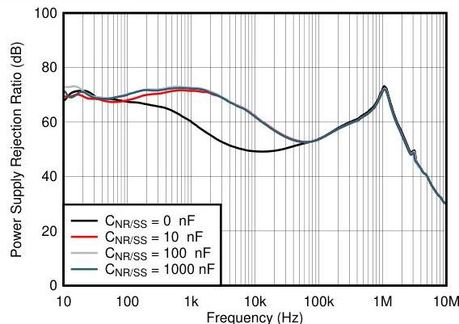
$\mathrm{V_{OUTP}} = 5\mathrm{V}$ 、 $\mathrm{V_{INP}} = \mathrm{V_{EN}} = 6\mathrm{V}$ 、 $\mathrm{V_{OUTN}} = -5\mathrm{V}$ 、 $\mathrm{I_{OUTN}} = 0\mathrm{mA}$ 、 $\mathrm{C_{FFx}} = 10\mathrm{nF}$

图5-10. 正 PSRR 与频率和 $\mathbf{C_{NR / SS}}$ 间的关系
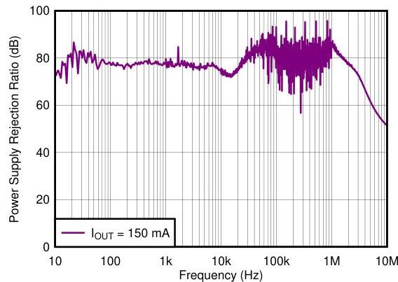
图5-12. 串扰从正到负

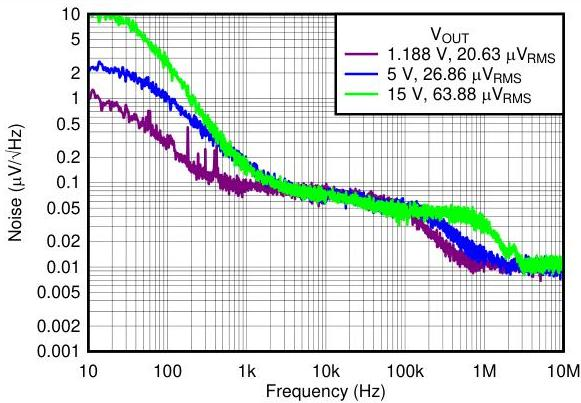
$\mathrm{I_{OUTP}} = 150\mathrm{mA}$ 、 $\mathrm{V_{INP}} = \mathrm{V_{EN}}$ 、 $\mathrm{V_{OUTN}} = -\mathrm{V_{OUTP}}$ 、 $\mathrm{I_{OUTN}} = 0\mathrm{mA}$ 、 $\mathrm{C_{NR / SS}} = \mathrm{C_{FFx}} = 10\mathrm{nF}$

图5-14. 正频谱噪声密度与频率和 $\mathbf{V_{OUTP}}$ 间的关系
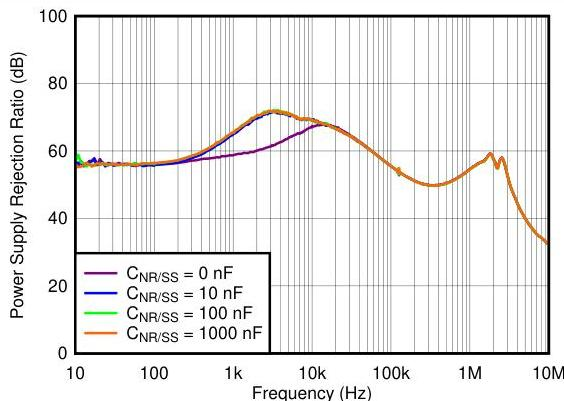
$\mathrm{V_{OUTP}} = 5\mathrm{V}$ 、 $\mathrm{I_{OUTP}} = 0\mathrm{mA}$ 、 $\mathrm{V_{INN}} = -6\mathrm{V}$ 、 $\mathrm{V_{OUTN}} = -5\mathrm{V}$ 、 $\mathrm{C_{FFx}} = 10\mathrm{nF}$

图5-11. 负 PSRR 与频率和 $\mathbf{C_{NR / SS}}$ 间的关系
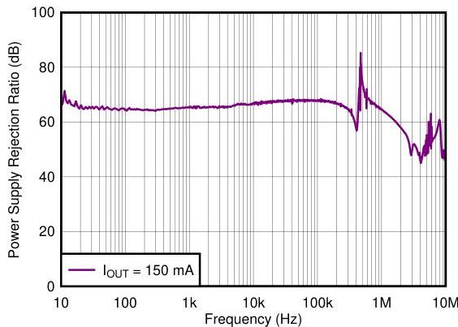
图5-13. 串扰从负到正

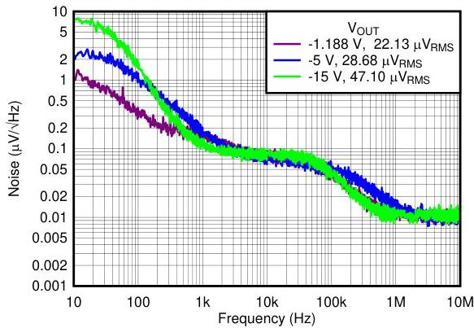
$\mathrm{I_{OUTN}} = -150\mathrm{mA}$ 、 $\mathrm{V_{INP}} = \mathrm{V_{EN}}$ 、 $\mathrm{V_{OUTN}} = -\mathrm{V_{OUTP}}$ 、 $\mathrm{I_{OUTP}} = 0\mathrm{mA}$ 、 $\mathrm{C_{NR / SS}} = \mathrm{C_{FFx}} = 10\mathrm{nF}$
图5-15. 负频谱噪声密度与频率和 $\mathbf{V_{OUTN}}$ 间的关系

# 5.8 典型特性（续）

测试条件（除非另有说明）： $\mathrm{T_J} = 25^{\circ}\mathrm{C}$ 、 $\mathrm{V_{INP}} = \mathrm{V_{OUTP}(nom)} + 1.0\mathrm{V}$ 或 $\mathrm{V_{IN}} = 3.3\mathrm{V}$ （以较大者为准）、 $\mathrm{V_{INN}} = \mathrm{V_{OUTN}(nom)} - 1\mathrm{V}$ 或 $-3.3\mathrm{V}$ （以较小者为准）、 $\mathrm{V_{EN}} = \mathrm{V_{IN}}$ 、 $\mathrm{I_{OUT}} = 1\mathrm{mA}$ 、 $\mathrm{C_{IN}} = 10\mu \mathrm{F}$ 陶瓷、 $\mathrm{C_{OUT}} = 10\mu \mathrm{F}$ 陶瓷，并且 $\mathrm{C_{FFP}} = \mathrm{C_{FFN}} = \mathrm{C_{NR/SS}} = 10\mathrm{nF}$

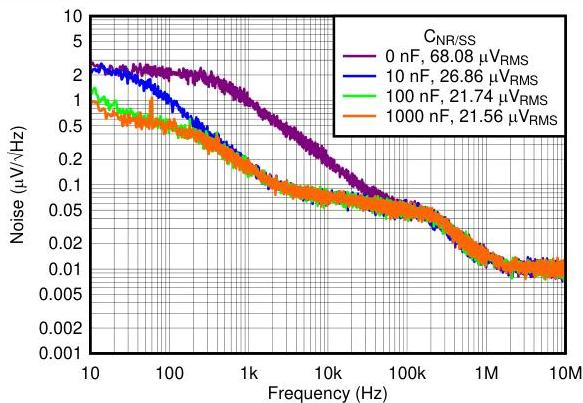

$$
V _ {O U T P} = 5 V, I _ {O U T P} = 1 5 0 m A, V _ {I N P} = V _ {E N} = 6 V, V _ {O U T N} = - 5 V, I _ {O U T N} = 0 m A, C _ {F F x} = 1 0 n F
$$

图5-16. 正频谱噪声密度与频率和 $\mathbf{C}_{\mathrm{NR / SS}}$ 间的关系
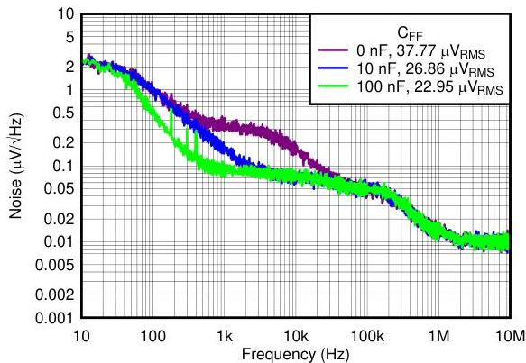
$\mathrm{V_{OUTP}} = 5\mathrm{V}$ 、 $\mathrm{I_{OUTP}} = 150\mathrm{mA}$ 、 $\mathrm{V_{INP}} = \mathrm{V_{EN}} = 6\mathrm{V}$ 、 $\mathrm{V_{OUTN}} = -5\mathrm{V}$ 、 $\mathrm{I_{OUTN}} = 0\mathrm{mA}$ 、 $\mathrm{C_{NF/SS}} = 10\mathrm{nF}$

图5-17. 负频谱噪声密度与频率和 $\mathbf{C}_{\mathrm{NR / SS}}$ 间的关系
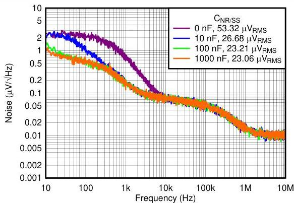
$\mathrm{V_{OUTN}} = -5\mathrm{V}$ 、 $\mathrm{I_{OUTN}} = -150\mathrm{mA}$ 、 $\mathrm{V_{INP}} = \mathrm{V_{EN}} = 6\mathrm{V}$ 、 $\mathrm{V_{OUTN}} = -5\mathrm{V}$ 、 $\mathrm{I_{OUTP}} = 0\mathrm{mA}$ 、 $\mathrm{C_{FFx}} = 10\mathrm{nF}$

图5-18. 正频谱噪声密度与频率和 $\mathbf{C}_{\mathrm{FF}}$ 间的关系
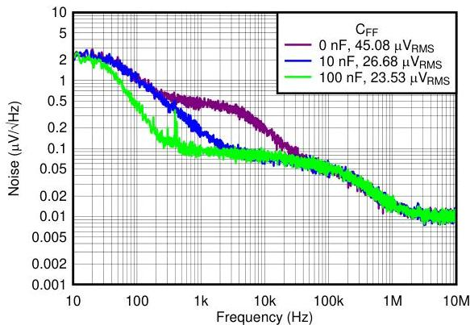
$\mathrm{V_{OUTN}} = -5\mathrm{V}$ 、 $\mathrm{I_{OUTN}} = -150\mathrm{mA}$ 、 $\mathrm{V_{INP}} = \mathrm{V_{EN}} = 6\mathrm{V}$ 、 $\mathrm{V_{OUTN}} = -5\mathrm{V}$ 、 $\mathrm{I_{OUTP}} = 0\mathrm{mA}$ 、 $\mathrm{C_{NR/SS}} = 10\mathrm{nF}$

图5-19. 负频谱噪声密度与频率和 $\mathbf{C}_{\mathrm{FF}}$ 间的关系

# 5.8 典型特性（续）

测试条件（除非另有说明）： $\mathrm{T_J} = 25^{\circ}\mathrm{C}$ 、 $\mathrm{V_{INP}} = \mathrm{V_{OUTP}(nom)} + 1.0\mathrm{V}$ 或 $\mathrm{V_{IN}} = 3.3\mathrm{V}$ （以较大者为准）、 $\mathrm{V_{INN}} = \mathrm{V_{OUTN}(nom)} - 1\mathrm{V}$ 或 $-3.3\mathrm{V}$ （以较小者为准）、 $\mathrm{V_{EN}} = \mathrm{V_{IN}}$ 、 $\mathrm{I_{OUT}} = 1\mathrm{mA}$ 、 $\mathrm{C_{IN}} = 10\mu \mathrm{F}$ 陶瓷、 $\mathrm{C_{OUT}} = 10\mu \mathrm{F}$ 陶瓷，并且 $\mathrm{C_{FFP}} = \mathrm{C_{FFN}} = \mathrm{C_{NR/SS}} = 10\mathrm{nF}$

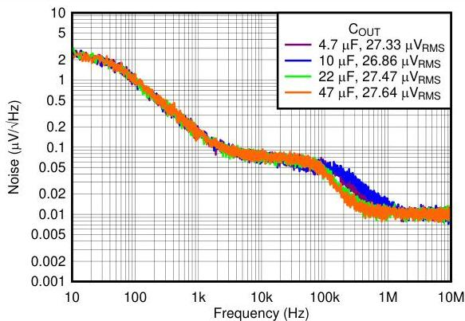

$$
V _ {O U T P} = 5 V, I _ {O U T P} = 1 5 0 m A, V _ {I N P} = V _ {E N} = 6 V, V _ {O U T N} = - 5 V, I _ {O U T N} = 0 m A, C _ {N R / S S} = C _ {F F x} = 1 0 n F
$$

图5-20. 正频谱噪声密度与频率和 $C_{\text{OUT}}$ 间的关系

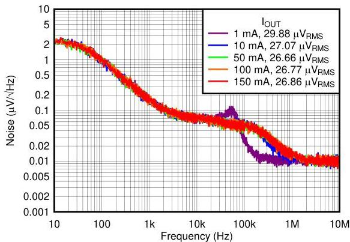

$$
V _ {O U T P} = 5 V, V _ {I N P} = V _ {E N} = 6 V, V _ {O U T N} = - 5 V, I _ {O U T N} = 0 m A, C _ {N R / S S} = C _ {F F x} = 1 0 n F
$$

图5-22. 正频谱噪声密度与频率和 $I_{\text{OUT}}$ 间的关系

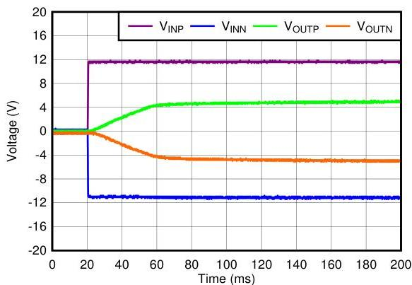

$$
V _ {\text {O U T P}} = - V _ {\text {O U T N}} = 5 V, V _ {\text {I N P}} = - V _ {\text {I N N}} = 1 2 V
$$

图5-24. 启动 $(V_{\text{INP}} = V_{\text{EN}})$

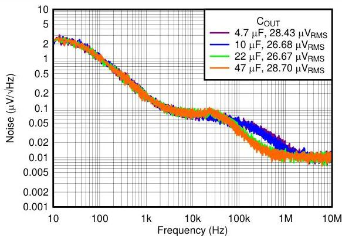

$$
V _ {O U T N} = - 5 V, I _ {O U T N} = - 1 5 0 m A, V _ {I N P} = V _ {E N} = 6 V, V _ {O U T N} = - 5 V, I _ {O U T P} = 0 m A, C _ {N R / S S} = C _ {F F x} = 1 0 n F
$$

图5-21. 负频谱噪声密度与频率和 $C_{\text{OUT}}$ 间的关系

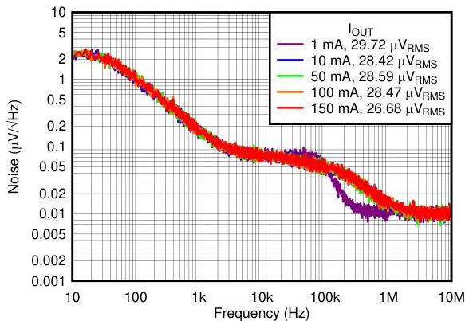

$$
V _ {O U T N} = - 5 V, V _ {I N P} = V _ {E N} = 6 V, V _ {O U T N} = - 5 V, I _ {O U T P} = 0 m A, C _ {N R / S S} = C _ {F F x} = 1 0 n F
$$

图5-23. 负频谱噪声密度与频率和 $I_{\text{OUT}}$ 间的关系

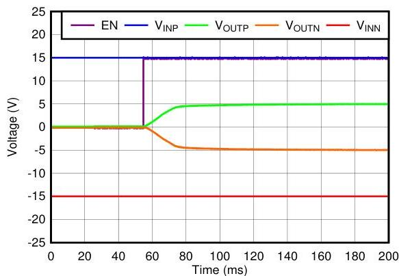

$$
V _ {\text {O U T P}} = - V _ {\text {O U T N}} = 5 V, V _ {\text {I N P}} = - V _ {\text {I N N}} = 1 5 V
$$

图5-25. 通过 EN 启动

# 5.8 典型特性（续）

测试条件（除非另有说明）： $\mathrm{T_J} = 25^{\circ}\mathrm{C}$ 、 $\mathrm{V_{INP}} = \mathrm{V_{OUTP}(nom)} + 1.0\mathrm{V}$ 或 $\mathrm{V_{IN}} = 3.3\mathrm{V}$ （以较大者为准）、 $\mathrm{V_{INN}} = \mathrm{V_{OUTN}(nom)} - 1\mathrm{V}$ 或 $-3.3\mathrm{V}$ （以较小者为准）、 $\mathrm{V_{EN}} = \mathrm{V_{IN}}$ 、 $\mathrm{I_{OUT}} = 1\mathrm{mA}$ 、 $\mathrm{C_{IN}} = 10\mu \mathrm{F}$ 陶瓷、 $\mathrm{C_{OUT}} = 10\mu \mathrm{F}$ 陶瓷，并且 $\mathrm{C_{FFP}} = \mathrm{C_{FFN}} = \mathrm{C_{NR/SS}} = 10\mathrm{nF}$

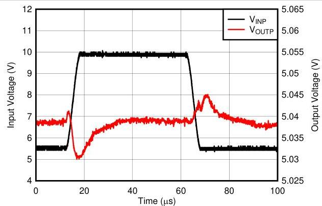
$\mathrm{V_{INP}} = 5.5\mathrm{V}$ 至 $10\mathrm{V}(1\mathrm{V} / \mu \mathrm{s})$ 、 $\mathrm{V_{OUTP}} = -\mathrm{V_{OUTN}} = 5\mathrm{V}$ 、 $\mathrm{I_{OUTN}} = 0\mathrm{mA}$ 、 $\mathrm{I_{OUTP}} = 150\mathrm{mA}$

图5-26. 线路瞬态正稳压器
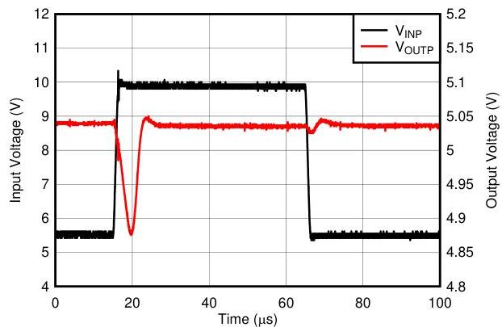
$\mathrm{V_{INP}} = 5.5\mathrm{V}$ 至 $10\mathrm{V}(4\mathrm{V} / \mu \mathrm{s})$ 、 $\mathrm{V_{OUTP}} = -\mathrm{V_{OUTN}} = 5\mathrm{V}$ 、 $\mathrm{I_{OUTN}} = 0\mathrm{mA}$ 、 $\mathrm{I_{OUTP}} = 150\mathrm{mA}$

图5-27. 线路瞬态负稳压器
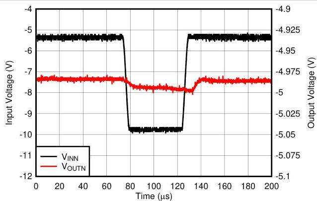
$\mathrm{V_{INN}} = -5.5\mathrm{V}$ 至 $-10\mathrm{V}(1\mathrm{V} / \mu \mathrm{s})$ 、 $\mathrm{V_{OUTP}} = -\mathrm{V_{OUTN}} = 5\mathrm{V}$ 、 $\mathrm{I_{OUTN}} = -150\mathrm{mA}$ 、 $\mathrm{I_{OUTP}} = 0\mathrm{mA}$

图5-28. 线路瞬态正稳压器
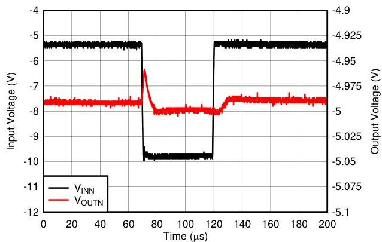
$\mathrm{V_{INN}} = -5.5\mathrm{V}$ 至 $-10\mathrm{V}(4\mathrm{V} / \mu \mathrm{s})$ 、 $\mathrm{V_{OUTP}} = -\mathrm{V_{OUTN}} = 5\mathrm{V}$ 、 $\mathrm{I_{OUTN}} = -150\mathrm{mA}$ 、 $\mathrm{I_{OUTP}} = 0\mathrm{mA}$

图5-29. 线路瞬态负稳压器

# 5.8 典型特性（续）

测试条件（除非另有说明）： $\mathrm{T_J} = 25^{\circ}\mathrm{C}$ 、 $\mathrm{V_{INP}} = \mathrm{V_{OUTP}(nom)} + 1.0\mathrm{V}$ 或 $\mathrm{V_{IN}} = 3.3\mathrm{V}$ （以较大者为准）、 $\mathrm{V_{INN}} = \mathrm{V_{OUTN}(nom)} - 1\mathrm{V}$ 或 $-3.3\mathrm{V}$ （以较小者为准）、 $\mathrm{V_{EN}} = \mathrm{V_{IN}}$ 、 $\mathrm{I_{OUT}} = 1\mathrm{mA}$ 、 $\mathrm{C_{IN}} = 10\mu \mathrm{F}$ 陶瓷、 $\mathrm{C_{OUT}} = 10\mu \mathrm{F}$ 陶瓷，并且 $\mathrm{C_{FFP}} = \mathrm{C_{FFN}} = \mathrm{C_{NR/SS}} = 10\mathrm{nF}$

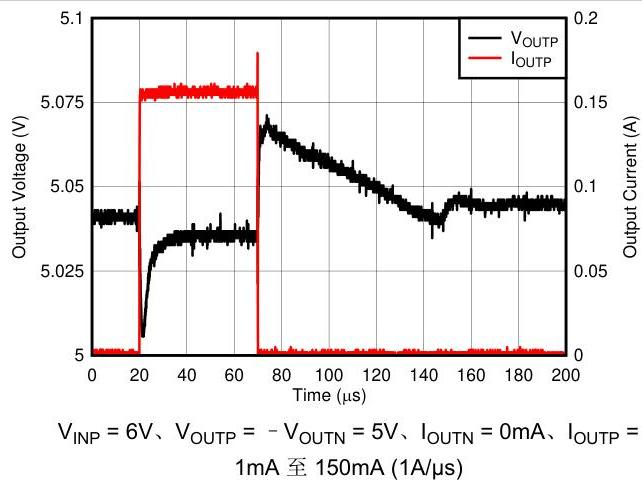
图5-30. 负载瞬态正稳压器

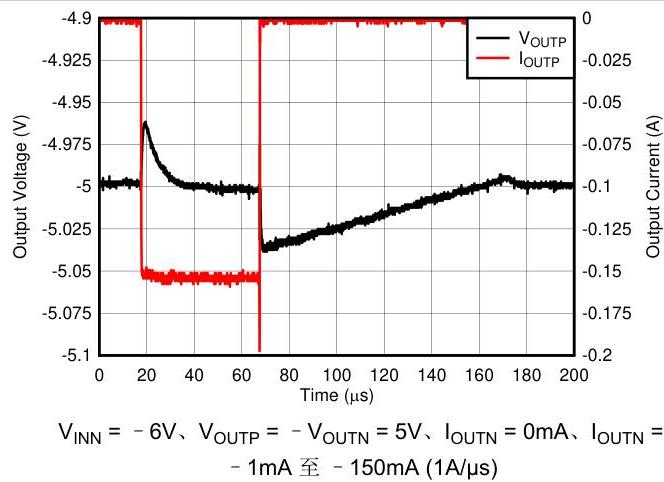
图5-31. 负载瞬态负稳压器

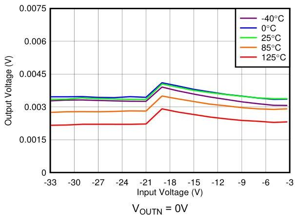
图5-32. 负线性调整率

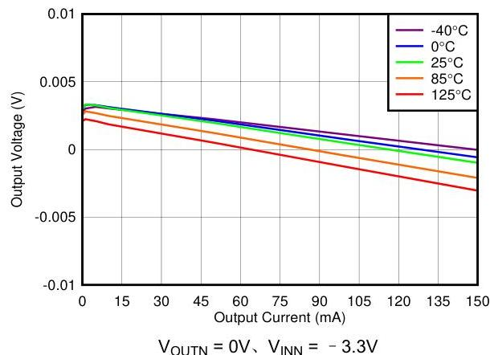
图5-33. 负负载调整率

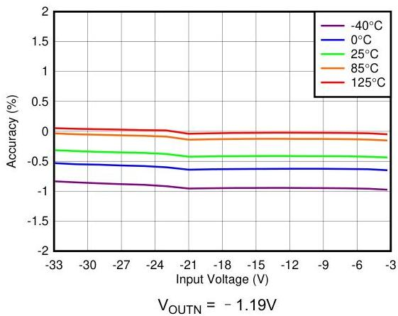
图5-34. 负线性调整率

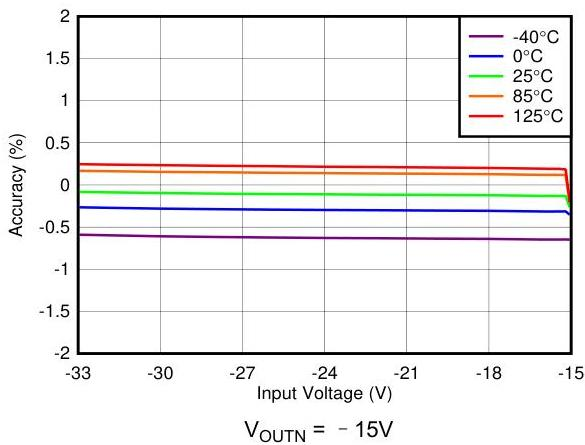
图5-35. 负线性调整率

# 5.8 典型特性（续）

测试条件（除非另有说明）： $\mathrm{T_J} = 25^{\circ}\mathrm{C}$ 、 $\mathrm{V_{INP}} = \mathrm{V_{OUTP}(nom)} + 1.0\mathrm{V}$ 或 $\mathrm{V_{IN}} = 3.3\mathrm{V}$ （以较大者为准）、 $\mathrm{V_{INN}} = \mathrm{V_{OUTN}(nom)} - 1\mathrm{V}$ 或 $-3.3\mathrm{V}$ （以较小者为准）、 $\mathrm{V_{EN}} = \mathrm{V_{IN}}$ 、 $\mathrm{I_{OUT}} = 1\mathrm{mA}$ 、 $\mathrm{C_{IN}} = 10\mu \mathrm{F}$ 陶瓷、 $\mathrm{C_{OUT}} = 10\mu \mathrm{F}$ 陶瓷，并且 $\mathrm{C_{FFP}} = \mathrm{C_{FFN}} = \mathrm{C_{NR/SS}} = 10\mathrm{nF}$

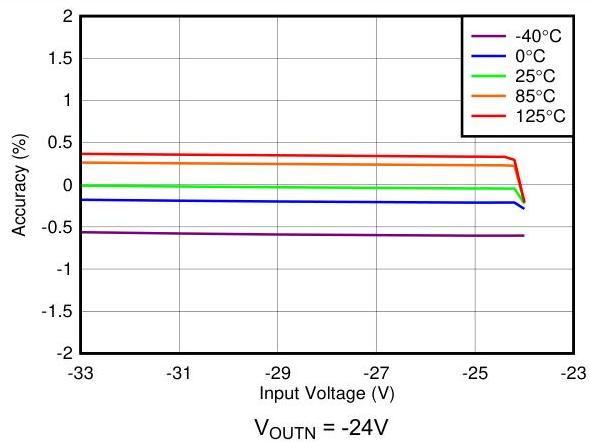
图5-36. 负线性调整率

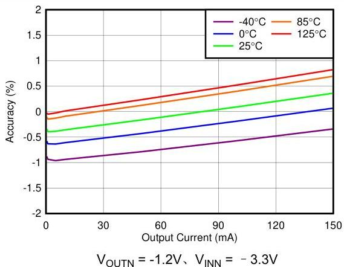
图5-37. 负负载调整率

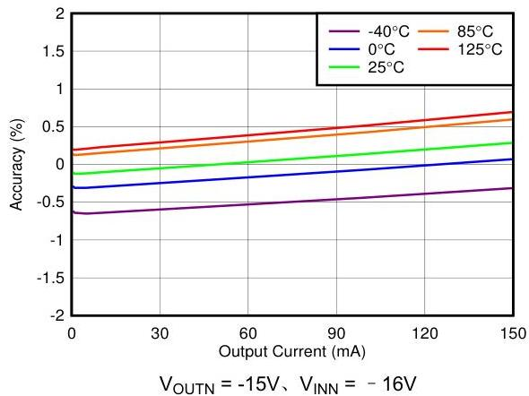
图5-38. 负负载调整率

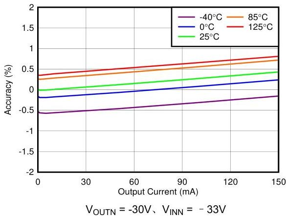
图5-39. 负负载调整率

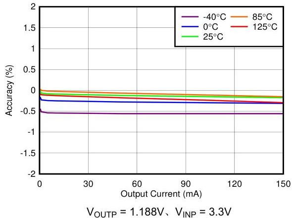
图5-40. 正负载调整率

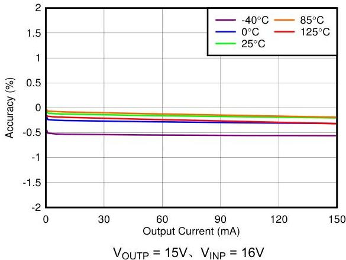
图5-41. 正负载调整率

# 5.8 典型特性（续）

测试条件（除非另有说明）： $\mathrm{T_J} = 25^{\circ}\mathrm{C}$ 、 $\mathrm{V_{INP}} = \mathrm{V_{OUTP(nom)}} + 1.0\mathrm{V}$ 或 $\mathrm{V_{IN}} = 3.3\mathrm{V}$ （以较大者为准）、 $\mathrm{V_{INN}} = \mathrm{V_{OUTN(nom)}} - 1\mathrm{V}$ 或 $-3.3\mathrm{V}$ （以较小者为准）、 $\mathrm{V_{EN}} = \mathrm{V_{IN}}$ 、 $\mathrm{I_{OUT}} = 1\mathrm{mA}$ 、 $\mathrm{C_{IN}} = 10\mu \mathrm{F}$ 陶瓷、 $\mathrm{C_{OUT}} = 10\mu \mathrm{F}$ 陶瓷，并且 $\mathrm{C_{FFP}} = \mathrm{C_{FFN}} = \mathrm{C_{NR/SS}} = 10\mathrm{nF}$

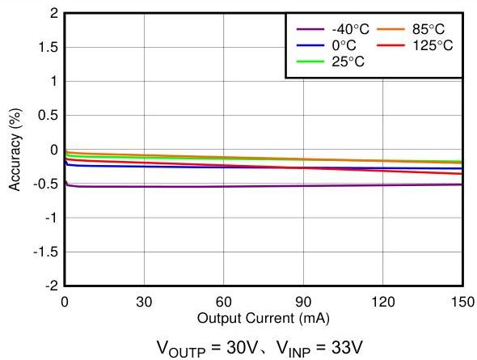
图5-42. 正负载调整率

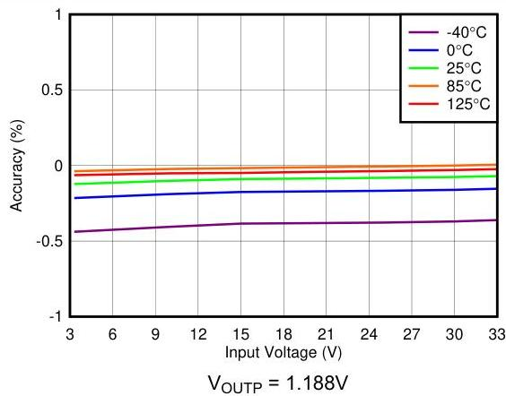
图5-43. 正线性调整率

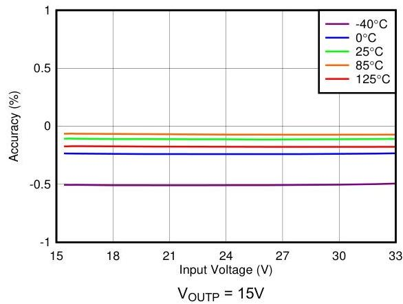
图5-44. 正线性调整率

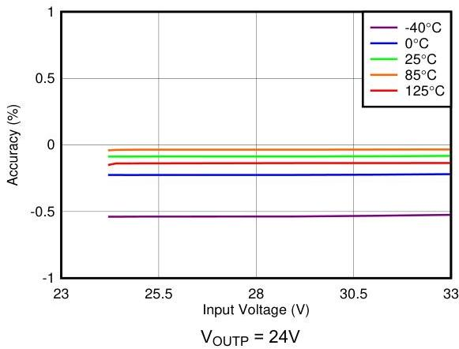
图5-45. 正线性调整率

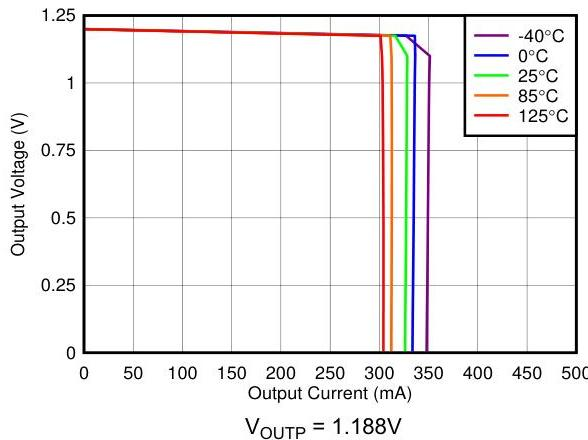
图5-46. 正稳压器电流限制

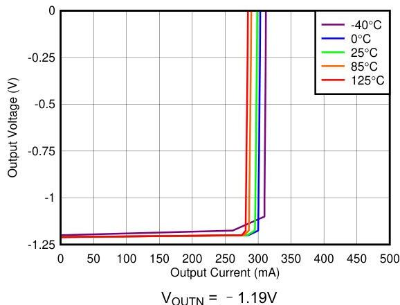
图5-47. 负稳压器电流限制

# 5.8 典型特性（续）

测试条件（除非另有说明）： $\mathrm{T_J} = 25^{\circ}\mathrm{C}$ 、 $\mathrm{V_{INP}} = \mathrm{V_{OUTP(nom)}} + 1.0\mathrm{V}$ 或 $\mathrm{V_{IN}} = 3.3\mathrm{V}$ （以较大者为准）、 $\mathrm{V_{INN}} = \mathrm{V_{OUTN(nom)}} - 1\mathrm{V}$ 或 $-3.3\mathrm{V}$ （以较小者为准）、 $\mathrm{V_{EN}} = \mathrm{V_{IN}}$ 、 $\mathrm{I_{OUT}} = 1\mathrm{mA}$ 、 $\mathrm{C_{IN}} = 10\mu \mathrm{F}$ 陶瓷、 $\mathrm{C_{OUT}} = 10\mu \mathrm{F}$ 陶瓷，并且 $\mathrm{C_{FFP}} = \mathrm{C_{FFN}} = \mathrm{C_{NR/SS}} = 10\mathrm{nF}$

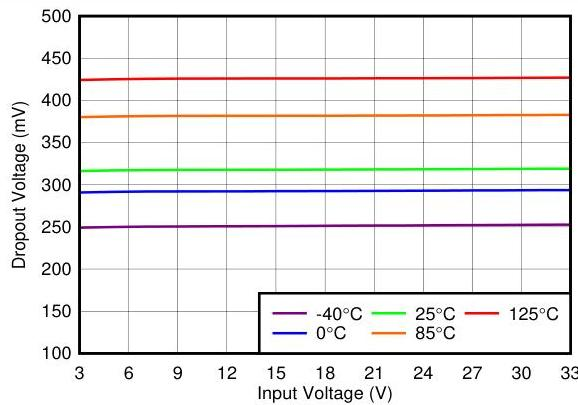
图5-48. 正稳压器压降电压与输入电压间的关系

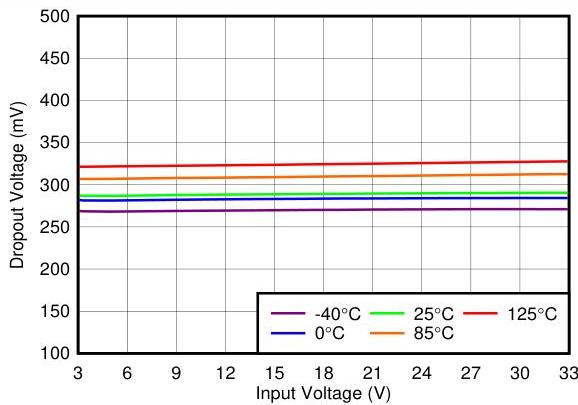
图5-49. 负稳压器压降电压与输入电压间的关系

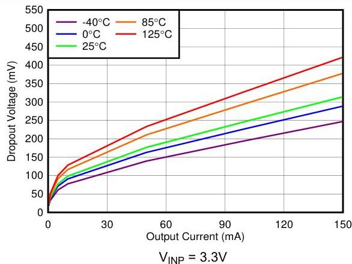
图5-50. 正稳压器压降电压与输出电流间的关系

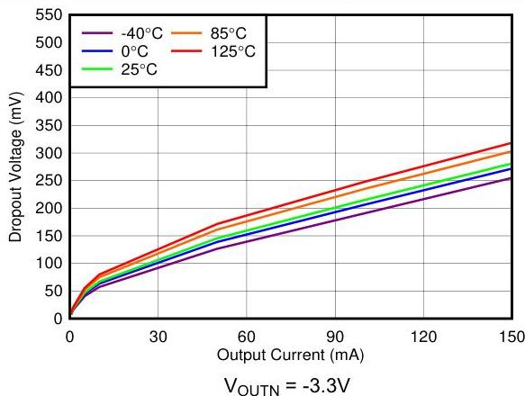
图5-51. 负稳压器压降电压与输出电流间的关系

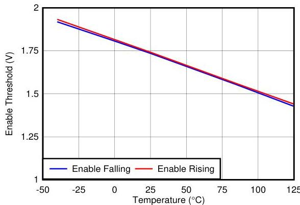
图5-52. 启用阈值与温度间的关系

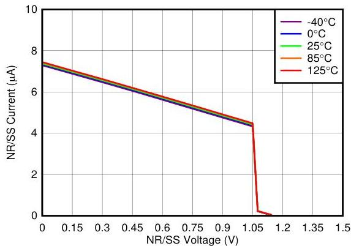
图5-53. $\mathrm{I_{NR / SS}}$ 与 $\mathrm{V_{NR / SS}}$ 间的关系

# 5.8 典型特性（续）

测试条件（除非另有说明）： $\mathrm{T_J} = 25^{\circ}\mathrm{C}$ 、 $\mathrm{V_{INP}} = \mathrm{V_{OUTP}(nom)} + 1.0\mathrm{V}$ 或 $\mathrm{V_{IN}} = 3.3\mathrm{V}$ （以较大者为准）、 $\mathrm{V_{INN}} = \mathrm{V_{OUTN}(nom)} - 1\mathrm{V}$ 或 $-3.3\mathrm{V}$ （以较小者为准）、 $\mathrm{V_{EN}} = \mathrm{V_{IN}}$ 、 $\mathrm{I_{OUT}} = 1\mathrm{mA}$ 、 $\mathrm{C_{IN}} = 10\mu \mathrm{F}$ 陶瓷、 $\mathrm{C_{OUT}} = 10\mu \mathrm{F}$ 陶瓷，并且 $\mathrm{C_{FFP}} = \mathrm{C_{FFN}} = \mathrm{C_{NR/SS}} = 10\mathrm{nF}$

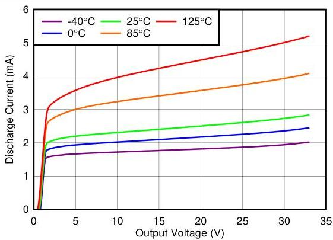
图5-54. 正输出放电电流与输出电压间的关系

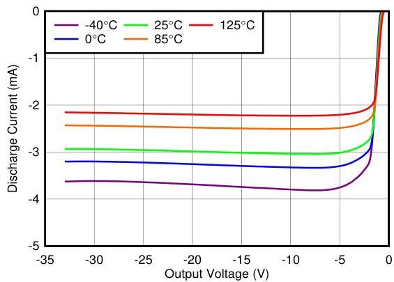
图5-55. 负输出放电电流与输出电压间的关系

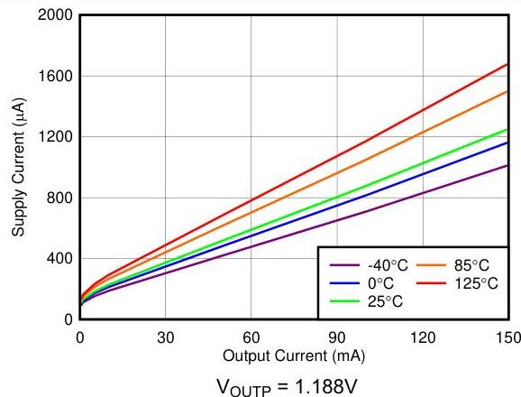
图5-56. 正电源电流与输出电流间的关系

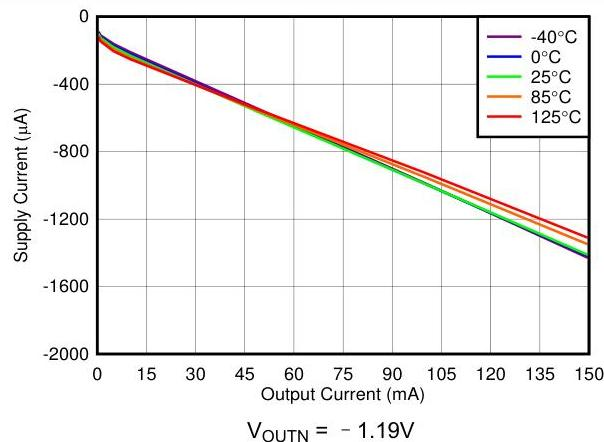
图5-57. 负电源电流与输出电流间的关系

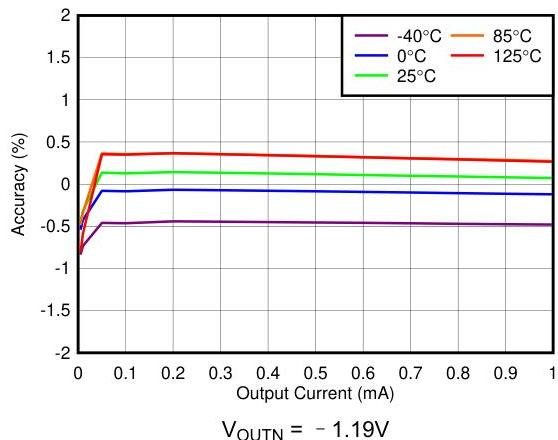
图5-58. 缓冲器精度与缓冲器电流间的关系

# 6 详细说明

## 6.1 概述

TPS7A39 是一款创新型线性稳压器 (LDO)，用于为信号链供电，在高达 150mA 的负载电流下，可实现高达 ±33V 的输入电压和高达 ±30V 的输出电压调节。该器件采用 LDO 拓扑，从设计上即具备比例式启动追踪能力，适用于大多数应用场景。如表 6-1 中所列，TPS7A39 还有其他几个特性，可简化器件在各种应用中的使用。

### 备注

在本文档中，x 用于表示某个条件或元件同时适用于正稳压器与负稳压器，例如 $C_{FFx}$ 表示 $C_{FFP}$ 与 $C_{FFN}$。

表 6-1. TPS7A39 特性

|  电压调节 | 系统启动 | 内部保护  |
| --- | --- | --- |
|  参考输入/输出 | 比例式启动跟踪 | 电流限制  |
|  高 PSRR 输出 | 可编程软启动 | 热关断  |
|  快速瞬态响应 | 时序控制  |   |

## 6.2 功能方框图

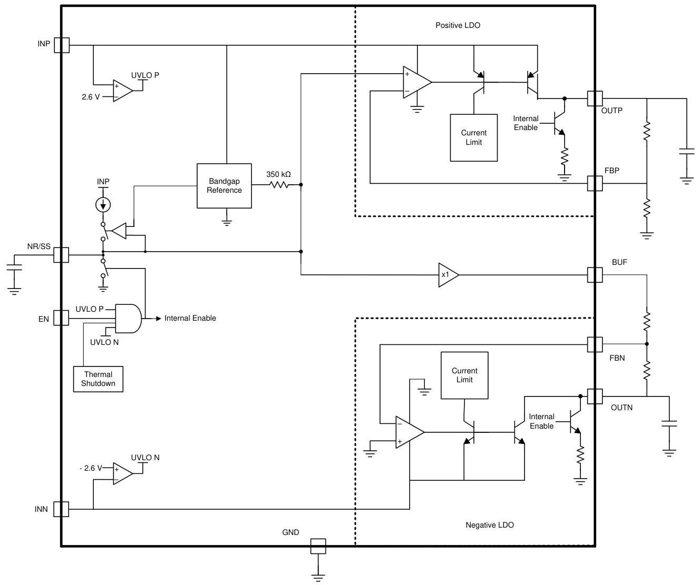

# 6.3 特性说明

## 6.3.1 电压调节

### 6.3.1.1 直流调节

LDO 的功能如同一个带缓冲的运算放大器，其输入信号为内部基准电压 $(V_{\mathrm{NR/SS}})$，如图 6-1 所示；在正常调节状态下，$V_{\mathrm{FBP}} = V_{\mathrm{NR/SS}}$。共用单个基准电压可确保两个通道在启动期间实现同步跟踪。

$V_{\mathrm{NR/SS}}$ 采用低通滤波器设计，使其在误差放大器的输入端具有极低的带宽。因此，基准电压可视为纯直流输入信号。

如图 6-2 所示，器件中的负 LDO 透过 $V_{\mathrm{FBN}} = 0\mathrm{V}$ 进行调节，并对正基准电压 $(V_{\mathrm{BUF}})$ 进行反相处理。该拓扑结构使负稳压器可将电压调节至 $0\mathrm{V}$。

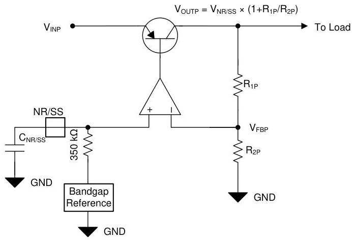
图 6-1. 简化的正极调节电路

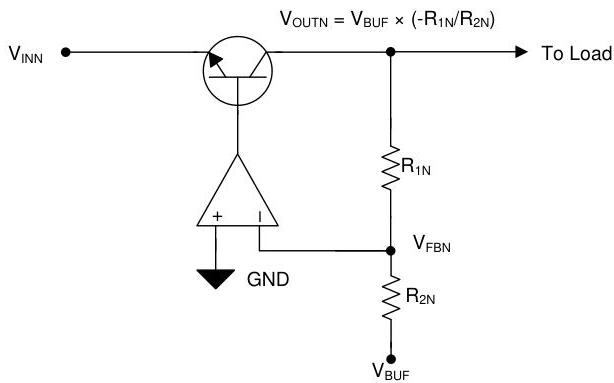
图 6-2. 简化的负极调节电路

### 6.3.1.2 交流和瞬态响应

每个 LDO 都能快速响应输入电源（线路瞬态）或输出电流（负载瞬态）上的瞬态。该 LDO 具有高电源抑制比 (PSRR)，当与低内部本底噪声 $(V_{\mathrm{n}})$ 结合使用时，LDO 近似于交流和大信号条件下的理想电源。

此器件的性能和内部布局大大减少了从一个通道到另外一个通道的噪声耦合（串扰）。良好的印刷电路板 (PCB) 布局可更大限度地减少串扰。

降噪和软启动电容 $(C_{\mathrm{NR/SS}})$ 和前馈电容 $(C_{\mathrm{FFx}})$ 可轻松降低器件本底噪声并改善 PSRR；有关优化噪声和 PSRR 性能的更多信息，请参阅优化噪声和 PSRR 部分。

## 6.3.2 用户可设置的缓冲基准

如图 6-3 所示，器件在 NR/SS 引脚内部生成的带隙电压输出。内部电阻器 (R_NR) 和外部电容器 (C_NR/SS) 控制 V_NR/SS 引脚电压的上升时间，从而设置软启动时间。该网络还可以滤除来自带隙的噪声，从而降低器件的整体本底噪声。

使用外部源驱动 NR/SS 引脚可以提高器件精度并降低器件本底噪声，同时使器件能够将正通道调节到低于器件内部基准的电压。

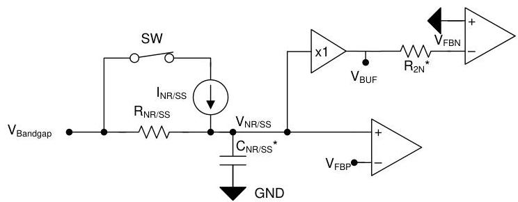
Note: * Denotes external components
*表示外部组件。

## 6.3.3 有源放电

当 EN 或 UVLOx 为低电平时，该器件在 $V_{\text{OUTx}}$ 和 GND 之间连接一个电阻，使输出电容放电。有源放电电路需要 $|V_{\text{OUTx}}| \geqslant 0.6\,\text{V}$（典型值）才能对输出进行放电，因为 NPN 下拉电阻需要满足最低 $V_{\text{CE}}$ 要求。

当输入电压降至目标输出电压以下时，请勿依赖有源放电电路对大型输出电容器进行放电。TPS7A39 是一款双极器件，因此反向电压条件 ($|V_{\text{OUTx}}| \geqslant |V_{\text{INX}}| + 0.3\,\text{V}$) 会使发射极与基极之间的二极管击穿，还会导致基板中形成的寄生双极击穿；请参阅反向电流部分了解更多信息。

当 EN 或 UVLOx 为低电平时，器件会输出少量漏电流。此漏电流通常可由最大阻值为 $240\,\text{k}\Omega$ 的 $R_{2x}$ 电阻器加以处理。然而，若器件设为单位增益模式（即未使用 $R_{2x}$ 电阻器），漏电流将导致输出电压缓慢上升，直到放电电路（如图 6-4 所示）具有足够的余量来钳位输出电压（典型值为 $\pm 0.6\,\text{V}$）。

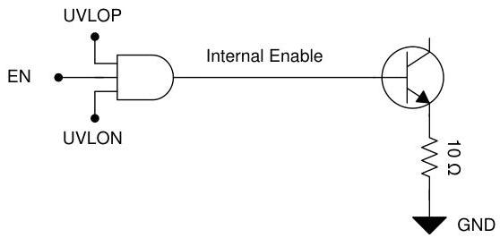
图 6-4. 简化的有源放电电路

## 6.3.4 系统启动控制

在许多不同的应用中，由于有时序要求，电源输出必须在特定的时间窗口内开启，以确保负载正常运行或尽可能减少输入电源上的负载。

通过 $C_{\text{NR/SS}}$ 电容器，两个 LDO 的启动都受到良好控制且用户可进行调节，从而以简单的方式解决了许多电源设计工程师面临的严苛要求。为了使启动跟踪正常工作，需要至少 4.7nF 的 $C_{\text{NR/SS}}$ 电容器。有关启动跟踪的更多信息，请参阅降噪和软启动电容器 ($C_{\text{NR/SS}}$) 部分。

## 6.3.4.1 启动跟踪

图 6-5 展示了两种稳压器如何使用一个基准电压，从而实现启动跟踪。为正负稳压器使用相同的基准电压可确保两者以受控方式同时启动；详见图 5-24 与图 5-25。

若 $V_{\mathrm{INx}}$ 上的斜坡速度低于软启动时间，则即使 $\mathrm{EN} = V_{\mathrm{INP}}$，也不会实现启动跟踪。如果斜坡速度慢于软启动时间，则应使用启用信号来启动器件，以实现启动跟踪功能。由于正负通道的内部使能阈值之间存在轻微不一致，导致某一通道在略低的输入电压下启动。此类不一致在大多数应用中通常不会造成问题，并可透过使用启用信号控制启动来轻松解决。外部信号可以来自输入电源正常指示器、电压监控器输出（例如 TPS3701）或其他来源。

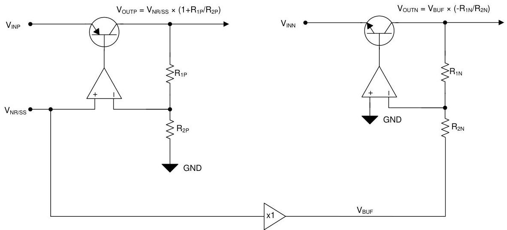
图 6-5. 简化的调节电路

## 6.3.4.2 时序控制

图 6-6 和表 6-2 介绍了如何通过设置使能电路 (EN) 和欠压锁定电路 (UVLOP 和 UVLON) 来分别控制两个 LDO 的导通和关断时间。

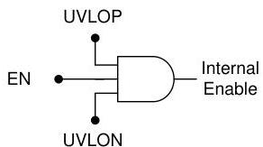
图 6-6. 简化的导通控制

表 6-2. 时序功能表

|  正输入电压 (V_{INP}) | 负输入电压 (V_{INN}) | 启用状态 | LDO 状态 | 有源放电  |
| --- | --- | --- | --- | --- |
|  V_{INP} ≥ V_{UVLOP} | V_{INN} ≤ V_{UVLON} | EN = 1 | 开 | 关闭  |
|   |   |  EN = 0 | 关闭 | 打开(1)  |
|  V_{INP} ≥ V_{UVLOP} | V_{INN} > V_{UVLON} | EN = 无关 | 关闭 | 打开(1)  |
|  V_{INP} < V_{UVLOP} | V_{INN} ≤ V_{UVLON} | EN = 无关 | 关闭 | 打开(1)  |
|  V_{INP} < V_{UVLOP} - V_{UVLOP(hys)} | V_{INN} > V_{UVLON} - V_{UVLON(hys)} | EN = 无关 | 关闭 | 打开(1)  |

(1) 只要 $V_{\mathrm{INx}}$ 和 $V_{\mathrm{OUTx}}$ 为放电电路提供足够的余量以正常工作，有源放电就会保持开启状态。

## 6.3.4.2.1 使能 (EN)

使能信号 $(\mathsf{V}_{\mathsf{EN}})$ 是一个高电平有效的数字控制信号，可在使能电压超过上升阈值 $(\mathsf{V}_{\mathsf{EN}} \geq \mathsf{V}_{\mathsf{IH}(\mathsf{EN})})$ 时启用 LDO，并在使能电压低于下降阈值 $(\mathsf{V}_{\mathsf{EN}} \leq \mathsf{V}_{\mathsf{IL}(\mathsf{EN})})$ 时禁用 LDO。确切的使能阈值介于 $\mathsf{V}_{\mathsf{IH}(\mathsf{EN})}$ 和 $\mathsf{V}_{\mathsf{IL}(\mathsf{EN})}$ 之间，因为 EN 是数字控制信号。如果应用不使用启用控制功能，则应将 EN 连接到 $\mathsf{V}_{\mathsf{INP}}$。

将 EN 直接连接到 $V_{\mathrm{INP}}$ 的慢速 $V_{\mathrm{INx}}$ 斜坡可能会导致启动跟踪超出规格。在慢速斜坡条件下，在 $V_{\mathrm{INP}}$ 之间使用电阻分压器来提供启动跟踪。

## 6.3.4.2.2 欠压锁定 (UVLO) 控制

UVLO 电路可快速响应输入电源上的故障，并尝试在其中任何一个电源轨崩溃时禁用器件的输出。

由于输入电源 UVLO 电路的快速响应时间，远低于输入电源 UVLO 下降阈值（欠压）的快速短线路瞬态，这可能会在瞬态边缘造成瞬时故障。这些故障在大多数 LDO 中都很常见。在大多数应用中，局部输入电容可防止严重的欠压情况；如需更多详细信息，请参阅应用信息中的欠压锁定 (UVLOx) 控制部分。快速线路瞬态可能导致输出暂时关闭，并可以通过使用建议的 $10\mu \mathrm{F}$ 输入电容来减轻。如果这成为系统中的一个问题，那么增加输入电容可防止发生这些故障。

## 6.4 器件功能模式

### 6.4.1 正常运行

在下列条件下，器件的输出电压会稳定在标称值：

- 输入电压至少需达到 $|V_{INx(min)}|$
- 输入电压高于标称输出电压与压降电压之和
- 使能电压先前已超过使能上升阈值电压，但尚未降至低于使能下降阈值
- 输出电流低于电流限制
- 器件结温低于 $T_{SD}$

### 6.4.2 压降运行

如果输入电压低于标称输出电压与指定压降电压之和，但仍满足正常工作模式的所有其他条件，则器件将工作在压降模式。在此运行模式下，输出电压等于输入电压与压降电压之差。当导通晶体管（为双极性接面晶体管，即BJT）工作于饱和状态且不再控制LDO中的电流时，器件的瞬态性能将显著下降。压降过程中的线路或负载瞬态可能会导致输出电压偏差较大。

### 6.4.3 禁用

在下列情况下，该器件被禁用：

- 使能电压低于使能下降阈值电压或尚未超过使能上升阈值
- 器件结温高于热关断温度

表 6-3 给出了不同工作模式的参数条件。

表 6-3. 器件功能模式比较

|  工作模式 | 参数  |   |   |   |
| --- | --- | --- | --- | --- |
|   |  V_{IN} | V_{EN} | I_{OUT} | T_{J}  |
|  正常模式 | |V_{INx}| > |V_{OUT(nom)}| + |V_{DOx}| 且 |V_{INx}| > |V_{INx(min)}| | V_{EN} > V_{IH} | |I_{OUTx}| < |I_{LIMx}| | T_{J} < 125°C  |
|  压降模式 | |V_{INx(min)}| < |V_{INx}| < |V_{OUTx(nom)}| + |V_{DOx}| | V_{EN} > V_{IH} | — | T_{J} < 125°C  |
|  禁用模式
(任何真条件都会禁用该器件) | — | V_{EN} < V_{IL} | — | T_{J} > T_{SD}  |

# 7 应用和实施

## 备注

以下应用部分中的信息不属于 TI 器件规格的范围，TI 不担保其准确性和完整性。TI 的客户应负责确定器件是否适用于其应用。客户应验证并测试其设计，以确保系统功能。

## 7.1 应用信息

能否在应用中成功实现 LDO 取决于应用要求。本部分将讨论主要器件特性，以及如何出色地实现 LDO，从而获得可靠的设计。

### 7.1.1 设置可调器件的输出电压

图 7-1 显示了每个 LDO 电阻反馈网络设置输出电压。正 LDO 输出电压范围为 $V_{NR/SS}$ 至 $30\mathrm{V}$，负 LDO 输出电压范围为 $0\mathrm{V}$ 至 $-30\mathrm{V}$。

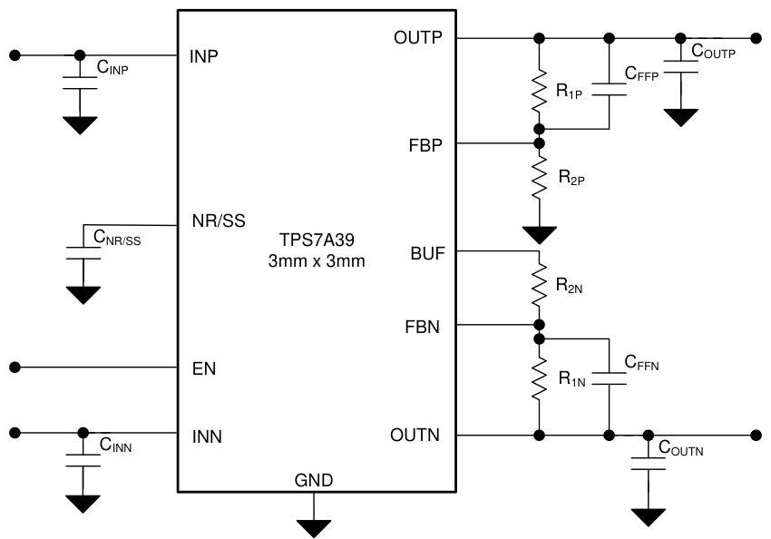
图 7-1. 可调节运行

方程式 1 将 $R_{1P}$ 和 $R_{2P}$ 的值与 $V_{\text{OUTP(NOM)}}$ 和 $V_{\text{NR/SS}}$ 关联起来，以设置正输出电压。方程式 2 将 $R_{1N}$ 和 $R_{2N}$ 的值与 $V_{\text{OUTN(NOM)}}$ 和 $V_{\text{NR/SS}}$ 关联起来，以设置负输出电压。

正 LDO 配置为同相运算放大器，而负 LDO 配置为反相运算放大器。

$$
V_{\text{OUTP}} = V_{\text{NR/SS}} \times \left(1 + R_{1P} / R_{2P}\right) \tag{1}
$$

$$
V_{\text{OUTN}} = V_{\text{NR/SS}} \times \left(- R_{1N} / R_{2N}\right) \tag{2}
$$

将正通道上的 $V_{\text{NR/SS}}$ 替换为 $V_{\text{FBP}}$，将负通道上的 $V_{\text{NR/SS}}$ 替换为 $V_{\text{BUF}}$，可提供更准确的关系。

方程式 3 和方程式 2 是方程式 1 和方程式 2 的重新排列版本，并进行了上述替换。

$$
R_{1P} = \left(V_{\text{OUTP}} / V_{\text{FBP}} - 1\right) \times R_{2P} \tag{3}
$$

$$
R_{1N} = - \left(V_{\text{OUTN}} \times R_{2P}\right) / V_{\text{BUF}} \tag{4}
$$

为确保精度，通过两个反馈网络的最小偏置电流均为 $5\mu\mathrm{A}$。

为了更精确，请考虑进入误差放大器的输入偏置电流（ $I_{FBP}$ 和 $I_{FBN}$ ）并使用 $0.1\%$ 电阻器。使用高精度外部基准覆盖内部基准也可以提高器件的精度。

表 7-1 和表 7-2 展示了使用市售的 $1\%$ 容差电阻器的几种常见输出电压的电阻器组合。

表 7-1. 正 LDO 的建议反馈电阻值

|  目标输出电压 (V) | 反馈电阻器值(1) |   | 计算出的输出电压 (V)  |
| --- | --- | --- | --- |
|   |  R_{1P} (kΩ) | R_{2P} (kΩ)  |   |
|  1.5 | 2.67 | 10.0 | 1.50  |
|  1.8 | 5.23 | 10.0 | 1.80  |
|  2.5 | 11.0 | 10.0 | 2.49  |
|  3.0 | 15.4 | 10.0 | 3.00  |
|  3.3 | 17.8 | 10.0 | 3.29  |
|  5.0 | 32.4 | 10.0 | 5.02  |
|  9.0 | 66.5 | 10.0 | 9.07  |
|  12.0 | 90.9 | 10.0 | 12.0  |
|  15.0 | 115 | 10.0 | 14.8  |
|  24.0 | 191 | 10.0 | 23.8  |
|  30.0 | 243 | 10.0 | 29.8  |

(1) $R_{1P}$ 从 OUTP 连接到 FBP, $R_{2P}$ 从 FBP 连接到 GND; 请参阅设置可调器件的输出电压部分。

表 7-2. 负 LDO 的建议反馈电阻值

|  目标输出电压 (V) | 反馈电阻器值(1) |   | 计算出的输出电压 (V)  |
| --- | --- | --- | --- |
|   |  R_{1N} (kΩ) | R_{2N} (kΩ)  |   |
|  -0.3 | 2.55 | 10.0 | -0.303  |
|  -1.5 | 12.7 | 10.0 | -1.51  |
|  -1.8 | 15.0 | 10.0 | -1.78  |
|  -2.5 | 21.0 | 10.0 | -2.49  |
|  -3.0 | 25.5 | 10.0 | -3.03  |
|  -3.3 | 28.0 | 10.0 | -3.33  |
|  -5.0 | 42.2 | 10.0 | -5.04  |
|  -9.0 | 75.0 | 10.0 | -8.91  |
|  -12.0 | 100 | 10.0 | -11.9  |
|  -15.0 | 127 | 10.0 | -15.1  |
|  -24.0 | 200 | 10.0 | -23.8  |
|  -30.0 | 255 | 10.0 | -30.3  |

(1) $R_{1N}$ 从 OUTN 连接到 FBN, $R_{2N}$ 从 FBN 连接到 BUF; 请参阅设置可调器件的输出电压部分。

## 7.1.2 电容器推荐

该器件设计为在输入和输出端引脚使用低等效串联电阻 (ESR) 陶瓷电容器实现稳定。该器件还可以在搭配使用 $\mathrm{ESR} &lt; 75\mathrm{m}\Omega$ 的铝聚合物和钽聚合物电容器时保持稳定。

若并联多个电容器（满足最小电容与 ESR 要求），还可以使用电解质电容器（以及 ESR 较高的聚合物电容器）。

当电容器的阻抗处于最小值时，应取其有效 ESR 来实现稳定性。在最低级别时，电容和寄生电感相互抵并提供直流 ESR。

采用 X7R、X5R 和 COG 额定电介质材料的陶瓷电容器可在整个温度范围内提供相对良好的电容稳定性，而由于电容变化较大，因此建议不要使用 Y5V 额定电容器。

无论选择哪种陶瓷电容器类型，陶瓷电容都会随工作电压和温度的变化而变化。根据经验来看，陶瓷电容的容量应至少降额 50%。此处推荐的输入和输出电容器的有效电容降额约为 50%，但在较高的 VIN 和 VOUT 条件下（即 VIN = 5.5V 至 VOUT = 5.0V），降额可能大于 50%，此情况必须纳入考量。

对于高性能应用，聚合物电容器是理想的选择，因为它们不会像陶瓷电容一样出现大幅降额情况。

## 7.1.3 输入和输出电容器（CINx 和 COUTx）

本器件设计与特性测试皆基于每个输入与输出端使用容量为 10μF 或更大的陶瓷电容器（等效电容需达 2.2μF 或以上）。

为了最大限度减轻电容器与器件之间的布线电感，请将输入和输出电容器尽可能靠近相应的输入和输出引脚放置。如果使用 LDO 产生低输出电压（低于 5V），则可以使用 4.7μF 的输出电容器。如果使用的是 4.7μF 的输出电容器，请务必在设计时考虑电容器的降额情况。

若出现幅度大且变化快速的线路瞬变，可能导致器件的输出瞬时关闭。通常，这些瞬态在大多数应用中不会发生，但当这些瞬态发生时，使用较大的输入电容器可以减慢线路瞬态。如果系统的输入线路瞬态快于 0.5V/μs，请提高输入电容。

## 7.1.4 前馈电容器 (CFFx)

尽管无需在 FBx 引脚和 OUTx 引脚之间使用前馈电容器 (CFFx) 即可实现稳定性，但 10nF 的外部 CFFx 电容器可优化瞬态、噪声和 PSRR 性能。CFFx 的建议最大值为 100nF。

更大的 CFFx 可能会主导由 CNR/SS 设置的启动时间，如需获取更多信息，请参阅 使用带低压降稳压器的前馈电容器和的优缺点 应用手册。

## 7.1.5 降噪和软启动电容器 (CNR/SS)

尽管不需要从 NR/SS 引脚到 GND 使用降噪和软启动电容器 (CNR/SS)，但为了控制启动时间与降低本底噪声，仍强烈建议使用 CNR/SS。为了使启动跟踪正常运行，至少需配置最小值为 4.7nF 的电容器。随着反馈电阻器与前馈电容器所构成的时间常数增加，为确保启动跟踪功能正常运作，CNR/SS 电容器的值也必须相应提高。如需了解如何计算反馈网络的时间常数，请参阅应用手册《使用低压降稳压器时配置前馈电容的利与弊》。

## 7.1.6 缓冲基准电压

NR/SS 引脚上的电压（无论从内部还是外部驱动）通过高带宽、低噪声运算放大器进行缓冲。BUF 引脚可在许多信号链应用中用作电压基准。

## 7.1.7 覆盖内部基准

LDO 的内部基准可借由外部源进行覆盖，以提升 LDO 的精度并降低输出噪声。要覆盖内部基准，请将外部源连接到 LDO 的 NR/SS 引脚。要对内部基准进行过驱，外部源必须能够提供或接收 100μA 或更高的电流。

内部基准在 -40°C 到 +125°C 范围内可实现 2% 的精度；使用外部基准有助于在整个温度范围内实现更高的精度。

## 7.1.8 启动

### 7.1.8.1 软启动控制 (NR/SS)

器件的每个输出都具有用户可调、单调、电压受控的软启动功能，通过外部电容器 (CNR/SS) 进行设置。该软启动可消除上电初始化问题。

在启动期间，输出电压 (VOUTx) 按比例上升到 VNR/SS。因此，VNR/SS 达到标称值所需的时间决定了 VOUTx 的上升时间（启动时间）。

软启动斜坡时间取决于软启动充电电流 $(I_{NR/SS})$、软启动电容 $(C_{NR/SS})$ 和内部基准 $(V_{NR/SS})$。方程式 5 计算近似软启动斜坡时间 $(t_{SS})$：

$$
t_{SS} = R_{NR/SS} \times C_{NR/SS} \times \ln \left[ \left(V_{NR/SS} + I_{NR/SS} \times R_{NR/SS}\right) / \left(I_{NR/SS} \times R_{NR/SS}\right) \right] \tag{5}
$$

电气特性表中提供了软启动充电电流和器件内部 $R_{NR/SS}$ 的值。

## 7.1.8.1.1 浪涌电流

浪涌电流定义为启动期间 INx 引脚处流入 LDO 的电流。然后，浪涌电流主要由负载电流和用于为输出电容器充电的电流之和组成。此电流很难测量，因为必须移除输入电容器，因此不建议这样做。但是，可以使用方程式 6 估算出浪涌电流：

$$
I_{OUTx}(t) = \left[ \frac{C_{OUTx} \times dV_{OUTx}(t)}{dt} \right] + \left[ \frac{V_{OUTx}(t)}{R_{LOAD}} \right] \tag{6}
$$

其中：

- $V_{OUTx}(t)$ 是导通斜坡的瞬时输出电压
- $dV_{OUTx}(t)/dt$ 是 $V_{OUTx}$ 斜坡的斜率
- $R_{LOAD}$ 是输出电阻负载阻抗

## 7.1.8.2 欠压锁定 (UVLOx) 控制

UVLOx 电路可确保在输入或偏置电源达到最小工作电压范围之前器件保持禁用状态，并确保在输入电源崩溃时器件正确关断。

图 7-2 和表 7-3 介绍了 UVLOx 电路对各种输入电压事件的响应，假设 $V_{EN} \geqslant V_{IH(EN)}$。

正负 UVLO 电路在内部进行与运算。因此，如果任一电源崩溃，则两个输出都关断，$V_{NR/SS}$ 在内部被拉至低电平。

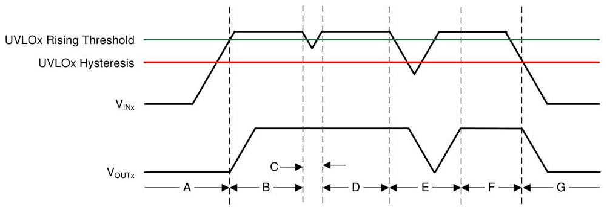
图 7-2. 典型 UVLOx 运行

表 7-3. 典型 UVLOx 运行说明

|  区域 | 事件 | V_{OUTx}状态 | 注释  |
| --- | --- | --- | --- |
|  A | 导通，[V_{INx}] ≤ [V_{UVLOx}] | 0 | 启动  |
|  B | 1% | 1 | 调节至目标 V_{OUTx}  |
|  C | 欠压，[V_{INx}] ≥ [V_{UVLOx} - V_{HYSx}] | 1 | 输出可能会超出稳压范围，但器件仍保持启用状态  |
|  D | 1% | 1 | 调节至目标 V_{OUTx}  |
|  E | 欠压，[V_{INx}] < [V_{UVLOx} - V_{HYSx}] | 0 | 由于存在负载和有源放电电路，该器件会被禁用，并且输出会下降。当输入电压达到 UVLOx 上升阈值时，器件将重新启用，随后会正常启动。  |
|  F | 1% | 1 | 调节至目标 V_{OUTx}  |
|  G | 关断，[V_{INx}] < [V_{UVLOx} - V_{HYSx}] | 0 | 输出会因为负载和有源放电电路而下降  |

与许多具有该功能的其他 LDO 类似，UVLOx 电路需要几微秒才能完全置为有效。在此期间，低于约 0.8V 的下行瞬态会导致 UVLOx 在短时间内置为有效；但是，UVLOx 电路没有足够的存储能量使器件内的内部电路完全放电。当 UVLOx 电路没有留出足够的时间使内部节点完全放电时，不会完全禁用输出。

当在最小 VINx 附近工作时，通过使用更大的输入电容器来增加输入电源的下降时间，可以减轻下行瞬态的影响。

## 7.1.9 交流和瞬态性能

双通道器件的 LDO 交流性能包括电源抑制比、通道间输出隔离、输出电流瞬态响应和输出噪声。这些指标主要是控制 LDO 闭环输入和输出阻抗的开环增益、带宽和相位裕度的函数。输出噪声主要由带隙基准和误差放大器噪声导致。

## 7.1.9.1 电源抑制比 (PSRR)

PSRR 用于衡量 LDO 控制环路在整个频谱范围（通常为 10Hz 至 10MHz）内抑制从 VINx 到 VOUTx 的信号的能力。方程式 7 给出了作为输入信号 [VINx(f)] 和输出信号 [VOUTx(f)] 频率的函数的 PSRR 计算。

$$
\mathrm{PSRR} \, (\mathrm{dB}) = 20 \log_{10} \left(\frac{\mathrm{V}_{\mathrm{INx}}(\mathrm{f})}{\mathrm{V}_{\mathrm{OUTx}}(\mathrm{f})}\right) \tag{7}
$$

尽管 PSRR 是信号振幅损耗，但为了方便起见，PSRR 仍显示为正值，以分贝 (dB) 为单位。

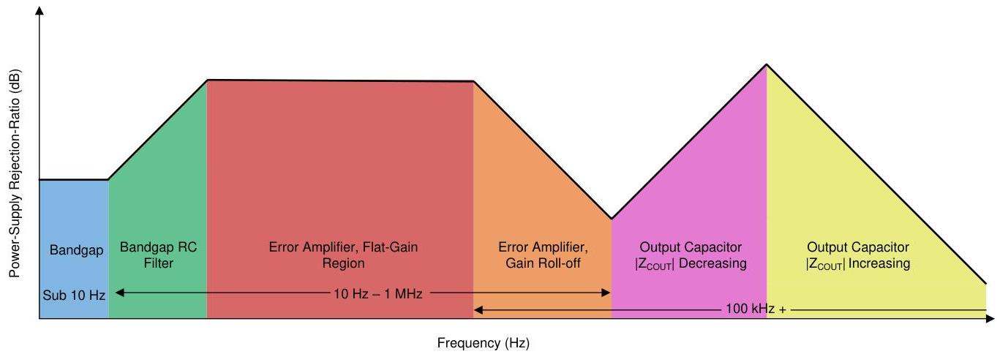
图 7-3 展示了 PSRR 与频率之间的关系的简化示意图。
图 7-3. 电源抑制比示意图

LDO 通常不仅用作直流/直流稳压器，还用于提供非常干净的电源电压，从而为敏感系统元件提供超低噪声和纹波。

## 7.1.9.2 通道间输出隔离和串扰

输出隔离是度量器件抑制某一路输出电压干扰对另一输出通道影响能力的指标。这种衰减可在另一输出通道的负载瞬态测试中观察到；为了对抑制效果进行定量评估，输出通道隔离度通常以分贝 (dB) 表示。

输出隔离性能是 PCB 布局的一个强大功能。有关如何优化隔离性能，请参阅布局指南部分。

## 7.1.9.3 输出电压噪声

TPS7A39 专为系统应用而设计，在这些应用中，电源轨上的噪声最小化对系统性能至关重要。例如，TPS7A39 可用于基于锁相环 (PLL) 的时钟电路，以实现最小相位噪声，或者用于测试和测量系统，即使是较小的电源噪声波动也会降低系统动态范围。

LDO 噪声定义为仅由半导体电路产生的内部固有噪声。此噪声是各种噪声类型的总和（例如与电流流经引脚结相关的散粒噪声、由电荷载体热搅动引起的热噪声、闪烁噪声或 1/f 噪声，并在较低频率下作为 1/f 的函数占主导）。图 7-4 所示为输出电压噪声密度与频率间关系的简化图。

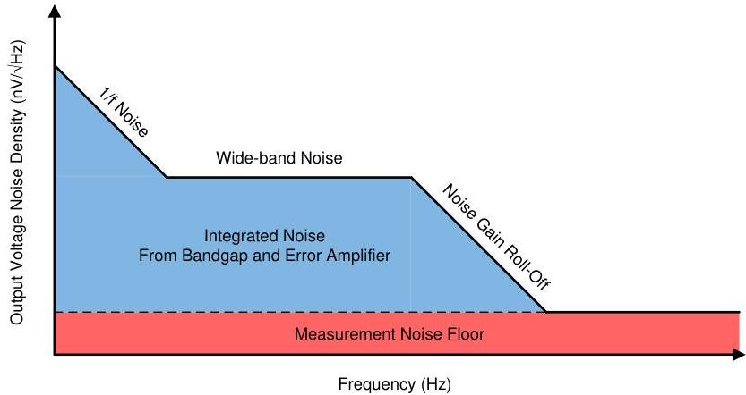
图 7-4. 输出电压噪声图

如需更多详细信息，请参阅如何测量LDO噪声白皮书。

# 7.1.9.4 优化噪声和 PSRR

表 7-4 介绍了如何通过多种方式改善器件的超低本底噪声和 PSRR。

表 7-4. 各种参数对交流性能的影响 (1) (2)

|  参数 | 噪声 |   |   | PSRR  |   |   |
| --- | --- | --- | --- | --- | --- | --- |
|   |  低频 | 中频 | 高频 | 低频 | 中频 | 高频  |
|  C_{NR/SS} | +++ | 没有影响 | 没有影响 | +++ | + | 没有影响  |
|  C_{FFx} | ++ | +++ | + | ++ | +++ | +  |
|  C_{OUTx} | 没有影响 | + | +++ | 没有影响 | + | +++  |
|  |V_{INx}| - |V_{OUTx} | + | + | + | +++ | +++ | ++  |
|  PCB 布局 | ++ | ++ | + | + | +++ | +++  |

(1) + 的数量表示通过增大参数值来改善噪声或 PSRR 性能。
(2) 带颜色的单元格表示对噪声或 PSRR 性能最简单的改进。

降噪电容器与降噪电阻器一起形成一个低通滤波器 (LPF)，该滤波器在使用误差放大器之前滤除来自基准的噪声，从而最大限度地降低输出电压本底噪声。LPF 是单极滤波器，截止频率可以通过方程式 8 计算。当 $V_{\text{OUTx(NOM)}}$ 增加时，$C_{\text{NR/SS}}$ 电容器的影响会增加，因为当输出电压增加时，基准噪声也会增加。对于低噪声应用，建议使用 10nF 至 1μF $C_{\text{NR/SS}}$。

$$
f_{\text{cutoff}} = 1 / (2 \times \pi \times R_{\text{NR/SS}} \times C_{\text{NR/SS}}) \tag{8}
$$

前馈电容器通过滤除中波段频率噪声来减少输出电压噪声。前馈电容器可通过在环路带宽边缘附近放置一个极点零点对并推出环路带宽来优化，从而提高中频带 PSRR。

较大的 $C_{\text{OUTx}}$ 或多个输出电容器可通过降低电源的高频输出阻抗来降低高频输出电压噪声和 PSRR。

此外，更高的输入电压会改善噪声和 PSRR，因为会为内部电路提供更大的余量。不过，由于结温升高，芯片上的高功率耗散会增加输出噪声。

良好的 PCB 布局通过在低频下提供散热并在高频下隔离 $V_{\text{OUTx}}$ 来提高 PSRR 和噪声性能。

# 7.1.9.5 负载瞬态响应

负载阶跃瞬态响应是 LDO 对负载电流阶跃的输出电压响应，从而维持输出电压调节。负载瞬态响应期间有两个关键的转换：从轻负载向重负载的转换以及从重负载向轻负载的转换。本节以及表 7-5 将详细说明图 7-5 所示的区域。区域 A、E 和 H 是输出电压处于稳定状态的区域。增大输出电容可改善瞬态响应（下降较小）；但是，当使用大型输出电容器时，瞬变需要更长的时间才能恢复。

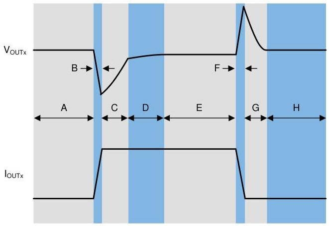
图 7-5. 负载瞬态波形

表 7-5. 负载瞬态波形说明

|  区域 | 说明 | 注释  |
| --- | --- | --- |
|  A | 1% | 1%  |
|  B | 输出电流斜坡 | 初始电压骤降是输出电容器电荷耗尽的结果。  |
|  C | LDO 对瞬态做出响应 | 从骤降中恢复是由于 LDO 增加了拉电流，并实现输出电压调节。  |
|  D | 达到热平衡 | 在高负载电流下，LDO 需要一些时间才能升温。在此期间，输出电压变化较小。  |
|  E | 1% | 1%  |
|  F | 输出电流斜坡 | LDO 提供大电流导致初始电压上升，并导致输出电容器电荷增加。  |
|  G | LDO 对瞬态做出响应 | 从上升中恢复是由于 LDO 降低了拉电流，同时负载使输出电容放电。  |
|  H | 1% | 1%  |

## 7.1.10 直流性能

### 7.1.10.1 输出电压精度 (Vout x)

本器件的输出电压精度包含由内部基准电压、负载调节、线路调节、处理差异及工作温度所引入的误差，具体规格请参阅电气特性表。输出电压精度表示输出电压的最小与最大误差，相对于标称输出电压，以百分比表示（对于极低输出电压，则以 mV 为单位）。

### 7.1.10.2 压降电压 (VDO)

一般而言，压降电压通常是指稳压所需的输入和输出电压之间的最小电压差 $(|V_{DO}| = |V_{INx}| - |V_{OUTx}|)$。当在给定负载电流下 $V_{INx}$ 降至低于设定的 $V_{DOx}$ 时，该器件将用作电阻开关，不再调节输出电压。由于器件以电阻开关运行，压差电压与输出电流呈正比关系。

### 7.1.11 反向电流

与大多数 LDO 一样，该器件可能会因反向电流过大而损坏。

反向电流是指电流非经由通道晶体管的正常导电通道，而是流经器件的基板。当此类电流达到一定幅度时，将导致电迁移与过度热能在器件中释放，从而降低器件的长期可靠性。

本节概述了会发生过度反向电流的条件，所有这些条件都可能超过 $V_{\text{OUTP}} &gt; V_{\text{INP}} + 0.3V$ 和 $V_{\text{OUTN}} &lt; V_{\text{INN}} - 0.3V$ 的绝对最大额定值：

- 如果器件具有较大的 $C_{\text{OUTx}}$ 且输入电源迅速崩溃，则负载电流极小或无负载电流
- 当输入电源未建立时，输出被偏置
- 输出偏置为高于输入电源

如果应用中需要过度反向电流，则必须使用外部保护来保护器件。图 7-6 展示了保护器件的一种方法。

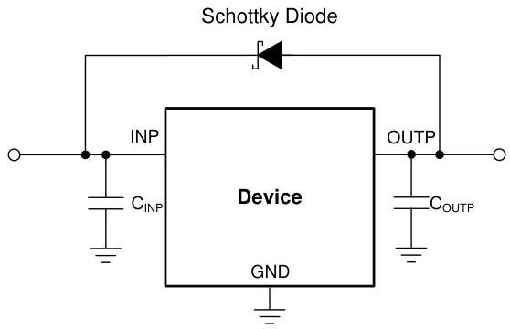
图 7-6. 在正极导轨使用肖特基二极管的反向电流保护示例电路

## 7.1.12 功率耗散 $(P_D)$

电路可靠性需要适当考虑器件功率耗散、印刷电路板 (PCB) 上的电路位置以及正确的热平面尺寸。稳压器周围的 PCB 区域必须尽量消除其他会导致热应力增加的发热器件。

对于一阶近似，稳压器中的功率耗散取决于输入到输出电压差和负载条件。方程式 9 用于近似计算 $P_D$：

$$
P_D = (V_{\text{INP}} - V_{\text{OUTP}}) \times I_{\text{OUTP}} + (|V_{\text{INN}} - V_{\text{OUTN}}|) \times |I_{\text{OUTN}}| \tag{9}
$$

精心选择系统电压轨可更大限度地减少功率耗散并提高系统效率。通过适当的选择，可以获得最小的输入到输出电压差。器件的低压降有助于在宽输出电压范围内实现出色效率。

器件的主要热传导路径是通过封装上的散热焊盘。因此，必须将散热焊盘焊接到器件下方的铜焊盘区域。此焊盘区域包含一组镀通孔，可将热量传导到任何内部平面区域或底部覆铜平面。

最大功耗决定了该器件允许的最高结温 $(T_J)$。根据方程式 10，功率耗散和结温通常与 PCB 和器件封装组合的结至环境热阻 $(\theta_{JA})$ 和环境空气温度 $(T_A)$ 有关。

$$
T_J = T_A + \theta_{JA} \times P_D \tag{10}
$$

遗憾的是，此热阻 $(\theta_{JA})$ 在很大程度上取决于特定 PCB 设计中内置的散热能力，因此会因铜总面积、铜重量和平面位置而异。电气特性表中记录的 $\theta_{JA}$ 由 JEDEC 标准 PCB 和铜扩散面积决定，仅用作封装热性能的相对测量。对于精心设计的热布局，$\theta_{JA}$ 实际上是 WSON 封装结至外壳（底部）热阻 $(\theta_{JCbot})$ 与 PCB 铜产生的热阻的总和。

## 7.1.12.1 估算结温

JEDEC 标准建议使用 psi (Ψ) 热指标来估算 LDO 在典型 PCB 板应用电路中的结温。严格来说，此类指标不是热阻参数，但提供了一种估算结温的相对实用方法。已确定这些 psi 指标与覆铜面积明显无关。关键热指标 (Ψ_JT 和 Ψ_JB) 的使用符合方程式 11 并在电气特性表中给出。

$$
\begin{array}{l}
\Psi_{\mathrm{JT}}: \mathrm{T}_{\mathrm{J}} = \mathrm{T}_{\mathrm{T}} + \Psi_{\mathrm{JT}} \times \mathrm{P}_{\mathrm{D}} \\
\Psi_{\mathrm{JB}}: \mathrm{T}_{\mathrm{J}} = \mathrm{T}_{\mathrm{B}} + \Psi_{\mathrm{JB}} \times \mathrm{P}_{\mathrm{D}} \tag{11}
\end{array}
$$

其中：

- $\mathrm{P}_{\mathrm{D}}$ 是耗散功率，如方程式 9 中所述
- $\mathrm{T}_{\mathrm{T}}$ 器件封装顶部中间位置的温度
- $\mathrm{T}_{\mathrm{B}}$ 是在距器件封装 $1\mathrm{mm}$ 且位于封装边缘中心位置测得的 PCB 表面温度

## 7.2 典型应用

### 7.2.1 设计 1：单端至差分隔离电源

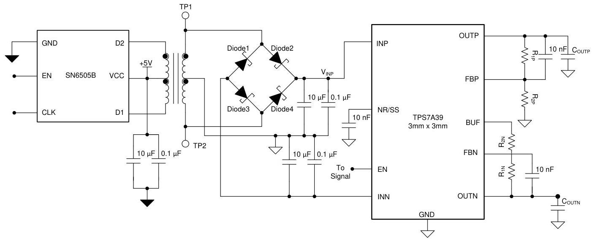
图 7-7. 单端至差分隔离电源示意图

### 7.2.1.1 设计要求

表 7-6. 设计要求

|  参数 | 设计要求 | 设计结果  |
| --- | --- | --- |
|  输入电源 | 必须在 5V 输入电压下工作 | 5V 输入电源电压  |
|  输出电源 | 必须具有 5V 和 -5V 输出电压 | ±5V 输出电压，精度为 ±2%  |
|  正输出电流 | 正输出能够提供 50mA 拉电流 | 50mA (拉电流)  |
|  负输出电流 | 负输出能够提供 50mA 灌电流 | 50mA (灌电流)  |
|  与 5V 电源隔离 | 必须与输入电源隔离 | 通过中心抽头变压器隔离  |
|  效率 | 在 100mA(1) 时效率必须 > 80% | 当 IOUTN = -50mA 且 IOUTP = 50mA 时效率为 85%  |

(1)  $|\mathrm{I_{OUTN}}| = \mathrm{I_{OUTP}} = 50\mathrm{mA}.$

## 7.2.1.2 详细设计过程

### 7.2.1.2.1 转换开关选择

此设计包含用于中心抽头变压器的推挽驱动器，该驱动器采用单端电源并将电源转换为隔离式分离轨设计。SN6505B 提供简单的小尺寸隔离式电源。SN6505B 的输入电压介于 2.25V 至 5V 之间，因此可用于各种输入电源。可以通过变压器匝数比来调整输出电压。根据变压器的选择，此设计可用于生成 ±3.3V 至 ±15V 的输出电压。在该设计中，SN6505B 与 Wurth Electronics® 的 750315371 中心抽头变压器配对。此变压器的匝数比为 1:1.1，隔离额定值为 2500V RMS（从未测试过总体系统隔离）。

### 7.2.1.2.2 带有中心抽头变压器的全桥整流器

为了形成隔离式电源，SN6505B 使用中心抽头变压器。由于输入信号的交流特性，需要使用全桥整流器和电容器在信号到达 LDO 之前调节信号。TI 建议使用快速开关和低正向电压二极管来提高效率，因为 SN6505 开关的速度较快；肖特基二极管可以很好地工作。图 7-9 显示了 SN6505 D1 和 D2 的开关节点，还显示了变压器连接到全桥整流器 TP1 和 TP2 的位置。图 7-9 显示了整流器二极管的开关波形。

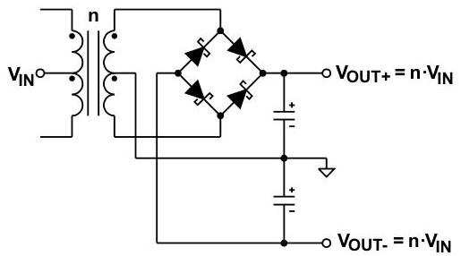
图 7-8. 具有中心抽头次级的桥式整流器可实现双极输出

### 7.2.1.2.3 整体解决方案效率

方程式 12 显示了如何通过输出功率除以输入功率来测量系统的效率。 $I_{\text{OUTP}} = |I_{\text{OUTN}}| = I_{\text{OUT}} / 2$ ，因为该系统具有两个输出轨来简化效率测量。当测量必要的参数时，通过使用方程式 12，可以如图 7-10 中所示绘制整体系统效率图。图 7-10 显示了本设计的整体系统效率，在最大输出电流 $100\,\mathrm{mA}$ （ $I_{\text{OUTP}} = 50\,\mathrm{mA}$ 、 $I_{\text{OUTN}} = -50\,\mathrm{mA}$ ）下，系统效率为 $85\%$ 。

$$
\eta = \frac{I_{\text{OUTP}} \times V_{\text{OUTP}} + I_{\text{OUTN}} \times V_{\text{OUTN}}}{I_{\text{IN}} \times V_{\text{IN}}}
\tag{12}
$$

### 7.2.1.2.4 反馈电阻器选型

方程式 13 和方程式 14 计算反馈电阻器的值。

$$
V_{\text{OUTP}} = V_{\text{FBP}} \times \left(1 + R_{1P} / R_{2P}\right)
\tag{13}
$$

$$
V_{\text{OUTN}} = V_{\text{BUF}} \times \left(- R_{1N} / R_{2N}\right)
\tag{14}
$$

在此设计中，推荐的 $10\,\mathrm{k}\Omega$ 电阻用于 $R_{2P}$ 和 $R_{2N}$。由于已选择 $R_{2P}$ 和 $R_{2N}$，因此可以通过将 $R_{2P}$ 和 $R_{2N}$ 代入方程式 15 和方程式 16 来计算 $R_{1P}$ 和 $R_{1N}$

$$
R_{1P} = \left[\left(V_{\text{OUTP}} / V_{\text{FBP}}\right) - 1\right] \times R_{2P} = \left[\left(5V / 1.188V\right) - 1\right] \times 10\,\mathrm{k}\Omega = 32.2\,\mathrm{k}\Omega
\tag{15}
$$

$$
R_{1N} = - V_{\text{OUTN}} \times R_{2N} / V_{\text{BUF}} = - (-5V) \times 10\,\mathrm{k}\Omega / 1.19V = 42\,\mathrm{k}\Omega
\tag{16}
$$

求解方程式 15 和方程式 16 后，将选择最接近的 $1\%$ 电阻器， $R_{1N} = 42.2\,\mathrm{k}\Omega$ ， $R_{1P} = 32.4\,\mathrm{k}\Omega$ 。

# 7.2.1.3 应用曲线

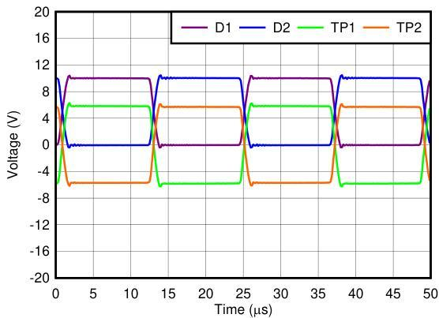
图 7-9. SN6505B 的开关节点

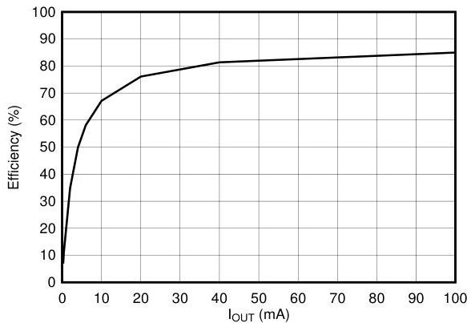
图 7-10. 效率与输出电流之间的关系

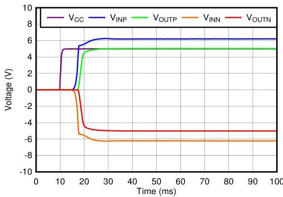
图 7-11. 系统启动

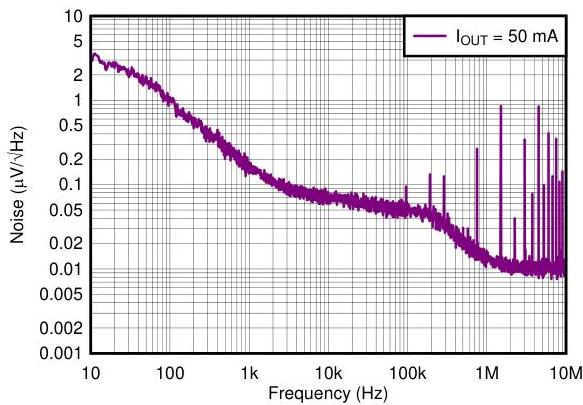
图 7-12. OUTP 噪声

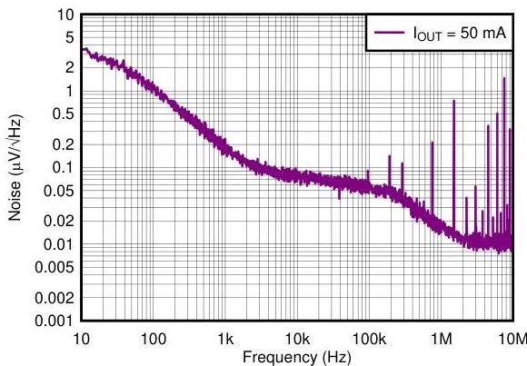
图 7-13. OUTN 噪声

## 7.2.2 设计 2：获得 SAR ADC 的全范围

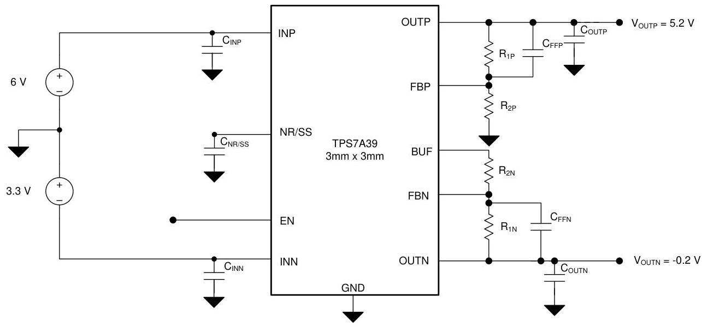

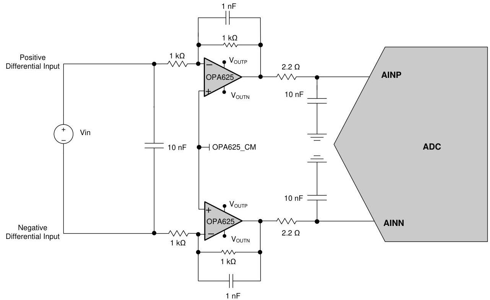

图 7-14. 为 ADC 的模拟前端创建电源轨

### 7.2.2.1 设计要求

模数转换器 (ADC) 的一个常见问题是，当输入信号接近 ADC 范围的边缘时，信号会开始失真。通常，这不是由 ADC 的限制造成，而是模拟前端 (AFE) 的结果。在 AFE 中，信号接近运算放大器的电源轨时，会开始失去线性并失真。这种失真是因为当轨到轨运算放大器开始在电源轨 100mV 范围内进入非线性工作区域时，信噪比 (SNR) 开始降低，ADC 的总谐波失真 (THD) 增大。为了防止运算放大器退出线性工作区域，设计必须使用可生成高于和低于 ADC 输入范围 200mV 电源轨的电源。

## 7.2.2.2 详细设计过程

在此设计中，ADS8900B 用作 ADC。此 ADC 具备差动输入，因此在 5V 基准电压条件下，可对 ±5V 范围内的信号进行编码。在许多应用中，单电源运算放大器使用 0V 至 5V 的电源轨供电，当输入全范围信号时，输入信号会发生失真。图 7-15 中展示了对使用单个 5V 电源轨偏置的放大器输入 $10V_{\mathrm{PP}}$（峰值间）正弦波时进行的 FFT 分析结果。在此测试中，计算得出，SNR 为 54.89dB，THD 为 -40.68dB。

有一个简单的解决方案可以改善 ADC 的 SNR 和 THD：使用 5.2V 电源轨和 -0.2V 电源轨对模拟前端中的放大器进行偏置。这组电源轨可使放大器在 ADC 所需的 0V 至 5V 范围内正常工作于线性区域。图 7-16 中展示了在使用 5.2V 和 -0.2V 电源轨条件下，输入 $10V_{\mathrm{PP}}$ 正弦波所得到的 FFT 分析图。在此测试中，计算得出，SNR 为 102.535dB，THD 为 -121.66dB。使用 -0.2V 和 5.2V 电源轨电压仍可支持在设计中使用常见的 5V（最大 5.5V）运算放大器。

## 7.2.2.3 详细设计说明

### 7.2.2.3.1 调节 -0.2V

TPS7A39 具有一项创新功能，可将负电源轨电压调节至零伏。该调节通过使用反相放大器并将正缓冲基准作为放大器的输入信号来实现。调节至 -0.2V 可消除使用放大器的全轨范围时出现的非线性和失真。

### 7.2.2.3.2 反馈电阻器选型

可使用方程式 17 和方程式 18 来计算反馈电阻器的值：

$$
V_{\text{OUTP}} = V_{\text{FBP}} \times \left(1 + R_{1P} / R_{2P}\right) \tag{17}
$$

$$
V_{\text{OUTN}} = V_{\text{BUF}} \times \left(- R_{1N} / R_{2N}\right) \tag{18}
$$

在此设计中，推荐的 $10\mathrm{k}\Omega$ 电阻用于 $R_{2P}$ 和 $R_{2N}$。由于已选择 $R_{2P}$ 和 $R_{2N}$，因此可以通过将 $R_{2P}$ 和 $R_{2N}$ 代入方程式 19 和方程式 20 来计算 $R_{1P}$ 和 $R_{1N}$。

$$
R_{1P} = \left[ \left(V_{\text{OUTP}} / V_{\text{FBP}}\right) - 1 \right] \times R_{2P} = \left[ (5.2V / 1.188V) - 1 \right] \times 10k\Omega = 33.8k\Omega \tag{19}
$$

$$
R_{1N} = - V_{\text{OUTN}} \times R_{2N} / V_{\text{BUF}} = - (-0.2V) \times 10k\Omega / 1.19V = 1.68k\Omega \tag{20}
$$

求解方程式 19 和方程式 20 后，将选择最接近的 $1\%$ 电阻器， $R_{1N} = 1.69k\Omega$ ， $R_{1P} = 34k\Omega$ 。

## 7.2.2.4 应用曲线

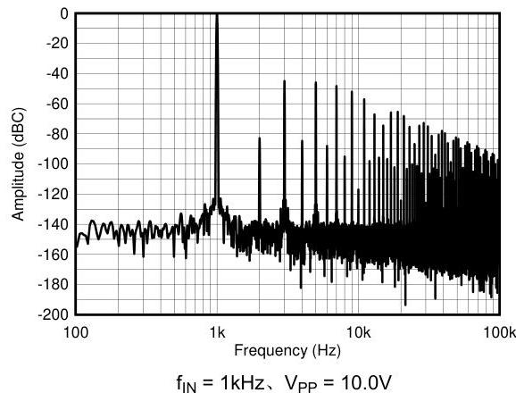
图 7-15. 使用 5V 和 0V 电源导轨的 FFT

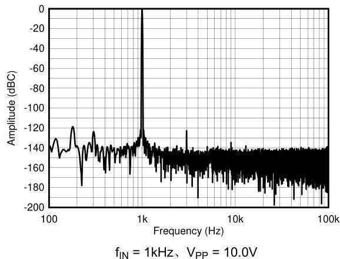
图 7-16. 使用 5.2V 和 -0.2V 电源导轨的 FFT

## 7.3 电源相关建议

LDO 的输入电源必须处于建议的工作条件范围内。输入电压必须为器件提供足够的余量，以实现稳定的输出。10μF 输入电容器尽可能靠近器件放置。如果输入电源存在噪声，则添加输入电容器有助于提高输出噪声性能。

## 7.4 布局

### 7.4.1 布局指南

好的布局是衡量电源设计的一个重要部分。多条信号路径中快速变化的电流或电压可能与杂散电感或寄生电容相互作用，从而产生噪声或使电源性能降低。为了帮助消除这些问题，请在 IN 引脚与接地之间加装旁路电容器。

将 GND 引脚直接连接到器件下方的散热焊盘。该散热焊盘必须通过器件正下方的多个过孔，连接至 PCB 内部的接地平面。

每个电容器都必须尽可能靠近器件放置，并与稳压器放置在 PCB 的同一侧。

请勿将任何电容器放置在 PCB 的另一侧安装稳压器的位置。强烈建议不要使用过孔和长布线，因为这些电路会对系统性能产生负面影响，甚至导致不稳定。

### 7.4.1.1 对于改进 PSRR 和噪声性能的电路板布局布线建议

为了改进诸如 PSRR、输出噪声和瞬态响应等交流性能，TI 建议将电路板设计成对于 $V_{\mathrm{IN}}$ 和 $V_{\mathrm{OUT}}$ 有独立的接地层，在这种设计中，每个接地平面仅在器件的 GND 引脚处以星形方式相连。此外，针对旁路电容器的接地连接必须直接接至器件的 GND 引脚。

### 7.4.1.2 封装

有关 TPS7A39 的焊盘占用空间建议，请参阅本文档末尾和 www.ti.com。

## 7.4.2 布局示例

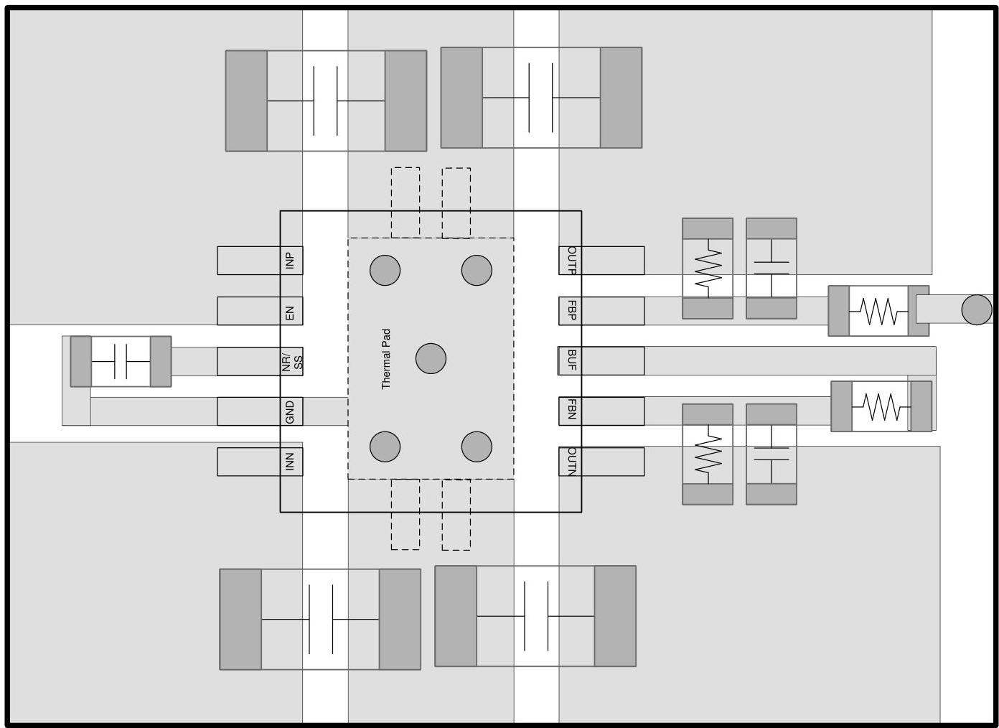

图 7-17. 可调节选项的布局示例

# 8 器件和文档支持

## 8.1 器件支持

### 8.1.1 开发支持

#### 8.1.1.1 评估模块

评估模块 (EVM) 可与 TPS7A39 配套使用，帮助评估初始电路性能。TPS7A39EVM-865 评估模块（以及相关的用户指南）可在德州仪器 (TI) 网站上的产品文件夹中获取，也可直接从 TI 网上商店购买。

#### 8.1.1.2 Spice 模型

分析模拟电路和系统的性能时，使用 SPICE 模型通常有利于对电路性能进行计算机仿真。您可以从产品文件夹中的工具与软件下获取 TPS7A39 的 SPICE 模型。

## 8.2 文档支持

### 8.2.1 相关文档

请参阅以下相关文档：

- 德州仪器 (TI), TPS3701 用于过压和欠压检测且具有内部基准电压的 36V 窗口比较器 数据表
- 德州仪器 (TI), SN6505 用于隔离式电源的低噪声 1A 变压器驱动器 数据表
- 德州仪器 (TI), 具有集成基准缓冲器和增强性能特性的 ADS890xB 20 位、高速 SAR ADC 数据表
- 德州仪器 (TI), 使用前馈电容器和低压降稳压器的优缺点 应用手册
- 德州仪器 (TI), 使用新的热指标 应用手册
- 德州仪器 (TI), TPS7A39EVM-865 评估模块 EVM 用户指南

## 8.3 接收文档更新通知

要接收文档更新通知，请导航至 ti.com 上的器件产品文件夹。点击通知 进行注册，即可每周接收产品信息更改摘要。有关更改的详细信息，请查看任何已修订文档中包含的修订历史记录。

## 8.4 支持资源

TI E2E™ 中文支持论坛是工程师的重要参考资料，可直接从专家处获得快速、经过验证的解答和设计帮助。搜索现有解答或提出自己的问题，获得所需的快速设计帮助。

链接的内容由各个贡献者“按原样”提供。这些内容并不构成 TI 技术规范，并且不一定反映 TI 的观点；请参阅 TI 的使用条款。

## 8.5 商标

TI E2E™ is a trademark of Texas Instruments.

Wurth Electronics® is a registered trademark of Würth Elektronik GmbH and Co.

所有商标均为其各自所有者的财产。

## 8.6 静电放电警告

静电放电 (ESD) 会损坏这个集成电路。德州仪器 (TI) 建议通过适当的预防措施处理所有集成电路。如果不遵守正确的处理和安装程序，可能会损坏集成电路。

ESD 的损坏小至导致微小的性能降级，大至整个器件故障。精密的集成电路可能更容易受到损坏，这是因为非常细微的参数更改都可能会导致器件与其发布的规格不相符。

## 8.7 术语表

TI 术语表 本术语表列出并解释了术语、首字母缩略词和定义。

# 9 修订历史记录

注：以前版本的页码可能与当前版本的页码不同

## Changes from Revision A (September 2017) to Revision B (June 2025)

Page

- 添加了指向应用部分的链接...1
- 更改了时序功能表的最后一行...26
- 更改了设计2反馈电阻器选型部分的方程式20：获得SAR ADC的全范围...41

## Changes from Revision * (July 2017) to Revision A (September 2017)

Page

- 发布为量产...1

## 10 机械、封装和可订购信息

以下页面包含机械、封装和可订购信息。这些信息是指定器件可用的最新数据。数据如有变更，恕不另行通知，且不会对此文档进行修订。有关此数据表的浏览器版本，请查阅左侧的导航栏。

PACKAGING INFORMATION

| Orderable part number | Status (1) | Material type (2) | Package | Pins | Package qty | Carrier | RoHS (3) | Lead finish/ Ball material (4) | MSL rating/ Peak reflow (5) | Op temp (°C) | Part marking (6) |
| --- | --- | --- | --- | --- | --- | --- | --- | --- | --- | --- | --- |
| TPS7A3901DSCR | Active | Production | WSON (DSC) | 10 | 3000 | LARGE T&R | Yes | NIPDAU | Level-2-260C-1 YEAR | -40 to 125 | A3901 |
| TPS7A3901DSCR.B | Active | Production | WSON (DSC) | 10 | 3000 | LARGE T&R | Yes | NIPDAU | Level-2-260C-1 YEAR | -40 to 125 | A3901 |
| TPS7A3901DSCT | Active | Production | WSON (DSC) | 10 | 250 | SMALL T&R | Yes | NIPDAU | Level-2-260C-1 YEAR | -40 to 125 | A3901 |
| TPS7A3901DSCT.B | Active | Production | WSON (DSC) | 10 | 250 | SMALL T&R | Yes | NIPDAU | Level-2-260C-1 YEAR | -40 to 125 | A3901 |
| TPS7A3901DSCTG4 | Active | Production | WSON (DSC) | 10 | 250 | SMALL T&R | Yes | NIPDAU | Level-2-260C-1 YEAR | -40 to 125 | A3901 |
| TPS7A3901DSCTG4.B | Active | Production | WSON (DSC) | 10 | 250 | SMALL T&R | Yes | NIPDAU | Level-2-260C-1 YEAR | -40 to 125 | A3901 |

(1) Status: For more details on status, see our product life cycle.

(2) Material type: When designated, preproduction parts are prototypes/experimental devices, and are not yet approved or released for full production. Testing and final process, including without limitation quality assurance, reliability performance testing, and/or process qualification, may not yet be complete, and this item is subject to further changes or possible discontinuation. If available for ordering, purchases will be subject to an additional waiver at checkout, and are intended for early internal evaluation purposes only. These items are sold without warranties of any kind.

(3) RoHS values: Yes, No, RoHS Exempt. See the TI RoHS Statement for additional information and value definition.

(4) Lead finish/Ball material: Parts may have multiple material finish options. Finish options are separated by a vertical ruled line. Lead finish/Ball material values may wrap to two lines if the finish value exceeds the maximum column width.

(5) MSL rating/Peak reflow: The moisture sensitivity level ratings and peak solder (reflow) temperatures. In the event that a part has multiple moisture sensitivity ratings, only the lowest level per JEDEC standards is shown. Refer to the shipping label for the actual reflow temperature that will be used to mount the part to the printed circuit board.

(6) Part marking: There may be an additional marking, which relates to the logo, the lot trace code information, or the environmental category of the part.

Multiple part markings will be inside parentheses. Only one part marking contained in parentheses and separated by a “~” will appear on a part. If a line is indented then it is a continuation of the previous line and the two combined represent the entire part marking for that device.

Important Information and Disclaimer: The information provided on this page represents TI's knowledge and belief as of the date that it is provided. TI bases its knowledge and belief on information provided by third parties, and makes no representation or warranty as to the accuracy of such information. Efforts are underway to better integrate information from third parties. TI has taken and continues to take reasonable steps to provide representative and accurate information but may not have conducted destructive testing or chemical analysis on incoming materials and chemicals. TI and TI suppliers consider certain information to be proprietary, and thus CAS numbers and other limited information may not be available for release.

In no event shall TI's liability arising out of such information exceed the total purchase price of the TI part(s) at issue in this document sold by TI to Customer on an annual basis.

# TAPE AND REEL INFORMATION

REEL DIMENSIONS

TAPE DIMENSIONS

|  A0 | Dimension designed to accommodate the component width  |
| --- | --- |
|  B0 | Dimension designed to accommodate the component length  |
|  K0 | Dimension designed to accommodate the component thickness  |
|  W | Overall width of the carrier tape  |
|  P1 | Pitch between successive cavity centers  |

QUADRANT ASSIGNMENTS FOR PIN 1 ORIENTATION IN TAPE

*All dimensions are nominal

|  Device | Package Type | Package Drawing | Pins | SPQ | Reel Diameter (mm) | Reel Width W1 (mm) | A0 (mm) | B0 (mm) | K0 (mm) | P1 (mm) | W (mm) | Pin1 Quadrant  |
| --- | --- | --- | --- | --- | --- | --- | --- | --- | --- | --- | --- | --- |
|  TPS7A3901DSCR | WSON | DSC | 10 | 3000 | 330.0 | 12.4 | 3.3 | 3.3 | 1.0 | 8.0 | 12.0 | Q1  |
|  TPS7A3901DSCT | WSON | DSC | 10 | 250 | 180.0 | 12.4 | 3.3 | 3.3 | 1.0 | 8.0 | 12.0 | Q1  |
|  TPS7A3901DSCTG4 | WSON | DSC | 10 | 250 | 180.0 | 12.4 | 3.3 | 3.3 | 1.0 | 8.0 | 12.0 | Q1  |

TAPE AND REEL BOX DIMENSIONS

*All dimensions are nominal

|  Device | Package Type | Package Drawing | Pins | SPQ | Length (mm) | Width (mm) | Height (mm)  |
| --- | --- | --- | --- | --- | --- | --- | --- |
|  TPS7A3901DSCR | WSON | DSC | 10 | 3000 | 367.0 | 367.0 | 38.0  |
|  TPS7A3901DSCT | WSON | DSC | 10 | 250 | 213.0 | 191.0 | 35.0  |
|  TPS7A3901DSCTG4 | WSON | DSC | 10 | 250 | 213.0 | 191.0 | 35.0  |

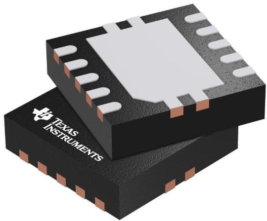

Images above are just a representation of the package family, actual package may vary. Refer to the product data sheet for package details.

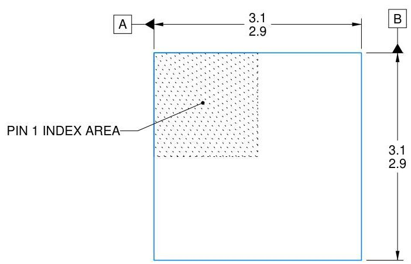

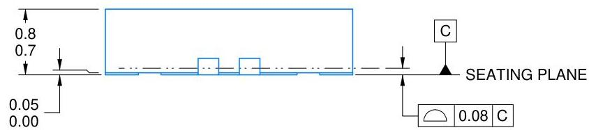

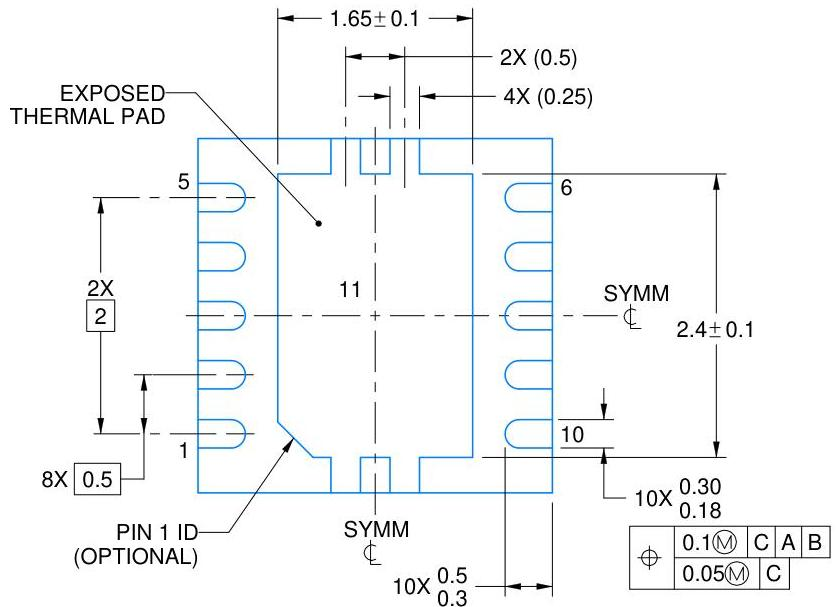

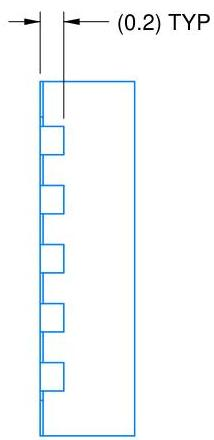

4221826/D 08/2018

# NOTES:

1. All linear dimensions are in millimeters. Any dimensions in parenthesis are for reference only. Dimensioning and tolerancing per ASME Y14.5M.
2. This drawing is subject to change without notice.
3. The package thermal pad must be soldered to the printed circuit board for optimal thermal and mechanical performance.

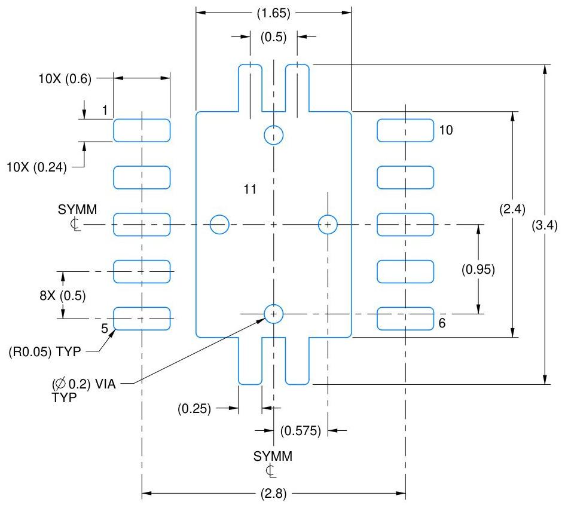
LAND PATTERN EXAMPLE
EXPOSED METAL SHOWN
SCALE:20X

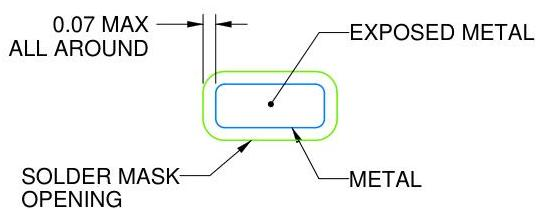
NON SOLDER MASK
DEFINED
(PREFERRED)

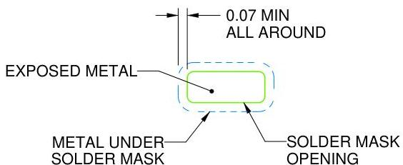
SOLDER MASK
DEFINED

# SOLDER MASK DETAILS

4221826/D 08/2018

NOTES: (continued)

4. This package is designed to be soldered to a thermal pad on the board. For more information, see Texas Instruments literature number SLUA271 (www.ti.com/lit/slua271).
5. Vias are optional depending on application, refer to device data sheet. If any vias are implemented, refer to their locations shown on this view. It is recommended that vias under paste be filled, plugged or tented.

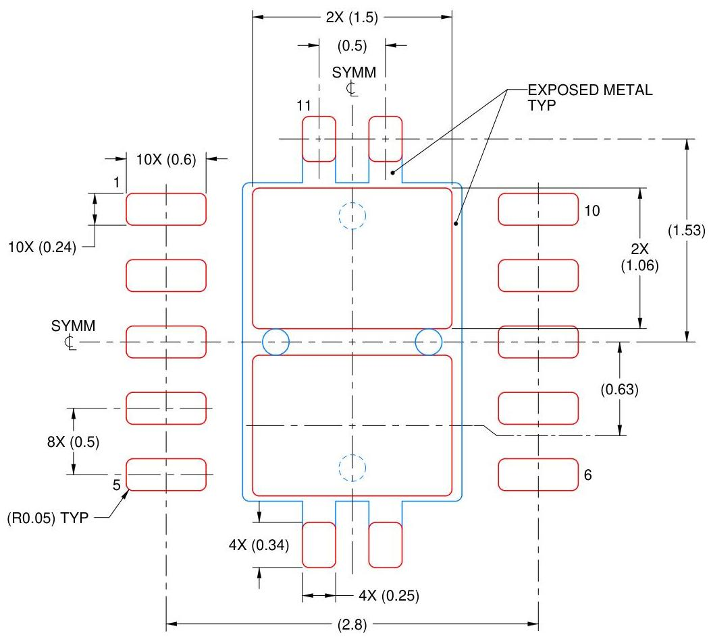
SOLDER PASTE EXAMPLE
BASED ON 0.125 mm THICK STENCIL
EXPOSED PAD 11:
80% PRINTED SOLDER COVERAGE BY AREA
SCALE:25X

4221826/D 08/2018

NOTES: (continued)

6. Laser cutting apertures with trapezoidal walls and rounded corners may offer better paste release. IPC-7525 may have alternate design recommendations.

# 重要通知和免责声明

TI“按原样”提供技术和可靠性数据（包括数据表）、设计资源（包括参考设计）、应用或其他设计建议、网络工具、安全信息和其他资源，不保证没有瑕疵且不做出任何明示或暗示的担保，包括但不限于对适销性、与某特定用途的适用性或不侵犯任何第三方知识产权的暗示担保。

这些资源可供使用TI产品进行设计的熟练开发人员使用。您将自行承担以下全部责任：(1) 针对您的应用选择合适的TI产品，(2) 设计、验证并测试您的应用，(3) 确保您的应用满足相应标准以及任何其他安全、安保法规或其他要求。

这些资源如有变更，恕不另行通知。TI授权您仅可将这些资源用于研发本资源所述的TI产品的相关应用。严禁以其他方式对这些资源进行复制或展示。您无权使用任何其他TI知识产权或任何第三方知识产权。对于因您对这些资源的使用而对TI及其代表造成的任何索赔、损害、成本、损失和债务，您将全额赔偿，TI对此概不负责。

TI提供的产品受TI销售条款)、TI通用质量指南或ti.com上其他适用条款或TI产品随附的其他适用条款的约束。TI提供这些资源并不会扩展或以其他方式更改TI针对TI产品发布的适用的担保或担保免责声明。除非德州仪器(TI)明确将某产品指定为定制产品或客户特定产品，否则其产品均为按确定价格收入目录的标准通用器件。

TI反对并拒绝您可能提出的任何其他或不同的条款。

版权所有 © 2025，德州仪器(TI)公司

最后更新日期：2025年10月