# TPS7A470x 36-V, 1-A, 4-μV RMS, RF LDO Voltage Regulator

## 1 Features

- Input Voltage Range: +3 V to +36 V
- Output Voltage Noise: 4 μV RMS (10 Hz, 100 kHz)
- Power-Supply Ripple Rejection:
- 82 dB (100 Hz)
- ≥ 55 dB (10 Hz, 10 MHz)
- Two Output Voltage Modes:
- ANY-OUT™ Version (User-Programmable Output via PCB Layout):
- No External Feedback Resistors or Feed-Forward Capacitors Required
- Output Voltage Range: +1.4 V to +20.5 V
- Adjustable Version (TPS7A4701 only):
- Output Voltage Range: +1.4 V to +34 V
- Output Current: 1 A
- Dropout Voltage: 307 mV at 1 A
- CMOS Logic Level-Compatible Enable Pin
- Built-In Fixed Current Limit and Thermal Shutdown
- Available in High-Performance Thermal Package: 5-mm × 5-mm QFN
- Operating Temperature Range: –40°C to 125°C

## 2 Applications

- Voltage-Controlled Oscillators (VCO)
- Frequency Synthesizers
- Test and Measurement
- Instrumentation, Medical, and Audio
- RX, TX, and PA Circuitry
- Supply Rails for Operational Amplifiers, DACs, ADCs, and Other High-Precision Analog Circuitry
- Post DC-DC Converter Regulation and Ripple Filtering
- Base Stations and Telecom Infrastructure
- +12-V and +24-V Industrial Buses

## 3 Description

The TPS7A47 is a family of positive voltage (+36 V), ultralow-noise (4 μV RMS) low-dropout linear regulators (LDO) capable of sourcing a 1-A load.

The TPS7A4700 output voltages are user-programmable (up to 20.5 V) using a printed circuit board (PCB) layout without the need of external resistors or feed-forward capacitors, thus reducing overall component count.

The TPS7A4701 output voltage can be configured with a user-programmable PCB layout (up to 20.5 V), or adjustable (up to 34 V) with external feedback resistors.

The TPS7A47 is designed with bipolar technology primarily for high-accuracy, high-precision instrumentation applications where clean voltage rails are critical to maximize system performance. This feature makes the device ideal for powering operational amplifiers, analog-to-digital converters (ADCs), digital-to-analog converters (DACs), and other high-performance analog circuitry in critical applications such as medical, radio frequency (RF), and test-and-measurement.

In addition, the TPS7A47 is ideal for post dc-dc converter regulation. By filtering out the output voltage ripple inherent to dc-dc switching conversions, maximum system performance is ensured in sensitive instrumentation, test-and-measurement, audio, and RF applications.

For applications where positive and negative low-noise rails are required, consider TI's TPS7A33 family of negative high-voltage, ultralow-noise linear regulators.

### Device Information(1)

|  PART NUMBER | PACKAGE | BODY SIZE (NOM)  |
| --- | --- | --- |
|  TPS7A470x | VQFN (20) | 5 mm × 5 mm  |

(1) For all available packages, see the orderable addendum at the end of the datasheet.

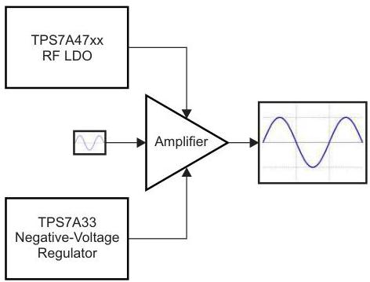

# Table of Contents

1 Features 1
2 Applications 1
3 Description 1
4 Revision History 2
5 Pin Configuration and Functions 4
6 Specifications 5
6.1 Absolute Maximum Ratings 5
6.2 Handling Ratings 6
6.3 Recommended Operating Conditions 6
6.4 Thermal Information 6
6.5 Electrical Characteristics 7
6.6 Typical Characteristics 8
7 Detailed Description 12
7.1 Overview 12
7.2 Functional Block Diagram 12
7.3 Feature Description 12
7.4 Device Functional Modes 13
7.5 Programming 13
8 Application and Implementation 16
8.1 Application Information 16
8.2 Typical Application 16
9 Power Supply Recommendations 20
9.1 Power Dissipation (PD) 20
10 Layout 21
10.1 Layout Guidelines 21
10.2 Layout Example 21
10.3 Thermal Protection 22
10.4 Estimating Junction Temperature 22
11 Device and Documentation Support 23
11.1 Documentation Support 23
11.2 Related Links 23
11.3 Trademarks 23
11.4 Electrostatic Discharge Caution 23
11.5 Glossary 23
12 Mechanical, Packaging, and Orderable Information 23

# 4 Revision History

NOTE: Page numbers for previous revisions may differ from page numbers in the current version.

# Changes from Revision E (January 2014) to Revision F

Page

- Added Handling Rating table, Feature Description section, Device Functional Modes, Application and Implementation section, Power Supply Recommendations section, Layout section, Device and Documentation Support section, and Mechanical, Packaging, and Orderable Information section 1
- Reworded ninth bullet in Features list 1
- Changed polarity of op amp shown on right side of the functional block diagram 12
- Reworded second paragraph in Soft-Start And Inrush Current section 13
- Revised Capacitor Recommendations section 16
- Changed paragraph 2 of Dropout Voltage $(V_{DO})$ section for clarity 17
- Revised paragraph 1 of Startup section 17
- Rewrote paragraph 1 of Power-Supply Rejection Ratio (PSRR) section to eliminate confusion 18
- Changed paragraph 1 of Power Supply Recommendations section 20
- Changed paragraph 1 and paragraph 4 of Power Dissipation $(P_D)$ section 20
- Revised paragraph 2 of Layout Guidelines section 21
- Changed second paragraph of Thermal Protection section 22

# Changes from Revision D (December 2013) to Revision E

Page

- Changed Output Voltage Noise value from $4.17\ \mu\mathrm{V}$ to $4\ \mu\mathrm{V}$ in three instances on front page 1
- Changed 2nd and 3rd paragraphs of Description section 1
- Added "Thermal Pad" to pin configuration drawing 4
- Changed EN pin description 4
- Changed SENSE/FB pin to be for TPS7A4701 only 5
- Added new row to Pin Descriptions table for SENSE pin (for TPS7A4700 only) 5
- Added new row to Pin Descriptions table for thermal pad 5
- Added $V_{REF}$ parameter 7

- Added TPS7A4701 device to test conditions for $V_{NR}$ parameter... 7
- Added Feedback Pin Current parameter to Electrical Characteristics... 7
- Deleted Dropout Voltage vs Output Current graph... 8
- Added EN pin to Functional Block Diagram... 12
- Added sentence to ANY-OUT Programmable Output Voltage section to clarify ANY-OUT is for both devices... 13
- Changed last two paragraphs of Adjustable Operation section... 14
- Added "TPS7A4701 Only" to Adjustable Operation section title... 14
- Deleted equation in Figure 23... 14
- Changed Equation 3... 14

# Changes from Revision C (July 2013) to Revision D

Page

- Changed data sheet status from production mix to production data... 1
- Changed TPS7A4701 ESD rating from &gt; 1 kV to 2.5 kV... 1
- Changed noise reduction pin voltage parameter to show both devices... 7
- Added text clarifying $V_{REF}$ typical value to last paragraph on page... 14

# Changes from Revision B (April 2013) to Revision C

Page

- Deleted TPS7A4702 preview device from data sheet... 1

# Changes from Revision A (July 2012) to Revision B

Page

- Changed TPS7A47 to TPS7A4700... 1
- Added TPS7A4701 and TPS7A4702 preview devices to data sheet... 1
- Changed front-page figure... 1
- Added FB to SENSE pin to Functional Block Diagram... 12
- Added new paragraph after Table 1... 14
- Added new Table 2... 14
- Added Adjustable Operation section... 14

# Changes from Original (June 2012) to Revision A

Page

- Moved to full production data (changes throughout document)... 1

# 5 Pin Configuration and Functions

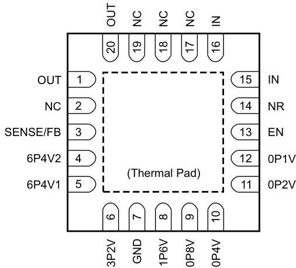
RGW Package
5-mm × 5-mm VQFN-20
(Top View)

Pin Functions

|  PIN |   | I/O | DESCRIPTION  |
| --- | --- | --- | --- |
|  NAME | NO.  |   |   |
|  0P1V | 12 | I | When connected to GND, this pin adds 0.1 V to the nominal output voltage of the regulator. Do not connect any voltage other than GND to this pin. If not used, leave this pin floating.  |
|  0P2V | 11 | I | When connected to GND, this pin adds 0.2 V to the nominal output voltage of the regulator. Do not connect any voltage other than GND to this pin. If not used, leave this pin floating.  |
|  0P4V | 10 | I | When connected to GND, this pin adds 0.4 V to the nominal output voltage of the regulator. Do not connect any voltage other than GND to this pin. If not used, leave this pin floating.  |
|  0P8V | 9 | I | When connected to GND, this pin adds 0.8 V to the nominal output voltage of the regulator. Do not connect any voltage other than GND to this pin. If not used, leave this pin floating.  |
|  1P6V | 8 | I | When connected to GND, this pin adds 1.6 V to the nominal output voltage of the regulator. Do not connect any voltage other than GND to this pin. If not used, leave this pin floating.  |
|  3P2V | 6 | I | When connected to GND, this pin adds 3.2 V to the nominal output voltage of the regulator. Do not connect any voltage other than GND to this pin. If not used, leave this pin floating.  |
|  6P4V1 | 5 | I | When connected to GND, this pin adds 6.4 V to the nominal output voltage of the regulator. Do not connect any voltage other than GND to this pin. If not used, leave this pin floating.  |
|  6P4V2 | 4 | I | When connected to GND, this pin adds 6.4 V to the nominal output voltage of the regulator. Do not connect any voltage other than GND to this pin. If not used, leave this pin floating.  |
|  EN | 13 | I | Enable pin. The device is enabled when the voltage on this pin exceeds the maximum enable voltage, V_{EN(HI)}. If enable is not required, tie EN to IN.  |
|  GND | 7 | — | Ground  |
|  IN | 15, 16 | I | Input supply. A capacitor greater than or equal to 1 μF must be tied from this pin to ground to assure stability. A 10-μF capacitor is recommended to be connected from IN to GND (as close to the device as possible) to reduce circuit sensitivity to printed circuit board (PCB) layout, especially when long input traces or high source impedances are encountered.  |
|  NC | 2, 17-19 | — | This pin can be left open or tied to any voltage between GND and IN.  |
|  NR | 14 | — | Noise reduction pin. When a capacitor is connected from this pin to GND, RMS noise can be reduced to very low levels. A capacitor greater than or equal to 10 nF must be tied from this pin to ground to assure stability. A 1-μF capacitor is recommended to be connected from NR to GND (as close to the device as possible) to maximize ac performance and minimize noise.  |

Pin Functions (continued)

|  PIN |   | I/O | DESCRIPTION  |
| --- | --- | --- | --- |
|  NAME | NO.  |   |   |
|  OUT | 1, 20 | O | Regulator output. A capacitor greater than or equal to 10 μF must be tied from this pin to ground to assure stability. A 47-μF ceramic output capacitor is highly recommended to be connected from OUT to GND (as close to the device as possible) to maximize ac performance.  |
|  SENSE/FB | 3 | I | Control-loop error amplifier input (TPS7A4701 only).
This is the SENSE pin if the device output voltage is programmed using ANY-OUT (no external feedback resistors). This pin must be connected to OUT. Connect this pin to the point of load to maximize accuracy.
This is the FB pin if the device output voltage is set using external resistors. See the *Adjustable Operation* section for more details.  |
|  SENSE | 3 | I | Control-loop error amplifier input (TPS7A4700 only).
This is the SENSE pin of the device and must be connected to OUT. Connect this pin to the point of load to maximize accuracy.  |
|  Thermal Pad |   | — | Connect the thermal pad to a large-area ground plane. The thermal pad is internally connected to GND.  |

# 6 Specifications

## 6.1 Absolute Maximum Ratings

Over junction temperature range, unless otherwise noted.(1)

|   |   | MIN | MAX | UNIT  |
| --- | --- | --- | --- | --- |
|  Voltage(2) | IN pin to GND pin | -0.4 | +36 | V  |
|   |  EN pin to GND pin | -0.4 | +36 | V  |
|   |  EN pin to IN pin | -36 | +0.4 | V  |
|   |  OUT pin to GND pin | -0.4 | +36 | V  |
|   |  NR pin to GND pin | -0.4 | +36 | V  |
|   |  SENSE/FB pin to GND pin | -0.4 | +36 | V  |
|   |  0P1V pin to GND pin | -0.4 | +36 | V  |
|   |  0P2V pin to GND pin | -0.4 | +36 | V  |
|   |  0P4V pin to GND pin | -0.4 | +36 | V  |
|   |  0P8V pin to GND pin | -0.4 | +36 | V  |
|   |  1P6V pin to GND pin | -0.4 | +36 | V  |
|   |  3P2V pin to GND pin | -0.4 | +36 | V  |
|   |  6P4V1 pin to GND pin | -0.4 | +36 | V  |
|   |  6P4V2 pin to GND pin | -0.4 | +36 | V  |
|  Current | Peak output | Internally limited  |   |   |
|  Temperature | Operating virtual junction, T_{J} | -40 | 125 | °C  |

(1) Stresses beyond those listed under Absolute Maximum Ratings may cause permanent damage to the device. These are stress ratings only, which do not imply functional operation of the device at these or any other conditions beyond those indicated under Recommended Operating Conditions. Exposure to absolute-maximum-rated conditions for extended periods may affect device reliability..
(2) All voltages are with respect to network ground terminal.

6.2 Handling Ratings

|   |   |   |   | MIN | MAX | UNIT  |
| --- | --- | --- | --- | --- | --- | --- |
|  Tstg | Storage temperature range |   |   | -65 | 150 | °C  |
|  V(ESD) | Electrostatic discharge | TPS7A4700 | Human body model (HBM), per ANSI/ESDA/JEDEC JS-001, all pins(1) | -1000 | 1000 | V  |
|   |   |   |  Charged device model (CDM), per JEDEC specification JESD22-C101, all pins(2) | -500 | 500  |   |
|   |   |  TPS7A4701 | Human body model (HBM), per ANSI/ESDA/JEDEC JS-001, all pins(1) | -2500 | 2500 | V  |
|   |   |   |  Charged device model (CDM), per JEDEC specification JESD22-C101, all pins(2) | -500 | 500  |   |

(1) JEDEC document JEP155 states that 500-V HBM allows safe manufacturing with a standard ESD control process.
(2) JEDEC document JEP157 states that 250-V CDM allows safe manufacturing with a standard ESD control process.

6.3 Recommended Operating Conditions

over junction temperature range (unless otherwise noted)

|   | MIN | NOM | MAX | UNIT  |
| --- | --- | --- | --- | --- |
|  V_{I} | 3.0 |   | 35.0 | V  |
|  V_{O} | 1.4 |   | 34.0 | V  |
|  V_{EN} | 0 |   | V_{IN} | V  |
|  I_{D} | 0 |   | 1.0 | A  |

6.4 Thermal Information

|  THERMAL METRIC(1) | TPS7A47xx | UNIT  |   |
| --- | --- | --- | --- |
|   |   |   |  RGW  |
|   |   |   |  20 PINS  |
|  R_{BJA} | Junction-to-ambient thermal resistance | 32.5 | °C/W  |
|  R_{BJC(top)} | Junction-to-case (top) thermal resistance | 27  |   |
|  R_{BJB} | Junction-to-board thermal resistance | 11.9  |   |
|  ψ_{JT} | Junction-to-top characterization parameter | 0.3  |   |
|  ψ_{JB} | Junction-to-board characterization parameter | 11.9  |   |
|  R_{BJC(bot)} | Junction-to-case (bottom) thermal resistance | 1.7  |   |

(1) For more information about traditional and new thermal metrics, see the IC Package Thermal Metrics application report, SPRA953.

# 6.5 Electrical Characteristics

At $-40^{\circ}\mathrm{C} \leq T_{\mathrm{J}} \leq 125^{\circ}\mathrm{C}$; $V_{\mathrm{I}} = V_{\mathrm{O(nom)}} + 1.0\mathrm{~V}$ or $V_{\mathrm{I}} = 3.0\mathrm{~V}$ (whichever is greater); $V_{\mathrm{EN}} = V_{\mathrm{I}}$; $I_{\mathrm{O}} = 0\mathrm{~mA}$; $C_{\mathrm{IN}} = 10~\mu\mathrm{F}$; $C_{\mathrm{OUT}} = 10~\mu\mathrm{F}$; $C_{\mathrm{NR}} = 10~\mathrm{nF}$; SENSE/FB tied to OUT; and 0P1V, 0P2V, 0P4V, 0P8V, 1P6V, 3P2V, 6P4V1, 6P4V2 pins OPEN, unless otherwise noted.

|  PARAMETER |   | TEST CONDITIONS |   | MIN | TYP | MAX | UNIT  |
| --- | --- | --- | --- | --- | --- | --- | --- |
|  VI | Input voltage range |  |   | 3 |  | 35 | V  |
|  VUVLO | Under-voltage lockout threshold | VI rising |   | 2.67 |   |   | V  |
|   |   |  VI falling |   | 2.5 |   |   | V  |
|  V(REF) | Reference voltage | V(REF) = V(FB), TPS7A4701 only |   | 1.4 |   |   | V  |
|  VUVLO(HYS) | Under-voltage lockout hysteresis |  |   | 177 |   |   | mV  |
|  VNR | Noise reduction pin voltage | TPS7A4700, TPS7A4701 using ANY-OUT option |   | VOUT |   |   | V  |
|   |   |  TPS7A4701 in adjustable mode only |   | 1.4 |   |   | V  |
|  VO | Output voltage range | VI ≥ VO(nom) + 1.0 V or 3 V (whichever is greater), COUT = 20 μF | TPS7A4700, TPS7A4701 using ANY-OUT option | 1.4 |  | 20.5 | V  |
|   |   |   |  TPS7A4701 using adjustable option | 1.4 |  | 34 | V  |
|   |  Nominal accuracy | TJ = 25°C, COUT = 20 μF |   | -1.0 |  | 1.0 | %VO  |
|   |  Overall accuracy | VO(nom) + 1.0 V ≤ VI ≤ 35 V, 0 mA ≤ IO ≤ 1 A, COUT = 20 μF |   | -2.5 |  | 2.5 | %VO  |
|  ΔVO(ΔVI) | Line regulation | VO(nom) + 1.0 V ≤ VI ≤ 35 V |   | 0.092 |   |   | %VO  |
|  ΔVO(ΔIO) | Load regulation | 0 mA ≤ IO ≤ 1 A |   | 0.3 |   |   | %VO  |
|  V(DO) | Dropout voltage | VI = 95% VO(nom), IO = 0.5 A |   | 216 |   |   | mV  |
|   |   |  VI = 95% VO(nom), IO = 1 A |   | 307 |  | 450 | mV  |
|  I(CL) | Current limit | VO = 90% VO(nom) |   | 1 | 1.26 |  | A  |
|  I(GND) | Ground pin current | IO = 0 mA |   | 0.58 |  | 1.0 | mA  |
|   |   |  IO = 1 A |   | 6.1 |   |   | mA  |
|  I(EN) | Enable pin current | VEN = VI |   | 0.78 |  | 2 | μA  |
|   |   |  VI = VEN = 35 V |   | 0.81 |  | 2 | μA  |
|  I(SHDN) | Shutdown supply current | VEN = 0.4 V |   | 2.55 |  | 8 | μA  |
|   |   |  VEN = 0.4 V, VI = 35 V |   | 3.04 |  | 60 | μA  |
|  V+EN(HI) | Enable high-level voltage |  |   | 2.0 |  | VI | V  |
|  V+EN(LO) | Enable low-level voltage |  |   | 0.0 |  | 0.4 | V  |
|  I(FB) | Feedback pin current |  |   | 350 |   |   | nA  |
|  PSRR | Power-supply rejection ratio | VI = 16 V, VO(nom) = 15 V, COUT = 50 μF, IO = 500 mA, CNR = 1 μF, f = 1 kHz |   | 78 |   |   | dB  |
|  Vn | Output noise voltage | VI = 3 V, VO(nom) = 1.4 V, COUT = 50 μF, CNR = 1 μF, BW = 10 Hz to 100 kHz |   | 4.17 |   |   | μVRMS  |
|   |   |  VIN = 6 V, VO(nom) = 5 V, COUT = 50 μF, CNR = 1 μF, BW = 10 Hz to 100 kHz |   | 4.67 |   |   | μVRMS  |
|  Ted | Thermal shutdown temperature | Shutdown, temperature increasing |   | 170 |   |   | °C  |
|   |   |  Reset, temperature decreasing |   | 150 |   |   | °C  |
|  TJ | Operating junction temperature |  |   | -40 |  | 125 | °C  |

# 6.6 Typical Characteristics

At $-40^{\circ}\mathrm{C} \leq T_{\mathrm{J}} \leq 125^{\circ}\mathrm{C}$; $V_{\mathrm{I}} = V_{\mathrm{O(nom)}} + 1.0\mathrm{~V}$ or $V_{\mathrm{I}} = 3.0\mathrm{~V}$ (whichever is greater); $V_{\mathrm{EN}} = V_{\mathrm{I}}$; $I_{\mathrm{O}} = 0\mathrm{~mA}$; $C_{\mathrm{IN}} = 10~\mu\mathrm{F}$; $C_{\mathrm{OUT}} = 10~\mu\mathrm{F}$; $C_{\mathrm{NR}} = 1~\mu\mathrm{F}$; SENSE/FB tied to OUT; and 0P1V, 0P2V, 0P4V, 0P8V, 1P6V, 3P2V, 6P4V1, 6P4V2 pins OPEN, unless otherwise noted.

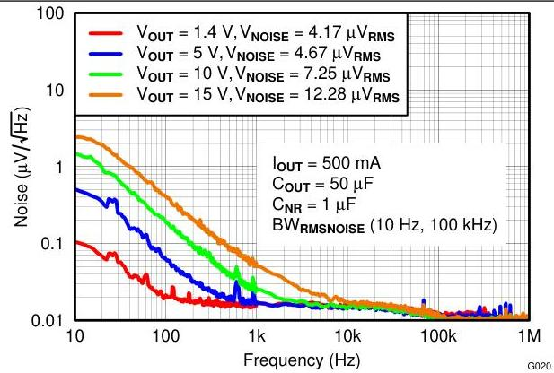
Figure 1. Noise vs Output Voltage

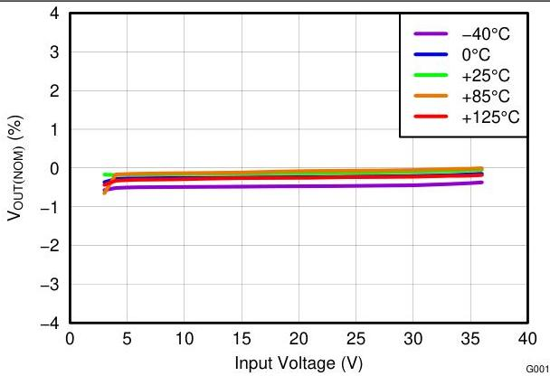
Figure 2. Line Regulation

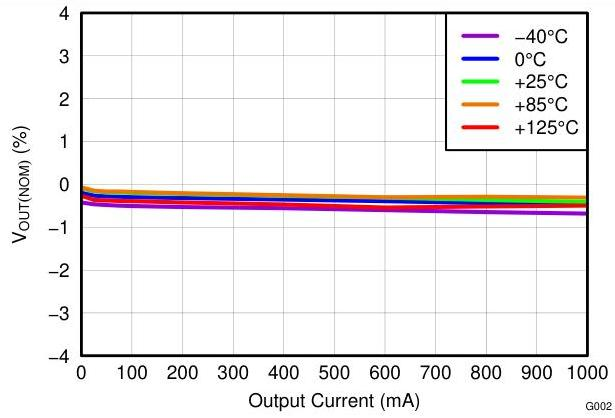
Figure 3. Load Regulation

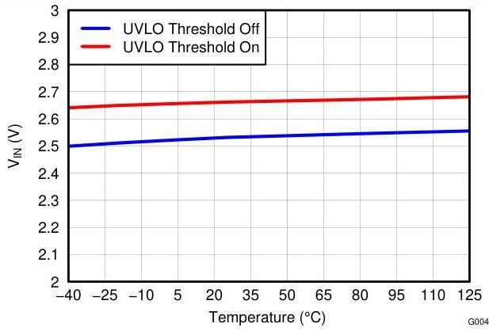
Figure 4. UVLO Threshold vs Temperature

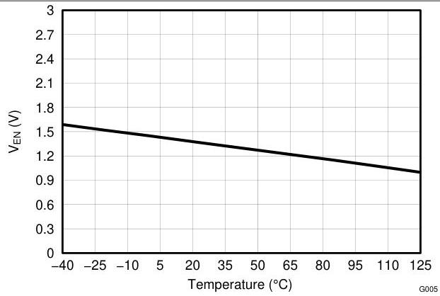
Figure 5. Enable Voltage Threshold vs Temperature

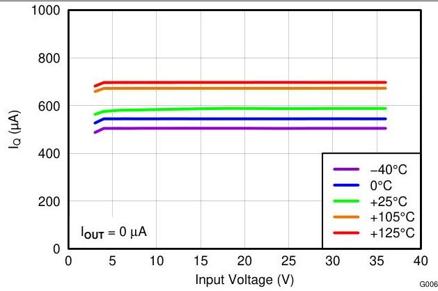
Figure 6. Quiescent Current vs Input Voltage

# Typical Characteristics (continued)

At $-40^{\circ}\mathrm{C} \leq T_{\mathrm{J}} \leq 125^{\circ}\mathrm{C}$; $V_{\mathrm{I}} = V_{\mathrm{O(nom)}} + 1.0\mathrm{~V}$ or $V_{\mathrm{I}} = 3.0\mathrm{~V}$ (whichever is greater); $V_{\mathrm{EN}} = V_{\mathrm{I}}$; $I_{\mathrm{O}} = 0\mathrm{~mA}$; $C_{\mathrm{IN}} = 10~\mu\mathrm{F}$; $C_{\mathrm{OUT}} = 10~\mu\mathrm{F}$; $C_{\mathrm{NR}} = 1~\mu\mathrm{F}$; SENSE/FB tied to OUT; and 0P1V, 0P2V, 0P4V, 0P8V, 1P6V, 3P2V, 6P4V1, 6P4V2 pins OPEN, unless otherwise noted.

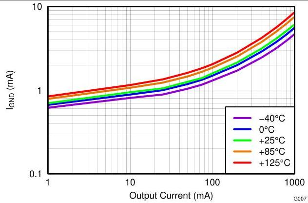
Figure 7. Ground Current vs Output Current

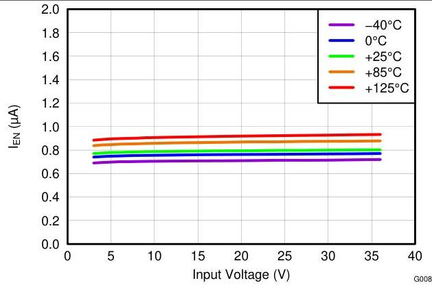
Figure 8. Enable Current vs Input Voltage

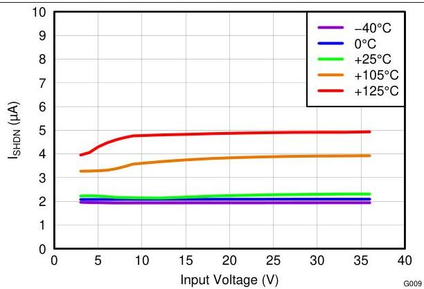
Figure 9. Shutdown Current vs Input Voltage

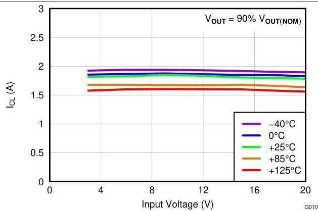
Figure 10. Current Limit vs Input Voltage

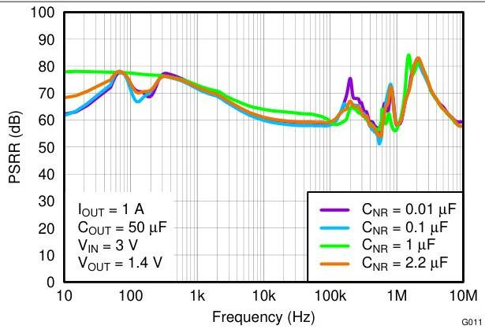
Figure 11. Power-Supply Rejection Ratio vs $C_{\mathrm{NR}}$

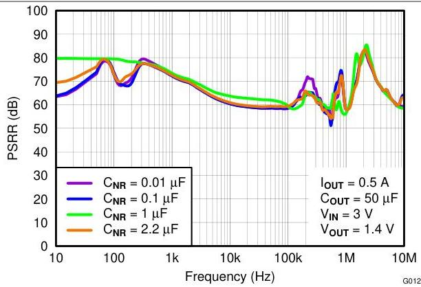
Figure 12. Power-Supply Rejection Ratio vs $C_{\mathrm{NR}}$

# Typical Characteristics (continued)

At $-40^{\circ}\mathrm{C} \leq T_{\mathrm{J}} \leq 125^{\circ}\mathrm{C}$; $V_{\mathrm{I}} = V_{\mathrm{O(nom)}} + 1.0\mathrm{~V}$ or $V_{\mathrm{I}} = 3.0\mathrm{~V}$ (whichever is greater); $V_{\mathrm{EN}} = V_{\mathrm{I}}$; $I_{\mathrm{O}} = 0\mathrm{~mA}$; $C_{\mathrm{IN}} = 10\mu \mathrm{F}$; $C_{\mathrm{OUT}} = 10\mu \mathrm{F}$; $C_{\mathrm{NR}} = 1\mu \mathrm{F}$; SENSE/FB tied to OUT; and 0P1V, 0P2V, 0P4V, 0P8V, 1P6V, 3P2V, 6P4V1, 6P4V2 pins OPEN, unless otherwise noted.

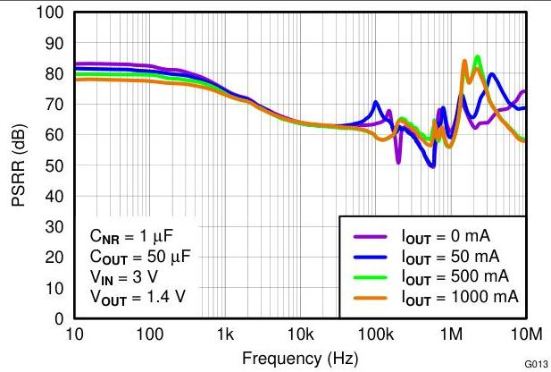
Figure 13. Power-Supply Rejection Ratio vs $I_{O}$

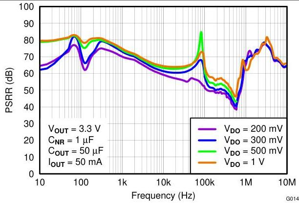
Figure 14. Power-Supply Rejection Ratio vs Dropout

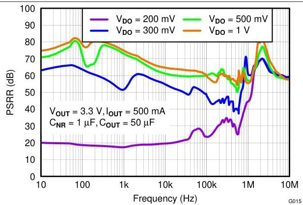
Figure 15. Power-Supply Rejection Ratio vs Dropout

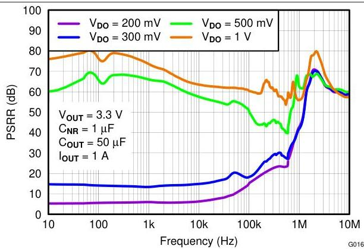
Figure 16. Power-Supply Rejection Ratio vs Dropout

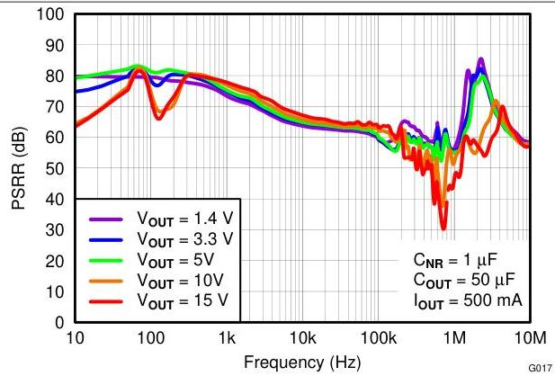
Figure 17. Power-Supply Rejection Ratio vs Output Voltage

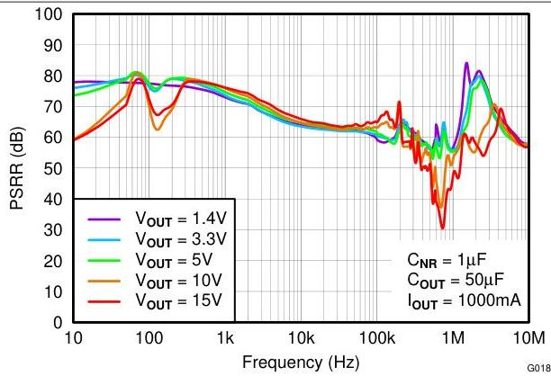
Figure 18. Power-Supply Rejection Ratio vs Output Voltage

# Typical Characteristics (continued)

At $-40^{\circ}\mathrm{C} \leq T_{\mathrm{J}} \leq 125^{\circ}\mathrm{C}$; $V_{\mathrm{I}} = V_{\mathrm{O(nom)}} + 1.0\mathrm{~V}$ or $V_{\mathrm{I}} = 3.0\mathrm{~V}$ (whichever is greater); $V_{\mathrm{EN}} = V_{\mathrm{I}}$; $I_{\mathrm{O}} = 0\mathrm{~mA}$; $C_{\mathrm{IN}} = 10~\mu\mathrm{F}$; $C_{\mathrm{OUT}} = 10~\mu\mathrm{F}$; $C_{\mathrm{NR}} = 1~\mu\mathrm{F}$; SENSE/FB tied to OUT; and 0P1V, 0P2V, 0P4V, 0P8V, 1P6V, 3P2V, 6P4V1, 6P4V2 pins OPEN, unless otherwise noted.

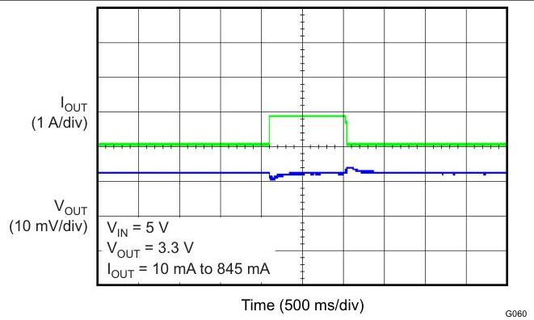
Figure 19. Load Transient

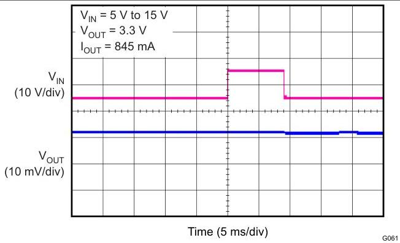
Figure 20. Line Transient

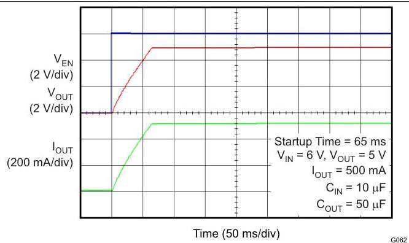
Figure 21. Startup

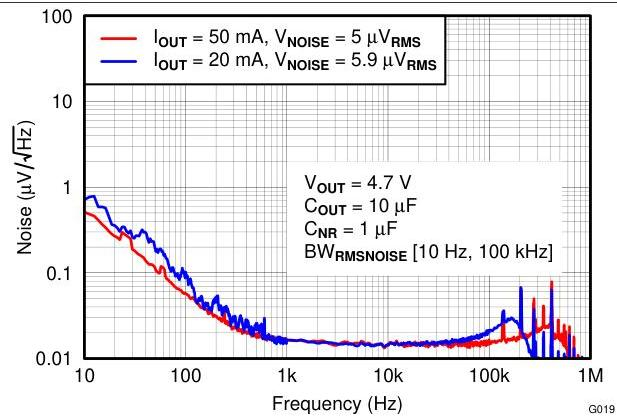
Figure 22. Noise vs Output Current

# 7 Detailed Description

## 7.1 Overview

The TPS7A4700 and TPS7A4701 (TPS7A470x) are positive voltage (+36 V), ultralow-noise (4 μV_RMS) LDOs capable of sourcing a 1-A load. The TPS7A470x is designed with bipolar technology primarily for high-accuracy, high-precision instrumentation applications where clean voltage rails are critical to maximize system performance. This feature makes the device ideal for powering operational amplifiers, analog-to-digital converters (ADCs), digital-to-analog converters (DACs), and other high-performance analog circuitry.

## 7.2 Functional Block Diagram

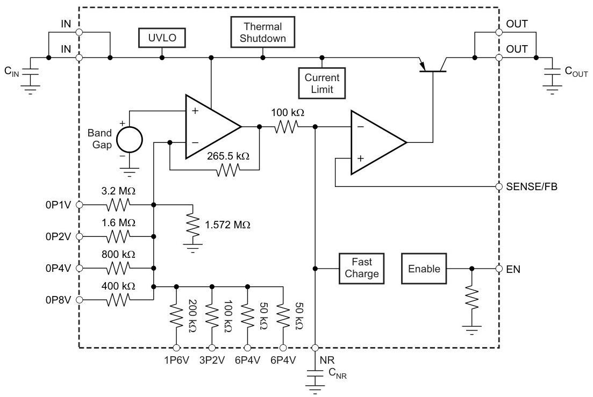

## 7.3 Feature Description

### 7.3.1 Internal Current Limit (ICL)

The internal current limit circuit is used to protect the LDO against high-load current faults or shorting events. The LDO is not designed to operate at a steady-state current limit. During a current-limit event, the LDO sources constant current. Therefore, the output voltage falls while load impedance decreases. Note also that when a current limit occurs while the resulting output voltage is low, excessive power is dissipated across the LDO, which results in a thermal shutdown of the output.

### 7.3.2 Enable (EN) And Under-Voltage Lockout (UVLO)

The TPS7A470x only turns on when both EN and UVLO are above the respective voltage thresholds. The UVLO circuit monitors input voltage (V_I) to prevent device turn-on before V_I rises above the lockout voltage. The UVLO circuit also causes a shutdown when V_I falls below lockout. The EN signal allows independent logic-level turn-on and shutdown of the LDO when the input voltage is present. EN can be connected directly to V_I if independent turn-on is not needed.

# Feature Description (continued)

## 7.3.3 Soft-Start And Inrush Current

Soft-start refers to the ramp-up characteristic of the output voltage during LDO turn-on after EN and UVLO have achieved threshold voltage. The noise reduction capacitor serves a dual purpose of both governing output noise reduction and programming the soft-start ramp during turn-on.

Inrush current is defined as the current through the LDO from IN to OUT during the time of the turn-on ramp up. Inrush current then consists primarily of the sum of load and charge current to the output capacitor. Inrush current can be estimated by Equation 1:

$$
I _ {\text {O U T} (t)} = \left(\frac {C _ {\text {O U T}} \times d V _ {\text {O U T}} (t)}{d t}\right) + \left(\frac {V _ {\text {O U T}} (t)}{R _ {\text {L O A D}}}\right)
$$

where:

- $V_{\text{OUT}}(t)$ is the instantaneous output voltage of the turn-on ramp,
- $dV_{\text{OUT}}(t)/dt$ is the slope of the $V_O$ ramp, and
- $R_{\text{LOAD}}$ is the resistive load impedance (1)

## 7.4 Device Functional Modes

The TPS7A470x has the following functional modes:

1. Enabled: When EN goes above $V_{+EN(HI)}$, the device is enabled.
2. Disabled: When EN goes below $V_{+EN(LO)}$, the device is disabled. During this time, OUT is high impedance, and the current into IN does not exceed $I_{(SHDN)}$.

## 7.5 Programming

### 7.5.1 ANY-OUT Programmable Output Voltage

Both devices can be used in ANY-OUT mode. For ANY-OUT operation, the TPS7A4700 and TPS7A4701 do not use external resistors to set the output voltage, but use device pins 4, 5, 6, 8, 9, 10, 11, and 12 to program the regulated output voltage. Each pin is either connected to ground (active) or is left open (floating). The ANY-OUT programming is set by Equation 2 as the sum of the internal reference voltage ($V_{(\text{REF})} = 1.4 \, \text{V}$) plus the accumulated sum of the respective voltages assigned to each active pin; that is, $100 \, \text{mV}$ (pin 12), $200 \, \text{mV}$ (pin 11), $400 \, \text{mV}$ (pin 10), $800 \, \text{mV}$ (pin 9), $1.6 \, \text{V}$ (pin 8), $3.2 \, \text{V}$ (pin 6), $6.4 \, \text{V}$ (pin 5), or $6.4 \, \text{V}$ (pin 4). Table 1 summarizes these voltage values associated with each active pin setting for reference. By leaving all program pins open, or floating, the output is thereby programmed to the minimum possible output voltage equal to $V_{(\text{REF})}$.

$$
V _ {\text {O U T}} = V _ {\text {R E F}} + (\Sigma \text{ANY-OUT Pins to Ground}) \tag {2}
$$

Table 1. ANY-OUT Programmable Output Voltage

|  ANY-OUT PROGRAM PINS (Active Low) | ADDITIVE OUTPUT VOLTAGE LEVEL  |
| --- | --- |
|  Pin 4 (6P4V2) | 6.4 V  |
|  Pin 5 (6P4V1) | 6.4 V  |
|  Pin 6 (3P2) | 3.2 V  |
|  Pin 8 (1P6) | 1.6 V  |
|  Pin 9 (0P8) | 800 mV  |
|  Pin 10 (0P4) | 400 mV  |
|  Pin 11 (0P2) | 200 mV  |
|  Pin 12 (0P1) | 100 mV  |

Table 2 shows a list of the most common output voltages and the corresponding pin settings. The voltage setting pins have a binary weight; therefore, the output voltage can be programmed to any value from 1.4 V to 20.5 V in 100-mV steps.

Table 2. Common Output Voltages and Corresponding Pin Settings

|  V_{O} (V) | PIN NAMES AND VOLTAGE PER PIN  |   |   |   |   |   |   |   |
| --- | --- | --- | --- | --- | --- | --- | --- | --- |
|   |  0P1V
100 mV | 0P2V
200 mV | 0P4V
400 mV | 0P8V
800 mV | 1P6V
1.6 V | 3P2V
3.2 V | 6P4V1
6.4 V | 6P4V2
6.4 V  |
|  1.4 | Open | Open | Open | Open | Open | Open | Open | Open  |
|  1.5 | GND | Open | Open | Open | Open | Open | Open | Open  |
|  1.8 | Open | Open | GND | Open | Open | Open | Open | Open  |
|  2.5 | GND | GND | Open | GND | Open | Open | Open | Open  |
|  3 | Open | Open | Open | Open | GND | Open | Open | Open  |
|  3.3 | GND | GND | Open | Open | GND | Open | Open | Open  |
|  4.5 | GND | GND | GND | GND | GND | Open | Open | Open  |
|  5 | Open | Open | GND | Open | Open | GND | Open | Open  |
|  10 | Open | GND | GND | Open | GND | Open | GND | Open  |
|  12 | Open | GND | Open | GND | Open | GND | GND | Open  |
|  15 | Open | Open | Open | GND | Open | Open | GND | GND  |
|  18 | Open | GND | GND | Open | Open | GND | GND | GND  |
|  20.5 | GND | GND | GND | GND | GND | GND | GND | GND  |

## 7.5.2 Adjustable Operation (TPS7A4701 Only)

The TPS7A4701 has an output voltage range of 1.4 V to 34 V. For adjustable operation, set the nominal output voltage of the device using two external resistors, as shown in Figure 23.

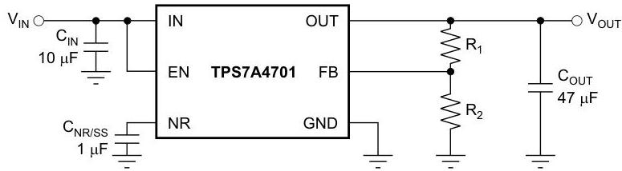
Figure 23. Adjustable Operation for Maximum AC Performance

$R_{1}$ and $R_{2}$ can be calculated for any output voltage within the operational range. The current through feedback resistor $R_{2}$ must be at least 5 $\mu$A to ensure stability. Additionally, the current into the FB pin ($I_{(FB)}$, typically 350 nA) creates an additional output voltage offset that depends on the resistance of $R_{1}$. For high-accuracy applications, select $R_{2}$ such that the current through $R_{2}$ is at least 35 $\mu$A to minimize any effects of $I_{(FB)}$ variation on the output voltage; 10 kΩ is recommended. $R_{1}$ can be calculated using Equation 3.

$$
R_{1} = \frac{V_{\text{OUT}} - V_{\text{REF}}}{I_{\text{FB}} + \frac{V_{\text{REF}}}{R_{2}}}
$$

where

- $V_{\text{REF}} = 1.4\ \text{V}$
- $I_{\text{FB}} = 350\ \text{nA}$ (3)

Use 0.1% tolerance resistors to minimize the effects of resistor inaccuracy on the output voltage.

Table 3 shows the resistor combinations to achieve some standard rail voltages with commercially-available 1% tolerance resistors. The resulting output voltages yield a nominal error of &lt; 0.5%.

Table 3. Suggested Resistors for Common Voltage Rails

|  VOUT | R_{1}, Calculated | R_{1}, Closest 1% Value | R_{2}  |
| --- | --- | --- | --- |
|  1.4 V | 0 Ω | 0 Ω | ∞  |
|  1.8 V | 2.782 kΩ | 2.8 kΩ | 9.76 kΩ  |
|  3.3 V | 13.213 kΩ | 13.3 kΩ | 9.76 kΩ  |
|  5 V | 25.650 kΩ | 25.5 kΩ | 10 kΩ  |
|  12 V | 77.032 kΩ | 76.8 kΩ | 10.2 kΩ  |
|  15 V | 101.733 kΩ | 102 kΩ | 10.5 kΩ  |
|  18 V | 118.276 kΩ | 118 kΩ | 10 kΩ  |
|  24 V | 164.238 kΩ | 165 kΩ | 10.2 kΩ  |

To achieve higher nominal accuracy, two resistors can be used in the place of R₁. Select the two resistor values such that the sum results in a value as close as possible to the calculated R₁ value.

There are several alternative ways to set the output voltage. The program pins can be pulled low using external general-purpose input/output pins (GPIOs), or can be hardwired by the given layout of the printed circuit board (PCB) to set the ANY-OUT voltage. The TPS7A4701 evaluation module (EVM), available for purchase from the TI eStore, allows the output voltage to be programmed using jumpers.

# 8 Application and Implementation

NOTE

Information in the following applications sections is not part of the TI component specification, and TI does not warrant its accuracy or completeness. TI's customers are responsible for determining suitability of components for their purposes. Customers should validate and test their design implementation to confirm system functionality.

# 8.1 Application Information

The TPS7A740x is a high-voltage, low-noise, 1-A LDO. Low-noise performance makes this LDO ideal for providing rail voltages to noise-sensitive loads, such as PLLs, oscillators, and high-speed ADCs.

# 8.2 Typical Application

Output voltage is set by grounding the appropriate control pins, as shown in Figure 24. When grounded, all control pins add a specific voltage on top of the internal reference voltage ( $V_{\text{(REF)}} = 1.4 \, \text{V}$ ). For example, when grounding pins 0P1V, 0P2V, and 1P6V, the voltage values 0.1 V, 0.2 V, and 1.6 V are added to the 1.4-V internal reference voltage for  $V_{\text{O(nom)}}$  equal to 3.3 V, as described in the Programming section.

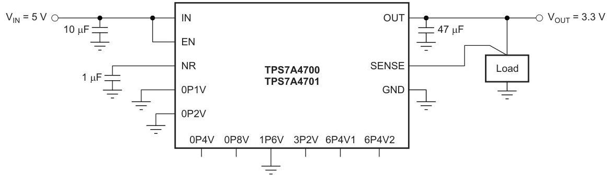
Figure 24. Typical Application,  $V_{\text{OUT}} = 3.3 \, \text{V}$

# 8.2.1 Design Requirements

|  PARAMETER | DESIGN REQUIREMENT  |
| --- | --- |
|  Input Voltage | 5.0 V, ±10%  |
|  Output Voltage | 3.3 V, ±3%  |
|  Output Current | 500 mA  |
|  Peak-to-Peak Noise, 10 Hz to 100 kHz | 50 μVp-p  |

# 8.2.2 Detailed Design Procedure

# 8.2.2.1 Capacitor Recommendations

These LDOs are designed to be stable using low equivalent series resistance (ESR), ceramic capacitors at the input, output, and at the noise reduction pin (NR, pin 14). Multilayer ceramic capacitors have become the industry standard for these types of applications and are recommended here, but must be used with good judgment. Ceramic capacitors that employ X7R-, X5R-, and COG-rated dielectric materials provide relatively good capacitive stability across temperature, but the use of Y5V-rated capacitors is discouraged precisely because the capacitance varies so widely. In all cases, ceramic capacitance varies a great deal with operating voltage and the design engineer must be aware of these characteristics. It is recommended to apply a  $50\%$  derating of the nominal capacitance in the design.

Attention must be given to the input capacitance to minimize transient input droop during load current steps because the TPS7A470x has a very fast load transient response. Large input capacitors are necessary for good transient load response, and have no detrimental influence on the stability of the device. Note, however, that using large ceramic input capacitances can also cause unwanted ringing at the output if the input capacitor, in combination with the wire lead inductance, creates a high-Q peaking effect during transients. For example, a 5-nH lead inductance and a 10-μF input capacitor form an LC filter with a resonance frequency of 712 kHz at the edge of the control loop bandwidth. Short, well-designed interconnect leads to the up-stream supply minimize this effect without adding damping. Damping of unwanted ringing can be accomplished by using a tantalum capacitor, with a few hundred milliohms of ESR, in parallel with the ceramic input capacitor.

## 8.2.2.1.1 Input and Output Capacitor Requirements

The TPS7A470x is designed and characterized for operation with ceramic capacitors of 10 μF or greater at the input and output. Optimal noise performance is characterized using a total output capacitor value of 50 μF. Note especially that input and output capacitances must be located as near as practical to the respective input and output pins.

## 8.2.2.1.2 Noise Reduction Capacitor (C_NR)

The noise reduction capacitor, connected to the NR pin of the LDO, forms an RC filter for filtering out noise that might ordinarily be amplified by the control loop and appear on the output voltage. Larger capacitances, up to 1 μF, affect noise reduction at lower frequencies while also tending to further reduce noise at higher frequencies. Note that C_NR also serves a secondary purpose in programming the turn-on rise time of the output voltage and thereby controls the turn-on surge current.

## 8.2.2.2 Dropout Voltage (V_DO)

Generally speaking, the dropout voltage often refers to the voltage difference between the input and output voltage (V_(DO) = V_I - V_O). However, in the Electrical Characteristics V_(DO) is defined as the V_I - V_O voltage at the rated current (I_(RATED)), where the main current pass-FET is fully on in the Ohmic region of operation and is characterized by the classic R_DS(on) of the FET. V_(DO) indirectly specifies a minimum input voltage above the nominal programmed output voltage at which the output voltage is expected to remain within its accuracy boundary. If the input falls below this V_(DO) limit (V_I &lt; V_O + V_(DO)), then the output voltage decreases in order to follow the input voltage.

Dropout voltage is always determined by the R_DS(on) of the main pass-FET. Therefore, if the LDO operates below the rated current, the V_(DO) is directly proportional to the output current and can be reduced by the same factor. The R_DS(on) for the TPS7A470x can be calculated using Equation 4:

$$
R _ {D S (O N)} = \frac {V _ {D O}}{I _ {R A T E D}} \tag {4}
$$

## 8.2.2.3 Output Voltage Accuracy

The output voltage accuracy specifies minimum and maximum output voltage error, relative to the expected nominal output voltage stated as a percent. This accuracy error typically includes the errors introduced by the internal reference and the load and line regulation across the full range of rated load and line operating conditions over temperature, unless otherwise specified by the Electrical Characteristics. Output voltage accuracy also accounts for all variations between manufacturing lots.

## 8.2.2.4 Startup

The startup time for the TPS7A470x depends on the output voltage and the capacitance of the C_NR capacitor. Equation 5 calculates the startup time for a typical device.

$$
t _ {S S} = 100,000 \cdot C _ {N R} \cdot \ln \left(\frac {V _ {R} + 5}{5}\right)
$$

where

- C_NR = capacitance of the C_NR capacitor
- V_R = V_O voltage if using the ANY-OUT configuration, or 1.4 V if using the adjustable configuration (5)

## 8.2.2.5 AC Performance

AC performance of the LDO is typically understood to include power-supply rejection ratio, load step transient response, and output noise. These metrics are primarily a function of open-loop gain and bandwidth, phase margin, and reference noise.

## 8.2.2.5.1 Power-Supply Rejection Ratio (PSRR)

PSRR is a measure of how well the LDO control loop rejects ripple noise from the input source to make the dc output voltage as noise-free as possible across the frequency spectrum (usually 10 Hz to 10 MHz). Equation 6 gives the PSRR calculation as a function of frequency where input noise voltage [V_S(IN)(f)] and output noise voltage [V_S(OUT)(f)] are understood to be purely ac signals.

$$
\mathrm{PSRR} \, (\mathrm{dB}) = 20 \log_{10} \left[ \frac{\mathrm{V}_{\mathrm{S(IN)}}(\mathrm{f})}{\mathrm{V}_{\mathrm{S(OUT)}}(\mathrm{f})} \right] \tag{6}
$$

Noise that couples from the input to the internal reference voltage for the control loop is also a primary contributor to reduced PSRR magnitude and bandwidth. This reference noise is greatly filtered by the noise reduction capacitor at the NR pin of the LDO in combination with an internal filter resistor (R_SS) for optimal PSRR.

The LDO is often employed not only as a dc/dc regulator, but also to provide exceptionally clean power-supply voltages that are free of noise and ripple to power-sensitive system components. This usage is especially true for the TPS7A470x.

## 8.2.2.5.2 Load Step Transient Response

The load step transient response is the output voltage response by the LDO to a step change in load current whereby output voltage regulation is maintained. The worst-case response is characterized for a load step of 10 mA to 1 A (at 1 A per microsecond) and shows a classic, critically-damped response of a very stable system. The voltage response shows a small dip in the output voltage when charge is initially depleted from the output capacitor and then the output recovers as the control loop adjusts itself. The depth of the charge depletion immediately after the load step is directly proportional to the amount of output capacitance. However, to some extent, the speed of recovery is inversely proportional to that same output capacitance. In other words, larger output capacitances act to decrease any voltage dip or peak occurring during a load step but also decrease the control-loop bandwidth, thereby slowing response.

The worst-case, off-loading step characterization occurs when the current step transitions from 1 A to 0 mA. Initially, the LDO loop cannot respond fast enough to prevent a small increase in output voltage charge on the output capacitor. Because the LDO cannot sink charge current, the control loop must turn off the main pass-FET to wait for the charge to deplete, thus giving the off-load step its typical monotonic decay (which appears triangular in shape).

## 8.2.2.5.3 Noise

The TPS7A470x is designed, in particular, for system applications where minimizing noise on the power-supply rail is critical to system performance. This scenario is the case for phase-locked loop (PLL)-based clocking circuits for instance, where minimum phase noise is all important, or in-test and measurement systems where even small power-supply noise fluctuations can distort instantaneous measurement accuracy. Because the TPS7A470x is also designed for higher voltage industrial applications, the noise characteristic is well designed to minimize any increase as a function of the output voltage.

LDO noise is defined as the internally-generated intrinsic noise created by the semiconductor circuits alone. This noise is the sum of various types of noise (such as shot noise associated with current-through-pin junctions, thermal noise caused by thermal agitation of charge carriers, flicker or 1/f noise that is a property of resistors and dominates at lower frequencies as a function of 1/f, burst noise, and avalanche noise).

To calculate the LDO RMS output noise, a spectrum analyzer must first measure the spectral noise across the bandwidth of choice (typically 10 Hz to 100 kHz in units of μV/√Hz). The RMS noise is then calculated in the usual manner as the integrated square root of the squared spectral noise over the band, then averaged by the bandwidth.

## 8.2.3 Application Curves

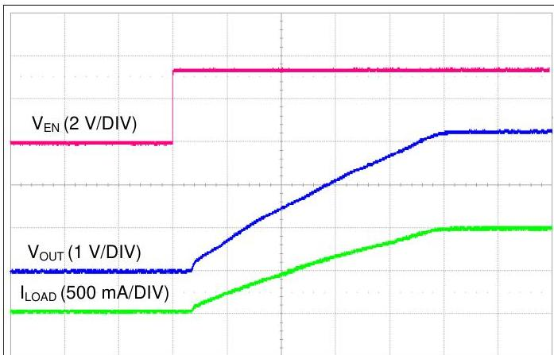
Figure 25. Startup with EN Pin rising (10 ms/DIV)

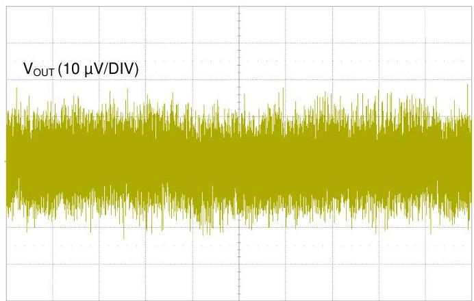
Figure 26. Output Noise Voltage, 10 Hz to 100 kHz (10 ms/DIV)

# 9 Power Supply Recommendations

The device is designed to operate from an input voltage supply range of 3 V to 35 V. If the input supply is noisy, additional input capacitors with low ESR can help improve the output noise performance.

# 9.1 Power Dissipation (P_D)

Power dissipation must be considered in the PCB design. In order to minimize risk of device operation above 125°C, use as much copper area as available for thermal dissipation. Do not locate other power-dissipating devices near the LDO.

Power dissipation in the regulator depends on the input to output voltage difference and load conditions. P_D can be calculated using Equation 7:

$$
P _ {D} = \left(V _ {\text {O U T}} - V _ {\text {I N}}\right) \times I _ {\text {O U T}} \tag {7}
$$

It is important to note that power dissipation can be minimized, and thus greater efficiency achieved, by proper selection of the system voltage rails. Proper selection allows the minimum input voltage necessary for output regulation to be obtained.

The primary heat conduction path for the QFN (RGW) package is through the thermal pad to the PCB. The thermal pad must be soldered to a copper pad area under the device. Thermal vias are recommended to improve the thermal conduction to other layers of the PCB.

The maximum power dissipation determines the maximum allowable junction temperature (T_J) for the device. Power dissipation and junction temperature are most often related by the junction-to-ambient thermal resistance (θ_JA) of the combined PCB and device package and the temperature of the ambient air (T_A), according to Equation 8.

$$
T _ {J} = T _ {A} + \left(\theta_ {J A} \times P _ {D}\right) \tag {8}
$$

Unfortunately, this thermal resistance (θ_JA) depends primarily on the heat-spreading capability built into the particular PCB design, and therefore varies according to the total copper area, copper weight, and location of the spreading planes. The θ_JA recorded in the Thermal Information table is determined by the JEDEC standard, PCB, and copper-spreading area and is to be used only as a relative measure of package thermal performance. Note that for a well-designed thermal layout, θ_JA is actually the sum of the QFN package junction-to-case (bottom) thermal resistance (θ_JCbot) plus the thermal resistance contribution by the PCB copper. By knowing θ_JCbot, the minimum amount of appropriate heat sinking can be used to estimate θ_JA with Figure 27. θ_JCbot can be found in the Thermal Information table.

Figure 27. Θ_JA vs Board Size
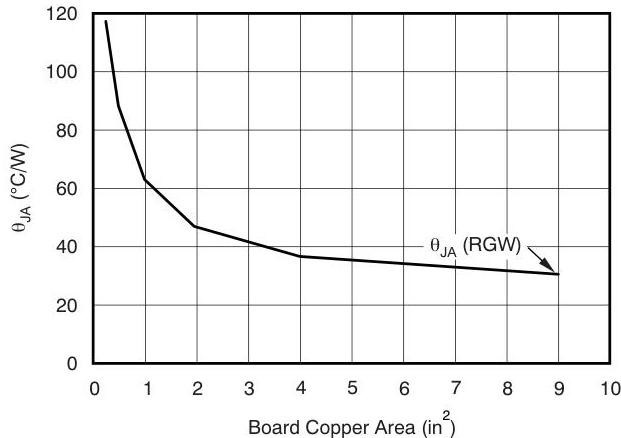
NOTE: θ_JA value at a board size of 9-in² (that is, 3-in × 3-in) is a JEDEC standard.

# 10 Layout

## 10.1 Layout Guidelines

For best overall performance, all circuit components are recommended to be located on the same side of the circuit board and as near as practical to the respective LDO pin connections. Ground return connections to the input and output capacitor, and to the LDO ground pin, must also be as close to each other as possible and connected by a wide, component-side, copper surface. The use of vias and long traces to create LDO circuit connections is strongly discouraged and negatively affects system performance. This grounding and layout scheme minimizes inductive parasitics and thereby reduces load-current transients, minimizes noise, and increases circuit stability.

A ground reference plane is also recommended. This reference plane serves to assure accuracy of the output voltage, shield noise, and behaves similar to a thermal plane to spread (or sink) heat from the LDO device when connected to the PowerPAD™. In most applications, this ground plane is necessary to meet thermal requirements.

Use the TPS7A4701 evaluation module (EVM), available for purchase from the TI eStore, as a reference for layout and application design.

## 10.2 Layout Example

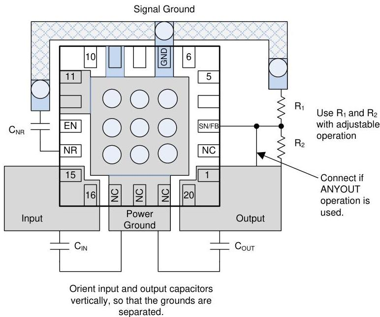
Figure 28. Layout Example

## 10.3 Thermal Protection

The TPS7A470x contains a thermal shutdown protection circuit to turn off the output current when excessive heat is dissipated in the LDO. Thermal shutdown occurs when the thermal junction temperature (T_J) of the main pass-FET exceeds 170°C (typical). Thermal shutdown hysteresis assures that the LDO again resets (turns on) when the temperature falls to 150°C (typical). Because the TPS7A470x is capable of supporting high input voltages, a great deal of power can be expected to be dissipated across the device at low output voltages, which causes a thermal shutdown. The thermal time-constant of the semiconductor die is fairly short, and thus the output oscillates on and off at a high rate when thermal shutdown is reached until power dissipation is reduced.

For reliable operation, the junction temperature must be limited to a maximum of 125°C. To estimate the thermal margin in a given layout, increase the ambient temperature until the thermal protection shutdown is triggered using worst-case load and highest input voltage conditions. For good reliability, thermal shutdown must be designed to occur at least 45°C above the maximum expected ambient temperature condition for the application. This configuration produces a worst-case junction temperature of 125°C at the highest expected ambient temperature and worst-case load.

The internal protection circuitry of the TPS7A470x is designed to protect against thermal overload conditions. The circuitry is not intended to replace proper heat sinking. Continuously running the TPS7A470x into thermal shutdown degrades device reliability.

## 10.4 Estimating Junction Temperature

JEDEC standards now recommend the use of PSI thermal metrics to estimate the junction temperatures of the LDO while in-circuit on a typical PCB board application. These metrics are not strictly speaking thermal resistances, but rather offer practical and relative means of estimating junction temperatures. These PSI metrics are determined to be significantly independent of copper-spreading area. The key thermal metrics (Ψ_JT and Ψ_JB) are given in the Thermal Information table and are used in accordance with Equation 9.

$$
\begin{array}{l}
\Psi_{\mathrm{JT}}: \mathrm{T}_{\mathrm{J}} = \mathrm{T}_{\mathrm{T}} + \Psi_{\mathrm{JT}} \times \mathrm{P}_{\mathrm{D}} \\
\Psi_{\mathrm{JB}}: \mathrm{T}_{\mathrm{J}} = \mathrm{T}_{\mathrm{B}} + \Psi_{\mathrm{JB}} \times \mathrm{P}_{\mathrm{D}} \\
\end{array}
$$

where:

- P_D is the power dissipated as explained in Equation 7,
- T_T is the temperature at the center-top of the device package, and
- T_B is the PCB surface temperature measured 1 mm from the device package and centered on the package edge (9)

# 11 Device and Documentation Support

## 11.1 Documentation Support

### 11.1.1 Related Documentation

For related documentation see the following (available for download at www.ti.com):

- TPS7A47XXEVM-094 Evaluation Module. User Guide SLVU741A
- Pros and Cons of Using a Feed-Forward Capacitor with a Low Dropout Regulator. Application Note SBVA042

## 11.2 Related Links

Table 4 lists quick access links. Categories include technical documents, support and community resources, tools and software, and quick access to sample or buy.

Table 4. Related Links

|  PARTS | PRODUCT FOLDER | SAMPLE & BUY | TECHNICAL DOCUMENTS | TOOLS & SOFTWARE | SUPPORT & COMMUNITY  |
| --- | --- | --- | --- | --- | --- |
|  TPS7A4700 | Click here | Click here | Click here | Click here | Click here  |
|  TPS7A4701 | Click here | Click here | Click here | Click here | Click here  |

## 11.3 Trademarks

ANY-OUT, PowerPAD are trademarks of Texas Instruments.

All other trademarks are the property of their respective owners.

## 11.4 Electrostatic Discharge Caution

⚠️ These devices have limited built-in ESD protection. The leads should be shorted together or the device placed in conductive foam during storage or handling to prevent electrostatic damage to the MOS gates.

## 11.5 Glossary

SLYZ022 — TI Glossary.

This glossary lists and explains terms, acronyms, and definitions.

# 12 Mechanical, Packaging, and Orderable Information

The following pages include mechanical, packaging, and orderable information. This information is the most current data available for the designated devices. This data is subject to change without notice and revision of this document. For browser-based versions of this data sheet, refer to the left-hand navigation.

PACKAGING INFORMATION

| Orderable part number | Status (1) | Material type (2) | Package | Pins | Package qty | Carrier | RoHS (3) | Lead finish/ Ball material (4) | MSL rating/ Peak reflow (5) | Op temp (°C) | Part marking (6) |
| --- | --- | --- | --- | --- | --- | --- | --- | --- | --- | --- | --- |
| TPS7A4700RGWR | Active | Production | VQFN (RGW) | 20 | 3000 | LARGE T&R | Yes | NIPDAU | Level-2-260C-1 YEAR | -40 to 125 | PXSQ |
| TPS7A4700RGWR.B | Active | Production | VQFN (RGW) | 20 | 3000 | LARGE T&R | Yes | NIPDAU | Level-2-260C-1 YEAR | -40 to 125 | PXSQ |
| TPS7A4700RGWRG4 | Active | Production | VQFN (RGW) | 20 | 3000 | LARGE T&R | Yes | NIPDAU | Level-2-260C-1 YEAR | -40 to 125 | PXSQ |
| TPS7A4700RGWRG4.B | Active | Production | VQFN (RGW) | 20 | 3000 | LARGE T&R | Yes | NIPDAU | Level-2-260C-1 YEAR | -40 to 125 | PXSQ |
| TPS7A4700RGWT | Active | Production | VQFN (RGW) | 20 | 250 | SMALL T&R | Yes | NIPDAU | Level-2-260C-1 YEAR | -40 to 125 | PXSQ |
| TPS7A4700RGWT.B | Active | Production | VQFN (RGW) | 20 | 250 | SMALL T&R | Yes | NIPDAU | Level-2-260C-1 YEAR | -40 to 125 | PXSQ |
| TPS7A4701RGWR | Active | Production | VQFN (RGW) | 20 | 3000 | LARGE T&R | Yes | NIPDAU | Level-2-260C-1 YEAR | -40 to 125 | 7A4701 |
| TPS7A4701RGWR.B | Active | Production | VQFN (RGW) | 20 | 3000 | LARGE T&R | Yes | NIPDAU | Level-2-260C-1 YEAR | -40 to 125 | 7A4701 |
| TPS7A4701RGWRG4 | Active | Production | VQFN (RGW) | 20 | 3000 | LARGE T&R | Yes | NIPDAU | Level-2-260C-1 YEAR | -40 to 125 | 7A4701 |
| TPS7A4701RGWRG4.B | Active | Production | VQFN (RGW) | 20 | 3000 | LARGE T&R | Yes | NIPDAU | Level-2-260C-1 YEAR | -40 to 125 | 7A4701 |
| TPS7A4701RGWT | Active | Production | VQFN (RGW) | 20 | 250 | SMALL T&R | Yes | NIPDAU | Level-1-260C-UNLIM | -40 to 125 | 7A4701 |
| TPS7A4701RGWT.B | Active | Production | VQFN (RGW) | 20 | 250 | SMALL T&R | Yes | NIPDAU | Level-1-260C-UNLIM | -40 to 125 | 7A4701 |

(1) Status: For more details on status, see our product life cycle.

(2) Material type: When designated, preproduction parts are prototypes/experimental devices, and are not yet approved or released for full production. Testing and final process, including without limitation quality assurance, reliability performance testing, and/or process qualification, may not yet be complete, and this item is subject to further changes or possible discontinuation. If available for ordering, purchases will be subject to an additional waiver at checkout, and are intended for early internal evaluation purposes only. These items are sold without warranties of any kind.

(3) RoHS values: Yes, No, RoHS Exempt. See the TI RoHS Statement for additional information and value definition.

(4) Lead finish/Ball material: Parts may have multiple material finish options. Finish options are separated by a vertical ruled line. Lead finish/Ball material values may wrap to two lines if the finish value exceeds the maximum column width.

(5) MSL rating/Peak reflow: The moisture sensitivity level ratings and peak solder (reflow) temperatures. In the event that a part has multiple moisture sensitivity ratings, only the lowest level per JEDEC standards is shown. Refer to the shipping label for the actual reflow temperature that will be used to mount the part to the printed circuit board.

(6) Part marking: There may be an additional marking, which relates to the logo, the lot trace code information, or the environmental category of the part.

Multiple part markings will be inside parentheses. Only one part marking contained in parentheses and separated by a "~" will appear on a part. If a line is indented then it is a continuation of the previous line and the two combined represent the entire part marking for that device.

Important Information and Disclaimer: The information provided on this page represents TI's knowledge and belief as of the date that it is provided. TI bases its knowledge and belief on information provided by third parties, and makes no representation or warranty as to the accuracy of such information. Efforts are underway to better integrate information from third parties. TI has taken and continues to take reasonable steps to provide representative and accurate information but may not have conducted destructive testing or chemical analysis on incoming materials and chemicals. TI and TI suppliers consider certain information to be proprietary, and thus CAS numbers and other limited information may not be available for release.

In no event shall TI's liability arising out of such information exceed the total purchase price of the TI part(s) at issue in this document sold by TI to Customer on an annual basis.

OTHER QUALIFIED VERSIONS OF TPS7A47 :

- Automotive : TPS7A47-Q1

NOTE: Qualified Version Definitions:

- Automotive - Q100 devices qualified for high-reliability automotive applications targeting zero defects

# TAPE AND REEL INFORMATION

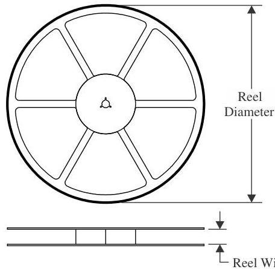
REEL DIMENSIONS

TAPE DIMENSIONS

|  A0 | Dimension designed to accommodate the component width  |
| --- | --- |
|  B0 | Dimension designed to accommodate the component length  |
|  K0 | Dimension designed to accommodate the component thickness  |
|  W | Overall width of the carrier tape  |
|  P1 | Pitch between successive cavity centers  |

QUADRANT ASSIGNMENTS FOR PIN 1 ORIENTATION IN TAPE

*All dimensions are nominal

|  Device | Package Type | Package Drawing | Pins | SPQ | Reel Diameter (mm) | Reel Width W1 (mm) | A0 (mm) | B0 (mm) | K0 (mm) | P1 (mm) | W (mm) | Pin1 Quadrant  |
| --- | --- | --- | --- | --- | --- | --- | --- | --- | --- | --- | --- | --- |
|  TPS7A4700RGWR | VQFN | RGW | 20 | 3000 | 330.0 | 12.4 | 5.3 | 5.3 | 1.1 | 8.0 | 12.0 | Q2  |
|  TPS7A4700RGWRG4 | VQFN | RGW | 20 | 3000 | 330.0 | 12.4 | 5.3 | 5.3 | 1.1 | 8.0 | 12.0 | Q2  |
|  TPS7A4700RGWT | VQFN | RGW | 20 | 250 | 180.0 | 12.4 | 5.3 | 5.3 | 1.1 | 8.0 | 12.0 | Q2  |
|  TPS7A4701RGWR | VQFN | RGW | 20 | 3000 | 330.0 | 12.4 | 5.3 | 5.3 | 1.1 | 8.0 | 12.0 | Q2  |
|  TPS7A4701RGWRG4 | VQFN | RGW | 20 | 3000 | 330.0 | 12.4 | 5.3 | 5.3 | 1.1 | 8.0 | 12.0 | Q2  |
|  TPS7A4701RGWT | VQFN | RGW | 20 | 250 | 180.0 | 12.4 | 5.3 | 5.3 | 1.1 | 8.0 | 12.0 | Q2  |

TAPE AND REEL BOX DIMENSIONS

*All dimensions are nominal

|  Device | Package Type | Package Drawing | Pins | SPQ | Length (mm) | Width (mm) | Height (mm)  |
| --- | --- | --- | --- | --- | --- | --- | --- |
|  TPS7A4700RGWR | VQFN | RGW | 20 | 3000 | 346.0 | 346.0 | 33.0  |
|  TPS7A4700RGWRG4 | VQFN | RGW | 20 | 3000 | 346.0 | 346.0 | 33.0  |
|  TPS7A4700RGWT | VQFN | RGW | 20 | 250 | 210.0 | 185.0 | 35.0  |
|  TPS7A4701RGWR | VQFN | RGW | 20 | 3000 | 346.0 | 346.0 | 33.0  |
|  TPS7A4701RGWRG4 | VQFN | RGW | 20 | 3000 | 346.0 | 346.0 | 33.0  |
|  TPS7A4701RGWT | VQFN | RGW | 20 | 250 | 210.0 | 185.0 | 35.0  |

This image is a representation of the package family, actual package may vary. Refer to the product data sheet for package details.

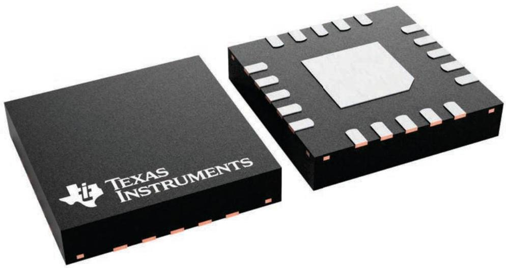

PLASTIC QUAD FLATPACK-NO LEAD

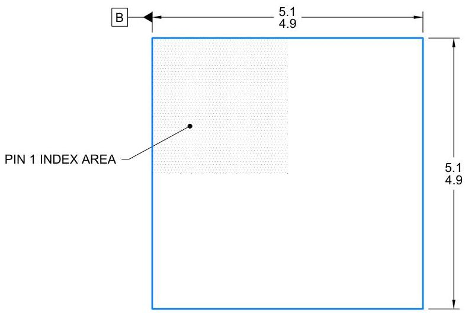

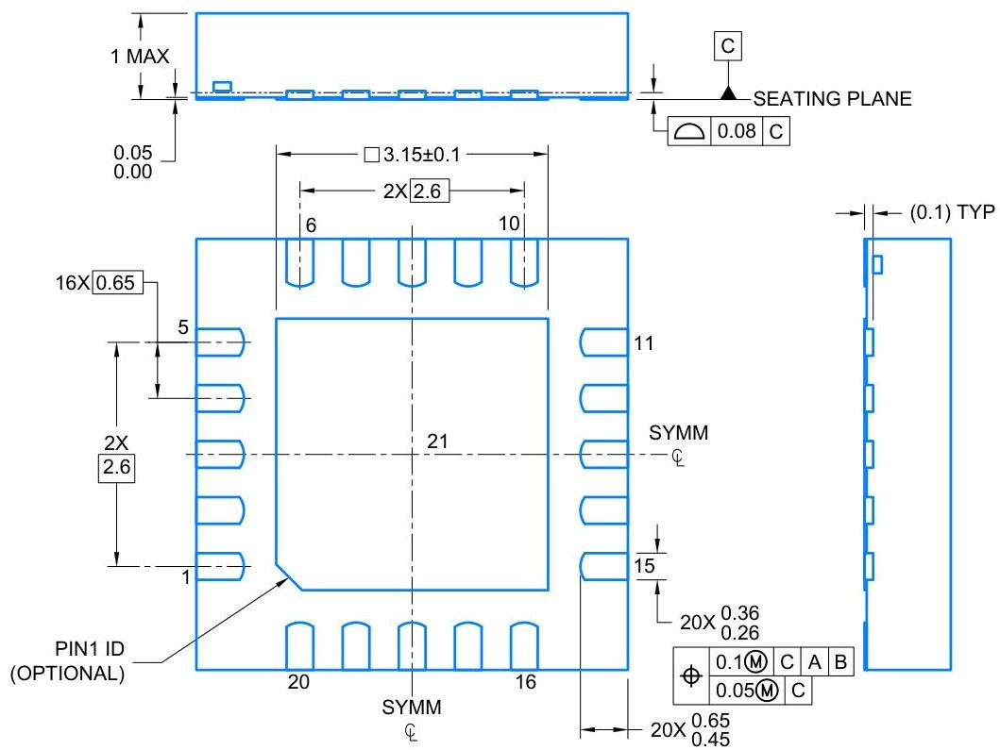

4219039/A 06/2018

# NOTES:

1. All linear dimensions are in millimeters. Any dimensions in parenthesis are for reference only. Dimensioning and tolerancing per ASME Y14.5M.
2. This drawing is subject to change without notice.
3. The package thermal pad must be soldered to the printed circuit board for optimal thermal and mechanical performance.

PLASTIC QUAD FLATPACK-NO LEAD

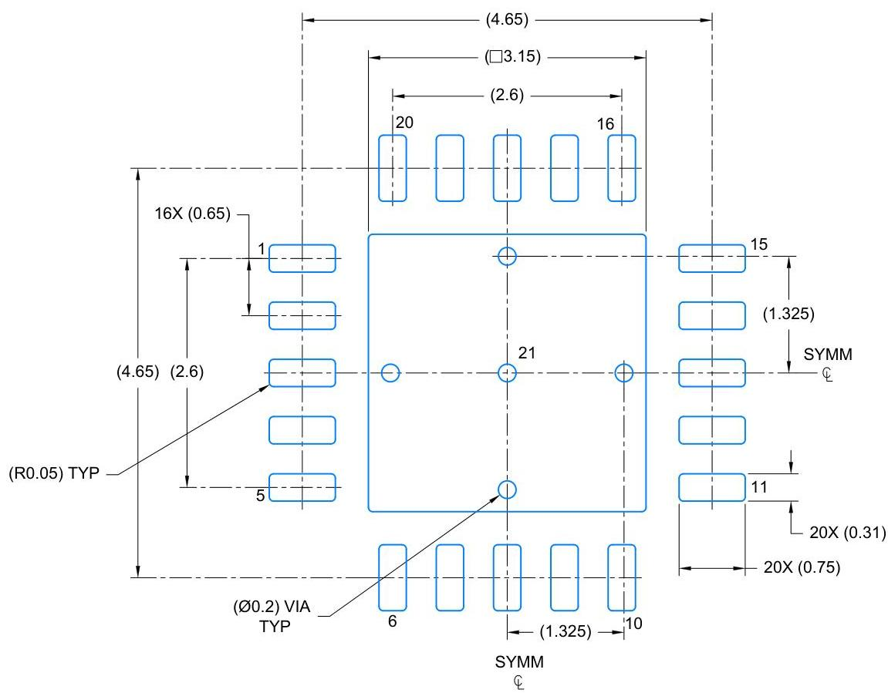

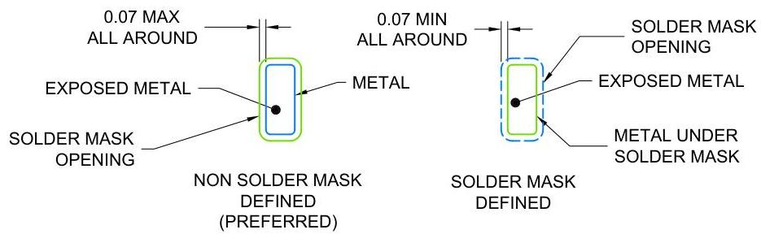

LAND PATTERN EXAMPLE
SCALE: 15X

SOLDER MASK DETAILS
4219039/A 06/2018

NOTES: (continued)

4. This package is designed to be soldered to a thermal pad on the board. For more information, see Texas Instruments literature number SLUA271 (www.ti.com/lit/slua271).
5. Vias are optional depending on application, refer to device data sheet. If any vias are implemented, refer to their locations shown on this view. It is recommended that vias under paste be filled, plugged or tented.

PLASTIC QUAD FLATPACK-NO LEAD

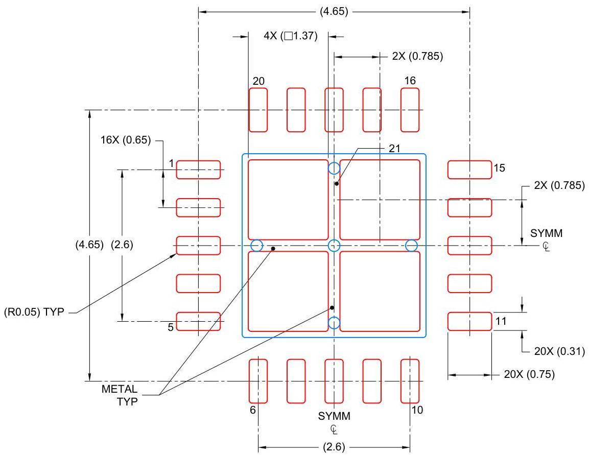

SOLDER PASTE EXAMPLE
BASED ON 0.125 mm THICK STENCIL

EXPOSED PAD
75% PRINTED COVERAGE BY AREA
SCALE: 15X

4219039/A 06/2018

NOTES: (continued)

6. Laser cutting apertures with trapezoidal walls and rounded corners may offer better paste release. IPC-7525 may have alternate design recommendations.

# IMPORTANT NOTICE AND DISCLAIMER

TI PROVIDES TECHNICAL AND RELIABILITY DATA (INCLUDING DATASHEETS), DESIGN RESOURCES (INCLUDING REFERENCE DESIGNS), APPLICATION OR OTHER DESIGN ADVICE, WEB TOOLS, SAFETY INFORMATION, AND OTHER RESOURCES "AS IS" AND WITH ALL FAULTS, AND DISCLAIMS ALL WARRANTIES, EXPRESS AND IMPLIED, INCLUDING WITHOUT LIMITATION ANY IMPLIED WARRANTIES OF MERCHANTABILITY, FITNESS FOR A PARTICULAR PURPOSE OR NON-INFRINGEMENT OF THIRD PARTY INTELLECTUAL PROPERTY RIGHTS.

These resources are intended for skilled developers designing with TI products. You are solely responsible for (1) selecting the appropriate TI products for your application, (2) designing, validating and testing your application, and (3) ensuring your application meets applicable standards, and any other safety, security, regulatory or other requirements.

These resources are subject to change without notice. TI grants you permission to use these resources only for development of an application that uses the TI products described in the resource. Other reproduction and display of these resources is prohibited. No license is granted to any other TI intellectual property right or to any third party intellectual property right. TI disclaims responsibility for, and you fully indemnify TI and its representatives against any claims, damages, costs, losses, and liabilities arising out of your use of these resources.

TI's products are provided subject to TI's Terms of Sale, TI's General Quality Guidelines, or other applicable terms available either on ti.com or provided in conjunction with such TI products. TI's provision of these resources does not expand or otherwise alter TI's applicable warranties or warranty disclaimers for TI products. Unless TI explicitly designates a product as custom or customer-specified, TI products are standard, catalog, general purpose devices.

TI objects to and rejects any additional or different terms you may propose.

Copyright © 2025, Texas Instruments Incorporated
Last updated 10/2025