# High Efficiency, Synchronous Boost Charger for Two/Three-cell Li-ion Battery with Cell Balance and Power Path Management Function

## 1 DESCRIPTION

The SC8922 is a highly integrated switch-mode boost charger and system power path management device for 2/3 cells Li-ion battery applications. It is able to step up 3.6V~5.5V input voltage to up to 16V, and provide battery charge management functions including trickle charge, constant current charge, constant voltage charge, charge termination and charging status indication. Besides that, the IC can also provide cell balance function, so to reduce the cell voltage mismatch and increase the battery life time.

The SC8922 supports up to 3A charge current, and the user can program the current freely through external resistor for different applications. With the power path management function and supplement mode, the IC can be used to charge 2/3 cells Li-ion battery and meantime provide power for system operation.

The SC8922 supports input current limit, input under voltage and over voltage protections, internal cycle by cycle current limit, battery short circuit protection, and output over voltage protection. It also offers charging safety timer, battery cell temperature monitor and over temperature protection to ensure safety under different abnormal conditions.

The SC8922 is available in 4x4 QFN-24 package.

## 3 APPLICATIONS

- Blue tooth speaker charger
- E-cigarette charger
- E-joy charger
- LI-ion battery charger
- POS machine

## 4 DEVICE INFORMATION

|  Part Number | Package | Dimension  |
| --- | --- | --- |
|  SC8922QDLR | QFN-24 | 4 mm x 4 mm x 0.75 mm  |

## 2 FEATURES

- Integrated Synchronous Boost Charger
- Integrated Power Path Management
- Cell Balance Function
- Charging Management (Trickle Charge / Constant Current Charge / Constant Voltage Charge / Charge Termination)
- Programmable Constant Charge Current
- Programmable Constant Voltage
- Charge Status Indication
- Charge Safety Timer
- NTC for Battery Protection
- 2A / 3A Input Current Limit Option
- Adaptive Input Current Limit
- Input Under Voltage and Over Voltage Protection
- Battery Short Circuit Protection
- Thermal Shutdown

# 5 Typical Application Circuit

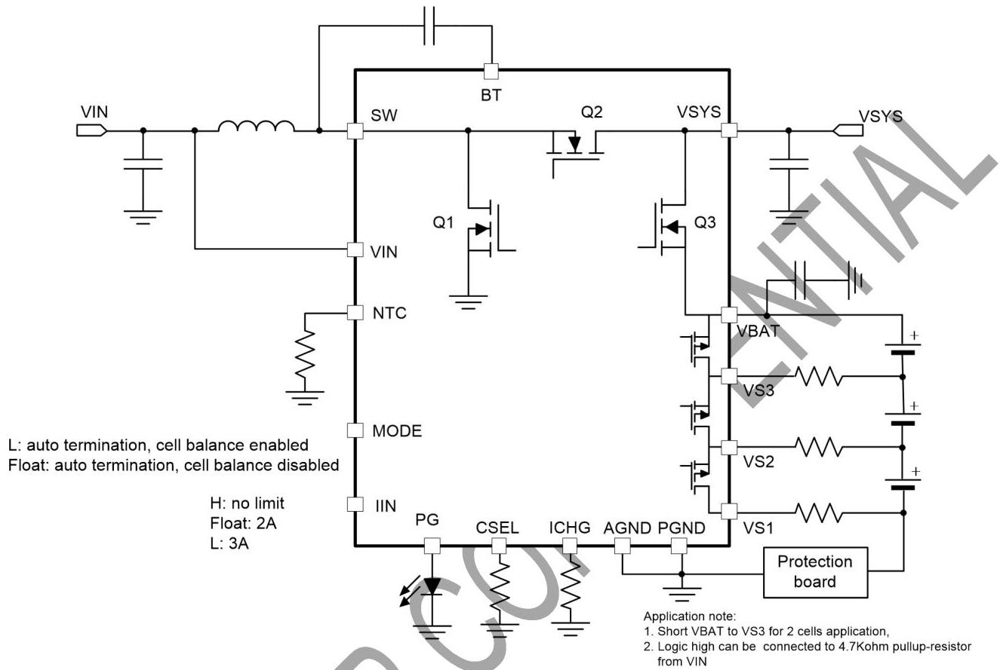

# 6 Selection Guide

|  Part Number | VIN range | Max. VBAT | Integrated Power Range | Max. Charging current | VINREG | Power path management | NTC | Cell Balance | Pin #  |
| --- | --- | --- | --- | --- | --- | --- | --- | --- | --- |
|  SC8922 | 3.6V~6V | 13.2V | Yes | 3A | 4.5V | Yes | Yes | Yes | 24 pin QFN 4x4  |
|  SC8922A | 3.6V~6V | 13.2V | Yes | 3A | 4.5V | No | Yes | Yes | 24 pin QFN 4x4  |

Note:
SC8922: Support supplement mode with power path function. 1. Only battery exists: Q3 is fully on, which means more quiescent current when only battery exist; 2. System power can be obtained from VSYS pin. What's more, battery will discharge by turning on Q3 fully to satisfy system need when input source capacity is limited (refer to supplement mode).
SC8922A: No power path function. 1. Only battery exists: Q3 is always off, so IC works under low quiescent current condition; 2. System power can be only obtained from VBAT pin. VSYS pin can't afford system load and it must be connected with 22uF ceramic capacitor. 3. When VIN plug in, Q3 is controlled by charger loop (linear mode in trickle charge; fully on in constant current charge or constant voltage charge), which is same with SC8922.

# 7 Terminal Configurations and Functions

QFN Top View –SC8922

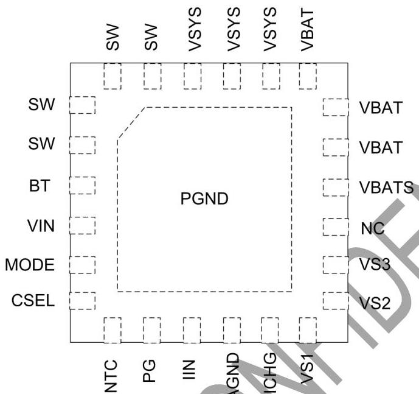

|  I/O |   |   | DESCRIPTION  |
| --- | --- | --- | --- |
|  SC8922 | NAME |  |   |
|  3 | BT | IO | Bootstrap pin. Connect a 100nF ceramic capacitor between BT pin and SW pin to provide bias voltage for internal driver circuit.  |
|  1, 2, 23,24 | SW | IO | Switching node of the boost converter. Connect to external inductor.  |
|  4 | VIN | I | Input of the boost charger  |
|  5 | MODE | I | MODE selection pin
MODE = logic low; auto-termination, cell balance function is enabled.
MODE = float; auto-termination, cell balance function is disabled.  |
|  6 | CSEL | I | Connect a resistor to GND to select the battery termination voltage target  |
|  7 | NTC | I | Connect to the Negative Temperature Coefficient (NTC) thermistor inside the battery cells to sense the battery cells temperature for protection. Short this pin to ground to disable this function.  |
|  8 | PG | O | Charging status indication pin. Connect an LED from PG pin and GND pin. It is internally pulled high to indicate the charge in process. When the battery is fully charged, it outputs high impedance and the LED is off.  |
|  9 | IIN | I | Set the input current limit.
IIN = logic high: no input current limit;
IIN = float: input current limit is set to 2A;
IIN = logic low: input current limit is set to 3A  |
|  11 | ICHG | I | Connect a resistor to GND to program the battery constant charging current.  |
|  10 | AGND | IO | Analog ground. Connect PGND and AGND together at the thermal pad under IC.  |
|  12 | VS1 | O | Cell voltage sense and cell balance path  |
|  13 | VS2 | O | Cell voltage sense and cell balance path  |
|  14 | VS3 | O | Cell voltage sense and cell balance path  |
|  15 | NC |  |   |

# 7.1 Absolute Maximum Ratings

Over operating free-air temperature range (unless otherwise noted)(1)

|   |  | Min. | Max. | Unit  |
| --- | --- | --- | --- | --- |
|  Voltage(2) | VIN, SW, VSYS | -0.3 | 16 | V  |
|   |  VS3, VBAT | -0.3 | 14 | V  |
|   |  MODE, CSEL, NTC, PG, IIN, ICHG | -0.3 | 5.5 | V  |
|   |  VS2, VS1 | -0.3 | 5 | V  |
|  T_{J} | Operating junction temperature | -40 | 150 | °C  |
|  T_{sig} | Storage temperature | -65 | 150 | °C  |

(1) Stresses beyond those listed under absolute maximum ratings may cause permanent damage to the device.
(2) All voltages are with respect to network ground terminal.

# 7.2 ESD Ratings

|   |  | Min. | Max. | Unit  |
| --- | --- | --- | --- | --- |
|  V_{ESD}(1) | Human-body Model (HBM) (2) | All pins | -2 | 2  |
|   |  Charged-device Model (CDM) (3) |   | -750 | 750  |

(1) Electrostatic discharge (ESD) to measure device sensitivity and immunity to damage caused by assembly line electrostatic discharges into the device.
(2) Level listed above is the passing level per ANSI, ESDA, and JEDEC JS-001. JEDEC document JEP155 states that 500-V HBM allows safe manufacturing with a standard ESD control process.
(3) Level listed above is the passing level per EIA-JEDEC JESD22-C101. JEDEC document JEP157 states that 250-V CDM allows safe manufacturing with a standard ESD control process.

# 7.3 Recommended Operation Conditions

|   |  | Min. | Typ. | Max. | Unit  |
| --- | --- | --- | --- | --- | --- |
|  V_{IN} | VIN voltage range | 4.5 | 5 | 5.5 | V  |
|  L | Inductor | 1 | 2.2 | 3.3 | μH  |
|  C | VIN capacitor |  | 10 |  | μF  |
|  C_{VSYS} | VSYS capacitor |  | 10 |  | μF  |
|  C_{VBAT} | VBAT capacitor | 4.7 |  |  | μF  |
|  T_{A} | Operating ambient temperature | -40 |  | 85 | °C  |
|  T_{J} | Operating junction temperature | -40 |  | 125 | °C  |

# 8 Electrical Characteristics

|  Parameter | Description | Test condition | Min. | Typ. | Max. | Unit  |
| --- | --- | --- | --- | --- | --- | --- |
|  Supply and power path  |   |   |   |   |   |   |
|  VIN | Operating input voltage |  | 4.5 | 5 | 5.5 | V  |
|  VUVLO | Under voltage lockout threshold |  |  | 3.6 |  | V  |
|   | Hysteresis |  |  | 150 |  | mV  |
|  VSYS | VSYS regulation voltage | VBUS = 5V, VBAT = 5V (2 cells) |  | 6.2 |  | V  |
|   |  | VBUS = 5V, VBAT = 7.5V (3 cells) |  | 9.2 |  | V  |
|  VSYS_HYS | VSYS regulation voltage after termination | VSYS_HYS = VSYS - VBAT_TRGT |  | 200 |  | mV  |
|  VREF | Reference voltage |  |  | 1.2 |  | V  |
|  VSUP | Q3 VDS regulation voltage in supplement mode |  |  | 30 |  | mV  |
|  IQ_VIN | Quiescent current into VIN pin | Mode pin= float, VIN = 5V, VSYS = VBAT = 8V, non-switching |  | 1.8 |  | mA  |
|  IQ_VBAT | Quiescent current into VBAT pin | Mode pin= float, VIN = open, VBAT = 8V |  | 65 |  | uA  |
|  Power stage  |   |   |   |   |   |   |
|  Rdson_Q1 | Rdson resistance of Q1 | VIN=5V, VSYS=VBAT=8V |  | 60 |  | mΩ  |
|  Rdson_Q2 | Rdson resistance of Q2 | VIN=5V, VSYS=VBAT=8V |  | 35 |  | mΩ  |
|  Rdson_Q3 | Rdson resistance of Q3 | VIN=5V, VSYS=VBAT=8V |  | 35 |  | mΩ  |
|  fsw | Switching frequency |  |  | 800 |  | KHz  |
|  Tmax_ON | Maximum on time |  |  | 5 |  | us  |
|  Charger Function  |   |   |   |   |   |   |
|  ICHG | Constant charging current accuracy | RICHG = 8 kΩ |  | 1.5 |  | A  |
|  ITRK | Trickle charging current accuracy | RICHG = 8 kΩ, VBAT = 5V |  | 0.15 |  | A  |
|  ITRK_INT | Internal trickle charge current | RICHG = 0 Ω, VBAT = 5V |  | 0.2 |  | A  |

|  ITERM_INT | Internal termination charge current |  |  | 0.15 |  | A  |
| --- | --- | --- | --- | --- | --- | --- |
|  VBAT_TRGT | VBAT target voltage | CSEL = open |  | 8.4 |  | V  |
|   |  | CSEL = 300 kΩ |  | 8.6 |  | V  |
|   |  | CSEL = 150 kΩ |  | 8.7 |  | V  |
|   |  | CSEL = 80 kΩ |  | 8.8 |  | V  |
|   |  | CSEL = 40 kΩ |  | 13.2 |  | V  |
|   |  | CSEL = 20 kΩ |  | 13.05 |  | V  |
|   |  | CSEL = 10 kΩ |  | 12.9 |  | V  |
|   |  | CSEL = 0 Ω |  | 32.6 |  | V  |
|  VBAT_TERM | Termination threshold over VBAT target | Rising edge |  | 98% |  |   |
|  VBAT_RECH | Recharge threshold over VBAT_TRGT | Falling edge |  | 96% |  |   |
|  VTRK_CH | Trickle charge threshold over VBAT target for 2S | Rising edge |  | 5.8 |  | V  |
|   |  | Hysteresis |  | 400 |  | mV  |
|   | Trickle charge threshold over VBAT target for 3S | Rising edge |  | 8.7 |  | V  |
|   |  | Hysteresis |  | 600 |  | mV  |
|  VDPL | Battery depletion threshold | Rising edge |  | 5 |  | V  |
|   |  | Hysteresis |  | 200 |  | mV  |
|  VINREG | VINREG voltage |  |  | 4.5 |  | V  |
|  IPG | Source current at PG pin | VPG = 3V |  | 4 |  | mA  |
|  T_{term_diy} | Termination delay time |  |  | 1 |  | s  |
|  T_{rech_diy} | Recharge delay time |  |  | 10 |  | ms  |

|  Tsafe_timer | safety timer |  |  | 24 |  | h  |
| --- | --- | --- | --- | --- | --- | --- |
|  Cell balance |   |  |  |  |  |   |
|  RDS_BLC | Rdson of balance path |  |  | 7.5 |  | Ω  |
|  V_BLC | Battery cell balance threshold |  |  | 4.05 |  | V  |
|  VCELL_UVLO | Battery cell UVLO | 2S setting |  | 5 |  | V  |
|   |  | 3S setting |  | 7.5 |  | V  |
|  VCELL_OVP | Battery cell OVP protection threshold for each cell | VCELL_OVP = VCELL - VCELL_TRGT |  | 50 |  | mV  |
|   |  | Hysteresis |  | 30 |  | mV  |
|  ILIM_IN | Input current limit | IIN pin float |  | 1.85 |  | A  |
|   |  | IIN pin = logic low |  | 2.8 |  | A  |
|  ILIM_PK | Peak current limit |  |  | 6.5 |  | A  |
|  VIN_OVP | Input over voltage protection | Rising edge |  | 6 |  | V  |
|   |  | Hysteresis |  | 0.3 |  | V  |
|  Vsys_OVP | VSYS over voltage protection | Rising edge, over VSYS target |  | 110% |  |   |
|   |  | Hysteresis, over VSYS target |  | 6% |  |   |
|  VBAT_SC | VBAT short circuit protection threshold | Falling edge |  | 2 |  | V  |
|   |  | Hysteresis |  | 200 |  | mV  |
|  IQ3_SC | Q3 regulation current for short circuit protection |  |  | 200 |  | mA  |
|  NTC |   |  |  |  |  |   |
|  IBIAS | NTC bias current |  | 95 | 102 | 109 | uA  |
|  VCOLD | NTC cold temp (-5C) threshold | Rising |  | 2.509 |  | V  |
|   |  | Hysteresis (falling) |  | 0.175 |  | V  |
|  VHOT | NTC hot temp (45C) threshold | Falling |  | 0.468 |  | V  |
|   |  | Hysteresis (rising) |  | 0.033 |  | V  |
|  VDISNTC | NTC function disable threshold | Rising |  | 0.1 |  | V  |

|   |  | Hysteresis (falling) |  | 0.030 |  | V  |
| --- | --- | --- | --- | --- | --- | --- |
|  t_{NTC_dgl} | NTC status deglitch time |  |  | 8 |  | ms  |
|  LOGIC |   |  |  |  |  |   |
|  V_{IL} | MODE and IIN input low voltage threshold |  | 0.4 |  | 0.74 | V  |
|  V_{IH} | IIN input high voltage threshold |  | 0.9 |  | 1.2 | V  |
|  Start up  |   |   |   |   |   |   |
|  t_{D} | Input delay time |  |  |  | 5 | us  |
|  t_{DEBOUNCE} | Input debounce time | From VIN power up to starting switching |  |  | 500 | ms  |
|  t_{SS} | Softstart time | VREF ramp up rate |  |  | 2 | Ms  |
|  THERMAL  |   |   |   |   |   |   |
|  T_{SD} | Thermal shutdown temperature | Rising |  | 165 |  | °C  |
|   |  | Hysteresis |  | 135 |  | °C  |

# 9 Function Block Diagram

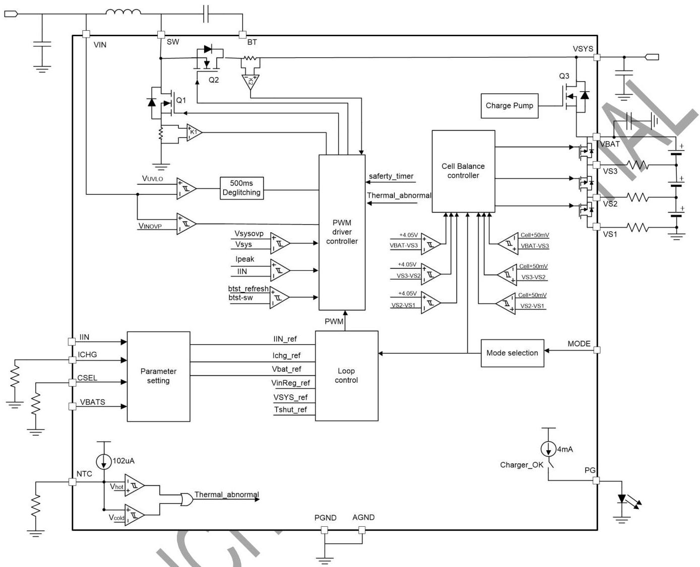

# 10 Feature Description

## 10.1 UVLO and Shutdown Mode

The SC8922 is in shutdown when its input voltage is lower than $V_{\text{UVLO}}$ threshold. After VIN rises above the UVLO threshold, the IC exits shut down mode to provide power to the system connected at VSYS pin and also charge the battery cells.

When in shutdown mode, if VBAT is higher than the depletion threshold $V_{\text{DPL}}$ (typical 5V), the Q3 is fully turned on, so VSYS voltage equals to battery voltage, and the battery can supply the system connected at VSYS pin directly. However, if VBAT is below $V_{\text{DPL}}$, the Q3 will be turned off to disconnect the system from battery. In this case, there is still a path from battery to VSYS pin through the body diode of Q3, and VSYS equals to VBAT - 0.7V.

## 10.2 Soft-Start

After VIN rises above UVLO threshold, there is a 500ms debounce time before the IC starts operation. During the debounce time, there are two scenarios as below:

1. If VBAT is higher than the trickle charge threshold $V_{\text{TRK}}$, the IC keeps Q3 fully on, so the VSYS voltage equals to VBAT.
2. If VBAT is lower than $V_{\text{TRK}}$, the IC enables supplement mode, the VSYS voltage equals to VBAT - 30mV.

After the 500ms debounce time expires, the IC starts switching and charges the battery in CC mode or CV mode. If VBAT is higher than $V_{\text{TRK}}$, if VBAT is lower than $V_{\text{TRK}}$, the IC ramps up the VSYS to 6V first, then it turns on Q3 in linear mode to work in trickle charging mode.

The SC8922 integrates an internal soft start circuit which controls the ramp up of the VSYS output and the charge current to the battery cells, preventing inrush current during start-up.

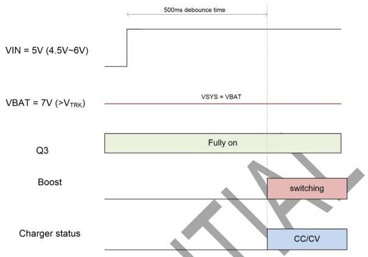
Figure 1 Startup with VBAT &gt; VTRK

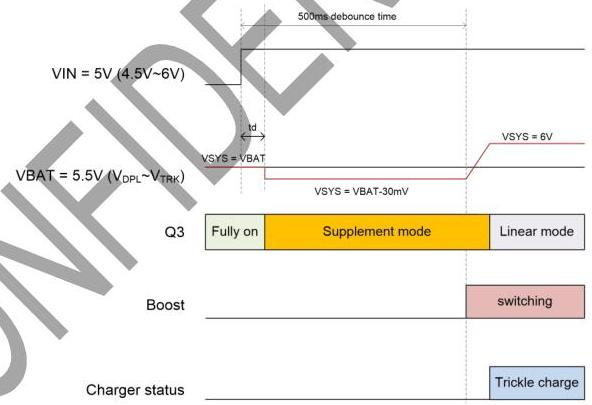
Figure 2 Startup with VBAT &lt; VTRK

## 10.3 Charge management

The SC8922 provides charge management functions for 2~3-cell Li-ion battery. The typical charge profile is shown in Figure 3.

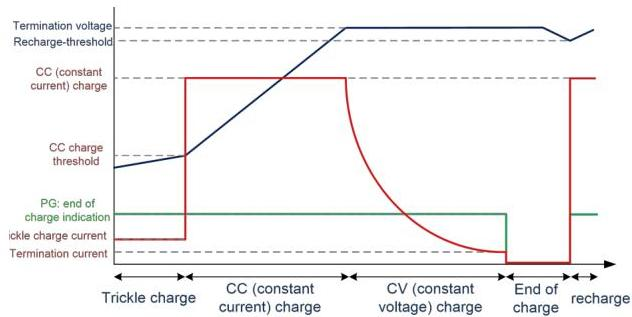
Figure 3 Typical charge profile

## 10.3.1 Trickle Charge

When VBAT is lower than $V_{\text{TRK}}$, the SC8922 charges the battery cells in trickle charge mode. In this mode, VSYS is regulated at 6V, and Q3 is turned on and works in linear

mode. The charge current through Q3 is monitored and regulated at 1/10 of the constant charge current programmed by ICHG pin.

If the 1/10 of the CC current is higher than 200mA, the trickle charge current will be clamped to 200mA.

## 10.3.2 Constant Current (CC) Charge

When VBAT voltage is charged above $V_{\mathrm{TRK}}$, the SC8922 enters into constant charge (CC) mode. In this mode, the Q3 is fully turned on. The IC monitors Q3 current, and controls the switching duty cycle so to regulate the Q3 current at the CC value programmed by ICHG pin.

## 10.3.3 Constant Voltage (CV) Charge

The SC8922 operates in constant voltage (CV) mode after VBAT exceeds 98% of the termination voltage target VBAT_TRGT. In CV mode, the Q3 is kept fully on, and the battery voltage is regulated at VBAT_TRGT. The charge current automatically drops until the battery is fully charged.

The battery target voltage can be configured through an external resistor at CSEL pin. Below table shows the relationship between the CSEL resistor value and the VBAT target voltage.

Table 1 CSEL pin to set VBAT target voltage

|  CSEL Resistor Value | VBAT target voltage  |
| --- | --- |
|  Open | 8.4V  |
|  300 kΩ | 8.6V  |
|  150 kΩ | 8.7V  |
|  80 kΩ | 8.8V  |
|  40 kΩ | 13.2V  |
|  20 kΩ | 13.05V  |
|  10 kΩ | 12.9V  |
|  0 | 12.6V  |

## 10.3.4 Charge Termination / End of Charge

When below three conditions are valid, the SC8922 recognizes the battery cells are fully charged:

1) Termination voltage: the VBAT voltage is higher than 98% of VBAT_TRGT
2) Termination current: the Q3 Charge current is lower than 1/10 of the CC value programmed by ICHG pin or 200mA (same as trickle charge current).

When above three conditions are met together, the SC8922 outputs high impedance at PG pin, so the LED connected at PG pin is off, indicating the end of charge (EOC).

The cell balance status or battery cell OV (over voltage) status is disabled after EOC.

If auto-termination mode is selected, the IC turns off Q3, so to terminate the battery charging. Meantime, it regulates VSYS at VBAT_TRGT + 200mV, keeping supplying current for the system operation.

The IC draws quiescent current from VSYS pin after EOC no matter it is in no-termination mode or auto-termination mode.

## 10.3.5 Recharge

After EOC, the SC8922 still monitors VBAT voltage. Once it detects the battery voltage falls below 96% of VBAT_TRGT, it turns on Q3 and returns to CC mode again.

## 10.4 Charging Status Indication

When the SC8922 charges the battery in trickle charge/CC charge/CV charge mode, the PG pin outputs logic high, so the LED connected at PG pin is turned on, indicating the charging is in process.

After the EOC conditions are met, the PG pin outputs high impedance, indicating the battery cells are fully charged.

If the battery voltage drops below the recharge threshold $V_{\mathrm{RECH}}$, the LED will be turned on again.

|  PG status | IC working status  |
| --- | --- |
|  High logic | Normal charging, Cell Balancing  |
|  High impedance | End of charge, Not charging (VIN< VUVLO, NTC over/under temperature)  |
|  Flashes at 1 Hz | VIN OVP, Battery reverse plug-in  |

## 10.5 Constant Charge Current Programming

The constant charge current can be programmed by ICHG pin as below:

$$
\mathrm {I C C} = \mathrm {K} \cdot \frac {\mathrm {V R E F}}{\mathrm {R I C H G}}
$$

Where,

ICC is the programmed constant charge current

VREF is the internal reference voltage, 1.2V

RICHG is the resistor connected at ICHG pin

K = 10 000

If the ICHG pin is short to ground, the constant charge current is infinite. In this case, the SC8922 relies on input current limit and the internal peak current limit to protect the chip. Accordingly, the IC will set the trickle charge and charge termination current to 200mA internally.

## 10.6 Charge Current Sense

The ICHG pin's voltage is proportional to the Q3 current, so the user can monitor the Q3 charge current through ICHG pin as below:

$$
I Q 3 = K \cdot \frac {V I C H G}{R I C H G}
$$

Where,

IQ3 is the charge current through Q3

VICHG is the voltage at ICHG pin

RICHG is the resistor connected at ICHG pin

K = 10 000

## 10.7 Input Current Limit

The SC8922 supports input current limit function, and the limit can be selected by IIN pin as below.

Table 2 Input current selection

|  IIN input | Input current limit  |
| --- | --- |
|  Logic low | 3A  |
|  Float | 2A  |
|  Logic high | Infinite  |

The IC monitors the input current during operation. Once it detects the input current exceeds the limit, the IC reduces the switching cycle and regulates the input current at the setting value.

## 10.8 Adaptive Input Current Limit

Besides the input current limit function, the SC8922 supports adaptive input current limit function (VINREG function) to prevent overloading the input adapter.

If the external adapter has smaller current capability than the current the IC draws, IC's VIN voltage will be pulled down. Once the IC detects VIN is pulled below 4.5V, which indicates the adapter can't supply required current, the IC reduces the input current automatically. The input current is reduced to a value which can keep adapter output at 4.5V, so to prevent the adapter from overloading further. This is called adaptive input current limit function or VINREG function.

If the adapter current capability is very low, the IC may enter into burst mode during this operation.

## 10.9 Supplement Operation

The input power from adapter not only charges the battery but also supplies current for the system operation at VSYS pin.

If the system draws very heavy load, the input current satisfies system first, and the extra current charges the battery. In this case, the IC operates in the input current limit or VINREG status.

If the system needs more power than what input can supply, the VSYS voltage will be pulled down by the load. In this case, the Q3 keeps fully on, so the battery is discharged through Q3 to supply the system, and VSYS is equal to VBAT;

When in EOC status with Q3 off (auto-termination mode), VSYS is regulated at VBAT_TRGT+200mV. The Q3 will be turned on when VSYS is pulled lower than VBAT, so to supplement the current to system. In this case, the Q3 gate is regulated so that the minimum Q3 VDS stays at 30 mV when the current is low. This prevents oscillation from entering and exiting the mode. As the discharge current increases, the Q3 gate is regulated with a higher voltage to reduce its $R_{DS(ON)}$ until the Q3 is in full conduction. At this point onwards, the Q3 VDS linearly increases with discharge current.

## 10.10 Cell Balance

When the MODE pin is pulled high or low, cell balance function is enabled.

Table 3 Mode selection

|  MODE input | Cell balance | Termination  |
| --- | --- | --- |
|  Float | Disabled | Auto-termination  |
|  Logic low | Enabled | Auto-termination  |

When the cell-balance function is enabled, the SC8922 keeps monitoring each cell voltage through VSx pins. Once it detects there is one or more cells voltages are above 4.05V, but there is another or more cells voltage below 4.05V, it turns on the cell discharging paths for the cells above 4.05V. The cell balance will be deactivated when

1. all cells' voltages are above 4.05V, or
2. all cells' voltages are below 4.05V

The balance discharge path will also be turned on when any cell's voltage is detected higher than OVP threshold (50mV higher than the termination target voltage). External resistors are necessary as below to control the discharging current. 10~100Ω resistors (1206 footprint) are suggested for each cell as below:

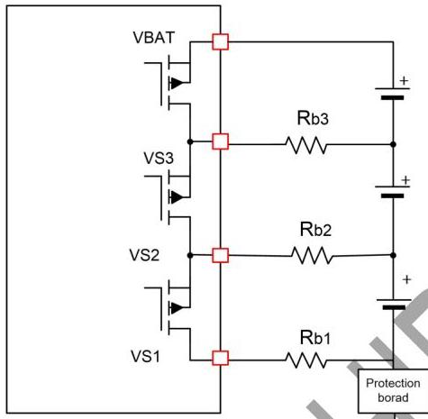
Figure 4 Cell balance circuit

Balance current of each cell can be calculated as follow:

$$
I b 3 = \frac {V c e l l 3}{R b 3 + R d s o n}
$$

$$
I b 2 = \frac {V c e l l 2}{2 * R b 2 + R d s o n}
$$

$$
I b 1 = \frac {V c e l l 1}{2 * R b 1 + R d s o n}
$$

Where,

- Vcellx is voltage of OV cell.
- Ibx is balance current.
- Rbx is balance resistor.
- Rdson is conducting resistance of internal FETs.

Cell balance is disabled after termination;

Cell balance is disabled after VIN drops below UVLO or VBAT drops below POR (Three cells is 7.5V and two cells is 5V).

If MODE is left floating to disable the cell balance function, VS3/VS2/VS1 can be floating.

If larger cell balance current is required to accelerate balance time, external mosfet can be used to enhance balance effect.

PMOS can be used in 2 cells applications. Balance current is mainly decided by external resistor Rbx. The Vth of PMOS should be lower than -2V, to ensure balance circuit work normally. What's more, larger balance current may cause thermal issues, so Rbx resistor must be carefully chosen to satisfy requirement of system heat dissipation. Balance current of each cell can be calculated as follow:

$$
I b x = \frac {V c e l l}{R b x}
$$

Where,

Rbx is the external resistor of each balance path. 1kΩ is recommended value for Rx.

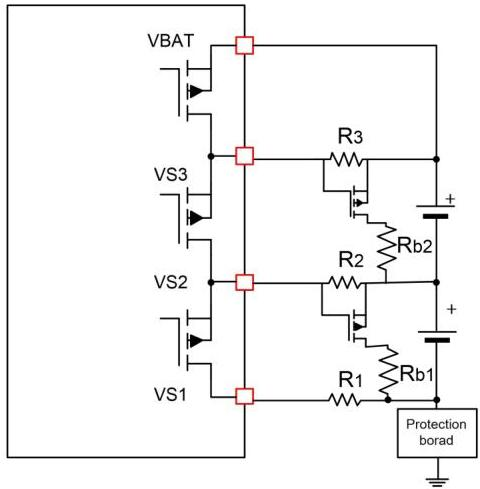
Figure 5 PMOS for 2 Cells balance circuit

Similarly, NMOS can be also used in 2 cells applications. The Vth of NMOS should be lower than 2V.

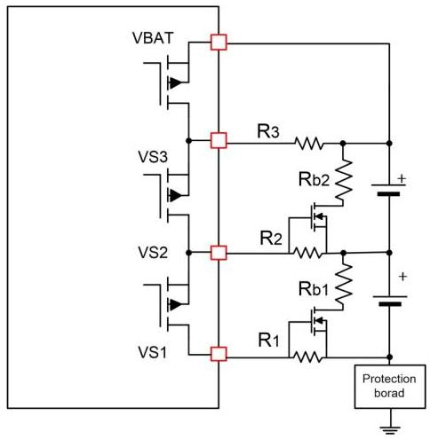
Figure 6 NMOS for 2 Cells balance circuit

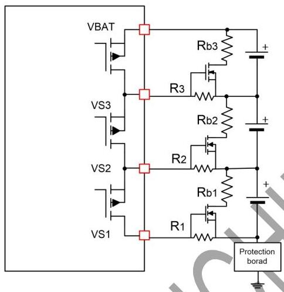
Figure 7 NMOS for 3 Cells balance circuit

# 10.11 VBAT Over Voltage Protection

With the cell balance enabled, the SPIDERMAN monitors each cell's voltage through VSx pins. Once it detects any cell's voltage is 50mV higher than the termination target voltage, it stops charging and turns on the discharging path for that cell. Only when the cell's voltage drops below the OVP threshold, the IC recharges the battery cells again.

# 10.12 Input Over Voltage Protection

Besides under voltage protection, the SC8922 also supports input over voltage protection. Once the IC detects the input voltage is higher than 6V, it stops switching, turns off Q3 and PG flashes at 1Hz. After the input voltage drops below the threshold, it resumes the normal operation.

# 10.13 VSYS Over Voltage Protection

The SC8922 monitors VSYS voltage during the operation. Once it detects the VSYS is higher 110% of the target voltage, over voltage protection will be triggered, and the IC stops switching at once. After the VSYS voltage drops below 103% of the target, it resumes switching. Q3 status will not be affected by VSYS OVP.

# 10.14 VBAT Short Circuit Protection

Once the IC detects the VBAT voltage drops below 2V, the short circuit protection is triggered. The IC turns on Q3 in linear mode and regulates the short current to 200mA. Meantime, the IC regulates the VSYS at 6V.

After the short circuit fault is removed, the VBAT voltage is charged up. When VBAT voltage is higher than the short circuit threshold, the IC returns to normal operation.

# 10.15 Safety Timer

When the IC starts charging (VIN above VINREG threshold), a 24-hours safety timer is initiated. Once it detects EOC condition, the IC clears the timer, and it doesn't restart the timer unless recharge phase starts, or VIN toggle happens.

If the charging cycle doesn't end when the timer expires, the IC will transition to shutdown mode. In this case, the IC will only restart the timer after VIN toggles.

# 10.16 NTC

The SC8922 monitors the battery cells' temperature through NTC pin once VIN is above ULVO threshold. It sources 102 µA current to NTC pin and monitor the NTC voltage. Once it detects the temperature is below -5°C or higher than 45°C, the IC transitions to shutdown mode. Below shows the NTC operation summary. NTC function can be also disabled through shorting the pin to ground.

Table 4 NTC operation

|  V_{NTC} | Temperature | Operation  |
| --- | --- | --- |
|  V_{NTC} > V_{COLD} | T < -5°C | Stop charging  |
|  V_{HOT} < V_{NTC} < V_{COLD} | -5°C < T < 45°C | Normal charging  |
|  V_{DISNTC} < V_{NTC} < V_{HOT} | T > 45°C | Stop charging  |

# 10.17 Thermal shutdown

Once the SC8922 detects the junction temperature rises

above 165°C, it shuts down the whole chip. When the temperature falls below 135°C, the chip is enabled again.

# 11 Application information (TBD)

# 11.1 NTC Resistor Selection

SC8922 continuously monitors battery temperature by measuring the NTC voltage. An internal 102uA current source provides the bias for NTC thermistors. The device compares the NTC pin voltage  $V_{\mathrm{NTC}}$  with the internal  $V_{\mathrm{COLD}}$  and  $V_{\mathrm{HOT}}$  thresholds (refer to electrical characteristics) to determine whether charging is allowed.

$$
R \text {c o l d} = \frac {V \text {c o l d}}{1 0 2 u A} = 2 4. 6 k \Omega
$$

$$
R h o t = \frac {V h o t}{1 0 2 u A} = 4. 6 k \Omega
$$

With a 103AT-type thermistor, the default charger operating temperature range is  $3^{\circ}\mathrm{C}$  to  $45^{\circ}\mathrm{C}$ .

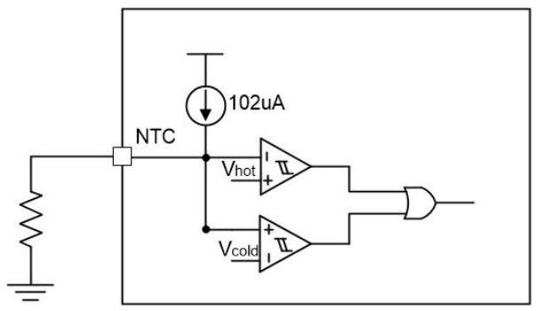

The external resistor can be used to change charger operating temperature range. For example, in order to change operating temperature to  $0^{\circ}\mathrm{C}$  to  $60^{\circ}\mathrm{C}$ .

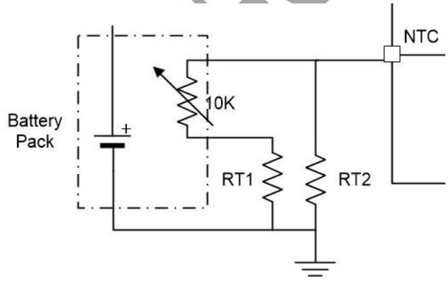
Figure 9 Threshold changed by external resistor

$$
\frac {\left(\mathrm {R} _ {0} ^ {\circ \mathrm {C}} + \mathrm {R T 1}\right) * \mathrm {R T 2}}{\mathrm {R} _ {- 0} ^ {\circ \mathrm {C}} + \mathrm {R T 1} + \mathrm {R T 2}} = 2 4. 6 k \Omega
$$

$$
\frac {\left(\mathrm {R} _ {5 0} ^ {\circ \mathrm {C}} + \mathrm {R T 1}\right) * \mathrm {R T 2}}{\mathrm {R} _ {- 5 0} ^ {\circ \mathrm {C}} + \mathrm {R T 1} + \mathrm {R T 2}} = 4. 6 k \Omega
$$

For a 103AT-type thermistor,  $\mathrm{R}_{-0}^{\circ}\mathrm{C} = 28.71\mathrm{k}\Omega$ ,  $\mathrm{R}_{-50}^{\circ}\mathrm{C} = 2.99\mathrm{k}\Omega$ . so RT1 and RT2 is calculated:

$$
\mathrm {R T 1} = 1. 9 k \Omega
$$

$$
\mathrm {R T 2} = 7 6. 9 k \Omega
$$

Besides, NTC pin can be used as enable pin function alternatively. The reference circuit is as follow:

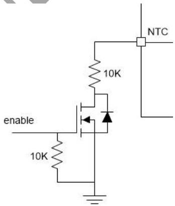
Figure 8 Default NTC thresholds
Figure 10 NTC pin used as enable function

# 11.2 Capacitor Selection

Since MLCC ceramic capacitor has good high frequency filtering with low ESR, above  $22\mu \mathrm{F}$  X5R or X7R capacitors with higher voltage rating then operating voltage with margin is recommended. For example, if the highest operating Vin voltage is 6V, select at least 10V capacitor and to secure enough margin, 16V voltage rating capacitor is recommended.

The high capacitance polymer capacitor or tantalum capacitor can be used for input and output, but capacitor voltage rating must be higher than the highest operating voltage with enough margin. The recommended capacitance polymer capacitor is at least  $100\mathrm{uF}$  to ensure loop stability. The high frequency characteristics of these capacitors are not as good as ceramic capacitor, so at least  $10\mu \mathrm{F}$  ceramic capacitor should be placed in parallel

to reduce high frequency ripple.

# 11.3 Inductor Selection

1 μH to 3.3 μH inductor is recommended for loop stability. Choose the inductance to provide the desired ripple current. The current ripple is calculated as:

$$
I _ {r i p p l e} = \frac {V _ {I N} * (V _ {O U T} - V _ {I N})}{V _ {O U T} * F _ {S W} * L}
$$

It is suggested to choose inductor ensure the ripple current to be about 40% of the average input current $I_{IN}$.

When selecting inductor, the inductor saturation current must be higher than the peak inductor current with enough margin (20% margin is recommended).

$$
I _ {\text {p e a k}} = I _ {I N} + \frac {V _ {I N} \times \left(V _ {O U T} - V _ {I N}\right)}{2 \cdot F _ {S W} \cdot L \cdot V _ {O U T}}
$$

Where IIN is the input current, and can be calculated as:

$$
I _ {I N} = \frac {V _ {O U T} \cdot I c h g}{V _ {I N} \cdot \eta}
$$

η is the efficiency of boost converter.

The inductor DC resistance value (DCR) affects the conduction loss of switching regulator, so low DCR inductor is recommended especially for high power application. The conductor loss of inductor can be calculated roughly as:

$$
P L _ {D C} = I _ {I N} ^ {2} * D C R
$$

IIN is the average value of inductor current.

# 11.4 Layout Guide

1. The capacitors connected at VIN/VSYS/VBAT pins should be placed near the IC, and their ground connection to the ground pins should be as short as possible. Especially VSYS capacitor must be placed carefully to ensure better performance.

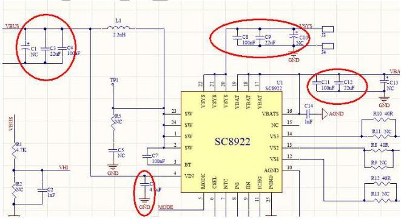
a. component(s) on schematic:

b. Layout example: put the input and output capacitors near IC but on the bottom layer. Connect the capacitors to each pin through vias and connect the capacitors to ground pins by the ground pour.

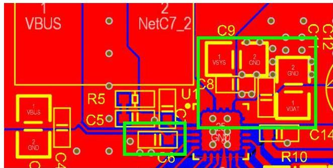

2. It is suggested that PGND and AGND are connected at the PGND pad under IC.

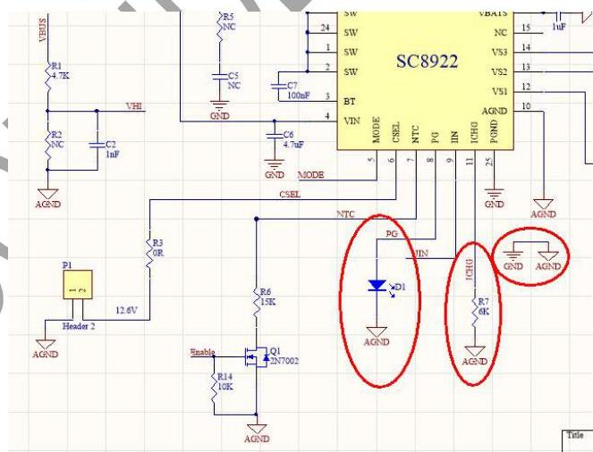
a. component(s) on schematic:

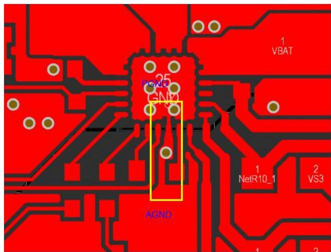
b. Layout example:

3. The cell balance path wire should be at least 10mil to endure cell balance current.

# 12. MECHANICAL DATA

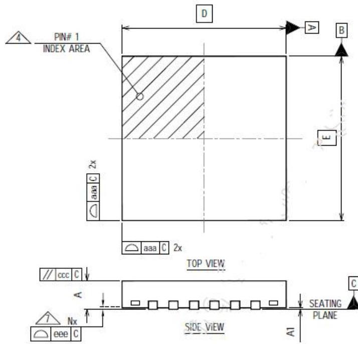
QFN (4mmx4mmx0.75mm)

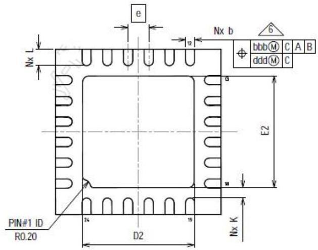

|  Dimension Table  |   |   |   |   |
| --- | --- | --- | --- | --- |
|  Parameter | V |   |   | NOTE  |
|   |  MINIMUM | NOMINAL | MAXIMUM  |   |
|  A | 0.80 | 0.90 | 1.00 |   |
|  A1 | 0.00 | 0.02 | 0.05 |   |
|  b | 0.18 | 0.25 | 0.30 | 6  |
|  D | 4.00 BSC |   |   |   |
|  E | 4.00 BSC |   |   |   |
|  e | 0.50 BSC |   |   |   |
|  D2 | 2.55 | 2.70 | 2.80 |   |
|  E2 | 2.55 | 2.70 | 2.80 |   |
|  K | 0.15 | --- | --- |   |
|  L | 0.30 | 0.40 | 0.50 |   |
|  aaa | 0.05 |   |   |   |
|  bbb | 0.10 |   |   |   |
|  ccc | 0.10 |   |   |   |
|  ddd | 0.05 |   |   |   |
|  eee | 0.08 |   |   |   |
|  N | 24 |   |   | 3  |
|  ND | 6 |   |   | 5  |
|  NE | 6 |   |   | 5  |
|  NOTES | 1, 2 |   |   |   |
|  LF PART NO. | 439692 |   |   |   |
|  LF DWG. NO. | CARSEM-07357 |   |   |   |
|  REV. | A |   |   |   |

